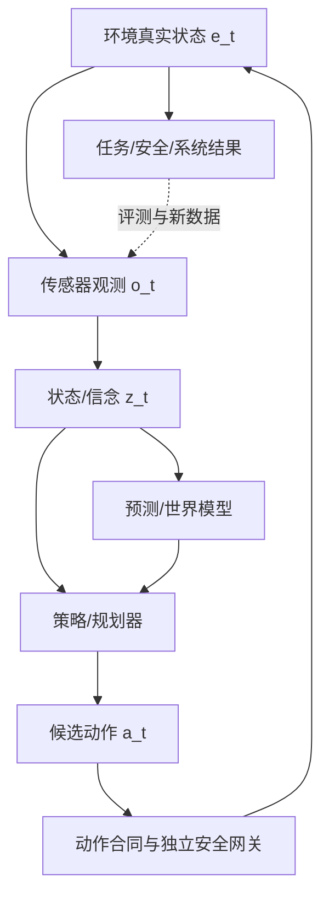

# 第1章 从“看见”到“行动”

## 本章契约

### 核心问题

为什么分类、检测、分割或视频预测的离线分数不能直接代表机器人和车辆的闭环能力？从计算机视觉（Computer Vision, CV）走向具身智能，最少要补上哪些状态、动作、反馈、时序、评测和安全概念？没有 3D 视觉、机器人学或强化学习（Reinforcement Learning, RL）经验，应该怎样读这本书？

### 先修知识

- 已具备：能读懂常见 CV 模型、Python 代码和基本训练/评测流程即可；
- 本章补齐：开环与闭环、policy-induced distribution shift、部分可观测性、时延与安全边界，以及全书路线；
- 不要求：3D 几何、控制、RL、仿真器、GPU 或硬件。

### 非目标

- 不在导论中提前推导 RSSM、actor-critic、扩散策略或车辆动力学；
- 不把 实验 1-1<!-- INTERNAL_ASSET_ID: EXP-01-01 --> 称为物理 controller 性能、安全或部署实验；
- 不许诺读完即可部署机器人或自动驾驶系统；
- 不要求按章节编号一次读完所有支线。

### 学完后的可验证产出

读者应能画出观测—状态估计—预测—决策—动作—环境反馈闭环，指出离线 CV 指标缺失的动作和后果，解释两组相同逐帧误差为什么可能有不同闭环结局，说明反馈为何能纠偏以及观测时延、动作限幅为何会破坏这种能力，并选择适合自己的阅读与实验路径。

## 1.1 CV 模型通常停在“输出”处

典型监督视觉任务从冻结数据集采样输入 $x$，模型输出 $\hat y$，与标签 $y$ 比较：

\[
\hat y=f_\theta(x),\qquad \text{metric}(\hat y,y).
\]

模型预测不会改变数据集中下一张图片。即使视频任务保留时间，模型输出通常也不会反过来改变摄像机、对象或之后的样本分布。

具身系统不同。策略（policy）从观测或内部信念产生动作，环境因动作变化，再产生后续观测：

\[
o_t\rightarrow z_t\rightarrow a_t\rightarrow e_{t+1}\rightarrow o_{t+1}.
\]

其中 $e_t$ 是真实环境状态，通常不能完全看见；$o_t$ 是传感器观测；$z_t$ 是模型内部的潜在状态或表征；$a_t$ 是交给环境或下层控制器的动作。只有当 $z_t$ 根据观测历史表达了对隐藏环境状态的任务相关估计时，本书才把它进一步称为信念状态。换言之，任意中间特征都可以是表征，却不自动成为状态，更不自动成为信念。

<!-- CLAIM_META: CLAIM-01-01 fact -->
开环视觉任务中模型输出通常不改变后续测试输入；闭环系统中动作会改变环境和未来观测，因此错误的时间相关性、可恢复性和后果与逐帧平均误差同样重要。



*图 1-1：全书闭环地图。来源：本书原创，CC BY-NC 4.0，2026-08-31。世界模型可以帮助决策，但动作仍经过独立网关。*<!-- INTERNAL_ASSET_ID: FIG-01-01 -->

## 1.2 把 dataset shift 扩展为 policy-induced shift

CV 工程师熟悉训练/测试域偏移；闭环还增加 policy-induced distribution shift：当前动作决定系统接下来会看到什么。策略轻微偏离示范后，可能进入训练集中很少出现的姿态、遮挡、速度或接触状态，下一步误差继续增大。

| 维度 | 离线 CV 常见设置 | 具身闭环额外问题 |
| --- | --- | --- |
| 样本 | 图片/clip 近似冻结 | trajectory 内动作改变后续样本 |
| 标签 | 类别、框、mask、深度 | state、action、reward、termination、事件 |
| 分布偏移 | train/test domain | policy 自己诱导新 state/action 分布 |
| 指标 | 平均准确率/误差 | 任务 outcome、碰撞、恢复、干预、尾延迟 |
| 失败 | 单样本预测错 | 错误累积、不可恢复状态、超时和执行越界 |

部分可观测性使问题更难：同一单帧可能对应不同速度、遮挡对象或任务阶段。第3章从零解释部分可观测马尔可夫决策过程（POMDP），第6章再用循环状态把历史压入 belief/latent；读者不需要现在掌握公式。

[DAgger](https://arxiv.org/abs/1011.0686)是理解 imitation learning 分布偏移的经典论文锚点 `[P,R1]`：它把学习策略诱导的状态分布纳入数据收集。该思想不表示所有问题都要在线向专家查询，也不能绕过真实交互成本和安全约束。

## 1.3 相同 MAE，不同后果（实验 1-1<!-- INTERNAL_ASSET_ID: EXP-01-01 -->）

fixture 把视觉/策略误差抽象成施加到单位增益标量系统的 residual action。两组五步 residual 的绝对值都为 0.1：一组持续同号，另一组正负交替。

<details markdown="1">
<summary>可选：验证本章证据</summary>

```bash
make ch01-test-local
make ch01-smoke-local
make ch01-smoke
```

</details>

| 序列 | 逐步 residual MAE | 最终 lateral state | 最大绝对 state | 是否越过 0.3 教学边界 |
| --- | ---: | ---: | ---: | --- |
| `[0.1,0.1,0.1,0.1,0.1]` | 0.1 | 0.5 | 0.5 | 是，第 4 步 |
| `[0.1,-0.1,0.1,-0.1,0.1]` | 0.1 | 0.1 | 0.1 | 否 |

*表 1-1：实验 1-1 的固定结果。lateral state、action 和边界均无物理单位；不是车辆横向控制结果。*<!-- INTERNAL_ASSET_ID: TAB-01-01 -->

<!-- CLAIM_META: CLAIM-01-02 result -->
两组手工 residual 的离线 MAE gap 为 0，但积分后的 final-state gap 为 0.4，且只有持续误差越过固定边界。它证明逐步 MAE 不能唯一决定这个 fixture 的时序后果，不证明真实误差一定线性累积。

首次测试还暴露了一个工程细节：二进制浮点的 `0.1+0.1+0.1` 会略大于 `0.3`。代码对边界比较加入明确容差，避免数值表示把“等于边界”误判为“超过边界”。真实系统也必须规定单位、精度、inclusive/exclusive 规则和安全裕量。

### 1.3.1 反馈能纠偏，但不能绕过时延和动作权限

前一个反例只有 residual 积分，还没有 controller。为了补上最小反馈概念，fixture 增加一个与任何机器人或车辆都不绑定的标量系统：

\[
x_{t+1}=x_t+u_t+d_t,\qquad
u_t=\operatorname{clip}(-k\tilde{x}_t,-u_{\max},u_{\max}).
\]

这里 $d_t$ 是每步固定为 $0.1$ 的外部扰动，$\tilde{x}_t$ 是 controller 实际拿到的当前或延迟 state，$k$ 是比例增益，$u_{\max}$ 是动作权限。这个式子只回答三个机制问题：及时观测下的负反馈能否抵消持续扰动；旧观测会不会让动作落后；动作权限不足时 controller 是否只能持续饱和。MIT Underactuated Robotics 的 [Output Feedback](https://underactuated.mit.edu/output_feedback.html) 讲义强调实际决策依赖 measurement 而非不可直接获得的真实 state，estimator dynamics 也会进入闭环；其 [torque-limited pendulum](https://underactuated.mit.edu/pend.html) 例子则展示 actuator limit 会约束可实现的控制。它们为机制提供课程级来源，但不是本 fixture 数值的外部验证。

| case | $k$ | 观测时延 | $u_{\max}$ | 最大 $|x|$ | 最终 $x$ | 首次越过 0.3 / 饱和步数 |
| --- | ---: | ---: | ---: | ---: | ---: | --- |
| open loop | 0.0 | 0 | 0.25 | 1.2000 | 1.2000 | 第 4 步 / 0 |
| timely feedback | 0.8 | 0 | 0.25 | 0.1250 | 0.1250 | 未越界 / 0 |
| delayed feedback | 0.8 | 2 | 0.25 | 0.4076 | 0.4076 | 第 4 步 / 1 |
| authority-limited feedback | 0.8 | 0 | 0.05 | 0.6500 | 0.6500 | 第 6 步 / 11 |

*表 1-2：实验 1-1 的 12 步固定反馈结果。越界定义为 $|x|>0.3$；恰好等于 0.3 不算越界。state、disturbance 和 action 都无物理单位。*<!-- INTERNAL_ASSET_ID: TAB-01-02 -->

<!-- CLAIM_META: CLAIM-01-06 result -->
在这组固定 12 步标量 fixture 中，及时无饱和反馈把最大绝对 state 从 open-loop 的 1.2 限制到约 0.125；把观测延迟两步后最大值为 0.4076 并越界，把动作限幅降到 0.05 后最大值为 0.65 且 11 步饱和。该结果只证明反馈效果依赖观测新鲜度和动作权限，不证明一般 closed-loop stability、真实 controller 收敛性或物理安全收益。

### 1.3.2 终态相同不能抹去中途越界

只报告 rollout 最终 state 还会丢失路径信息。v3 固定两条八步扰动序列，它们都含五个 `-0.1` 和三个 `+0.1`，因此长度、元素 multiset 与平均绝对扰动完全相同；controller 也固定为 `k=0.8`、两步观测延迟和 `u_max=0.25`。只交换第 7、8 步扰动顺序，就得到相同终态和不同瞬态：

| 扰动顺序 | 最终 state | 最大绝对 state | 严格 `|x|>0.3` |
| --- | ---: | ---: | --- |
| `[-,-,-,+,+,-,-,+] × 0.1` | 0.264 | 0.300 | 否；只触及边界 |
| `[-,-,-,+,+,-,+,-] × 0.1` | 0.264 | 0.476 | 是；第 7 步 |

*表 1-3：实验 1-1 v3 的 terminal-state aliasing 负对照。符号序列表示无单位手工扰动，不是道路、机器人或执行器轨迹。*<!-- INTERNAL_ASSET_ID: TAB-01-03 -->

<!-- CLAIM_META: CLAIM-01-07 result -->
在固定八步无单位标量 fixture 中，两条扰动序列具有相同元素 multiset、平均绝对扰动 0.1 和最终 state 0.264；边界触及序列的最大绝对 state 为 0.3、按严格规则不越界，重排序列在第 7 步达到 0.476 并越界。它只证明终态与扰动边际统计不能恢复这段有限轨迹的瞬态后果，不估计真实扰动分布、控制稳定性、恢复能力、碰撞风险或物理安全。

无时延且未饱和时，固定点满足 $x^*=d/k=0.125$，这解释了 timely feedback 的残余偏差。delayed case 的 12 步轨迹只是一个有限时域反例，未做特征根或 Lyapunov 分析时不要把它改写成“系统不稳定”；authority-limited case 则表明命令方向正确也不等于执行权限充足。后续第7章讨论重规划，第19章讨论仿真合同，第21章再把时延、deadline、fallback 和独立安全网关接入系统证据。

## 1.4 两个贯穿案例

### 机械臂抓取

离线检测器可能把杯子框得很准，但抓取还需要深度、相机—机器人 frame、对象姿态、夹爪可达性、碰撞、接触和抓取后的状态更新。若第一次接触推走杯子，下一帧不再来自原数据分布；策略必须观察、判断是否抓住并恢复。

本书在第3章补最小几何/运动学，第12章讨论 occupancy/affordance，第13–16章讨论动作策略与本体适配，第19–21章讨论仿真、评测和部署。无需先学完整机器人学才能开始。

### 自动驾驶

离线车道线、3D 检测或轨迹误差不能单独回答：车辆是否碰撞、越界、违反规则，规划是否超时，传感器故障时是否进入最小风险状态。转向和制动还会改变相机视角、相对速度与其他交通参与者的反应。

<!-- CLAIM_META: CLAIM-01-03 recommendation -->
自动驾驶感知/预测输出只能作为状态和候选后果的证据；任何控制必须继续经过车辆动力学、道路边界、occupancy/碰撞、时效、控制限幅和最小风险网关，并以独立闭环协议验收。

自动驾驶不是独立附录：第4章写日志切分，第6–9章写 latent rollout/规划/评测，第11–12章写动作条件未来和 BEV/occupancy，第17–18章写世界模型与后训练，第19–21章写 MetaDrive/CARLA、指标和部署。

## 1.5 全书七部分怎样连接

1. **第1–4章：建立闭环语言。** 定义世界模型、补最小机器人学/决策并固定数据与实验合同。
2. **第5–9章：学习可用于决策的世界。** 从生成基础、RSSM、规划到 Dreamer 和用途驱动评测。
3. **第10–12章：可扩展表征。** JEPA、动作条件视频与可行动空间；第12章才正式进入必要 3D。
4. **第13–16章：从表征到动作。** 模仿学习、生成动作、VLA 架构与跨本体适配。
5. **第17–18章：融合与后训练。** 世界模型怎样帮助或欺骗策略，以及长时 VLA/WAM。
6. **第19–21章：系统证据。** 物理仿真、评测、实时性、故障和安全边界。
7. **第22章：综合项目。** 用同一证据链完成一个可审计闭环，而不是只交 demo。

世界模型不是全书唯一主角。一个项目可以不用生成像素，也可以先用已知 simulator；关键是观测、状态、动作、未来、目标和外部真值之间的合同是否明确。

## 1.6 三条阅读路线

本书可以顺序阅读，也可以按世界模型与控制、VLA与策略、系统与自动驾驶三类目标选读。具体章节顺序、可暂缓主题和两个贯穿案例统一维护在[全书阅读地图](../reading-map.md)，本章不再复制一张容易随章节修订失同步的路线表。

三条路线共享同一条最低知识链：先区分观测、状态、动作与闭环，再理解数据和证据边界，最后才讨论模型、策略或部署结论。选读意味着调整学习顺序，不意味着安全、评测或真实环境锚点可以被删除；任何路线进入具体系统判断时，都应回到阅读地图列出的前置接口。

<!-- CLAIM_META: CLAIM-01-04 recommendation -->
没有 3D 视觉经验不妨碍阅读第1–11章；第3章提供像素—深度—点云—frame 最小桥接，第12章再从二维射线和三态 occupancy 进入空间表征。遇到 NeRF/3DGS 可先按 renderer/representation 接口理解，不必先完成多视图几何课程。

若想系统补基础，可使用开放教材 [Modern Robotics](https://modernrobotics.northwestern.edu/)、[MIT Robotic Manipulation](https://manipulation.csail.mit.edu/) 和 [Reinforcement Learning: An Introduction](http://incompleteideas.net/book/the-book-2nd.html)。它们是延伸路线，不是本书 S 档实验的安装依赖。

## 1.7 如何读“证据”和“完成”

正文关键结论分为 `fact`、`result`、`inference`、`recommendation` 和 `unverified`。外部资产用来源成熟度 `P/A/O/V/T` 与复现状态 `R0–R4` 两个维度；论文发表、GitHub 仓库存在或产品演示都不自动等于本书复现。

为了让概念学习不依赖专用硬件，本书把证据扩展分为 `S/M/L1/L2`，统一定义见[读者术语表](../glossary.md)。这些档位描述回答问题所需的证据成本，不是章节难度、方法先进程度或阅读资格；能够用定义、反例和既有证据回答的问题，不应为了“升档”强行训练模型。

<!-- CLAIM_META: CLAIM-01-05 recommendation -->
应先选择能够反驳目标主张的最低充分证据，再决定是否投入数据、仿真或计算资源；资源和授权不明确时，缩小主张比假装完成更可靠。没有目标环境实测时，不得声称训练成本、收敛、样本效率、实时性或部署效果已经得到验证。

## 1.8 失效模式与安全边界

初学者最容易犯的错误是：把 observation 当完整 state，把 VLA 当 world model，把视频生成当 simulator，把 open-loop metric 当 closed-loop outcome，把平均 latency 当 deadline，把 simulator score 当部署安全，以及把“开源”当作代码、权重、数据和许可全部开放。

全书用相同纠偏方法：明确输入输出和 frame/单位/时间，保留外部真值，按用途选指标，记录失败与资源，不让模型动作绕过独立 gate。任何 fixture 的阈值、reward 或规则都只属于其声明作用域。

## 小结

从“看见”到“行动”增加的不是一个 action head，而是一整条反馈和证据链。动作改变未来输入，时序结构和错误后果因此不能被逐帧平均分数替代。

## 练习

1. **概念判断**：一个模型只生成未来视频、没有动作条件或递归交互，它位于 图 1-1<!-- INTERNAL_ASSET_ID: FIG-01-01 --> 哪一段？
2. **代码实验**：保持 MAE=0.1，构造第三组 residual，使最终 state 为 -0.3，并说明边界语义。
3. **迁移分析**：把检测器 5 cm 稳定偏差分别放入抓取和车道保持，列出会放大的状态变量。
4. **阅读计划**：从[阅读地图](../reading-map.md)选择一条路线，为每章写一个可验证产出，不以“读完”作验收。
5. **反馈边界**：推导无时延、未饱和时的固定点 $x^*=d/k$；再解释为什么这个推导不能直接用于两步时延和 $u_{\max}=0.05$ 两种 case。

6. **终态混叠**：保持扰动元素和最终 state 不变，复核 表 1-3<!-- INTERNAL_ASSET_ID: TAB-01-03 --> 为什么只有一条轨迹发生瞬态越界。

## 自检要点

先独立作答，再展开对应条目。自检给的是最低合格要点，不是开放题的唯一答案；涉及代码的题目仍应运行本章命令并保存实际差异。

<details markdown="1">
<summary>自检 1-1：概念判断</summary>

它位于 图 1-1<!-- INTERNAL_ASSET_ID: FIG-01-01 --> 的预测/世界模型一侧：能从历史观测生成一个未来观测，但没有证据表明候选动作能改变未来，也没有策略、动作网关、环境回授或 outcome。合格答案应明确写“有时间预测能力”，同时拒绝由此推出动作反事实、规划或闭环控制能力；不能只回答“是/不是世界模型”。

</details>

<details markdown="1">
<summary>自检 1-2：代码实验</summary>

五步序列可取 `[-0.1,-0.1,0.1,-0.1,-0.1]`：绝对值均为 `0.1`，所以 MAE 仍为 `0.1`，累加得到最终 state `-0.3`。本章边界是严格的 `|state| > 0.3`，因此恰好 `-0.3` 不算越界；若答案写成越界，说明遗漏了 inclusive/exclusive 语义。应在 `test_closed_loop.py` 增加对照并运行 `make ch01-test-local`，不要修改中央结果冒充新基准。

</details>

<details markdown="1">
<summary>自检 1-3：迁移分析</summary>

抓取中，5 cm 偏差会进入相机到基座变换、目标抓取位姿、IK 可达性、夹爪接近方向和接触余量，首次接触还可能推动物体并改变后续观测。车道保持中，同一偏差会进入车辆横向位置/航向估计、轨迹误差和转向反馈，并可能随速度、曲率与时延积累。合格答案至少列出一个“状态怎样被动作再次改变”的闭环放大链，而不是只说两者都会变差。

</details>

<details markdown="1">
<summary>自检 1-4：阅读计划</summary>

每章产出必须能由一个动作验收，例如“画出带 frame/unit 的变换链”“运行 实验 3-1<!-- INTERNAL_ASSET_ID: EXP-03-01 --> 并解释一个失败注入”“为一个系统填四轴卡”“复核一个结果 JSON”。只写“理解 RSSM”或“阅读第6章”不合格。计划还应标明可暂缓的 M/L 实验以及何时回补第3章或第12章的 3D 桥接，避免把购置硬件设为阅读前置。

</details>

<details markdown="1">
<summary>自检 1-5：反馈边界</summary>

无时延、未饱和且扰动固定为 `d` 时，固定点满足 `x*=x*−kx*+d`，所以 `x*=d/k`；本章 `d=0.1,k=0.8` 得 `0.125`。两步时延时动作依赖旧 state，固定点数值本身不能说明有限时域振荡、收敛速度或稳定性；`u_max=0.05<d` 时控制权限不足，无法逐步抵消扰动并会持续饱和。合格答案不能把 12 步反例升级成一般稳定性证明。

</details>

<details markdown="1">
<summary>自检 1-6：终态相同不等于轨迹后果相同</summary>

两条序列都由五个 `-0.1` 与三个 `+0.1` 组成，平均绝对扰动都是0.1；在同一 `k=0.8`、两步时延和 `u_max=0.25` 下，最终 state 也都为0.264。第一条轨迹最远只到 `-0.3`，而本章严格边界要求 `|x|>0.3`，所以不越界；第二条在第7步到0.476，已经产生不能由最终0.264抹去的事件。合格答案应同时报告 trace/峰值/首次越界，而不是只比较终态；也必须说明这仍是有限标量反例，不是稳定性或真实安全证明。

</details>

## 延伸阅读

- Ross et al., [DAgger](https://arxiv.org/abs/1011.0686)，policy-induced distribution shift；
- Lynch & Park, [Modern Robotics](https://modernrobotics.northwestern.edu/)，开放机器人学教材；
- Tedrake, [MIT Robotic Manipulation](https://manipulation.csail.mit.edu/)，模型、规划与操作课程；
- Sutton & Barto, [Reinforcement Learning: An Introduction](http://incompleteideas.net/book/the-book-2nd.html)，RL 开放教材。
- Tedrake, [Underactuated Robotics: Output Feedback](https://underactuated.mit.edu/output_feedback.html)，measurement、state estimation 与闭环动态；
- Tedrake, [Underactuated Robotics: The Simple Pendulum](https://underactuated.mit.edu/pend.html)，带 torque limit 的最小控制例子。

## 下一章接口

第2章将定义 state、belief、transition、reward、continuation 和 world model，避免把所有“预测未来”的系统混成一类；若暂时只想走 VLA 路线，也应先读第2章术语卡再跳转。
