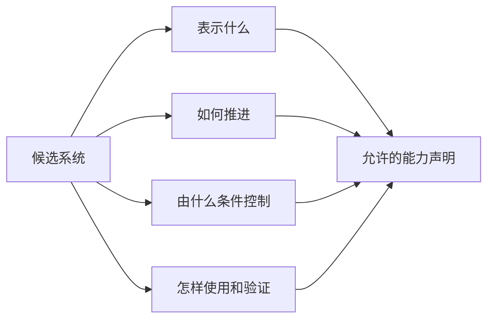

# 第2章 世界模型到底是什么

> 状态：`reviewed`
> 资料核查日期：2026-09-01
> 关联实验：`EXP-02-01`（smoke）
> 关联声明：`CLAIM-02-01`～`CLAIM-02-06`
> 关联图表：`FIG-02-01` / `TAB-02-01` / `TAB-02-02` / `TAB-02-03`
> 资源档位：S
> GPU 状态：不需要

## 本章契约

### 核心问题

当论文、产品或开源项目都把自己称为“世界模型”时，我们如何用同一组问题判断它学到了什么、能够支持什么决策，以及哪些能力其实没有被证明？

### 先修知识

- 已具备：编码器、监督学习和视频模型的基本直觉；
- 本章补齐：环境、状态、观测、动作、转移、奖励与 continuation 的边界；
- 不要求：强化学习、控制理论、机器人学或 3D 视觉经验。

### 非目标

- 不追求一个所有研究社区都接受的唯一哲学定义；
- 不把模型规模、画质或“基础模型”标签当作世界模型的充分条件；
- 不在本章比较排行榜，也不训练大模型；
- 不把物理仿真器、数字孪生、视频生成器、VLA 和策略强行归为同一类。

### 学完后的可验证产出

读者应能：

1. 用任务、状态、动作和用途描述一个候选世界模型；
2. 区分世界模型、观测模型、转移模型、策略与仿真器；
3. 判断一个视频预测器或 VLA 在什么条件下包含世界模型成分；
4. 为新系统填写四轴模型卡，并写出证据尚未覆盖的能力。
5. 用 state-aliasing 反例检查一个表示是否错误合并需要不同动作的历史。

## 2.1 一个为工程服务的工作定义

本书使用下面的工作定义：

> **世界模型是对任务相关状态及其随动作演化规律的可学习表示。**

这个定义包含三个约束。

第一，模型表达的是**任务相关状态**，不要求保存世界的每一个像素。用于抓取的模型可能重点保存物体姿态、接触和可达性；用于驾驶的模型可能重点保存道路拓扑、动态对象、车辆运动和交通规则状态。

第二，模型必须表达某种**演化规律**。只把一帧图像编码成特征的模型可以提供世界表征，但若没有时间预测、转移或其他动力学机制，本书不会仅凭“理解世界”的宣传把它叫作完整世界模型。

第三，如果模型声称支持反事实决策，它必须说明**动作如何改变未来**。没有动作条件的视频预测器仍可以学习环境动力学，但它只能预测行为数据中常见的未来，不能单独回答“如果现在向左而不是向右，会怎样”。

`CLAIM-02-01`（recommendation）：为避免按项目名称分类，本书用“任务相关状态 + 演化规律 + 明确用途”作为最低工作框架；它是贯穿本书的审查口径，不宣称是领域唯一或普适定义。只有在声称支持反事实规划时，才进一步要求动作条件和相应的干预测试。

这是一项写作与工程约定，不是声称其他定义错误。它的价值在于：后续每一章都能用同一组字段描述模型，并让声明与评测对应起来。

## 2.2 环境、状态与观测不是同一个东西

设环境真实状态为 `e_t`，观测为 `o_t`，动作为 `a_t`。环境推进可以抽象为：

\[
e_{t+1}\sim P(e_{t+1}\mid e_t,a_t), \qquad
o_t\sim P(o_t\mid e_t)
\]

真实状态通常不能被完全看到。相机不知道遮挡物后面有什么，单帧图像不能唯一确定速度，机器人编码器也可能没有直接测量接触力。模型因而维护内部状态 `z_t`：

\[
z_t=f_\theta(z_{t-1},o_t,a_{t-1})
\]

`z_t` 不是“世界本身”，而是模型基于历史形成的任务相关估计。若同一个 `z_t` 无法区分两个需要不同动作的环境条件，它对该任务就不是充分状态。

可以用一个简单问题检查状态是否遗漏信息：

> 是否存在两个历史，它们得到相同的模型状态，但最优动作不同？

如果答案是“有”，模型需要更多历史、额外传感器、更好的不确定性表示，或者承认任务范围受限。

### 2.2.1 低维不等于充分：state aliasing 的最小反例

压缩观测不是问题本身；问题是压缩后是否仍能区分任务所需的未来与动作。考虑一条被遮挡的走廊：当前相机画面在两种 context 中都编码成 `occluded-corridor`，但此前历史分别看见走廊畅通或障碍物进入。fixture 给两个 context 等权，并冻结下面的一步 return：

| hidden context | 当前观测 | 历史线索 | `advance` return | `hold` return | context 最优动作 |
| --- | --- | --- | ---: | ---: | --- |
| clear | `occluded-corridor` | `corridor-seen-clear` | 1.0 | 0.0 | `advance` |
| blocked | `occluded-corridor` | `obstacle-seen-before-occlusion` | -1.0 | 0.2 | `hold` |

*TAB-02-03：`EXP-02-01` v3 的等权 state-aliasing fixture。return 是无单位教学效用，不是碰撞代价、驾驶 reward 或概率估计。*

若 policy 只能看到当前编码，它必须在两个 context 中执行同一个动作。`advance` 的等权 mean return 为 0，`hold` 为 0.1，因此最优的 current-only 决策是 `hold`；相对逐 context oracle，它的 mean regret 是 0.5。若 state 保留唯一历史线索，则 clear 选 `advance`、blocked 选 `hold`，mean return 从 0.1 提高到 0.6，regret 变为 0。

`CLAIM-02-06`（result）：在 `EXP-02-01` 的两个等权手工 context 中，current-only 表示把不同最优动作的历史合并，最优共享动作仍有 0.5 mean regret；保留历史线索后固定 regret 为 0。该差值只证明这组一次决策 fixture 是 memory-improvable，不证明某种 sequence model 必然能学会记忆，也不估计真实 POMDP、机器人或驾驶性能。

这里有三条需要分开的理论直觉。[DeepMDP](https://proceedings.mlr.press/v97/gelada19a.html) 用 reward prediction 与 next-latent distribution prediction 把表示质量连接到 MDP/bisimulation 条件；这说明只重建外观不是唯一目标，也不表示任意低预测 loss 都足够。[Value Equivalence](https://arxiv.org/abs/2011.03506) 则把模型等价定义在选定的 functions 与 policies 的 Bellman updates 上；它允许忽略无关细节，但“相关”随用途和函数集合变化。MuZero 的 reward/value/policy 预测是价值相关路线的代表，不是所有任务上的充分状态证明。

较新的 [POBAX 论文](https://arxiv.org/abs/2508.00046) 与[锁定源码快照 `a5e1d62`](https://github.com/taodav/pobax/tree/a5e1d62d14e4efe783885b9d4f19cffa2a568eec)把“更多 state 信息或 memory 能否形成清晰 performance gap”作为部分可观测 benchmark 的设计信号，并覆盖多种 state aliasing。它是后续 M 档候选，不是当前零下载 S 档依赖；本书没有运行 JAX、训练 memory policy 或复现其论文结果。

## 2.3 世界模型的五个常见组件

一个实现不必显式包含全部组件，但论文和实验卡应说明缺少的部分。

| 组件 | 解决的问题 | 常见形式 | 缺失时的边界 |
| --- | --- | --- | --- |
| 表征/编码 | 如何把观测变成内部状态 | CNN、ViT、tokenizer、object/BEV encoder | 直接在原始状态上工作，或无法处理高维观测 |
| 状态更新 | 如何利用历史修正信念 | RNN、RSSM posterior、滤波器 | 可能把单帧当完整状态 |
| 转移 | 动作后状态如何变化 | latent dynamics、规则、diffusion/flow predictor | 不能独立展开未来 |
| 预测头 | 状态能预测哪些量 | 图像、特征、奖励、终止、价值、occupancy | 能力仅限已训练与评测的输出 |
| 不确定性/continuation | 哪些未来可能发生、何时终止 | 分布、ensemble、终止概率 | 平均未来可能掩盖多模态和失败 |

奖励不是环境状态的同义词。奖励 `r_t` 是任务偏好的标量表达；价值是未来累计回报的估计。模型可以很好地预测图像却错误预测奖励，也可以不重建图像但保留足够的奖励和转移信息。

## 2.4 四轴模型卡

为了避免仅凭名称分类，本书为候选系统记录四个轴。



*FIG-02-01：四轴模型卡把名称拆成表示、推进、条件和用途，再由证据决定允许发布的能力声明。来源：本书原创，MIT，2026-08-31。*

### 轴 A：表示什么

- 像素、视频或音频；
- latent token 或连续向量；
- 对象、关系、scene graph；
- 2D/3D occupancy、BEV 或几何状态；
- 奖励、价值、终止和可行动性。

### 轴 B：如何推进

- 学习到的确定性转移；
- 概率生成转移；
- 显式物理方程或仿真规则；
- 检索、记忆或外部工具；
- 不推进，只编码当前观测。

### 轴 C：由什么条件控制

- 无条件或只看历史观测；
- 机器人关节、末端位姿或离散动作；
- 车辆方向盘、油门、制动或轨迹；
- 文本目标、任务 ID、地图或策略；
- 动作在训练数据中存在，但推理接口不能主动干预。

### 轴 D：怎样被使用和验证

- 生成或补全观测；
- 训练数据扩增；
- 状态估计或 probing；
- 策略评估、规划或 imagined learning；
- 仿真测试、安全分析或数字孪生；
- 只做演示，尚无功能评测。

`TAB-02-01` 给出系统族的分类示例。它不是排行榜，也不把某个产品版本的全部能力固定下来。

| 系统族 | 学到状态/转移 | 动作条件 | 主要输出 | 与世界模型的关系 |
| --- | --- | --- | --- | --- |
| 无动作视频预测器 | 学习观测序列规律 | 否 | 未来视频 | 是预测模型；不足以单独支持动作反事实 |
| 动作条件视频模型 | 学习观测与动作后的未来 | 是 | 未来视频/特征 | 可作为世界模型，需验证动作保真与闭环用途 |
| RSSM / Dreamer 类 | 学习 latent 状态与转移 | 是 | latent、奖励、终止等 | 本书的典型学习世界模型 |
| MuZero 类 | 学习决策相关表示、转移与价值 | 是 | reward/value/policy | 不要求像素重建的价值等价路线 |
| JEPA 视频表征 | 预测 latent 表征 | 视实现而定 | 特征 | 提供预测表征；是否构成规划模型取决于动作与用途 |
| VLA 策略 | 直接生成动作 | 隐式或无独立接口 | 动作 token/连续动作 | 不因能行动就自动成为世界模型 |
| 物理仿真器 | 显式规则推进状态 | 是 | 状态与传感器渲染 | 是环境模型，但通常不是“可学习世界模型” |
| 数字孪生 | 对特定资产保持同步表示 | 通常是 | 监控、预测、维护信息 | 范围由同步对象和用途定义，不等于通用世界模型 |

### 能力声明不是标签的同义词

四轴填完以后，还要逐项回答“现有证据是否支持这条能力”。本书使用三态而不是布尔标签：

- `supported`：锁定来源明确支持该接口或用途；
- `unsupported`：当前卡片证据不足以发布该声明，不等于已经证明能力不存在；
- `scope_dependent`：系统族包含多种实现，必须锁定具体版本后再判断。

下面的矩阵来自 `EXP-02-01` v3 的八张固定卡。它刻意拆开四个经常被错误合并的命题：有时间/转移预测、能输入候选动作、动态是学习得到的、以及直接输出策略却没有独立转移接口。

| 固定卡片 | 时间/转移证据 | 候选动作干预 | 学习且动作条件的转移 | 策略输出但无独立转移 |
| --- | --- | --- | --- | --- |
| VideoGPT | supported | unsupported | unsupported | unsupported |
| Genie | supported | supported | supported | unsupported |
| DreamerV3 | supported | supported | supported | unsupported |
| MuZero | supported | supported | supported | unsupported |
| π₀ VLA | unsupported | unsupported | unsupported | supported |
| MuJoCo | supported | supported | unsupported | unsupported |
| 数字孪生 archetype | scope-dependent | scope-dependent | scope-dependent | unsupported |
| CARLA | supported | supported | unsupported | unsupported |

*TAB-02-02：`EXP-02-01` v3 的能力证据矩阵。状态描述锁定卡片，而不是对同名系统未来版本或整个研究方向作永久判断。*

矩阵展示的是逻辑蕴含边界。VideoGPT 有时间预测，不代表可做动作反事实；π₀ 直接生成动作，不代表存在可单独调用的环境转移；MuJoCo 和 CARLA 接受控制并推进状态，但动态不是从数据学习得到；数字孪生若不锁定实例则不能强行二值化。2026-09-01 核查时，[V-JEPA 2 官方仓库](https://github.com/facebookresearch/vjepa2)同时提供无动作预训练表征与 V-JEPA 2-AC 动作条件 predictor，正说明同一项目族内部也必须按具体组件分类。[OpenPI 官方仓库](https://github.com/Physical-Intelligence/openpi)则明确把 π₀、π₀-FAST 和 π₀.₅列为 VLA 模型；能输出 action chunk 仍不自动提供独立环境 transition。

## 2.5 容易混淆的边界

### 视频生成器

生成未来视频说明模型学习了某些时空规律，但还需要问：它是否接收动作？动作变化是否导致正确反事实？长时 rollout 是否保持对象、接触和任务状态？它是否被用于决策并通过相应评测？

画面逼真是能力，不是“可用于规划”的同义词。

### 策略与 VLA

策略 `π(a_t\mid o_{\le t})` 直接选择动作；世界模型预测动作之后的状态或决策相关量。一个 VLA 可能在内部形成预测表示，也可能只是从输入到动作的条件生成器。除非有独立动力学接口、预测目标或干预证据，否则不能从动作能力推断它包含可调用的世界模型。

`CLAIM-02-02`（fact）：在本书术语中，VLA 是策略架构族，不自动等同于世界模型；二者可以组合。

### 仿真器

MuJoCo、MetaDrive 或 CARLA 通过规则、数值方法和资产推进环境，是可交互的环境模型。它们可以产生世界模型训练数据或充当闭环裁判，但通常不属于“从数据学习出的内部模型”。混合系统也很常见：物理引擎负责刚体动力学，学习模型负责传感器、接触或行为。

### 数字孪生

数字孪生强调与某个真实资产、工厂、车辆或流程的持续对应和同步；世界模型强调任务相关预测与决策。二者交集很大，但数字孪生不必是学习模型，世界模型也不必对应唯一真实实例。

### 基础模型

规模大、预训练数据多或任务广，不决定模型是不是世界模型。基础模型描述训练与迁移范围；世界模型描述内部表示、动态机制和决策用途。这两组属性应分别记录。

## 2.6 从 CV 模型到世界模型

CV 工程师可以沿四步迁移已有经验：

1. 从单帧样本转向 episode 和历史窗口；
2. 从标签预测转向状态更新和未来转移；
3. 把动作当作改变数据分布的干预变量，而不只是附加 token；
4. 从离线平均指标转向 multi-step、counterfactual 和闭环效用。

这不意味着所有任务都需要生成像素。检测器、分割器、深度网络和视觉编码器可以成为世界模型的观测组件；关键是明确它们向状态和决策提供了什么，而不是扩大名称。

## 2.7 自动驾驶：生成驾驶视频、仿真和驾驶策略是三件事

在自动驾驶中，最容易出现名称混淆：

- **驾驶视频生成器**预测相机画面，适合场景生成和感知数据扩增；
- **学习仿真器/世界模型**需要响应转向、制动、交通参与者行为和地图条件；
- **驾驶策略**直接输出轨迹或控制量；
- **闭环仿真器**推进车辆、道路参与者和传感器，并作为评测环境；
- **数字孪生**可能追踪一辆车、一个路口或一个交通系统的当前状态。

如果模型只生成“看起来合理的继续行驶”，却无法在同一场景比较急刹、变道和保持车道，它不能单独承担规划器的反事实模型。反过来，一个不生成高清图像、只预测 BEV occupancy、碰撞概率和路线进度的模型，可能更适合决策。

`CLAIM-02-03`（inference）：判断驾驶世界模型时，动作接口和功能评测比“是否生成视频”更接近规划用途，但仿真结果仍不能替代真实车辆安全验证。

## 2.8 EXP-02-01：八类系统的四轴模型卡

本章不训练模型。读者将选择八个具有不同用途的系统或系统族，为每个对象填写：

```text
对象与锁定版本
任务和环境边界
状态/表示
转移机制
动作与条件接口
预测输出
主要用途
公开证据与 R0-R4 状态
不能由现有证据推出的能力
```

至少包含：无动作视频预测器、动作条件预测器、latent 世界模型、价值等价模型、VLA、物理仿真器、数字孪生和自动驾驶案例。评分不看“是否归入世界模型”这一列是否统一，而看理由、边界和证据是否自洽。

本书已把八类对象和一个 state-aliasing case 写成结构化 JSON fixture，并用标准库校验器强制检查：类别覆盖、四轴字段、来源快照、VLA/仿真器边界、四项三态能力、每张卡的不可外推声明，以及历史线索、动作集合和唯一最优动作合同。运行命令：

```bash
make ch02-test-local
make ch02-smoke-local
make ch02-smoke
```

固定 fixture 的 smoke 结果为：8 张系统卡覆盖 8 类对象，8 张卡都有 HTTPS 证据 URL，8 张卡都记录了至少一项不可由现有证据推出的能力。能力矩阵中，6 张有时间/转移证据、5 张支持候选动作干预、3 张同时满足学习动态与动作条件、1 张保持 scope-dependent、1 张是无独立转移的策略。state-aliasing 对照则得到 current-only mean return 0.1、history-aware 0.6 和 0.5 history value gap。14 个单元测试还会故意把 VLA 动作输出改写成转移证据、伪造 learned-action conjunction、破坏三态集合、证据 URL、四轴字段和身份唯一性，以及重复历史线索、改变动作集合、制造 context/共享策略最优动作 tie 和非有限 return，确认校验器能够拒绝这些变化。

`CLAIM-02-04`（result）：`EXP-02-01` 在固定 fixture 上完成了 8/8 类别、8/8 来源和 8/8 证据限制检查。它证明分类契约可执行，不证明被列系统的性能、可复现性或完整能力。

`CLAIM-02-05`（result）：`EXP-02-01` v3 中，只有 3/8 固定卡片同时满足“学习动态 + 候选动作条件”，而转移证据、动作干预和直接策略输出分别属于不同集合。该计数只描述本书选定的八个教学 archetype，不估计现实项目比例。

## 2.9 失效模式与安全边界

- **名称替代证据**：项目自称 world model，正文便默认它支持规划；
- **动作伪条件化**：输入包含动作，但模型输出几乎不随动作变化；
- **状态不足**：表示丢失速度、接触、终止或安全相关变量；
- **state aliasing**：两个需要不同动作的历史被压成同一个内部 state；
- **观测等于状态**：把单帧像素当作完整环境状态；
- **用途漂移**：用视频展示证据宣传策略优化能力；
- **边界消失**：把仿真成功外推到真实机器人或车辆。

涉及真实动作时，学习世界模型只能为策略提供预测或评估，不能取代碰撞检查、控制限幅、急停、最小风险状态和人工接管等独立安全层。

## 2.10 结果与证据边界

| 类型 | 声明/结果 | 来源或实验 ID | 状态 | 限制 |
| --- | --- | --- | --- | --- |
| 工作定义 | 世界模型表示任务相关状态及动作相关演化 | 本书术语契约 | recommendation | 非唯一学术定义 |
| 分类结论 | VLA、视频模型和仿真器不能只凭名称互相替代 | 四轴模型卡 | drafted | 具体系统需逐版本核验 |
| 本书结果 | 八类系统具有四轴、三态能力、来源和证据限制记录 | `EXP-02-01` | CPU smoke | 教学元数据分类，不是项目比例或性能 benchmark |
| 本书结果 | current-only 与 history-aware state 在固定等权 context 上有 0.5 decision gap | `EXP-02-01` | CPU smoke | 一步手工 return，不是 learned memory 或真实 POMDP 性能 |
| 未验证 | 某一现有系统满足完整闭环世界模型要求 | 无 | unverified | 需第9章协议评测 |

### 资源、数据与许可

本章正文与练习只需浏览论文或官方项目页面。无训练、无数据集下载、无 GPU 和硬件要求。引用的第三方系统只用于分析，其代码、权重、数据与文档仍按各自许可证管理。

## 2.11 小结

世界模型不是一个由画质、规模或产品名称决定的类别。本书关心四件事：模型表示什么，如何推进，接受哪些动作或条件，以及被怎样使用和验证。只要这四个问题没有回答，“理解世界”“可交互”或“具身基础模型”都仍是范围不清的声明。

## 练习

1. **概念判断**：一个模型只预测下一帧，但训练数据来自固定策略。它在什么意义上是世界模型，在什么意义上不足以支持规划？
2. **分类练习**：任选一个 VLA，找到它是否具有独立的状态转移或未来预测接口，不要从模型名称推断。
3. **组件拆分**：分别为 V-JEPA 2 encoder 与 V-JEPA 2-AC predictor 填写矩阵，指出哪些状态因组件变化而改变。
4. **反例设计**：构造两个当前观测相同但最优动作不同的历史，说明需要怎样的信念状态。
5. **自动驾驶迁移**：分别为驾驶视频生成器、轨迹预测器、规划器和 CARLA 填写四轴模型卡。
6. **状态充分性**：修改 `TAB-02-03`，让两个 context 的最优动作相同；说明此时 history gap 为什么消失，以及这仍不能证明表示对其他任务充分。

## 自检要点

先独立完成模型卡或反例，再展开自检。系统能力必须锁定具体组件和版本；项目名称、作者演示和策略输出都不能代替接口证据。

<details>
<summary>SELF-CHECK-02-01：概念判断</summary>

它学习了固定行为策略所诱导分布上的观测转移，因此可以是一个范围受限的预测世界模型。它未必看过替代动作，也没有证明动作条件、support 外反事实、长期 rollout 或规划 outcome 正确，所以不足以单独比较候选动作。合格答案要同时给出“成立的范围”和“规划缺少的证据”，不能因只有下一帧预测就全盘否定或全盘接受。

</details>

<details>
<summary>SELF-CHECK-02-02：分类练习</summary>

应记录仓库/论文的精确版本，寻找独立可调用的 `next state / future feature / observation / reward` 接口及其训练目标，再测试或查证改变候选动作是否改变相应未来。VLA 直接输出 action chunk、内部具有 temporal token，均不自动等于环境转移接口。若只能找到策略推理 API，四轴卡应把“策略输出”记为 supported，把“独立转移/未来预测”记为 unsupported 或 scope-dependent，并留下证据链接。

</details>

<details>
<summary>SELF-CHECK-02-03：组件拆分</summary>

V-JEPA 2 encoder 提供观测/视频表征，可支持当前或历史特征，但仅凭 encoder 不能登记候选动作干预或独立动作条件转移。V-JEPA 2-AC predictor 在锁定组件范围内增加动作条件的未来 feature prediction，因此“时间/转移证据”和“候选动作干预”状态会改变；是否能规划仍取决于动作覆盖、预测准确性和下游评测。合格答案必须分别填两张卡，而不是把整个项目族写成一个布尔标签。

</details>

<details>
<summary>SELF-CHECK-02-04：反例设计</summary>

一种合格构造是：当前画面都显示被遮挡走廊，历史 A 看见走廊为空，历史 B 看见障碍进入；A 的最优动作是前进，B 是保持。信念至少要保留能区分 `clear/blocked` 的历史证据及其不确定性，并随新观测和动作更新。只给两个不同当前图像不构成 state aliasing，因为题目要求当前观测相同；只给不同标签而没有不同最优动作，也没有证明任务相关信息缺失。

</details>

<details>
<summary>SELF-CHECK-02-05：自动驾驶迁移</summary>

驾驶视频生成器通常表示像素/latent、按历史生成未来，动作条件需逐版本核验，主要用于生成；轨迹预测器推进其他参与者状态，未必接受 ego 候选动作；规划器输出轨迹/控制，未必有独立环境模型；CARLA 用显式规则接受控制并推进可观测状态，但不是学习动态。四张卡都要写用途与不能推出的能力，例如“CARLA 闭环可交互”不能推出目标车辆域有效，“视频逼真”不能推出规划反事实正确。

</details>

<details>
<summary>SELF-CHECK-02-06：状态充分性</summary>

只要两个 context 的唯一最优动作相同，current-only policy 就能选择与逐 context oracle 相同的动作，按该冻结 action/return 集合计算的 history decision gap 可以为 0。它只说明历史对这一次决策没有额外价值；表示仍可能遗漏速度、未来分布、其他 reward、长时任务或安全变量。合格答案必须把“对当前函数集合价值等价”与“对所有任务状态充分”分开。

</details>

## 延伸阅读

- Ha & Schmidhuber, [World Models](https://arxiv.org/abs/1803.10122)，`[A]`，经典视觉编码—动力学—控制分解；
- Hafner et al., [Learning Latent Dynamics for Planning from Pixels](https://arxiv.org/abs/1811.04551)，`[A]`，动作条件 latent planning；
- Schrittwieser et al., [Mastering Atari, Go, Chess and Shogi by Planning with a Learned Model](https://www.nature.com/articles/s41586-020-03051-4)，`[P]`，价值等价路线；
- [V-JEPA 2/2.1 官方仓库](https://github.com/facebookresearch/vjepa2)，`[O]`，预测表征与 V-JEPA 2-AC 动作条件组件案例；
- [OpenPI 官方仓库](https://github.com/Physical-Intelligence/openpi)，`[O]`，VLA 策略实现案例；
- [MuJoCo 官方文档](https://mujoco.readthedocs.io/)，`[O]`，显式物理仿真器案例。
- Gelada et al., [DeepMDP](https://proceedings.mlr.press/v97/gelada19a.html)，`[P]`，reward/transition 与任务相关 latent state；
- Grimm et al., [The Value Equivalence Principle](https://arxiv.org/abs/2011.03506)，`[P]`，相对于 policy/function 集合的模型等价；
- Tao et al., [POBAX](https://arxiv.org/abs/2508.00046)，`[P,O,R0]`，memory-improvable partial-observability benchmark；当前未运行。

## 下一章接口

第3章将补齐状态、坐标、动作和控制频率的最小机器人学含义。即使暂时跳过第3章，本章的四轴模型卡也足以支持第4章的数据与实验协议，以及第6章对 RSSM 的阅读。

## 验收与审查记录

```text
本地检查：make check-local
严格检查：make check
文档构建：make docs-build
```

- 内容审查：通过；
- 代码审查：通过；
- 一致性审查：通过；
- 教学审查：通过；
- 审查记录路径：`reviews/ch02-state-aliasing-review-2026-09-01.md`、`reviews/current-asset-version-consistency-review-2026-09-02.md`、`reviews/part-01-exercise-self-check-review-2026-09-02.md`；
- 已知限制：系统卡基于论文与官方文档元数据，没有运行八个上游系统；
- 下一步：与第6章 belief state、第9章 E2/E4 评测和第15章 policy memory 继续执行跨章语义审查。
