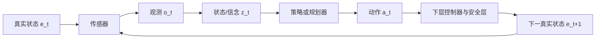

# 第3章 具身任务的最小机器人学与决策基础

> 状态：`reviewed`
> 资料核查日期：2026-09-01
> 关联实验：`EXP-03-01`
> 关联声明：`CLAIM-03-01`～`CLAIM-03-07`
> 关联图表：`FIG-03-01` / `FIG-03-02` / `TAB-03-01` / `TAB-03-02`
> 资源档位：S
> GPU 状态：不需要

## 本章契约

### 核心问题

一个没有 3D 视觉和机器人学经验的 CV 工程师，至少要掌握哪些坐标、几何、动作和决策接口，才能正确读取后续世界模型、VLA、BEV 与仿真实验？

### 先修知识

- 已具备：向量、矩阵乘法、像素坐标和 Python 基础；
- 本章补齐：相机投影、坐标变换、点云/BEV 直觉、运动学、控制频率和 MDP/POMDP；
- 不要求：多视图几何证明、李代数推导、机器人动力学、真实标定板或硬件。

### 非目标

- 不替代完整机器人学、控制或 3D 视觉课程；
- 不把理想针孔反投影当作真实相机标定；
- 不在当前设备上安装 ROS、MuJoCo 或 GPU 环境；
- 不把二维运动学 smoke 当作实机控制与安全验收。

### 学完后的可验证产出

读者应能：

1. 区分像素、相机、机器人/车体和世界坐标系；
2. 用内参反投影 RGB-D 像素，并显式变换到目标坐标系；
3. 将少量点栅格化为简化 occupancy/BEV；
4. 区分关节、末端、车辆和高层动作；
5. 说明 MDP 与 POMDP 中状态、观测、信念、规划和策略的关系；
6. 定位轴向、单位、外参、时间同步和控制频率错误。

## 3.1 先建立闭环，而不是先背术语

具身系统从传感器获得观测，根据内部状态估计选择动作，环境被动作改变后再产生新观测。几何回答“量在哪里、相对于谁”，运动学回答“动作会把本体带到哪里”，决策模型回答“在不确定性下该选哪个动作”。



*FIG-03-01：本章统一的具身闭环接口。真实状态通常不可直接获得；学习模型使用观测构造任务相关的状态或信念。来源：本书原创，MIT，2026-08-31。*

在图像分类中，像素坐标和标签通常足够；在机器人或车辆中，“目标在 `(1, 0, 0)`”如果没有坐标系、单位和时间戳就没有可执行含义。后续所有数组都应当被看成“数值 + frame + unit + timestamp + convention”。

`CLAIM-03-01`（recommendation）：任何几何、状态或动作张量的接口，都应显式记录坐标系、单位、时间戳和轴向约定；shape 相同不代表语义兼容。

## 3.2 从像素到相机坐标：只需一个可检查的针孔模型

像素 `(u,v)` 表示图像平面的位置，深度 `d` 提供沿相机光轴的尺度。为便于桥接，本章 fixture 采用常见光学坐标约定：`x` 向右、`y` 向下、`z` 向前，深度单位为米。不同库和硬件可能不同，必须读取其文档而不是猜测。

忽略畸变时，内参 `f_x,f_y,c_x,c_y` 将像素反投影为相机坐标：

\[
X_c=(u-c_x)d/f_x,\qquad Y_c=(v-c_y)d/f_y,\qquad Z_c=d.
\]

这里 `f_x,f_y` 用像素表示焦距，`(c_x,c_y)` 是主点。它不是“从单张 RGB 猜深度”：深度必须来自 RGB-D、双目、LiDAR、模型预测或其他来源，来源和不确定性要单独记录。

还要先问设备给的是 **z-depth** 还是沿成像射线的欧氏 **range**。上式要求 \(Z_c=d\)；若给定 range \(r\)，应先令

\[
Z_c=\frac{r}{\sqrt{((u-c_x)/f_x)^2+((v-c_y)/f_y)^2+1}}.
\]

两者在主点处相等，离主点越远差异越大。fixture 的离轴归一化坐标为 `(1,0)`：数值为 1 m 的 z-depth 对应射线距离 \(\sqrt{2}\) m，而 1 m range 对应 \(Z_c=1/\sqrt{2}\) m。

最小自检是 round trip：把反投影点再投影回像素，误差应接近数值精度。但相同的错误内参用于正反两程也可能自洽，所以 round trip 只验证实现闭合，不验证标定正确。如果 round trip 通过但点云尺度错 1000 倍，通常是毫米/米错误；如果中心附近正确、边缘系统性弯曲，可能是畸变未处理；如果 RGB 与深度边缘错位，要检查配准与时间同步。

OpenCV 官方标定接口区分针孔与 fisheye 等相机模型。`EXP-03-01` 只覆盖无畸变针孔模型，不能证明真实设备已标定。

## 3.3 外参：同一个点，换一个观察者

点从源坐标系 `s` 变换到目标坐标系 `t`：

\[
{}^{t}p = {}^{t}R_s\,{}^{s}p + {}^{t}t_s.
\]

记号左上角表示“这个量用哪个 frame 表达”。`R` 是旋转，`t` 是源坐标原点在目标坐标中的位置。齐次变换把两者放入 `4×4` 矩阵，属于特殊欧氏群 `SE(3)`；本书只要求会组合和检查变换，不要求推导李群指数映射。

变换方向是最常见错误。`T_body_camera` 应解释为“把 camera 表达的点变到 body”，不能仅靠变量名中的两个 frame 猜乘法方向。链式变换要让相邻 frame 抵消，例如：

```text
p_world = T_world_body @ T_body_camera @ p_camera
```

推荐的三项自检：原点变到哪里、单位轴变到哪里、正变换后再乘逆变换能否回到原点。只检查最终可视化“看起来差不多”不足以发现左右手系或轴交换。

本章 body frame 明确采用 `x` 向前、`y` 向左、`z` 向上。因此 camera optical 到 body 不可能直接使用单位旋转；固定轴映射为：

\[
{}^bR_c=\begin{bmatrix}0&0&1\\-1&0&0\\0&-1&0\end{bmatrix}.
\]

即 camera 的前、右、下分别映到 body 的前、右（`-y`）、下（`-z`）。先前若用单位旋转，投影 round trip 仍可为 0，却会把 optical `y` 当 body 横向、把 optical `z` 当 body 高度；这正是为什么必须测试单位轴和完整变换链。

[Modern Robotics](https://modernrobotics.northwestern.edu/nu-gm-book-resource/) 系统讲解刚体运动、齐次变换和 `SE(3)`；本章只提取后续学习系统需要的接口，完整推导交给该开放教材。

## 3.4 点云、遮挡与简化 BEV

对每个有效深度像素执行反投影，就得到相机坐标点云。点云不是完整世界：它只包含传感器当前能看到且返回有效深度的表面。物体背后、视野外和透明/反光区域应标记为未知，不能默认为空闲。

鸟瞰图（bird's-eye view, BEV）把选定空间范围划分为网格，再将点投影到水平面。最简 occupancy 可以记录每格“有观测占用”，更完整的表示还需要区分 free、occupied、unknown，记录高度、语义、速度和时间。


*FIG-03-02：零基础 3D 桥接流水线。每个箭头都保留 frame、unit 和 timestamp；未知空间不能由“没有点”直接推断为空闲。来源：本书原创，MIT，2026-08-31。*

## 3.5 从关节到末端：只掌握动作接口

二维双连杆机械臂的关节角为 `q=(q_1,q_2)`，连杆长度为 `l_1,l_2`。正运动学把关节状态映射为末端位置：

\[
x=l_1\cos q_1+l_2\cos(q_1+q_2),\quad
y=l_1\sin q_1+l_2\sin(q_1+q_2).
\]

逆运动学反过来寻找达到目标末端位姿的关节配置，可能无解、存在多解或靠近奇异位形。学习策略输出末端位姿时，下层仍需做逆运动学、轨迹生成、碰撞检查和控制；输出关节位置时，也仍需限位、速度和力矩约束。

不同动作空间不能只靠数组长度区分：

| 本体/层级 | 动作示例 | frame 与单位 | 下层责任 |
| --- | --- | --- | --- |
| 机械臂关节 | 目标角/速度/力矩 | joint，rad / rad·s⁻¹ / N·m | 限位、动力学、安全停机 |
| 机械臂末端 | 位姿增量、夹爪开合 | base/tool，m + rad | IK、碰撞、轨迹与力控 |
| 车辆低层 | 转向、加速度、制动 | vehicle，rad / m·s⁻² / ratio | 稳定控制、执行器限制 |
| 车辆规划 | 轨迹点/曲率/速度 | map/vehicle，m / m⁻¹ / m·s⁻¹ | 跟踪器、道路与碰撞约束 |
| 高层技能 | pick、turn-left | task frame，离散 token | 参数化、可行性与终止判断 |

*TAB-03-01：常见动作接口。策略输出和最终执行器命令之间通常还有不可省略的控制与安全层。*

## 3.6 控制频率、延迟与反馈

动作 `a_t` 的含义依赖控制周期 `Δt`。同样的速度命令保持 20 ms 与 200 ms，造成的位移不同；同样 `chunk_size=8`，在 50 Hz 与 5 Hz 系统中分别覆盖 0.16 s 和 1.6 s。频率、保持方式、丢帧和时间戳必须进入实验卡。

开环控制预先生成动作后不根据新观测修正；闭环控制根据误差持续调整。一个最简比例控制器是 `a_t=k(q^*-q_obs)`。它不解决动力学、接触或稳定性证明，却足以展示反馈为何能够修正固定执行偏差。

规划器决定较长时域的目标或动作序列，控制器在更高频率上跟踪并抑制扰动；策略可能承担其中任一层。论文中都写 `action`，并不代表动作接口相同。

## 3.7 MDP、POMDP、策略与规划

马尔可夫决策过程（MDP）用状态、动作、转移、奖励和折扣描述序贯决策。若真实状态 `e_t` 不可完全观测，系统只得到 `o_t`，问题更接近部分可观测 MDP（POMDP）。策略可以基于历史或信念状态：

```text
真实状态 e_t --传感器--> 观测 o_t
历史 (o_≤t, a_<t) --估计/记忆--> 信念 z_t
策略 π(a_t | z_t) --执行--> 环境转移
```

状态是任务相关的理想描述，观测是传感器读数，信念是模型对不可见状态的内部估计。单帧视觉特征不自动满足马尔可夫性：遮挡物体、速度、接触和意图往往需要历史。

策略直接给出动作分布；规划器通常使用模型搜索未来动作序列。工程系统可以用规划器生成参考轨迹、策略提供先验、控制器执行、安全层否决。它们是接口关系，不是互斥阵营。

`CLAIM-03-04`（fact）：在部分可观测任务中，单次观测通常不足以等同真实状态；历史或状态估计器用于形成任务相关信念。该定义与第2章术语契约一致。

## 3.8 EXP-03-01：几何与反馈的两个精确 smoke

实验完全使用 Python 标准库和程序化 fixture：三个 RGB-D 像素先反投影、变换和栅格化；二维机械臂再比较固定开环增量与带噪观测的比例反馈。

```bash
make ch03-test-local
make ch03-smoke-local
make ch03-smoke
```

| 检查 | 固定结果 | 应如何解释 |
| --- | ---: | --- |
| 最大投影 round-trip 误差 | 0 px | 精确针孔公式与实现闭合 |
| 最大外参正逆 round-trip 误差 | 8.67×10⁻¹⁸ m | 显式 optical↔body 变换数值闭合 |
| 毫米误当米的尺度比 | 1000× | 单位错误不会被 shape 检查发现 |
| 外参 x 偏移注入 | 0.10 m | 点云整体系统性平移 |
| 错用单位轴映射的平均点误差 | 2.35718 m | 投影闭合不能检出 frame 轴误用 |
| 离轴 z-depth / 同数值 range 比 | 1.41421× | z-depth 与射线距离不能混用 |
| 固定开环末端误差 | 0.12595 m | 执行偏差逐步累积 |
| 观测反馈末端误差 | 0.01905 m | 在本 fixture 中反馈减小误差 |

*TAB-03-02：`EXP-03-01` 的固定 CPU smoke。所有数字来自理想程序化模型，不是相机或机器人精度。*

`CLAIM-03-02`（result）：`EXP-03-01` 的精确针孔 round trip 为 0 px，同时能够检出 1000× 深度尺度错误和 0.10 m 外参平移注入。

`CLAIM-03-03`（result）：在同一实验的二维机械臂 fixture 中，固定执行偏差使开环末端误差为 0.12595 m；带确定性观测噪声的比例反馈将其降为 0.01905 m。这个差值只适用于本书固定参数，不能外推实机控制效果。

`CLAIM-03-06`（result）：`EXP-03-01` 显式把 optical `(right, down, forward)` 映射到 body `(forward, left, up)`，外参正逆 round trip 最大误差为 8.67×10⁻¹⁸ m；用单位旋转跳过轴映射时，三个点的平均 body 坐标误差为 2.35718 m。该数值只由固定三点和安装平移决定。

`CLAIM-03-07`（result）：在归一化离轴坐标 `(1,0)` 上，把数值 1 m 当作 z-depth 得到的射线距离为 1.41421 m；这证明 z-depth 与 range 的接口不可混用，不估计真实深度传感器误差。

## 3.9 五类错误的定位顺序

1. **轴向**：单位轴和手系是否符合约定，图像 `v` 向下是否被误当世界 `z`；
2. **单位**：深度、平移、角度、速度和时间分别是什么单位；
3. **方向**：保存的是 `T_target_source` 还是逆变换，矩阵左乘还是右乘；
4. **同步**：RGB、深度、位姿和动作是否属于同一时刻，插值和时钟源是什么；
5. **控制周期**：动作在何时采样、持续多久、是否被限幅或丢弃。

应按这个顺序检查，因为深度模型或策略无法补偿一个稳定但错误的坐标接口。测试必须包含已知原点、单位轴、投影 round trip、正逆变换、时间偏移注入和边界动作。

## 3.10 自动驾驶：相机、车体与地图不能混在一起

自动驾驶至少涉及像素/相机 frame、车辆 body frame、局部里程计 frame 和地图/world frame。相机检测框在像素中，深度或 LiDAR 点在传感器 frame，规划轨迹通常在 vehicle 或 map frame，低层控制再转换为转向、加速度和制动。

本书默认项目必须自行声明轴向；可参考 ROS [REP-103](https://www.ros.org/reps/rep-0103.html) 的单位与坐标约定和 [REP-105](https://www.ros.org/reps/rep-0105.html) 的移动平台 frame 关系，但“参考”不等于所有驾驶数据集和仿真器都使用同一约定。

一个车辆在弯道中移动时，静态相机外参可以保持不变，`T_map_vehicle(t)` 却随时间变化。将不同时间的点云变到同一地图坐标前必须做运动补偿。错误时间戳可能表现为动态对象拖影或道路边界弯曲，容易被误诊为 3D 模型能力不足。

`CLAIM-03-05`（recommendation）：自动驾驶训练与评测应把传感器 frame、车辆/map 变换、时间基准和动作持续时间作为数据 schema 的必填字段，并用固定轨迹做变换与同步 smoke。

学习策略输出车辆动作时，必须经过道路边界、碰撞、动态约束、控制限幅和最小风险动作；本章程序化几何不构成任何道路安全证据。

## 3.11 全书统一的观测/状态/动作 schema

后续实验至少提供以下机器可读语义，即使具体文件格式不同：

```yaml
observation:
  timestamp_s: float64
  frame_id: camera_front
  modalities: [rgb, depth]
  units: {depth: m}
  calibration_id: fixture-v1
state:
  kind: belief            # true / observed / belief / latent
  frame_id: body
  fields: [joint_position, joint_velocity]
  units: {joint_position: rad, joint_velocity: rad/s}
action:
  kind: joint_position_delta
  frame_id: joint
  units: rad
  control_rate_hz: 20
  horizon_steps: 1
  bounds: [-0.1, 0.1]
  safety_filter: required
episode:
  task_id: string
  reset_id: string
  termination: [success, failure, timeout, safety_stop]
```

`state.kind` 必须区分真实状态、可观测状态、信念和 latent；`action.kind` 必须比 `continuous` 更具体。该 schema 是语义契约，不要求读者现在安装 ROS 或采用某一种数据框架。

## 3.12 4–6 小时桥接门

建议按以下顺序完成：

1. 约 45 min：手算中心像素和边缘像素的反投影；
2. 约 60 min：运行并修改 `EXP-03-01`，加入无效深度和单位错误；
3. 约 60 min：画出 camera/body 两组点并检查单位轴与逆变换；
4. 约 45 min：改变 BEV cell size，区分 occupied 与 unknown；
5. 约 60 min：改变控制频率、噪声和执行偏差，比较开环与反馈；
6. 约 30 min：为自己的目标任务填写观测/状态/动作 schema。

通过标准不是记住 `SE(3)` 定义，而是能在合成数据中定位轴向、单位、外参和时间错误。未通过仍可阅读世界模型或 VLA 主线；进入第12章 occupancy 实验前应补齐此门。

## 3.13 结果、资源、许可与安全边界

| 类型 | 声明/结果 | 来源 | 状态 | 限制 |
| --- | --- | --- | --- | --- |
| 本书结果 | 反投影 round trip 与错误注入可检出 | `EXP-03-01` | CPU smoke | 三个理想像素 |
| 本书结果 | 反馈降低固定二维控制误差 | `EXP-03-01` | CPU smoke | 无动力学与接触 |
| 开放教材 | `SE(3)`、运动学与操作系统框架 | Modern Robotics / MIT notes | `[O,R1]` | 本书未运行配套栈 |
| 官方规范 | ROS 单位和移动 frame 约定 | REP-103/105 | `[O,R1]` | 数据源可采用不同约定 |

实验下载量 0、无需 GPU、无外部数据或硬件；代码、fixture、结果和本书原创图按 MIT 发布。外部教材和规范保持各自许可，只提供链接，不复制其图表。

真实系统还会受到畸变、滚动快门、深度空洞、温漂、外参变化、关节回差、接触、延迟和急停链路影响。S 档 smoke 只证明公式和接口在固定输入上运行，不能证明标定、控制稳定性、实时性或功能安全。

## 小结

从 CV 走向具身系统，关键不是先学完所有机器人学，而是让每个数值带上 frame、unit、timestamp 和控制语义。像素经深度与内参成为相机点，再经外参进入本体/世界；动作经运动学、控制器和安全层改变下一次观测。MDP/POMDP 则把这种反馈和不确定性组织为可学习的决策问题。

## 练习

1. **概念判断**：某点云在相机中单位为毫米，外参平移单位为米，但图形仍像一辆车。为什么可视化不足以证明正确？
2. **代码实验**：给 `EXP-03-01` 加入 `5°` yaw 外参错误，比较它与 0.10 m 平移错误的空间模式。
3. **几何练习**：将 body 点变回 camera，验证正逆变换 round trip；再故意把 optical→body 旋转改成单位矩阵，解释为何像素 round trip 仍不报警。
4. **控制练习**：把动作频率从 20 Hz 改为 5 Hz，同时保持每秒速度含义不变；指出代码需要改哪些量。
5. **自动驾驶迁移**：为前视相机、车辆状态和规划轨迹填写本章 schema，并设计一次 100 ms 时间错位注入。

## 延伸阅读

- Lynch & Park, [Modern Robotics 在线资源](https://modernrobotics.northwestern.edu/nu-gm-book-resource/)，刚体运动、运动学、规划与控制；
- Tedrake, [Robotic Manipulation: Perception, Planning, and Control](https://manipulation.mit.edu/)，持续更新的开放课程笔记；
- OpenCV, [Camera Calibration 官方文档](https://docs.opencv.org/4.x/d9/d0c/group__calib3d.html)，相机模型和标定接口；
- ROS, [REP-103](https://www.ros.org/reps/rep-0103.html) 与 [REP-105](https://www.ros.org/reps/rep-0105.html)，单位、坐标与移动平台 frame；
- Sutton & Barto, [Reinforcement Learning: An Introduction](http://incompleteideas.net/book/the-book-2nd.html)，MDP 与序贯决策的系统教材。

## 下一章接口

第4章将把本章 schema 放进 trajectory、episode、同步和数据切分协议；第12章直接复用反投影、坐标变换和 occupancy 桥接门；第13章的动作块将补上这里定义的单位、频率与安全层接口。

## 验收与审查记录

```text
本地检查：make check-local
严格检查：make check
章节 smoke：make ch03-smoke
文档构建：make docs-build
```

- 内容审查：通过；
- 代码审查：通过；
- 一致性审查：通过；
- 教学审查：通过；
- 审查记录路径：`reviews/batch-c-review.md`、`reviews/ch03-optical-body-review-2026-09-01.md`；
- 已知限制：没有真实相机、机器人、畸变、动力学、接触或时间同步运行；
- 下一步：M 档再加入真实标定、畸变与时间错位数据；当前 S 档接口已与第4、12、13、19章核对。
