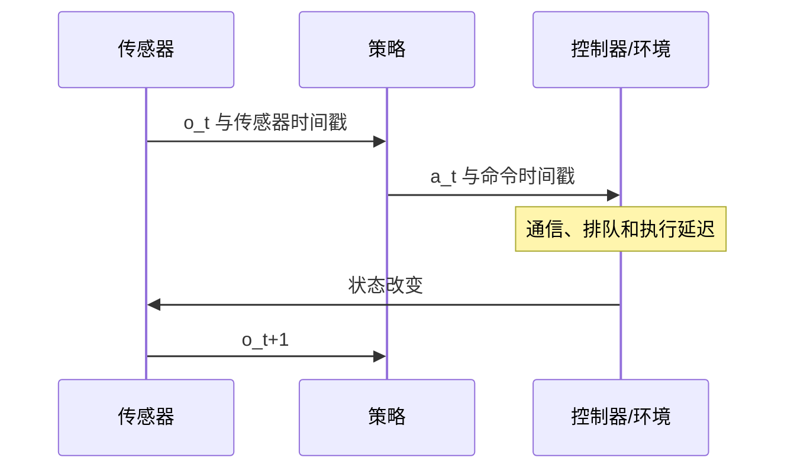

# 第4章 数据、基线与实验协议

> 状态：`reviewed`
> 资料核查日期：2026-08-31
> 关联实验：`EXP-04-01`（smoke）
> 关联声明：`CLAIM-04-01`～`CLAIM-04-05`
> 关联图表：`FIG-04-01` / `TAB-04-01`
> 资源档位：S
> GPU 状态：不需要

## 本章契约

### 核心问题

在训练任何世界模型或具身策略之前，怎样证明数据的时间、动作、episode、切分和指标没有让实验答案提前泄漏？

### 先修知识

- 已具备：训练集、验证集、测试集、batch 和常见视觉指标；
- 本章补齐：trajectory/episode、时间对齐、动作语义、组级切分、基线、随机种子、置信区间和停止条件；
- 不要求：真实机器人、3D 视觉、GPU 或大型公开数据集。

### 非目标

- 不把某个数据格式规定为全书唯一格式；
- 不下载完整 LeRobot、自动驾驶或视频数据；
- 不用一次 smoke 运行估计模型收敛、显存或最终性能；
- 不把测试集反复调参后的最高分写成无偏结果。

### 学完后的可验证产出

读者应能：

1. 画出 `o_t → a_t → o_{t+1}` 的精确时间关系；
2. 按 episode、任务、场景、路线或主体做组级切分；
3. 为一个数据集检查 schema、频率、缺帧、动作范围和终止状态；
4. 选择随机、恒定、oracle 和任务基线，并说明各自排查什么问题；
5. 填写可审计实验卡，预先写下主张、资源与停止条件。

## 4.1 训练样本不是孤立图片

传统图像数据常写成 `(x_i,y_i)`。具身数据的基本单位更接近一段 trajectory：

\[
\tau=(o_0,a_0,r_0,d_0,o_1,a_1,r_1,d_1,\ldots,o_T)
\]

其中 `d_t` 表示终止或 continuation 相关信号。一次 episode 通常从重置开始，到成功、失败、超时、人工终止或数据截断结束。一条长日志也可能包含多个 episode；一个 episode 还可能跨多个视频或表格分片。

如果先把所有帧打散再随机切分，相邻帧、同一场景背景甚至同一条轨迹的未来就可能同时出现在训练和测试中。模型看似泛化，实际可能只是在识别录制环境。

`CLAIM-04-01`（recommendation）：时序具身数据默认按产生依赖关系的最小完整组切分，而不是按帧切分；具体组可以是 episode、轨迹、任务实例、场景、路线、主体或采集会话。

## 4.2 先写清楚一行数据代表什么

任何数据检查都应从 schema 开始，而不是先调用 DataLoader。至少记录：

| 类别 | 必查字段 | 常见错误 |
| --- | --- | --- |
| 标识 | dataset、episode、frame、task、scene、route | ID 重复或跨 split 泄漏 |
| 时间 | timestamp、sensor timestamp、control timestamp、fps | 用帧号冒充真实时间 |
| 观测 | camera、depth、state、force、map | 单位、shape、颜色空间不一致 |
| 动作 | action、控制模式、执行延迟、坐标系 | 记录命令而非实际执行值 |
| 任务 | instruction、goal、success、failure | 成功定义随采集者变化 |
| 终止 | terminated、truncated、timeout、reset | 把超时当失败或把截断当自然终止 |
| 来源 | 设备、软件版本、校准、许可 | 合并后失去可追溯性 |

shape 相同并不表示语义相同。六维向量可能是关节位置、关节速度、末端位姿增量或车辆状态；`action=0` 可能表示保持、制动、零力矩或缺失填充。单位和参考系必须进入 schema，而不是藏在采集脚本中。

## 4.3 时间对齐：动作到底影响哪一帧

最常见的隐蔽错误是 off-by-one。假设传感器观测 `o_t` 到达后，策略计算动作 `a_t`，控制器经过延迟才执行，下一观测为 `o_{t+1}`。世界模型通常学习：

\[
p(o_{t+1},r_t,d_t\mid o_{\le t},a_t)
\]

但数据表的一行可能把 `o_t` 与“上一周期执行的动作”放在一起，也可能保存本周期下发但尚未生效的命令。如果不核对采集时序，模型会学到看似合理但方向错误的动力学。



*FIG-04-01：观测、动作与下一观测的时间关系。数据审计必须记录传感器、命令和执行时钟，而不是只假设相邻数组已经对齐。来源：本书原创，MIT，2026-08-31。*

建议检查：

1. 时间戳是否单调，单位是秒、毫秒还是纳秒；
2. 相邻间隔是否接近声明频率，抖动和长间隙有多少；
3. 多相机是否同一硬触发，还是软件近似同步；
4. 动作是目标值、下发值还是实际测量值；
5. 图像曝光时间、传输延迟和控制执行延迟如何定义；
6. episode 边界是否重置所有历史缓存；
7. 缺帧是丢弃、插值、重复上一帧还是显式 mask。

`CLAIM-04-02`（fact about protocol semantics）：不先定义动作和观测的时间关系，就无法解释转移模型预测的是 `a_t` 之前还是之后的环境；shape 检查不能发现这一语义错误。

## 4.4 归一化不能偷看测试集

均值、方差、分位数、词表、类别映射和图像统计都属于从数据估计的参数。它们必须只用训练 split 拟合，再冻结应用到验证和测试 split。

具身数据还要注意：

- 关节、末端和车辆变量的单位不同，不应共用一个全局标准差；
- 角度需要处理周期性，`-π` 与 `π` 在物理上接近；
- 四元数有符号等价和归一化约束；
- 动作 clipping 需要记录原始越界率，不能静默修正；
- 图像增强应对同一时间窗口保持几何一致，除非实验专门测试不一致增强；
- padding、缺失值和终止后的伪帧不能进入真实统计。

数据版本变化后必须重新生成统计，并把统计资产与数据版本一起锁定。

## 4.5 切分：按照会导致记忆的共同因素分组

随机帧切分几乎总是过于乐观。应根据泛化问题选择 group：

| 想回答的问题 | 训练/测试必须分离的组 | 仍可能共享 |
| --- | --- | --- |
| 新初始状态 | episode/seed | 任务、场景、机器人 |
| 新物体实例 | object instance | 物体类别、任务 |
| 新任务 | task/instruction family | 机器人、环境 |
| 新场景 | scene/layout/session | 任务类型 |
| 跨机器人 | embodiment/robot ID | 任务语义 |
| 跨驾驶路线 | route/log/scene | 城市或天气，视协议而定 |

组级切分后还要做去重与近重复检查。视频片段可能来自同一原始长视频，机器人 episode 可能只改变了文件名，自动驾驶相邻日志可能共享同一段道路和交通参与者。

测试集应尽量一次冻结。若根据测试结果修改模型、数据或超参数，它已经参与开发，应将该轮记为验证集使用，或者建立新的保留测试集。

## 4.6 自动驾驶：按 route 和 scene，而不是相邻帧

驾驶数据具有更强的空间与时间重复性。连续数千帧共享道路纹理、标志、天气、相机标定和交通参与者。即使按日志文件随机切分，同一路线的相邻行程也可能导致泄漏。

最低审计项包括：

- 多相机各自时间戳、曝光和有效 mask；
- LiDAR sweep 时间范围与运动补偿方式；
- ego pose、速度、转向、油门、制动与 CAN 总线延迟；
- 地图版本、坐标系和 route ID；
- scene/log/城市/日期/天气/车辆 ID；
- 标注产生时间和是否使用未来帧；
- 传感器缺失、定位跳变和人工接管。

`CLAIM-04-03`（recommendation）：自动驾驶预测与规划数据至少按 scene 或 route 级别切分，并针对道路、城市、天气和事件类型报告分桶结果；相邻帧随机切分不能作为泛化证据。

一个尤其危险的泄漏是“未来信息标注”。离线轨迹平滑、3D 跟踪或地图匹配可能利用未来帧。如果部署输入拿不到这些未来信息，训练时就必须将其限制为监督标签，而不能混入模型输入。

## 4.7 LeRobot Dataset v3 案例：存储结构不等于实验切分

截至本章核查日期，[LeRobot Dataset v3 官方文档](https://github.com/huggingface/lerobot/blob/main/docs/source/lerobot-dataset-v3.mdx)描述了面向多模态时序数据的格式：低维状态和动作使用 Parquet，视觉数据使用按相机组织的视频分片，metadata 描述 feature schema、fps、统计量和 episode 边界。v3 将多个 episode 合并到较大的文件中，再由元数据重建 episode 视图。

这带来两个重要结论：

1. 文件不再天然等于 episode，不能按文件名猜测任务边界；
2. 存储格式提供 episode 索引，不替研究者决定 train/eval 应按任务、物体、场景还是机器人切分。

官方实现还对时间窗口查询和 timestamp/fps 一致性提供检查接口，但具体字段和行为可能继续变化。正式实验必须锁定 LeRobot commit 或发布版本，并先审计目标数据集自己的 metadata；不能仅凭“LeRobot 格式”推断数据质量、许可或可复现性。

本书当前不下载公开机器人数据。`EXP-04-01` 首先使用微型本地 metadata fixture 验证审计逻辑，之后才允许在用户确认下载量和许可后指向真实数据集。

## 4.8 基线不是装饰

每个实验至少考虑四类基线：

- **无信息基线**：随机动作、均值、类别频率；检查任务是否过于容易；
- **惯性基线**：复制上一观测、保持动作、恒速/恒转向；检查模型是否只赢过弱基线；
- **简单学习基线**：线性模型、小 MLP、行为克隆；检查复杂模型是否真正必要；
- **oracle/上界**：使用真实状态、未来信息或理想规划器；只用于估计任务上限，不得与可部署方法混为一列。

如果数据大多是静止或直行，persistence 可能在平均误差上很强。此时复杂模型的价值应在动作变化、遮挡、接触、转弯或稀有事件等分桶中证明。

## 4.9 随机种子、重复运行与不确定性

一次训练只说明某个随机轨迹上的结果。随机性可能来自初始化、数据顺序、增强、环境 seed、GPU kernel 和评测采样。实验卡必须区分：

- 训练 seed；
- 数据划分 seed；
- 环境/初始状态 seed；
- 生成或规划采样 seed。

报告均值时同时给出运行数、离散程度和每次原始结果。小样本下不要机械使用正态近似；可报告全部种子结果，并用 bootstrap 或适合指标的区间估计。成功率还应给出 episode 数和二项比例区间，而不只是百分比。

`CLAIM-04-04`（recommendation）：任何包含训练随机性或环境采样的模型比较，默认至少保留逐 seed/episode 结果；是否需要多个训练 seed 由主张强度和成本决定，不能用单次最优运行支持稳定性声明。

## 4.10 停止条件要在看结果之前写

实验最容易在无意中偏向目标方法：目标模型训练更久、调参更多，基线遇到一次错误就停止。开始前应写：

- 最大训练步数、wall-clock 或样本预算；
- 最大 GPU/CPU/磁盘/下载预算；
- early stopping 指标、patience 和最小改进；
- NaN、OOM、数据损坏和依赖失败的处理；
- 允许的重试次数与 seed 替换规则；
- 达不到最低门槛时是停止、降级还是登记待验证；
- 哪些调整会使结果成为新实验 ID。

当前项目默认 S 档只运行 CPU smoke；M/L1 默认不超过 24 GB 单卡；L2 最多允许 2×80 GB，但必须是选做且事先记录预算。不购置硬件是全书约束，硬件不可用时登记待验证，不用缩小实验伪装成原主张复现。

## 4.11 实验卡：把主张放在命令前面

全书实验卡至少记录：

```text
实验 ID、章节和生命周期状态
要支持的声明与明确非声明
代码 commit、配置和上游版本
数据名称、版本、许可、分类和校验和
资源档位、硬件、时间、显存、磁盘和下载量
prepare/smoke/train/evaluate/report 命令
指标、split、种子和停止条件
结构化结果与日志路径
四类审查和已知限制
```

实验生命周期与章节生命周期分开。`smoke` 只证明接口、数据流和指标链路可以运行；`experimented` 表示目标实验已执行；`reproducible` 还要求 commit、环境、数据、结果和审查能够被冷启动复现。

`CLAIM-04-05`（fact about this repository）：本书 Schema 允许 planned 实验没有指标，但从 smoke 开始强制要求 smoke/evaluate/report 命令和至少一个指标；到 reproducible 时还会拒绝 `UNCOMMITTED` 和 `license pending`。

## 4.12 EXP-04-01：数据契约审计

S 档实验将使用一个可随书分发的微型 metadata fixture，检查：

1. feature 名称、dtype、shape、单位和范围；
2. episode/frame ID 唯一性与边界；
3. timestamp 单调性、声明 fps 和缺帧；
4. `o_t`、`a_t`、`o_{t+1}` 的对齐；
5. 动作越界、NaN 和终止后帧；
6. group split 的交集与近重复风险；
7. 训练统计是否误用了 eval 数据。

当前实验已达到 `smoke`，不会下载真实 LeRobot 数据。运行命令：

```bash
make ch04-smoke-local
make ch04-test-local
make ch04-smoke
```

有效 fixture 的问题数为 0。注入错误的 fixture 包含 5 类问题，校验器全部检出：动作越界、跨 split 的 route 泄漏、frame index 不连续、归一化使用全部数据，以及 timestamp 与声明 10 Hz 不一致。4 个单元测试分别覆盖有效数据、group 泄漏、非终止帧缺动作和统计泄漏。

这仍只是已知错误注入测试。它不能证明真实 LeRobot、机器人或驾驶数据不存在其他问题，也没有检查视频解码、标定、隐私和第三方许可。

M 档选做路径才会在用户确认后审计一个锁定版本的真实数据集，并报告预计下载量、磁盘占用和许可。

## 4.13 一份最低实验协议

`TAB-04-01` 可复制到新章节：

| 项目 | 冻结内容 |
| --- | --- |
| 问题 | 一个可以被结果证伪的主张 |
| 数据 | 版本、许可、schema、split、校验和 |
| 时间 | 观测/动作关系、fps、延迟、窗口 |
| 基线 | 无信息、惯性、简单学习、oracle |
| 指标 | 主指标、诊断指标、失败分桶、区间 |
| 预算 | 资源档位、最大时长、下载和磁盘 |
| 随机性 | 数据、训练、环境和评测 seed |
| 停止 | 成功门槛、失败门槛、重试规则 |
| 产物 | 日志、结构化结果、图表、实验卡 |
| 声明 | 允许说什么、不能外推什么 |

## 4.14 失效模式与安全边界

- **帧泄漏**：同一 episode 相邻帧跨 train/test；
- **场景泄漏**：不同文件实际来自同一路线、房间或采集会话；
- **时间错位**：动作与错误的下一观测配对；
- **统计泄漏**：用完整数据拟合归一化或词表；
- **幸存者偏差**：只保存成功、可解码或未掉线的 episode；
- **测试集调参**：反复查看测试分数并修改模型；
- **资源不公平**：目标模型拥有更多训练、搜索或数据预算；
- **均值掩盖风险**：稀有碰撞或急停被大量简单样本冲淡。

真实机器人和车辆数据还涉及个人、位置、车牌、面部和设备标识。未经许可不得上传第三方 API，不得将私有原始日志提交仓库；发布前必须完成脱敏、访问控制和许可审查。

## 4.15 结果与证据边界

| 类型 | 声明/结果 | 来源或实验 ID | 状态 | 限制 |
| --- | --- | --- | --- | --- |
| 仓库事实 | 实验卡生命周期由 JSON Schema 校验 | `specs/experiment-card.schema.json` | 已验证 | 不替代人工科学审查 |
| 官方格式 | LeRobot v3 使用 metadata 恢复 episode 视图 | 官方文档 | `[O,R1]` | 本书未下载或执行 |
| 本书结果 | 有效 fixture 0 问题；5 类注入问题全部检出 | `EXP-04-01` | CPU smoke | 未审计真实数据和媒体内容 |
| 未验证 | 某个真实数据集不存在泄漏或错位 | 无 | unverified | 必须逐数据集审计 |

### 资源、数据与许可

正文和 smoke fixture 不要求 GPU、硬件或网络数据。LeRobot 等第三方数据只在 M 档选做路径使用；下载前必须显示体积、磁盘需求、许可与校验方式。仓库原创协议和 fixture 采用 MIT，第三方数据不因格式转换而改变许可证。

## 4.16 小结

具身实验首先是数据与协议工程，然后才是模型工程。episode 边界、时间戳、动作语义、组级切分和停止条件中的任何一个错误，都可能制造比网络结构更大的虚假提升。先冻结协议并保留失败证据，才能让后续 RSSM、VLA、仿真和自动驾驶结果具有可解释的证据边界。

## 练习

1. **概念判断**：把同一条 30 FPS 视频的奇数帧用于训练、偶数帧用于测试，为什么不能证明时间泛化？
2. **时间审计**：某数据集中动作时间戳比图像晚 80 ms，控制频率为 10 Hz。列出至少两种可能的正确配对协议。
3. **切分设计**：为“新物体、新任务、新机器人”三个目标分别设计 group split。
4. **自动驾驶迁移**：同一路线在晴天和雨天分别采集。若目标是天气泛化，应如何避免路线记忆混入结果？
5. **资源审查**：将一个需要完整视频数据的实验改写为 S/M 两档，S 档只检查 schema 与指标链路。

## 延伸阅读

- [LeRobot Dataset v3 官方文档](https://github.com/huggingface/lerobot/blob/main/docs/source/lerobot-dataset-v3.mdx)，`[O,R1]`，多模态 episode、metadata 与时间窗口；
- [LeRobotDataset 当前实现](https://github.com/huggingface/lerobot/blob/main/src/lerobot/datasets/lerobot_dataset.py)，`[O]`，timestamp 与时间窗口检查入口；
- Agarwal et al., [Deep Reinforcement Learning at the Edge of the Statistical Precipice](https://arxiv.org/abs/2108.13264)，`[P]`，少量运行下的统计报告风险；
- [ML Reproducibility Checklist](https://www.cs.mcgill.ca/~jpineau/ReproducibilityChecklist.pdf)，实验披露清单；
- 本书仓库中的 `specs/evidence-policy.md` 与 `specs/experiment-card.schema.json`。

## 下一章接口

第5章开始比较生成式与预测式目标；第6章的 one-step/multi-step 实验、第9章的闭环评测以及之后所有 VLA 和自动驾驶实验，都必须复用本章的数据切分、时间对齐和声明边界。

## 验收与审查记录

```text
本地检查：make check-local
严格检查：make check
文档构建：make docs-build
```

- 内容审查：通过；
- 代码审查：通过；
- 一致性审查：通过；
- 教学审查：通过；
- 审查记录路径：`reviews/batch-a-review.md`；
- 已知限制：真实 LeRobot/驾驶数据审计尚未执行；
- 下一步：将协议字段映射到 benchmark card Schema，并增加 episode 截断、缺帧 mask 和多传感器时钟测试。
