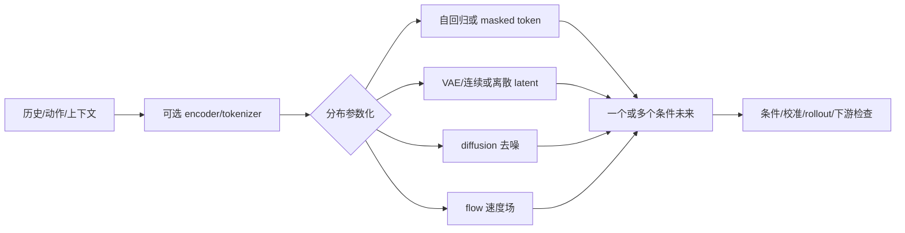

# 第5章 预测模型的生成式基础

> 状态：`reviewed`
> 资料核查日期：2026-09-02
> 关联实验：`EXP-05-01`
> 关联声明：`CLAIM-05-01`～`CLAIM-05-09`
> 关联图表：`FIG-05-01` / `TAB-05-01` / `TAB-05-02` / `TAB-05-03` / `TAB-05-04` / `TAB-05-05`
> 资源档位：S / M
> GPU 状态：待验证

## 本章契约

### 核心问题

当未来不唯一时，为什么只预测一个像素或状态均值会失败？VAE、离散 latent、自回归、masked prediction、扩散与 flow matching 分别在建模什么？怎样只掌握后续世界模型、视频预测和生成动作真正需要的部分？

### 先修与非目标

只要求基本概率、神经网络和监督学习直觉；不要求生成模型、3D、RL 或机器人经验。本章不推导完整 ELBO、score SDE 或 ODE 数值分析，不训练图像生成器，也不按样片质量排列方法。

学完后，读者应能区分点预测与分布预测、encoder 与 prior、teacher forcing 与自由采样，并为一个条件未来选择输出空间、训练目标和评测证据。

还要建立一个贯穿后续章节的判断习惯：先问“模型对什么随机变量建模”，再问“怎样训练、怎样生成、怎样用于决策”。VAE、token、自回归、masked prediction、diffusion 和 flow 并不处在同一个互斥分类层级；一个系统完全可以同时使用离散 tokenizer、自回归 prior、连续 latent dynamics 和 diffusion decoder。

## 5.1 从回归一个答案到建模条件分布

预测目标应先写成：

\[
p(x_{t+1:t+H}\mid x_{\le t}, a_{t:t+H-1}, c),
\]

其中 `c` 可含任务、地图或语言。若同一可见历史后可能左转或右转，平方误差最优点是条件均值；均值可能是一条从未出现的“中间未来”。这不是 MSE 实现错误，而是点估计与多模态任务不匹配。

这里需要一个重要限定：**条件均值并不天然错误**。如果下游损失本来就是平方误差，且只需要一个短时局部估计，那么条件均值正是 Bayes 最优点预测。问题出现在下游需要保留互斥假设、非线性风险或可执行轨迹时。例如“前车向左或向右避让”不能被一条穿过前车的平均轨迹替代；但“未来 50 ms 的传感器噪声均值”可能恰好是控制器需要的量。

因此，选择输出形式应从决策问题反推：

- 只需要平方损失下的中心趋势，可预测条件均值；
- 关心不对称代价，可预测 quantile 或其他风险函数；
- 需要互斥未来及其概率，应建模条件分布；
- 概率难以可靠估计但必须保留多个假设，可输出集合、粒子或场景树；
- 下游只需要任务充分状态，不必为了“生成式”而重建所有像素。

`CLAIM-05-01`（fact）：生成式预测的共同目标是表达条件数据分布或其可采样近似；VAE、token、自回归、masked、diffusion 和 flow 是不同参数化，架构名称本身不保证物理、动作或闭环有效。

分布模型也不能只展示一个幸运样本。至少报告 likelihood/校准、mode coverage、条件一致性、多样性、重复性，以及第9章定义的下游用途指标。



*FIG-05-01：生成式预测的共同合同。来源：本书原创，MIT，2026-08-31。分支可组合，输出样本仍需用途驱动验证。*

### 5.1.1 “生成式”至少包含四个不同问题

工程讨论常把“用了 diffusion”“输出 token”或“能生成视频”直接当作模型类型。更稳定的理解方式是把系统拆成四个正交维度：

| 维度 | 要回答的问题 | 常见选择 | 容易混淆之处 |
| --- | --- | --- | --- |
| 预测对象 | 随机变量究竟是什么 | 像素、离散 token、连续 latent、状态、轨迹、动作 | 能生成像素不等于状态适合规划 |
| 概率分解 | 联合分布怎样拆解 | 自回归条件、latent-variable marginal、masked conditional | 分解方式不等于网络骨架 |
| 训练信号 | 用什么可计算目标学习 | likelihood/ELBO、重建、去噪、score、速度场、对比预测 | 训练 loss 小不等于自由生成好 |
| 生成过程 | 部署时怎样得到预测 | 一次 decode、ancestral sampling、迭代 unmask、反向去噪、ODE 积分 | 训练可并行不等于生成也并行 |

条件变量与时间范围还要横跨四维单独登记：模型可以在训练时看到动作，却在生成时弱化它；也可以正确生成单步，却在递归 rollout 时离开训练分布。只有把这些维度拆开，才能解释“两个模型为什么不能只按架构名比较”。

另一个实用区分是**能否计算归一化密度**。自回归离散模型通常能逐 token 累加 log-probability；VAE 常优化的是含近似推断的下界；diffusion/flow 可以关联到概率密度，但实际 likelihood 计算可能需要额外数值过程；某些生成器只方便采样。能采样、能排序样本、能给出校准概率是三种不同能力。

## 5.2 压缩观测：AE、VAE 与离散 latent

普通 autoencoder 学 `x→z→x̂`，但任意 latent 不一定可从简单 prior 采样。VAE 引入近似 posterior `q(z|x)` 与 prior `p(z)`，优化重建项和 KL 正则；重参数化让随机连续 latent 可反向传播。[VAE 原论文](https://arxiv.org/abs/1312.6114)是这一接口的一手来源 `[A,R1]`。

VAE 中有三个角色不应混写：encoder 给出近似 posterior，用于“看到样本后推断 latent”；prior 描述生成前可用的 latent 分布；decoder 定义 latent 如何产生观测。训练时从 posterior 取样，生成时却通常从 prior 取样，二者之间的差距正是 KL 项试图约束、但不保证完全消除的部分。把 encoder 输出直接称为“世界状态”，会跳过可预测性、动作条件和任务充分性三项检查。

ELBO 也不只是“重建 loss 加 KL”这个口诀。它在数据拟合与 latent 编码成本之间建立权衡：重建项鼓励保留解释观测的信息，KL 项限制 posterior 偏离 prior 的程度。二者的单位、权重和 decoder 表达力都会改变 latent 的用途；较低的总 loss 不能告诉我们信息究竟保留在 latent、decoder 捷径还是像素细节中。

KL 太强或 decoder 太强时，latent 可能被忽略；重建好也不证明 latent 适合控制。第6章 RSSM 会让 posterior 用当前观测纠正状态，让 prior 在没有未来观测时 rollout。

VQ-VAE 把 encoder 输出映射到 codebook，得到离散 token，再学习 token prior。[VQ-VAE](https://arxiv.org/abs/1711.00937)区分离散 encoder code 与学习 prior `[A,R1]`。codebook 利用率、重建误差、token 频率和下游状态可读出性都要检查；离散化不会自动产生“对象级符号”。

## 5.3 序列与 masked prediction

自回归模型分解联合分布：

\[
p(x_{1:T}\mid c)=\prod_t p(x_t\mid x_{<t},c).
\]

训练时 teacher forcing 看真实前缀，部署时看自己的样本，因此 one-step likelihood 好不等于长 rollout 稳定。token 顺序还决定延迟：逐 token 解码精确表达依赖，却可能很慢。

Masked prediction 同时遮住一组 token 并恢复它们，可并行利用双向上下文；迭代 unmask 才成为生成过程。它与第10章 JEPA 不同：前者通常预测可解码 token/数据分布，JEPA 可只预测表示且不要求像素生成。

还要区分“学会一组条件分布”和“定义一个可一致采样的联合分布”。自回归分解天然给出固定顺序下的联合概率；masked objective 往往训练许多局部恢复问题，最终生成质量还依赖 mask 比例、更新顺序、迭代次数和冲突 token 的处理。训练时一次恢复多个位置的并行性，不会自动转化为任意条件下的一步联合采样。

## 5.4 Diffusion：学习逐步去噪

DDPM forward process 逐步把数据加噪，例如：

\[
x_t=\sqrt{\bar\alpha_t}x_0+\sqrt{1-\bar\alpha_t}\epsilon.
\]

模型从带噪样本和条件预测噪声、干净数据或相关目标，再沿反向过程采样。[DDPM](https://arxiv.org/abs/2006.11239)是基础来源 `[A,R1]`。训练可随机采一个时间步，推理却通常需要多次网络调用；采样器和步数属于部署合同。

扩散可以表达多峰，但条件被忽略、采样过少、长 rollout 漂移或数据 support 错误仍会失败。第14章把相同机制用于动作分布，不会把图像质量指标搬到控制上。

从概念上看，forward noising 是人为定义的训练桥梁，不是环境真实动力学；噪声时间 `t` 也不是视频时间或控制时间。机器人文献同时出现“diffusion timestep”“trajectory timestep”“control step”时，三者必须分别命名。混淆这些时间轴会让采样步数、动作 horizon 和真实执行频率看似可以直接换算。

## 5.5 Flow matching：回归概率路径的速度场

Flow matching 预先选择 noise 到 data 的条件概率路径，训练向量场匹配路径速度，再积分 ODE 生成样本。最简单直线路径为：

\[
x_t=(1-t)x_0+t x_1,\qquad u_t=x_1-x_0.
\]

[Flow Matching](https://arxiv.org/abs/2210.02747)说明该框架可包含 diffusion 路径，也可用其他路径 `[A,R1]`。它不是“永远一步生成”；求解步数、路径曲率、条件方式和模型误差共同决定成本与质量。

diffusion 与 flow 的核心共同点，是都引入一条从简单分布到数据分布的连续路径，并学习如何沿路径反向或正向运输样本；差别在于训练目标、路径参数化和采样方程。实践中，“flow 比 diffusion 快”不是架构定律：若向量场仍需多次 ODE 求解，或为了稳定性使用更细步长，调用次数同样可能很高。真正可比较的是在相同条件、输出表示和误差容忍度下的函数评估次数、端到端时延与样本质量。

## 5.6 不按流行度选方法：先匹配概率对象与使用方式

下面的路线不是互斥选项，而是不同层次的设计部件。阅读论文时应先把它还原到“表示、概率对象、训练查询、生成过程和主要瓶颈”。

| 路线 | 主要概率对象或表示 | 训练时回答什么问题 | 生成/使用方式 | 首要检查 |
| --- | --- | --- | --- | --- |
| VAE | 连续 latent 与条件 decoder | 当前样本可由怎样的 latent 解释 | 从 prior 采 latent 后 decode | posterior/prior gap、collapse、任务信息 |
| VQ/token | 离散 codebook | 连续输入如何量化为有限符号 | 另接 token prior 或预测器 | codebook 利用率、量化损失、语义错觉 |
| 自回归 | 有顺序的联合分布 | 给定真实前缀，下一个 token 是什么 | 逐 token ancestral sampling | teacher-forcing gap、顺序偏置、串行时延 |
| masked | 一组受遮位置的条件分布 | 给定双向可见上下文，缺失 token 是什么 | 一次恢复或迭代 unmask | mask/生成调度差异、联合一致性 |
| diffusion | 噪声层级上的 denoising/score 参数化 | 给定噪声状态，如何朝数据移动 | 多步反向去噪或其加速变体 | 条件使用、函数评估次数、采样误差 |
| flow | 概率路径上的速度场 | 路径中间点应沿哪个方向移动 | 数值积分 ODE 或少步近似 | 路径选择、求解误差、端到端成本 |

*TAB-05-01：按概率对象与使用方式组织的生成模型谱系。VQ 可接自回归或 masked prior，VAE decoder 也可由 diffusion 实现，因此表中行可以组合。*

一个实用选择顺序是：先确定下游需要单点、分位数、样本集合还是概率；再确定输出在像素、token、latent 还是任务状态中；随后根据延迟、内存和可校准性选择分解与生成过程；最后才选择网络规模。反过来从“当前最流行的生成器”出发，通常会把表示问题、概率问题和系统预算混在一起。

### 5.6.1 生成模型何时才是世界模型

能重建或生成观测的模型，不自动成为后续意义上的世界模型。至少还要回答四个问题：

1. **时间状态**：模型表示是否保留预测未来所需的历史，而不是只压缩当前图像？
2. **动作条件**：转移是否明确依赖 agent action，且响应方向与环境相符？
3. **自由展开**：没有未来真值纠正时，状态能否跨多步保持可解释和可用？
4. **决策接口**：planner 或 policy 能否从预测中读取奖励、约束、终止或任务相关结果？

视频生成器可能满足第一项的一部分，却忽略动作；动作条件生成器可能输出逼真片段，却没有稳定 latent 供规划反复查询；一个不生成像素的 latent dynamics 反而可能完整满足决策接口。因此“生成能力”“环境动力学”“可用于决策”应看成逐级增加的合同，而不是同义词。

## 5.7 EXP-05-01：均值落在两个合法未来之间

fixture 有 `fork` 和 `left_only` 两种上下文。`fork` 的未来为 `-1/+1` 各半；MSE 点预测为 0。

```bash
make ch05-test-local
make ch05-smoke-local
make ch05-smoke
```

| 指标 | 固定结果 |
| --- | ---: |
| fork 点均值 | 0 |
| 到最近合法未来距离 | 1 |
| 点均值期望 MSE | 1 |
| fork categorical NLL | 0.693147 nats |
| 条件/无条件全数据 NLL | 0.346574 / 0.562335 nats |
| 四个确定性分位样本 support coverage | 100% |

*TAB-05-02：`EXP-05-01` 解析结果。它不是神经生成模型 benchmark。*

`CLAIM-05-02`（result）：固定 fork 中 MSE 最优均值为 0，但距两个观测到的未来都为 1。

`CLAIM-05-03`（result）：显式条件分布保留两个 mode；在完整 fixture 上，条件 NLL 为 0.346574，低于忽略 context 的 0.562335。数字只适用于八个手工样本。

`CLAIM-05-04`（result）：解析 diffusion forward process 在 `alpha_bar=1/0` 返回 data/noise；直线 flow 在 `t=0/1` 返回 noise/data 且速度恒定。这验证公式端点，不比较训练或采样性能。

## 5.8 条件、latent 与动力学不能混为一谈

模型可能生成逼真图像却忽略动作；也可能 latent rollout 正确但 decoder 不够锐利。应分别检查：条件是否生效、latent 是否保留任务状态、转移是否动作敏感、decoder 是否忠实、自由 rollout 是否漂移。

`CLAIM-05-05`（recommendation）：世界预测实验应至少包含 action/context shuffle、确定性点预测、分布模型、oracle/真实转移和自由 rollout 对照；只比较单帧视觉质量不能证明世界模型用途。

### 5.8.1 条件相关不等于动作干预

写出 `p(x_{t+1}|x_{le t},a_t)` 只说明模型把动作作为输入，不保证它学到“执行该动作会怎样”。离线数据中的动作由行为策略选择，动作与场景难度、操作者意图和历史状态可能强相关。模型可以依赖这些相关线索预测未来，即使它没有识别动作的环境效应。

可以把三个问题依次分开：

- **条件可读**：改变 action tensor 后输出是否变化；
- **方向正确**：在有配对证据的状态上，变化是否符合真实转移方向；
- **干预可迁移**：换到行为策略较少执行、但仍在有效支持内的动作时，预测是否成立。

action shuffle 主要检查第一层；有真实配对或 simulator counterfactual 才能加强第二层；第三层还需要动作覆盖、overlap 和分布外边界。对于纯观察数据，`p(next|history,action)` 与因果量 `p(next|history,do(action))` 不能仅凭符号相似就等同。后续章节使用“action-conditioned”时，默认只描述接口，除非实验另有干预证据。

### 5.8.2 从症状出发的错误诊断树

生成模型失败时，不要先换架构。按数据合同→条件使用→分布覆盖→时间展开→下游用途的顺序检查，才能避免用后级指标掩盖前级错误。

1. **先重放数据合同**：同一 target 是否使用相同单位、归一化、裁剪、tokenizer、时间戳和 mask？如果不一致，likelihood 与样本距离都没有共同语义。
2. **再检查条件是否被使用**：固定 noise/seed，只改变 action、历史或上下文；同时做 context shuffle。输出分布几乎不变时，模型可能在忽略条件。
3. **再分开 coverage 与 validity**：缺少已观察 mode 是 mode dropping；给未观察结果分配质量是 support 外生成。二者可能同时发生，不能用“多样性高”互相抵消。
4. **然后检查概率与样本是否一致**：报告 NLL/校准，也报告多 seed 样本的 mode coverage、重复率和失败样本。单个最好样本既不能证明覆盖，也不能证明校准。
5. **最后展开时间并进入用途**：teacher-forced one-step、自由 rollout、干预、规划排序和真实闭环逐级检查。前四步通过仍不保证决策有效。

| 症状 | 最小对照 | 可以支持的诊断 | 仍不能断言 |
| --- | --- | --- | --- |
| 改 action 后输出近似不变 | 同 seed action swap、context shuffle | 条件敏感性不足 | 一定是网络容量不足 |
| 样本只剩一种合法未来 | 分桶 mode recall、条件 NLL | mode dropping | 未出现 mode 在真实分布中不存在 |
| 样本很多但出现非法状态 | support/约束检查、oracle transition | 越界概率质量或动力学错误 | 图像越锐利就越物理 |
| one-step 好、自由 rollout 漂移 | teacher forcing 与相同 horizon rollout | 暴露偏差或复合误差 | 所有误差都来自生成器 |
| 视觉指标好、规划更差 | 固定 planner 的策略排序/闭环对照 | 指标与用途错位 | 视觉质量普遍无用 |

对两个离散分布 `p`、`q`，total variation distance 为：

\[
D_{TV}(p,q)=\frac{1}{2}\sum_x |p(x)-q(x)|.
\]

它可以量化“改变条件后预测分布变化多少”，但较大不自动代表变化方向正确；仍需与真实条件分布或可执行后果对照。连续模型的 density 还会随变量单位、离散化和可逆预处理改变，因此只在输出表示和评测实现一致时比较 NLL。

`EXP-05-01` 增加三个故障分布：`collapsed` 给第二个已观察 mode 的概率低于 1%，`hallucinated` 给未观察的中间值 10% 概率，`context_ignored` 对不同上下文返回相同边际分布。

| fixture | 条件 TV | 已观察 mode recall | 观察 support 外概率质量 |
| --- | ---: | ---: | ---: |
| faithful conditioned | 0.5 | 100% | 0% |
| context ignored | 0.0 | 100% | 0% |
| collapsed | — | 50% | 0% |
| hallucinated | — | 100% | 10% |

*TAB-05-03：离散 fixture 的互补诊断。这里的“观察 support”只指八个手工样本，不是真实连续数据分布的完整 support。*

`CLAIM-05-07`（result）：在固定 fixture 中，条件模型跨 `fork/left_only` 的 TV 为 `0.5`，条件忽略模型为 `0`；mode collapse 与虚构 mode 又分别表现为 50% mode recall 和 10% 观察 support 外概率质量。任一单项指标都无法识别全部三类错误。

### 5.8.3 aleatoric 与 epistemic 不确定性

同一完整状态下仍存在多种合理结果，属于 aleatoric 不确定性；训练覆盖不足、参数不确定或 OOD 输入导致的“模型不知道”，通常归为 epistemic 不确定性。单个生成模型多采样几次主要展示其学到的条件分布，不会自动暴露它没有学到的世界。实践中还需要数据密度/OOD 测试、模型或 checkpoint 集成、扰动一致性与保留场景验证。

[Deep Ensembles](https://proceedings.neurips.cc/paper_files/paper/2017/hash/9ef2ed4b7fd2c810847ffa5fa85bce38-Abstract.html)把独立初始化成员的预测聚合作为可扩展不确定性基线；[Ovadia et al.](https://proceedings.neurips.cc/paper/2019/hash/8558cb408c1d76621371888657d2eb1d-Abstract.html)则在多种 dataset shift 严重度上比较准确率与校准退化 `[P,R1]`。这些工作支持“必须在 shift 下评估估计器”，不支持把任意成员分歧直接解释成 epistemic 概率，也不保证 ensemble 成员会学到不同错误。

`EXP-05-01` v4 用三个手写标量成员演示这个边界。为便于初学者直接计算，定义 range score

\[
u(x)=\max_m \hat y_m(x)-\min_m \hat y_m(x),
\]

并固定 `u>0.25` 才 defer。这里的 range 不是方差、置信区间或校准概率；阈值也不是从数据估计的。

| case | 三个成员预测 | target | ensemble mean 的 absolute error | range | 是否 defer |
| --- | --- | ---: | ---: | ---: | --- |
| `in_distribution` | `-0.1, 0, 0.1` | 0 | 0 | 0.2 | 否 |
| `diverse_ood` | `1, 2, 3` | -2 | 4 | 2 | 是 |
| `shared_error_ood` | `2, 2, 2` | -2 | 4 | 0 | 否 |

*TAB-05-04：ensemble range 的有用拒绝与共同错误假阴性。所有值均为手写教学 fixture。*

`CLAIM-05-08`（result）：固定 range gate 拒绝了成员分歧为 2 的 `diverse_ood`，却接受了三个成员完全一致、ensemble mean 绝对误差仍为 4 的 `shared_error_ood`。该结果只证明低 disagreement 不蕴含正确，也不测量 learned ensemble、OOD 检出率、校准、真实错误相关性或安全性。

v4 再加入 `diverse_correct=(-1,0,1), target=0`。它的成员 range 同样为2，但 ensemble mean error 为0；于是 score 排序同时包含“低分但错”和“高分但对”。令绝对误差大于1为手工 failure，range 不超过阈值才接受：

| range 阈值 | coverage | 接受 failure rate | 接受 mean absolute error | 正确样本 defer rate |
| ---: | ---: | ---: | ---: | ---: |
| 0 | 0.25 | 1.00 | 4.00 | 1.00 |
| 0.25 | 0.50 | 0.50 | 2.00 | 0.50 |
| 2 | 1.00 | 0.50 | 2.00 | 0.00 |

*TAB-05-05：`EXP-05-01` v4 的四例 disagreement risk–coverage 扫描。failure 标签、误差容差1和阈值均由作者设定，不是总体风险估计。*

`CLAIM-05-09`（result）：固定四例 panel 中，range 阈值0只接受 `shared_error_ood`，coverage 为0.25且接受 failure rate 为1；阈值0.25接受低误差 ID 与共同错误，coverage/risk 为0.5/0.5；阈值2接受全部，coverage/risk 为1/0.5。它只证明该手工排序中收紧 disagreement gate 可降低 coverage 却提高接受错误比例，不能估计 learned ensemble 的 risk–coverage、阈值泛化、OOD 检出率、校准或安全收益。

因此，成员训练数据、初始化、架构和 checkpoint 数量必须登记，且要在冻结的 ID/shift/OOD/stress split 上把 score 与真实错误配对。若所有成员共享数据捷径、标签错误、架构盲点或 simulator bias，它们可能一致地自信犯错；此时仍需覆盖测试、外部 detector、约束检查与真实/高保真后果验证。

自动驾驶里，前车可能左/右避让是多未来；从未见过的施工车辆、传感器故障或新道路规则是覆盖问题。两者都可能产生多样样本，但风险处理不同：前者进入概率化规划，后者应触发保守拒绝、降级或额外感知，而不是从生成样本里挑一个最乐观未来。

第9章进一步用 risk–coverage 评估“不知道”的排序是否真的集中失败；第21章把冻结阈值、估计器版本和 fallback 后果接入执行网关。概念上的 epistemic uncertainty 只有经过这两级协议，才成为可审计的拒绝机制。

## 5.9 自动驾驶：多未来不等于随机驾驶

遮挡车辆可能保持、减速或切入；ego 候选动作也改变未来。驾驶模型应把 ego action、他车行为、地图和信号灯分开条件化，并报告 mode coverage、碰撞/越界、时间一致性和概率校准。采样出多个未来是表达不确定性，不是让控制器随机挑一条。

`CLAIM-05-06`（recommendation）：自动驾驶生成式预测必须区分 aleatoric 多模态与 OOD/模型无知，并把候选未来交给有风险约束的 planner；生成概率不能越过第21章安全网关。

## 5.10 资源、许可与边界

S 档只用 Python 标准库、CPU、零下载。M 档可在程序化低维数据或小图像上训练微型 VAE/token/diffusion/flow，默认不超过 24 GB 单卡；当前没有 GPU，故训练、显存和生成质量均为 `pending`。2×80 GB 大视频生成不属于本章必需路径。

本章公式和 fixture 按 MIT 发布；论文、代码、模型和数据遵循各自许可。不能因实现库为 Apache/MIT 就推断 checkpoint 或训练数据同许可。

## 小结

生成式预测不是一种单独架构，而是一组关于“预测什么、怎样分解概率、用什么信号训练、怎样产生样本”的选择。未来不唯一时，条件均值可能丢失互斥假设，但在平方损失和局部估计下也可能正是正确答案；是否需要完整分布必须由决策损失决定。

latent、token、自回归、masked、diffusion 和 flow 可以组合，不能只按方法名比较。能生成观测也不自动成为世界模型：还需要时间状态、动作条件、自由 rollout 和决策接口。最后，模型对 action 敏感只证明输入被读取，不证明学到了可干预、可迁移的动力学；这一边界将贯穿第6、9、11和17章。

## 练习

1. **分布实验**：给 fork 增加第三个 mode，比较均值、mode recall 和观察 support 外质量。
2. **概念辨析**：解释 VAE posterior、RSSM posterior 与 learned dynamics prior 的区别。
3. **实时性分析**：比较 diffusion 采样步数和 action chunk deadline 的冲突。
4. **条件设计**：为车辆切入写出 ego action 与他车 behavior 的条件 schema，并设计 context-shuffle 对照。
5. **反例设计**：构造一个 TV 很高但条件响应方向错误的模型，说明为什么敏感性不等于正确性。
6. **不确定性计算**：把 `shared_error_ood` 的一个成员改为 `-2`，计算 range、mean error 和 defer 结果；解释为何“更分歧”与“平均预测更正确”是两个问题。
7. **排序审计**：复算 `TAB-05-05` 三个阈值的 coverage/risk，并解释为什么阈值只能在冻结真值 split 上选择。

## 自检要点

以下答案给出可核算的最小闭环；开放题允许其他设计，但必须写清分布、条件变量、时间预算和判定阈值，不能只用“更真实”代替指标。

<details markdown="1">
<summary>SELF-CHECK-05-01：三模态分布</summary>

例如把等权 support 设为 `{-1,0,1}`，均值仍为 0，但这次均值恰好落在真实 support 上；这说明“均值是否离开 support”依赖具体分布，不能从“多模态”三个字直接推出。忠实采样器的 mode recall 为 1、support 外质量为 0；只生成一个 mode 的 collapsed sampler recall 为 `1/3`；若三个 mode 都覆盖但另有 10% 质量落在 support 外，则 recall 仍可为 1，而 support 外质量为 0.1。均值、覆盖率和非法质量回答的是三个不同问题，应并列报告。

</details>

<details markdown="1">
<summary>SELF-CHECK-05-02：posterior 与 dynamics prior</summary>

VAE posterior 通常写成 `q(z|x)`，用当前样本推断生成 latent，并通过 prior regularization 使其可采样。RSSM posterior 是序列过滤分布，如 `q(s_t|h_t,o_t)`，会用当前观测修正由历史和动作形成的 belief。learned dynamics prior 如 `p(s_t|h_t)` 或 `p(s_t|s_{t-1},a_{t-1})` 不看当前 `o_t`，用于想象与 open-loop rollout。三者都叫“分布”不等于条件集合或训练职责相同；RSSM 还要让 posterior state 与可预测的 prior 对齐。

</details>

<details markdown="1">
<summary>SELF-CHECK-05-03：采样步数与控制时限</summary>

先把 deadline 写成预算：`N × t_step + t_condition + t_decode + t_io + safety_margin ≤ T_control`。增加 diffusion step 可能改善样本，却线性或近线性增加延迟；若 action chunk 每 100 ms 必须刷新，而 20 步去噪每步 6 ms，仅去噪已需 120 ms，方案即使离线指标更好也不可部署。应比较少步蒸馏、并行化、较长 action chunk 和 fallback，并同时报告端到端 P50/P95/P99、deadline miss rate 与闭环质量，而不是只报单步 GPU latency。

</details>

<details markdown="1">
<summary>SELF-CHECK-05-04：车辆切入条件与 shuffle 对照</summary>

一个最小 schema 可含 `history_id,timestamp,ego_state,ego_action_chunk,other_vehicle_history,other_behavior_intent,map_context,horizon,target_future`；其中 ego action 与他车行为必须是可独立干预的字段，不能埋在同一个视频 token 中。固定历史与地图，交换 batch 内 `ego_action_chunk` 或 `other_behavior_intent`，分别测预测位移、碰撞概率和响应方向变化；再保留“不 shuffle”的 matched control。若 shuffle 后指标几乎不变，模型可能忽略条件；变化很大仍需与真实反事实方向比对，不能只称“敏感”。

</details>

<details markdown="1">
<summary>SELF-CHECK-05-05：高 TV 但方向错误</summary>

令真实条件规律为 `x=0 → y=0`、`x=1 → y=1`，错误模型却给出 `x=0 → y=1`、`x=1 → y=0`，且两者都是确定分布。模型两个条件输出之间的 TV 为 1，说明它强烈响应了 `x`；但每个条件都与真值反向，条件准确率为 0。故 context sensitivity 只能排查“完全忽略条件”，正确性还需有配对反事实、方向一致性或条件真值误差。

</details>

<details markdown="1">
<summary>SELF-CHECK-05-06：ensemble 分歧与 defer</summary>

把 `(2,2,2)` 改成 `(-2,2,2)`、真值保持 `-2`：range 从 0 变为 4；ensemble mean 为 `2/3`；mean prediction error 的绝对值为 `|2/3-(-2)|=8/3≈2.667`，比原来的 4 小但仍然错误。fixture 阈值为 0.25，因此 range 4 会触发 defer。分歧是拒绝/路由信号，均值误差是预测质量；一次修改可让两者同时改善，也可能让一个改善另一个恶化，不能互相替代。

</details>

<details markdown="1">
<summary>SELF-CHECK-05-07：严格 disagreement gate 也可能留下最差接受集</summary>

阈值0只接受 range 恰为0的 `shared_error_ood`，而它的 mean error 为4并超过手工容差1，所以 coverage 是1/4、accepted failure rate 是1。放宽到0.25后，低误差 ID case 也被接受，coverage变成2/4、risk降为1/2；放宽到2后四例全收，risk仍为2/4。合格答案必须指出 risk 不随阈值收紧而保证单调下降，因为 range 排序本身可能错误；四个手工点也不能用于选择生产阈值或估计总体风险。

</details>

## 延伸阅读

- [Auto-Encoding Variational Bayes](https://arxiv.org/abs/1312.6114)；
- [Neural Discrete Representation Learning](https://arxiv.org/abs/1711.00937)；
- [Denoising Diffusion Probabilistic Models](https://arxiv.org/abs/2006.11239)；
- [Flow Matching for Generative Modeling](https://arxiv.org/abs/2210.02747)；
- [Simple and Scalable Predictive Uncertainty Estimation using Deep Ensembles](https://proceedings.neurips.cc/paper_files/paper/2017/hash/9ef2ed4b7fd2c810847ffa5fa85bce38-Abstract.html)；
- [Can You Trust Your Model's Uncertainty?](https://proceedings.neurips.cc/paper/2019/hash/8558cb408c1d76621371888657d2eb1d-Abstract.html)；
- [Hugging Face Diffusers](https://github.com/huggingface/diffusers)，实现参考，未在本章运行。

## 下一章接口

第6章把连续 stochastic latent 放入循环状态模型；第10章用 JEPA 对照“不要求生成”；第11章把 token/diffusion/flow 接到动作条件视频；第14章把分布目标迁移到动作。

## 验收与审查记录

- 内容审查：通过；
- 代码审查：通过；
- 一致性审查：通过；
- 教学审查：通过；
- 审查记录路径：`reviews/ch05-diagnostic-review-2026-09-01.md`、`reviews/ch05-ch09-ch21-epistemic-gate-review-2026-09-02.md`、`reviews/part-02-exercise-self-check-review-2026-09-02.md`；
- 已知限制：只有解析标量 fixture；mode recall 与 support 外质量只相对手工观察集合定义，ensemble 成员、OOD/failure 标签、误差容差和阈值也是手写的，没有训练神经网络、估计 risk/calibration、图像/视频或 GPU。
