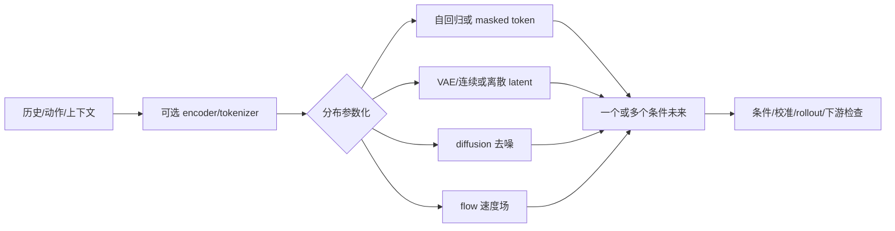

# 第5章 预测模型的生成式基础

> 状态：`reviewed`
> 资料核查日期：2026-09-02
> 关联实验：`EXP-05-01`
> 关联声明：`CLAIM-05-01`～`CLAIM-05-08`
> 关联图表：`FIG-05-01` / `TAB-05-01` / `TAB-05-02` / `TAB-05-03` / `TAB-05-04`
> 资源档位：S / M
> GPU 状态：待验证

## 本章契约

### 核心问题

当未来不唯一时，为什么只预测一个像素或状态均值会失败？VAE、离散 latent、自回归、masked prediction、扩散与 flow matching 分别在建模什么？怎样只掌握后续世界模型、视频预测和生成动作真正需要的部分？

### 先修与非目标

只要求基本概率、神经网络和监督学习直觉；不要求生成模型、3D、RL 或机器人经验。本章不推导完整 ELBO、score SDE 或 ODE 数值分析，不训练图像生成器，也不按样片质量排列方法。

学完后，读者应能区分点预测与分布预测、encoder 与 prior、teacher forcing 与自由采样，并为一个条件未来选择输出空间、训练目标和评测证据。

## 5.1 从回归一个答案到建模条件分布

预测目标应先写成：

\[
p(x_{t+1:t+H}\mid x_{\le t}, a_{t:t+H-1}, c),
\]

其中 `c` 可含任务、地图或语言。若同一可见历史后可能左转或右转，平方误差最优点是条件均值；均值可能是一条从未出现的“中间未来”。这不是 MSE 实现错误，而是点估计与多模态任务不匹配。

`CLAIM-05-01`（fact）：生成式预测的共同目标是表达条件数据分布或其可采样近似；VAE、token、自回归、masked、diffusion 和 flow 是不同参数化，架构名称本身不保证物理、动作或闭环有效。

分布模型也不能只展示一个幸运样本。至少报告 likelihood/校准、mode coverage、条件一致性、多样性、重复性，以及第9章定义的下游用途指标。



*FIG-05-01：生成式预测的共同合同。来源：本书原创，MIT，2026-08-31。分支可组合，输出样本仍需用途驱动验证。*

## 5.2 压缩观测：AE、VAE 与离散 latent

普通 autoencoder 学 `x→z→x̂`，但任意 latent 不一定可从简单 prior 采样。VAE 引入近似 posterior `q(z|x)` 与 prior `p(z)`，优化重建项和 KL 正则；重参数化让随机连续 latent 可反向传播。[VAE 原论文](https://arxiv.org/abs/1312.6114)是这一接口的一手来源 `[A,R1]`。

KL 太强或 decoder 太强时，latent 可能被忽略；重建好也不证明 latent 适合控制。第6章 RSSM 会让 posterior 用当前观测纠正状态，让 prior 在没有未来观测时 rollout。

VQ-VAE 把 encoder 输出映射到 codebook，得到离散 token，再学习 token prior。[VQ-VAE](https://arxiv.org/abs/1711.00937)区分离散 encoder code 与学习 prior `[A,R1]`。codebook 利用率、重建误差、token 频率和下游状态可读出性都要检查；离散化不会自动产生“对象级符号”。

## 5.3 序列与 masked prediction

自回归模型分解联合分布：

\[
p(x_{1:T}\mid c)=\prod_t p(x_t\mid x_{<t},c).
\]

训练时 teacher forcing 看真实前缀，部署时看自己的样本，因此 one-step likelihood 好不等于长 rollout 稳定。token 顺序还决定延迟：逐 token 解码精确表达依赖，却可能很慢。

Masked prediction 同时遮住一组 token 并恢复它们，可并行利用双向上下文；迭代 unmask 才成为生成过程。它与第10章 JEPA 不同：前者通常预测可解码 token/数据分布，JEPA 可只预测表示且不要求像素生成。

## 5.4 Diffusion：学习逐步去噪

DDPM forward process 逐步把数据加噪，例如：

\[
x_t=\sqrt{\bar\alpha_t}x_0+\sqrt{1-\bar\alpha_t}\epsilon.
\]

模型从带噪样本和条件预测噪声、干净数据或相关目标，再沿反向过程采样。[DDPM](https://arxiv.org/abs/2006.11239)是基础来源 `[A,R1]`。训练可随机采一个时间步，推理却通常需要多次网络调用；采样器和步数属于部署合同。

扩散可以表达多峰，但条件被忽略、采样过少、长 rollout 漂移或数据 support 错误仍会失败。第14章把相同机制用于动作分布，不会把图像质量指标搬到控制上。

## 5.5 Flow matching：回归概率路径的速度场

Flow matching 预先选择 noise 到 data 的条件概率路径，训练向量场匹配路径速度，再积分 ODE 生成样本。最简单直线路径为：

\[
x_t=(1-t)x_0+t x_1,\qquad u_t=x_1-x_0.
\]

[Flow Matching](https://arxiv.org/abs/2210.02747)说明该框架可包含 diffusion 路径，也可用其他路径 `[A,R1]`。它不是“永远一步生成”；求解步数、路径曲率、条件方式和模型误差共同决定成本与质量。

## 5.6 一张选择表

| 路线 | 表示/目标 | 主要优势 | 必查失败 |
| --- | --- | --- | --- |
| VAE | 连续 latent、ELBO | 压缩与随机 latent | posterior collapse、模糊重建 |
| VQ/token | 离散 code + prior | 接序列模型、压缩 | codebook collapse、量化损失 |
| 自回归 | next token likelihood | 显式序列分布 | 暴露偏差、串行延迟 |
| masked | masked token recovery | 双向上下文、并行训练 | 生成调度与训练不一致 |
| diffusion | 去噪目标 | 连续多模态 | 多步时延、条件忽略 |
| flow | 速度场 | 灵活概率路径 | ODE 步数、路径/求解误差 |

*TAB-05-01：后续章节复用的生成模型最小谱系。方法可组合。*

## 5.7 EXP-05-01：均值落在两个合法未来之间

fixture 有 `fork` 和 `left_only` 两种上下文。`fork` 的未来为 `-1/+1` 各半；MSE 点预测为 0。

```bash
make ch05-test-local
make ch05-smoke-local
make ch05-smoke
```

| 指标 | 固定结果 |
| --- | ---: |
| fork 点均值 | 0 |
| 到最近合法未来距离 | 1 |
| 点均值期望 MSE | 1 |
| fork categorical NLL | 0.693147 nats |
| 条件/无条件全数据 NLL | 0.346574 / 0.562335 nats |
| 四个确定性分位样本 support coverage | 100% |

*TAB-05-02：`EXP-05-01` 解析结果。它不是神经生成模型 benchmark。*

`CLAIM-05-02`（result）：固定 fork 中 MSE 最优均值为 0，但距两个观测到的未来都为 1。

`CLAIM-05-03`（result）：显式条件分布保留两个 mode；在完整 fixture 上，条件 NLL 为 0.346574，低于忽略 context 的 0.562335。数字只适用于八个手工样本。

`CLAIM-05-04`（result）：解析 diffusion forward process 在 `alpha_bar=1/0` 返回 data/noise；直线 flow 在 `t=0/1` 返回 noise/data 且速度恒定。这验证公式端点，不比较训练或采样性能。

## 5.8 条件、latent 与动力学不能混为一谈

模型可能生成逼真图像却忽略动作；也可能 latent rollout 正确但 decoder 不够锐利。应分别检查：条件是否生效、latent 是否保留任务状态、转移是否动作敏感、decoder 是否忠实、自由 rollout 是否漂移。

`CLAIM-05-05`（recommendation）：世界预测实验应至少包含 action/context shuffle、确定性点预测、分布模型、oracle/真实转移和自由 rollout 对照；只比较单帧视觉质量不能证明世界模型用途。

### 5.8.1 从症状出发的错误诊断树

生成模型失败时，不要先换架构。按数据合同→条件使用→分布覆盖→时间展开→下游用途的顺序检查，才能避免用后级指标掩盖前级错误。

1. **先重放数据合同**：同一 target 是否使用相同单位、归一化、裁剪、tokenizer、时间戳和 mask？如果不一致，likelihood 与样本距离都没有共同语义。
2. **再检查条件是否被使用**：固定 noise/seed，只改变 action、历史或上下文；同时做 context shuffle。输出分布几乎不变时，模型可能在忽略条件。
3. **再分开 coverage 与 validity**：缺少已观察 mode 是 mode dropping；给未观察结果分配质量是 support 外生成。二者可能同时发生，不能用“多样性高”互相抵消。
4. **然后检查概率与样本是否一致**：报告 NLL/校准，也报告多 seed 样本的 mode coverage、重复率和失败样本。单个最好样本既不能证明覆盖，也不能证明校准。
5. **最后展开时间并进入用途**：teacher-forced one-step、自由 rollout、干预、规划排序和真实闭环逐级检查。前四步通过仍不保证决策有效。

| 症状 | 最小对照 | 可以支持的诊断 | 仍不能断言 |
| --- | --- | --- | --- |
| 改 action 后输出近似不变 | 同 seed action swap、context shuffle | 条件敏感性不足 | 一定是网络容量不足 |
| 样本只剩一种合法未来 | 分桶 mode recall、条件 NLL | mode dropping | 未出现 mode 在真实分布中不存在 |
| 样本很多但出现非法状态 | support/约束检查、oracle transition | 越界概率质量或动力学错误 | 图像越锐利就越物理 |
| one-step 好、自由 rollout 漂移 | teacher forcing 与相同 horizon rollout | 暴露偏差或复合误差 | 所有误差都来自生成器 |
| 视觉指标好、规划更差 | 固定 planner 的策略排序/闭环对照 | 指标与用途错位 | 视觉质量普遍无用 |

对两个离散分布 `p`、`q`，total variation distance 为：

\[
D_{TV}(p,q)=\frac{1}{2}\sum_x |p(x)-q(x)|.
\]

它可以量化“改变条件后预测分布变化多少”，但较大不自动代表变化方向正确；仍需与真实条件分布或可执行后果对照。连续模型的 density 还会随变量单位、离散化和可逆预处理改变，因此只在输出表示和评测实现一致时比较 NLL。

`EXP-05-01` 增加三个故障分布：`collapsed` 给第二个已观察 mode 的概率低于 1%，`hallucinated` 给未观察的中间值 10% 概率，`context_ignored` 对不同上下文返回相同边际分布。

| fixture | 条件 TV | 已观察 mode recall | 观察 support 外概率质量 |
| --- | ---: | ---: | ---: |
| faithful conditioned | 0.5 | 100% | 0% |
| context ignored | 0.0 | 100% | 0% |
| collapsed | — | 50% | 0% |
| hallucinated | — | 100% | 10% |

*TAB-05-03：离散 fixture 的互补诊断。这里的“观察 support”只指八个手工样本，不是真实连续数据分布的完整 support。*

`CLAIM-05-07`（result）：在固定 fixture 中，条件模型跨 `fork/left_only` 的 TV 为 `0.5`，条件忽略模型为 `0`；mode collapse 与虚构 mode 又分别表现为 50% mode recall 和 10% 观察 support 外概率质量。任一单项指标都无法识别全部三类错误。

### 5.8.2 aleatoric 与 epistemic 不确定性

同一完整状态下仍存在多种合理结果，属于 aleatoric 不确定性；训练覆盖不足、参数不确定或 OOD 输入导致的“模型不知道”，通常归为 epistemic 不确定性。单个生成模型多采样几次主要展示其学到的条件分布，不会自动暴露它没有学到的世界。实践中还需要数据密度/OOD 测试、模型或 checkpoint 集成、扰动一致性与保留场景验证。

[Deep Ensembles](https://proceedings.neurips.cc/paper_files/paper/2017/hash/9ef2ed4b7fd2c810847ffa5fa85bce38-Abstract.html)把独立初始化成员的预测聚合作为可扩展不确定性基线；[Ovadia et al.](https://proceedings.neurips.cc/paper/2019/hash/8558cb408c1d76621371888657d2eb1d-Abstract.html)则在多种 dataset shift 严重度上比较准确率与校准退化 `[P,R1]`。这些工作支持“必须在 shift 下评估估计器”，不支持把任意成员分歧直接解释成 epistemic 概率，也不保证 ensemble 成员会学到不同错误。

`EXP-05-01` v3 用三个手写标量成员演示这个边界。为便于初学者直接计算，定义 range score

\[
u(x)=\max_m \hat y_m(x)-\min_m \hat y_m(x),
\]

并固定 `u>0.25` 才 defer。这里的 range 不是方差、置信区间或校准概率；阈值也不是从数据估计的。

| case | 三个成员预测 | target | ensemble mean 的 absolute error | range | 是否 defer |
| --- | --- | ---: | ---: | ---: | --- |
| `in_distribution` | `-0.1, 0, 0.1` | 0 | 0 | 0.2 | 否 |
| `diverse_ood` | `1, 2, 3` | -2 | 4 | 2 | 是 |
| `shared_error_ood` | `2, 2, 2` | -2 | 4 | 0 | 否 |

*TAB-05-04：ensemble range 的有用拒绝与共同错误假阴性。所有值均为手写教学 fixture。*

`CLAIM-05-08`（result）：固定 range gate 拒绝了成员分歧为 2 的 `diverse_ood`，却接受了三个成员完全一致、ensemble mean 绝对误差仍为 4 的 `shared_error_ood`。该结果只证明低 disagreement 不蕴含正确，也不测量 learned ensemble、OOD 检出率、校准、真实错误相关性或安全性。

因此，成员训练数据、初始化、架构和 checkpoint 数量必须登记，且要在冻结的 ID/shift/OOD/stress split 上把 score 与真实错误配对。若所有成员共享数据捷径、标签错误、架构盲点或 simulator bias，它们可能一致地自信犯错；此时仍需覆盖测试、外部 detector、约束检查与真实/高保真后果验证。

自动驾驶里，前车可能左/右避让是多未来；从未见过的施工车辆、传感器故障或新道路规则是覆盖问题。两者都可能产生多样样本，但风险处理不同：前者进入概率化规划，后者应触发保守拒绝、降级或额外感知，而不是从生成样本里挑一个最乐观未来。

第9章进一步用 risk–coverage 评估“不知道”的排序是否真的集中失败；第21章把冻结阈值、估计器版本和 fallback 后果接入执行网关。概念上的 epistemic uncertainty 只有经过这两级协议，才成为可审计的拒绝机制。

## 5.9 自动驾驶：多未来不等于随机驾驶

遮挡车辆可能保持、减速或切入；ego 候选动作也改变未来。驾驶模型应把 ego action、他车行为、地图和信号灯分开条件化，并报告 mode coverage、碰撞/越界、时间一致性和概率校准。采样出多个未来是表达不确定性，不是让控制器随机挑一条。

`CLAIM-05-06`（recommendation）：自动驾驶生成式预测必须区分 aleatoric 多模态与 OOD/模型无知，并把候选未来交给有风险约束的 planner；生成概率不能越过第21章安全网关。

## 5.10 资源、许可与边界

S 档只用 Python 标准库、CPU、零下载。M 档可在程序化低维数据或小图像上训练微型 VAE/token/diffusion/flow，默认不超过 24 GB 单卡；当前没有 GPU，故训练、显存和生成质量均为 `pending`。2×80 GB 大视频生成不属于本章必需路径。

本章公式和 fixture 按 MIT 发布；论文、代码、模型和数据遵循各自许可。不能因实现库为 Apache/MIT 就推断 checkpoint 或训练数据同许可。

## 小结

生成式预测在未来不唯一时建模分布。latent、token、自回归、masked、diffusion 和 flow 提供不同接口，最终仍要由条件敏感性、自由 rollout 和下游闭环验证。

## 练习

1. 给 fork 增加第三个 mode，比较均值、mode recall 和观察 support 外质量。
2. 解释 VAE posterior、RSSM posterior 与 learned dynamics prior 的区别。
3. 比较 diffusion 采样步数和 action chunk deadline 的冲突。
4. 为车辆切入写出 ego action 与他车 behavior 的条件 schema，并设计 context-shuffle 对照。
5. 构造一个 TV 很高但条件响应方向错误的模型，说明为什么敏感性不等于正确性。
6. 把 `shared_error_ood` 的一个成员改为 `-2`，计算 range、mean error 和 defer 结果；解释为何“更分歧”与“平均预测更正确”是两个问题。

## 延伸阅读

- [Auto-Encoding Variational Bayes](https://arxiv.org/abs/1312.6114)；
- [Neural Discrete Representation Learning](https://arxiv.org/abs/1711.00937)；
- [Denoising Diffusion Probabilistic Models](https://arxiv.org/abs/2006.11239)；
- [Flow Matching for Generative Modeling](https://arxiv.org/abs/2210.02747)；
- [Simple and Scalable Predictive Uncertainty Estimation using Deep Ensembles](https://proceedings.neurips.cc/paper_files/paper/2017/hash/9ef2ed4b7fd2c810847ffa5fa85bce38-Abstract.html)；
- [Can You Trust Your Model's Uncertainty?](https://proceedings.neurips.cc/paper/2019/hash/8558cb408c1d76621371888657d2eb1d-Abstract.html)；
- [Hugging Face Diffusers](https://github.com/huggingface/diffusers)，实现参考，未在本章运行。

## 下一章接口

第6章把连续 stochastic latent 放入循环状态模型；第10章用 JEPA 对照“不要求生成”；第11章把 token/diffusion/flow 接到动作条件视频；第14章把分布目标迁移到动作。

## 验收与审查记录

- 内容审查：通过；
- 代码审查：通过；
- 一致性审查：通过；
- 教学审查：通过；
- 审查记录路径：`reviews/ch05-diagnostic-review-2026-09-01.md`、`reviews/ch05-ch09-ch21-epistemic-gate-review-2026-09-02.md`；
- 已知限制：只有解析标量 fixture；mode recall 与 support 外质量只相对手工观察集合定义，ensemble 成员和 OOD 标签也是手写的，没有训练神经网络、估计校准、图像/视频或 GPU。
