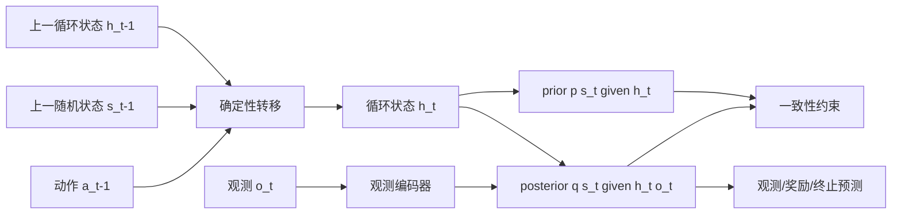

# 第6章 World Models 与循环状态空间模型

> 状态：`reviewed`
> 资料核查日期：2026-08-31
> 关联实验：`EXP-06-01`
> 关联声明：`CLAIM-06-01`～`CLAIM-06-04`
> 关联图表：`FIG-06-01` / `TAB-06-01`
> 资源档位：S / M / L1
> 当前验证：标准库 CPU smoke；完整训练与 GPU 资源待验证

## 本章契约

### 核心问题

当环境只能通过图像等不完整观测被看到时，模型应该记住什么，才能预测动作之后会发生什么？

### 先修知识

- 已具备：基本的编码器、循环网络和概率分布直觉；
- 本章补齐：部分可观测性、状态空间模型、prior/posterior 与 imagined rollout；
- 不要求：强化学习推导、控制理论或完整变分推断课程。

### 非目标

- 不在本章完整复现 PlaNet、DreamerV3 或论文规模分数；
- 不把“能重建画面”当成“状态足以支持决策”；
- 不在当前无 GPU 设备上推断 24GB 单卡训练成本。

### 学完后的可验证产出

读者应能：

1. 解释为什么单帧编码不足以表示部分可观测环境；
2. 区分确定性循环状态、随机潜变量、prior 和 posterior；
3. 画出训练时观测更新与想象 rollout 的两条数据流；
4. 用多步误差说明 one-step 准确不保证长时预测可靠；
5. 指出 CPU smoke、最小训练和论文复现之间的证据差异。

## 6.1 从“识别一帧”到“维护一个信念”

在图像分类里，一张图通常被当作完整输入。模型回答“这是什么”，但不必记住画面之外发生过什么。闭环控制不同：一帧图像可能看不到速度、遮挡后的物体、刚刚发生的接触，甚至无法判断摄像头与物体谁在运动。

考虑两张完全相同的桌面图像。第一种情况下，球静止在桌上；第二种情况下，球正高速向桌边滚动。当前像素可以相同，正确动作却不同。模型需要把历史观测和动作压缩成一个**信念状态**，而不是把当前帧直接当作环境状态。

早期 [World Models](https://arxiv.org/abs/1803.10122) 展示了“视觉编码器 + 循环动力学 + 控制器”的清晰分工：先压缩空间信息，再学习时间演化，最后让策略使用模型表示。它证明了在学习模型内部训练策略再迁回环境这一思路的可行性，但这种分解并没有自动解决长时误差和部分可观测性。

## 6.2 状态空间模型在解决什么

状态空间模型假设：观测背后存在一个更紧凑的潜在状态。模型一方面根据上一状态和动作预测下一状态，另一方面用新观测修正自己的信念。

可以把它写成两步：

\[
\text{prior:}\quad p_\theta(z_t \mid z_{t-1}, a_{t-1})
\]

\[
\text{posterior:}\quad q_\phi(z_t \mid z_{t-1}, a_{t-1}, o_t)
\]

prior 回答“如果只知道过去和动作，我预期现在是什么状态”；posterior 回答“看到新观测以后，我应该怎样修正这个预期”。训练阶段通常两者都存在；真正向未来想象时没有未来观测，只能连续使用 prior。

`CLAIM-06-01`（fact）：RSSM 的 prior 只使用历史状态和动作推进信念，posterior 在此基础上额外使用当前观测进行修正；两者承担的证据角色不同。

这一区别非常重要：模型可能在每一步都依靠新观测纠错，因此 one-step 指标很好；一旦拿走观测做十步 rollout，误差就开始复合。后续章节讨论模型规划和 Dreamer 时，会反复回到这条边界。

## 6.3 RSSM：为什么同时保留确定性和随机状态

[PlaNet](https://arxiv.org/abs/1811.04551) 使用同时包含确定性与随机转移成分的潜在动力学模型，并在潜在空间执行在线规划。RSSM（Recurrent State-Space Model）通常把内部状态拆成：

- `h_t`：确定性循环状态，负责累积可预测的历史和长时记忆；
- `s_t`：随机潜变量，表达当前状态的不确定性和多种可能未来。

一个简化的数据流是：



*FIG-06-01：教学版 RSSM 的 prior/posterior 数据流。训练阶段可以使用观测形成 posterior，未来想象阶段只能沿 prior 推进。来源：本书原创，MIT，2026-08-31。*

确定性状态并不意味着环境确定；随机状态也不等于简单地给网络加噪声。二者分工的动机是：循环路径保留跨时间的信息，随机变量表示单一历史下仍无法消除的不确定性。

## 6.4 训练时的三项基本压力

一个教学版 RSSM 至少同时承受三类压力：

1. **重建或表征压力**：潜在状态要保留观测中与任务相关的信息；
2. **动力学压力**：只根据过去状态和动作得到的 prior，应接近看到当前观测后的 posterior；
3. **任务压力**：潜在状态要能预测奖励、终止或价值，而不只是像素。

常见目标可以概括为：

\[
\mathcal{L} = \mathcal{L}_{obs} + \mathcal{L}_{reward} + \mathcal{L}_{continue}
+ \beta D_{KL}\left(q_\phi(s_t \mid h_t,o_t)\;\|\;p_\theta(s_t \mid h_t)\right)
\]

这个式子不是说所有实现都必须重建像素。`L_obs` 也可以是特征预测或其他表征目标。真正要问的是：状态丢掉的信息是否会改变后续动作选择？如果模型生成的杯子纹理不够逼真但仍能正确预测可抓取区域，它可能对控制足够有用；反过来，画面很漂亮却漏掉速度或接触状态，规划就会失败。

## 6.5 训练数据流与想象数据流

训练时，posterior 可以持续看到真实观测：

```text
历史状态 + 动作 → prior → 结合新观测得到 posterior → 预测并计算损失
```

想象 rollout 时，未来观测不存在：

```text
当前 posterior → 动作 → prior → 动作 → prior → ...
```

因此，训练时表现最好的分支和部署时真正使用的分支并不完全相同。需要至少分别报告：

- posterior filtering 的 one-step 误差；
- 关闭未来观测后的 multi-step prior 误差；
- 奖励、终止和任务相关状态的误差；
- 用模型选择动作后得到的真实闭环回报。

只报告第一项，会掩盖模型在规划时真正暴露的问题。

`CLAIM-06-02`（recommendation）：用于规划或 imagined learning 的状态空间模型，至少应分别报告观测修正后的 filtering 误差和关闭未来观测后的 multi-step prior 误差。

## 6.6 从 PlaNet 到 Dreamer：同一个模型，不同的使用方式

PlaNet 学习潜在动力学后，用规划器在线搜索动作序列。随后 [Dreamer](https://arxiv.org/abs/1912.01603) 在学习到的潜在模型内展开 imagined trajectories，并通过这些轨迹学习行为。两者共享的核心不是某个特定网络层，而是“学习任务相关状态—在模型中预测动作后果—用预测改善决策”的闭环。

DreamerV2 进一步采用离散潜变量处理 Atari 等任务；DreamerV3 后来形成跨多类控制任务的统一配置，并于 2025 年发表于 *Nature*。这些进展属于第8章的重点。本章只建立它们共同依赖的状态与数据流，不把最新实现细节塞进 RSSM 的基本定义。

## 6.7 EXP-06-01：RSSM 数据流 CPU smoke

当前配套实验不是神经网络训练。它使用一个带位置、速度和观测噪声的一维程序化系统，以及一个教学版“预测—观测修正”状态更新器，验证三件事：

1. 动作参与 prior 更新；
2. posterior 使用新观测修正状态；
3. 拿走未来观测后，多步 prior 误差通常比持续观测修正更快累积。

本地命令：

```bash
make ch06-smoke-local
make ch06-test-local
```

Docker 优先命令：

```bash
make ch06-smoke
```

该 smoke 只依赖 Python 标准库，不下载数据或模型。输出包含 filtering、open-loop 和 persistence 三类 RMSE。它验证的是接口和评测协议，不证明 RSSM 已经学会环境，也不能升级为 PlaNet/Dreamer 复现结果。

本轮基线使用 seed 7 的 32 步程序化轨迹，宿主 Python 与 CPU Docker 输出一致：

`TAB-06-01`：`EXP-06-01` 固定程序化 fixture 的三类 RMSE；这些指标只用于验证数据流与评测接口。

| 指标 | RMSE | 解释 |
| --- | ---: | --- |
| filtering | 0.06084 | 每步使用观测修正后的状态误差 |
| open-loop | 0.33317 | 初始化后只使用 prior 的多步误差 |
| persistence | 0.70437 | 用上一观测预测下一状态的朴素基线 |

原始结果记录在 `results/ch06/EXP-06-01-smoke.json`。这些数字只属于 `EXP-06-01` 的固定教学 fixture，不与论文分数比较，也不用于声称学习方法优于其他模型。

`CLAIM-06-03`（result）：在 `EXP-06-01` 的固定 32 步 fixture 上，open-loop RMSE 为 0.33317，高于持续观测修正的 filtering RMSE 0.06084。该结果不外推到神经 RSSM、PlaNet 或 Dreamer。

## 6.8 一个必须保留的反例

假设模型每一步都能看到真实观测，并把 90% 的新观测直接写入状态。它的 one-step 误差可能很低，但这主要证明观测修正有效。一旦规划器要求模型独立预测未来二十步，误差仍会迅速增长。

因此，“posterior 重建得好”不能推出“prior 可以支撑规划”。本章的最小实验刻意同时输出 filtering 与 open-loop 指标，就是为了阻止这种证据偷换。

## 6.9 失效模式

- **posterior collapse**：随机状态不携带有效信息，解码器主要依赖确定性路径；
- **复合误差**：训练分布主要来自真实历史，想象轨迹逐步偏离该分布；
- **遗漏任务变量**：像素损失鼓励保存纹理，却忽略速度、接触或遮挡状态；
- **错误不确定性**：单一平均未来掩盖多种可能结果；
- **模型利用**：后续策略发现并利用模型不真实的高回报区域；
- **指标错位**：视觉预测更好，但规划回报更差。

这些问题不能只靠调低训练损失解决。第7章会让规划器直接使用模型，从而观察模型误差怎样改变动作；第9章再建立系统评测协议。

## 6.10 自动驾驶：相同画面，不同闭合速度

跟车场景可以直接说明单帧观测为何不是完整状态。两张图像中，前车的像素框可能大小相近：第一种情况两车同速，第二种情况自车正在快速接近前车。若只看当前框，模型可能给出相同表示；制动决策却应不同。

驾驶信念状态至少可能需要融合：历史图像、ego speed、yaw rate、方向盘/油门/制动、前车相对速度、遮挡对象的轨迹，以及地图和信号灯状态。动作也必须进入转移：制动会改变下一时刻的 ego motion 和未来观测，不能只把动作当作展示标签。

`CLAIM-06-04`（inference）：在自动驾驶中，单帧 RGB 无法唯一确定闭合速度、遮挡对象轨迹和车辆动态；将历史观测与车辆动作纳入信念状态，是预测制动和变道后果的必要建模步骤，但仍需第9章的闭环协议验证是否足够。

本章不要求安装驾驶仿真器。第19章才用 MetaDrive 做 S/M 档闭环决策实验，并将 CARLA 保留为 L2 高保真选做项。

## 6.11 结果、资源、数据与许可

| 类型 | 声明/结果 | 来源或实验 ID | 状态 | 限制 |
| --- | --- | --- | --- | --- |
| 外部方法 | RSSM 区分历史转移与观测修正 | PlaNet/Dreamer 系列论文 | `[P/A]` | 具体实现和目标函数不同 |
| 本书结果 | open-loop 误差高于 filtering 误差 | `EXP-06-01` | CPU smoke | 手工状态更新器，不是神经训练 |
| 未验证 | mini-RSSM 在目标任务上的收敛与资源 | 无 | pending | 当前无 GPU，尚未实现训练 |

S 档 smoke 使用 MIT 许可的程序化一维 fixture、Python 标准库和 CPU，下载量为 0。M 档未来实现小型 PyTorch RSSM，默认上限为 24 GB 单卡；L1 只用于经过资源审计的官方 debug 配置。当前不购置硬件，也不从 smoke 推断 GPU 显存、训练时间或收敛。

## 6.12 小结

RSSM 的关键不是“在 RNN 后面再加一个随机变量”，而是明确区分两种信息来源：历史和动作提供 prior，新观测提供 posterior 修正。训练时持续看到观测，想象时只能依赖 prior；这条分布差异决定了为什么 one-step 预测不能替代 multi-step 与闭环评测。

## 练习

1. **概念判断**：一个只接收过去图像、不接收动作的视频预测器是否满足本书的世界模型工作定义？给出条件化回答。
2. **代码实验**：调整 `observation_gain`，观察 filtering RMSE 和 open-loop RMSE 是否同步变化，并解释原因。
3. **反例设计**：构造一种画面预测误差下降但控制所需状态变差的情况。
4. **迁移分析**：在自动驾驶中，哪些变量可能无法从单帧 RGB 唯一确定？它们分别会影响哪类动作？

## 延伸阅读

- Ha & Schmidhuber, [World Models](https://arxiv.org/abs/1803.10122)，`[A]`；
- Hafner et al., [Learning Latent Dynamics for Planning from Pixels](https://arxiv.org/abs/1811.04551)，PlaNet，`[A]`；
- Hafner et al., [Dream to Control](https://arxiv.org/abs/1912.01603)，`[A]`；
- Hafner et al., [Mastering Atari with Discrete World Models](https://arxiv.org/abs/2010.02193)，`[P]`；
- Hafner et al., [Mastering Diverse Control Tasks through World Models](https://www.nature.com/articles/s41586-025-08744-2)，DreamerV3，`[P]`；
- [DreamerV3 公开仓库](https://github.com/danijar/dreamerv3)，资产状态需在具体实验卡中记录。

## 下一章接口

第7章将固定一个已学习或程序化的动力学模型，用 CEM 等方法选择动作。届时，本章的 prior 不再只是预测工具，而会直接影响策略；任何被规划器利用的模型误差都会变成闭环失败。

## 验收与审查记录

```text
本地检查：make check-local
严格检查：make check
章节 smoke：make ch06-smoke
文档构建：make docs-build
```

- 内容审查：通过；
- 代码审查：通过；
- 一致性审查：通过；
- 教学审查：通过；
- 审查记录路径：`reviews/batch-a-review.md`；
- 已知限制与下一步：PyTorch mini-RSSM、24 GB 单卡资源和完整训练仍待后续阶段验证。
