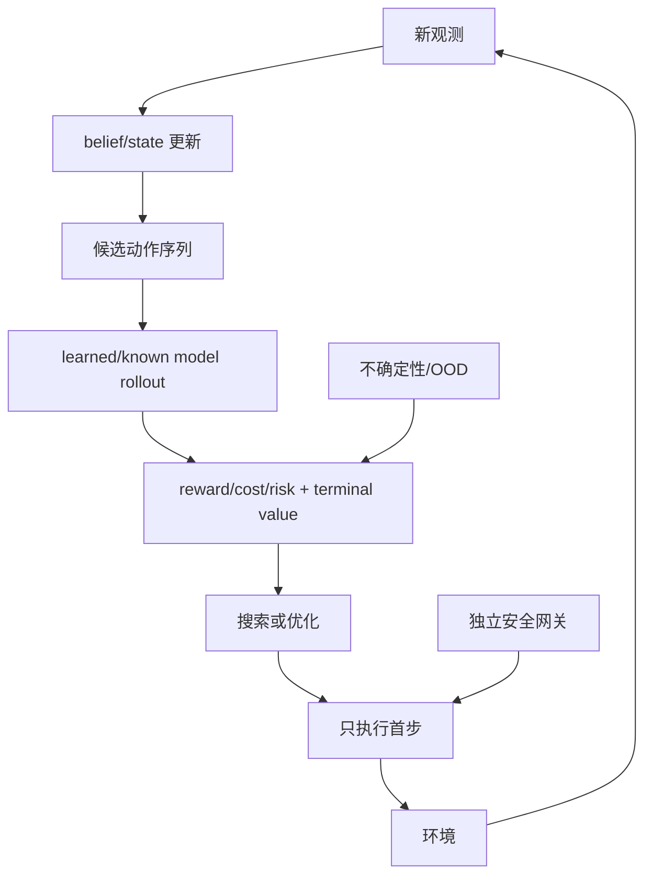

# 第7章 用模型做规划：从 PlaNet 到价值等价模型

## 本章契约

### 核心问题

已能预测未来之后，怎样比较候选动作并只执行当前最合适的一步？规划 horizon、候选预算、terminal value、模型误差和不确定性如何共同决定结果？模型为什么可以不重建所有像素，却仍可能对特定规划问题有用？

### 先修知识

- 已具备：第3章 MDP/POMDP 与反馈，第4章实验协议，第6章 latent state、prior 和 rollout；
- 本章补齐：有限时域优化、模型预测控制（Model Predictive Control, MPC）、交叉熵方法（Cross-Entropy Method, CEM）、tree search、terminal value、价值等价和规划失败诊断；
- 不要求：控制理论推导、RL 优化、MCTS/CEM 实现经验、3D 视觉、GPU 或真实硬件。

### 非目标

- 不把 实验 7-1<!-- INTERNAL_ASSET_ID: EXP-07-01 --> 称为 CEM、MCTS、PlaNet、MuZero 或 TD-MPC2 复现；
- 不声称一个 Bellman backup 相同就普遍价值等价；
- 不用模型预测回报代替真实/独立环境回查；
- 不让 learned planner 绕过第21章执行网关。

### 学完后的可验证产出

读者应能写出有限时域目标，区分收益、软代价与硬约束，解释 horizon 与 terminal value 的取舍，区分 open-loop sequence 与 receding-horizon feedback，比较 shooting 与 tree search 的查询方式，并判断一个模型是否在给定规划问题上保留了足够的决策信息。

## 7.1 规划器需要的最小模型

给定当前决策信息状态 $s_t$，规划器选择长度 `H` 的动作序列：

\[
\max_{a_{t:t+H-1}}
\mathbb E_{\hat p}\left[
\sum_{k=0}^{H-1}\gamma^k\hat r_{t+k}
+\gamma^H\hat V(s_{t+H})
\right].
\]

本章的 $s_t$ 是规划问题中的局部记号，可以是真实状态、估计状态或 belief。它不特指第6章 RSSM 中与确定性记忆 $h_t$ 配对的随机潜变量；实际系统必须写明规划器究竟读取哪一种状态及其不确定性。

模型至少提供动作条件转移、reward/cost 和终止；terminal value 可近似 horizon 之外的收益。若只生成视频却没有可靠 reward、风险或状态读出，规划目标仍不完整。

<!-- CLAIM_META: CLAIM-07-01 fact -->
规划结果由模型、目标、horizon、terminal value、候选生成/搜索预算和执行方式共同决定；“使用世界模型”不是足够的算法说明。



*图 7-1：receding-horizon 规划闭环。来源：本书原创，CC BY-NC 4.0，2026-08-31。首步执行仍须经过独立安全网关。*<!-- INTERNAL_ASSET_ID: FIG-07-01 -->

### 7.1.1 规划不是“让模型自由生成未来”

一个完整的模型规划问题至少包含七个彼此独立的对象：

| 对象 | 回答的问题 |
|---|---|
| 当前信息状态 | 规划从哪个 belief/state 开始？ |
| 动作参数化 | 搜索单步控制量、动作块，还是整条轨迹？ |
| 动力学模型 | 给定动作后，哪些未来是可能的？ |
| 收益与软代价 | 在可接受方案之间偏好什么？ |
| 硬约束 | 哪些方案无论回报多高都不可执行？ |
| 搜索器 | 在有限计算内查询哪些候选？ |
| 执行协议 | 执行多少步、何时重规划、失败时如何降级？ |

世界模型只覆盖其中一部分。它可以预测未来，却不会自动给出“应当追求什么”，也不会自动把物理不可达、法规禁止或安全不可接受的未来排除。尤其不能把所有要求都压成一个加权和：舒适性通常可以作为软代价权衡，碰撞和越界则往往需要先定义可行集。若一个巨大的路线进度奖励能够抵消碰撞惩罚，问题出在目标合同，而不只是模型精度。

规划器真正需要的也不一定是视觉上完整的未来，而是足以比较候选动作的后果。反过来，能够生成逼真视频的模型若不能稳定读出 reward、termination、约束和风险，仍不是完整的决策模型。

## 7.2 MPC：计划一段，只走一步

Open-loop planning 一次生成完整序列并全部执行；MPC/receding horizon 每次观察后重规划，通常只执行首步。MIT *Underactuated Robotics* 给出的 MPC 基本循环也是“测量当前状态—从当前状态优化—执行首个动作—演化一步后重复” `[O,R1]`。后者能纠正扰动和状态估计更新，但会增加在线计算，也不能修复第一步就错误的模型。

Horizon 太短会错过延迟收益；太长则扩大候选空间、模型复合误差和耗时。terminal value 可把 horizon 外收益压缩进末端，但 value 本身可能偏置或 OOD。

```mermaid
flowchart TB
    accTitle: FIG-07-02 图 7-2 滚动时域中的计划、执行与重规划
    accDescr: 时刻 t 根据新观测规划 H 步，只执行首步或短前缀；环境返回新观测后，未执行的旧后缀被废弃或仅作热启动，并从新状态重新规划 H 步。
    O0["时刻 $$t$$ 的新观测与 belief"] --> P0["规划 $$H$$ 步: $$a_t$$ 到 $$a_{t+H-1}$$"]
    P0 --> X0["执行前缀: 通常只执行 $$a_t$$"]
    P0 -.未执行旧后缀.-> S0["$$a_{t+1}$$ 到 $$a_{t+H-1}$$"]
    X0 --> E0[环境推进与扰动]
    E0 --> O1["时刻 $$t+1$$ 的新观测与 belief"]
    O1 --> P1[从新状态重新规划 H 步]
    S0 -.废弃或仅作 warm start.-> P1
```

*图 7-2：MPC 的滚动时域时间关系。`H` 是 prediction/planning horizon，实际连续执行的步数是 execution horizon；旧后缀不能绕过新观测自动取得执行权。来源：本书原创，CC BY-NC 4.0，2026-09-02。*<!-- INTERNAL_ASSET_ID: FIG-07-02 -->

图中的两种长度回答不同问题：planning horizon 决定一次比较多远的候选后果，execution horizon 决定两次反馈之间连续承诺多少动作。后者大于 1 时，即使每轮都重新规划，系统仍存在多步开环窗口；旧后缀最多作为下一轮优化的 warm start，必须重新经过状态更新、约束和安全网关。

对离散小空间可穷举；连续高维动作常用 shooting、random shooting、CEM 或梯度优化。候选数、迭代数、elite 比例、warm start、动作平滑和墙钟 deadline 都属于结果的一部分。

### 7.2.1 Horizon 是计算边界，也是认知边界

有限时域目标把未来切成两部分：前 $H$ 步由模型显式展开，$H$ 之后由 terminal value 概括。因此，增大 horizon 并不只是“看得更远”，它同时减少了对 terminal value 的依赖、增加了对多步模型的依赖，并扩大了优化难度。三者之间没有脱离任务的最佳取值。

terminal value 应描述截断边界之外尚未计入的前景。若它重新包含了 rollout 内已经累计的收益，就会发生重复计数；若它的训练分布不覆盖规划器到达的末端状态，则短 horizon 可能把误差集中到一个看似精确的标量上。为此需要分别说明 reward 的折扣位置、提前终止后的处理方式，以及末端状态是否真的属于 value 的有效支持域。

MPC 的“闭环”来自反复观测和重规划，并不意味着一次求出的动作序列本身是反馈策略。在两次重规划之间，系统仍按旧计划执行；感知延迟、求解超时或一次执行多个动作都会扩大这段开环窗口。重规划也不自动保证递归可行：当前可行的首步可能把下一时刻带入没有安全后继动作的状态，所以安全关键系统还需要终端可行集、备用控制器或最小风险策略等独立机制。

## 7.3 CEM 的接口，而不是神秘按钮

Cross-Entropy Method 可维护动作序列分布，循环执行：采样候选、模型 rollout、按目标选 elite、更新分布，最后返回最好序列或分布均值。它不等于训练 loss 中的 cross-entropy。

伪代码合同为：

```text
distribution ← initial/warm-start distribution
repeat planning_iterations:
    candidates ← sample(distribution, population)
    scores ← model_rollout(candidates) + terminal_value - risk
    elite ← top_k(valid candidates)
    distribution ← fit(elite)
execute(first_action(best_candidate))
```

若所有候选越界、模型不确定性高或计算超时，规划器必须返回结构化拒绝，而不是输出未初始化均值。CEM 是近似优化器；同一模型下换 seed/预算可能换结果。

[PlaNet](https://proceedings.mlr.press/v97/hafner19a.html)在 stochastic latent dynamics 中用在线规划选择动作，官方[开源实现](https://github.com/google-research/planet)提供 CEM 路径 `[P/O,R1]`。本书只复用其“belief—latent rollout—online planning”模式，没有运行旧版 TensorFlow 工程或论文任务。

CEM 维护的是**本次规划问题中动作序列的搜索分布**，不是环境随机性的概率模型，也不是跨所有状态都可复用的策略。分布变窄只说明当前采样与 elite 更新趋于集中，不能解释为系统对未来更有把握。若模型本身存在多未来，每个动作候选仍需在模型不确定性下单独评估。

约束处理方式也会改变算法含义。先拒绝不可行候选是在可行集内优化；给违规项加罚分则允许不同程度的交换；采样后裁剪动作还可能把大量不同候选投影到同一个边界点。三者不能只用同一个“使用 CEM”标签概括。elite 过少会过早塌缩，elite 过多又会削弱更新方向，因此优化预算应连同约束语义一起报告。

## 7.4 Tree search 与 MuZero：预测决策量

Tree search 显式展开动作分支，并用 policy prior、reward、value 和访问次数分配搜索。MuZero 学 representation、dynamics 和 prediction 网络，围绕 reward、policy 和 value 支持搜索，而不要求还原环境观测的全部细节。[MuZero 官方介绍](https://deepmind.google/blog/muzero-mastering-go-chess-shogi-and-atari-without-rules/)与论文是 `[V/P,R1]` 上游证据；“不知道规则”不表示没有动作、reward 或交互数据。

连续控制通常难以直接枚举巨大动作树。TD-MPC/TD-MPC2 把 task-oriented latent dynamics、value 与局部 trajectory optimization 结合；[TD-MPC2 官方仓库](https://github.com/nicklashansen/tdmpc2)是实现锚点 `[O,R1]`，本书没有运行其 benchmark 或大模型。

Tree search 与 shooting 不是“离散算法”和“连续算法”的简单同义词，而是组织模型查询的两种方式。shooting 先提出完整动作序列，再对整条序列评分；tree search 共享公共前缀，并可依据中间 value、policy prior 或访问统计逐步分配计算。前者易于并行，后者能把预算集中到有希望的分支，但都受到分支宽度、深度和模型误差的限制。

MuZero 一类方法进一步说明：模型可以围绕规划所查询的 reward、policy 和 value 学习，而不必把每个像素作为预测目标。不过，搜索器会访问训练策略未必常到达的反事实分支。一个只在行为数据附近准确的模型，可能在被更强搜索器反复查询后反而暴露更大误差。这也是为什么“增加搜索计算”可能同时改善优化、加剧模型利用。

## 7.5 价值等价：必须带作用域

两个模型若对给定 policy/value-function 集产生相同 Bellman update，可在该集合上称为 value equivalent。它允许忽略背景纹理等与指定决策无关的信息，但等价集合扩大后约束会变强。

[Value Equivalence Principle](https://arxiv.org/abs/2011.03506)强调模型资源应服务 value-based planning `[A,R1]`。这不是“像素错也无所谓”的许可证：reward、termination、风险、可达性或新 policy 改变时，先前等价可能立即失效。

价值等价至少要写明三个作用域：任务使用的 reward/constraint 集、允许的 policy 或 value-function 集，以及规划器实际会查询的状态—动作区域。只在当前策略轨迹上给出相同 backup 的两个模型，面对新策略主动探索的动作时可能完全不同；只对平均回报等价的模型，也可能对碰撞概率或尾部风险不等价。

这揭示了“任务相关压缩”的精确含义：模型可以丢弃对指定决策族无影响的信息，但不能预先假定什么信息永远无关。改变任务、约束、控制频率或动作空间，都可能重新定义需要保留的状态。价值等价是一种带量词的关系，不是模型脱离使用场景后的永久属性。

## 7.6 短视、terminal value 与重规划（实验 7-1<!-- INTERNAL_ASSET_ID: EXP-07-01 -->）

手工 MDP 有状态 `0→1→2`。`advance` 前进并付出 `-0.1`，`harvest` 终止；只有状态 2 harvest 才得 `1.0`。

<details markdown="1">
<summary>可选：验证本章证据</summary>

```bash
make ch07-test-local
make ch07-smoke-local
make ch07-smoke
```

</details>

| 设置 | 首个动作/序列 | 固定 return |
| --- | --- | ---: |
| H=1，无 terminal value | harvest | 0.0 |
| H=3，穷举 8 个序列 | advance, advance, harvest | 0.8 |
| H=1，精确 terminal value | advance | 0.8 predicted |

*表 7-1：实验 7-1 的 horizon 结果。回报无量纲，规则和 value 均为手工设定。*<!-- INTERNAL_ASSET_ID: TAB-07-01 -->

<!-- CLAIM_META: CLAIM-07-02 result -->
H=1 选择立即 harvest 得 0；H=3 找到延迟收益序列得 0.8。它证明这个 fixture 对 horizon 敏感，不表示更长永远更好。

<!-- CLAIM_META: CLAIM-07-03 result -->
加入手工精确 terminal value 后，H=1 首步变为 advance，预测 return 为 0.8；这验证 bootstrap 接口，不证明 learned value 无偏。

原 fixture 还曾把“执行两步旧 suffix 得 -0.2”与“重新规划三步并完成 harvest 得 0.7”并列。这个比较同时改变了反馈方式与扰动后的动作预算，**不能**把 0.9 的差归因于重规划。实验 7-1 v4<!-- INTERNAL_ASSET_ID: EXP-07-01 v4 --> 保留该结果作为 protocol negative control，并增加两个固定为 2 个动作槽的受控比较：

| 协议与策略 | 扰动后动作预算 | 实际执行 | 环境 reward sum | terminal value | 规划目标 |
| --- | ---: | --- | ---: | ---: | ---: |
| 旧协议：执行 stale suffix | 2 | advance, harvest | -0.2 | 0.0 | -0.2 |
| 旧协议：重新规划 | 3 | advance, advance, harvest | 0.7 | 0.0 | 0.7 |
| 固定预算、reward-only：stale suffix | 2 | advance, harvest | -0.2 | 0.0 | -0.2 |
| 固定预算、reward-only：重新规划 | 2 | harvest | -0.1 | 0.0 | -0.1 |
| 固定预算、冻结 terminal value：stale suffix | 2 | advance, harvest | -0.2 | 0.0 | -0.2 |
| 固定预算、冻结 terminal value：重新规划 | 2 | advance, advance | -0.3 | 1.0 | 0.7 |

*表 7-2：扰动重规划的 protocol audit。环境 reward 包含扰动前已经执行的 `advance=-0.1`；冻结 terminal value 只在预算耗尽且未终止时加入目标。旧协议两行预算不同，只是不可归因的负对照。*<!-- INTERNAL_ASSET_ID: TAB-07-02 -->

<!-- CLAIM_META: CLAIM-07-04 result -->
固定两个扰动后动作槽且只累计观测到的环境 reward 时，stale suffix 得 -0.2，重新规划得 -0.1；该受控 fixture 只证明反馈可改变动作并在此目标下提高 0.1，不证明到达目标、普遍优于 open loop 或抵消模型误差。

<!-- CLAIM_META: CLAIM-07-08 result -->
同样固定两个动作槽并冻结手工 terminal value 时，重规划的环境 reward 为 -0.3、terminal-value contribution 为 1.0、规划目标为 0.7；因此 `0.7` 是带 bootstrap 的 objective，不是已经观测到的环境回报。

## 7.7 受限价值等价反例

fixture 另给同一三个状态两套完全不同的观测标签，因此观测字符串匹配率为 0；两者共享同一手工转移/reward/value，在这个单一 value function 上最大 Bellman backup gap 为 0。

| 指标 | 固定结果 | 作用域 |
| --- | ---: | --- |
| observation label match | 0% | 三个字符串 |
| max Bellman backup gap | 0 | 一个 transition/reward 与一个 value function |

*表 7-3：受限 value-equivalence fixture。不是视觉压缩或表示学习结果。*<!-- INTERNAL_ASSET_ID: TAB-07-03 -->

这不能证明 surrogate 对新 reward、风险函数、policy、state aliasing 或 OOD 动作等价。

## 7.8 随机 rollout：平均最优不等于尾部可接受

随机模型不能只回答“一条预测轨迹是什么”，还要声明**对什么随机量采样、怎样跨时间保持样本身份、用什么风险函数聚合**。最常见的三类不确定来源是：当前 belief 的状态不确定性、环境本身的 aleatoric 随机性，以及模型/参数的 epistemic 不确定性。把三者混成一个未命名的 Gaussian 噪声，规划器便无法知道它是在处理可观测噪声、真实多未来，还是数据覆盖不足。

[PETS](https://papers.nips.cc/paper_files/paper/2018/file/3de568f8597b94bda53149c7d7f5958c-Paper.pdf)用 probabilistic ensemble 与 trajectory sampling 展示了粒子化传播接口 `[P,R1]`：每个候选动作序列需要多个未来样本，不能先把下一状态压成均值再递推。实现时还要审查 ensemble 身份：若成员代表一套可能的固定动力学参数，通常应让同一粒子在整条轨迹中保持该假设；每步任意切换成员会构造现实中未必存在的混合动力学。若成员只是对每步 predictive mixture 的数值近似，则重采样可以有不同语义。两种做法没有脱离建模假设的通用胜者，实验卡必须写清。

期望回报只关心平均数：

\[
J_{\mathrm{mean}}(a)=\frac{1}{N}\sum_{i=1}^{N}R^{(i)}(a).
\]

安全或高代价任务还可能关心失败概率、最坏场景、return 的经验下尾均值，或 cost 的 CVaR。这里先冻结本书的方向和参数约定：对 return 取最低的 $\alpha$ 概率质量并最大化其均值；若改写成 cost，则通常考察上尾并最小化，必须重新声明符号与置信水平，不能只沿用“CVaR”名称。

对 `N` 个等权 return 从低到高排序为 $x_{(1)}\le\cdots\le x_{(N)}$，令 $t=\alpha N$、$k=\lfloor t\rfloor$、$\delta=t-k$。本书的经验下尾均值取**恰好 $\alpha$ 的经验概率质量**：

\[
\widehat L_\alpha=
\frac{\sum_{i=1}^{k}x_{(i)}+\delta x_{(k+1)}}{t},
\]

其中 $\delta=0$ 时不取边界项；$\alpha=1$ 时就是全样本均值。边界样本的分数权重不是“半个真实场景”，而是离散经验分布在分位点上的概率质量分配。[Rockafellar 与 Uryasev](https://www.sciencedirect.com/science/article/pii/S0378426602002716)对一般（包括离散）损失分布给出 CVaR 定义与优化表述 `[P,R1]`；这也说明简单条件均值 $E[X\mid X\le\mathrm{VaR}]$ 在分位点有原子质量时可能纳入过多概率。文献也直接把 CVaR 优化用于随机动力系统与机器人 MPC，例如 Wang et al. 的[风险敏感随机搜索 MPC](https://proceedings.mlr.press/v144/wang21b.html) `[P,R1]`。

常见近似“取最差 $\lceil\alpha N\rceil$ 个样本再平均”在 $\alpha N$ 为整数时与上式一致；否则它实际使用 $\lceil\alpha N\rceil/N$ 的更大尾部，而且方向和偏差取决于边界样本。它可作为明确命名的粗略对照，不能悄悄冒充指定 $\alpha$ 的正式指标。即使按概率质量正确离散化，风险度量也不是安全证明：[Troop et al.](https://proceedings.mlr.press/v161/troop21a.html)讨论了有限样本 CVaR 估计 `[P,R1]`；有限粒子仍会漏掉稀有事件，模型共同偏差会让所有粒子一起乐观，事后挑 $\alpha$ 或阈值还会产生评测泄漏。

实验 7-1<!-- INTERNAL_ASSET_ID: EXP-07-01 --> 增加两个固定动作、每个五个等权 return 的解析反例：

| 动作 | 五场景 return | 均值 | 最差 20% 均值 | $P(\text{return}<0)$ | 在 $P(\text{failure})\le0.1$ 下 |
| --- | --- | ---: | ---: | ---: | --- |
| steady | 0.6, 0.6, 0.6, 0.6, 0.6 | 0.6 | 0.6 | 0.0 | 可行 |
| risky | 1.5, 1.5, 1.5, 1.5, -2.0 | 0.8 | -2.0 | 0.2 | 不可行 |

*表 7-4：固定五场景风险目标反例。来源：本书原创，CC BY-NC 4.0，2026-09-01。场景概率是手工设定，不代表真实机器人或驾驶事件频率。*<!-- INTERNAL_ASSET_ID: TAB-07-04 -->

<!-- CLAIM_META: CLAIM-07-07 result -->
在五个等权手工场景中，期望回报选择 risky（0.8 > 0.6），经验最差 20% 均值和失败概率上限 0.1 都选择 steady；该固定排序反例只证明聚合目标会改变动作选择，不估计真实尾部概率、不证明 CVaR 校准或系统安全。

同一 risky 样本再固定 $\alpha=0.3$，尾部质量为 `1.5` 个等权样本。正式指标完整计入 `-2`，再给下一个 `1.5` 分配 `0.5` 权重；粗略 `ceil` 对照则完整平均两个样本：

| 计算规则 | 请求 $\alpha$ | 使用的样本质量 | 实际尾部比例 | 下尾 return 均值 |
| --- | ---: | ---: | ---: | ---: |
| 分位点边界按比例计权 | 0.3 | 1.5 | 0.3 | -0.833333 |
| 最差 $\lceil\alpha N\rceil$ 个样本 | 0.3 | 2 | 0.4 | -0.25 |

*表 7-5：非整数经验尾部质量审计。来源：实验 7-1 v4，本书原创，CC BY-NC 4.0，2026-09-02。两个数都只是同一五点经验分布的描述量。*<!-- INTERNAL_ASSET_ID: TAB-07-05 -->

<!-- CLAIM_META: CLAIM-07-09 result -->
实验 7-1 v4<!-- INTERNAL_ASSET_ID: EXP-07-01 v4 --> 在五个等权固定 return、$\alpha=0.3$ 下得到按边界质量计权的经验下尾均值 `-0.833333`；`ceil` 粗略对照把尾部扩大为 40%，得到 `-0.25`，两者相差 `0.583333`。该解析对照只暴露离散化口径，不估计总体 CVaR、置信区间、真实稀有风险或系统安全。

这个表还揭示三个容易漏报的实验字段：场景/粒子如何生成，风险阈值在什么 split 上冻结，以及“没有采到失败”时分母是多少。驾驶中的碰撞、越界和不可恢复状态通常应作为独立约束或网关事件，不能只乘一个小权重后被路线进度抵消。

## 7.9 模型误差、不确定性与 policy exploitation

规划器主动选择模型最乐观的候选，因此平均 one-step error 很低仍可能错。最低检查包括候选分布上的 transition/reward/termination gap、model-vs-real return、策略排序、OOD、ensemble 分歧和安全事件漏检。

规划失败可以沿调用链分解，而不是全部归到“模型不准”：

| 层次 | 典型问题 | 需要比较的对象 |
|---|---|---|
| 状态估计 | 当前 belief 已遗漏关键历史 | 推断状态与后续可预测、可决策信息 |
| 动力学与事件模型 | 候选后果、终止或约束事件预测错误 | 模型 rollout 与独立环境后果 |
| 目标/value | 后果大致正确但排序标准错误 | 预测分解、真实收益与约束 |
| 搜索 | 好候选存在但预算内没找到 | 已查询最优与模型下可达最优 |
| 执行 | 计划正确但延迟、跟踪或坐标接口错误 | 计划动作与实际施加动作 |

对规划而言，误差的方向常比全局均值更重要。若模型对所有候选都产生相同常数偏移，动作排序可能不变；若它只把一个危险候选略微高估，优化器却可能稳定选择该候选。规划评估因而需要候选间的排序、regret 和约束漏检，而不能只报告随机数据上的平均预测误差。

缓解方式包括短 horizon、replanning、terminal value、action bounds、不确定性惩罚、真实数据回查和独立约束。第17章会完整讨论 model exploitation；本章只建立规划接口。

<!-- CLAIM_META: CLAIM-07-05 recommendation -->
报告 learned-model planning 时必须把“优化器没找到好序列”“模型把坏序列评高”“value 错”“执行/状态估计错”分开，而不是统称规划失败。

**杯子任务。** 候选序列可以分别表示从杯柄接近、从杯身接近、先调整腕姿再闭合夹爪，以及放弃当前抓取后重新观测。模型 rollout 应比较接触可达性、碰撞、滑落和最终放置状态，terminal value 还要覆盖规划时域之外的抬升稳定性。规划器只执行通过安全检查的短前缀；视觉或触觉一旦表明杯子移动、抓取未闭合或候选排序改变，就用新 belief 重规划，而不是盲目执行整段动作。

## 7.10 自动驾驶：候选轨迹不是控制授权

驾驶规划可在 vehicle/map frame 生成转向—加速度序列或轨迹，用模型预测 occupancy、碰撞、路线、舒适和规则代价。每条候选必须携带 horizon、步长、动作范围、模型版本和风险分解。

轨迹与控制量也不能混为一谈。几何路径描述“从哪里经过”，速度曲线描述“何时到达”，方向盘、制动和驱动命令则还受车辆动力学、执行器延迟与轮胎路面条件约束。世界模型若只比较几何轨迹，仍需一个可验证的轨迹跟踪与动力学可行性接口；若直接规划控制量，则必须保证模型中的车辆参数与当前车辆状态匹配。

合理的驾驶规划也常不是一条无条件序列，而是带触发条件的 contingency：例如“先减速观察，若遮挡后区域确认空闲再通过，否则停车”。普通 open-loop shooting 只能比较预先固定的序列，难以表达未来观测到来后的分支决策；高频 MPC 可以近似这种反馈，但其有效性取决于新证据是否在仍可制动或避让之前到达。

短 horizon 可能错过切入或停车距离，长 horizon 会扩大他车行为和地图不确定性。terminal value 可表达路线进度，但不能吞掉碰撞；replanning 能响应新观测，却受第21章 deadline 约束。

<!-- CLAIM_META: CLAIM-07-06 recommendation -->
自动驾驶 learned planner 的候选轨迹必须再经车辆动力学、道路边界、occupancy、碰撞、控制限幅和最小风险层检查；模型预测的高 return 不能直接下发执行器。

## 7.11 资源、许可与证据边界

全书资源档位见[术语表](../glossary.md)。本章的最低反例只验证候选、模型预测、目标和重规划之间的关系；进一步进入 MuJoCo、MetaDrive 或 learned dynamics 时，必须新增候选预算、规划墙钟、model/real return gap 和独立闭环结果。没有这些证据时，只能讨论规划接口，不能声称规划器改善了真实策略。

PlaNet 旧仓库为 Apache-2.0，TD-MPC2 仓库许可和依赖需按锁定 commit 复核；论文、模型、环境、数据和录屏各自遵循许可。

## 小结

模型规划不是模型、目标或搜索器中的任意一个，而是状态估计、动作参数化、动力学、收益与约束、有限预算优化和执行协议组成的闭环。硬约束先定义什么可以做，收益与软代价再区分可行方案中更想做什么。

Horizon 决定显式模型 rollout 与 terminal value 的责任边界：加长它会减少截断，却会增加复合模型误差和搜索难度。MPC 通过新观测反复修正计划，但每个重规划间隔仍是开环的，也不自动提供递归可行或安全保证。

CEM/shooting 与 tree search 以不同方式分配模型查询；搜索更强既可能找到更好的模型内方案，也可能更有效地利用模型漏洞。评价时应分开状态估计、动力学、目标/value、搜索和执行错误，并关注候选排序、真实 regret 与约束漏检，而不只看平均一步预测误差。

价值等价说明模型可以服务决策而不重建所有像素，但等价关系必须绑定 reward/constraint、policy/value 集和查询区域。改变任务、策略或风险口径，就可能改变哪些世界信息不可丢弃。最终，模型预测的高分候选仍只是决策建议，不是执行授权。

## 练习

1. **折扣分析**：给 fixture 增加 discount，找出 H=3 首步变化条件。
2. **搜索实验**：将穷举替换为固定 seed random shooting，画预算—最优值曲线。
3. **失败归因**：注入 reward model 偏差，区分优化失败和模型失败。
4. **驾驶约束**：为车辆急刹与绕行写一个含舒适/碰撞硬约束的候选表。
5. **风险阈值**：把 表 7-4<!-- INTERNAL_ASSET_ID: TAB-07-04 --> 的 risky 失败值从 -2 改为不同数值，分别找出均值、最差 20% 均值和 chance constraint 改变选择的临界点；说明哪类改变属于偏好，哪类属于概率模型。
6. **尾部质量**：保持 risky 的五个 return 不变，分别计算 $\alpha=0.1/0.3/0.5/1.0$ 的按边界质量计权下尾均值与 `ceil` 粗略均值，标出两者何时相等，并解释 $N=5$ 对 1% 风险提问为何几乎没有统计信息。

## 自检要点

规划题必须冻结 horizon、动作预算、discount 作用位置、tie-breaking 和约束语义。以下阈值只对应本章手工环境与五个等权场景。

<details markdown="1">
<summary>自检 7-1：discount 与首步</summary>

若 return 定义为 $r_0+\gamma r_1+\gamma^2 r_2$，H=3 的延迟路径 `advance,advance,harvest` 值为 -$0.1-0.1\gamma+\gamma^2$，立即 `harvest` 为 0。令两者相等得正根 $\gamma^*=(0.1+\sqrt{0.41})/2\approx0.3702$：$\gamma<\gamma^*$ 时首步 harvest，$\gamma>\gamma^*$ 时首步 advance；在当前偏向较早 action 的 tie-break 下，等号也选 advance。若 discount 还作用于 terminal value 或候选提前终止规则不同，阈值必须重算。

</details>

<details markdown="1">
<summary>自检 7-2：random shooting 预算曲线</summary>

固定 RNG seed 和同一候选生成顺序，对预算 $B=1,2,4,8,\ldots$ 取前 B 个样本，记录 $\mathrm{best\_so\_far}(B)=\max_{i\le B}\ \mathrm{score}_i$，则曲线应单调不降；若每个预算重新抽样，单次曲线可能下降，不能解释为更多预算更差。还应跨多个预注册 seed 报中位数/区间、找到穷举最优的比例和计算时延。当前离散 H=3 仅有 8 个候选，适合验证搜索合同，不足以证明 random shooting 在连续控制中有效。

</details>

<details markdown="1">
<summary>自检 7-3：reward 偏差与优化失败</summary>

先保存每个候选的模型预测分数与真实环境回报。若搜索器没有找到模型分数最高的候选，是 optimization failure；若它准确找到模型最优候选，但该候选真实回报差或违反约束，是 reward/model failure（也可能含 dynamics/termination error）。只看最终低回报无法区分两者。一个有效注入实验应冻结候选集，分别比较 `optimizer regret under model` 与 `model-selected real regret`，而不是同时换模型和搜索预算。

</details>

<details markdown="1">
<summary>自检 7-4：急刹、绕行与硬约束</summary>

候选表可含 `min_TTC, collision_prob, lane_boundary, max_decel, max_jerk, progress, model_uncertainty`。例如急刹：TTC 1.5 s、碰撞概率 0.01、最大减速度 7、jerk 8、进度低；绕行：TTC 0.8 s、碰撞概率 0.08、边界余量 0.1 m、减速度 3、jerk 4、进度高。先用冻结的碰撞/TTC/边界硬门筛除绕行，再在可行集内按舒适与进度选急刹；若两者都不可行则进入最小风险 fallback。硬约束不能被高 progress 加权抵消，示例数值也不是道路安全阈值建议。

</details>

<details markdown="1">
<summary>自检 7-5：风险目标的临界点</summary>

令 risky 五个 return 为 `(1.5,1.5,1.5,1.5,x)`。其均值为 `(6+x)/5`，与 steady 的 0.6 在 `x=-3` 打平，故 `x>-3` 时均值偏好 risky。对 $x\le1.5$，最差 20% 均值就是 `x`，在 $x=0.6$ 打平，$x>0.6$ 才偏好 risky。chance constraint 使用 $P(\text{return}<0)\le0.1$：$x<0$ 时失败率 0.2、不可行，$x\ge0$ 时为 0、可行。改变 `x` 是改变 outcome/reward 或失败定义，属于偏好/后果模型；改变五个场景的概率权重才是概率模型变化。可行不等于被选中，还需声明可行集内的排序规则。

</details>

<details markdown="1">
<summary>自检 7-6：非整数尾部质量与小样本边界</summary>

对排序后 `(-2,1.5,1.5,1.5,1.5)`：$\alpha=0.1$ 对应 0.5 个样本质量，正式下尾均值仍为 -2，`ceil` 对照也取一个样本而相等；$\alpha=0.3$ 对应 1.5，正式值为 `(-2+0.5×1.5)/1.5=-0.833333`，`ceil` 值为 `(-2+1.5)/2=-0.25`；$\alpha=0.5$ 对应 2.5，正式值为 `(-2+1.5+0.5×1.5)/2.5=0.1`，`ceil` 值为 `(-2+1.5+1.5)/3=0.333333`；$\alpha=1$ 两者都等于全样本均值 0.8。相等不表示估计充分：五个等权点的原始分辨率是 20%，$\alpha=1\%$ 的计算只反复使用单个最差观测，既没有见到真实 1% 事件的能力，也没有总体外推、相关性或模型偏差保证。要回答总体尾部问题，需预先定义抽样单位、独立性/分层、样本量、估计量和不确定区间。

</details>

## 延伸阅读

- [PlaNet 论文（PMLR）](https://proceedings.mlr.press/v97/hafner19a.html)与[官方代码](https://github.com/google-research/planet)；
- MIT *Underactuated Robotics*：[Model-Predictive Control](https://underactuated.mit.edu/trajopt.html#model_predictive_control)；
- [MuZero 官方介绍](https://deepmind.google/blog/muzero-mastering-go-chess-shogi-and-atari-without-rules/)；
- [The Value Equivalence Principle](https://arxiv.org/abs/2011.03506)；
- [TD-MPC2 官方仓库](https://github.com/nicklashansen/tdmpc2)。
- Chua et al., [PETS：probabilistic ensemble 与 trajectory sampling](https://papers.nips.cc/paper_files/paper/2018/file/3de568f8597b94bda53149c7d7f5958c-Paper.pdf)；
- Wang et al., [Adaptive Risk Sensitive Model Predictive Control with Stochastic Search](https://proceedings.mlr.press/v144/wang21b.html)。
- Rockafellar 与 Uryasev, [Conditional value-at-risk for general loss distributions](https://www.sciencedirect.com/science/article/pii/S0378426602002716)；
- Troop et al., [Data-driven estimation of CVaR with finite samples](https://proceedings.mlr.press/v161/troop21a.html)。

## 下一章接口

第8章将从“在线搜索动作”转到“在 imagined trajectories 中训练 actor-critic”；第17章再审查模型被优化器利用的风险。
