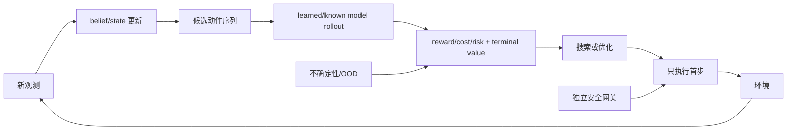

# 第7章 用模型做规划：从 PlaNet 到价值等价模型

> 状态：`reviewed`
> 资料核查日期：2026-09-01
> 关联实验：`EXP-07-01`
> 关联声明：`CLAIM-07-01`～`CLAIM-07-08`
> 关联图表：`FIG-07-01` / `TAB-07-01` / `TAB-07-02` / `TAB-07-03` / `TAB-07-04`
> 资源档位：S / M
> GPU 状态：待验证

## 本章契约

### 核心问题

已能预测未来之后，怎样比较候选动作并只执行当前最合适的一步？规划 horizon、候选预算、terminal value、模型误差和不确定性如何共同决定结果？模型为什么可以不重建所有像素，却仍可能对特定规划问题有用？

### 先修知识

- 已具备：第3章 MDP/POMDP 与反馈，第4章实验协议，第6章 latent state、prior 和 rollout；
- 本章补齐：有限时域优化、模型预测控制（Model Predictive Control, MPC）、交叉熵方法（Cross-Entropy Method, CEM）、tree search、terminal value、价值等价和规划失败诊断；
- 不要求：控制理论推导、RL 优化、MCTS/CEM 实现经验、3D 视觉、GPU 或真实硬件。

### 非目标

- 不把 `EXP-07-01` 称为 CEM、MCTS、PlaNet、MuZero 或 TD-MPC2 复现；
- 不声称一个 Bellman backup 相同就普遍价值等价；
- 不用模型预测回报代替真实/独立环境回查；
- 不让 learned planner 绕过第21章执行网关。

### 学完后的可验证产出

读者应能写出有限时域目标，解释 horizon 与 terminal value 的取舍，区分 open-loop sequence 与 receding-horizon feedback，审计候选优化预算，并为 learned model 建立真实回报 gap 和不确定性门禁。

## 7.1 规划器需要的最小模型

给定当前 belief/state `s_t`，规划器选择长度 `H` 的动作序列：

\[
\max_{a_{t:t+H-1}}
\mathbb E_{\hat p}\left[
\sum_{k=0}^{H-1}\gamma^k\hat r_{t+k}
+\gamma^H\hat V(s_{t+H})
\right].
\]

模型至少提供动作条件转移、reward/cost 和终止；terminal value 可近似 horizon 之外的收益。若只生成视频却没有可靠 reward、风险或状态读出，规划目标仍不完整。

`CLAIM-07-01`（fact）：规划结果由模型、目标、horizon、terminal value、候选生成/搜索预算和执行方式共同决定；“使用世界模型”不是足够的算法说明。



*FIG-07-01：receding-horizon 规划闭环。来源：本书原创，MIT，2026-08-31。首步执行仍须经过独立安全网关。*

## 7.2 MPC：计划一段，只走一步

Open-loop planning 一次生成完整序列并全部执行；MPC/receding horizon 每次观察后重规划，通常只执行首步。MIT *Underactuated Robotics* 给出的 MPC 基本循环也是“测量当前状态—从当前状态优化—执行首个动作—演化一步后重复” `[O,R1]`。后者能纠正扰动和状态估计更新，但会增加在线计算，也不能修复第一步就错误的模型。

Horizon 太短会错过延迟收益；太长则扩大候选空间、模型复合误差和耗时。terminal value 可把 horizon 外收益压缩进末端，但 value 本身可能偏置或 OOD。

对离散小空间可穷举；连续高维动作常用 shooting、random shooting、CEM 或梯度优化。候选数、迭代数、elite 比例、warm start、动作平滑和墙钟 deadline 都属于结果的一部分。

## 7.3 CEM 的接口，而不是神秘按钮

Cross-Entropy Method 可维护动作序列分布，循环执行：采样候选、模型 rollout、按目标选 elite、更新分布，最后返回最好序列或分布均值。它不等于训练 loss 中的 cross-entropy。

伪代码合同为：

```text
distribution ← initial/warm-start distribution
repeat planning_iterations:
    candidates ← sample(distribution, population)
    scores ← model_rollout(candidates) + terminal_value - risk
    elite ← top_k(valid candidates)
    distribution ← fit(elite)
execute(first_action(best_candidate))
```

若所有候选越界、模型不确定性高或计算超时，规划器必须返回结构化拒绝，而不是输出未初始化均值。CEM 是近似优化器；同一模型下换 seed/预算可能换结果。

[PlaNet](https://proceedings.mlr.press/v97/hafner19a.html)在 stochastic latent dynamics 中用在线规划选择动作，官方[开源实现](https://github.com/google-research/planet)提供 CEM 路径 `[P/O,R1]`。本书只复用其“belief—latent rollout—online planning”模式，没有运行旧版 TensorFlow 工程或论文任务。

## 7.4 Tree search 与 MuZero：预测决策量

Tree search 显式展开动作分支，并用 policy prior、reward、value 和访问次数分配搜索。MuZero 学 representation、dynamics 和 prediction 网络，围绕 reward、policy 和 value 支持搜索，而不要求还原环境观测的全部细节。[MuZero 官方介绍](https://deepmind.google/blog/muzero-mastering-go-chess-shogi-and-atari-without-rules/)与论文是 `[V/P,R1]` 上游证据；“不知道规则”不表示没有动作、reward 或交互数据。

连续控制通常难以直接枚举巨大动作树。TD-MPC/TD-MPC2 把 task-oriented latent dynamics、value 与局部 trajectory optimization 结合；[TD-MPC2 官方仓库](https://github.com/nicklashansen/tdmpc2)是实现锚点 `[O,R1]`，本书没有运行其 benchmark 或大模型。

## 7.5 价值等价：必须带作用域

两个模型若对给定 policy/value-function 集产生相同 Bellman update，可在该集合上称为 value equivalent。它允许忽略背景纹理等与指定决策无关的信息，但等价集合扩大后约束会变强。

[Value Equivalence Principle](https://arxiv.org/abs/2011.03506)强调模型资源应服务 value-based planning `[A,R1]`。这不是“像素错也无所谓”的许可证：reward、termination、风险、可达性或新 policy 改变时，先前等价可能立即失效。

## 7.6 EXP-07-01：短视、terminal value 与重规划

手工 MDP 有状态 `0→1→2`。`advance` 前进并付出 `-0.1`，`harvest` 终止；只有状态 2 harvest 才得 `1.0`。

```bash
make ch07-test-local
make ch07-smoke-local
make ch07-smoke
```

| 设置 | 首个动作/序列 | 固定 return |
| --- | --- | ---: |
| H=1，无 terminal value | harvest | 0.0 |
| H=3，穷举 8 个序列 | advance, advance, harvest | 0.8 |
| H=1，精确 terminal value | advance | 0.8 predicted |

*TAB-07-01：`EXP-07-01` 的 horizon 结果。回报无量纲，规则和 value 均为手工设定。*

`CLAIM-07-02`（result）：H=1 选择立即 harvest 得 0；H=3 找到延迟收益序列得 0.8。它证明这个 fixture 对 horizon 敏感，不表示更长永远更好。

`CLAIM-07-03`（result）：加入手工精确 terminal value 后，H=1 首步变为 advance，预测 return 为 0.8；这验证 bootstrap 接口，不证明 learned value 无偏。

原 fixture 还曾把“执行两步旧 suffix 得 -0.2”与“重新规划三步并完成 harvest 得 0.7”并列。这个比较同时改变了反馈方式与扰动后的动作预算，**不能**把 0.9 的差归因于重规划。v3 保留该结果作为 protocol negative control，并增加两个固定为 2 个动作槽的受控比较：

| 协议与策略 | 扰动后动作预算 | 实际执行 | 环境 reward sum | terminal value | 规划目标 |
| --- | ---: | --- | ---: | ---: | ---: |
| 旧协议：执行 stale suffix | 2 | advance, harvest | -0.2 | 0.0 | -0.2 |
| 旧协议：重新规划 | 3 | advance, advance, harvest | 0.7 | 0.0 | 0.7 |
| 固定预算、reward-only：stale suffix | 2 | advance, harvest | -0.2 | 0.0 | -0.2 |
| 固定预算、reward-only：重新规划 | 2 | harvest | -0.1 | 0.0 | -0.1 |
| 固定预算、冻结 terminal value：stale suffix | 2 | advance, harvest | -0.2 | 0.0 | -0.2 |
| 固定预算、冻结 terminal value：重新规划 | 2 | advance, advance | -0.3 | 1.0 | 0.7 |

*TAB-07-02：扰动重规划的 protocol audit。环境 reward 包含扰动前已经执行的 `advance=-0.1`；冻结 terminal value 只在预算耗尽且未终止时加入目标。旧协议两行预算不同，只是不可归因的负对照。*

`CLAIM-07-04`（result）：固定两个扰动后动作槽且只累计观测到的环境 reward 时，stale suffix 得 -0.2，重新规划得 -0.1；该受控 fixture 只证明反馈可改变动作并在此目标下提高 0.1，不证明到达目标、普遍优于 open loop 或抵消模型误差。

`CLAIM-07-08`（result）：同样固定两个动作槽并冻结手工 terminal value 时，重规划的环境 reward 为 -0.3、terminal-value contribution 为 1.0、规划目标为 0.7；因此 `0.7` 是带 bootstrap 的 objective，不是已经观测到的环境回报。

## 7.7 受限价值等价反例

fixture 另给同一三个状态两套完全不同的观测标签，因此观测字符串匹配率为 0；两者共享同一手工转移/reward/value，在这个单一 value function 上最大 Bellman backup gap 为 0。

| 指标 | 固定结果 | 作用域 |
| --- | ---: | --- |
| observation label match | 0% | 三个字符串 |
| max Bellman backup gap | 0 | 一个 transition/reward 与一个 value function |

*TAB-07-03：受限 value-equivalence fixture。不是视觉压缩或表示学习结果。*

这不能证明 surrogate 对新 reward、风险函数、policy、state aliasing 或 OOD 动作等价。

## 7.8 随机 rollout：平均最优不等于尾部可接受

随机模型不能只回答“一条预测轨迹是什么”，还要声明**对什么随机量采样、怎样跨时间保持样本身份、用什么风险函数聚合**。最常见的三类不确定来源是：当前 belief 的状态不确定性、环境本身的 aleatoric 随机性，以及模型/参数的 epistemic 不确定性。把三者混成一个未命名的 Gaussian 噪声，规划器便无法知道它是在处理可观测噪声、真实多未来，还是数据覆盖不足。

[PETS](https://papers.nips.cc/paper_files/paper/2018/file/3de568f8597b94bda53149c7d7f5958c-Paper.pdf)用 probabilistic ensemble 与 trajectory sampling 展示了粒子化传播接口 `[P,R1]`：每个候选动作序列需要多个未来样本，不能先把下一状态压成均值再递推。实现时还要审查 ensemble 身份：若成员代表一套可能的固定动力学参数，通常应让同一粒子在整条轨迹中保持该假设；每步任意切换成员会构造现实中未必存在的混合动力学。若成员只是对每步 predictive mixture 的数值近似，则重采样可以有不同语义。两种做法没有脱离建模假设的通用胜者，实验卡必须写清。

期望回报只关心平均数：

\[
J_{\mathrm{mean}}(a)=\frac{1}{N}\sum_{i=1}^{N}R^{(i)}(a).
\]

安全或高代价任务还可能关心失败概率、最坏场景、return 的经验下尾均值，或 cost 的 CVaR。下尾比例为 `α` 时，可把等权样本从低到高排序后，对最差 `ceil(αN)` 个 return 求平均；数值越高越好。文献也直接把 CVaR 优化用于随机动力系统与机器人 MPC，例如 Wang et al. 的[风险敏感随机搜索 MPC](https://proceedings.mlr.press/v144/wang21b.html) `[P,R1]`。但风险度量不是安全证明：有限粒子会漏掉稀有事件，模型共同偏差会让所有粒子一起乐观，事后挑 `α` 或阈值还会产生评测泄漏。

`EXP-07-01` 增加两个固定动作、每个五个等权 return 的解析反例：

| 动作 | 五场景 return | 均值 | 最差 20% 均值 | `P(return < 0)` | 在 `P(failure)≤0.1` 下 |
| --- | --- | ---: | ---: | ---: | --- |
| steady | 0.6, 0.6, 0.6, 0.6, 0.6 | 0.6 | 0.6 | 0.0 | 可行 |
| risky | 1.5, 1.5, 1.5, 1.5, -2.0 | 0.8 | -2.0 | 0.2 | 不可行 |

*TAB-07-04：固定五场景风险目标反例。来源：本书原创，MIT，2026-09-01。场景概率是手工设定，不代表真实机器人或驾驶事件频率。*

`CLAIM-07-07`（result）：在五个等权手工场景中，期望回报选择 risky（0.8 > 0.6），经验最差 20% 均值和失败概率上限 0.1 都选择 steady；该固定排序反例只证明聚合目标会改变动作选择，不估计真实尾部概率、不证明 CVaR 校准或系统安全。

这个表还揭示三个容易漏报的实验字段：场景/粒子如何生成，风险阈值在什么 split 上冻结，以及“没有采到失败”时分母是多少。驾驶中的碰撞、越界和不可恢复状态通常应作为独立约束或网关事件，不能只乘一个小权重后被路线进度抵消。

## 7.9 模型误差、不确定性与 policy exploitation

规划器主动选择模型最乐观的候选，因此平均 one-step error 很低仍可能错。最低检查包括候选分布上的 transition/reward/termination gap、model-vs-real return、策略排序、OOD、ensemble 分歧和安全事件漏检。

缓解方式包括短 horizon、replanning、terminal value、action bounds、不确定性惩罚、真实数据回查和独立约束。第17章会完整讨论 model exploitation；本章只建立规划接口。

`CLAIM-07-05`（recommendation）：报告 learned-model planning 时必须把“优化器没找到好序列”“模型把坏序列评高”“value 错”“执行/状态估计错”分开，而不是统称规划失败。

## 7.10 自动驾驶正文：候选轨迹不是控制授权

驾驶规划可在 vehicle/map frame 生成转向—加速度序列或轨迹，用模型预测 occupancy、碰撞、路线、舒适和规则代价。每条候选必须携带 horizon、步长、动作范围、模型版本和风险分解。

短 horizon 可能错过切入或停车距离，长 horizon 会扩大他车行为和地图不确定性。terminal value 可表达路线进度，但不能吞掉碰撞；replanning 能响应新观测，却受第21章 deadline 约束。

`CLAIM-07-06`（recommendation）：自动驾驶 learned planner 的候选轨迹必须再经车辆动力学、道路边界、occupancy、碰撞、控制限幅和最小风险层检查；模型预测的高 return 不能直接下发执行器。

## 7.11 资源、许可与证据边界

S 档 `EXP-07-01` 使用标准库、CPU、零下载。M 档可在第19章的 MuJoCo/MetaDrive 小任务上比较 random shooting、CEM 和无规划 policy，默认目标 24 GB 单卡以内；必须报告候选预算、规划墙钟、model/real return gap 和 seed。当前未运行，状态为 `pending`。

PlaNet 旧仓库为 Apache-2.0，TD-MPC2 仓库许可和依赖需按锁定 commit 复核；论文、模型、环境、数据和录屏各自遵循许可。本章不要求 2×80 GB 或硬件。

## 小结

模型规划是有限计算下的闭环优化。horizon、terminal value、候选预算与 replanning 共同决定动作；比较策略时必须冻结执行预算，并把环境回报与 bootstrap value 分开；价值等价只在声明作用域内成立。

## 练习

1. 给 fixture 增加 discount，找出 H=3 首步变化条件。
2. 将穷举替换为固定 seed random shooting，画预算—最优值曲线。
3. 注入 reward model 偏差，区分优化失败和模型失败。
4. 为车辆急刹与绕行写一个含舒适/碰撞硬约束的候选表。
5. 把 `TAB-07-04` 的 risky 失败值从 -2 改为不同数值，分别找出均值、最差 20% 均值和 chance constraint 改变选择的临界点；说明哪类改变属于偏好，哪类属于概率模型。

## 延伸阅读

- [PlaNet 论文（PMLR）](https://proceedings.mlr.press/v97/hafner19a.html)与[官方代码](https://github.com/google-research/planet)；
- MIT *Underactuated Robotics*：[Model-Predictive Control](https://underactuated.mit.edu/trajopt.html#model_predictive_control)；
- [MuZero 官方介绍](https://deepmind.google/blog/muzero-mastering-go-chess-shogi-and-atari-without-rules/)；
- [The Value Equivalence Principle](https://arxiv.org/abs/2011.03506)；
- [TD-MPC2 官方仓库](https://github.com/nicklashansen/tdmpc2)。
- Chua et al., [PETS：probabilistic ensemble 与 trajectory sampling](https://papers.nips.cc/paper_files/paper/2018/file/3de568f8597b94bda53149c7d7f5958c-Paper.pdf)；
- Wang et al., [Adaptive Risk Sensitive Model Predictive Control with Stochastic Search](https://proceedings.mlr.press/v144/wang21b.html)。

## 下一章接口

第8章将从“在线搜索动作”转到“在 imagined trajectories 中训练 actor-critic”；第17章再审查模型被优化器利用的风险。

## 验收与审查记录

- 内容审查：通过；
- 代码审查：通过；
- 一致性审查：通过；
- 教学审查：通过；
- 审查记录路径：`reviews/final-book-review.md`；
- 已知限制：穷举已知三状态规则和五个手工风险场景；fixed-budget 对照只覆盖一个扰动、一个 deadline 和手工 terminal value，没有 learned model、CEM/MCTS、概率校准、仿真、GPU 或真实闭环。
