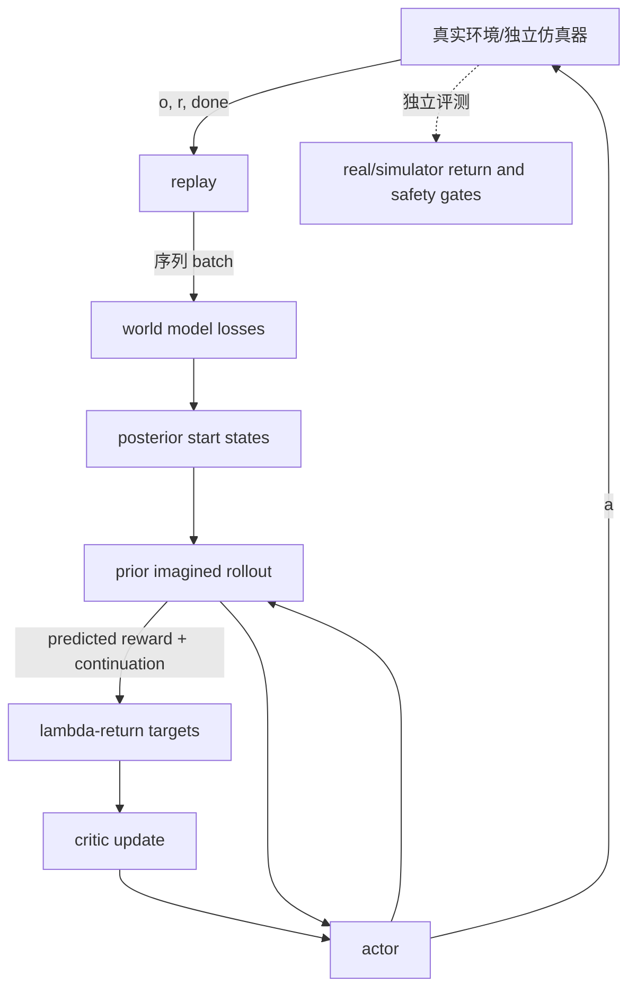

# 第8章 在想象中学习：Dreamer 系列

## 本章契约

### 核心问题

如果世界模型已经能从当前 latent state 预测未来，能否不在真实环境里逐步试错，而是在模型生成的 imagined trajectories 中学习策略？critic target 从哪里来？world model 的 reward、continuation 和 dynamics 错误又怎样污染 actor/critic？

### 先修知识

- 已具备：第3章 MDP/POMDP，第6章 RSSM 与 prior rollout，第7章规划和 model error；
- 本章补齐：replay 与 imagination 的双循环、actor-critic 最小接口、λ-return、Dreamer V1–V4 谱系和 imagined learning 审计；
- 不要求：强化学习优化推导、3D 视觉、Dreamer 使用经验、GPU、仿真器或硬件。

### 非目标

- 不把解析 `EXP-08-01` 称为 Dreamer-lite 或 Dreamer 复现；
- 不把 imagined return 当作真实闭环 return；
- 不从公开论文的 GPU 型号反推本书 24 GB 单卡可复现；
- 不把 Dreamer 4 的单 GPU 交互推理外推成单卡完整训练结论；
- 不让 imagined actor 绕过第20章评测协议或第21章执行网关。

### 学完后的可验证产出

读者应能画出 real replay 与 latent imagination 的数据流，解释 imagination 如何把在线规划摊销进策略，手算 λ-return，说明 actor 与 critic 各自学习什么，解释 continuation mask 对 target 与 loss weight 的两种作用，区分 world-model loss、imagined objective 和真实环境评测，并判断 replay 起点与 actor 诱导分布之间的覆盖缺口。

## 8.1 两个循环：真实数据学模型，模型内部学行为

[Dreamer 原论文](https://arxiv.org/abs/1912.01603)的关键不是“生成一段看起来真实的视频”，而是把学习拆成两个相互依赖的循环：

1. **真实/仿真环境循环**：policy 产生动作，环境返回观测、reward 与 termination，transition 进入 replay；
2. **学习循环**：从 replay 训练 world model，再从 posterior state 出发，用 actor 和 world-model prior 展开 imagined trajectory，训练 critic 与 actor。

<!-- CLAIM_META: CLAIM-08-01 fact -->
Dreamer 式方法把 world model 的监督锚定在 replay transition 上，把行为学习的大量 rollout 放在 learned latent dynamics 中；imagined trajectory 的低交互成本不等于它是真实证据。



*FIG-08-01：Dreamer 式 real-data 与 imagination 双循环。来源：本书原创，CC BY-NC 4.0，2026-08-31。箭头表示训练数据依赖，不表示所有版本采用相同梯度路径。*

这里有四类不能混写的量：

- world-model loss 检查 observation/reward/continuation 与 latent dynamics；
- critic target 估计 imagined state 的折扣累计回报；
- actor objective 让 imagined action 倾向更高价值；
- environment return 才是 policy 在指定外部协议下的结果。

world-model loss 下降不自动证明 policy 变好，imagined return 上升也不自动证明真实 return 上升。

### 8.1.1 从在线搜索到摊销决策

第7章的规划器在每次决策时搜索候选动作；Dreamer 式 actor 则把大量模型内试探的结果压缩进参数 $\theta$，部署时直接由 $\pi_\theta(a\mid s)$ 给出动作分布。可以把这种过程理解为**把决策时计算摊销到训练阶段**：在线执行更快，但策略不再为每个新状态显式比较大量候选。

两者并非互斥。一个系统可以用规划器为 actor 提供改进目标，也可以用 actor 作为 tree search 的 prior 或 shooting 的候选生成器。关键区别在于计算发生在哪里，以及面对新状态时是否重新求解。策略的快速前向计算不能继承规划器对临时约束的全部适应性；规划器的在线搜索也不能自动获得 actor 已经学到的长期规律。

Dreamer 也属于广义的 Dyna 思路：真实经验更新模型，模型生成的经验再更新行为。但 imagined transition 没有增加关于真实世界的新观测，它只是重新利用 replay 中已经获得的信息。模型可以提高真实数据的计算利用率，却不能凭空修复 replay 从未覆盖的动力学、奖励或风险事件。

## 8.2 一条 imagined trajectory 包含什么

从 replay 得到起点 latent state $s_t$ 后，actor 采样动作，world model 用 prior 递推：

\[
a_\tau \sim \pi_\theta(\cdot\mid s_\tau),\qquad
s_{\tau+1}\sim \hat p_\phi(\cdot\mid s_\tau,a_\tau).
\]

reward head 给出 \hat r_\tau，continuation head 估计轨迹是否仍应继续。对一条未被外部切段的 imagined trajectory，可记

\[
d_\tau=\gamma\hat c_\tau,
\]

其中 \hat c_\tau 可表示 predicted continuation。真实 replay transition 还需要把两个职责分开：`d_t` 决定是否从当前行的下一状态 value bootstrap，`m_t` 决定 λ 递推是否可以读取数组中的下一行。自然终止通常令 `d_t=0,m_t=0`；外部截断且最终观测有效时令 `d_t=γ,m_t=0`；同一 episode 内的普通 transition 才是 `d_t=γ,m_t=1`。将 timeout 错当 terminal 会截断有效 bootstrap；只保留 discount 却忘记 trace 边界，又会把下一 episode 的 reward 接回来。

Imagined horizon 不是越长越好。它越长，越能看见延迟回报，也越会累积 dynamics、reward、continuation 与 actor-induced OOD 误差。第7章的 planning horizon 与这里的 imagination horizon 面临相同误差—远见权衡，但用途不同：前者在线选择动作，后者生成学习 target。

### 8.2.1 起点分布决定“从哪里开始想”

imagination 通常不是从任意潜状态开始，而是从 replay 序列经过 posterior inference 得到的状态开始。这提供了观测锚点，也定义了训练覆盖：常见状态在 replay 中出现得越多，就越可能成为 imagined rollout 的起点；未被采集的状态不会仅因模型可以采样而自动获得可靠监督。

从起点向前滚动后，状态分布又由当前 actor 决定。于是存在三个不同分布：

| 分布 | 由什么产生 | 主要作用 |
|---|---|---|
| replay 分布 | 历史行为策略与环境 | 监督 world model，并提供 posterior 起点 |
| imagined 分布 | 起点、当前 actor 与 learned prior | 训练 actor/critic |
| evaluation 分布 | 当前策略与独立真实/仿真环境 | 判断行为是否真正有效 |

三者重合不是默认事实。replay 可能来自旧策略，actor 会不断改变 imagined visitation，而独立环境还会揭示模型遗漏的后果。若只在 replay 上测模型误差，就可能看不到 actor 正在访问的区域；若只在 imagined 分布上测，又会让模型同时充当出题者和裁判。

## 8.3 λ-return：在 bootstrap 与长回报之间

本章采用带显式序列边界的有限递推定义：

\[
G_t^\lambda=\hat r_t+d_t\left[(1-\lambda m_t)V(s_{t+1})+\lambda m_t G_{t+1}^\lambda\right].
\]

在未中断的 imagined rollout 内 `m_t=1`，即退化为常见 λ-return；在截断边界 `m_t=0`，仍可由非零 `d_t` 保留 `V(s_{t+1})`，但不会读取下一行的 `G_{t+1}`。若实现保证每个 batch slice 恰好止于边界，末端 bootstrap 与显式 `m_t=0` 数值等价；一旦数组可能拼接多个 episode，独立 trace mask 就是防止跨段污染的机器合同。

- λ=0 时每步只看一步 reward 加 critic bootstrap，通常方差较低但更依赖 critic；
- λ=1 时把后续 imagined reward 全部向前传播，更少依赖中间 value，却更暴露于长 rollout 的 model error；
- 中间值混合两者。它不是自动最优参数，必须与 horizon、discount、critic、model quality 和任务一起报告。

“bias/variance”在这里是诊断框架，不是说某个 λ 对所有问题都有固定排序。Dreamer 各版本的 actor loss、gradient estimator、target critic 和归一化细节也不同，不能只凭这一条式子复刻算法。

### 8.3.1 Actor 与 critic 解决不同问题

critic 学的是“从这个 imagined state 继续按当前行为，模型认为还能得到多少回报”的近似。它把有限 imagination horizon 之外的前景压缩成 value，并为 actor 提供密集学习信号。critic target 来自模型预测的 reward、continuation 和自身 bootstrap，因此它不是独立真值；target network、慢更新或正则化只能改善学习稳定性，不能消除共同模型偏差。

actor 学的是如何改变动作分布，使 imagined objective 提高。其梯度可以通过可微模型沿 dynamics 回传，也可以使用随机策略的 likelihood-ratio 类估计，实际方法常混合不同路径。这里的区别很重要：通过模型反传会直接利用局部动力学导数，梯度高效但也可能追逐错误导数；采样型估计不要求整条模型可微，却通常噪声更大。无论采用哪条路径，优化信号仍来自 learned world。

因此，“critic 更准”和“actor 更好”也不能互相代替。critic 可能准确预测一个已经很差的策略；actor 可能在有偏 critic 下提升 imagined value，却降低真实回报。应当把 value calibration、policy improvement 和外部闭环结果作为三层不同问题。

## 8.4 先把 target 算对（EXP-08-01）

S 档 fixture 使用三步手工序列：reward 为 `[0, 0, 1]`，discount/continuation 为 `[1, 1, 0]`，下一状态 value 为 `[0.4, 0.8, 0]`。为隔离递推语义，这里的 discount 取 1；它不是训练超参数建议。

<details markdown="1">
<summary>可选：验证本章证据</summary>

```bash
make ch08-test-local
make ch08-smoke-local
make ch08-smoke
```

</details>

| 设置 | 三步 target | start target |
| --- | --- | ---: |
| λ=0 | `[0.4, 0.8, 1.0]` | 0.40 |
| λ=0.5 | `[0.65, 0.9, 1.0]` | 0.65 |
| λ=1 | `[1.0, 1.0, 1.0]` | 1.00 |

*TAB-08-01：`EXP-08-01` 的解析 λ-return。所有数字来自仓库内固定输入和标准库代码。*

<!-- CLAIM_META: CLAIM-08-02 result -->
在这个 value 不精确的固定序列中，λ 从 0、0.5 到 1 时 start target 分别为 0.40、0.65、1.00。这只验证 target 接口，不是策略效果比较。

## 8.5 两条污染路径：reward bias 与终止泄漏

第一条反例把 imagined 最终 reward 从 1 改成 2。在 λ=1 时 target 从 `[1,1,1]` 变成 `[2,2,2]`，start target gap 为 1。

<!-- CLAIM_META: CLAIM-08-03 result -->
固定的终点 reward-model +1 偏差传播到三个 full-return target。它表明 actor/critic 会接收模型生成的偏置信号，但没有执行梯度更新，也没有证明实际 policy 会怎样改变。

第二条反例含 reward `[0,1,10]`，真实 episode 在 reward 1 后结束：

| continuation 处理 | start target | 解释 |
| --- | ---: | --- |
| 正确 mask `[1,0,0]` | 1 | 终止后的 10 不回传 |
| 漏掉 mask `[1,1,0]` | 11 | episode 后 reward 泄漏 |

*TAB-08-02：continuation mask 的固定反例。最后一格仍可有局部 target，但终止 mask 阻止它影响更早状态。*

<!-- CLAIM_META: CLAIM-08-04 result -->
漏掉固定终止 mask 会把 start target 从 1 变成 11，产生 10 的泄漏 gap。这个反例验证数据语义，不估计真实 Dreamer 的误差率。

还要区分“序列是否结束”和“价值是否 bootstrap”。`terminated` 与 `truncated` 都会结束当前采样窗口，但只有任务定义内的自然终态把 value discount 置零。fixture 新增一个单步反例：即时 reward 为 1、下一状态 value 为 4、标量 discount 为 1。

| episode 结束语义 | value discount | target | 解释 |
| --- | ---: | ---: | --- |
| 自然终止 `terminated` | 0 | 1 | 关闭 bootstrap |
| 外部截断 `truncated`，最终观测有效 | 1 | 5 | 保留下一状态 value |
| 把两者折叠为 `done` | 0 | 1 | 错误丢失 4 的 bootstrap |

<!-- CLAIM_META: CLAIM-08-07 result -->
`EXP-08-01` 的固定单步反例中，把有效截断误当自然终止会让 target 从 5 降为 1，bootstrap loss 为 4。若 `terminated/truncated` 同时为真，代码按自然终止关闭 bootstrap；若需要 bootstrap 但下一观测无效，则拒绝该 transition。这验证接口语义，不估计 learned continuation head 的误差。

这里没有矛盾：外部截断之后不能把下一 episode 的 reward 接到当前序列上，但若截断时保存了有效最终观测，仍可用该观测估计截断点的 value。[Gymnasium 的官方 time-limit 指南](https://gymnasium.farama.org/main/tutorials/handling_time_limits/)明确区分 termination 与 truncation 的 bootstrap 语义 `[O,R1]`；Pardo et al. 的[Time Limits in Reinforcement Learning](https://proceedings.mlr.press/v80/pardo18a.html)把训练用外部 time limit 下的末状态 bootstrap 形式化为 partial-episode bootstrapping `[P,R1]`。若最终观测丢失，正确做法是把 target 标为不可构造并暴露数据问题，而不是猜成 terminal。

但 bootstrap 正确还不够。`EXP-08-01` v4 故意把两个不同 episode 的行相邻放置：第一行 reward 为1，因外部截断而结束，保存的下一状态 value 为4；第二行是新 episode 的终止 transition，reward 为100。

| 第一行处理 | bootstrap discount `d₀` | λ-trace `m₀` | λ=1 的第一行 target |
| --- | ---: | ---: | ---: |
| 正确：截断并关闭跨行 trace | 1 | 0 | 5 |
| 错误：只保留 bootstrap、默认 trace 连续 | 1 | 1 | 101 |

*TAB-08-04：截断 bootstrap 与 λ-trace 边界的双信号反例。来源：`EXP-08-01` v4，本书原创，CC BY-NC 4.0，2026-09-02。第二行的100是手工放大的新 episode reward。*

<!-- CLAIM_META: CLAIM-08-09 result -->
`EXP-08-01` v4 的两行跨 episode 反例中，正确的 `d₀=1,m₀=0` 得到第一行 target 5；若保留 bootstrap discount 却遗漏 trace 边界，target 变为101，产生96的跨 episode 泄漏。该结果只验证数组边界与递推接口，不估计真实 replay 污染率、critic bias、训练稳定性或策略性能。

### 8.5.1 Target 正确不等于 loss 权重正确

continuation 有两个不同职责：一是进入 return 递推，阻止终止后的 reward 影响更早 target；二是形成每个 imagined step 的累计 survival weight，阻止终止后的伪状态继续贡献 actor/critic loss。若 $d_t$ 是第 $t$ 步之后的 discount/continuation，最小接口可写成

\[
w_0=1,\qquad w_t=\prod_{i=0}^{t-1}d_i\quad(t>0).
\]

终止 transition 自身仍可有训练信号，终止之后的伪 step 权重才应为 0。本书核查的 DreamerV3 作者实现快照 [`e3f0224`](https://github.com/danijar/dreamerv3/blob/e3f02248693a79dc8b0ebd62c93683888ddaccfe/dreamerv3/agent.py#L387-L421)同样由 continuation 的累积乘积形成 weight，并把它用于 policy/value loss；具体索引、discount 定义和 loss reduction 依版本而异，本书 fixture 只验证这个接口不变量。

| 情形 | 每步 raw loss | 累积权重 | 加权贡献 | 总和 |
| --- | --- | --- | --- | ---: |
| 正确 mask | `[1,1,100]` | `[1,1,0]` | `[1,1,0]` | 2 |
| 漏掉 mask | `[1,1,100]` | `[1,1,1]` | `[1,1,100]` | 102 |

*TAB-08-03：`EXP-08-01` 的固定 loss-weighting 反例。100 是手工伪 loss，用于让错误可见；总和不是 Dreamer 训练曲线或性能指标。*

<!-- CLAIM_META: CLAIM-08-08 result -->
`EXP-08-01` v4 的三步手工序列中，正确累计权重把终止后 raw loss 100 的贡献降为 0，加权总和为 2；漏掉 continuation mask 时总和为 102，post-terminal leakage 为 100。这只验证非负标量 loss 与手工 discount 的累计加权合同，没有 actor/critic、梯度、learned continuation 或策略改进。

运行产物为 `results/ch08/EXP-08-01-smoke.json`；实验卡明确记录了零下载、CPU、未用 GPU 和非训练边界。

## 8.6 从 Dreamer 到 DreamerV3

[Dreamer](https://arxiv.org/abs/1912.01603)把 latent imagination 与 actor-critic 结合；[项目页](https://dreamrl.github.io/)提供论文和演示锚点。它继承第6章 RSSM 的“观测序列推断 state、prior 预测未来”结构，再从 replay states 启动 imagined behavior learning。

[DreamerV2](https://arxiv.org/abs/2010.02193)把离散 latent representation 等设计用于 Atari，显示 world-model agent 能覆盖此前更依赖无模型方法的离散动作基准。这里的“离散 latent”不是离散动作，也不是把每个像素做 token。

[DreamerV3](https://www.nature.com/articles/s41586-025-08744-2)在 2025 年发表于 *Nature*，目标是用一套配置覆盖不同 domain。其稳定性组合包括 symlog 量纲压缩、two-hot reward/value 预测、KL balancing/free bits、categorical unimix，以及基于回报尺度的 actor 归一化等；这些组件共同作用，不能把跨域表现归因给单一技巧。作者的 [DreamerV3 仓库](https://github.com/danijar/dreamerv3)是 JAX 重实现与接口锚点，并明确把 debug 配置定位为调试而非学得好模型。

| 谱系 | 本章关注的变化 | 本书证据边界 |
| --- | --- | --- |
| Dreamer | latent imagination 中学 actor/critic | 论文/项目页；未运行 |
| DreamerV2 | 离散 latent 与 Atari 路线 | 论文；未运行 |
| DreamerV3 | 跨域稳定训练配方与统一配置目标 | Nature/作者仓库；未运行 |
| Dreamer 4 | scalable world model 内的 offline imagination training | 预印本；未发现可作为核心复现锚点的作者代码 |

## 8.7 Dreamer 4：架构变化，不是版本号替换

[Dreamer 4](https://arxiv.org/abs/2509.24527)（Hafner、Yan、Lillicrap，2025）面向 scalable world model 内的 agent training，引入 causal tokenizer、transformer world model 和 shortcut forcing，并把核心展示放在 Minecraft 的离线 imagination training 与交互上。它不只是把 DreamerV3 的 RSSM 放大，因此本书不把 V3 配置直接套给 V4。

论文中的“单 GPU 实时交互推理”说明特定实现和设置下的交互生成能力，不说明完整 tokenizer、world model 和 agent 训练可在 24 GB 单卡完成，更不说明机器人操作或自动驾驶闭环已经解决。社区重实现可作课程实验候选，但必须标注为社区资产、锁定 commit，并与论文主张逐项对齐。

Dreamer 谱系的共同点是“从真实序列学习世界模型，再在潜空间想象中改进行为”，而不是某一种固定 RSSM、latent 类型或 actor loss。版本名称只能提示研究路线，不能替代接口核对。比较两个版本时，应分别问表示如何推断、未来如何生成、reward/continuation 如何建模、actor/critic 接收什么梯度，以及真实数据如何再次进入闭环。

## 8.8 误差为什么会被 actor 放大

随机 replay 衡量的是数据分布附近误差；actor 会搜索能提高 imagined return 的动作，逐渐把 rollout 推到模型最乐观、数据最稀疏的位置。因此甚至很低的平均 prediction loss，也可能隐藏 reward spike、漏碰撞、错误 continuation 或不可达状态。

这不是普通的独立同分布预测误差。模型一旦参与策略优化，预测误差会改变动作，动作又改变下一轮收集到的数据，形成带反馈的分布迁移。可以把污染链写成：

\[
\text{model error}
\rightarrow \text{critic/actor objective error}
\rightarrow \text{policy shift}
\rightarrow \text{new visitation}
\rightarrow \text{new model inputs}.
\]

链条中任何一环都可能放大前一环。reward head 的局部高估会吸引 actor；错误 continuation 会制造不存在的长期收益；latent dynamics 的小偏差会把轨迹送入未训练区域；critic 再把这些远端偏差传播回更早状态。这说明“冻结模型后 actor loss 收敛”只证明对固定代理目标完成了优化，不证明该目标与环境一致。

缓解也必须对应不同机制：限制 rollout horizon 减少复合误差，限制 actor 偏离数据支持域减少外推，ensemble/disagreement 尝试暴露认知不确定性，持续真实交互可以纠正新分布，独立约束则阻止某些错误被收益权衡吸收。这些手段降低风险，但都不是模型正确性或安全性的证明。

至少分开记录：

- replay 上的一步与多步 model error；
- actor-induced state/action 的 OOD 与 ensemble disagreement；
- imagined return 与外部环境 return 的 gap；
- policy 排序是否在外部环境保持；
- terminal、碰撞和稀有安全事件的漏检；
- actor/critic/world-model 各自版本与更新频率。

<!-- CLAIM_META: CLAIM-08-05 recommendation -->
Dreamer 类实验必须分别报告 world-model loss、critic calibration、imagined return、真实/独立仿真 return 与安全事件；只报告训练曲线中的 imagined objective 不能支持策略有效性结论。

第17章给出 model exploitation 的策略排序反例，第20章定义评测协议；本章只解释污染如何进入 target。

**杯子任务。** 想象轨迹可以让策略练习“接近—闭合—抬升—放置”，但 credit 不能只看最终是否落桌：一次放置失败可能包含正确的接近和抓取前缀，也可能从接触瞬间就已失败。continuation 与阶段边界应阻止终止后的虚构奖励回流，同时保留哪些前缀仍值得学习；若世界模型把过大的夹持力预测成稳定，actor 会主动利用这一错误。因而 imagined return 适合产生更新信号，是否真的减少掉落仍要回到独立环境验证。

## 8.9 自动驾驶：可以在想象中学，不能在想象中验收

自动驾驶可从带时间同步、车辆状态和 control 的真实日志，或第19章 MetaDrive/CARLA rollout 学 world model。posterior start 应覆盖城市道路、不同速度、天气、交互密度和稀有事件，而不是只从直道常见帧启动。

覆盖还必须包含**可决策时刻**，而不只是事件最终发生后的画面。若日志只记录已经无法避免碰撞的末端状态，actor 即使在 imagination 中学会识别风险，也没有足够提前量改变结果。遮挡行人、cut-in 和信号变化应从仍存在多个可行动分支的前驱状态启动，并保留当时真正可用的观测，不能用事后信息替代在线 belief。

reward/cost 至少拆成路线进度、碰撞、道路边界、交通规则和舒适项；碰撞与硬约束不能被路线 reward 的尺度吞没。continuation 要区分碰撞终止、任务完成、日志截断、传感器缺失和 simulator timeout。否则本节的“终止后 +10 reward 泄漏”会进入 critic target，终止后的伪轨迹 loss 也可能继续污染 actor/critic objective；两条路径必须分别检查。

离线日志还带来反事实缺口：数据只展示实际执行动作后的结果，没有同时展示“若当时急刹或绕行会怎样”。世界模型对替代动作的预测来自跨样本泛化，而不是同一场景中的直接配对观察。actor 越偏离日志动作，这个因果外推越强，因此 action support、行为策略覆盖和独立闭环复核是 imagined learning 的核心条件，不只是工程附录。

一个可审计流程是：

1. 用 train logs 训练 world model，用按场景组隔离的 validation logs 检查 rollout；
2. 在 imagination 中训练 actor，但限制 action/support 并监控 OOD；
3. 在未参与训练的物理仿真 seed、路线和对手行为上闭环评测；
4. 对碰撞、cut-in、行人遮挡、急刹和传感器故障做独立压力测试；
5. 通过第21章 deadline、watchdog、fallback 与最小风险停车网关后，才讨论更高等级验证。

<!-- CLAIM_META: CLAIM-08-06 recommendation -->
自动驾驶 imagined learning 的 actor 必须在独立闭环环境中复核路线、碰撞、干预、规则和尾部风险；world-model return 不能作为车辆执行授权或道路安全证据。

## 8.10 资源、许可与进一步验证

全书资源档位见[术语表](../glossary.md)。本章的 λ-return 反例只验证 target、continuation、bootstrap 和截断语义；Dreamer debug 配置最多用于检查接口，不能因为程序跑通就声称策略学会任务。若进入学习环境，应报告外部 return、model return gap、失败类型、随机种子与资源实测，并把作者配方和本书缩小设置分开。

本书原创代码和 fixture 使用 MIT，原创图表使用 CC BY-NC 4.0；论文文本、上游仓库、环境、数据、模型权重和录屏仍按各自许可。引用仓库不等于把其代码并入本书。

## 小结

Dreamer 将真实 replay 上的 world-model learning 与 latent imagination 中的 behavior learning 连接起来，并把决策时搜索的一部分成本摊销进 actor 参数。imagination 提高的是既有数据的计算利用率，不会创造新的环境证据；posterior 起点、actor rollout 与外部评测分别属于不同分布。

critic 用 learned reward、continuation 与 bootstrap 估计 imagined state 的延迟价值，actor 再优化这个代理目标。λ-return 控制中间 value 与长回报的混合，continuation 同时约束 target 递推和终止后 loss 权重。target 数值正确只是必要条件，不能让 critic 独立于模型偏差，也不能保证 actor 的真实改进。

模型误差会通过策略优化变成反馈问题：错误目标改变策略，策略访问新区域，新区域又放大模型外推。短 horizon、数据支持约束、不确定性估计、持续真实校正和独立安全门分别处理不同风险，没有任何单项能够替代外部闭环评测。

对自动驾驶尤其要检查可决策前驱状态和反事实动作覆盖，而不只收集事故末端画面。imagined return 是训练信号，不是道路表现；只有在独立环境中复核路线、规则、碰撞、干预与尾部风险后，才能讨论策略是否真正改善。

## 练习

1. **目标计算**：在 fixture 中加入 $\gamma=0.99$，手算并测试三个 start target。
2. **交互效应**：同时注入 reward +1 和 continuation 泄漏，判断两种 gap 是否线性相加。
3. **结束语义**：为一个移动机器人写 terminated、truncated、timeout、sensor-drop 的 truth table。
4. **驾驶协议**：为自动驾驶 cut-in 场景设计 train/validation/closed-loop 三组互斥 seed 和五项指标。
5. **权重审计**：给定 discount `[0.9,0.9,0]`，手算三个 step 的累计 loss weight；再解释为什么不能只检查 λ-return target。
6. **截断边界**：构造三个相邻 transition，令第二个 transition 为外部截断；分别写出 bootstrap discount 与 λ-trace mask，并计算遗漏 trace mask 时第一个 episode 的 target 会吸收哪些新 episode reward。

## 自检要点

这里的计算严格采用 8.3 节递推和当前 fixture 的索引约定。不同 Dreamer 实现若把 reward、continuation 或 bootstrap 对齐到不同位置，必须先转换接口再比较。

<details markdown="1">
<summary>SELF-CHECK-08-01：gamma 0.99 的三个 start target</summary>

把原 discounts 从 `[1,1,0]` 改为 `[0.99,0.99,0]`，rewards 与 next values 保持 `[0,0,1]`、`[0.4,0.8,0]`。按当前递推，λ=0 的 targets 为 `[0.396,0.792,1]`，start target 0.396；λ=0.5 为 `[0.639045,0.891,1]`，start 0.639045；λ=1 为 `[0.9801,0.99,1]`，start 0.9801。测试应调用同一 `lambda_returns` 并用明确容差比较，不能把手算值直接写成新的训练结果声明。

</details>

<details markdown="1">
<summary>SELF-CHECK-08-02：两种污染是否相加</summary>

在本章 λ=1、固定 dynamics、固定 reward 向量和二值 mask 的线性递推里，二者可相加：相对正确 start target 1，终点 reward +1 贡献 gap 1，漏掉终止 mask 让 episode 后的 10 贡献 gap 10，同时注入得到 start target 12，总 gap 11。这个加法只对冻结接口成立；若 reward bias 改变 policy visitation，continuation 是 learned probability，含归一化/clipping，或 λ、value 也联动，交互项可能非零，必须用四格 factorial control 检查。

</details>

<details markdown="1">
<summary>SELF-CHECK-08-03：episode 结束 truth table</summary>

最小表为：任务自然完成/碰撞终态 `terminated=1,truncated=0,bootstrap=0,target valid=1`；时间上限且 final observation 有效 `0,1,bootstrap=γ,valid=1`；外部 timeout 也通常是 truncation，若 final observation 有效则 bootstrap，否则 target invalid；sensor-drop 不是自动 terminal，若下一观测无效且需要 bootstrap，应标记 transition/target invalid 并单独统计。若自然终止与时间上限同时发生，当前 fixture 以 terminated 为准关闭 bootstrap。环境 API 的实际语义必须核对，不能按字段名猜。

</details>

<details markdown="1">
<summary>SELF-CHECK-08-04：cut-in 的互斥 split 与指标</summary>

先以 `scenario_group_id`（同一路线、交通参与者初始化和派生天气共享一组）做稳定 hash，再划 `0–5=train,6–7=validation,8–9=closed-loop test`；每组内部的 simulator seed 从冻结清单产生，任何派生 replay 不得跨组。五项最低指标可取碰撞率、最小 TTC/低于阈值占比、任务/路线完成率、最大 jerk 或超舒适阈值时长、独立安全网关干预率；另报有效 episode 分母和 simulator failure。validation 只选模型，closed-loop test 不回流调参。

</details>

<details markdown="1">
<summary>SELF-CHECK-08-05：累计 loss weight</summary>

按 `w0=1,w_t=∏_{i<t}d_i`，discount `[0.9,0.9,0]` 对三个 step 的权重是 `[1,0.9,0.81]`；最后一个 0 只会关闭下一步，不能反向把终止 transition 自身权重清零。只检查 λ-return target 会漏掉另一条路径：即使 target 已正确 mask，终止后的伪 latent 仍可能以错误的非零 survival weight进入 actor/critic loss。应分别测试 target recursion 和 loss contribution，含一个终止后超大伪 loss 的负对照。

</details>

<details markdown="1">
<summary>SELF-CHECK-08-06：bootstrap 与 λ-trace 是两个问题</summary>

例如三行 reward 为 `[0,1,100]`，第二行是外部截断且其有效 final observation 的 value 为4，第三行来自新 episode。可令 bootstrap discounts 为 `[1,1,0]`，因为第二行需要 `1+V(final)=5`；trace masks 应为 `[1,0,0]`，因为第二行之后不得读取第三行 return。λ=1 时正确 targets 的前两项为 `[5,5]`；若错误使用全1 trace，第二行会变成101，第一行也变成101，两个当前 episode target 都被新 episode 的100污染。若第二行是自然终止，则其 discount 应为0；若 final observation 无效，则不能用“设成0”伪造合法 target。生产实现还必须确认 replay sampler 是否已经在边界切片；切片保证与 mask 仍应至少有一个可测试合同。

</details>

## 延伸阅读

- [Dreamer 论文](https://arxiv.org/abs/1912.01603)与[项目页](https://dreamrl.github.io/)；
- [DreamerV2 论文](https://arxiv.org/abs/2010.02193)；
- [DreamerV3 Nature 论文](https://www.nature.com/articles/s41586-025-08744-2)与[作者仓库](https://github.com/danijar/dreamerv3)；
- [Dreamer 4 预印本](https://arxiv.org/abs/2509.24527)。
- Pardo et al., [Time Limits in Reinforcement Learning](https://proceedings.mlr.press/v80/pardo18a.html)；
- Gymnasium, [Handling Time Limits](https://gymnasium.farama.org/main/tutorials/handling_time_limits/)。

## 下一章接口

第9章用外部指标检查“模型预测得好”是否真的支持决策；第17章专门展示 actor/planner 利用模型漏洞；第18章把 imagined rollout、reward/critic 与后训练连接到 VLA 和长时任务。
