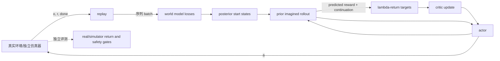

# 第8章 在想象中学习：Dreamer 系列

> 状态：`reviewed`
> 资料核查日期：2026-08-31
> 关联实验：`EXP-08-01`
> 关联声明：`CLAIM-08-01`～`CLAIM-08-07`
> 关联图表：`FIG-08-01` / `TAB-08-01` / `TAB-08-02`
> 资源档位：S / M / L1 / L2
> GPU 状态：待验证

## 本章契约

### 核心问题

如果世界模型已经能从当前 latent state 预测未来，能否不在真实环境里逐步试错，而是在模型生成的 imagined trajectories 中学习策略？critic target 从哪里来？world model 的 reward、continuation 和 dynamics 错误又怎样污染 actor/critic？

### 先修知识

- 已具备：第3章 MDP/POMDP，第6章 RSSM 与 prior rollout，第7章规划和 model error；
- 本章补齐：replay 与 imagination 的双循环、actor-critic 最小接口、λ-return、Dreamer V1–V4 谱系和 imagined learning 审计；
- 不要求：强化学习优化推导、3D 视觉、Dreamer 使用经验、GPU、仿真器或硬件。

### 非目标

- 不把解析 `EXP-08-01` 称为 Dreamer-lite 或 Dreamer 复现；
- 不把 imagined return 当作真实闭环 return；
- 不从公开论文的 GPU 型号反推本书 24 GB 单卡可复现；
- 不把 Dreamer 4 的单 GPU 交互推理外推成单卡完整训练结论；
- 不让 imagined actor 绕过第20章评测协议或第21章执行网关。

### 学完后的可验证产出

读者应能画出 real replay 与 latent imagination 的数据流，手算 λ-return，解释 continuation mask 的作用，区分 world-model loss、critic target、actor objective 和真实环境评测，并写出自动驾驶 imagined training 的独立验证门。

## 8.1 两个循环：真实数据学模型，模型内部学行为

Dreamer 的关键不是“生成一段看起来真实的视频”，而是把学习拆成两个相互依赖的循环：

1. **真实/仿真环境循环**：policy 产生动作，环境返回观测、reward 与 termination，transition 进入 replay；
2. **学习循环**：从 replay 训练 world model，再从 posterior state 出发，用 actor 和 world-model prior 展开 imagined trajectory，训练 critic 与 actor。

`CLAIM-08-01`（fact）：Dreamer 式方法把 world model 的监督锚定在 replay transition 上，把行为学习的大量 rollout 放在 learned latent dynamics 中；imagined trajectory 的低交互成本不等于它是真实证据。



*FIG-08-01：Dreamer 式 real-data 与 imagination 双循环。来源：本书原创，MIT，2026-08-31。箭头表示训练数据依赖，不表示所有版本采用相同梯度路径。*

这里有四类不能混写的量：

- world-model loss 检查 observation/reward/continuation 与 latent dynamics；
- critic target 估计 imagined state 的折扣累计回报；
- actor objective 让 imagined action 倾向更高价值；
- environment return 才是 policy 在指定外部协议下的结果。

world-model loss 下降不自动证明 policy 变好，imagined return 上升也不自动证明真实 return 上升。

## 8.2 一条 imagined trajectory 包含什么

从 replay 得到起点 latent state $s_t$ 后，actor 采样动作，world model 用 prior 递推：

\[
a_\tau \sim \pi_\theta(\cdot\mid s_\tau),\qquad
s_{\tau+1}\sim \hat p_\phi(\cdot\mid s_\tau,a_\tau).
\]

reward head 给出 \hat r_\tau，continuation head 估计轨迹是否仍应继续。记

\[
d_\tau=\gamma\hat c_\tau,
\]

其中 \hat c_\tau 可表示 predicted continuation；真实 transition 上则应由数据集的 terminated/truncated 语义构造。将 timeout 错当 terminal 会截断有效 bootstrap，将真正 terminal 当 continuation 则会让 episode 之后的虚假奖励泄漏回来。

Imagined horizon 不是越长越好。它越长，越能看见延迟回报，也越会累积 dynamics、reward、continuation 与 actor-induced OOD 误差。第7章的 planning horizon 与这里的 imagination horizon 面临相同误差—远见权衡，但用途不同：前者在线选择动作，后者生成学习 target。

## 8.3 λ-return：在 bootstrap 与长回报之间

本章采用有限序列上的递推定义：

\[
G_t^\lambda=\hat r_t+d_t\left[(1-\lambda)V(s_{t+1})+\lambda G_{t+1}^\lambda\right].
\]

- λ=0 时每步只看一步 reward 加 critic bootstrap，通常方差较低但更依赖 critic；
- λ=1 时把后续 imagined reward 全部向前传播，更少依赖中间 value，却更暴露于长 rollout 的 model error；
- 中间值混合两者。它不是自动最优参数，必须与 horizon、discount、critic、model quality 和任务一起报告。

“bias/variance”在这里是诊断框架，不是说某个 λ 对所有问题都有固定排序。Dreamer 各版本的 actor loss、gradient estimator、target critic 和归一化细节也不同，不能只凭这一条式子复刻算法。

## 8.4 EXP-08-01：先把 target 算对

S 档 fixture 使用三步手工序列：reward 为 `[0, 0, 1]`，discount/continuation 为 `[1, 1, 0]`，下一状态 value 为 `[0.4, 0.8, 0]`。为隔离递推语义，这里的 discount 取 1；它不是训练超参数建议。

```bash
make ch08-test-local
make ch08-smoke-local
make ch08-smoke
```

| 设置 | 三步 target | start target |
| --- | --- | ---: |
| λ=0 | `[0.4, 0.8, 1.0]` | 0.40 |
| λ=0.5 | `[0.65, 0.9, 1.0]` | 0.65 |
| λ=1 | `[1.0, 1.0, 1.0]` | 1.00 |

*TAB-08-01：`EXP-08-01` 的解析 λ-return。所有数字来自仓库内固定输入和标准库代码。*

`CLAIM-08-02`（result）：在这个 value 不精确的固定序列中，λ 从 0、0.5 到 1 时 start target 分别为 0.40、0.65、1.00。这只验证 target 接口，不是策略效果比较。

## 8.5 两条污染路径：reward bias 与终止泄漏

第一条反例把 imagined 最终 reward 从 1 改成 2。在 λ=1 时 target 从 `[1,1,1]` 变成 `[2,2,2]`，start target gap 为 1。

`CLAIM-08-03`（result）：固定的终点 reward-model +1 偏差传播到三个 full-return target。它表明 actor/critic 会接收模型生成的偏置信号，但没有执行梯度更新，也没有证明实际 policy 会怎样改变。

第二条反例含 reward `[0,1,10]`，真实 episode 在 reward 1 后结束：

| continuation 处理 | start target | 解释 |
| --- | ---: | --- |
| 正确 mask `[1,0,0]` | 1 | 终止后的 10 不回传 |
| 漏掉 mask `[1,1,0]` | 11 | episode 后 reward 泄漏 |

*TAB-08-02：continuation mask 的固定反例。最后一格仍可有局部 target，但终止 mask 阻止它影响更早状态。*

`CLAIM-08-04`（result）：漏掉固定终止 mask 会把 start target 从 1 变成 11，产生 10 的泄漏 gap。这个反例验证数据语义，不估计真实 Dreamer 的误差率。

还要区分“序列是否结束”和“价值是否 bootstrap”。`terminated` 与 `truncated` 都会结束当前采样窗口，但只有任务定义内的自然终态把 value discount 置零。fixture 新增一个单步反例：即时 reward 为 1、下一状态 value 为 4、标量 discount 为 1。

| episode 结束语义 | value discount | target | 解释 |
| --- | ---: | ---: | --- |
| 自然终止 `terminated` | 0 | 1 | 关闭 bootstrap |
| 外部截断 `truncated`，最终观测有效 | 1 | 5 | 保留下一状态 value |
| 把两者折叠为 `done` | 0 | 1 | 错误丢失 4 的 bootstrap |

`CLAIM-08-07`（result）：`EXP-08-01` 的固定单步反例中，把有效截断误当自然终止会让 target 从 5 降为 1，bootstrap loss 为 4。若 `terminated/truncated` 同时为真，代码按自然终止关闭 bootstrap；若需要 bootstrap 但下一观测无效，则拒绝该 transition。这验证接口语义，不估计 learned continuation head 的误差。

这里没有矛盾：外部截断之后不能把下一 episode 的 reward 接到当前序列上，但若截断时保存了有效最终观测，仍可用该观测估计截断点的 value。若最终观测丢失，正确做法是把 target 标为不可构造并暴露数据问题，而不是猜成 terminal。

运行产物为 `results/ch08/EXP-08-01-smoke.json`；实验卡明确记录了零下载、CPU、未用 GPU 和非训练边界。

## 8.6 从 Dreamer 到 DreamerV3

[Dreamer](https://arxiv.org/abs/1912.01603)把 latent imagination 与 actor-critic 结合；[项目页](https://dreamrl.github.io/)提供论文和演示锚点。它继承第6章 RSSM 的“观测序列推断 state、prior 预测未来”结构，再从 replay states 启动 imagined behavior learning。

[DreamerV2](https://arxiv.org/abs/2010.02193)把离散 latent representation 等设计用于 Atari，显示 world-model agent 能覆盖此前更依赖无模型方法的离散动作基准。这里的“离散 latent”不是离散动作，也不是把每个像素做 token。

[DreamerV3](https://www.nature.com/articles/s41586-025-08744-2)在 2025 年发表于 *Nature*，目标是用一套配置覆盖不同 domain。其稳定性组合包括 symlog 量纲压缩、two-hot reward/value 预测、KL balancing/free bits、categorical unimix，以及基于回报尺度的 actor 归一化等；这些组件共同作用，不能把跨域表现归因给单一技巧。作者的 [DreamerV3 仓库](https://github.com/danijar/dreamerv3)是 JAX 重实现与接口锚点，并明确把 debug 配置定位为调试而非学得好模型。

| 谱系 | 本章关注的变化 | 本书证据边界 |
| --- | --- | --- |
| Dreamer | latent imagination 中学 actor/critic | 论文/项目页；未运行 |
| DreamerV2 | 离散 latent 与 Atari 路线 | 论文；未运行 |
| DreamerV3 | 跨域稳定训练配方与统一配置目标 | Nature/作者仓库；未运行 |
| Dreamer 4 | scalable world model 内的 offline imagination training | 预印本；未发现可作为核心复现锚点的作者代码 |

## 8.7 Dreamer 4：架构变化，不是版本号替换

[Dreamer 4](https://arxiv.org/abs/2509.24527)（Hafner、Yan、Lillicrap，2025）面向 scalable world model 内的 agent training，引入 causal tokenizer、transformer world model 和 shortcut forcing，并把核心展示放在 Minecraft 的离线 imagination training 与交互上。它不只是把 DreamerV3 的 RSSM 放大，因此本书不把 V3 配置直接套给 V4。

论文中的“单 GPU 实时交互推理”说明特定实现和设置下的交互生成能力，不说明完整 tokenizer、world model 和 agent 训练可在 24 GB 单卡完成，更不说明机器人操作或自动驾驶闭环已经解决。社区重实现可作课程实验候选，但必须标注为社区资产、锁定 commit，并与论文主张逐项对齐。

## 8.8 误差为什么会被 actor 放大

随机 replay 衡量的是数据分布附近误差；actor 会搜索能提高 imagined return 的动作，逐渐把 rollout 推到模型最乐观、数据最稀疏的位置。因此甚至很低的平均 prediction loss，也可能隐藏 reward spike、漏碰撞、错误 continuation 或不可达状态。

至少分开记录：

- replay 上的一步与多步 model error；
- actor-induced state/action 的 OOD 与 ensemble disagreement；
- imagined return 与外部环境 return 的 gap；
- policy 排序是否在外部环境保持；
- terminal、碰撞和稀有安全事件的漏检；
- actor/critic/world-model 各自版本与更新频率。

`CLAIM-08-05`（recommendation）：Dreamer 类实验必须分别报告 world-model loss、critic calibration、imagined return、真实/独立仿真 return 与安全事件；只报告训练曲线中的 imagined objective 不能支持策略有效性结论。

第17章给出 model exploitation 的策略排序反例，第20章定义评测协议；本章只解释污染如何进入 target。

## 8.9 自动驾驶正文：可以在想象中学，不能在想象中验收

自动驾驶可从带时间同步、车辆状态和 control 的真实日志，或第19章 MetaDrive/CARLA rollout 学 world model。posterior start 应覆盖城市道路、不同速度、天气、交互密度和稀有事件，而不是只从直道常见帧启动。

reward/cost 至少拆成路线进度、碰撞、道路边界、交通规则和舒适项；碰撞与硬约束不能被路线 reward 的尺度吞没。continuation 要区分碰撞终止、任务完成、日志截断、传感器缺失和 simulator timeout。否则本节的“终止后 +10 泄漏”会以更隐蔽的形式进入 critic。

一个可审计流程是：

1. 用 train logs 训练 world model，用按场景组隔离的 validation logs 检查 rollout；
2. 在 imagination 中训练 actor，但限制 action/support 并监控 OOD；
3. 在未参与训练的物理仿真 seed、路线和对手行为上闭环评测；
4. 对碰撞、cut-in、行人遮挡、急刹和传感器故障做独立压力测试；
5. 通过第21章 deadline、watchdog、fallback 与最小风险停车网关后，才讨论更高等级验证。

`CLAIM-08-06`（recommendation）：自动驾驶 imagined learning 的 actor 必须在独立闭环环境中复核路线、碰撞、干预、规则和尾部风险；world-model return 不能作为车辆执行授权或道路安全证据。

## 8.10 资源、许可与可执行路径

| 档位 | 路径 | 当前状态 | 证据要求 |
| --- | --- | --- | --- |
| S | 本章标准库 λ-return fixture | 已运行 | 12 个单元测试、宿主与 Docker smoke、精确 JSON |
| M | DreamerV3 debug/微型环境接口检查 | 可选、待运行 | CPU/Docker 优先；上游已警告 debug 不会学好模型 |
| L1 | 小环境的缩小配置训练，目标 24 GB 单卡以内 | 可选、待验证 | 实测峰值 VRAM、墙钟、seed、return gap 与失败 |
| L2 | 最多 2×80 GB 的 Dreamer 4 社区研究性审计 | 非必需、待验证 | 锁 commit/许可/数据；不得冒充作者实现或通用复现 |

本章不要求购买硬件。DreamerV3 论文的上游实验使用其报告的硬件条件，本书尚未在 24 GB GPU 上复现，故 `gpu_status=pending`。大数据和 checkpoint 不会被 S 档命令下载。

本书原创代码、图表和 fixture 使用 MIT；论文文本、上游仓库、环境、数据、模型权重和录屏仍按各自许可。引用仓库不等于把其代码并入本书。

## 小结

Dreamer 将真实 replay 上的 world-model learning 与 latent imagination 中的 behavior learning 连接起来。它减少的是环境交互，不是模型偏差；λ-return、continuation 与外部闭环评测决定 target 是否有基本可信度。

## 练习

1. 在 fixture 中加入 $\gamma=0.99$，手算并测试三个 start target。
2. 同时注入 reward +1 和 continuation 泄漏，判断两种 gap 是否线性相加。
3. 为一个移动机器人写 terminated、truncated、timeout、sensor-drop 的 truth table。
4. 为自动驾驶 cut-in 场景设计 train/validation/closed-loop 三组互斥 seed 和五项指标。

## 延伸阅读

- [Dreamer 论文](https://arxiv.org/abs/1912.01603)与[项目页](https://dreamrl.github.io/)；
- [DreamerV2 论文](https://arxiv.org/abs/2010.02193)；
- [DreamerV3 Nature 论文](https://www.nature.com/articles/s41586-025-08744-2)与[作者仓库](https://github.com/danijar/dreamerv3)；
- [Dreamer 4 预印本](https://arxiv.org/abs/2509.24527)。

## 下一章接口

第9章用外部指标检查“模型预测得好”是否真的支持决策；第17章专门展示 actor/planner 利用模型漏洞；第18章把 imagined rollout、reward/critic 与后训练连接到 VLA 和长时任务。

## 验收与审查记录

- 内容审查：通过；
- 代码审查：通过；
- 一致性审查：通过；
- 教学审查：通过；
- 审查记录路径：`reviews/batch-d-review.md`；
- 已知限制：只有解析 target 和手工反例，没有 world model、actor/critic 更新、上游 checkpoint、仿真、GPU 或真实闭环。
