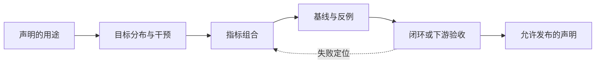

# 第9章 世界模型如何评测与失败

> 状态：`reviewed`
> 资料核查日期：2026-09-01
> 关联实验：`EXP-09-01`
> 关联声明：`CLAIM-09-01`～`CLAIM-09-06`
> 关联图表：`FIG-09-01`
> 资源档位：S / M
> GPU 状态：不需要

## 本章契约

### 核心问题

如果一个世界模型将被用于生成数据、评估策略或选择动作，我们应该测什么，才能让评测证据与实际用途一致？

### 先修知识

- 已具备：均方误差、分类指标和训练集/测试集划分的基本概念；
- 本章补齐：多步 rollout、干预、策略排序、闭环效用与模型利用；
- 不要求：3D 视觉、机器人硬件、强化学习推导或视频生成模型训练经验。

### 非目标

- 不把一个综合分数当作所有用途的通用排名；
- 不在当前设备上运行大型视频指标、仿真数据集或 GPU 模型；
- 不把程序化反例写成真实世界模型的经验结论；
- 不用开环视频质量替代机器人或车辆闭环安全验证。

### 学完后的可验证产出

读者应能：

1. 从模型用途反推最小评测层级；
2. 区分 one-step、multi-step、counterfactual 和 closed-loop 证据；
3. 设计至少一个能暴露动作不敏感或模型利用的反例；
4. 阅读 benchmark 时判断声明是否超出了指标能够支持的范围；
5. 为新模型填写一张可审计的 benchmark card。

## 9.1 先问用途，再选指标

“世界模型”可能指未来视频生成器、潜在动力学、策略评估器、规划器内部模型或合成数据引擎。这些对象共享预测未来的外观，却不共享同一个验收条件。

如果用途是生成可供人观看的视频，视觉质量和时间一致性是直接证据；如果用途是比较两条策略，关键证据变成策略排序是否与真实环境一致；如果用途是规划，模型还必须在候选动作造成的分布变化下保持可信。2026 年的立场论文 [How Should World Models Be Evaluated?](https://arxiv.org/abs/2606.15032) 将这种差别组织为从视觉合理性到策略优化效用的层级，并强调声明与证据错位的问题。它是 `[A,R0]` 的方法论来源，不是一个已被本书复现的经验定律。

本书采用一个更便于工程执行的五层门禁：

| 层级 | 核心问题 | 典型指标 | 能支持的声明 |
| --- | --- | --- | --- |
| E0 接口 | 输入、动作、输出和时间轴是否对齐 | shape、时序、确定性 smoke | 评测链路可运行 |
| E1 预测 | 已观测分布上的未来是否接近真值 | MSE、LPIPS、FVD、状态误差 | 指定数据上的预测质量 |
| E2 干预 | 改变动作时，预测是否随因果方向变化 | counterfactual error、action sensitivity | 模型响应候选动作 |
| E3 决策 | 模型能否正确评价或排序策略 | reward/value error、rank correlation、regret | 支持策略筛选或规划 |
| E4 闭环 | 使用模型后，真实系统是否更好且更安全 | 成功率、回报、碰撞、干预、校准 | 指定闭环协议下的效用 |

层级不是“越高就替代越低”。E4 成功仍需要 E0 保证管线没有错位，E1/E2 用来定位闭环失败原因；但只通过 E1，不能声称 E3 或 E4。



*FIG-09-01：从用途到可发布声明的评测链。指标不是起点；用途、分布和干预共同决定需要哪些证据。来源：本书原创，MIT，2026-08-31。*

## 9.2 预测指标分别看见了什么

### 像素与感知距离

MSE、PSNR 和 SSIM 对局部像素误差敏感，便于定位模糊、漂移和曝光差异，但不直接判断动作是否正确。LPIPS 使用深层特征比较感知相似度，原论文通过人类感知判断校准特征距离；它仍然不是物理一致性或控制效用指标。FVD 比较真实与生成视频特征分布，适合评估一组视频的整体差异，但会受到特征提取器、样本量、分辨率和实现细节影响。

因此，视频指标必须同时记录：实现与版本、特征网络、预处理、样本数、随机种子和置信区间。不同实现产生的同名分数不能自动横向比较。

### one-step 与 multi-step

one-step 预测持续从真实历史出发，回答的是“在真值上下文中预测下一步”。规划时的 rollout 会把模型自己的输出重新作为输入，误差和分布偏移会逐步累积。至少应画出误差随 horizon 变化的曲线，而不是只报告最后一步平均值：

\[
E(h)=\frac{1}{N}\sum_{i=1}^{N} d\!\left(\hat{s}^{(i)}_{t+h},s^{(i)}_{t+h}\right)
\]

其中 `h` 是 rollout 长度，`d` 必须按用途选择：可以是像素距离、对象状态误差、碰撞状态错误或奖励误差。不同 horizon 的有效样本数也要一起报告，避免长序列因过滤失败样本而显得更好。

### latent probing

潜在状态不一定能够解码出漂亮视频，但可能保存速度、接触、可达性或奖励等决策变量。线性 probing 能回答“这些变量是否容易从表示中读出”，却不能证明策略实际使用了它们，也不能证明干预动作后的潜在转移正确。probe 是诊断工具，不是闭环验收。

## 9.3 动作条件模型必须接受干预测试

若模型声称支持规划，评测集就不能只回放数据中实际发生的动作。需要在同一状态下改变候选动作，检查预测是否产生方向正确、幅度合理且不确定性可解释的变化：

\[
\Delta(a_i,a_j)=d\!\left(\hat{s}_{t+1}(a_i),\hat{s}_{t+1}(a_j)\right)
\]

`Δ` 很小可能意味着模型忽略动作；`Δ` 很大也不保证正确，因为模型可能对 OOD 动作产生任意变化。应把动作覆盖划分为训练分布内、边界附近和分布外三组，并分别报告误差、校准和失败率。

`CLAIM-09-02`（recommendation）：凡是用于规划或策略评估的模型，至少应通过 E2 干预门禁；只有观察数据上的平均预测误差不足以支撑决策用途。

## 9.4 从状态误差到策略排序

策略评估器不一定需要逐像素精确，但必须保持决策相关量的顺序。对一组策略 `π₁...πₖ`，可以比较模型预测回报与真实环境回报的 Spearman 或 Kendall 排序相关，并报告：

- 最优策略是否被正确选出；
- top-k 召回率；
- 选中策略相对真实最优策略的 regret；
- 不同任务、初始状态和 horizon 下的置信区间；
- 当模型不确定时，拒绝评估是否减少错误选择。

平均 reward error 可能很小，却刚好颠倒两个候选策略；反过来，一个有固定偏差的模型仍可能保留正确排序。指标必须匹配“估值”还是“选策略”这一实际任务。

## 9.5 EXP-09-01：一个指标排序反转

本章提供两个手工构造的一维预测器：

- `action_blind`：直接复制当前状态，因测试数据大多是零动作而获得较低 one-step RMSE，但完全忽略候选动作；
- `action_faithful_biased`：保留动作造成的状态变化，同时加入固定偏差，因此像素类比下的预测误差更高。

运行命令：

```bash
make ch09-smoke-local
make ch09-test-local
make ch09-smoke
```

固定程序化 fixture 的实际输出为：

| 预测器 | one-step RMSE ↓ | 闭环成功率 ↑ | 平均终点距离 ↓ |
| --- | ---: | ---: | ---: |
| action-blind | **0.05774** | 0% | 2.00 |
| action-faithful-biased | 0.12000 | **100%** | **0.10** |

`CLAIM-09-01`（result）：在 `EXP-09-01` 的固定 fixture 中，one-step RMSE 与闭环成功率给出了相反的模型排序。

这项结果只证明排序反转在逻辑上可以发生。它使用两个确定性函数、两个目标和一维动力学，不能估计这种现象在真实世界模型中的频率，也不能证明所有感知指标与控制性能负相关。它的作用是给评测代码建立一个必须能识别的反例。

## 9.6 WorldArena：同时测感知与功能，但不要抹平任务边界

[WorldArena 官方仓库](https://github.com/tsinghua-fib-lab/WorldArena) 在 2026 年公开的版本中，将评测分为视频感知质量、合成数据、策略评估、动作规划与人工评价，并使用 RoboTwin 2.0 的 Clean-50 仿真子集。官方说明的视频质量部分包含多个维度和指标，功能部分则面向不同下游用途。`CLAIM-09-03`（fact，`[O,R1]`）：WorldArena 的设计本身就把感知质量与功能用途分开，而不是假设一个视频分数能够代表全部能力。

本书当前没有下载其数据、运行官方命令或核对排行榜结果，因此不能标记为 `R2` 或本书复现。使用时还应锁定仓库 commit、测试集发布日期、RoboTwin 版本、所选 track 与外部模型/API；不能把 v1、后续版本或在线 Arena 的覆盖范围混成一个稳定结论。

2026 年的 [WorldArena 2.0](https://arxiv.org/abs/2605.17912) 又把范围扩展到更多生成模态、功能用途和平台。这里最值得吸收的不是“项目更新了”，而是评测对象必须写成 `模型版本 × 输入输出模态 × 下游用途 × 执行平台 × 协议版本`；只写 WorldArena 分数已经不足以定位证据。官方站点与服务接口仍在快速演进，本书仅把论文与官方项目页作为 `[P/O,R0–R1]` 设计案例，不抄录可能漂移的排行榜数字。

[KineBench](https://arxiv.org/abs/2607.19876) 则从另一侧暴露闭环归因问题：若评测需要额外 inverse dynamics model 把生成状态转回动作，最终结果会同时包含世界模型和逆动力学模型的误差。该论文提出直接以运动学落地的闭环协议，并报告 ManiSkill3 任务上的多个泛化分组。`CLAIM-09-05`（inference，`[P,R0]`）：闭环评测应把额外控制器、逆动力学模型和动作落地层登记为独立组件；否则不能把端到端成败全部归因于被测世界模型。本书尚未运行 KineBench，也不把论文中的任务数或结果当作本书测量。

## 9.7 幻觉、覆盖缺口与模型利用

世界模型的幻觉不一定表现为明显破图。画面可以连贯，动力学却已偏离真实环境。2026 年预印本 [Hallucination in World Models is Predictable and Preventable](https://arxiv.org/abs/2606.27326) 报告了特定数据与模型条件下的三类失败，并将失败与状态—动作覆盖缺口联系起来。这里将它标为 `[A,R0]` 案例：论文支持“在其设置中观察到并预测了这些失败”，不支持“所有世界模型幻觉都只有同一个原因”。

评测协议至少应主动寻找：

- **复合误差**：rollout 越长，状态逐步漂移；
- **动作边缘化**：视频随时间变化，却对不同动作反应近似相同；
- **场景分叉**：对象身份、数量、接触关系或拓扑突然改变；
- **遗漏变量**：纹理逼真，但速度、深度、接触或终止状态错误；
- **模型利用**：规划器反复选择模型虚构的高回报区域；
- **错误置信度**：OOD 时输出很确定，却没有拒绝或安全降级。

随机测试常常找不到规划器最容易利用的错误。更有效的方法是让规划器对模型做压力搜索，再把选出的动作序列送回真实仿真器或保留集验证。

### 9.7.1 OOD 分数要用选择性风险评测

OOD AUROC 回答分数能否把两个冻结总体排序，却没有直接回答“执行多少、留下多少失败”。对会拒绝或降级的系统，还应扫描阈值并报告：coverage、接受样本 risk、危险失败被拒绝的 recall、误拒绝成本，以及 fallback 后的最终任务/安全结果。第21章给出可执行定义和 `EXP-21-01` 手工反例。

阈值必须在 calibration split 上选择，再在未参与调参的 ID、shift、OOD/stress 和不同严重度分桶上冻结评估。若没有接受样本，selective risk 未定义；若分数只在合成 OOD 上有效，也不能宣称覆盖真实未知。一个 estimator 还可能把常见失败排在低不确定性端，因此“coverage 降低”不保证 risk 单调改善。

`CLAIM-09-06`（recommendation）：用于动作拒绝的 uncertainty/OOD score 应报告完整 risk–coverage 关系、预注册工作点、分桶失败捕获率与 fallback 后果，并保存分数方向、估计器版本和校准数据；单一 AUROC 或拒绝率不能替代部署用途证据。

## 9.8 自动驾驶：开环分数不能替代闭环安全证据

自动驾驶视频预测可以用图像质量、轨迹误差和对象一致性做开环诊断，但车辆最终执行的是转向、制动和加速。相同的平均轨迹误差，可能分别发生在空旷直道和行人横穿时；安全含义完全不同。

一个最低限度的驾驶评测矩阵应包含：

| 维度 | 开环诊断 | 闭环或功能指标 |
| --- | --- | --- |
| 感知与预测 | 图像/特征距离、轨迹 ADE/FDE、对象持续性 | 感知错误引发的规划变化 |
| 动作响应 | 不同转向/制动下的 counterfactual 轨迹 | 动作可执行性、控制稳定性 |
| 任务完成 | 预测路线与真值差异 | 路线完成率、进度、超时 |
| 安全 | 碰撞/越界状态预测误差 | 碰撞率、交通规则违规、人工接管 |
| 舒适性 | 加速度与曲率预测误差 | jerk、急刹和横向加速度 |
| 稀有事件 | 场景覆盖与条件命中率 | 各场景桶的失败率和置信区间 |

`CLAIM-09-04`（inference）：如果模型用于驾驶规划，闭环路线完成和安全指标比单独的视频质量更接近部署用途；但仿真闭环仍不能替代真实车辆安全验证。正文后续默认用 MetaDrive 做 S/M 档决策评测，CARLA 仅作为 L2 高保真扩展，不要求读者购买硬件。

## 9.9 benchmark card：让结果能够被审计

每次评测至少保存以下字段：

```text
用途与允许声明
模型、代码 commit、checkpoint、预处理
数据来源、版本、许可、划分与去重
动作空间、时间步长、horizon、终止条件
指标实现、版本、特征网络、样本数、种子
基线、oracle、反例与消融
硬件、时延、显存、磁盘和失败日志
均值、离散程度、置信区间与逐任务结果
OOD、拒绝、安全层和人工干预协议
uncertainty/OOD score 定义、方向、估计器版本、calibration split、risk–coverage 与 fallback 后果
```

综合分数可用于浏览排行榜，但发布时必须保留分项结果。权重会把价值判断藏进公式：一个重视视觉质量的综合分数，不适合直接选择安全关键规划器。

## 9.10 结果、证据与当前边界

| 类型 | 声明/结果 | 来源或实验 ID | 状态 | 限制 |
| --- | --- | --- | --- | --- |
| 本书结果 | one-step 与闭环指标发生排序反转 | `EXP-09-01` | CPU smoke | 手工一维反例 |
| 外部事实 | WorldArena 分开评估感知与功能用途 | 官方仓库 | `[O,R1]` | 本书未运行 |
| 外部案例 | WorldArena 2.0 扩展模态、用途与平台维度 | 论文/官方项目 | `[P/O,R0–R1]` | 接口与排行榜会变化 |
| 外部案例 | KineBench 显式移除额外 IDM 的归因混淆 | arXiv:2607.19876 | `[P,R0]` | 本书未运行，仅限论文设置 |
| 外部案例 | 幻觉与覆盖缺口可被量化关联 | arXiv:2606.27326 | `[A,R0]` | 仅限论文设置 |
| 方法建议 | 决策用途至少需要干预与功能评测 | 本章综合 | recommendation | 尚无单一通用协议 |
| 方法建议 | OOD 执行门报告 risk–coverage 与 fallback 后果 | 本章/第21章 | recommendation | 分数本身可能失准 |

### 资源、数据与许可

`EXP-09-01` 使用 Python 标准库、MIT 程序化 fixture、CPU 和 0 字节下载；不需要 GPU。WorldArena、视频指标和仿真评测均为后续 M 档任务，执行前单独核验下载量、依赖、数据许可和资源。当前结果不包含任何 GPU、大数据或真实车辆实验。

## 9.11 小结

世界模型没有脱离用途的“最好指标”。感知质量回答生成内容是否像，干预测试回答模型是否响应动作，策略排序回答它能否比较决策，闭环评测才回答使用模型后真实任务是否改善。正确流程是从用途反推证据层级，并用反例、OOD 和模型利用测试主动寻找指标盲区。

## 练习

1. **概念判断**：一个模型 FVD 更低，但策略排序相关性更差。若用途分别是视频展示和动作规划，应如何选择？
2. **代码实验**：修改 `EXP-09-01` 的动作分布，让非零动作占比逐渐升高，画出两个预测器 one-step 排名何时翻转。
3. **协议设计**：为一个抓取视频世界模型填写 benchmark card，并分别给出 E1、E2 和 E4 的退出条件。
4. **自动驾驶迁移**：设计一个平均 ADE 很低却高风险的驾驶数据分布，说明需要增加哪些分桶指标。
5. **反例审查**：解释为何“闭环成功率高”仍可能掩盖安全问题，并给出至少两个补充指标。

## 延伸阅读

- Yu et al., [How Should World Models Be Evaluated?](https://arxiv.org/abs/2606.15032)，`[A,R0]`，评测层级与声明错位；
- Shang et al., [WorldArena 官方仓库](https://github.com/tsinghua-fib-lab/WorldArena)，`[O,R1]`，感知与功能评测案例；
- [WorldArena 2.0](https://arxiv.org/abs/2605.17912) 与[官方项目页](https://v2.world-arena.ai/)，`[P/O,R0–R1]`，多模态、多用途和多平台评测案例；
- [KineBench](https://arxiv.org/abs/2607.19876)，`[P,R0]`，避免额外 inverse dynamics model 混淆的闭环评测案例；
- Geifman & El-Yaniv, [Selective Classification for Deep Neural Networks](https://arxiv.org/abs/1705.08500)，`[P]`，risk–coverage 基础；
- Traub et al., [Overcoming Common Flaws in the Evaluation of Selective Classification Systems](https://arxiv.org/abs/2407.01032)，`[P]`，选择性评测常见指标缺陷；
- Hansen & Wang, [Hallucination in World Models is Predictable and Preventable](https://arxiv.org/abs/2606.27326)，`[A,R0]`，特定设置下的幻觉量化案例；
- Zhang et al., [The Unreasonable Effectiveness of Deep Features as a Perceptual Metric](https://arxiv.org/abs/1801.03924)，`[P]`，LPIPS；
- Unterthiner et al., [Towards Accurate Generative Models of Video](https://arxiv.org/abs/1812.01717)，`[A]`，FVD。

## 下一章接口

第10章将讨论不直接重建像素的预测表征。届时，本章的 E1 latent probing、E2 动作敏感性和 E3 下游效用将用于判断：一个表征虽然不生成漂亮视频，是否仍保留了决策所需的信息。

## 验收与审查记录

```text
本地检查：make check-local
严格检查：make check
章节 smoke：make ch09-smoke
文档构建：make docs-build
```

- 内容审查：通过；
- 代码审查：通过；
- 一致性审查：通过；
- 教学审查：通过；
- 审查记录路径：`reviews/batch-a-review.md`；
- 已知限制：WorldArena 与两篇 2026 年预印本仅完成资料核查，未执行其数据与代码；
- 下一步：为 benchmark card 增加机器可读 Schema，并进行第 6/9 章交叉一致性审查。
