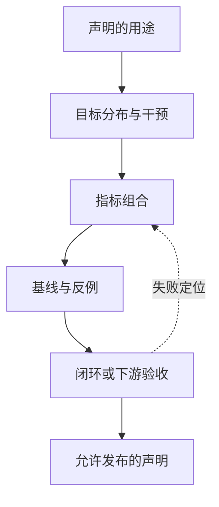

# 第9章 世界模型如何评测与失败

## 本章契约

### 核心问题

如果一个世界模型将被用于生成数据、评估策略或选择动作，我们应该测什么，才能让评测证据与实际用途一致？

### 先修知识

- 已具备：均方误差、分类指标和训练集/测试集划分的基本概念；
- 本章补齐：多步 rollout、干预、策略排序、闭环效用与模型利用；
- 不要求：3D 视觉、机器人硬件、强化学习推导或视频生成模型训练经验。

### 非目标

- 不把一个综合分数当作所有用途的通用排名；
- 不把运行大型视频指标、仿真数据集或 GPU 模型设为理解评测原则的前提；
- 不把程序化反例写成真实世界模型的经验结论；
- 不用开环视频质量替代机器人或车辆闭环安全验证。

### 学完后的可验证产出

读者应能：

1. 从模型用途反推最小评测层级；
2. 区分 one-step、multi-step、counterfactual 和 closed-loop 证据；
3. 设计至少一个能暴露动作不敏感或模型利用的反例；
4. 阅读 benchmark 时判断声明是否超出了指标能够支持的范围；
5. 为新模型填写一张可审计的 benchmark card。

## 9.1 先问用途，再选指标

“世界模型”可能指未来视频生成器、潜在动力学、策略评估器、规划器内部模型或合成数据引擎。这些对象共享预测未来的外观，却不共享同一个验收条件。

如果用途是生成可供人观看的视频，视觉质量和时间一致性是直接证据；如果用途是比较两条策略，关键证据变成策略排序是否与真实环境一致；如果用途是规划，模型还必须在候选动作造成的分布变化下保持可信。2026 年的立场论文 [How Should World Models Be Evaluated?](https://arxiv.org/abs/2606.15032) 将这种差别组织为从视觉合理性到策略优化效用的层级，并强调声明与证据错位的问题。它是 `[A,R0]` 的方法论来源，不是一个已被本书复现的经验定律。

本书采用一个更便于工程执行的五层门禁：

| 层级 | 核心问题 | 典型指标 | 能支持的声明 |
| --- | --- | --- | --- |
| E0 接口 | 输入、动作、输出和时间轴是否对齐 | shape、时序、确定性 smoke | 评测链路可运行 |
| E1 预测 | 已观测分布上的未来是否接近真值 | MSE、LPIPS、FVD、状态误差 | 指定数据上的预测质量 |
| E2 干预 | 改变动作时，预测是否随因果方向变化 | counterfactual error、action sensitivity | 模型响应候选动作 |
| E3 决策 | 模型能否正确评价或排序策略 | reward/value error、rank correlation、regret | 支持策略筛选或规划 |
| E4 闭环 | 使用模型后，真实系统是否更好且更安全 | 成功率、回报、碰撞、干预、校准 | 指定闭环协议下的效用 |

层级不是“越高就替代越低”。E4 成功仍需要 E0 保证管线没有错位，E1/E2 用来定位闭环失败原因；但只通过 E1，不能声称 E3 或 E4。



*图 9-1：从用途到可发布声明的评测链。指标不是起点；用途、分布和干预共同决定需要哪些证据。来源：本书原创，CC BY-NC 4.0，2026-08-31。*<!-- INTERNAL_ASSET_ID: FIG-09-01 -->

### 9.1.1 从问题到数字，中间还有两层

评测不能从“选哪个指标”开始。一个可解释的评测链至少包含四层：

| 层次 | 需要先回答什么 |
|---|---|
| 用途与声明 | 模型将用于展示、预测、策略筛选、规划还是数据生成？ |
| estimand | 想估计哪个总体上的什么量，例如所有尝试任务的失败率，还是成功输出条件下的误差？ |
| protocol | 如何抽样、干预、运行系统、处理缺失并形成比较单位？ |
| metric/estimator | 用什么有限样本统计量近似 estimand？ |

同一个 metric 可以服务不同 estimand，也可以因 protocol 不同而完全不可比。例如“平均第4步误差”可能指所有启动 rollout 的端到端误差，也可能只指仍然成功输出到第4步的条件误差。公式相同而分母不同，回答的已经是两个问题。

这也解释了为什么指标不能脱离目标总体解释。模型在随机视频片段上的平均质量、在规划器候选上的预测质量和在安全关键场景桶上的失败率，分别由不同抽样机制产生。除非明确给出目标总体和权重，否则一个总体平均数不会自动代表部署分布。

### 9.1.2 有效性不只有“数值是否算对”

评测至少面临三类有效性问题：

- **构念有效性**：指标是否真的测到声明中的能力，例如 FVD 是否足以代表动作可控性；
- **内部有效性**：观察到的差异能否归因于被测模型，而不是预处理、控制器、搜索预算或缺失处理；
- **外部有效性**：在当前数据、任务和平台上的结论能否推广到新场景或真实系统。

机器校验很擅长发现字段缺失和公式错误，却不能自动解决这三类问题。一个完全可复现的 benchmark 仍可能稳定地测错对象；一个闭环分数也可能因为多个组件共同变化而缺少归因能力。

## 9.2 预测指标分别看见了什么

### 像素与感知距离

MSE、PSNR 和 SSIM 对局部像素误差敏感，便于定位模糊、漂移和曝光差异，但不直接判断动作是否正确。LPIPS 使用深层特征比较感知相似度，原论文通过人类感知判断校准特征距离；它仍然不是物理一致性或控制效用指标。FVD 比较真实与生成视频特征分布，适合评估一组视频的整体差异，但会受到特征提取器、样本量、分辨率和实现细节影响。

因此，视频指标必须同时记录：实现与版本、特征网络、预处理、样本数、随机种子和置信区间。不同实现产生的同名分数不能自动横向比较。

### 概率预测：校准误差不是完整质量分数

世界模型可能输出碰撞、终止、接触或某状态转移的概率。此时只把概率阈值化成对/错，会丢掉置信度；只报告一个 calibration error，也可能把信息量和分箱选择藏起来。对二元结果 $y_i\in\{0,1\}$ 与预测概率 $p_i$，两个常用 proper loss 是：

\[
\operatorname{Brier}=\frac{1}{N}\sum_i(p_i-y_i)^2,
\qquad
\operatorname{LogLoss}=-\frac{1}{N}\sum_i[y_i\log p_i+(1-y_i)\log(1-p_i)].
\]

[Gneiting 与 Raftery](https://sites.stat.washington.edu/raftery/Research/PDF/Gneiting2007jasa.pdf)将 proper scoring rule 定义为在期望意义上鼓励报告真实预测分布，并把概率预测目标表述为在 calibration 约束下追求 sharpness `[P]`。这不等于“某个有限测试表上分数最低就证明概率正确”；模型比较仍需共同样本、分层结果与不确定性。

固定分箱的 Expected Calibration Error（ECE）常写为：

\[
\operatorname{ECE}=\sum_{b=1}^{B}\frac{|I_b|}{N}
\left|\operatorname{mean}_{i\in I_b}(p_i)-\operatorname{mean}_{i\in I_b}(y_i)\right|.
\]

[Guo et al.](https://proceedings.mlr.press/v70/guo17a.html)使用分箱可靠性图与 ECE 研究神经网络校准 `[P]`。ECE 是指定分箱与样本上的诊断，不是 proper score；bin edge、空 bin、边界归属和样本数都属于协议。下面的 实验 9-1 v4<!-- INTERNAL_ASSET_ID: EXP-09-01 v4 --> 用四个手工结果 `1,1,0,0` 比较两组概率：

| forecast | 概率 | 0.5 阈值准确率 | Brier ↓ | Log loss ↓ | 1-bin ECE | 2-bin ECE |
| --- | --- | ---: | ---: | ---: | ---: | ---: |
| uniform base rate | 0.5, 0.5, 0.5, 0.5 | 0.50 | 0.2500 | 0.6931 | 0.0000 | 0.0000 |
| informative | 0.9, 0.9, 0.1, 0.1 | 1.00 | 0.0100 | 0.1054 | 0.0000 | 0.1000 |

*表 9-1：粗分箱 ECE 负对照。单 bin 只比较整体均值 `0.5` 与整体事件率 `0.5`，因此两行都为零；所有结果均为作者构造。*<!-- INTERNAL_ASSET_ID: TAB-09-01 -->

uniform 行在这四例上只复述 base rate，预测方差为0；informative 行把正负例分开，预测方差为0.16。单 bin ECE 看不到这一差别；改成 `[0,0.5)` 与 `[0.5,1]` 两个预注册 bin 后，informative 行的经验 gap 为0.1。不能由此反过来宣称 uniform “更校准”或“更好”：四例不足以估计总体 calibration，而 ECE 单独不奖励有用的分辨率。合格报告应并列 proper score、reliability diagram/分箱定义、样本数和按 horizon/场景分桶，并在独立 calibration split 上选择任何温度或阈值，再到未参与选择的 final split 评估。

<!-- CLAIM_META: CLAIM-09-09 result -->
实验 9-1 v4<!-- INTERNAL_ASSET_ID: EXP-09-01 v4 --> 的四结果手工表中，uniform 与 informative forecast 的单 bin ECE 都为0，但 Brier loss 分别为 `0.25/0.01`、log loss 为 `0.693147/0.105361`；informative forecast 改用两个固定 bin 后 ECE 为 `0.1`。该结果只证明粗分箱 ECE 可隐藏信息差异且数值依赖分箱，不估计总体 calibration、真实事件概率、世界模型 uncertainty 或安全性。

平均 proper score 也不是完整的失败分布。v4 在同一 `y=(1,1,0,0)` 上构造 `diffuse=(0.6,0.6,0.4,0.4)` 与 `concentrated=(0.3,0.7,0.2,sqrt(0.02))`；两行四个 squared error 的总和都为0.64，因此 mean Brier 都是0.16，但误差位置不同：

| forecast | mean Brier | 0.5 threshold accuracy | 最大单例 Brier | 最大单例 log loss |
| --- | ---: | ---: | ---: | ---: |
| diffuse error | 0.16 | 1.00 | 0.16 | 0.510826 |
| concentrated error | 0.16 | 0.75 | 0.49 | 1.203973 |

*表 9-2：实验 9-1 v4 的 equal-mean-Brier 误差集中负对照。概率按构造给出，不是模型输出或总体 tail estimate。*<!-- INTERNAL_ASSET_ID: TAB-09-02 -->

<!-- CLAIM_META: CLAIM-09-10 result -->
固定四 outcome 表中，diffuse 与 concentrated forecast 的 mean Brier 都为0.16；前者0.5阈值准确率为1且最大单例 log loss 为0.510826，后者准确率为0.75且最大单例 log loss 为1.203973。该结果只证明相同平均 Brier 不能恢复误差是否集中在单个样本，不估计总体概率质量、tail risk、calibration、真实事件严重度或安全性。

### one-step 与 multi-step

one-step 预测持续从真实历史出发，回答的是“在真值上下文中预测下一步”。规划时的 rollout 会把模型自己的输出重新作为输入，误差和分布偏移会逐步累积。至少应画出误差随 horizon 变化的曲线，而不是只报告最后一步平均值：

\[
E(h)=\frac{1}{N}\sum_{i=1}^{N} d\!\left(\hat{s}^{(i)}_{t+h},s^{(i)}_{t+h}\right)
\]

其中 `h` 是 rollout 长度，`d` 必须按用途选择：可以是像素距离、对象状态误差、碰撞状态错误或奖励误差。不同 horizon 的有效样本数也要一起报告，避免长序列因过滤失败样本而显得更好。

“模型没有输出”不是一个可以直接从均值里删除的普通数值。视频生成中断、状态变为非有限值或解码器崩溃时，应在运行前选择并登记一种语义：整次运行技术无效、该 rollout 计为任务失败，或只估计“仍能输出的 rollout”这一条件总体。若采用失败惩罚，惩罚值和单位必须预注册；它用于把失败纳入固定分母，不是一个通用的真实误差估计。无论采用哪种语义，都要同时报告 attempted count、available count、coverage 和失败原因。

### latent probing

潜在状态不一定能够解码出漂亮视频，但可能保存速度、接触、可达性或奖励等决策变量。线性 probing 能回答“这些变量是否容易从表示中读出”，却不能证明策略实际使用了它们，也不能证明干预动作后的潜在转移正确。probe 是诊断工具，不是闭环验收。

### 聚合方式本身就是价值判断

设不同场景桶的误差为 $E_g$，整体指标常写成 $\sum_g w_gE_g$。权重 $w_g$ 不是无关紧要的实现细节：按帧 micro-average 会让长视频和常见直道占据更多权重；按 episode 平均赋予每段轨迹相同权重；按场景 macro-average 则让稀有桶与常见桶拥有相近影响。三者都可能合理，但对应不同 estimand。

平均数还会丢失误差发生的位置和严重度。对规划而言，远离任何障碍物的 20 cm 误差与制动边界附近的 20 cm 误差不是同一种后果。合格报告应同时保留总体摘要、关键场景分桶、样本量、coverage 与尾部，而不是期待一个更复杂的综合分数恢复所有信息。

时间聚合也有同样问题。对每个 horizon 独立平均可以观察误差增长，却可能因长时样本逐渐缺失而改变样本总体；先对每条轨迹汇总再跨轨迹平均，则需要声明提前终止和不同长度如何处理。评测者必须先冻结单位与分母，再解释曲线。

## 9.3 动作条件模型必须接受干预测试

若模型声称支持规划，评测集就不能只回放数据中实际发生的动作。需要在同一状态下改变候选动作，检查预测是否产生方向正确、幅度合理且不确定性可解释的变化：

\[
\Delta(a_i,a_j)=d\!\left(\hat{s}_{t+1}(a_i),\hat{s}_{t+1}(a_j)\right)
\]

$\Delta$ 很小可能意味着模型忽略动作；$\Delta$ 很大也不保证正确，因为模型可能对 OOD 动作产生任意变化。应把动作覆盖划分为训练分布内、边界附近和分布外三组，并分别报告误差、校准和失败率。

<!-- CLAIM_META: CLAIM-09-02 recommendation -->
凡是用于规划或策略评估的模型，至少应通过 E2 干预门禁；只有观察数据上的平均预测误差不足以支撑决策用途。

### 9.3.1 反事实通常没有现成真值

在真实日志中，同一时刻只执行了一个动作。我们能观察“实际动作之后发生了什么”，却不能同时观察“若换成另一个动作会怎样”。因此，简单地把日志动作替换后送入模型，只能测 action sensitivity；没有可信对照时，不能测反事实预测是否正确。

反事实真值可以来自可重置仿真器、重复性足够的受控实验、已知动力学，或带强假设的因果估计。每种来源都有边界：仿真器可能遗漏真实物理，重复实验无法完全固定外界参与者，因果估计依赖可交换性与覆盖假设。评测报告应把“模型对动作有反应”和“反应符合真实后果”分成两个门。

动作干预还必须保持其他条件不变。若换动作的同时换了场景、初始状态或随机种子，结果差异不能只归因于动作。随机环境中更适合使用共同随机数、成对场景或显式分布比较，并报告动作不在数据支持域时的拒绝语义。

## 9.4 从状态误差到策略排序

策略评估器不一定需要逐像素精确，但必须保持决策相关量的顺序。对一组策略 $\pi_1,\ldots,\pi_k$，可以比较模型预测回报与真实环境回报的 Spearman 或 Kendall 排序相关，并报告：

- 最优策略是否被正确选出；
- top-k 召回率；
- 选中策略相对真实最优策略的 regret；
- 不同任务、初始状态和 horizon 下的置信区间；
- 当模型不确定时，拒绝评估是否减少错误选择。

平均 reward error 可能很小，却刚好颠倒两个候选策略；反过来，一个有固定偏差的模型仍可能保留正确排序。指标必须匹配“估值”还是“选策略”这一实际任务。

策略排序把预测评测转成了一个决策问题，但排序相关性仍不是全部。若十个明显较差的策略顺序正确、两个头部策略顺序颠倒，整体相关性可能很高，实际选择却失败；反之，尾部排序混乱但最优策略稳定识别，可能不影响当前筛选用途。因此应同时报告全局排序、top-k 行为、选中策略 regret 和置信重叠。

模型的决策价值还取决于搜索器如何查询它。固定策略集上的排序只覆盖预先给出的候选，而规划器会主动生成新候选，并倾向访问模型最乐观的区域。E3 评测应尽量复现实际候选生成机制，或明确把结论限定为离线策略筛选，不能从固定列表直接外推到在线优化。

## 9.5 一个指标排序反转（实验 9-1<!-- INTERNAL_ASSET_ID: EXP-09-01 -->）

本章提供两个手工构造的一维预测器：

- `action_blind`：直接复制当前状态，因测试数据大多是零动作而获得较低 one-step RMSE，但完全忽略候选动作；
- `action_faithful_biased`：保留动作造成的状态变化，同时加入固定偏差，因此像素类比下的预测误差更高。

运行命令：

<details markdown="1">
<summary>可选：验证本章证据</summary>

```bash
make ch09-smoke-local
make ch09-test-local
make ch09-smoke
```

</details>

固定程序化 fixture 的第一个反例输出为：

| 预测器 | one-step RMSE ↓ | action sensitivity ↑ | 闭环成功率 ↑ | 平均终点距离 ↓ |
| --- | ---: | ---: | ---: | ---: |
| action-blind | **0.05774** | 0.00 | 0% | 2.00 |
| action-faithful-biased | 0.12000 | **0.20** | **100%** | **0.10** |

*表 9-3：实验 9-1 的 one-step—干预—闭环排序反转。action sensitivity 是同一状态下三个候选动作预测值的极差。*<!-- INTERNAL_ASSET_ID: TAB-09-03 -->

<!-- CLAIM_META: CLAIM-09-01 result -->
在 实验 9-1<!-- INTERNAL_ASSET_ID: EXP-09-01 --> 的固定 fixture 中，one-step RMSE 与闭环成功率给出了相反的模型排序；这只构成指标错位反例，不证明真实世界模型必然发生同一排序反转。

这项结果只证明排序反转在逻辑上可以发生。它使用两个确定性函数、两个目标和一维动力学，不能估计这种现象在真实世界模型中的频率，也不能证明所有感知指标与控制性能负相关。它的作用是给评测代码建立一个必须能识别的反例。

第二个反例固定三条 stable rollout 和三条 fragile rollout。fragile 只剩一条能够到达第 4 步；若直接对幸存输出求均值，它以 0.40 看似优于 stable 的 0.80。协议预先把缺失 rollout 记为误差 2.0 后，固定分母均值变为 1.4667，排序反转：

| 系统 | 第4步 attempted / available | coverage | 幸存样本均值 ↓ | 固定分母均值 ↓ |
| --- | ---: | ---: | ---: | ---: |
| stable | 3 / 3 | 1.000 | 0.8000 | **0.8000** |
| fragile | 3 / 1 | 0.333 | **0.4000** | 1.4667 |

*表 9-4：实验 9-1 的长时缺失分母反例。缺失惩罚 2.0 是本 fixture 的预注册失败语义，不是推荐给其他任务的通用常数。*<!-- INTERNAL_ASSET_ID: TAB-09-04 -->

<!-- CLAIM_META: CLAIM-09-08 result -->
在 实验 9-1<!-- INTERNAL_ASSET_ID: EXP-09-01 --> 的固定三 rollout 反例中，available-case 聚合选择 fragile，而预注册缺失惩罚的固定分母聚合选择 stable。该结果证明分母语义可以改变排序，不估计真实模型崩溃率，也不证明任意惩罚值都合理。

## 9.6 WorldArena：同时测感知与功能，但不要抹平任务边界

[WorldArena 官方仓库快照 `2da2ae2`](https://github.com/tsinghua-fib-lab/WorldArena/tree/2da2ae253b8637ba9de3afc7bea4e087f778ee4d) 将评测分为视频感知质量、合成数据、策略评估、动作规划与人工评价，并使用 RoboTwin 2.0 的 Clean-50 仿真子集。官方说明的视频质量部分包含多个维度和指标，功能部分则面向不同下游用途；这里按官方资产与部分公开复现材料记为 `[O,R1]`。
<!-- CLAIM_META: CLAIM-09-03 fact -->
该 WorldArena 快照的设计把感知质量与功能用途分开，而不是假设一个视频分数能够代表全部能力。

本书当前没有下载其数据、运行官方命令或核对排行榜结果，因此不能标记为 `R2` 或本书复现。使用时还应锁定仓库 commit、测试集发布日期、RoboTwin 版本、所选 track 与外部模型/API；不能把 v1、后续版本或在线 Arena 的覆盖范围混成一个稳定结论。

2026 年的 [WorldArena 2.0](https://arxiv.org/abs/2605.17912) 又把范围扩展到更多生成模态、功能用途和平台。这里最值得吸收的不是“项目更新了”，而是评测对象必须写成 `模型版本 × 输入输出模态 × 下游用途 × 执行平台 × 协议版本`；只写 WorldArena 分数已经不足以定位证据。截至 2026-09-01，arXiv 一手元数据只显示 2026-05-18 提交的 v1，没有列出已接收场次，因此论文按 `[A]` 而不是 `[P]`；官方项目资产另记 `[O,R1]`。本书不抄录可能漂移的排行榜数字。

[KineBench](https://arxiv.org/abs/2607.19876) 则从另一侧暴露闭环归因问题：若评测需要额外 inverse dynamics model 把生成状态转回动作，最终结果会同时包含世界模型和逆动力学模型的误差。该论文提出直接以运动学落地的闭环协议，并报告 ManiSkill3 任务上的多个泛化分组；arXiv 元数据明确标注已接收 ECCV 2026，本书只核对论文而未运行资产，因此记为 `[P,R0]`。
<!-- CLAIM_META: CLAIM-09-05 inference -->
闭环评测应把额外控制器、逆动力学模型和动作落地层登记为独立组件；否则不能把端到端成败全部归因于被测世界模型。本书尚未运行 KineBench，也不把论文中的任务数或结果当作本书测量。

## 9.7 幻觉、覆盖缺口与模型利用

世界模型的幻觉不一定表现为明显破图。画面可以连贯，动力学却已偏离真实环境。2026 年预印本 [Hallucination in World Models is Predictable and Preventable](https://arxiv.org/abs/2606.27326) 报告了特定数据与模型条件下的三类失败，并将失败与状态—动作覆盖缺口联系起来。这里将它标为 `[A,R0]` 案例：论文支持“在其设置中观察到并预测了这些失败”，不支持“所有世界模型幻觉都只有同一个原因”。

评测协议至少应主动寻找：

- **复合误差**：rollout 越长，状态逐步漂移；
- **动作边缘化**：视频随时间变化，却对不同动作反应近似相同；
- **场景分叉**：对象身份、数量、接触关系或拓扑突然改变；
- **遗漏变量**：纹理逼真，但速度、深度、接触或终止状态错误；
- **模型利用**：规划器反复选择模型虚构的高回报区域；
- **错误置信度**：OOD 时输出很确定，却没有拒绝或安全降级。

随机测试常常找不到规划器最容易利用的错误。更有效的方法是让规划器对模型做压力搜索，再把选出的动作序列送回真实仿真器或保留集验证。

### 9.7.1 OOD 分数要用选择性风险评测

OOD AUROC 回答分数能否把两个冻结总体排序，却没有直接回答“执行多少、留下多少失败”。对会拒绝或降级的系统，还应扫描阈值并报告：coverage、接受样本 risk、危险失败被拒绝的 recall、误拒绝成本，以及 fallback 后的最终任务/安全结果。第21章给出可执行定义和 实验 21-1<!-- INTERNAL_ASSET_ID: EXP-21-01 --> 手工反例。

阈值必须在 calibration split 上选择，再在未参与调参的 ID、shift、OOD/stress 和不同严重度分桶上冻结评估。若没有接受样本，selective risk 未定义；若分数只在合成 OOD 上有效，也不能宣称覆盖真实未知。一个 estimator 还可能把常见失败排在低不确定性端，因此“coverage 降低”不保证 risk 单调改善。

第5章 实验 5-1<!-- INTERNAL_ASSET_ID: EXP-05-01 --> 的 correlated-error 负对照给出最小实例：三个成员对 OOD target 同时错 4，却因预测完全相同而得到 range 0。评测不能只统计“高分歧 OOD 被拒绝多少”，还要报告低分歧高损失 false negative、按 shift 类型/严重度分桶，并检查成员是否共享训练数据捷径、架构盲点或 simulator bias。

<!-- CLAIM_META: CLAIM-09-06 recommendation -->
用于动作拒绝的 uncertainty/OOD score 应报告完整 risk–coverage 关系、预注册工作点、分桶失败捕获率与 fallback 后果，并保存分数方向、估计器版本和校准数据；单一 AUROC 或拒绝率不能替代部署用途证据。

### 9.7.2 压力测试不是部署频率估计

对抗搜索、稀有场景生成和极端参数扫描的目标是暴露失效边界，而不是估计这些事件在真实部署中的自然频率。压力集中采样得到的“失败率”受生成器分布支配，不能与道路里程上的事件率直接比较。

因此应把两类问题分开：代表性评测估计目标分布上的平均或分桶表现，压力评测寻找系统在哪些条件下失效。前者要求抽样框和权重可信，后者要求覆盖维度、搜索预算和失败去重清楚。压力测试发现一个反例足以否定“从不失败”，却不足以估计“多久失败一次”。

**杯子任务。** 一段生成视频看起来更清晰，只能加强 E1 的观测预测证据；它可能仍在替换“左移夹爪”和“右移夹爪”后生成同一未来，因而过不了 E2。若模型能对动作作方向正确的响应，还要检查它能否在 E3 正确排序候选抓取，并最终在未参与选择的对象和初态上以 E4 闭环成功率、掉落率和安全干预率验收。漂亮视频、动作敏感、候选排序和真实抓取改善是四个递进问题，不能用其中一个替代其余三个。

## 9.8 自动驾驶：开环分数不能替代闭环安全证据

自动驾驶视频预测可以用图像质量、轨迹误差和对象一致性做开环诊断，但车辆最终执行的是转向、制动和加速。相同的平均轨迹误差，可能分别发生在空旷直道和行人横穿时；安全含义完全不同。

一个最低限度的驾驶评测矩阵应包含：

| 维度 | 开环诊断 | 闭环或功能指标 |
| --- | --- | --- |
| 感知与预测 | 图像/特征距离、轨迹 ADE/FDE、对象持续性 | 感知错误引发的规划变化 |
| 动作响应 | 不同转向/制动下的 counterfactual 轨迹 | 动作可执行性、控制稳定性 |
| 任务完成 | 预测路线与真值差异 | 路线完成率、进度、超时 |
| 安全 | 碰撞/越界状态预测误差 | 碰撞率、交通规则违规、人工接管 |
| 舒适性 | 加速度与曲率预测误差 | jerk、急刹和横向加速度 |
| 稀有事件 | 场景覆盖与条件命中率 | 各场景桶的失败率和置信区间 |

<!-- CLAIM_META: CLAIM-09-04 inference -->
如果模型用于驾驶规划，闭环路线完成和安全指标比单独的视频质量更接近部署用途；但仿真闭环仍不能替代真实车辆安全验证。正文后续默认用 MetaDrive 做 S/M 档决策评测，CARLA 仅作为 L2 高保真扩展，不要求读者购买硬件。

闭环也不是一个不可再分的“最终真值”。世界模型、状态估计、规划器、低层控制器、安全网关和仿真器共同产生结果。只替换世界模型并冻结其他组件，有助于估计其增量作用；整套系统同时变化，更接近产品比较，却无法把差异单独归因给模型。两种设计回答不同问题。

仿真闭环还受 simulator validity 限制。车辆动力学、交通参与者行为、传感器噪声和碰撞判定若与目标环境不符，系统可能学会或利用仿真器特性。应把仿真中的因果归因、跨仿真器稳健性和真实系统外部有效性分层陈述，而不是把“闭环”自动升级为“真实安全”。

## 9.9 benchmark card：让结果能够被审计

Benchmark card 不是结果表，也不是 `experiment-card.json` 的改名版本。三者分别回答不同问题：

| 资产 | 冻结什么 | 何时变化 |
| --- | --- | --- |
| benchmark card | 用途、允许/禁止声明、系统角色、数据划分、指标、统计与退出协议 | 比较问题或协议发生实质变化时升版本 |
| experiment card | 某次运行的 benchmark ID、代码/checkpoint、数据版本、环境、命令、资源和产物 | 每次独立运行或复现都可新增 |
| result artifact | 按冻结协议得到的原始/汇总测量值和运行状态 | 每次执行生成，不反向改协议 |

机器卡至少保存以下字段：

```text
purpose + allowed_claims + forbidden_claims
systems[]: role + revision + inputs/outputs + preprocessing
datasets[]: version + license + split + unit + grouping + leakage controls
protocol: comparison unit + sample count + seeds + horizon + timing + termination
metrics[]: layer + role + direction + unit + aggregation + implementation/version + statistical uncertainty
distribution_shift: score direction + estimator version + calibration + threshold + risk–coverage + fallback
reporting: disaggregation + raw predictions + failures + confounders + missing-value policy
resources + experiment_ids + artifacts + limitations
```

仓库中的 `specs/benchmark-card.schema.json` 是 Draft 2020-12 Schema；`benchmarks/BENCH-06-01.json`、`BENCH-09-01.json` 和 `BENCH-20-01.json` 分别覆盖 prior/posterior 与 KL 路由算术、指标排序/概率质量反转，以及闭环比例/配对/暴露统计。严格检查还验证 claim/experiment 的章节归属、benchmark 与 experiment 双向引用、metric layer、ID 前缀、产物路径、系统名唯一性和下载量总和。它能阻止字段缺失和跨资产漂移，不能判断指标是否科学充分，也不能替代领域评审。

基准测试 9-1 v4<!-- INTERNAL_ASSET_ID: BENCH-09-01 v4 --> 明确把 E1 的 12 个 one-step 转移、6 条多步误差行与4行二元概率表、E2 action sensitivity、E4 的两个闭环 episode 分开，固定 4/24 步 horizon、动作集合、tie-breaking、失败阈值、缺失惩罚与概率 bin edge，并禁止把手工反例外推到 learned world model、机器人、车辆、OOD 或安全表现。概率表只是评分机制 fixture，不是 learned uncertainty estimator、calibration split 或 OOD 总体，因此 `distribution_shift.enabled=false`；不能为了让卡片“完整”而虚构风险曲线。

<!-- CLAIM_META: CLAIM-09-07 recommendation -->
可审计比较应在运行前冻结 benchmark card，并把评测协议、单次运行来源和测量结果拆成可互相引用的资产；机器 Schema 只证明结构与追溯关系成立，不证明 benchmark 有外部效度。

综合分数可用于浏览排行榜，但发布时必须保留分项结果。权重会把价值判断藏进公式：一个重视视觉质量的综合分数，不适合直接选择安全关键规划器。

benchmark card 还应记录**决策冻结顺序**。场景桶、主指标、缺失规则、阈值和停止条件若在看到结果后才确定，就会把研究者自由度隐藏在最终数字中。探索阶段可以调整协议，但进入确认性比较前，应升版本并冻结；任何事后分析都应明确标为 exploratory，而不是与预注册主结果混写。

同时要区分统计不确定性和系统性偏差。增加 episode 数量可以缩小抽样区间，却无法修复错误的传感器标定、仿真器共同偏差或遗漏场景。窄置信区间表示对当前 estimand 估计稳定，不表示 estimand 本身就代表部署问题。

## 9.10 结果、证据与适用边界

| 类型 | 声明/结果 | 来源或实验 ID | 状态 | 限制 |
| --- | --- | --- | --- | --- |
| 本书结果 | one-step/闭环与缺失分母分别造成排序反转 | 实验 9-1<!-- INTERNAL_ASSET_ID: EXP-09-01 --> | CPU smoke | 手工一维反例与预注册惩罚 |
| 本书结果 | 单 bin ECE 同为0，但 Brier 为 `0.25/0.01` | 实验 9-1<!-- INTERNAL_ASSET_ID: EXP-09-01 --> | CPU smoke | 四个手工二元结果；不估计总体校准 |
| 外部事实 | WorldArena 分开评估感知与功能用途 | 官方仓库 | `[O,R1]` | 本书未运行 |
| 外部案例 | WorldArena 2.0 扩展模态、用途与平台维度 | 论文/官方项目 | `[P/O,R0–R1]` | 接口与排行榜会变化 |
| 外部案例 | KineBench 显式移除额外逆动力学模型（inverse dynamics model, IDM）的归因混淆 | arXiv:2607.19876 | `[P,R0]` | 本书未运行，仅限论文设置 |
| 外部案例 | 幻觉与覆盖缺口可被量化关联 | arXiv:2606.27326 | `[A,R0]` | 仅限论文设置 |
| 方法建议 | 决策用途至少需要干预与功能评测 | 本章综合 | recommendation | 尚无单一通用协议 |
| 方法建议 | OOD 执行门报告 risk–coverage 与 fallback 后果 | 本章/第21章 | recommendation | 分数本身可能失准 |
| 协议资产 | 三张机器可读 benchmark card 通过 Schema 与跨资产检查 | 基准测试 6-1/09-01/20-01 | executed fixture | 结构有效不等于科学有效 |

### 资源、数据与许可

实验 9-1<!-- INTERNAL_ASSET_ID: EXP-09-01 --> 使用 Python 标准库、MIT 程序化 fixture、CPU 和 0 字节下载；不需要 GPU。WorldArena、视频指标和仿真评测属于可选 M 档证据路径，执行前需单独核验下载量、依赖、数据许可和资源。本书报告的结果不包含 GPU、大数据或真实车辆实验。

## 9.11 小结

世界模型没有脱离用途的“最好指标”。评测应从用途与允许声明出发，先定义目标总体和 estimand，再冻结抽样、干预、分母与缺失语义，最后选择 metric 和 estimator。公式算对只解决了最末一层，不能自动保证构念、内部或外部有效性。

感知质量回答生成内容是否像，概率评测需要同时观察 proper score、calibration、sharpness 与误差分布，干预测试则必须区分“对动作有反应”和“反事实方向正确”。策略排序更接近决策用途，但还要检查头部选择、regret 和规划器实际查询的候选分布。

聚合权重决定谁在总体分数中发言：按帧、按 episode、按场景或按严重度会形成不同结论。总体均值必须与关键分桶、coverage、失败分母和尾部信息并列。压力测试用于发现边界，不直接估计部署频率。

闭环证据最接近系统用途，却仍由模型、规划器、控制器、安全层和环境共同产生，也仍受仿真器外部有效性限制。可审计 benchmark 的价值，在于让这些作用域、混淆因素和冻结顺序可见；它不能把有限协议变成普遍安全证明。

## 练习

1. **概念判断**：一个模型 FVD 更低，但策略排序相关性更差。若用途分别是视频展示和动作规划，应如何选择？
2. **代码实验**：修改 实验 9-1<!-- INTERNAL_ASSET_ID: EXP-09-01 --> 的动作分布，让非零动作占比逐渐升高，先判断两个预测器的 one-step 排名能否翻转；若不能，推导还需改变哪个量并验证临界点。
3. **分母审计**：分别把 fragile rollout 的缺失处理为运行无效、任务失败和条件于幸存输出，写出三种 estimand 及允许声明。
4. **协议设计**：复制 基准测试 9-1<!-- INTERNAL_ASSET_ID: BENCH-09-01 --> 为一个抓取视频世界模型填写 benchmark card，分别给出 E1、E2 和 E4 的退出条件；若使用随机任务，说明 seed、group split 和置信区间方法。
5. **自动驾驶迁移**：设计一个平均 ADE 很低却高风险的驾驶数据分布，说明需要增加哪些分桶指标。
6. **反例审查**：解释为何“闭环成功率高”仍可能掩盖安全问题，并给出至少两个补充指标。
7. **概率评分**：为同一组碰撞事件概率同时计算 Brier、log loss 与两种分箱 ECE；说明哪些设置必须在看结果前冻结，以及为什么 ECE=0 仍不充分。
8. **误差集中**：复算 表 9-2<!-- INTERNAL_ASSET_ID: TAB-09-02 --> 的逐行 squared/log loss，解释为什么相同 mean Brier 仍需保存逐样本与场景分桶。

## 自检要点

评测答案必须先写用途和 estimand，再写指标与分母。低层指标不能自动替代动作干预、策略排序或外部闭环证据。

<details markdown="1">
<summary>自检 9-1：展示用途与规划用途</summary>

视频展示优先检查感知质量、时间一致性和人评，可在预先声明的展示分布上偏向 FVD 更低者，但仍需防 cherry-pick。动作规划应优先选择能保持动作响应与策略排序的模型；排序相关性更差的低 FVD 模型不能仅凭画面质量进入 planner。两种用途可以选择不同模型，也可以用生成头负责展示、决策 latent 负责规划；发布时分别限定 E1 展示声明与 E2/E3/E4 决策声明。

</details>

<details markdown="1">
<summary>自检 9-2：动作占比与排名临界点</summary>

当前非零动作幅度为 $a=0.1$。若其占比为 `p`，action-blind 的 RMSE 为 $a\sqrt{p}$，action-faithful-biased 的误差恒为 0.12；翻转要求 $p>(0.12/a)^2=1.44$，不可能。因此只提高占比不会翻转，这正是应先发现的边界。若把非零幅度改为 $a>0.12$，临界占比为 $p^*=(0.12/a)^2$；例如 $a=0.2$ 时 $p^*=0.36$，打平时还需预先声明 tie rule。代码应扫描整数样本可实现的 p，并与解析阈值的离散邻点核对。

</details>

<details markdown="1">
<summary>自检 9-3：缺失 rollout 的三个 estimand</summary>

若缺失视为运行无效，estimand 是“满足预注册有效性条件的完整 runs 上的性能”，整次 run 排除并报告 invalid rate，不能称 attempted-run 性能。若缺失视为任务失败，estimand 是“所有 attempted tasks 的端到端性能”，缺失进入固定分母并用预注册 failure score/事件计数。若条件于幸存输出，estimand 是“仍能产生有效预测的 rollout 在 horizon h 的误差”，必须同时报告 coverage，声明不能外推到所有任务或比较稳定性。三者不能在看完排名后再选。

</details>

<details markdown="1">
<summary>自检 9-4：抓取 benchmark card</summary>

E1 可冻结对象/相机 group test split，要求多 horizon pose/keypoint error 的 CI 上界低于阈值且 coverage 达标；E2 固定同一前缀替换 grasp action，要求预测接触点/物体位移方向与 simulator counterfactual 一致，并设 sensitivity 下限与错误方向上限；E4 在未参与选择的对象组执行闭环，要求成功率 CI 下界、碰撞/掉落 CI 上界和 intervention 阈值同时通过。随机任务保存 master seed、每 episode seed 与生成器版本；同一对象资产及派生纹理只进一个 group；二项率用预注册 Wilson 或 bootstrap-by-group 区间，连续指标按独立 group cluster bootstrap，禁止按 frame 当独立样本。

</details>

<details markdown="1">
<summary>自检 9-5：低平均 ADE 的高风险分布</summary>

例如 99% 直道常见帧 ADE 为 0.05 m，1% 行人横穿/高速 cut-in 的 ADE 为 3 m，总平均仍约 0.0795 m，却把风险集中在关键事件。至少按交互类型、TTC、速度、遮挡、天气/光照和预测 horizon 分桶，分别报告 ADE/FDE、miss rate、碰撞或轨迹重叠率、最坏分位/下尾与每桶样本数/coverage。切分应按 scenario group 隔离，稀有桶需置信区间；不能用大量静态帧 micro average 稀释风险。

</details>

<details markdown="1">
<summary>自检 9-6：高成功率隐藏的安全问题</summary>

成功率只看是否最终完成，可能把一次险些碰撞、频繁急刹、越界后恢复或依赖安全员接管的 episode 仍记为成功，也可能被大量简单场景主导。至少补充碰撞/接触率与独立网关干预率；驾驶还应报告最小 TTC/阈值违例、规则违规、jerk/急减速和严重度分层，机器人可报力/力矩超限、掉落和 near-miss。所有指标都要有 attempted episode 分母、场景分桶和区间，不能只在成功子集上统计。

</details>

<details markdown="1">
<summary>自检 9-7：概率质量不能压成一个 ECE</summary>

先固定共同 event definition、样本总体、概率方向、bin edges、边界归属和空 bin 政策。Brier 与 log loss 在同一结果表上评价完整概率；log loss 对接近0/1的错误更敏感，不能事后裁剪而不登记。ECE 还要给 reliability diagram、每 bin 样本数与置信区间，并报告不同合理分箱或自适应估计的敏感性，但不能看完后只选最小值。实验 9-1<!-- INTERNAL_ASSET_ID: EXP-09-01 --> 的单 bin ECE=0 只说明整体 mean probability 等于 event rate；恒定 base-rate forecast 没有区分样本。概率经 calibration split 调温后，应在独立 final split 按 horizon、场景与严重度重新报告，并把概率质量与实际阈值决策、fallback 后果分开。

</details>

<details markdown="1">
<summary>自检 9-8：相同 mean Brier 不等于相同失败形状</summary>

diffuse 行四个概率误差绝对值都是0.4，所以 squared error 都是0.16；concentrated 行误差为 $0.7,0.3,0.2,\sqrt{0.02}$，平方和同样是0.64，mean Brier 仍为0.16。但 concentrated 第一行把正例报成0.3，造成一次0.5阈值错误，单例 Brier 0.49、log loss `-log(0.3)=1.203973`。合格答案要保留逐样本 loss、事件/场景分桶和最大/尾部摘要，同时说明四行最大值不是总体 tail-risk 估计。

</details>

## 延伸阅读

- Yu et al., [How Should World Models Be Evaluated?](https://arxiv.org/abs/2606.15032)，`[A,R0]`，评测层级与声明错位；
- Shang et al., [WorldArena 官方仓库快照 `2da2ae2`](https://github.com/tsinghua-fib-lab/WorldArena/tree/2da2ae253b8637ba9de3afc7bea4e087f778ee4d)，`[O,R1]`，感知与功能评测案例；
- [WorldArena 2.0](https://arxiv.org/abs/2605.17912) 与[官方项目页](https://v2.world-arena.ai/)，`[A/O,R0–R1]`，多模态、多用途和多平台评测案例；
- [KineBench](https://arxiv.org/abs/2607.19876)，`[P,R0]`，避免额外 inverse dynamics model 混淆的闭环评测案例；
- Geifman & El-Yaniv, [Selective Classification for Deep Neural Networks](https://arxiv.org/abs/1705.08500)，`[P]`，risk–coverage 基础；
- Gneiting & Raftery, [Strictly Proper Scoring Rules, Prediction, and Estimation](https://sites.stat.washington.edu/raftery/Research/PDF/Gneiting2007jasa.pdf)，`[P]`，proper score、calibration 与 sharpness；
- Guo et al., [On Calibration of Modern Neural Networks](https://proceedings.mlr.press/v70/guo17a.html)，`[P]`，reliability diagram、ECE 与神经网络校准；
- Traub et al., [Overcoming Common Flaws in the Evaluation of Selective Classification Systems](https://arxiv.org/abs/2407.01032)，`[P]`，选择性评测常见指标缺陷；
- Hansen & Wang, [Hallucination in World Models is Predictable and Preventable](https://arxiv.org/abs/2606.27326)，`[A,R0]`，特定设置下的幻觉量化案例；
- Zhang et al., [The Unreasonable Effectiveness of Deep Features as a Perceptual Metric](https://arxiv.org/abs/1801.03924)，`[P]`，LPIPS；
- Unterthiner et al., [Towards Accurate Generative Models of Video](https://arxiv.org/abs/1812.01717)，`[A]`，FVD。

## 下一章接口

第10章将讨论不直接重建像素的预测表征。届时，本章的 E1 latent probing、E2 动作敏感性和 E3 下游效用将用于判断：一个表征虽然不生成漂亮视频，是否仍保留了决策所需的信息。
