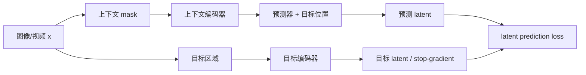

# 第10章 非生成式预测表示：从 I-JEPA 到 V-JEPA 2.x

> 状态：`reviewed`
> 资料核查日期：2026-09-01
> 关联实验：`EXP-10-01`
> 关联声明：`CLAIM-10-01`～`CLAIM-10-07`
> 关联图表：`FIG-10-01` / `TAB-10-01` / `TAB-10-02` / `TAB-10-03`
> 资源档位：S / M
> GPU 状态：待验证

## 本章契约

### 核心问题

如果模型不重建像素，而是在潜在空间预测被遮挡图像或未来视频的表示，我们如何判断它保留了哪些物理与决策信息，又遗漏了什么？

### 先修知识

- 已具备：Transformer/ViT、特征提取和监督评测；
- 本章复用：第6章的潜在状态、第9章的 E1 probing 与下游效用；
- 本章补齐：JEPA、目标编码器、masking、特征预测和冻结 probe；
- 不要求：3D 视觉、JEPA 预训练、Ego4D/EPIC-KITCHENS 下载或 GPU。

第5章已建立 VAE/token、自回归、masked、diffusion 与 flow 的共同分布合同；本章只处理“不要求像素生成”的表示预测，并以 probe 和下游用途检查被忽略的信息。

### 非目标

- 不把 JEPA 定义为唯一正确的世界模型；
- 不把分类或线性 probe 分数直接解释为物理理解、规划或安全；
- 不在当前无 GPU 设备上下载官方大型 checkpoint 或第一人称完整视频；
- 不把手工标量 fixture 写成 I-JEPA/V-JEPA 的实测结果。

### 学完后的可验证产出

读者应能画出 JEPA 训练数据流，区分像素、全局和 dense 表征，设计带负对照与分布偏移的 probe，并为官方 V-JEPA 2.x 推理编写资源与许可预检清单。

## 10.1 为什么不预测每个像素

像素未来包含大量难以预测、但未必影响任务的细节：纹理、反光、背景运动和多个合理结果。逐像素损失可能把容量用于这些细节；完全丢掉细节又可能删除深度边界、接触和小障碍物。问题不在“像素一定无用”，而在表示应该为声明的下游用途保留什么。

联合嵌入预测架构（Joint-Embedding Predictive Architecture, JEPA）不要求从 latent 解码原始像素。它让上下文编码器读取可见区域，预测器根据上下文和目标位置预测目标编码器产生的 latent 表示。



*FIG-10-01：JEPA 的最小训练数据流。目标编码器分支不由预测误差直接反向更新，具体更新与 masking 方案取决于实现。来源：本书原创，MIT，2026-08-31。*

一个抽象目标是：

\[
\mathcal{L}_{JEPA}=\frac{1}{|M|}\sum_{i\in M}d\left(p_\theta(f_\theta(x_{context}),i),\operatorname{sg}(f_{target}(x)_i)\right),
\]

其中 `M` 是目标 token，`i` 携带目标位置，`sg` 表示停止梯度。距离、归一化、目标编码器更新和 mask 形状都属于实验定义，不能只写“feature loss”。

`CLAIM-10-01`（fact）：JEPA 类方法预测目标区域的表示而不是直接重建其像素；这改变了训练目标，但不自动证明表示包含全部任务相关状态。

## 10.2 I-JEPA：上下文预测图像目标块

I-JEPA 在单张图像中从较大上下文块预测多个目标块的表示。mask 的空间尺度会改变任务：太局部可能依靠纹理插值，太大则要求对象和场景级推断。目标位置编码告诉预测器“预测哪里”，而目标编码器提供学习中的表示空间。

防止表示坍塌不能只靠删除像素解码器。实现还依赖停止梯度、目标编码器更新、预测器容量、归一化与数据增强等设计。若所有输入映射到常数，latent loss 可能看起来稳定，但表示不再区分状态。因此 probe 必须包含常数特征或打乱标签等负对照。

I-JEPA 原论文与官方仓库是 `[A/O,R1]` 资料；本书没有运行其训练或 checkpoint，不能把论文表格改写成本书结果。

## 10.3 从 V-JEPA 到动作条件模型

视频 JEPA 把 mask 扩展到时间和空间，要求上下文编码器保留运动与事件信息。V-JEPA 的特征预测仍不等同未来像素生成：它可以在 latent 中预测变化，而不给出可观看视频，也可能忽略表示空间没有编码的细节。

V-JEPA 2 的官方论文和仓库把流程分为两部分：先用大规模图像/视频做无动作自监督预训练，再用机器人轨迹后训练动作条件预测器 V-JEPA 2-AC。论文报告后者使用少于 62 小时 DROID 机器人视频并做图像目标规划；这是 `[A/O,R1]` 的上游结果，本书没有复现，也不能外推到自动驾驶或任意机器人。

这里必须区分：

- **V-JEPA 2 encoder/predictor**：视频表示和 latent 预测；
- **V-JEPA 2-AC**：加入动作条件并用于指定机器人规划设置；
- **下游 probe**：冻结或部分冻结 backbone 后训练的读出器；
- **策略/规划器**：使用表示和预测选择动作的额外系统。

一个无动作视频编码器不是控制策略；一个动作条件预测器也不自动提供安全约束。

## 10.4 V-JEPA 2.1：dense 特征是新分支，不是简单版本号

2026 年 V-JEPA 2.1 预印本与官方代码更新聚焦 dense、时空一致表示。论文描述四个组成：可见与 masked token 都参与的 dense predictive loss、多层 deep self-supervision、图像/视频 tokenizer，以及模型与数据扩展。官方仓库同时提供 80M 到 2B 的多个 checkpoint 入口。

论文报告了动作预期、深度、分割、机器人规划等结果，但本书不抄录排行榜作为结论。它们使用不同 probe、数据、模型规模和任务，不能被一句“2.1 更好”替代。尤其是：

- global 分类强不保证局部边界精确；
- dense probe 强不保证动作干预正确；
- 机器人任务成功不保证驾驶安全；
- 2B 结果不证明 24 GB 单卡可训练或可实时部署。

`CLAIM-10-04`（fact）：V-JEPA 2.1 论文把 dense predictive loss 与 deep self-supervision 列为相对 V-JEPA 2 的关键训练变化；其性能数字仍是论文报告，当前复现状态为 `R0/R1` 而非本书实测。

## 10.5 probing 到底证明什么

probe 固定或部分固定 encoder，只训练受限读出器。线性 probe 回答“目标是否能被这个线性读出器从指定层和池化方式提取”，不回答：

- 模型在训练时是否主动使用该变量；
- 信息是否对动作干预保持因果正确；
- 更复杂 head 是否会改变排名；
- OOD、遮挡和时间反转下是否稳定；
- 闭环策略是否因此更安全或成功。

协议至少锁定 backbone/checkpoint、层、token、池化、归一化、head 容量、优化器、数据划分和随机种子。只比较“linear probe”而不统一这些字段，不构成公平比较。训练分数也不能冒充泛化证据：至少要保留未参与拟合的同分布（ID）测试集，再增加预先定义的 nuisance shift；否则无法区分“probe 学会了任务变量”和“probe 学会了训练环境中恰好相关的背景”。

最小 probe 矩阵应包含：

| 目标 | 读出对象 | 关键切分 | 失败解释 |
| --- | --- | --- | --- |
| 对象/动作类别 | global token/池化 | 人、场景、时间 | 可能依赖背景捷径 |
| 深度/分割 | patch/dense token | 相机与场景 | 全局特征可能无局部精度 |
| 速度/ego-motion | 多帧 token | 轨迹与方向 | 单帧捷径或时间泄漏 |
| 接触/可达性 | 局部时空 token | 对象与初态 | 类别正确不等于物理状态 |
| 未来动作 | context + predicted token | 提前量与事件 | 标签或未来帧泄漏 |

*TAB-10-01：表征 probe 的最低协议。每个目标都需要负对照、分布偏移和逐组结果。*

## 10.6 EXP-10-01：重建与任务 probe 排名反转

本章 S0 smoke 构造两个信号分量：低幅度的任务变量和高幅度纹理。probe 仅用四个训练样本拟合，再在未参与拟合的四个 ID 样本和四个纹理相关性反转样本上评测。三个手工表征分别保留纹理、任务变量或全部坍塌。这个双测试集设计特意让外观捷径先“看起来有效”，再暴露其失效。

```bash
make ch10-test-local
make ch10-smoke-local
make ch10-smoke
```

| 表征 | 重建 MSE ↓ | ID probe accuracy ↑ | shifted probe accuracy ↑ | shifted task RMSE ↓ |
| --- | ---: | ---: | ---: | ---: |
| appearance | **1.25** | **100%** | 0% | 3.16228 |
| task-predictive | 125.00 | **100%** | **100%** | **0.00000** |
| collapsed | 126.25 | 50% | 50% | 1.58114 |

*TAB-10-02：`EXP-10-01` 的固定排名反转。表征为手工标量函数，不是 JEPA checkpoint。*

`CLAIM-10-02`（result）：在 `EXP-10-01` 中，appearance 表征以 1.25 对 125.00 赢得重建 MSE，却在纹理相关性反转后取得 0% probe accuracy；task-predictive 表征取得 100%。这只证明两个指标可以给出相反排序。

`CLAIM-10-03`（result）：同一实验的 collapsed 表征在平衡测试集上取得 50% accuracy，作为 probe 管线的负对照；若它异常高，应先查标签泄漏、样本重复或度量实现。

`CLAIM-10-06`（result）：appearance 与 task-predictive 在未参与拟合的 ID 集上都取得 100%，但纹理相关性反转后前者降至 0%、后者保持 100%。该固定反例表明，单独报告 ID probe 会把 nuisance shortcut 与稳定任务信息混为一谈；四样本结果不估计真实模型的 OOD 性能。

### 10.6.1 可读状态不等于动作条件转移

同一 fixture 还提供一个与第11章衔接的解析诊断。`action_blind` 与 `action_conditioned` 接口都原样暴露当前状态，所以受限的当前状态 probe 都是零误差；给定候选动作 \(a\in\{-1,+1\}\) 时，真实规则为 \(s_{t+1}=s_t+a_t\)，只有后者把动作送入 predictor。动作敏感度定义为相同状态下两个候选动作预测之差的绝对值再取均值。

| predictor 接口 | 当前状态 probe RMSE ↓ | 反事实转移 RMSE ↓ | 动作敏感度 ↑ |
| --- | ---: | ---: | ---: |
| action-blind | **0.0** | 1.0 | 0.0 |
| action-conditioned | **0.0** | **0.0** | 2.0 |

*TAB-10-03：`EXP-10-01` 的动作接口诊断。数值来自八条手工确定性转移，不是学习模型、因果发现或规划实验。*

`CLAIM-10-07`（result）：两个手工接口的当前状态 probe RMSE 都为 0，但 action-blind 接口的反事实转移 RMSE 为 1、动作敏感度为 0；action-conditioned 接口对应为 0 和 2。这只证明状态可读性不足以验证 predictor 是否使用动作，不证明动作条件模型会规划。

该实验没有图像、视频、模型参数或训练，不估计 V-JEPA 的能力。其价值是建立官方特征到来前就能测试的评测合同，并把“表示信息”“动作接口”和“规划用途”拆成不同验收项。

## 10.7 官方特征路径：S1/M 档而非本次实测

当前机器不下载 checkpoint。截至 2026-09-01，官方仓库列出的最小 V-JEPA 2.1 checkpoint 是 80M 参数、384 分辨率的 ViT-B/16，并提供 `vjepa2_1_vit_base_384` PyTorch Hub 入口；因此后续先把它作为 S1 **推理候选**，而不是从 1B/2B 模型开始。这是型号存在性与资源排序，不是 24 GB 可运行结论。执行前需要：

1. 锁定 `facebookresearch/vjepa2` commit、checkpoint URL 与校验和；
2. 核验模型权重、代码和输入视频的各自许可；
3. 记录 checkpoint、容器、下载量、磁盘、CPU 内存/显存和预处理时间；
4. 用可再分发微型视频跑 shape、确定性、时间顺序和层选择 smoke；
5. 冻结 backbone，比对常数、随机、单帧和时间打乱基线；
6. 只有实测后才能填写 24 GB 单卡可行性。

官方预训练配置面向多节点多 GPU，不能由 80M 参数量反推本书单卡可训练。官方 README 还指出其默认 `decord` 在 macOS 上不受支持，替代实现由使用者自行选择；本书因此优先在锁版本的 Linux Docker 环境做 S1 预检，并把宿主机直接安装保留为可选路径。容器化能固定依赖，不能消除 checkpoint 显存、数据许可或上游兼容性风险。

官方仓库当前说明大部分代码为 MIT，少量数据增强文件为 Apache-2.0；这不意味着所有 checkpoint、训练数据和下游数据自动继承 MIT。当前实验卡因此只覆盖本书 MIT fixture。

M 档可在经许可的少量第一人称视频上训练轻量 masked predictor 或 probe，不训练大型 backbone。Ego4D 需要先接受其许可协议并获得访问凭据；EPIC-KITCHENS-100 官方资料标注 CC BY-NC 4.0。两者都不能被当作本书可直接再分发素材，也不应下载完整数据作为必读前置。

## 10.8 自动驾驶：表征能否读出决策状态

驾驶视频 probe 不应停在道路或天气分类。更接近决策的目标包括 ego-motion、前车相对速度、车道偏移、交通灯状态、time-to-collision、遮挡对象存在性和未来轨迹分叉。

训练/评测必须按 route、scene 和时间段切分，避免相邻帧、相同地图纹理或同一路口泄漏。应加入：

- 相同交通状态、不同外观/天气；
- 相同外观、不同速度或信号相位；
- 时间反转与帧打乱；
- 遮挡、相机抖动与传感器缺帧；
- 稀有但安全关键的局部对象。

`CLAIM-10-05`（recommendation）：驾驶表征若要支持规划，至少要在 route-disjoint 的状态 probe、时间扰动和下游闭环/干预测试中通过；道路场景分类分数不能替代这些证据。

2026 年预印本 WA-JEPA 将 JEPA 思路用于自动驾驶 world-action 建模。它是值得跟踪的 `[A,R0]` 案例，但发布时间很近，本书不采用其性能数字、不安排复现，也不把单篇工作固化为稳定架构。

## 10.9 失效模式、安全与声明边界

常见失败包括：表示坍塌、背景捷径、未来帧/标签泄漏、probe 容量不一致、只测 clean 分布、池化删除小对象、时间方向不敏感、动作变量未进入 predictor，以及 checkpoint 与预处理错配。

非生成式表示难以直接目视审查，因此更需要可视化最近邻、dense PCA、扰动敏感性、逐层 probe 和失败样本。可视化漂亮仍不是物理或因果证据。

驾驶或机器人系统不能把高 probe 分数直接连接到执行器。真正的动作路径仍需要第13章的闭环评测、第20章的安全指标和第21章的运行时安全层。

## 10.10 结果、证据、资源与许可

| 类型 | 声明/结果 | 来源 | 状态 | 限制 |
| --- | --- | --- | --- | --- |
| 本书结果 | ID/shift probe 捷径与重建排名反转 | `EXP-10-01` | CPU smoke | 手工标量表征、样本极少 |
| 本书结果 | 状态可读与动作条件转移分离 | `EXP-10-01` | CPU smoke | 手工接口与确定性规则 |
| 方法事实 | I-JEPA/V-JEPA 预测 latent 目标 | 原论文/官方代码 | `[A/O,R1]` | 本书未运行 |
| 方法更新 | V-JEPA 2.1 加入 dense loss 与深层监督 | 2026 预印本/官方代码 | `[A/O,R1]` | 论文结果未复现 |
| 未验证 | 官方 ViT-B 特征的微型 probing | 后续 S1 | planned | checkpoint 未下载 |

S0 使用 Python 标准库、CPU、0 字节下载和 MIT fixture，不需要 GPU。S1/M 的模型、数据、磁盘、时间和显存都保持待验证；默认不得超过 24 GB 单卡，2×80 GB 只保留为研究扩展且不是阅读前置。

## 小结

JEPA 把预测目标从像素移到表示空间，使模型可以忽略部分不可预测细节，但“忽略什么”必须由下游 probe、扰动和闭环用途检查。重建差不等于任务差，probe 好也不等于规划正确。可靠协议需要负对照、分布偏移、统一 head 与明确资源/许可边界。

## 练习

1. **概念判断**：某 encoder 的动作分类 probe 更高，能否声称它更适合机器人规划？列出缺失证据。
2. **代码实验**：改变 `EXP-10-01` 中纹理幅度和 train/ID/shift 相关性，绘制三个 split 的指标翻转区域。
3. **负对照**：添加随机高维特征，说明小样本 probe 如何过拟合。
4. **视频协议**：设计时间反转和帧打乱 probe，分别测试静态捷径与时间方向。
5. **自动驾驶迁移**：为相对速度、车道偏移和 TTC 定义 route-disjoint split 与单位。

## 延伸阅读

- Assran et al., [I-JEPA](https://arxiv.org/abs/2301.08243)，`[A,R1]`，图像联合嵌入预测；
- Bardes et al., [V-JEPA](https://arxiv.org/abs/2404.08471)，`[A,R1]`，视频特征预测；
- Assran et al., [V-JEPA 2](https://arxiv.org/abs/2506.09985)，`[A,R1]`，视频理解、预测与动作条件后训练；
- Mur-Labadia et al., [V-JEPA 2.1](https://arxiv.org/abs/2603.14482)，`[A,R1]`，dense 与深层自监督；
- Meta FAIR, [V-JEPA 2.x 官方仓库](https://github.com/facebookresearch/vjepa2)，`[O,R1]`，代码、checkpoint 和 probe 接口；
- [Ego4D 官方访问说明](https://ego4d-data.org/docs/start-here/) 与 [EPIC-KITCHENS-100 官方项目](https://epic-kitchens.github.io/2025)，数据许可和获取流程。

## 下一章接口

第11章将给 predictor 加入动作条件并要求 counterfactual 未来；第12章会检查 dense token 是否保留深度、occupancy 和可行动空间。`EXP-10-01` 的 ID/shift 对照、collapsed 负对照和 action sensitivity 继续作为两章准入门禁。

## 验收与审查记录

```text
本地检查：make check-local
严格检查：make check
章节 smoke：make ch10-smoke
文档构建：make docs-build
```

- 内容审查：通过；
- 代码审查：通过；
- 一致性审查：通过；
- 教学审查：通过；
- 审查记录路径：`reviews/batch-c-review.md`、`reviews/ch10-probe-shift-action-review-2026-09-01.md`；
- 已知限制：没有下载或运行任何 I-JEPA/V-JEPA checkpoint，也没有第一人称或驾驶数据；
- 下一步：官方 ViT-B 微型推理仍待可用 GPU；其 24 GB 推理占用、macOS/Docker 解码路径与真实视频 probe 均保持待验证。
