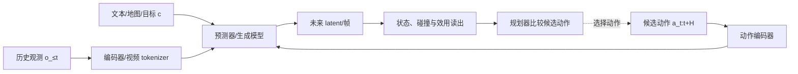

# 第11章 动作条件视频世界模型

## 本章契约

### 核心问题

一个视频模型如何从“生成最可能的下一帧”升级为“比较不同动作将造成的未来”，我们又需要什么证据才能把它用于交互、规划或仿真？

### 先修知识

- 已具备：第6章的潜在动力学、第9章的干预评测、第10章的预测表示；
- 本章补齐：动作条件、latent action、counterfactual、多步视频 rollout 和交互时延；
- 不要求：视频扩散训练、3D 视觉、真实驾驶数据、GPU 或闭源产品权限。

第5章已统一自回归、离散 token、masked、扩散与 flow 的数学接口；本章只增加动作条件、自由 rollout、反事实与 simulator/planner 证据，不重复生成模型推导。

### 非目标

- 不把视觉逼真等同物理正确、动作可控或安全；
- 不把 renderer、simulator、planner 和 policy 混为同一个系统；
- 不声称复现 Genie、GAIA、Waymo World Model、GameNGen 或 DIAMOND；
- 不让闭源演示或供应商博客承担可复现实验主线。

### 学完后的可验证产出

读者应能定义动作—视频时序 schema，区分命令、执行与高层意图，解释观察条件预测与动作干预预测的差别，设计保持外生因素一致的 counterfactual 测试，区分 teacher-forced 与自由 rollout，并根据用途选择视觉、状态、干预和闭环指标。

## 11.1 从“接着画”到“如果这样做”

无动作视频预测器学习 `p(o_{t+1}|o_{≤t})`，通常延续数据中常见行为。动作条件模型显式接收 `a_t`：

\[
p_\theta(o_{t+1:t+H}\mid o_{\le t},a_{t:t+H-1},c),
\]

其中 `c` 可包含文本、地图、目标或场景条件。动作序列改变未来分布，模型才有机会回答“保持、左转、右转或制动分别会怎样”。但把动作送进网络不保证网络真正使用它；训练数据中的视觉历史往往已经能预测主流未来，模型可能忽略稀少或弱相关动作。



*FIG-11-01：动作条件视频模型进入规划环路的最小接口。生成未来只是中间环节；规划器还需要状态/效用读出与真实环境验证。来源：本书原创，MIT，2026-08-31。*

`CLAIM-11-01`（recommendation）：动作作为条件输入只是必要接口；若同一状态下改变动作不能产生方向正确且可测的未来差异，就不应支持动作反事实声明。

### 11.1.1 条件相关不等于干预效果

从日志学习的条件分布回答“历史中出现动作 $a_t$ 时，之后通常发生什么”。规划器真正想问的则是“在同一当前状态下，主动把动作改成 $a_t$ 会造成什么”。若行为策略根据未被模型观察到的危险程度选择制动，日志中的“制动”会与危险后果相关；模型可能因此学到制动预示碰撞，而不是制动降低碰撞风险。

这个差别来自混淆：动作不是随机分配的，它由操作者或旧策略根据自身信息选择。动作条件输入提供了表达干预的接口，却不能仅靠观察损失识别干预效果。可靠性依赖状态是否包含决策者使用的关键信息、训练动作是否覆盖比较范围，以及仿真、随机探索或其他设计是否提供足够的反事实约束。

因此，动作敏感性只是第一关。模型还需在同一信息状态下保持方向、幅度、约束事件和多步后果正确，并在动作超出数据支持时暴露不确定性或拒绝。

## 11.2 动作到底是什么

动作必须沿用第3章 schema，而不能只写一个匿名向量。视频模型常见条件包括：

| 动作来源 | 例子 | 优点 | 主要风险 |
| --- | --- | --- | --- |
| 真实低层控制 | 转向、加速度、关节速度 | 可直接做物理干预 | 单位、延迟、本体绑定 |
| 规划轨迹 | 未来位姿、路径点、曲率 | 与预测 horizon 对齐 | 跟踪器未建模 |
| 高层技能/token | left、pick、jump | 跨本体且易收集 | 具体执行不唯一 |
| 文本事件 | “开始下雨”“车辆切入” | 场景编辑灵活 | 不一定是智能体动作 |
| latent action | 从视频变化推断的离散/连续变量 | 无控制日志也可训练 | 语义不确定、不可直接执行 |

*TAB-11-01：动作条件的来源。文本世界事件、他车行为和 ego 动作必须分开，不应共同称为 `action`。*

连续动作应记录 frame、单位、采样频率、保持方式、归一化、时间偏移和上下限。视频是 10 Hz、控制是 50 Hz 时，要明确一个视频间隔内如何聚合五个控制量。若动作在曝光之后才生效，却被对齐到当前帧，模型会学到错误因果顺序。

### latent action 的用途与边界

没有动作日志时，可以训练 inverse dynamics 或离散 tokenizer，从相邻视频推断“导致变化的 latent action”。这能压缩交互模式或发现可控因素，却存在不可辨识性：相同视觉变化可由不同真实动作造成，摄像机运动也可能被误当动作。

latent action 用于生成时只需保持数据内一致；连接真实机器人时还要学习 latent 到可执行控制的 grounding，并验证多解、边界和 OOD。没有 grounding 的 latent token 不是可直接执行动作。

### 11.2.1 命令动作、执行动作与意图

控制系统中至少有三种容易混淆的动作：

| 层次 | 例子 | 与下一状态的关系 |
|---|---|---|
| 命令动作 | 请求转角、目标关节位置 | 可能被限幅、延迟或安全层改写 |
| 实际执行动作 | 实际轮角、力矩、关节位移 | 更接近物理转移的直接输入 |
| 高层意图 | 变道、抓取、向前走 | 需要控制器和反馈闭环实现 |

若模型以命令为条件、标签却记录实际运动，中间执行器就是未显式建模的动力学。相同命令在低电量、湿滑路面或负载变化下可能产生不同结果。反过来，若训练时使用事后测得的执行动作，模型在部署预测前未必能提前获得它。schema 必须明确条件在决策时是否已知。

动作序列也不是反馈策略。预先给出的未来控制假设动作不随未来观测改变，而“看到障碍就制动”是一条条件规则。视频模型可以比较固定序列；要表达分支策略，则需要在 rollout 中生成观测、重新调用 policy，并保持每个分支的状态与随机性一致。

### 11.2.2 Latent action 的不可辨识性

仅从相邻视频推断 latent action 时，表示通常只在某种变换下可辨识：交换两个 token 名称、旋转连续 latent 坐标，只要解码出的变化相同，训练目标就无法区分。于是 latent action 的维度或 token 编号没有天然物理语义。

更严重的是，可控运动、其他主体行为、摄像机运动和随机环境变化都可能解释同一像素差异。若没有本体状态、控制日志或结构约束，latent action 可能把这些来源混在一起。grounding 不是给 token 补一个人类标签，而是验证其与可执行控制之间在不同状态、尺度和本体上保持稳定关系。

## 11.3 预测对象：像素、token、latent 还是状态

动作条件模型可以预测：

- 下一帧/视频像素：直观可视，但计算重、可能把视觉细节当重点；
- 离散视觉 token：便于自回归，但 tokenizer 错误会累积；
- 连续 latent：更紧凑，难以直接发现遗漏变量；
- 显式状态/occupancy：便于碰撞与规划，视觉覆盖较弱；
- 多模态传感器：更接近实际系统，但跨模态一致性更难。

扩散或 flow 模型适合多模态未来，自回归模型提供逐 token/帧推进，整段预测可减轻逐步误差但固定 horizon。架构名称不决定用途：只有把输入动作、输出语义、交互协议与评测连接起来，才能判断它是 renderer、学习模拟器还是规划模型。

初学者还要区分“画面移动”和“三维运动”。像素位移同时受物体运动、相机自运动、深度和内参影响；没有标定、ego pose 或明确状态读出时，目标向图像左侧移动不能直接解释为在 body/map frame 中横移多少米。若模型声称输出 metric depth、ego-motion、3D box 或 occupancy，必须分别登记 z-depth/range 定义、frame、单位和预测时刻，再通过第3章的变换链进入第12章空间查询。

### 11.3.1 输出空间决定哪些错误容易被看见

不同预测对象不是同一模型的压缩率选项，而是不同的可观察合同。像素输出便于检查外观连续性，却会把物理变量隐藏在渲染中；显式状态便于计算碰撞和约束，却可能遗漏传感器外观；latent 输出紧凑，但如果没有受控读出，状态别名和对象消失可能完全不可见。

一个实用系统可以同时保留多种头：latent 负责递推，状态/occupancy 头服务规划，renderer 提供可视诊断。多头一致不由共享 backbone 自动保证。例如画面中的车辆仍存在，occupancy 头却可能判为空闲；需要跨输出的一致性约束与评测，而不能事后选择对系统最有利的那个头。

随机未来还需区分随机性的来源。ego 动作由候选明确给定，其他主体可能按固定回放、规则响应或随机策略变化，传感器噪声又是另一层随机量。若采样时同时改变所有因素，就无法把两个分支的差异归因于 ego 动作。

## 11.4 teacher forcing 与自由 rollout

训练和 one-step 评测常从真实历史预测下一帧；交互时，模型把自己的输出重新作为输入。自由 rollout 的分布会逐步离开数据，出现对象消失、状态漂移、动作失效、文本变化或“自动纠正”危险动作。

对 horizon `h`，至少报告状态或特征误差曲线：

\[
E(h)=\frac{1}{N}\sum_i d\bigl(g(\hat{o}^{(i)}_{t+h}),s^{(i)}_{t+h}\bigr),
\]

`g` 将生成内容读成任务状态，如位置、碰撞、信号灯、物体数量或完成度。视频指标仍可作为视觉诊断，但规划用途必须增加动作敏感性、状态正确性和闭环效用。

训练时给上下文加入噪声、混合真实/生成帧或直接训练多步目标，都可能改善自由 rollout；它们不能消除 OOD 动作、未建模主体和有限上下文的风险。

## 11.5 counterfactual 评测：固定其余因素

干预测试从同一历史复制多个分支，只改变候选动作。最小检查包括：

1. **敏感性**：动作变化是否产生不同输出；
2. **方向性**：左转和右转是否沿正确方向分离；
3. **幅度**：动作大小与位移/速度变化是否校准；
4. **局部性**：只改 ego 动作时，无关背景是否无故变化；
5. **组合性**：训练中见过单步动作，未见序列能否组合；
6. **安全状态**：碰撞、越界和停止是否与视觉同步。

一种动作敏感性诊断是：

\[
S(a_i,a_j)=d\bigl(\hat{s}_{t+h}(a_i),\hat{s}_{t+h}(a_j)\bigr).
\]

本书对有限动作集报告预测未来的直径 \(S_{max}=\max_{i,j}S(a_i,a_j)\)。它保留状态距离单位：全部候选未来相同时为 0，但数值不能跨坐标尺度直接比较。用“唯一未来数量 / 动作数”冒充敏感度会让完全动作盲模型得到 \(1/|A|>0\)，因此本章 fixture 已弃用该定义。

`S_{max}>0` 仍只说明输出发生变化，不说明方向或幅度正确。还要比较带符号的效果（例如右转横向位移减左转横向位移），并对所有动作对报告 counterfactual vector error：

\[
E_{cf}=\sqrt{\frac{1}{d|P|}\sum_{(i,j)\in P}\left\|[(\hat{s}_j-\hat{s}_i)-(s_j-s_i)]\right\|_2^2},
\]

其中 \(P\) 是预先登记的动作对，\(d\) 是状态维数。敏感度很大也可能来自标签交换或无约束幻觉，必须与真实仿真器、保留日志或规则 oracle 比较方向和幅度。

### 11.5.1 配对反事实需要共享“同一个世界”

比较两个动作分支时，应尽量共享初始 latent、地图、对象身份和外生随机变量，只改变目标动作。这类似受控实验中的配对设计：它减少无关场景变化，让差异更接近动作效果。若两个分支各自独立采样天气、他车意图和纹理，视觉差异再大也无法说明由动作造成。

但共享随机性也有边界。动作可能真实地改变后续交互，从而使他车反应分叉；这时不能强迫两个分支继续播放完全相同的他车轨迹。协议应区分哪些变量在干预前共享、哪些机制在干预后按各自状态响应，以及随机种子表示固定噪声轨迹还是固定主体意图。

多模态模型还要避免用单个“正确视频”惩罚所有其他合理未来。同一动作下可能同时存在多个合法他车反应。评测可比较状态分布、事件概率、coverage 和配对效果方向，而不只计算生成样本与唯一记录视频的逐像素距离。

## 11.6 学习动作表，再组合未见序列（EXP-11-01）

S 档 fixture 是 `7×7` 网格。训练数据覆盖 forward、left、right、brake 的单步转移，但不含评测中的三步组合。模型从样本拟合位移：

- `action_blind` 忽略动作，使用所有训练转移的平均位移；
- `left_right_swapped` 响应动作，但模拟标签/对齐错误，把 left 与 right 语义交换；
- `action_conditioned` 为每个动作学习正确的独立位移；
- 状态被渲染为 ASCII 帧，便于同时检查状态与观察输出。

<details markdown="1">
<summary>可选：验证本章证据</summary>

```bash
make ch11-test-local
make ch11-smoke-local
make ch11-smoke
```

</details>

| 模型 | one-step 状态 RMSE ↓ | 帧准确率 ↑ | 动作敏感度/直径 ↑ | 左→右有符号分离 | counterfactual vector RMSE ↓ |
| --- | ---: | ---: | ---: | ---: | ---: |
| action-blind | 0.58630 | 25% | 0.0 | 0.0 | 0.95743 |
| left-right-swapped | 1.00000 | 50% | **2.0** | **-2.0（反向）** | 1.63299 |
| action-conditioned | **0.00000** | **100%** | **2.0** | **+2.0（正确）** | **0.00000** |

*TAB-11-02：`EXP-11-01` 的单步与同状态反事实结果。敏感度和无符号分离都无法单独检出左右语义交换。*

`CLAIM-11-02`（result）：按预测未来最大两两距离计算，`EXP-11-01` 的 action-blind 动作敏感度为 0，action-conditioned 为 2；前者对四个动作产生同一未来。该量有网格单位，不是归一化性能分数。

`CLAIM-11-03`（result）：在只保留动作组合的三条序列上，conditioned 模型平均终点误差为 0，blind 模型为 1.33852。该结果来自确定性可组合动力学，不能外推复杂视频的组合泛化。

`CLAIM-11-07`（result）：left-right-swapped 与正确模型的动作敏感度、无符号左右分离都为 2，但有符号左右效果分别为 -2 和 +2，counterfactual vector RMSE 分别为 1.63299 和 0。这一标签置换负对照证明“响应动作”不足以支持“动作语义正确”。

多步评测同时报告固定分母的全轨迹 RMSE。三条序列各三步，因此每个模型都有 3 个终点、9 个预测转移；没有缺失 rollout。

| 模型 | 序列数 | 转移数 | 未见序列全轨迹 RMSE ↓ | 平均终点误差 ↓ |
| --- | ---: | ---: | ---: | ---: |
| action-blind | 3 | 9 | 0.76830 | 1.33852 |
| left-right-swapped | 3 | 9 | 1.33333 | 2.00000 |
| action-conditioned | 3 | 9 | **0.00000** | **0.00000** |

*TAB-11-03：`EXP-11-01` 的多步结果。全轨迹 RMSE 以 9 个转移、每步两个状态坐标为分母；终点误差以 3 条序列为分母。*

`CLAIM-11-08`（result）：在固定的 3 条未见序列、9 个转移上，blind、swapped、conditioned 的全轨迹 RMSE 分别为 0.76830、1.33333、0。显式报告轨迹与终点能阻止中间错误被终点抵消，但仍不是随机环境的统计泛化证据。

### 11.6.1 endpoint 正确仍可能掩盖中间错误

聚合的平均终点误差只能说明三条序列的均值，不能指出某条序列是否发生误差抵消。对 `left→forward→right`，左右标签交换模型在第一步走向相反方向，第三步却恰好回到同一终点：

| 步 | 动作 | oracle 状态 | swapped 状态 | 欧氏误差 |
| ---: | --- | --- | --- | ---: |
| 0 | start | (1, 3) | (1, 3) | 0 |
| 1 | left | (2, 2) | (2, 4) | 2 |
| 2 | forward | (3, 2) | (3, 4) | 2 |
| 3 | right | (4, 3) | (4, 3) | **0** |

*TAB-11-05：`EXP-11-01` 的 endpoint-cancellation 负对照。状态和动作均为手写确定性网格规则；单条序列的终点正确不能替代逐步轨迹检查。*

`CLAIM-11-11`（result）：`EXP-11-01` 的三条未见序列中，left-right-swapped 有 1 条终点误差为 0、但中间最大误差为 2；正确模型没有这种抵消。`1/3` 不是现实错误发生率，2 也不是视频或物理单位，只证明 endpoint-only 指标可以产生假阴性。

## 11.7 renderer、simulator、planner：同一视频，不同合同

| 系统角色 | 必须具备 | 不能仅凭什么证明 |
| --- | --- | --- |
| renderer | 给定状态/场景产生传感器外观 | 画面好看不证明状态转移 |
| learned simulator | 动作推进状态并生成后续观测 | 单步视频质量不证明长时闭环 |
| scenario generator | 生成多样初态/事件/外观 | 多样性不证明概率或风险真实 |
| planner model | 候选动作下保留决策量或效用排序 | 能交互不证明规划可靠 |
| policy | 从观测/信念选择动作 | 含世界模型不证明安全执行 |

`CLAIM-11-04`（recommendation）：将生成模型用于仿真或策略评测前，应分别验证状态转移、动作干预、自由 rollout、策略排序和闭环 outcome；renderer 的视觉指标不能越级支持这些声明。

物理仿真器通常有显式状态、碰撞与确定性规则；学习模拟器从数据估计未来，可能更真实地渲染复杂外观，也可能幻觉或遗漏约束。两者可以组合，而不是二选一。

### 11.7.1 学习模拟器还需要可分支与可重置

一个视频生成器能持续响应键盘，不等于它已经满足 simulator 合同。用于策略评测的模拟器至少需要定义状态初始化、分支复制、随机种子、时间推进、终止、约束事件和失败恢复；否则无法让两个策略从可比初态运行，也无法重现一次失败。

模拟器还应保持隐藏状态的持续性。对象短暂离开视野后是否仍存在，资源消耗是否守恒，碰撞是否改变后续运动，这些都不能只靠局部画面连贯判断。renderer 可以每帧看起来合理，底层状态却在不同时间或视角之间自相矛盾。

因此，“可交互”描述的是输入输出体验，“可评测”要求重复、配对和可审计，“可规划”还要求动作后果与效用排序可信。三者是递进合同，不是同义词。

## 11.8 开源研究锚点：按接口与维护状态选择

[DIAMOND](https://github.com/eloialonso/diamond) 是公开代码、agent 和可玩 checkpoint 的扩散世界模型案例；[GameNGen](https://gamengen.github.io/) 公开论文和演示，使用历史帧与动作生成 DOOM 后续。它们说明动作条件像素模型可以形成交互环境，但任务、数据、硬件和指标都与机器人/驾驶不同。DIAMOND 官方 README 还明确提醒 Atari ROM 下载要求使用者拥有相应许可；MIT 代码许可不会覆盖游戏资产。

截至 2026-09-02，几个开源锚点承担的角色并不相同：

| 项目 | 预测/生成对象 | 动作与用途 | 当前可审计资产 | 本书边界 |
| --- | --- | --- | --- | --- |
| DIAMOND | 游戏像素/环境未来 | 离散游戏动作、imagination 中训练 agent | 代码、checkpoint、逐游戏/seed 结果 | ROM 另行授权；不是机器人/驾驶 |
| V-JEPA 2-AC | latent future | 机器人动作、图像目标规划 | 代码、action-conditioned checkpoint、示例 | 不输出可观看视频；本书未运行 |
| Cosmos-Predict2.5 | 视频 future | 2B robot/action-cond 等专用模型 | Apache-2.0 代码、Open Model License 权重、推理/后训练文档 | 仓库已转有限维护并建议迁移 Cosmos 3；资源未测 |
| Cosmos 3 Generator | vision/sound/action 等统一序列 | 多模态生成、未来预测与 action 输出 | OpenMDW-1.1 仓库/模型材料、推理/后训练配方 | 默认路径需要 gated Guardrail；关闭它会改变安全处理；资源未测 |
| Cosmos-Drive-Dreams | 多视角 RGB/LiDAR 合成数据 | HD map、3D box、LiDAR 等空间条件 | pipeline、权重、toolkit、合成数据 | 场景条件生成不自动等于 ego-action 闭环 simulator |

*TAB-11-04：动作/条件视频开源锚点的接口分类。资产存在不代表本机可运行、许可相同或闭环有效。*

`CLAIM-11-09`（fact）：[Cosmos-Predict2.5 官方仓库快照 `a2c298b`](https://github.com/nvidia-cosmos/cosmos-predict2.5/tree/a2c298b0a3df3778b973fe65e9e58877b292d8a7)列有 2B robot/action-cond 模型及推理、后训练路径，并声明只做有限维护、建议迁移 Cosmos 3；因此实验卡必须锁定具体代际、模型和许可，不能只写“Cosmos”。

[Cosmos 3 官方仓库快照 `9aa98e5`](https://github.com/NVIDIA/cosmos/tree/9aa98e5a0773a5558f07d2699e640858f7ca8827)把 Generator 描述为可联合处理或生成 text、vision、sound 与 action 的 omnimodal world model，并公开推理和 post-training 入口；同一 README 也明确列出长时一致性、action-state consistency、3D 结构和物理合理性等限制。这里按 `[O,R1]` 记录“该快照中公开接口与资产存在”，不把官方的能力概述升级为独立效果验证。

[同一快照的 action cookbook](https://github.com/NVIDIA/cosmos/blob/9aa98e5a0773a5558f07d2699e640858f7ca8827/cookbooks/cosmos3/generator/action/README.md)把 forward dynamics、inverse dynamics 与 policy 分成三个 mode，并声明 Generator 默认需要申请 gated `Cosmos-1.0-Guardrail`；三个后端也允许显式关闭 guardrail。后者不是无影响的安装技巧：实验包必须登记 `guardrail_enabled`、guardrail revision/授权状态和拒绝/模糊化行为，关闭时不能声称运行了默认安全路径。仓库根许可证为 OpenMDW-1.1，仍需逐项核对模型、数据和依赖，不能把它写成本书 MIT 或旧 Cosmos 2.5 的 Apache-2.0/Open Model License 组合。

`CLAIM-11-10`（fact）：Cosmos 3 官方快照 `9aa98e5` 已将 action 纳入统一生成输入输出，同时仍明确列出 action-state、3D 与物理一致性限制；这是该快照的接口事实，不代表后续版本或独立有效性验证。

迁移代际时仍应重新登记输入输出模态、运行后端、checkpoint、许可与失败边界，不能沿用 2.5 的实验卡。

这些系统不是核心阅读所依赖的下载项，本书也没有执行其训练或试玩。若作为 M/L1 扩展，必须锁定 commit、模型代际、环境 ROM/数据权利、checkpoint 许可、Guardrail 开关与 revision、GPU、采样步数、真实 FPS 定义和自由 rollout horizon。论文速度不能直接换算到未测硬件；模型名和参数量也不能直接推出 24 GB 可行。

V-JEPA 2-AC 是非像素动作条件路线的另一个锚点；它与视频扩散模型的共同点是接收动作并预测未来，输出空间和规划接口不同。第17章会在统一用途框架下比较。

## 11.9 闭源案例：只验证发布方做出的声明

### Genie 3 与 Project Genie

Google DeepMind 官方页面将 Genie 3 描述为可由文本创建、实时探索的通用世界模型，并在 Project Genie 中提供实验性体验。官方页面也列出有限动作空间、其他智能体交互、真实地点精确度和连续交互时长等限制。由于没有开放训练数据、权重和完整评测，本书标为 `[V,R0/R1]`，不安排复现。

### Waymo World Model

Waymo 2026 年官方博客称其驾驶世界模型基于 Genie 3 做领域适配，并生成 camera 与 lidar 等多传感器场景。该页面证明 Waymo 发布了这些能力声明和演示，不足以独立验证覆盖率、物理误差或安全有效性，标为 `[V,R0]`。

### GAIA 2→4

GAIA-2 有公开技术报告，描述多相机、文本、动作和结构条件的 latent/flow 视频模型；GAIA-3/4 的最新闭环与安全评测内容主要来自 Wayve 官方研究页面。2026 年 8 月发布的 [GAIA-4 页面](https://wayve.ai/thinking/gaia-4/)强调把 AI Driver 放回闭环、world-on-rails 与多模态生成。

`CLAIM-11-05`（fact）：截至 2026-09-02，Wayve 官方页面把 GAIA-4 定位为闭环驾驶模拟与安全评测组件；本书只把它记录为供应商声明 `[V,R0]`，不把相关性、保真或安全结论视为独立验证。

这些闭源案例的教学价值是展示用途演进：视频生成 → 可控场景 → 闭环策略评测。版本越新，越需要更新案例卡，而不是改写稳定的动作条件公式。

## 11.10 自动驾驶正文：转向、制动与他车反应

驾驶动作条件至少区分：ego 转向/加速度、规划轨迹、他车轨迹、信号控制和文本天气事件。若把它们塞进一个条件向量，就无法判断谁导致了未来变化。

最低 counterfactual 套件从同一相机/车辆历史分叉：保持车道、左/右微转、加速、舒适制动和紧急制动。每个分支检查：

- ego 位姿与输入动作方向一致；
- 道路、静态物体和无关车辆不会随机重写；
- 他车反应遵守明确的 world-on-rails 或 reactive 协议；
- camera、lidar/radar、BEV occupancy 与碰撞状态一致；
- rollout 超出训练支持时给出不确定性或拒绝。

`CLAIM-11-06`（recommendation）：驾驶学习模拟器必须声明其他交通参与者是固定回放、规则响应还是学习响应；三种协议产生的碰撞和策略结果不能直接比较。

OpenDV 等视频数据可用于外观/运动预训练，但若缺少同步控制、ego-motion 或轨迹，就不能直接监督动作反事实。S/M 路线优先使用 MetaDrive/CARLA 程序化轨迹或许可明确的小型日志；大型真实驾驶下载需要用户单独确认。

学习模拟器不能成为安全的唯一裁判。规划器可能利用它的错误，生成模型也可能把危险动作“画成安全”。高风险候选动作必须回到物理仿真、保留日志或受控真实测试验证。

驾驶反事实还应区分 ego intervention 与其他主体 response。世界回放模式适合回答“若 ego 略微改变轨迹，在其他主体暂时不变时会怎样”，但 horizon 变长后会产生不一致；响应式模式更接近交互，却把他车模型误差引入结果。比较系统时必须冻结响应协议，否则碰撞率差异可能来自“其他车辆是否让行”，而不是 ego planner。

对于遮挡和稀有事件，视频生成的视觉合理性尤其容易误导。模型可能生成一条“遮挡后无人”的清晰未来，但真实问题是条件分布中仍有行人出现的概率。规划应读取多未来风险或保守 occupancy，而不是把一条高质量样本当作世界已确定。

## 11.11 资源、许可与实验升级路径

S 档 `EXP-11-01` 使用 Python 标准库、CPU、0 字节下载和 MIT fixture。它只验证动作/状态/帧接口。

M 档可训练小型离散帧或 latent predictor：默认 24 GB 单卡以内，先使用程序化 rollout、低分辨率、短 horizon 和少量 seed；必须记录峰值显存、磁盘、视频预处理与自由 rollout 时间。L1 可增加扩散/flow、小规模驾驶仿真与多步不确定性。L2 最多 2×80 GB，仅用于明确选做的较大视频模型，不是后续阅读前置。

第三方代码、checkpoint、游戏资产、驾驶视频和仿真资产分别核验许可。对 Cosmos 3 还要分别登记 OpenMDW-1.1 模型材料、gated Guardrail 和下游依赖；禁用可选安全组件必须进入结果配置和限制，不能默认为等价运行。闭源产品/API 还需记录模型快照、日期、费用、请求与数据治理，不能上传未经许可的真实驾驶视频。

## 11.12 失效模式与安全边界

重点失效包括：动作被忽略、动作时间错位、连续控制离散化错误、latent action 不可 grounding、自由 rollout 漂移、多主体不响应、视角变化但几何不变、跨传感器矛盾、罕见动作过度自信，以及规划器利用生成漏洞。

评测应保留逐分支视频、状态轨迹、动作日志和失败类别。只有视频而没有状态/动作时间轴，无法审计 counterfactual。任何连接执行器的系统都需要独立碰撞检查、控制限幅、超时和最小风险动作。

## 11.13 结果与证据边界

| 类型 | 声明/结果 | 来源 | 状态 | 限制 |
| --- | --- | --- | --- | --- |
| 本书结果 | 动作盲、左右交换、endpoint cancellation 与正确查表的反事实/组合诊断 | `EXP-11-01` | CPU smoke | 确定性网格/ASCII |
| 开源案例 | DIAMOND 提供动作条件可玩扩散模型资产 | 官方项目 | `[O,R1]` | 本书未运行 |
| 开源案例 | Cosmos 2.5 action-cond 与 Drive-Dreams 条件生成资产 | 官方项目 | `[O,R1]` | 代际、许可、用途和资源不同 |
| 开源案例 | Cosmos 3 forward/inverse/policy action modes | 官方快照/cookbook | `[O,R1]` | OpenMDW-1.1；Guardrail 授权/开关、资源与有效性未验证 |
| 论文案例 | GameNGen 用帧与动作生成交互未来 | 论文/项目页 | `[A,R1]` | 本书未运行 |
| 闭源案例 | Genie 3、Waymo WM、GAIA-4 的交互/驾驶声明 | 官方页面 | `[V,R0/R1]` | 无独立复现 |
| 未验证 | 小型视频/latent predictor | 可选 M 档 | planned | GPU、数据与资源待测 |

## 小结

动作条件把视频预测从“接着画”推进到“比较行动后果”，但观察到的条件相关不自动等于干预效果。日志动作由行为策略选择，可能与未观测危险混淆；模型只有在状态充分、动作有覆盖并接受配对反事实检验时，才可能支持规划问题。

动作 schema 必须区分命令、实际执行和高层意图，并对齐作用时刻、单位与控制频率。预先给出的动作序列是开环条件，不是看到新观测后分支的策略。latent action 也没有天然控制语义，其 grounding 需要跨状态和本体验证。

像素、token、latent 和显式状态暴露不同错误。多头系统仍需检查跨输出一致性；多模态未来则应区分 ego 动作、他体响应与外生噪声。配对分支应共享干预前的同一个世界，同时允许干预后的响应机制真实分叉。

最终，可交互视频不自动成为可重置、可分支和可复现的模拟器，更不自动成为规划器或安全裁判。只有通过动作语义、自由 rollout、状态持续性、反事实方向、策略排序和独立闭环验证，才能逐级扩大模型承担的系统角色。

## 练习

1. **概念判断**：模型对左右转生成不同视频，是否已证明动作正确？还缺哪些 oracle？
2. **代码实验**：在 `EXP-11-01` 加入边界碰撞和随机滑移，报告均值、失败率与不确定性。
3. **时序实验**：将动作整体错位一帧，观察 one-step 与 rollout 指标怎样变化。
4. **系统分类**：为一个交互视频产品填写 renderer/simulator/planner 证据表。
5. **自动驾驶迁移**：设计保持、急刹与切入三分支，并写明其他车辆的响应协议。
6. **指标审计**：构造另一条终点误差为零、但中间状态错误的动作序列，并说明最低报告字段。

## 自检要点

动作条件模型的最低证据不是“不同动作生成不同画面”，而是同一历史下的配对干预、正确方向、时间对齐、多步后果和明确失败分母。

<details markdown="1">
<summary>SELF-CHECK-11-01：左右不同仍不等于正确</summary>

没有。`left_right_swapped` 在当前 fixture 中 action sensitivity 和左右 separation 都是 2，与正确模型一样大，但 signed separation 为 -2、counterfactual vector RMSE 约 1.633。还需同一历史下由已知 simulator/动力学、同步真实 rollout 或可靠状态标注给出的 counterfactual oracle，核对方向、幅度、碰撞/终止和多步轨迹；视觉任务还需 flow、ego pose、3D/occupancy 或对象状态 oracle。仅用文本提示一致性或两段视频彼此不同，最多证明模型读取了条件。

</details>

<details markdown="1">
<summary>SELF-CHECK-11-02：边界、滑移与不确定性</summary>

可把 transition 改为：越过 `[0,6]²` 时记录 `collision/out_of_bounds` 而不是只静默 clip；每一步再以冻结概率和 seed 施加纵横滑移。对每个起点—动作序列运行相同 seed 集，按所有 attempted rollout 报 endpoint/trajectory error 均值、碰撞或越界失败率、有效 coverage，以及预测分布的 interval coverage/NLL 或 Brier；样本标准差只能称 stochastic spread，不能自动称 epistemic uncertainty。若失败 rollout 被删掉，低均值会产生幸存者偏差。

</details>

<details markdown="1">
<summary>SELF-CHECK-11-03：动作错位一帧</summary>

把本应作用于 `o_t→o_{t+1}` 的 `a_t` 整体配成 `a_{t-1}`，先在含转向/制动切换的序列上比较；连续重复同一动作的片段可能掩盖错位。One-step 指标会在动作切换边界显著恶化，但若常见动作占比很高，micro average 仍可能好看；free rollout 会把第一次错误状态继续作为下一步输入，endpoint 和轨迹误差通常累积。应按 action transition 类型和 horizon 报错，并用固定一帧正/负 shift 作负对照；结果依序列构成，不能声称必然单调。

</details>

<details markdown="1">
<summary>SELF-CHECK-11-04：renderer、simulator 与 planner 证据表</summary>

表中至少列 `输入条件、可控 ego action、他体响应、状态/碰撞 oracle、时间推进、分支重置、E1/E2/E3/E4、允许声明`。若产品只按文本改变视频且无可验证状态，可登记 renderer；若给定动作后按一致规则推进多主体状态、可重置并由 oracle 验证，可在限定作用域称 simulator；只有再证明候选动作覆盖、策略排序/代价有效并接入滚动重规划，才可登记 planner role。一个系统可同时有多个角色，但每列证据分别通过，不能由“交互式”一词推导。

</details>

<details markdown="1">
<summary>SELF-CHECK-11-05：保持、急刹与切入分支</summary>

固定同一历史、地图、ego 初态与随机种子，三支 ego action 分别为保持速度、带 jerk 上限的急刹、带横向轨迹和转向率的切入；每支写清控制 frame、单位、频率、起效时刻和 horizon。他车响应应选一种预注册协议：open-loop replay 只适合短时反事实且不得称交互；规则/仿真 driver 根据相对距离和 TTC 反馈；learned response 则需独立校准与 OOD gate。分别报告 ego/他车轨迹、最小 TTC、碰撞、舒适度、道路约束与不确定性，并保留“冻结他车”负对照以区分 ego action effect 和响应模型 effect。

</details>

<details markdown="1">
<summary>SELF-CHECK-11-06：终点正确但轨迹错误</summary>

可选一对会互相抵消的动作，例如先把真实 `left/right` 语义交换，再执行包含左右各一次的序列；当前 fixture 的 `left→forward→right` 在 swapped 模型中得到 oracle/swapped 的 y 轨迹 `3→2→2→3` 与 `3→4→4→3`，终点误差为0但中间最大误差为2。最低报告应包含序列身份、attempted/available 数、每个 horizon 的状态误差、最大中间误差、终点误差、碰撞/终止与失败保留规则；不能只给跨序列平均终点。还需把这类序列在 protocol 中预登记，不能观察结果后才挑出最戏剧性的抵消案例。

</details>

## 延伸阅读

- Valevski et al., [GameNGen](https://arxiv.org/abs/2408.14837)，`[A,R1]`，动作条件扩散游戏引擎；
- Alonso et al., [DIAMOND](https://arxiv.org/abs/2405.12399) 与[官方代码](https://github.com/eloialonso/diamond)，`[P/O,R1]`；
- Google DeepMind, [Genie 3 / Project Genie](https://deepmind.google/models/genie/)，`[V,R0/R1]`；
- Wayve, [GAIA-2 技术报告](https://arxiv.org/abs/2503.20523) 与 [GAIA-4 官方页面](https://wayve.ai/thinking/gaia-4/)，`[A/V,R0/R1]`；
- Waymo, [Waymo World Model 官方博客](https://waymo.com/blog/2026/02/the-waymo-world-model-a-new-frontier-for-autonomous-driving-simulation/)，`[V,R0]`；
- Meta FAIR, [V-JEPA 2-AC 官方仓库](https://github.com/facebookresearch/vjepa2)，`[O,R1]`，latent 动作条件路线。
- NVIDIA, [Cosmos-Predict2.5 快照 `a2c298b`](https://github.com/nvidia-cosmos/cosmos-predict2.5/tree/a2c298b0a3df3778b973fe65e9e58877b292d8a7)、[Cosmos 3 快照 `9aa98e5`](https://github.com/NVIDIA/cosmos/tree/9aa98e5a0773a5558f07d2699e640858f7ca8827) 与 [Cosmos-Drive-Dreams](https://github.com/nv-tlabs/Cosmos-Drive-Dreams)，`[O,R1]`，不同代际的统一生成、机器人动作条件视频与驾驶条件合成数据接口。

## 下一章接口

第12章将把未来视频/latent 读成 depth、occupancy、动态对象和可行动空间；第17章再比较视频模型作为表征、合成数据、模拟器、planner/critic 和安全验证器的五种用途。

## 验收与审查记录

```text
本地检查：make check-local
严格检查：make check
章节 smoke：make ch11-smoke
文档构建：make docs-build
```

- 内容审查：通过；
- 代码审查：通过；
- 一致性审查：通过；
- 教学审查：通过；
- 审查记录路径：`reviews/ch11-endpoint-cancellation-review-2026-09-02.md`、`reviews/batch-c-review.md`、`reviews/ch11-action-metric-review-2026-09-01.md`、`reviews/fast-moving-source-audit-2026-09-01.md`、`reviews/part-03-exercise-self-check-review-2026-09-02.md`、`reviews/upstream-runnability-audit-2026-09-02.md`；
- 已知限制：没有训练视频模型、下载 checkpoint、申请 gated Guardrail、运行仿真或验证任何闭源案例；
