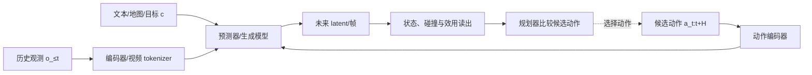

# 第11章 动作条件视频世界模型

> 状态：`drafted`
> 资料核查日期：2026-08-31
> 关联实验：`EXP-11-01`
> 关联声明：`CLAIM-11-01`～`CLAIM-11-06`
> 关联图表：`FIG-11-01` / `TAB-11-01` / `TAB-11-02`
> 资源档位：S / M / L1 / L2
> GPU 状态：待验证

## 本章契约

### 核心问题

一个视频模型如何从“生成最可能的下一帧”升级为“比较不同动作将造成的未来”，我们又需要什么证据才能把它用于交互、规划或仿真？

### 先修知识

- 已具备：第6章的潜在动力学、第9章的干预评测、第10章的预测表示；
- 本章补齐：动作条件、latent action、counterfactual、多步视频 rollout 和交互时延；
- 不要求：视频扩散训练、3D 视觉、真实驾驶数据、GPU 或闭源产品权限。

第5章生成式基础尚未成稿，本文只解释自回归、离散 token、扩散/flow 在动作条件视频中的接口差异；待第5章完成后再统一数学谱系。

### 非目标

- 不把视觉逼真等同物理正确、动作可控或安全；
- 不把 renderer、simulator、planner 和 policy 混为同一个系统；
- 不声称复现 Genie、GAIA、Waymo World Model、GameNGen 或 DIAMOND；
- 不让闭源演示或供应商博客承担可复现实验主线。

### 学完后的可验证产出

读者应能定义动作—视频时序 schema，设计同一状态多动作的 counterfactual 测试，区分 teacher-forced 与自由 rollout，并根据用途选择视觉、状态、干预和闭环指标。

## 11.1 从“接着画”到“如果这样做”

无动作视频预测器学习 `p(o_{t+1}|o_{≤t})`，通常延续数据中常见行为。动作条件模型显式接收 `a_t`：

\[
p_\theta(o_{t+1:t+H}\mid o_{\le t},a_{t:t+H-1},c),
\]

其中 `c` 可包含文本、地图、目标或场景条件。动作序列改变未来分布，模型才有机会回答“保持、左转、右转或制动分别会怎样”。但把动作送进网络不保证网络真正使用它；训练数据中的视觉历史往往已经能预测主流未来，模型可能忽略稀少或弱相关动作。



*FIG-11-01：动作条件视频模型进入规划环路的最小接口。生成未来只是中间环节；规划器还需要状态/效用读出与真实环境验证。来源：本书原创，MIT，2026-08-31。*

`CLAIM-11-01`（fact）：动作作为条件输入只是必要接口；若同一状态下改变动作不能产生方向正确且可测的未来差异，就不能支持动作反事实声明。

## 11.2 动作到底是什么

动作必须沿用第3章 schema，而不能只写一个匿名向量。视频模型常见条件包括：

| 动作来源 | 例子 | 优点 | 主要风险 |
| --- | --- | --- | --- |
| 真实低层控制 | 转向、加速度、关节速度 | 可直接做物理干预 | 单位、延迟、本体绑定 |
| 规划轨迹 | 未来位姿、路径点、曲率 | 与预测 horizon 对齐 | 跟踪器未建模 |
| 高层技能/token | left、pick、jump | 跨本体且易收集 | 具体执行不唯一 |
| 文本事件 | “开始下雨”“车辆切入” | 场景编辑灵活 | 不一定是智能体动作 |
| latent action | 从视频变化推断的离散/连续变量 | 无控制日志也可训练 | 语义不确定、不可直接执行 |

*TAB-11-01：动作条件的来源。文本世界事件、他车行为和 ego 动作必须分开，不应共同称为 `action`。*

连续动作应记录 frame、单位、采样频率、保持方式、归一化、时间偏移和上下限。视频是 10 Hz、控制是 50 Hz 时，要明确一个视频间隔内如何聚合五个控制量。若动作在曝光之后才生效，却被对齐到当前帧，模型会学到错误因果顺序。

### latent action 的用途与边界

没有动作日志时，可以训练 inverse dynamics 或离散 tokenizer，从相邻视频推断“导致变化的 latent action”。这能压缩交互模式或发现可控因素，却存在不可辨识性：相同视觉变化可由不同真实动作造成，摄像机运动也可能被误当动作。

latent action 用于生成时只需保持数据内一致；连接真实机器人时还要学习 latent 到可执行控制的 grounding，并验证多解、边界和 OOD。没有 grounding 的 latent token 不是可直接执行动作。

## 11.3 预测对象：像素、token、latent 还是状态

动作条件模型可以预测：

- 下一帧/视频像素：直观可视，但计算重、可能把视觉细节当重点；
- 离散视觉 token：便于自回归，但 tokenizer 错误会累积；
- 连续 latent：更紧凑，难以直接发现遗漏变量；
- 显式状态/occupancy：便于碰撞与规划，视觉覆盖较弱；
- 多模态传感器：更接近实际系统，但跨模态一致性更难。

扩散或 flow 模型适合多模态未来，自回归模型提供逐 token/帧推进，整段预测可减轻逐步误差但固定 horizon。架构名称不决定用途：只有把输入动作、输出语义、交互协议与评测连接起来，才能判断它是 renderer、学习模拟器还是规划模型。

## 11.4 teacher forcing 与自由 rollout

训练和 one-step 评测常从真实历史预测下一帧；交互时，模型把自己的输出重新作为输入。自由 rollout 的分布会逐步离开数据，出现对象消失、状态漂移、动作失效、文本变化或“自动纠正”危险动作。

对 horizon `h`，至少报告状态或特征误差曲线：

\[
E(h)=\frac{1}{N}\sum_i d\bigl(g(\hat{o}^{(i)}_{t+h}),s^{(i)}_{t+h}\bigr),
\]

`g` 将生成内容读成任务状态，如位置、碰撞、信号灯、物体数量或完成度。视频指标仍可作为视觉诊断，但规划用途必须增加动作敏感性、状态正确性和闭环效用。

训练时给上下文加入噪声、混合真实/生成帧或直接训练多步目标，都可能改善自由 rollout；它们不能消除 OOD 动作、未建模主体和有限上下文的风险。

## 11.5 counterfactual 评测：固定其余因素

干预测试从同一历史复制多个分支，只改变候选动作。最小检查包括：

1. **敏感性**：动作变化是否产生不同输出；
2. **方向性**：左转和右转是否沿正确方向分离；
3. **幅度**：动作大小与位移/速度变化是否校准；
4. **局部性**：只改 ego 动作时，无关背景是否无故变化；
5. **组合性**：训练中见过单步动作，未见序列能否组合；
6. **安全状态**：碰撞、越界和停止是否与视觉同步。

一种动作敏感性诊断是：

\[
S(a_i,a_j)=d\bigl(\hat{s}_{t+h}(a_i),\hat{s}_{t+h}(a_j)\bigr).
\]

`S=0` 可能表示忽略动作；很大也可能是无约束幻觉。必须与真实仿真器、保留日志或规则 oracle 比较方向和幅度。

## 11.6 EXP-11-01：学习动作表，再组合未见序列

S 档 fixture 是 `7×7` 网格。训练数据覆盖 forward、left、right、brake 的单步转移，但不含评测中的三步组合。模型从样本拟合位移：

- `action_blind` 忽略动作，使用所有训练转移的平均位移；
- `action_conditioned` 为每个动作学习独立位移；
- 状态被渲染为 ASCII 帧，便于同时检查状态与观察输出。

```bash
make ch11-test-local
make ch11-smoke-local
make ch11-smoke
```

| 模型 | one-step 状态 RMSE ↓ | 帧准确率 ↑ | 动作敏感性 ↑ | 左右分离 ↑ | 未见序列终点误差 ↓ |
| --- | ---: | ---: | ---: | ---: | ---: |
| action-blind | 0.58630 | 25% | 0.25 | 0.0 | 1.33852 |
| action-conditioned | **0.00000** | **100%** | **1.00** | **2.0** | **0.00000** |

*TAB-11-02：`EXP-11-01` 固定网格结果。动作条件模型只是查表式转移，不是视频神经网络。*

`CLAIM-11-02`（result）：`EXP-11-01` 的 action-blind 模型对四个动作只产生一个未来，动作敏感性为 0.25，左右分离为 0；action-conditioned 模型分别为 1.00 和 2.0。

`CLAIM-11-03`（result）：在只保留动作组合的三条序列上，conditioned 模型平均终点误差为 0，blind 模型为 1.33852。该结果来自确定性可组合动力学，不能外推复杂视频的组合泛化。

## 11.7 renderer、simulator、planner：同一视频，不同合同

| 系统角色 | 必须具备 | 不能仅凭什么证明 |
| --- | --- | --- |
| renderer | 给定状态/场景产生传感器外观 | 画面好看不证明状态转移 |
| learned simulator | 动作推进状态并生成后续观测 | 单步视频质量不证明长时闭环 |
| scenario generator | 生成多样初态/事件/外观 | 多样性不证明概率或风险真实 |
| planner model | 候选动作下保留决策量或效用排序 | 能交互不证明规划可靠 |
| policy | 从观测/信念选择动作 | 含世界模型不证明安全执行 |

`CLAIM-11-04`（recommendation）：将生成模型用于仿真或策略评测前，应分别验证状态转移、动作干预、自由 rollout、策略排序和闭环 outcome；renderer 的视觉指标不能越级支持这些声明。

物理仿真器通常有显式状态、碰撞与确定性规则；学习模拟器从数据估计未来，可能更真实地渲染复杂外观，也可能幻觉或遗漏约束。两者可以组合，而不是二选一。

## 11.8 开源研究锚点：可以审计，但不在本机训练

[DIAMOND](https://github.com/eloialonso/diamond) 是公开代码、agent 和可玩 checkpoint 的扩散世界模型案例；[GameNGen](https://gamengen.github.io/) 公开论文和演示，使用历史帧与动作生成 DOOM 后续。它们说明动作条件像素/latent 模型可以形成交互环境，但任务、数据、硬件和指标都与机器人/驾驶不同。

本书当前不下载 checkpoint，不执行其训练或试玩。若后续作为 M/L1 实验，必须锁定 commit、环境 ROM/数据权利、checkpoint 许可、GPU、采样步数、真实 FPS 定义和自由 rollout horizon。论文速度不能直接换算当前设备性能。

V-JEPA 2-AC 是非像素动作条件路线的另一个锚点；它与视频扩散模型的共同点是接收动作并预测未来，输出空间和规划接口不同。第17章会在统一用途框架下比较。

## 11.9 闭源案例：只验证发布方做出的声明

### Genie 3 与 Project Genie

Google DeepMind 官方页面将 Genie 3 描述为可由文本创建、实时探索的通用世界模型，并在 Project Genie 中提供实验性体验。官方页面也列出有限动作空间、其他智能体交互、真实地点精确度和连续交互时长等限制。由于没有开放训练数据、权重和完整评测，本书标为 `[V,R0/R1]`，不安排复现。

### Waymo World Model

Waymo 2026 年官方博客称其驾驶世界模型基于 Genie 3 做领域适配，并生成 camera 与 lidar 等多传感器场景。该页面证明 Waymo 发布了这些能力声明和演示，不足以独立验证覆盖率、物理误差或安全有效性，标为 `[V,R0]`。

### GAIA 2→4

GAIA-2 有公开技术报告，描述多相机、文本、动作和结构条件的 latent/flow 视频模型；GAIA-3/4 的最新闭环与安全评测内容主要来自 Wayve 官方研究页面。2026 年 8 月发布的 GAIA-4 页面强调把 AI Driver 放回闭环、world-on-rails 与多模态生成。

`CLAIM-11-05`（fact）：截至核查日期，Wayve 官方页面把 GAIA-4 定位为闭环驾驶模拟与安全评测组件；本书只把它记录为供应商声明 `[V,R0]`，不把相关性、保真或安全结论视为独立验证。

这些闭源案例的教学价值是展示用途演进：视频生成 → 可控场景 → 闭环策略评测。版本越新，越需要更新案例卡，而不是改写稳定的动作条件公式。

## 11.10 自动驾驶正文：转向、制动与他车反应

驾驶动作条件至少区分：ego 转向/加速度、规划轨迹、他车轨迹、信号控制和文本天气事件。若把它们塞进一个条件向量，就无法判断谁导致了未来变化。

最低 counterfactual 套件从同一相机/车辆历史分叉：保持车道、左/右微转、加速、舒适制动和紧急制动。每个分支检查：

- ego 位姿与输入动作方向一致；
- 道路、静态物体和无关车辆不会随机重写；
- 他车反应遵守明确的 world-on-rails 或 reactive 协议；
- camera、lidar/radar、BEV occupancy 与碰撞状态一致；
- rollout 超出训练支持时给出不确定性或拒绝。

`CLAIM-11-06`（recommendation）：驾驶学习模拟器必须声明其他交通参与者是固定回放、规则响应还是学习响应；三种协议产生的碰撞和策略结果不能直接比较。

OpenDV 等视频数据可用于外观/运动预训练，但若缺少同步控制、ego-motion 或轨迹，就不能直接监督动作反事实。S/M 路线优先使用 MetaDrive/CARLA 程序化轨迹或许可明确的小型日志；大型真实驾驶下载需要用户单独确认。

学习模拟器不能成为安全的唯一裁判。规划器可能利用它的错误，生成模型也可能把危险动作“画成安全”。高风险候选动作必须回到物理仿真、保留日志或受控真实测试验证。

## 11.11 资源、许可与实验升级路径

S 档 `EXP-11-01` 使用 Python 标准库、CPU、0 字节下载和 MIT fixture。它只验证动作/状态/帧接口。

M 档可训练小型离散帧或 latent predictor：默认 24 GB 单卡以内，先使用程序化 rollout、低分辨率、短 horizon 和少量 seed；必须记录峰值显存、磁盘、视频预处理与自由 rollout 时间。L1 可增加扩散/flow、小规模驾驶仿真与多步不确定性。L2 最多 2×80 GB，仅用于明确选做的较大视频模型，不是后续阅读前置。

第三方代码、checkpoint、游戏资产、驾驶视频和仿真资产分别核验许可。闭源产品/API 还需记录模型快照、日期、费用、请求与数据治理，不能上传未经许可的真实驾驶视频。

## 11.12 失效模式与安全边界

重点失效包括：动作被忽略、动作时间错位、连续控制离散化错误、latent action 不可 grounding、自由 rollout 漂移、多主体不响应、视角变化但几何不变、跨传感器矛盾、罕见动作过度自信，以及规划器利用生成漏洞。

评测应保留逐分支视频、状态轨迹、动作日志和失败类别。只有视频而没有状态/动作时间轴，无法审计 counterfactual。任何连接执行器的系统都需要独立碰撞检查、控制限幅、超时和最小风险动作。

## 11.13 结果与证据边界

| 类型 | 声明/结果 | 来源 | 状态 | 限制 |
| --- | --- | --- | --- | --- |
| 本书结果 | 动作条件查表通过反事实与组合 smoke | `EXP-11-01` | CPU smoke | 确定性网格/ASCII |
| 开源案例 | DIAMOND 提供动作条件可玩扩散模型资产 | 官方项目 | `[O,R1]` | 本书未运行 |
| 论文案例 | GameNGen 用帧与动作生成交互未来 | 论文/项目页 | `[A,R1]` | 本书未运行 |
| 闭源案例 | Genie 3、Waymo WM、GAIA-4 的交互/驾驶声明 | 官方页面 | `[V,R0/R1]` | 无独立复现 |
| 未验证 | 小型视频/latent predictor | 后续 M 档 | planned | GPU、数据与资源待测 |

## 小结

动作条件把视频预测从“接着画”推进到“比较行动后果”，但只有通过同状态干预、自由 rollout、状态一致性和闭环效用，模型才可能承担模拟或规划角色。视觉质量、交互性和安全证据是不同层级；开源与闭源案例都必须回到相同合同审查。

## 练习

1. **概念判断**：模型对左右转生成不同视频，是否已证明动作正确？还缺哪些 oracle？
2. **代码实验**：在 `EXP-11-01` 加入边界碰撞和随机滑移，报告均值、失败率与不确定性。
3. **时序实验**：将动作整体错位一帧，观察 one-step 与 rollout 指标怎样变化。
4. **系统分类**：为一个交互视频产品填写 renderer/simulator/planner 证据表。
5. **自动驾驶迁移**：设计保持、急刹与切入三分支，并写明其他车辆的响应协议。

## 延伸阅读

- Valevski et al., [GameNGen](https://arxiv.org/abs/2408.14837)，`[A,R1]`，动作条件扩散游戏引擎；
- Alonso et al., [DIAMOND](https://arxiv.org/abs/2405.12399) 与[官方代码](https://github.com/eloialonso/diamond)，`[P/O,R1]`；
- Google DeepMind, [Genie 3 / Project Genie](https://deepmind.google/models/genie/)，`[V,R0/R1]`；
- Wayve, [GAIA-2 技术报告](https://arxiv.org/abs/2503.20523) 与 [GAIA-4 官方页面](https://wayve.ai/thinking/gaia-4/)，`[A/V,R0/R1]`；
- Waymo, [Waymo World Model 官方博客](https://waymo.com/blog/2026/02/the-waymo-world-model-a-new-frontier-for-autonomous-driving-simulation/)，`[V,R0]`；
- Meta FAIR, [V-JEPA 2-AC 官方仓库](https://github.com/facebookresearch/vjepa2)，`[O,R1]`，latent 动作条件路线。

## 下一章接口

第12章将把未来视频/latent 读成 depth、occupancy、动态对象和可行动空间；第17章再比较视频模型作为表征、合成数据、模拟器、planner/critic 和安全验证器的五种用途。

## 验收与审查记录

```text
本地检查：make check-local
严格检查：make check
章节 smoke：make ch11-smoke
文档构建：make docs-build
```

- 内容审查：通过；
- 代码审查：通过；
- 一致性审查：修改中（等待第5章）；
- 教学审查：通过；
- 审查记录路径：`reviews/batch-c-review.md`；
- 已知限制：没有训练视频模型、下载 checkpoint、运行仿真或验证任何闭源案例；
- 下一步：第5章成稿后关闭生成式谱系一致性门；视频训练与仿真验证保持待办。
