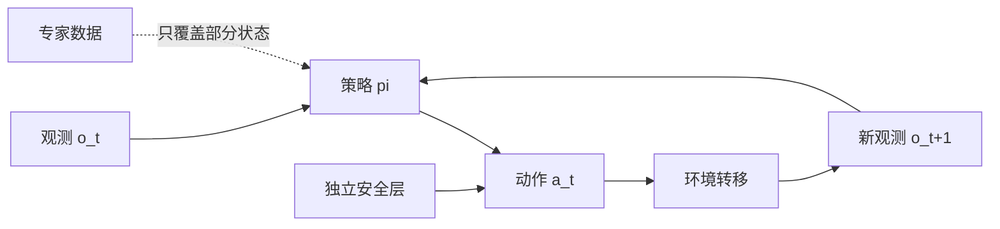

# 第13章 模仿学习、误差累积与动作分块

## 本章契约

### 核心问题

为什么一个在专家数据上动作误差很小的策略，进入闭环后仍可能失败；动作分块又如何在计算效率、动作连贯性和扰动响应之间取舍？

### 先修知识

- 已具备：监督学习、训练/验证划分、均方误差；
- 本章补齐：行为克隆、协变量偏移、DAgger 直觉、动作块与时间集成；
- 不要求：3D 视觉、机器人硬件、强化学习推导或大型策略训练经验。

第3章已经给出观测、状态与动作的最小 schema。本章沿用其 `frame_id`、单位、控制频率、动作时域和独立安全层字段，使模仿学习的输出能够回到同一闭环接口中讨论。

### 非目标

- 不把 CPU 标量反例当作 ACT 或真实机器人性能；
- 不在无 GPU 设备上下载 LeRobot 数据或训练神经策略；
- 不认为动作块越长越好，也不让学习策略绕过独立安全层；
- 不把单一开环动作误差当作部署证据。

### 学完后的可验证产出

读者应能区分监督拟合误差、策略诱导的状态分布与闭环任务损失，解释误差何时会累积、何时可能被反馈抑制，并从任务时标与反馈需求出发分析动作块，而不是把块长度当成孤立的模型超参数。

## 13.1 放回闭环地图

策略从观测 `o_t` 映射到动作 `a_t`；若系统显式提供状态或信念，策略也可以读取相应变量，但不应再把它们记作 `o_t`。环境执行动作后产生下一状态与观测。监督学习只看专家轨迹上的条件分布；部署时，策略自己的动作改变下一次输入。



*FIG-13-01：模仿策略的闭环接口。虚线表示专家数据只约束其访问过的状态；安全层不属于策略权重。来源：本书原创，MIT，2026-08-31。*

从 CV 角度看，行为克隆很像图像到标签的监督学习，但标签不再只是类别，而是会改变下一帧输入的动作。分类器的一次错误通常不改变下一张测试图；策略的一次偏移会改变后续相机视角、接触关系或车道位置。这是从开环视觉到具身决策最重要的接口变化。

## 13.2 行为克隆：简单基线，严格协议

给定专家数据集 `D={(o_t,a_t*)}`，最基本的行为克隆最小化：

\[
\mathcal{L}_{BC}(\theta)=\mathbb{E}_{(o,a^*)\sim D}\left[\ell(\pi_\theta(o),a^*)\right].
\]

连续动作常用 L1、L2 或带概率分布的负对数似然；离散动作可以使用交叉熵。损失的数值只有在动作单位、归一化、采样频率和掩码一致时才可比较。关节角、末端位姿、速度与车辆曲率并不是可互换的标签空间。

行为克隆应该作为第一条可复现基线：实现简单、调试信号清楚，也能暴露数据接口错误。但它隐含训练状态分布 `d_expert` 与部署分布 `d_pi` 足够接近。[DAgger 论文](https://proceedings.mlr.press/v15/ross11a.html)把这种学习器诱导的状态分布纳入训练分析。闭环中的小误差会把策略带到专家数据较少覆盖的状态，后续预测可能更差。

`CLAIM-13-01`（fact）：监督动作损失只约束专家数据分布上的条件预测，不能单独保证策略自身诱导分布上的闭环性能。
{: .book-claim .claim-fact }

### 13.2.1 两个目标函数之间隔着环境动力学

行为克隆优化的是专家占用分布上的逐点预测风险。若用 d_E 表示专家在状态空间中的访问频率，它关心的是

\[
R_{\mathrm{BC}}(\pi)=\mathbb{E}_{s\sim d_E,\,a^*\sim\pi_E(\cdot\mid s)}[\ell(\pi(s),a^*)].
\]

部署真正关心的却通常是策略自身占用分布 d_pi 下的累计任务代价。d_pi 不是一个固定测试集：策略动作经由环境转移改变下一状态，下一状态又改变后续动作。因此，即使模型参数只发生很小变化，访问到的状态、失败类型和任务损失也可能发生非线性变化。这里存在两层差异：同一状态上动作预测是否正确，以及策略是否仍会访问专家曾覆盖的状态。开环验证主要回答前者，闭环 rollout 才同时暴露后者。

这也解释了为什么“误差会随时域平方增长”不应被当成普遍定律。经典分析中的较坏上界依赖每步错误率、错误后持续付出的代价以及缺少恢复等假设。稳定反馈、动作限幅和可恢复环境可能抑制偏差；接触切换、道路边界或不可逆失败则可能放大一次很小的错误。更可靠的表述是：策略改变自己的未来输入，使逐点误差与长期代价之间不再存在任务无关的换算公式。

### 13.2.2 分布偏移不等于普通观测噪声

普通数据增强通常在给定样本附近改变图像外观，但策略诱导偏移包含动力学后果。例如车辆偏离车道中心后，相机画面、可行动作和未来风险会一起变化；机械臂错过抓取点后，物体接触状态甚至任务阶段都可能改变。若只给专家图像加像素噪声，却没有为新状态提供一致的动作标签和后续转移，就不能声称已经解决协变量偏移。

还要区分三种覆盖缺口：感知变化指外观变了但正确控制语义近似不变；状态偏离指系统进入专家少见但仍可恢复的区域；任务分支缺失指训练数据根本没有展示另一种合理策略或恢复路径。它们分别需要不变性、恢复数据和更完整的行为覆盖，不能用同一种增强方法替代。

## 13.3 DAgger 的核心不是一个缩写

DAgger 的直觉是：让当前策略运行，收集它真正会访问的状态，再请专家为这些状态标注正确动作并聚合回训练集。它把训练数据向 `d_pi` 移动，但代价是需要在线专家、可靠回滚与安全采集。真实机器人和自动驾驶中，这些条件往往比训练本身昂贵。

没有在线专家时，可以使用扰动恢复数据、离线重标注、仿真纠错或保守拒绝机制，但不能把它们自动称作 DAgger。评测必须单独报告未扰动任务、恢复任务和分布外状态。

DAgger 改变的是“在哪些状态上询问专家”，并不自动解决专家动作含糊、专家本身不一致或学习器无法表达正确反馈的问题。聚合数据时还应分清行为策略与监督标签：系统可以在安全保护下执行学习器动作，却由专家为访问状态给出反事实标签；也可以在危险前由专家接管，此时接管后的轨迹已经由专家动作改变。若把两者混为一谈，数据会同时受到学习器、接管规则和专家恢复策略的选择影响。

因此，在线模仿学习的关键对象不是“更多数据”本身，而是带来源语义的数据：状态由谁诱导、实际执行了谁的动作、标签由谁提供、何时发生接管、哪些状态因安全规则从未被访问。只有这些字段明确，才能判断性能改善来自更好的分布覆盖、专家纠错，还是更保守的安全过滤。

### 13.3.1 一个观测可能对应多个正确动作

逐点回归还有一个与协变量偏移不同的困难：同一观测下可能存在多种合理行为。绕障可以从左侧或右侧通过，抓取可以选择不同接近方向，车辆也可能在安全范围内选择让行或继续。若训练数据把这些模式混在一起，L2 回归倾向于输出条件均值；均值在数值上接近所有示范，却可能位于障碍物中间、两种抓取姿态之间，或者形成犹豫式控制。

概率策略、离散模式变量和生成式动作模型可以表达多峰分布，但“能生成多个动作”仍不等于“知道该执行哪个动作”。策略还需要依据上下文保持时间一致性，并通过可行性、任务价值和安全约束选择模式。第14章将讨论生成式策略；本章先保留一个判断原则：动作损失高可能来自预测错误，也可能来自标签本身多解，二者需要不同修复方法。

## 13.4 为什么要预测动作块

单步策略每一步重新推理，反应新观测快，却可能受到推理时延、观测噪声和动作抖动影响。动作分块一次预测未来 `K` 个动作：

\[
\hat{A}_{t:t+K-1}=\pi_\theta(o_{\le t}).
\]

ACT（Action Chunking with Transformers）把动作块建模为条件生成问题，并在论文中使用时间集成平滑不同时间预测出的重叠动作。论文报告的是其指定双臂操作任务和数据设置，不是本书复现结果。官方 [LeRobot](https://github.com/huggingface/lerobot) 当前提供 ACT 实现与训练/评测接口；真正运行前必须锁定仓库 commit、数据版本、相机和动作字段。

动作块长度 `K` 不是纯模型超参数：

- `K` 小：重规划频繁、反应新事件快，但推理开销较高；
- `K` 大：动作更连贯、调用次数少，但未完成块可能在突发事件后变陈旧；
- 时间集成：可平滑重叠预测，但会引入权重、缓存和额外延迟；
- 提前重规划：能缩短反应时间，但必须定义触发条件和安全优先级。

从控制视角看，动作块是一种有限时域承诺：模型在查询时刻根据已有信息提出未来动作，而执行器决定承诺多久后再次吸收观测反馈。预测得更远不等于必须盲执行得更久。K_pred 主要决定模型学习的时间关联与可供选择的未来范围，K_exec 则直接决定反馈闭环被打开多久。二者相等只是一个实现选择，不是动作分块的定义。

动作块也不天然等同于时间抽象。若每一步仍以相同频率表示底层关节或车辆控制，块只是把多个细粒度动作联合输出；真正的高层技能或 option 还需要持续条件、终止条件和跨状态的语义。把二者区分开，可以避免从“输出序列更长”直接推断模型已经学会任务分解。

训练和执行动作块时要先拆开两个量：预测时域 `K_pred` 是模型一次输出多少步，执行时域 `K_exec` 是丢弃或重新查询前实际送入环境多少步，且 `1 <= K_exec <= K_pred`。本书核查的 [LeRobot ACT 配置快照 `128d332`](https://github.com/huggingface/lerobot/blob/128d3324e3202ce1fca1340fb8d7941edecce9d3/src/lerobot/policies/act/configuration_act.py)分别称为 `chunk_size` 与 `n_action_steps`；例如预测 100 步、执行 50 步后会丢弃剩余 50 步。训练/部署记录还必须包含控制频率、两种时域对应的真实秒数、重叠方式、推理延迟、丢帧和终止处理。只写 `chunk_size=100` 没有跨系统意义。

`CLAIM-13-05`（fact）：ACT 的预测 horizon、执行 horizon 和 temporal ensembling 是三个不同协议旋钮。LeRobot 快照 `128d332` 要求 temporal ensembling 时 `n_action_steps=1`，因为只有每步重新查询才会为同一时刻形成重叠预测；因此“时间集成更平滑”不能同时被解释成“减少推理调用”。
{: .book-claim .claim-fact }

### 13.4.1 动作分块解决什么，又没有解决什么

ACT 的核心建模收益是把局部时间相关动作作为一个联合预测对象。只有采用 `K_exec>1` 的块执行政策时，动作块才减少 policy query；ACT temporal ensembling 则刻意令 `K_exec=1`、每步查询，以形成针对同一动作时刻的重叠预测。两种执行模式都可能提高动作连贯性，但不能把“动作块输出”“减少查询”和“时间集成”写成同一个必然收益，更不等于消除了模仿学习的分布偏移。动作块可能在第一次预测时合理，却在环境变化后变成陈旧计划；时间集成缓和重叠预测间的抖动，也不会自动检测碰撞、接管或观测失效。

| 问题 | 常用机制 | 它能改善什么 | 仍需单独验证 |
| --- | --- | --- | --- |
| 单步动作抖动 | 动作分块、时间集成 | 局部连贯性；`K_exec>1` 时减少调用 | 陈旧动作、逐步集成的查询成本、额外缓存与尾延迟 |
| 部署状态偏离专家分布 | DAgger、扰动恢复数据、人工纠错 | 策略访问状态的覆盖 | 采集安全、专家成本、OOD 拒绝 |
| 同一观测存在多种合理动作 | CVAE、diffusion、flow | 多峰动作分布 | 样本选择、可执行性与安全筛选 |
| 长任务阶段与记忆 | 层级策略、显式子目标、记忆 | 长时任务分解 | 子目标错误、恢复和终止判断 |

工程上，action chunk 也不应只是一个形状为 `[K, action_dim]` 的匿名张量。最小合同还应携带 `frame_id`、动作单位、控制周期 `dt`、生成时间、prediction horizon、execution horizon、有效步掩码、终止标记和归一化版本。部署端还需要明确何时丢弃剩余动作并重新推理。第21章继续讨论异步推理、实时 chunking 与 watchdog。

ACT 的 temporal ensemble 会把不同查询对当前动作的重叠预测做指数加权。记这些预测按“最旧到最新”为 `a_t^(0),...,a_t^(n-1)`，当前官方实现使用：

\[
\bar a_t=\frac{\sum_{i=0}^{n-1}\exp(-m i)\hat a_t^{(i)}}{\sum_{i=0}^{n-1}\exp(-m i)}.
\]

[ACT 原仓库评测脚本快照 `742c753`](https://github.com/tonyzhaozh/act/blob/742c753c0d4a5d87076c8f69e5628c79a8cc5488/imitate_episodes.py)把 `m` 固定为 `0.01`；LeRobot 快照 `128d332` 的[配置默认说明](https://github.com/huggingface/lerobot/blob/128d3324e3202ce1fca1340fb8d7941edecce9d3/src/lerobot/policies/act/configuration_act.py)也是 `0.01`，其 [`ACTTemporalEnsembler`](https://github.com/huggingface/lerobot/blob/128d3324e3202ce1fca1340fb8d7941edecce9d3/src/lerobot/policies/act/modeling_act.py)明确让 `i=0` 对应最旧预测。正的 `m` 因而给旧预测更大权重：它能抑制逐次查询抖动，也会在目标真的变化时产生惯性。权重方向、系数、reset 时机和有效 mask 都是协议字段，不能只写“使用 temporal aggregation”。

## 13.5 四个协议反例（EXP-13-01）

S 档实验使用 Python 标准库，不训练模型。第一部分令专家动作始终为零，在单位增益标量积分器中比较两列 20 步动作误差：持续 `+0.02` 与 `+0.02/-0.02` 交替。两者 teacher-forced RMSE 和 MAE 都是 `0.02`，最终积分状态误差却分别是 `0.40` 与 `0`。这个系统没有观测依赖反馈，只是误差传播负对照，不能称为闭环策略评测。第二部分用一个专家支持点和两个手写反馈规则，显式连接离线拟合与扰动后的 rollout。第三部分固定 `K_pred=8`，只改变 `K_exec=1/4/8`，并枚举 16 步任务中初始查询之后的 15 个动作边界；这样 policy query—陈旧权衡来自固定周期执行政策，而不是同时更换模型输出长度。第四部分对四个重叠标量预测应用 `m=0.01` 的 temporal ensemble。

<details markdown="1">
<summary>可选：验证本章证据</summary>

```bash
make ch13-test-local
make ch13-smoke-local
make ch13-smoke
```

</details>

### 13.5.1 专家支持集上的零误差不约束离开支持集后的反馈方向

固定标量转移 `x_{t+1}=x_t+a_t`，专家数据只有一行 `(x=0,a*=0)`。手写 negative-feedback policy 为 `a=-0.5x`，positive-feedback policy 为 `a=+0.5x`；二者在唯一专家支持点上的 action MSE 都为0。若从支持点开始且不扰动，它们的轨迹也完全相同。只有把 reset state 改为 `x_0=0.25`，才会看到六步后一个收敛、一个放大：

| 手写策略 | expert-support action MSE | `x_0` | 六步状态序列末值 | 最大绝对状态 |
| --- | ---: | ---: | ---: | ---: |
| negative feedback `a=-0.5x` | 0 | 0.25 | 0.00390625 | 0.25 |
| positive feedback `a=+0.5x` | 0 | 0.25 | 2.84765625 | 2.84765625 |

*TAB-13-04：`EXP-13-01` v4 的 support—rollout 负对照。两条规则是为暴露接口而手写的确定性标量函数，不是从单点数据学出的 BC，也不代表真实控制器、机器人或车辆。*

`CLAIM-13-08`（result）：`EXP-13-01` v4 的两个手写策略在唯一专家支持点 `(0,0)` 上 action MSE 同为0；同受 `x_0=0.25` 的 reset disturbance 后，六步最终绝对状态分别为0.00390625和2.84765625。该固定反例只证明 expert-support loss 不识别 off-support feedback behavior，不估计 learned policy 的泛化、DAgger 收益、真实扰动概率、稳定域或安全性。
{: .book-claim .claim-result }

| `K_pred` | `K_exec` | 每次完整查询丢弃后缀/步 | policy query | 平均/最大反应延迟 | 2 步期限通过率 |
| ---: | ---: | ---: | ---: | ---: | ---: |
| 8 | 1 | 7 | 16 | 0.000 / 0 | 100.0% |
| 8 | 4 | 4 | 4 | 1.600 / 3 | 73.3% |
| 8 | 8 | 0 | 2 | 3.733 / 7 | 33.3% |

*TAB-13-01：`EXP-13-01` 固定 prediction horizon 后的执行时域权衡。丢弃后缀表示预测计算未被执行，不等于训练样本被删除。数值是离散协议反例，不是 ACT benchmark。*

`CLAIM-13-02`（result）：在 `EXP-13-01` 中，持续同号的每步 `0.02` 动作偏差在 20 步单位增益积分后形成 `0.40` 的状态偏差；固定预测 horizon 为 8、将执行 horizon 从 1 增到 8，使 policy query 从 16 次降到 2 次，同时最大陈旧动作等待从 0 增到 7 步。前者不是闭环策略评测，后者只展示固定周期执行规则下的调用—陈旧权衡；两者都不估计学习策略误差或真实时延。
{: .book-claim .claim-result }

| 误差时间结构 | 动作 RMSE | 动作 MAE | 有符号误差和 | 最终/最大绝对状态误差 |
| --- | ---: | ---: | ---: | ---: |
| 持续同号 `+0.02` | 0.02 | 0.02 | 0.40 | 0.40 / 0.40 |
| 正负交替 `+0.02,-0.02` | 0.02 | 0.02 | 0 | 0 / 0.02 |

*TAB-13-03：`EXP-13-01` 的时间相关性负对照。两列误差具有相同逐点幅值指标，却在手工标量积分器中产生不同状态轨迹；这不是 BC/ACT 或真实闭环性能。*

`CLAIM-13-07`（result）：`EXP-13-01` v4 中，持续同号与正负交替误差的动作 RMSE/MAE 都是 `0.02`，但 20 步后的积分状态误差为 `0.40/0`，交替序列的最大瞬态状态误差仍为 `0.02`。该负对照只证明逐点幅值指标丢失误差符号的时间相关性，不能推出真实反馈系统中哪种策略更安全或误差会线性累积。
{: .book-claim .claim-result }

| 场景与当前 target | 最新预测 | ensemble 动作 | 最新预测绝对误差 | ensemble 绝对误差 |
| --- | ---: | ---: | ---: | ---: |
| 稳态抖动，target=1 | 1.2 | 0.999000 | 0.200000 | 0.001000 |
| 真实突变，target 从 0 变 1 | 1.0 | 0.246263 | 0 | 0.753737 |

*TAB-13-02：同一指数时间集成在稳态抖动与真实突变上的相反后果。四个预测按最旧到最新排列；这是构造反例，不是 ACT 误差测量。*

`CLAIM-13-06`（result）：`EXP-13-01` v4 中，时间集成把固定稳态预测 `[0.8,1.2,0.8,1.2]` 对 target 1 的误差从 0.2 降到约 0.001；但当预测为 `[0,0,0,1]` 且真实 target 已变为 1 时，ensemble 仍为约 0.246，误差约 0.754。它证明 smoothing 与 change-response 必须分别测试，不估计真实策略发生频率。
{: .book-claim .claim-result }

这些反例只证明偏差累积、执行陈旧和时间集成滞后在逻辑上可能发生。真实反馈控制可能抑制偏差，策略也可能在块内预测不同动作；反过来，接触任务和高速驾驶中的微小误差可能造成非线性后果。因此 smoke 是评测契约测试，不是效果量估计。

## 13.6 从 BC 到 ACT 的 M 档路径

有 GPU 后，M 档使用 LeRobot 中同一数据划分比较单步 BC 与 ACT。默认上限为 24GB 单卡，先用小图像分辨率、短序列和少量 episode 做过拟合检查；若显存超限就降低 batch/序列，而不是默默换成双 80GB。报告至少包含：

1. 专家状态上的动作误差及单位；
2. 闭环成功率、失败类别和每任务置信区间；
3. `K_pred`、`K_exec`、对应的实际秒数、推理 P50/P95 与 policy query 次数；
4. 固定 `K_pred` 的 `K_exec=1` 对照、时间集成消融和扰动恢复测试；
5. 数据、代码、checkpoint、容器和随机种子。

当前未下载数据、未训练 BC/ACT、未验证显存，因此 M 档保持 `pending`。

## 13.7 自动驾驶：动作块首先是安全时域

驾驶策略也可能一次输出未来若干转向、加速度或轨迹点。较长时域能减少抖动、表达连贯变道，但前车切入、信号变化或定位跳变会让旧计划失效。块长度必须同时换算为控制秒数，并与感知频率、制动距离和最小风险策略联动。

端到端反应时间至少包含感知数据年龄、预处理与策略推理、通信排队、执行器响应，以及等待下一次允许重规划的时间。动作块只控制其中最后一部分，却可能与其他部分叠加。因而安全问题不是“K_exec 是否足够小”，而是最坏情况下的新证据要经过多久才能改变车辆实际控制。周期性重规划给出时间上界，事件触发中断则为切入、障碍物或定位异常提供更快通道；两者都失效时，独立安全层必须能够覆盖学习策略。

驾驶输出还要区分轨迹与控制。未来轨迹点表达希望车辆到达的几何状态，通常仍由下游控制器持续闭环跟踪；未来转角或加速度则更接近直接执行承诺。两者即使张量形状相同，也具有不同的反馈位置、可达性假设和失效后果，所以不能仅用 token 数比较动作块风险。

本章的 support—rollout 反例在驾驶中的对应物，是两个转向策略在“车辆始终位于车道中心”的专家日志上都取得极低误差，却在侧风、定位跳变或其他车辆挤压造成横向偏移后给出相反恢复动作。因此闭环协议应按初始横向/航向误差、速度、曲率、路面附着和交通交互分桶，并报告恢复时间、最大偏离、越界/碰撞、接管与无效运行分母。手工注入扰动只能验证恢复接口；若扰动幅度、方向或时机在看到结果后挑选，就不能支持预先声明的鲁棒性结论。

`CLAIM-13-03`（recommendation）：自动驾驶动作块应报告实际持续时间、最坏重规划延迟和事件触发重规划，而不是只报告离散 token 数。
{: .book-claim .claim-recommendation }

学习策略的输出不得直接绕过约束检查。至少需要独立的碰撞/道路边界检查、超时监测、控制限幅和最小风险停车。仿真成功也不能替代真实车辆安全验证。

`CLAIM-13-04`（inference）：当驾驶任务允许的最坏反应时间短于动作块的盲执行持续时间时，长动作块会错过所需重规划窗口；具体界限仍必须由车辆动力学、感知年龄和端到端系统时延共同验证。
{: .book-claim .claim-inference }

## 13.8 结果、资源与边界

| 类型 | 声明/结果 | 来源 | 状态 | 限制 |
| --- | --- | --- | --- | --- |
| 本书结果 | 相同动作 RMSE/MAE 可对应不同积分状态轨迹 | `EXP-13-01` | CPU smoke | 无反馈的手工标量积分器 |
| 本书结果 | expert-support MSE 相同不约束扰动后的反馈方向 | `EXP-13-01` | CPU smoke | 单支持点与两个手写标量规则 |
| 本书结果 | 长执行时域减少 policy query 但增大反应延迟 | `EXP-13-01` | CPU smoke | 离散边界模型 |
| 本书结果 | temporal ensemble 在稳态降抖、在真实突变时滞后 | `EXP-13-01` | CPU smoke | 四个手工标量预测 |
| 论文方法 | ACT 生成动作块并使用时间集成 | ACT 论文 | `[P,R0]` | 本书未训练 |
| 官方实现 | LeRobot 提供 ACT 策略接口 | 官方仓库 | `[O,R1]` | 版本会漂移 |

S 档下载量 0、无 GPU、无外部数据，代码和 fixture 按 MIT 发布。M 档数据与模型许可须在下载前逐项核验；核心概念与反例只依赖宿主或 Docker CPU 路径，不把硬件购置设为前提。

常见失效包括动作单位错配、时间戳错位、终止帧泄漏、训练/测试 episode 重叠、相机缺失、闭环初始状态不一致、长块无法响应扰动以及策略在 OOD 时过度自信。任何动作策略都需要拒绝/降级和独立安全层。

## 小结

行为克隆是必要但不充分的基线：它优化专家占用分布上的监督风险，而部署代价由策略动作、环境动力学和策略自身占用分布共同决定。协变量偏移、动作多解和模型表达不足是不同问题；误差可能累积、被反馈抑制，也可能在不可逆事件处突然放大，不能由单一开环指标推断。DAgger 的价值在于查询策略真实访问状态上的专家标签，但其数据仍受执行者、接管规则和安全边界影响。

动作分块联合预测局部动作，本质上把预测范围与重新吸收反馈的频率拆开。只有 `K_exec>1` 才以更少查询换取潜在反应延迟，temporal ensembling 通常依赖逐步查询；动作序列也不自动成为具有终止语义的高层技能。部署协议必须同时定义 K_pred、K_exec、控制频率、端到端时延、缓存失效和独立安全层。

## 练习

1. **概念判断**：两个策略动作 MSE 相同，但其中一个只在序列末端犯错，能否据此认为闭环风险相同？
2. **协议推演**：固定 `K_pred`，分析不同 `K_exec`、deadline 和 temporal coefficient 如何改变调用—延迟与降抖—滞后 Pareto 关系，并写出哪些结论必须依赖闭环证据。
3. **协议设计**：为 ACT 实验列出避免 episode 泄漏的划分与三类闭环失败。
4. **迁移分析**：将 `K_exec=8` 分别换算到 20Hz 车辆控制和 5Hz 机械臂控制，讨论安全含义。
5. **指标审计**：构造两列 RMSE 和 MAE 相同、但有符号误差和不同的动作误差；解释还缺哪些闭环证据才能讨论策略安全性。
6. **支持集审计**：保持两个策略在专家支持点上的 action MSE 都为0，分别改变 reset disturbance、policy gain 和 horizon；解释为什么该扫描仍不是 learned BC 的 OOD 泛化评测。

## 自检要点

动作块题必须分别记录预测时域、执行时域、控制频率、查询时延和缓存失效条件。离线动作误差、协议 smoke 与真实闭环风险属于不同证据层。

<details markdown="1">
<summary>SELF-CHECK-13-01：相同 MSE 不代表相同闭环风险</summary>

不能。较早误差会改变后续观测分布并可能持续累积，序列末端误差则可能没有足够时间传播；但末端也可能恰好对应接触、停车线或任务终止，单次错误后果反而更大。相同 MSE 还隐藏方向、连续 burst、状态敏感度和动作限幅。至少应按 horizon/任务阶段报告误差，比较 rollout state deviation、碰撞/越界、恢复和终止失败，并用相同初态闭环评测；不能只凭错误位置推断必然更安全。

</details>

<details markdown="1">
<summary>SELF-CHECK-13-02：调用、反应与时间集成 Pareto</summary>

先固定 `K_pred=8`，单独扫描 `K_exec`。当前16步 fixture 中，`K_exec=1/4/8` 的查询数为 16/4/2，平均反应延迟为 0/1.6/3.733 步，deadline=2 时通过率为 1/0.733/0.333；这只是离散调用—陈旧性，不是实测推理 latency。再固定 `K_exec=1` 扫 deadline 和 temporal coefficient `m`：正 m 按当前“最旧到最新”索引给旧预测更大相对权重，稳态更平滑但真实突变更滞后。分别画 query/最大延迟与 stationary-error/change-error 的非支配点；LeRobot 协议中 temporal ensembling 要求每步查询，不能把它与任意 `K_exec>1` 组合成不存在的实验格。

</details>

<details markdown="1">
<summary>SELF-CHECK-13-03：ACT 切分与闭环失败</summary>

先按原始 episode/source asset 分组，同一 episode 的窗口、重采样、裁剪、不同相机视图和增广副本只能进入一个 split；再按对象实例、任务模板、场景/操作者设置需要证明的泛化轴，selection 与最终 test 分开。闭环失败至少分三类：协变量偏移后无法恢复或任务超时；长 chunk/推理延迟导致陈旧动作、碰撞或越界；接触/终止/夹爪状态错误导致掉落、重复动作或终止后继续执行。每类保留 attempted episode 分母、视频/trace 和安全接管，不把 simulator crash 静默删去。

</details>

<details markdown="1">
<summary>SELF-CHECK-13-04：八步执行窗口的真实时长</summary>

20 Hz 下8步覆盖 `8/20=0.4 s`，若扰动刚错过查询边界，最多还执行7个旧步，即约0.35 s 才按固定周期重规划；5 Hz 下分别是1.6 s和1.4 s。对车辆，0.35 s 在高速下已对应显著行驶距离，必须有事件触发中断、独立制动和更短安全时域；机械臂的1.4 s 也可能跨越接触阶段，需力/碰撞触发和 chunk invalidation。控制频率低不等于任务风险低，且推理/通信时延还要另加。

</details>

<details markdown="1">
<summary>SELF-CHECK-13-05：相同逐点误差，不同时间结构</summary>

可用 20 步持续 `+0.02` 与正负交替 `+0.02,-0.02`。两者 RMSE/MAE 都是 `0.02`，但有符号和为 `0.40/0`；在本章单位增益积分器中最终状态误差为 `0.40/0`，交替序列仍有 `0.02` 的瞬态偏移。这个反例只审计指标信息损失。要讨论真实策略安全性，还需给出观测反馈、系统动力学、动作限幅、误差与状态的条件相关性、相同初态闭环 rollout、事件严重度、恢复/接管与不确定性；不能把手工积分结果外推为 BC 或 ACT 效果。

</details>

<details markdown="1">
<summary>SELF-CHECK-13-06：支持集拟合与扰动 rollout</summary>

在唯一专家点 `(x=0,a*=0)` 上，`a=-0.5x` 与 `a=+0.5x` 都输出0，所以 action MSE 同为0；无扰动地从 `x=0` 出发也无法区分它们。固定 `x_{t+1}=x_t+a_t` 并令 `x_0=0.25` 后，六步末值分别为 `0.25×0.5^6=0.00390625` 与 `0.25×1.5^6=2.84765625`。这只说明单点支持集没有约束其外部函数值。要评测 learned BC，还需真实训练过程、独立 episode/source split、支持距离或扰动分桶、相同初态闭环 rollout、随机种子、限幅/终止/失败分母与安全接管；不能把手写正负反馈差称为算法效果。

</details>

## 延伸阅读

- Zhao et al., [Learning Fine-Grained Bimanual Manipulation with Low-Cost Hardware](https://arxiv.org/abs/2304.13705)，`[P,R0]`，ACT 原论文；
- [LeRobot ACT 官方实现快照 `128d332`](https://github.com/huggingface/lerobot/blob/128d3324e3202ce1fca1340fb8d7941edecce9d3/src/lerobot/policies/act/modeling_act.py)，`[O,R1]`，动作预测与执行步数接口；
- Ross et al., [A Reduction of Imitation Learning and Structured Prediction to No-Regret Online Learning](https://proceedings.mlr.press/v15/ross11a.html)，`[P]`，DAgger。

## 下一章接口

第14章会把单峰回归替换为生成式动作分布。本章建立的闭环协议、chunk 对照、时延和安全门禁仍然适用；读者无需运行 GPU 实验，也可以通过 `EXP-13-01` 的反例理解接口后继续阅读。

## 验收与审查记录

```text
本地检查：make check-local
严格检查：make check
章节 smoke：make ch13-smoke
文档构建：make docs-build
```

- 内容审查：通过；
- 代码审查：通过；
- 一致性审查：通过（当前 schema 与策略主线接口；第3章进入 `reviewed` 后仍按全书统稿流程复核）；
- 教学审查：通过；
- 已知限制：新增反馈 rollout 仍是单状态支持集和两个手写标量规则；未运行 LeRobot、BC 或 ACT，GPU 与数据资源均待验证。
