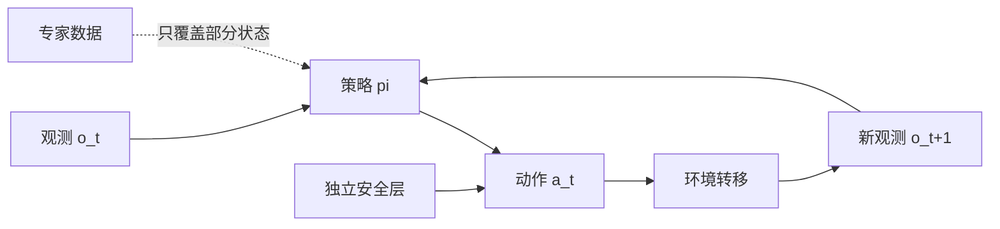

# 第13章 模仿学习、误差累积与动作分块

> 状态：`drafted`
> 资料核查日期：2026-08-31
> 关联实验：`EXP-13-01`
> 关联声明：`CLAIM-13-01`～`CLAIM-13-04`
> 关联图表：`FIG-13-01` / `TAB-13-01`
> 资源档位：S / M
> GPU 状态：待验证

## 本章契约

### 核心问题

为什么一个在专家数据上动作误差很小的策略，进入闭环后仍可能失败；动作分块又如何在计算效率、动作连贯性和扰动响应之间取舍？

### 先修知识

- 已具备：监督学习、训练/验证划分、均方误差；
- 本章补齐：行为克隆、协变量偏移、DAgger 直觉、动作块与时间集成；
- 不要求：3D 视觉、机器人硬件、强化学习推导或大型策略训练经验。

第3章尚未完成，因此本文把状态、观测和动作的最小定义直接给出。其坐标系与控制接口仍是暂定接口，待第3章完成后再做一致性审查。

### 非目标

- 不把 CPU 标量反例当作 ACT 或真实机器人性能；
- 不在无 GPU 设备上下载 LeRobot 数据或训练神经策略；
- 不认为动作块越长越好，也不让学习策略绕过独立安全层；
- 不把单一开环动作误差当作部署证据。

### 学完后的可验证产出

读者应能解释行为克隆为何产生分布偏移，运行一个误差累积反例，为动作块选择可审计的长度，并为机器人或车辆补齐闭环、安全和时延指标。

## 13.1 放回闭环地图

策略把观测或状态 `o_t` 映射为动作 `a_t`，环境再产生下一状态。监督学习只看专家轨迹上的条件分布；部署时，策略自己的动作改变下一次输入。



*FIG-13-01：模仿策略的闭环接口。虚线表示专家数据只约束其访问过的状态；安全层不属于策略权重。来源：本书原创，MIT，2026-08-31。*

从 CV 角度看，行为克隆很像图像到标签的监督学习，但标签不再只是类别，而是会改变下一帧输入的动作。分类器的一次错误通常不改变下一张测试图；策略的一次偏移会改变后续相机视角、接触关系或车道位置。这是从开环视觉到具身决策最重要的接口变化。

## 13.2 行为克隆：简单基线，严格协议

给定专家数据集 `D={(o_t,a_t*)}`，最基本的行为克隆最小化：

\[
\mathcal{L}_{BC}(\theta)=\mathbb{E}_{(o,a^*)\sim D}\left[\ell(\pi_\theta(o),a^*)\right].
\]

连续动作常用 L1、L2 或带概率分布的负对数似然；离散动作可以使用交叉熵。损失的数值只有在动作单位、归一化、采样频率和掩码一致时才可比较。关节角、末端位姿、速度与车辆曲率并不是可互换的标签空间。

行为克隆应该作为第一条可复现基线：实现简单、调试信号清楚，也能暴露数据接口错误。但它隐含训练状态分布 `d_expert` 与部署分布 `d_pi` 足够接近。闭环中的小误差会把策略带到专家数据较少覆盖的状态，后续预测可能更差。

`CLAIM-13-01`（fact）：监督动作损失只约束专家数据分布上的条件预测，不能单独保证策略自身诱导分布上的闭环性能。

## 13.3 DAgger 的核心不是一个缩写

DAgger 的直觉是：让当前策略运行，收集它真正会访问的状态，再请专家为这些状态标注正确动作并聚合回训练集。它把训练数据向 `d_pi` 移动，但代价是需要在线专家、可靠回滚与安全采集。真实机器人和自动驾驶中，这些条件往往比训练本身昂贵。

没有在线专家时，可以使用扰动恢复数据、离线重标注、仿真纠错或保守拒绝机制，但不能把它们自动称作 DAgger。评测必须单独报告未扰动任务、恢复任务和分布外状态。

## 13.4 为什么要预测动作块

单步策略每一步重新推理，反应新观测快，却可能受到推理时延、观测噪声和动作抖动影响。动作分块一次预测未来 `K` 个动作：

\[
\hat{A}_{t:t+K-1}=\pi_\theta(o_{\le t}).
\]

ACT（Action Chunking with Transformers）把动作块建模为条件生成问题，并在论文中使用时间集成平滑不同时间预测出的重叠动作。论文报告的是其指定双臂操作任务和数据设置，不是本书复现结果。官方 [LeRobot](https://github.com/huggingface/lerobot) 当前提供 ACT 实现与训练/评测接口；真正运行前必须锁定仓库 commit、数据版本、相机和动作字段。

动作块长度 `K` 不是纯模型超参数：

- `K` 小：重规划频繁、反应新事件快，但推理开销较高；
- `K` 大：动作更连贯、调用次数少，但未完成块可能在突发事件后变陈旧；
- 时间集成：可平滑重叠预测，但会引入权重、缓存和额外延迟；
- 提前重规划：能缩短反应时间，但必须定义触发条件和安全优先级。

训练动作块时必须记录：控制频率、块长度对应的真实秒数、是否执行完整块、重叠方式、推理延迟、丢帧和终止处理。只写 `chunk_size=100` 没有跨系统意义。

## 13.5 EXP-13-01：两个协议反例

S 档实验使用 Python 标准库，不训练模型。第一部分令专家动作始终为零，假想策略每步只有 `0.02` 的固定动作偏差；teacher-forced 动作 RMSE 仍是 `0.02`，但 20 步积分后的状态偏差为 `0.40`。第二部分枚举 16 步任务中所有可能的扰动时刻，统计动作块等到下一个边界才重规划的延迟。

```bash
make ch13-test-local
make ch13-smoke-local
make ch13-smoke
```

| 设置 | 规划调用 | 平均反应延迟/步 | 最大延迟/步 | 2 步期限通过率 |
| --- | ---: | ---: | ---: | ---: |
| chunk 1 | 16 | 0.000 | 0 | 100.0% |
| chunk 4 | 4 | 1.600 | 3 | 73.3% |
| chunk 8 | 2 | 3.733 | 7 | 33.3% |

*TAB-13-01：`EXP-13-01` 固定 fixture 的动作块权衡。数值是离散协议反例，不是 ACT benchmark。*

`CLAIM-13-02`（result）：在 `EXP-13-01` 中，每步 `0.02` 的动作偏差在 20 步后形成 `0.40` 的状态偏差；将块从 1 增到 8，使调用次数从 16 降到 2，同时最大陈旧动作等待从 0 增到 7 步。

这只证明两类风险在逻辑上可能发生。真实反馈控制可能抑制偏差，策略也可能在块内预测不同动作；反过来，接触任务和高速驾驶中的微小误差可能造成非线性后果。因此 smoke 是评测契约测试，不是效果量估计。

## 13.6 从 BC 到 ACT 的 M 档路径

有 GPU 后，M 档使用 LeRobot 中同一数据划分比较单步 BC 与 ACT。默认上限为 24GB 单卡，先用小图像分辨率、短序列和少量 episode 做过拟合检查；若显存超限就降低 batch/序列，而不是默默换成双 80GB。报告至少包含：

1. 专家状态上的动作误差及单位；
2. 闭环成功率、失败类别和每任务置信区间；
3. `K`、实际秒数、推理 P50/P95、重规划次数；
4. chunk 1 对照、时间集成消融和扰动恢复测试；
5. 数据、代码、checkpoint、容器和随机种子。

当前未下载数据、未训练 BC/ACT、未验证显存，因此 M 档保持 `pending`。

## 13.7 自动驾驶：动作块首先是安全时域

驾驶策略也可能一次输出未来若干转向、加速度或轨迹点。较长时域能减少抖动、表达连贯变道，但前车切入、信号变化或定位跳变会让旧计划失效。块长度必须同时换算为控制秒数，并与感知频率、制动距离和最小风险策略联动。

`CLAIM-13-03`（recommendation）：自动驾驶动作块应报告实际持续时间、最坏重规划延迟和事件触发重规划，而不是只报告离散 token 数。

学习策略的输出不得直接绕过约束检查。至少需要独立的碰撞/道路边界检查、超时监测、控制限幅和最小风险停车。仿真成功也不能替代真实车辆安全验证。

`CLAIM-13-04`（inference）：在突发事件频繁或制动时域很短的驾驶场景中，长动作块的陈旧风险通常比静态操作任务更突出；具体安全界限必须由车辆动力学和系统时延验证。

## 13.8 结果、资源与边界

| 类型 | 声明/结果 | 来源 | 状态 | 限制 |
| --- | --- | --- | --- | --- |
| 本书结果 | 小动作偏差可积分为大状态偏差 | `EXP-13-01` | CPU smoke | 手工标量动力学 |
| 本书结果 | 长块减少调用但增大反应延迟 | `EXP-13-01` | CPU smoke | 离散边界模型 |
| 论文方法 | ACT 生成动作块并使用时间集成 | ACT 论文 | `[P,R0]` | 本书未训练 |
| 官方实现 | LeRobot 提供 ACT 策略接口 | 官方仓库 | `[O,R1]` | 版本会漂移 |

S 档下载量 0、无 GPU、无外部数据，代码和 fixture 按 MIT 发布。M 档数据与模型许可须在下载前逐项核验；当前机器只执行宿主与 Docker CPU smoke，不把硬件购置设为前提。

常见失效包括动作单位错配、时间戳错位、终止帧泄漏、训练/测试 episode 重叠、相机缺失、闭环初始状态不一致、长块无法响应扰动以及策略在 OOD 时过度自信。任何动作策略都需要拒绝/降级和独立安全层。

## 小结

行为克隆是必要但不充分的基线：开环动作误差测的是专家分布上的拟合，闭环评测才观察策略制造的输入分布。动作分块用更少推理和更连贯动作换取潜在反应延迟；它必须与控制频率、重规划、安全层一起定义。

## 练习

1. **概念判断**：两个策略动作 MSE 相同，但其中一个只在序列末端犯错，能否据此认为闭环风险相同？
2. **代码实验**：修改 `EXP-13-01` 的 horizon 和 deadline，画出不同 `K` 的调用—延迟 Pareto 前沿。
3. **协议设计**：为 ACT 实验列出避免 episode 泄漏的划分与三类闭环失败。
4. **迁移分析**：将 chunk 8 分别换算到 20Hz 车辆控制和 5Hz 机械臂控制，讨论安全含义。

## 延伸阅读

- Zhao et al., [Learning Fine-Grained Bimanual Manipulation with Low-Cost Hardware](https://arxiv.org/abs/2304.13705)，`[P,R0]`，ACT 原论文；
- [LeRobot 官方仓库](https://github.com/huggingface/lerobot)，`[O,R1]`，策略、数据和评测接口；
- Ross et al., [A Reduction of Imitation Learning and Structured Prediction to No-Regret Online Learning](https://proceedings.mlr.press/v15/ross11a.html)，`[P]`，DAgger。

## 下一章接口

第14章会把单峰回归替换为生成式动作分布。本文的闭环协议、chunk 对照、时延和安全门禁继续适用；若不运行 GPU 实验，可以只使用 `EXP-13-01` 理解接口后继续阅读。

## 验收与审查记录

```text
本地检查：make check-local
严格检查：make check
章节 smoke：make ch13-smoke
文档构建：make docs-build
```

- 内容审查：修改中；
- 代码审查：修改中；
- 一致性审查：未开始（等待第3章接口）；
- 教学审查：修改中；
- 审查记录路径：待批次 B 交叉审查；
- 已知限制：未运行 LeRobot、BC 或 ACT，GPU 与数据资源均待验证。
