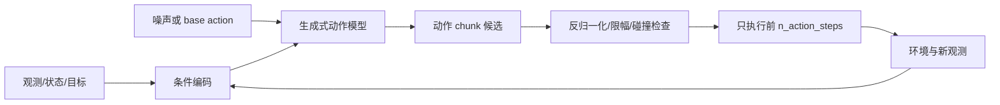

# 第14章 生成动作：Diffusion Policy 与 Flow Matching

> 状态：`reviewed`
> 资料核查日期：2026-09-01
> 关联实验：`EXP-14-01`
> 关联声明：`CLAIM-14-01`～`CLAIM-14-08`
> 关联图表：`FIG-14-01` / `TAB-14-01`～`TAB-14-04`
> 资源档位：S / M / L1 / L2
> GPU 状态：待验证

## 本章契约

### 核心问题

当同一观测对应多个合理动作时，为什么逐维均方误差可能生成“平均但无效”的动作？Diffusion Policy 与 Flow Matching 如何把策略改写为条件分布采样，又怎样把采样步数、动作时域和闭环时延放进同一合同？

### 先修知识

- 已具备：监督回归、概率分布和第13章的行为克隆、动作分块与闭环误差；
- 本章补齐：多峰动作、条件去噪、向量场积分、采样预算与 receding horizon；
- 不要求：图像扩散模型经验、随机微分方程推导、Push-T/LIBERO、机器人硬件或 GPU。

第5章已建立 diffusion 去噪与 flow 概率路径的共同基础；本章只把条件分布的输出从图像/未来迁移到动作块，并增加 receding horizon、采样预算和执行安全约束。

### 非目标

- 不把一个解析双峰 fixture 当作 Diffusion Policy 或 flow policy 复现；
- 不声称生成式策略必然优于 MSE、ACT、自回归动作 token 或分层规划；
- 不把生成样本多样性等同闭环成功、校准或安全；
- 不在当前无 GPU 设备下载 Push-T/LIBERO 或 openpi checkpoint；
- 不让随机采样动作绕过单位还原、碰撞检查、限幅与急停。

### 学完后的可验证产出

读者应能识别多峰动作问题，解释 diffusion 与 flow 的训练/采样接口，为动作 chunk 设计公平对照，计算一次重规划的模型调用预算，并为机器人和自动驾驶补齐闭环、安全和随机性协议。

## 14.1 从“预测一个动作”到“采样一个条件分布”

行为克隆常训练确定性回归器。对平方损失，给定观测 `o` 的最优输出是条件均值：

\[
\pi^*_{\mathrm{MSE}}(o)=\mathbb{E}[A\mid o].
\]

若绕过障碍的左、右轨迹都有效，均值却可能正对障碍；若两种抓取姿态分别满足接触约束，逐关节平均可能两者都不可达。这不是 MSE 算错，而是单个点估计无法表达多峰分布。加入历史、目标、语言或地图可能消除部分歧义；仍存在的随机性才需要条件分布。



*FIG-14-01：生成式动作策略的 receding-horizon 接口。采样器产生候选，安全与执行协议仍在模型之外。来源：本书原创，MIT，2026-08-31。*

`CLAIM-14-01`（fact）：确定性 MSE 回归学习条件均值；只有当条件动作分布、损失和可行域满足相应条件时，均值才是有效动作。多峰存在不意味着每个任务都必须使用生成式策略。

## 14.2 Diffusion Policy：在动作空间反复去噪

扩散策略把一段干净动作 `A^0` 逐步扰动为噪声动作，并训练网络在观测条件下预测噪声、干净样本或等价参数化。一种常见前向表达是：

\[
A^k=\sqrt{\bar\alpha_k}A^0+\sqrt{1-\bar\alpha_k}\,\epsilon,
\quad \epsilon\sim\mathcal{N}(0,I).
\]

推理从噪声 action chunk 开始，调用去噪网络多次，得到一个条件动作样本。不同初始噪声可以落到不同模式；时间卷积/Transformer、视觉编码器和 proprioception 提供条件。

[Diffusion Policy 官方项目](https://diffusion-policy.cs.columbia.edu/)和[代码仓库](https://github.com/real-stanford/diffusion_policy)公开了论文、仿真数据入口、配置、日志和 checkpoint `[P/O,R1]`。公开资产使协议可审计，但本书没有执行其环境、训练或论文表格。官方 README 明确区分 Linux/NVIDIA 仿真环境与不完整的 macOS benchmark 支持，这也是本书优先 Docker、当前不在本机强配环境的原因。

Diffusion Policy 的关键不是“把图像扩散代码的输出维度换成关节数”，而是：

- 输出是带单位、上下限和控制频率的动作序列；
- 相邻动作的连续性和执行时序直接影响动力学；
- 一个非法像素只影响外观，一个非法动作可能立刻碰撞；
- 采样步数进入控制环时延，而图像生成通常没有硬实时重规划；
- 训练 padding、终止和动作归一化会改变部署行为。

## 14.3 Flow Matching：学习把 base 分布搬到动作分布

Flow Matching 学习条件向量场 `v_θ(A,t,o)`，使 base action 沿常微分方程流向数据动作：

\[
\frac{dA_t}{dt}=v_\theta(A_t,t,o),\qquad A_0\sim p_0.
\]

训练可直接回归所选概率路径的目标速度；推理用 Euler、Heun 或其他 ODE solver 积分。直线路径/rectified flow 可能允许较少求解步，但实际质量取决于配对、路径、向量场误差、solver、维度和条件分布。不能从“一步 oracle 直线可到达”推出“一步 learned flow 足够”。

[Flow Matching for Generative Modeling](https://arxiv.org/abs/2210.02747) 给出通用连续归一化流训练框架 `[P,R0]`。机器人领域的公开桥接案例是 [openpi](https://github.com/Physical-Intelligence/openpi)：截至核查日期，其 README 将 π0 描述为 flow-based VLA，并说明公开 π0.5 训练/推理当前只支持 flow matching head `[O,R1]`。这些大模型属于第15章；本章只借它说明 flow 已成为动作生成接口，不引用其性能作为本书结果。

Diffusion 与 flow 不应按营销标签做速度结论。公平比较至少固定：观测编码器、训练数据与划分、动作表示、chunk/horizon、参数量、训练更新、采样 solver、模型调用数、硬件、batch、随机种子与闭环协议。

## 14.4 动作 horizon、执行 horizon 与重规划

三个长度必须分开：

- `observation_horizon`：策略读取多少历史；
- `prediction_horizon`：一次生成多少未来动作；
- `execution_horizon` / `n_action_steps`：生成后实际执行多少步再重规划。

预测 32 步不等于盲执行 32 步。receding horizon 可以每次只执行前 4 步，再用新观测生成新 chunk。较短执行 horizon 响应快，却增加生成调用；较多去噪/ODE 步可能提高样本精度，也增加端到端延迟。必须测量完整路径：传感器就绪、预处理、编码、采样、反归一化、安全检查、传输到首个动作，而非只测网络 kernel。

控制预算可写成 `T_control - T_nonmodel`，再除以一次目标 batch forward 的 P95 时间，得到最多可用的顺序 forward 数。这里必须同时记录 solver 步数 `K`、候选数 `N` 和 batch 容量 `B`。若每一步都能把候选放入 batch，抽象 forward 数是 `K⌈N/B⌉`；逐候选串行则是 `KN`。两者都有 `KN` 次 sample-model evaluation，但墙钟和显存不同。batch 变大后的 P95 不会自动等于单样本 P95，最终仍须实测端到端 deadline。

若超预算，应明确选择更少 solver 步、减少候选、缓存视觉特征、降低模型/输入、异步推理或安全降级；不能只用平均 FPS 掩盖尾延迟，也不能只比较 `K` 而漏掉 `N` 与 batch 策略。

## 14.5 EXP-14-01：双峰动作与采样接口

S 档 fixture 设同一观测下有两个等权有效标量动作 `-1` 和 `+1`，容差为 `0.25`。它比较：

- `mse_mean`：输出两个演示的条件均值；
- `mode_refinement`：从 10 个固定 base 样本迭代靠近最近模式，仅模拟多步调用接口；
- `oracle_straight_flow`：已知 base—target 配对后沿直线积分，只验证 solver 合同。

```bash
make ch14-test-local
make ch14-smoke-local
make ch14-smoke
```

| 方法 | 平均最近模式距离 ↓ | 无效动作率 ↓ | 覆盖模式数 ↑ | 每样本模型求值数 |
| --- | ---: | ---: | ---: | ---: |
| MSE mean | 1.000000 | 100% | 0 | 1 |
| mode refinement，1 步 | 0.275000 | 40% | 2 | 1 |
| mode refinement，4 步 | 0.034375 | 0% | 2 | 4 |
| oracle straight flow，1 步 | 0.000000 | 0% | 2 | 1 |

*TAB-14-01：`EXP-14-01` 固定解析结果。后两类知道或使用手工模式方向，不是 learned diffusion/flow 性能。*

`CLAIM-14-02`（result）：`EXP-14-01` 中，MSE 均值为 0，样本均值也为 0，但相对 `±1` 两个有效模式的无效率为 100%。样本均值“平衡”没有证明动作有效。

`CLAIM-14-03`（result）：手工 refinement 从 1 步增加到 4 步时，平均最近模式距离从 `0.275` 降到 `0.034375`，每样本模型求值从 1 增到 4。它只展示求值—精度接口，不代表 DDPM 的收敛率。

`CLAIM-14-04`（result）：oracle straight flow 在一步后到达两个指定模式，因为目标配对和常速度都已知；该结果不能用于比较 learned flow 与 learned diffusion。

实验另设每次重规划最多 8 个顺序 forward 的抽象预算，并固定 10 个候选：

| 采样调度 | sample-model evaluations | 顺序 forward | 8-forward 预算内 |
| --- | ---: | ---: | ---: |
| 4 步、10 候选、逐候选串行 | 40 | 40 | false |
| 4 步、10 候选、单 batch | 40 | 4 | true |
| 16 步、10 候选、单 batch | 160 | 16 | false |

*TAB-14-03：候选数、solver 步数与 batching 的抽象预算。它不测 batch 相关 P95、显存或并行效率，不能写成实时性能。*

`CLAIM-14-07`（result）：`EXP-14-01` 的 10 候选、4 步 refinement 共有 40 次 sample-model evaluation；逐候选串行需要 40 个 forward，而一次容纳 10 个候选时为 4 个 forward。旧的“只比较步数与预算”规则会漏算候选数。

fixture 还把“接近演示模式”和“当前场景允许执行”分开。手工安全门把左模式 `[-1.25,-0.75]` 设为当前场景阻塞区：

| 候选集 | 候选 / 模式有效 | 安全拒绝 / 接受 | 结果 |
| --- | ---: | ---: | --- |
| 正负模式各 5 个 | 10 / 10 | 5 / 5 | 选择首个安全候选 `+1` |
| 两个左模式 | 2 / 2 | 2 / 0 | 执行确定性 fallback `0` |

*TAB-14-04：生成有效性与独立安全筛选的分母。阻塞区和 fallback 是手工教学合同，不是碰撞器或安全策略。*

`CLAIM-14-08`（result）：fixture 中 10 个候选全部靠近数据模式，但独立门禁只接受 5 个；当两个模式有效候选都落入阻塞区时，系统不继续随机重采样，而是使用确定性 fallback。模式有效率不能替代场景安全接受率。

## 14.6 怎么评测多峰动作

只报动作 MSE 会奖励均值，单次成功率又可能掩盖模式坍塌。至少组合：

| 维度 | 指标或检查 | 要避免的误读 |
| --- | --- | --- |
| 单样本有效性 | 最近有效轨迹距离、约束违反、碰撞 | oracle 必须独立于模型 |
| 多样性 | 模式覆盖、条件熵、轨迹聚类 | 多样不等于正确 |
| 校准 | 样本频率与真实条件频率 | 少量 seed 不能估概率 |
| 闭环 | 成功率、恢复、碰撞、干预 | 开环似然不能代替 |
| 效率 | 调用数、P50/P95、deadline miss | 平均 FPS 不代表控制时延 |
| 稳定性 | seed/solver/步数敏感性 | 只挑最佳随机样本 |

*TAB-14-02：生成式动作策略的评测矩阵。*

评估单个观测时应保存多个随机样本；评估策略时，每个 seed 必须进入独立闭环 episode，不能从多个候选中用真实未来“事后挑最好”。若用 critic、规划器或碰撞器选样本，要把选择器算进系统并单独消融，同时报告 `generated / model-valid / safety-accepted / executed` 四个分母和无候选时的 fallback 次数。

`CLAIM-14-05`（recommendation）：生成式策略比较应同时报告单样本有效性、模式覆盖、闭环 outcome 与完整采样时延；用 oracle 从多个样本事后选优会高估可部署性能。

## 14.7 自动驾驶正文：多峰轨迹不是随机转向

同一驾驶场景可能允许保持车道、在空隙内变道或减速等待。生成式策略适合建模多条轨迹候选，但必须区分：

- 其他交通参与者未来的不确定性；
- ego 可选择的多种意图；
- 低层控制噪声；
- 地图、法规和安全约束下真正可行的轨迹。

如果训练日志里左右变道都出现，逐点平均轨迹可能压线；diffusion/flow 可以保留分支，却也可能采到道路外、违反动力学或互相矛盾的动作。工程上更常让模型生成有限时域轨迹/控制 chunk，再由道路边界、车辆动力学、碰撞预测和舒适性代价筛选，并只执行短前缀。

`CLAIM-14-06`（recommendation）：自动驾驶生成式动作头应把轨迹 frame、时间步、曲率/加速度约束、其他主体预测协议和独立安全筛选写进合同；随机种子不能决定是否执行紧急制动。

急刹、避碰和最小风险停车不能依赖“多采几个样本或许会出现安全动作”。若所有候选无效、推理超时或观测过期，系统应进入确定性的安全降级。正文评测同时报告路线完成、碰撞、舒适度、干预、模式覆盖和 deadline miss，而不是只用 trajectory ADE/FDE。

## 14.8 机器人正文：接触、多解与动作可执行性

机器人操作中的多峰来自不同抓取姿态、绕障方向、接触顺序和本体冗余。生成动作前必须统一关节/末端表示、frame、角度周期、夹爪编码、控制频率与归一化；生成后需要逆运动学、整臂碰撞、速度/力限制和 workspace 检查。

图像生成中轻微抖动可能只是纹理误差，动作 chunk 中的高频抖动会激发控制器或破坏接触。时间平滑不能盲目后处理：它可能把两种离散策略平均成不可行路径。优先让模型生成时间一致的 chunk，并在任务约束下筛选。

## 14.9 开源实现与资源路线

S 档 `EXP-14-01` 使用 Python 标准库、CPU、零下载与 MIT fixture，只验证多峰、候选—batch 预算和独立安全筛选接口。

M 档优先使用 [LeRobot](https://github.com/huggingface/lerobot) 中的 Diffusion Policy 接口，在同一 Push-T 或小型许可数据划分上比较 MSE chunk policy 与 diffusion policy。[当前官方配置](https://github.com/huggingface/lerobot/blob/main/src/lerobot/policies/diffusion/configuration_diffusion.py)明确区分 `n_obs_steps`、`horizon`、`n_action_steps`、`num_train_timesteps` 与 `num_inference_steps`；未指定推理步数时会回落到训练 timestep 数，sample clipping 还要求动作归一化范围与之匹配，padding loss mask 则需显式选择 `[O,R1]`。这些是必须冻结的配置，不是通用推荐值。默认目标为 24 GB 单卡以内；先跑状态输入或低分辨率视觉、小 batch、少量 episode 和 2–3 seeds。当前未下载、未训练、未验证显存。

L1 可加入 flow-matching action head，并在固定 backbone/数据下按模型调用数和墙钟时延比较。openpi README 的上游估算是推理需大于 8 GB、LoRA 微调大于 22.5 GB、全量微调大于 70 GB；这是官方当前配置说明 `[O,R1]`，不是本书实测。仓库同时提供 JAX 与 PyTorch 路线，但当前 PyTorch 说明仍列出不支持 π0-FAST、mixed precision、FSDP、LoRA 与 EMA 等差异，不能跨后端照搬显存结论。LoRA 已贴近 24 GB 边界，必须先做显存预检；full fine-tune 属于可选 L2，最多 2×80 GB，不是必做，也不要求购置硬件。

Push-T、LIBERO、LeRobot 数据、官方代码、checkpoint 与仿真资产分别核验许可和体积。Docker 镜像只负责环境锁定，不应在默认 smoke 中自动下载大数据或权重。

## 14.10 失效模式与安全边界

重点失效包括：条件被忽略、模式坍塌、无约束多样性、动作归一化/反归一化错误、角度跨界、padding 泄漏、采样 seed 选择偏差、solver 步数不足、尾延迟超时、chunk 陈旧、视觉与 proprioception 不同步，以及选择器利用不真实的 world model。

上线前必须保存输入时间戳、随机种子、采样轨迹、候选动作、安全筛选原因、实际执行前缀和闭环结果。任何候选都要经过确定性的范围、碰撞、速度/力和新鲜度门禁；生成式策略不是安全层。

## 14.11 结果与证据边界

| 类型 | 声明/结果 | 来源 | 状态 | 限制 |
| --- | --- | --- | --- | --- |
| 本书结果 | 条件均值落在双峰无效区 | `EXP-14-01` | CPU smoke | 一维对称解析 fixture |
| 本书结果 | refinement 求值—模式距离权衡 | `EXP-14-01` | CPU smoke | 不是 DDPM/learned denoiser |
| 本书结果 | oracle straight flow 一步到目标 | `EXP-14-01` | CPU smoke | 已知配对，不能比较方法 |
| 本书结果 | 候选—batch forward 预算与安全筛选 | `EXP-14-01` | CPU smoke | 抽象计数与手工阻塞区 |
| 论文/开源 | Diffusion Policy 方法与官方资产 | 论文/官方仓库 | `[P/O,R1]` | 本书未运行 |
| 论文 | Flow Matching 通用训练框架 | 原论文 | `[P,R0]` | 非机器人 benchmark 复现 |
| 开源案例 | openpi flow action head | 官方仓库 | `[O,R1]` | 大型 VLA，本书未下载 |
| 未验证 | 24 GB 内 Push-T diffusion/flow 对照 | 后续 M/L1 | planned | GPU、数据、时延待测 |

## 小结

生成式动作策略解决的不是“回归不够时髦”，而是条件动作分布可能有多个有效模式。Diffusion 通过反复去噪采样，Flow Matching 通过向量场搬运 base 样本；两者都必须回到动作表示、chunk、调用预算、闭环 outcome 和安全门禁。模式覆盖、采样速度与控制安全是不同证据，不能互相替代。

## 练习

1. **均值反例**：把有效模式改为 `-2` 与 `+1`，计算条件均值和不同权重下的有效性。
2. **采样预算**：给定控制周期 50 ms、非模型开销 18 ms、单次调用 P95 7 ms，最多允许几步？
3. **公平对照**：为 Push-T 的 MSE、diffusion、flow 三个策略列出必须固定的 10 个变量。
4. **选择偏差**：解释为什么从 32 个样本中用真实终点挑最好不是合法在线评测。
5. **自动驾驶迁移**：设计保持/变道/减速三模式轨迹评测，并定义无有效候选时的降级动作。

## 延伸阅读

- Chi et al., [Diffusion Policy](https://diffusion-policy.cs.columbia.edu/) 与[官方代码](https://github.com/real-stanford/diffusion_policy)，`[P/O,R1]`；
- Lipman et al., [Flow Matching for Generative Modeling](https://arxiv.org/abs/2210.02747)，`[P,R0]`；
- Hugging Face, [LeRobot 官方仓库](https://github.com/huggingface/lerobot)，`[O,R1]`，包含 Diffusion Policy 配置；
- Physical Intelligence, [openpi 官方仓库](https://github.com/Physical-Intelligence/openpi)，`[O,R1]`，flow-based VLA/action head 案例。

## 下一章接口

第15章把这里的动作 horizon、采样预算、随机性、闭环和安全合同复用到离散 action token、连续回归、diffusion/flow action expert 与双系统架构中。

## 验收与审查记录

```text
本地检查：make check-local
严格检查：make check
章节 smoke：make ch14-smoke
文档构建：make docs-build
```

- 内容审查：通过；
- 代码审查：通过；
- 一致性审查：通过（第5章生成基础、第13章执行时域与第15章动作 schema 接口已核对）；
- 教学审查：通过；
- 审查记录路径：`reviews/ch14-generative-budget-review-2026-09-01.md`；
- 已知限制：没有训练 Diffusion Policy/flow policy、下载数据或 checkpoint，也未验证 GPU 与真实时延；
- 下一步：后续 M 档实验在具备 GPU 时验证显存、墙钟时延与闭环指标，不用解析 fixture 替代模型结果。
