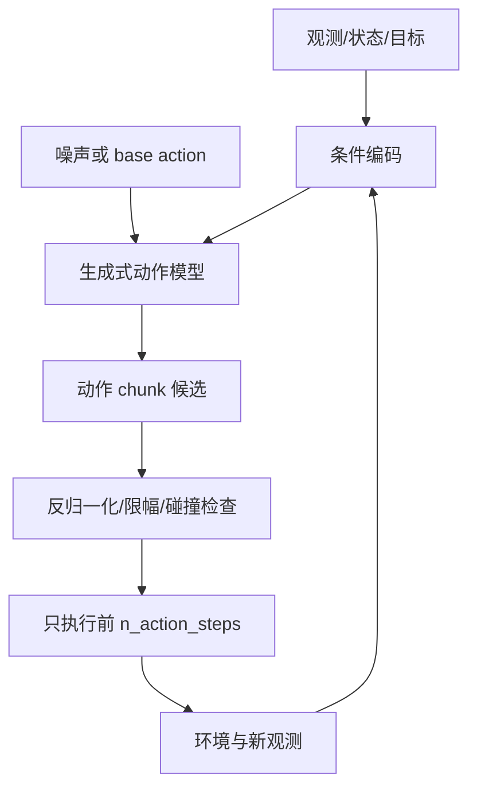

# 第14章 生成动作：Diffusion Policy 与 Flow Matching

## 本章契约

### 核心问题

当同一观测对应多个合理动作时，为什么逐维均方误差可能生成“平均但无效”的动作？Diffusion Policy 与 Flow Matching 如何把策略改写为条件分布采样，又怎样把采样步数、动作时域和闭环时延放进同一合同？

### 先修知识

- 已具备：监督回归、概率分布和第13章的行为克隆、动作分块与闭环误差；
- 本章补齐：多峰动作、条件去噪、向量场积分、采样预算与 receding horizon；
- 不要求：图像扩散模型经验、随机微分方程推导、Push-T/LIBERO、机器人硬件或 GPU。

第5章已建立 diffusion 去噪与 flow 概率路径的共同基础；本章只把条件分布的输出从图像/未来迁移到动作块，并增加 receding horizon、采样预算和执行安全约束。

### 非目标

- 不把一个解析双峰 fixture 当作 Diffusion Policy 或 flow policy 复现；
- 不声称生成式策略必然优于 MSE、ACT、自回归动作 token 或分层规划；
- 不把生成样本多样性等同闭环成功、校准或安全；
- 不把下载 Push-T、LIBERO 或 openpi checkpoint 设为理解生成式动作的前提；
- 不让随机采样动作绕过单位还原、碰撞检查、限幅与急停。

### 学完后的可验证产出

读者应能判断动作多峰来自信息缺失、行为选择还是数据混合，解释 diffusion 与 flow 如何表示条件动作分布，并区分生成分布、候选选择分布与最终执行策略。读者还应能从滚动时域、时延和安全约束分析生成式动作，而不是把样本多样性直接解释为决策能力。

## 14.1 从“预测一个动作”到“采样一个条件分布”

行为克隆常训练确定性回归器。对平方损失，给定观测 `o` 的最优输出是条件均值：

\[
\pi^*_{\text{MSE}}(o)=\mathbb{E}[A\mid o].
\]

若绕过障碍的左、右轨迹都有效，均值却可能正对障碍；若两种抓取姿态分别满足接触约束，逐关节平均可能两者都不可达。这不是 MSE 算错，而是单个点估计无法表达多峰分布。加入历史、目标、语言或地图可能消除部分歧义；仍存在的随机性才需要条件分布。



*图 14-1：生成式动作策略的 receding-horizon 接口。采样器产生候选，安全与执行协议仍在模型之外。来源：本书原创，CC BY-NC 4.0，2026-08-31。*<!-- INTERNAL_ASSET_ID: FIG-14-01 -->

<!-- CLAIM_META: CLAIM-14-01 fact -->
确定性 MSE 回归学习条件均值；只有当条件动作分布、损失和可行域满足相应条件时，均值才是有效动作。多峰存在不意味着每个任务都必须使用生成式策略。

### 14.1.1 多峰从哪里来

动作条件分布出现多个峰，至少可能有四种来源。第一，任务本身允许多个等价选择，例如从障碍物左右绕行；第二，观测缺少消歧信息，例如看不到目标身份或操作者意图；第三，数据混合了不同专家、任务阶段或控制风格；第四，系统对未来交互存在不可约不确定性。它们在直方图上都可能表现为多峰，却不应采用同一种解释。

如果补充目标、历史或地图后峰消失，原问题主要是条件不足，而不是必须保留随机性。如果不同专家采用不同但都可靠的规范，模型需要显式风格或意图变量，避免在一次任务中反复切换。如果峰来自其他主体尚未作出的选择，策略还需要随着新证据更新信念。生成模型只能表达训练条件下的分布结构，不能替代缺失的任务定义。

还要区分数据不确定性与模型不确定性。多次采样展现的通常是模型所表示的条件数据分布，也就是在当前条件下有哪些动作模式；它不直接告诉我们模型是否因为训练覆盖不足而无知。一个在分布外输入上过度自信的生成器也可以稳定地产生很多彼此不同的动作。因此，样本方差既不是通用置信度，也不是安全裕度。

### 14.1.2 学习示范分布不等于求解可行动作集合

生成式策略近似的是数据与训练目标共同定义的条件分布。未出现在示范中的安全动作可能得不到概率质量，示范中偶然出现的次优习惯却可能被忠实复现。反过来，一个动作靠近高密度模式，也只说明它像数据，不说明它满足当前几何、动力学或法规约束。

这一区分可以表述为三个集合：数据支持集描述示范出现过什么，可行集描述系统能够执行什么，安全可接受集描述当前情境允许执行什么。三者通常重叠但不相等。生成模型负责提出候选，约束检查与决策准则负责判断候选；若希望模型直接学习可行性或价值，也必须说明监督信号和失效边界。

## 14.2 Diffusion Policy：在动作空间反复去噪

扩散策略把一段干净动作 $A^0$ 逐步扰动为噪声动作，并训练网络在观测条件下预测噪声、干净样本或等价参数化。一种常见前向表达是：

\[
A^k=\sqrt{\bar\alpha_k}A^0+\sqrt{1-\bar\alpha_k}\,\epsilon,
\quad \epsilon\sim\mathcal{N}(0,I).
\]

推理从噪声 action chunk 开始，调用去噪网络多次，得到一个条件动作样本。不同初始噪声可以落到不同模式；时间卷积/Transformer、视觉编码器和 proprioception 提供条件。

[Diffusion Policy 官方项目](https://diffusion-policy.cs.columbia.edu/)和[代码仓库](https://github.com/real-stanford/diffusion_policy)公开了论文、仿真数据入口、配置、日志和 checkpoint `[P/O,R1]`。公开资产使协议可审计，但本书没有执行其环境、训练或论文表格。官方 README 明确区分 Linux/NVIDIA 仿真环境与不完整的 macOS benchmark 支持，这也是本书优先 Docker、当前不在本机强配环境的原因。

Diffusion Policy 的关键不是“把图像扩散代码的输出维度换成关节数”，而是：

- 输出是带单位、上下限和控制频率的动作序列；
- 相邻动作的连续性和执行时序直接影响动力学；
- 一个非法像素只影响外观，一个非法动作可能立刻碰撞；
- 采样步数进入控制环时延，而图像生成通常没有硬实时重规划；
- 训练 padding、终止和动作归一化会改变部署行为。

去噪时间 k 是生成算法内部的计算坐标，不是机器人或车辆的物理时间 t。一个长度为 H 的动作块在每个去噪步都会被整体更新，因此“去噪 16 步”和“预测未来 16 个控制步”是正交概念。前者决定一次采样需要多少顺序计算，后者决定输出覆盖多长物理时域。混淆二者会导致错误的时延预算和错误的控制解释。

动作归一化也不仅是数值预处理。扩散过程通常在归一化坐标中加入近似各向同性噪声，但不同关节、位置、角度和夹爪维度在物理空间中的容差并不相同。归一化方式实际上规定了模型眼中的距离几何；若缩放不当，训练损失会把物理意义不同的偏差当成同等大小。部署时还必须在反归一化后检查真实单位约束。

## 14.3 Flow Matching：学习把 base 分布搬到动作分布

Flow Matching 学习条件向量场 $v_\theta(A,t,o)$，使 base action 沿常微分方程流向数据动作：

\[
\frac{dA_t}{dt}=v_\theta(A_t,t,o),\qquad A_0\sim p_0.
\]

训练可直接回归所选概率路径的目标速度；推理用 Euler、Heun 或其他 ODE solver 积分。直线路径/rectified flow 可能允许较少求解步，但实际质量取决于配对、路径、向量场误差、solver、维度和条件分布。不能从“一步 oracle 直线可到达”推出“一步 learned flow 足够”。

[Flow Matching for Generative Modeling](https://arxiv.org/abs/2210.02747) 给出通用连续归一化流训练框架 `[P,R0]`。机器人领域的公开桥接案例是 [openpi README 快照 `215abfb`](https://github.com/Physical-Intelligence/openpi/blob/215abfb217dbac7d5f1273282331b9b1866c0479/README.md)：截至 2026-09-02，该 README 将 π0 描述为 flow-based VLA，并说明公开 π0.5 训练/推理只支持 flow matching head `[O,R1]`。这些大模型属于第15章；本章只借它说明 flow 已成为动作生成接口，不引用其性能作为本书结果。

Diffusion 与 flow 不应按营销标签做速度结论。公平比较至少固定：观测编码器、训练数据与划分、动作表示、chunk/horizon、参数量、训练更新、采样 solver、模型调用数、硬件、batch、随机种子与闭环协议。

两类方法的共同目标是从简单 base 分布得到条件动作样本，差别主要在训练参数化与采样动力学。扩散模型通常学习逐噪声层级的反向去噪关系，flow matching 学习沿所选概率路径的连续速度场；两者都可能采用不同离散求解器、步长与近似。因而不能仅凭“随机过程”或“ODE”判断谁更准确、确定或实时。实际策略是否随机，还取决于初始 base 样本、采样器设置和部署时是否固定 seed。

概率路径也不是物理动作轨迹。Flow 中从 base action 到 data action 的中间 $A_t$ 是生成空间中的插值状态，通常不会被执行，也不必满足机器人动力学；diffusion 中间噪声动作同理。安全检查应作用于最终候选及其物理时间序列，不能把生成过程的中间变量误读为系统将经过的状态。

## 14.4 从动作时域到采样预算

第13章已经把动作策略的时域统一为预测时域 $K_{\text{pred}}$、执行时域 $K_{\text{exec}}$、重规划间隔和 temporal ensemble，本章不再另立一套定义。配置中的 `prediction_horizon` 对应 $K_{\text{pred}}$，`execution_horizon` 或 `n_action_steps` 对应 $K_{\text{exec}}$；`observation_horizon` 描述输入历史长度，不属于动作时域。生成式策略在这套物理时间合同之外，还多出一条独立的**计算轴**：一次动作查询要进行多少次去噪或 ODE 求解，并生成多少个候选。

因此，预测 32 个控制步不等于盲执行 32 步，也不等于进行 32 次去噪。系统可以生成长度为 $K_{\text{pred}}=32$ 的 chunk，只执行 $K_{\text{exec}}=4$ 步后便用新观测重规划；与此同时，每个 chunk 可能经过若干次求解器更新。缩短 $K_{\text{exec}}$ 能更快吸收反馈，却会提高查询频率；增加求解步数可能改善离散化精度，却会侵占每次查询的实时预算。这两个取舍必须分别说明。

设求解器顺序步数为 `K`，同一观测下生成的候选数为 `N`，一次 forward 可容纳的候选数为 `B`。若每个求解步都按 batch 处理候选，抽象的顺序 forward 数为

\[
F_{\text{seq}}=K\left\lceil\frac{N}{B}\right\rceil,
\qquad
F_{\text{sample}}=KN.
\]

前者更接近墙钟关键路径，后者表示总 sample-model evaluations；两者不能互相替代。若候选逐个串行，$B=1$，二者都退化为 `KN`。增大 batch 可能减少顺序调用，却会增加显存，并改变单次 forward 的延迟分布。

实时约束还应覆盖完整动作查询，而不只是模型 kernel。把控制周期记为 $T_{\text{control}}$，感知同步、预处理、反归一化、安全检查和传输等非生成开销记为 $T_{\text{nonmodel}}$，目标 batch 下单次 forward 的高分位延迟记为 $t_{\text{fwd}}$，则下面的关系只能作为设计筛查：

\[
K\left\lceil\frac{N}{B}\right\rceil t_{\text{fwd}}
\le T_{\text{control}}-T_{\text{nonmodel}}.
\]

例如控制周期为 50 ms、非模型开销为 18 ms，且全部候选可放入同一 batch；若该 batch 的单次 forward P95 为 7 ms，算术上最多容纳 `floor((50-18)/7)=4` 个顺序求解步。第 5 步需要 35 ms，已超出剩余的 32 ms。这个计算不是实时部署保证，因为多次调用的尾延迟可能相关，P95 也不能简单相加；它的作用是尽早排除明显超预算的设计。最终证据必须来自目标 runtime 上完整查询链路的 P50/P95/P99、deadline miss rate 与安全余量。

若超预算，应明确选择减少求解步、减少候选、调整 batch、缓存条件编码、降低模型或输入规模，或者触发确定性的安全降级。异步推理只有在动作新鲜度、提交身份和过期取消规则都明确时才成立；平均 FPS 不能掩盖尾延迟，单独报告 `K` 也会漏掉 `N` 与 batch 策略。

### 14.4.1 滚动生成还需要跨查询一致性

receding horizon 缩短了盲执行时间，却引入新的决策问题：相邻查询可能从不同模式采样。机械臂上一刻选择从左侧绕过障碍，下一刻又采到右侧模式；车辆刚开始变道便重新采到保持车道模式。每个 chunk 单独看都可行，拼接后却可能振荡、走回头路或进入两种模式之间的危险区域。

跨查询一致性可以来自显式意图变量、历史动作条件、保留同一噪声语义、候选与上一计划的连续性代价，或高层策略对模式的持续约束。但一致性也不能僵化为永不改意图：新障碍和安全事件必须允许立即切换。需要区分正常情况下的承诺保持与异常情况下的计划失效，并把失效条件写入执行合同。

### 14.4.2 候选选择器是策略的一部分

若生成 N 个候选，再由 critic、规划器或安全门选择一个，最终执行分布不再等于生成器分布。选择规则会放大某些模式、压低另一些模式，也可能利用 critic 的系统误差。即使生成器频率校准良好，经过最大值选择后的策略也可能极度偏向被高估的候选；候选数越多，选择器被偶然高分样本利用的机会还可能越大。

因此系统应分别描述 proposal distribution、acceptance rule 与 selection rule。前者回答模型提出什么，第二项回答什么被允许，第三项回答允许集合中执行什么。所谓 best-of-N 收益是整个生成与选择系统的性质，不能只归功于生成模型。

## 14.5 双峰动作与采样接口（实验 14-1<!-- INTERNAL_ASSET_ID: EXP-14-01 -->）

S 档 fixture 设同一观测下有两个等权有效标量动作 `-1` 和 `+1`，容差为 `0.25`。它比较：

- `mse_mean`：输出两个演示的条件均值；
- `mode_refinement`：从 10 个固定 base 样本迭代靠近最近模式，仅模拟多步调用接口；
- `oracle_straight_flow`：已知 base—target 配对后沿直线积分，只验证 solver 合同。

<details markdown="1">
<summary>可选：验证本章证据</summary>

```bash
make ch14-test-local
make ch14-smoke-local
make ch14-smoke
```

</details>

| 方法 | 平均最近模式距离 ↓ | 无效动作率 ↓ | 覆盖模式数 ↑ | 每样本模型求值数 |
| --- | ---: | ---: | ---: | ---: |
| MSE mean | 1.000000 | 100% | 0 | 1 |
| mode refinement，1 步 | 0.275000 | 40% | 2 | 1 |
| mode refinement，4 步 | 0.034375 | 0% | 2 | 4 |
| oracle straight flow，1 步 | 0.000000 | 0% | 2 | 1 |

*表 14-1：实验 14-1 固定解析结果。后两类知道或使用手工模式方向，不是 learned diffusion/flow 性能。*<!-- INTERNAL_ASSET_ID: TAB-14-01 -->

<!-- CLAIM_META: CLAIM-14-02 result -->
实验 14-1<!-- INTERNAL_ASSET_ID: EXP-14-01 --> 中，MSE 均值为 0，样本均值也为 0，但相对 $\pm1$ 两个有效模式的无效率为 100%。样本均值“平衡”没有证明动作有效。

<!-- CLAIM_META: CLAIM-14-03 result -->
手工 refinement 从 1 步增加到 4 步时，平均最近模式距离从 `0.275` 降到 `0.034375`，每样本模型求值从 1 增到 4。它只展示求值—精度接口，不代表 DDPM 的收敛率。

<!-- CLAIM_META: CLAIM-14-04 result -->
oracle straight flow 在一步后到达两个指定模式，因为目标配对和常速度都已知；该结果不能用于比较 learned flow 与 learned diffusion。

实验另设每次重规划最多 8 个顺序 forward 的抽象预算，并固定 10 个候选：

| 采样调度 | sample-model evaluations | 顺序 forward | 8-forward 预算内 |
| --- | ---: | ---: | ---: |
| 4 步、10 候选、逐候选串行 | 40 | 40 | false |
| 4 步、10 候选、单 batch | 40 | 4 | true |
| 16 步、10 候选、单 batch | 160 | 16 | false |

*表 14-2：候选数、solver 步数与 batching 的抽象预算。它不测 batch 相关 P95、显存或并行效率，不能写成实时性能。*<!-- INTERNAL_ASSET_ID: TAB-14-02 -->

<!-- CLAIM_META: CLAIM-14-07 result -->
实验 14-1<!-- INTERNAL_ASSET_ID: EXP-14-01 --> 的 10 候选、4 步 refinement 共有 40 次 sample-model evaluation；逐候选串行需要 40 个 forward，而一次容纳 10 个候选时为 4 个 forward。旧的“只比较步数与预算”规则会漏算候选数。

### 14.5.1 best-of-N 的可靠性增益取决于候选相关性

假设单个候选通过 model-valid 与 safety gate 的边际概率都是手写的 $q=0.2$。若 N 个候选条件独立，至少一个通过的概率为

\[
P(\text{any accepted})=1-(1-q)^N.
\]

但边际概率不决定联合分布：若所有候选完全相关——例如 sampler 的条件忽略让它们总是一起成功或一起失败——无论 N 多大，至少一个通过的概率仍是 `q`。实验 14-1 v4<!-- INTERNAL_ASSET_ID: EXP-14-01 v4 --> 把 iid 与完全相关作为两个解析端点，同时按 $K=4$、batch capacity=10 记录抽象计算量：

| 候选 N | iid 至少一个通过 | 完全相关至少一个通过 | iid fallback | 完全相关 fallback | sample-model eval / 顺序 forward |
| ---: | ---: | ---: | ---: | ---: | ---: |
| 1 | 20.00% | 20.00% | 80.00% | 80.00% | 4 / 4 |
| 4 | 59.04% | 20.00% | 40.96% | 80.00% | 16 / 4 |
| 16 | 97.1852502329% | 20.00% | 2.8147497671% | 80.00% | 64 / 8 |

*表 14-3：固定边际 $q=0.2$ 下的候选依赖结构负对照。q、iid 和完全相关结构均为手写解析端点；forward 只是抽象 batch 计数，不是实测时延。*<!-- INTERNAL_ASSET_ID: TAB-14-03 -->

<!-- CLAIM_META: CLAIM-14-10 result -->
实验 14-1 v4<!-- INTERNAL_ASSET_ID: EXP-14-01 v4 --> 中，单候选接受概率固定为 0.2 时，16 个 iid 候选的至少一个接受概率为 0.971852502329、fallback 概率为 0.028147497671；16 个完全相关候选对应数值仍为 0.2 和 0.8。该反例只证明 best-of-N 可靠性计算需要候选联合依赖假设，不估计生成器多样性、真实接受率、在线 selector、碰撞风险或闭环成功率。

fixture 还把“接近演示模式”和“当前场景允许执行”分开。手工安全门把左模式 `[-1.25,-0.75]` 设为当前场景阻塞区：

| 候选集 | 候选 / 模式有效 | 安全拒绝 / 接受 | 结果 |
| --- | ---: | ---: | --- |
| 正负模式各 5 个 | 10 / 10 | 5 / 5 | 选择首个安全候选 `+1` |
| 两个左模式 | 2 / 2 | 2 / 0 | 执行确定性 fallback `0` |

*表 14-4：生成有效性与独立安全筛选的分母。阻塞区和 fallback 是手工教学合同，不是碰撞器或安全策略。*<!-- INTERNAL_ASSET_ID: TAB-14-04 -->

<!-- CLAIM_META: CLAIM-14-08 result -->
fixture 中 10 个候选全部靠近数据模式，但独立门禁只接受 5 个；当两个模式有效候选都落入阻塞区时，系统不继续随机重采样，而是使用确定性 fallback。模式有效率不能替代场景安全接受率。

fixture 还固定目标条件分布为 $P(-1)=P(+1)=0.5$，比较两组都完全模式有效的 10 个样本。对经验模式频率 $\hat{p}$ 与已知目标频率 `p`，这里只计算描述性距离

\[
\operatorname{TV}(\hat p,p)=\frac{1}{2}\sum_m\left|\hat p(m)-p(m)\right|.
\]

| 样本模式计数 `-1:+1` | 有效率 | 覆盖模式数 | 经验频率 `-1:+1` | 对等权目标的经验 TV |
| ---: | ---: | ---: | ---: | ---: |
| 5:5 | 100% | 2 | 0.5:0.5 | 0.0 |
| 9:1 | 100% | 2 | 0.9:0.1 | 0.4 |

*表 14-5：实验 14-1 的模式覆盖—频率负对照。两组样本都覆盖全部模式且每个动作都有效，但对已知等权目标的经验频率距离不同；10 个手工样本不估计总体校准。*<!-- INTERNAL_ASSET_ID: TAB-14-05 -->

<!-- CLAIM_META: CLAIM-14-09 result -->
实验 14-1 v4<!-- INTERNAL_ASSET_ID: EXP-14-01 v4 --> 中，`5:5` 与 `9:1` 两组样本的动作有效率均为 100%、模式覆盖均为 2，但相对已知等权目标的经验 total variation 为 `0/0.4`。该反例只证明 support coverage 丢失模式频率信息，不证明真实策略失配程度、训练 mode collapse、总体 calibration 或统计显著性。

## 14.6 怎么评测多峰动作

只报动作 MSE 会奖励均值，单次成功率又可能掩盖模式坍塌；只报“两个模式都采到”也看不出生成频率是否接近目标条件分布。至少组合：

| 维度 | 指标或检查 | 要避免的误读 |
| --- | --- | --- |
| 单样本有效性 | 最近有效轨迹距离、约束违反、碰撞 | oracle 必须独立于模型 |
| 多样性 | 模式覆盖、条件熵、轨迹聚类 | 多样不等于正确 |
| 频率与校准 | 样本频率与独立估计的目标条件频率、proper score | 覆盖不等于频率正确；少量 seed 不能估概率 |
| 闭环 | 成功率、恢复、碰撞、干预 | 开环似然不能代替 |
| 效率 | 调用数、P50/P95、deadline miss | 平均 FPS 不代表控制时延 |
| 稳定性 | seed/solver/步数敏感性 | 只挑最佳随机样本 |

*表 14-6：生成式动作策略的评测矩阵。*<!-- INTERNAL_ASSET_ID: TAB-14-06 -->

评估单个观测时应保存多个随机样本；评估策略时，每个 seed 必须进入独立闭环 episode，不能从多个候选中用真实未来“事后挑最好”。若用 critic、规划器或碰撞器选样本，要把选择器算进系统并单独消融，同时报告 `generated / model-valid / safety-accepted / executed` 四个分母和无候选时的 fallback 次数。

<!-- CLAIM_META: CLAIM-14-05 recommendation -->
生成式策略比较应同时报告单样本有效性、模式覆盖、闭环 outcome 与完整采样时延；用 oracle 从多个样本事后选优只能作为候选集上界诊断，不能作为可部署结果。若系统实际会多采样，还必须单独报告在线可执行选择器的性能、选择成本和失败回退。

评测的条件粒度同样重要。把许多不同场景混在一起统计“总体模式覆盖”，可能把条件被忽略误报为多样性良好：模型在场景 A 只应左转、场景 B 只应右转，却在两个场景都随机生成左右动作时，总体频率仍可能看似平衡。生成式策略应在语义相同或明确分桶的条件内检查有效性与频率，再评估跨条件聚合表现。

## 14.7 自动驾驶：多峰轨迹不是随机转向

同一驾驶场景可能允许保持车道、在空隙内变道或减速等待。生成式策略适合建模多条轨迹候选，但必须区分：

- 其他交通参与者未来的不确定性；
- ego 可选择的多种意图；
- 低层控制噪声；
- 地图、法规和安全约束下真正可行的轨迹。

如果训练日志里左右变道都出现，逐点平均轨迹可能压线；diffusion/flow 可以保留分支，却也可能采到道路外、违反动力学或互相矛盾的动作。工程上更常让模型生成有限时域轨迹/控制 chunk，再由道路边界、车辆动力学、碰撞预测和舒适性代价筛选，并只执行短前缀。

<!-- CLAIM_META: CLAIM-14-06 recommendation -->
自动驾驶生成式动作头应把轨迹 frame、时间步、曲率/加速度约束、其他主体预测协议和独立安全筛选写进合同；随机种子不能决定是否执行紧急制动。

急刹、避碰和最小风险停车不能依赖“多采几个样本或许会出现安全动作”。若所有候选无效、推理超时或观测过期，系统应进入确定性的安全降级。正文评测同时报告路线完成、碰撞、舒适度、干预、模式覆盖和 deadline miss，而不是只用 trajectory ADE/FDE。

对驾驶轨迹做 best-of-N 时，还要报告候选内相关性：16 条只在微小控制噪声上不同、却共享同一错误意图或错误交通预测的轨迹，不能按 16 次独立安全机会计算。至少按意图、交互假设和场景约束给出 effective diversity/cluster 诊断，并直接统计每次重规划 `generated / accepted / fallback`；即便历史上观察到至少一个可行候选，也不能把该概率当成紧急制动保证。

驾驶中的多个未来还涉及策略与预测的耦合。其他车辆是否让行可能取决于 ego 是否开始并线，因此不能先把其他主体未来当成与 ego 候选无关的固定分布，再独立采样 ego 动作。更完整的候选应说明它基于哪一种交互假设，以及该假设在执行前缀后如何更新。否则，表面多样的 ego 轨迹可能共享同一个错误的他车反应前提。

## 14.8 机器人：接触、多解与动作可执行性

机器人操作中的多峰来自不同抓取姿态、绕障方向、接触顺序和本体冗余。生成动作前必须统一关节/末端表示、frame、角度周期、夹爪编码、控制频率与归一化；生成后需要逆运动学、整臂碰撞、速度/力限制和 workspace 检查。

图像生成中轻微抖动可能只是纹理误差，动作 chunk 中的高频抖动会激发控制器或破坏接触。时间平滑不能盲目后处理：它可能把两种离散策略平均成不可行路径。优先让模型生成时间一致的 chunk，并在任务约束下筛选。

## 14.9 开源实现与证据边界

理解本章不依赖下载数据、权重或配置大型环境。实验 14-1<!-- INTERNAL_ASSET_ID: EXP-14-01 --> 只是用于隔离多峰、候选预算和安全筛选概念的解析反例，不是 Diffusion Policy 或 Flow Matching 的缩小复现。

[LeRobot Diffusion Policy 配置快照 `128d332`](https://github.com/huggingface/lerobot/blob/128d3324e3202ce1fca1340fb8d7941edecce9d3/src/lerobot/policies/diffusion/configuration_diffusion.py)提供了一个有用的配置实例：`n_obs_steps`、`horizon`、`n_action_steps`、训练噪声步数和推理步数是不同对象 `[O,R1]`。它说明本节为何要分开输入历史、动作时域和生成计算轴，但其中的默认值不是跨任务推荐。

[openpi README 快照 `215abfb`](https://github.com/Physical-Intelligence/openpi/blob/215abfb217dbac7d5f1273282331b9b1866c0479/README.md)则作为 flow-based action head 已进入大型 VLA 的公开案例 `[O,R1]`。本书只借它建立方法到系统的接口，不把上游显存估算、后端支持矩阵或 checkpoint 表现写成本书实测结论。任何进一步比较都应冻结数据、动作合同、backbone、求解器、候选策略、硬件和闭环协议，并分别核验代码、数据、checkpoint 与仿真资产的许可。

## 14.10 失效模式与安全边界

重点失效包括：条件被忽略、模式坍塌、无约束多样性、动作归一化/反归一化错误、角度跨界、padding 泄漏、采样 seed 选择偏差、solver 步数不足、尾延迟超时、chunk 陈旧、视觉与 proprioception 不同步，以及选择器利用不真实的 world model。

上线前必须保存输入时间戳、随机种子、采样轨迹、候选动作、安全筛选原因、实际执行前缀和闭环结果。任何候选都要经过确定性的范围、碰撞、速度/力和新鲜度门禁；生成式策略不是安全层。

## 14.11 结果与证据边界

| 类型 | 声明/结果 | 来源 | 状态 | 限制 |
| --- | --- | --- | --- | --- |
| 本书结果 | 条件均值落在双峰无效区 | 实验 14-1<!-- INTERNAL_ASSET_ID: EXP-14-01 --> | CPU smoke | 一维对称解析 fixture |
| 本书结果 | refinement 求值—模式距离权衡 | 实验 14-1<!-- INTERNAL_ASSET_ID: EXP-14-01 --> | CPU smoke | 不是 DDPM/learned denoiser |
| 本书结果 | oracle straight flow 一步到目标 | 实验 14-1<!-- INTERNAL_ASSET_ID: EXP-14-01 --> | CPU smoke | 已知配对，不能比较方法 |
| 本书结果 | 相同有效率/模式覆盖可隐藏频率失真 | 实验 14-1<!-- INTERNAL_ASSET_ID: EXP-14-01 --> | CPU smoke | 已知等权目标与 10 个手工样本 |
| 本书结果 | 相同边际接受率下，候选相关性改变 best-of-N 可用性 | 实验 14-1<!-- INTERNAL_ASSET_ID: EXP-14-01 --> | CPU smoke | 手写概率与 iid/完全相关端点 |
| 本书结果 | 候选—batch forward 预算与安全筛选 | 实验 14-1<!-- INTERNAL_ASSET_ID: EXP-14-01 --> | CPU smoke | 抽象计数与手工阻塞区 |
| 论文/开源 | Diffusion Policy 方法与官方资产 | 论文/官方仓库 | `[P/O,R1]` | 本书未运行 |
| 论文 | Flow Matching 通用训练框架 | 原论文 | `[P,R0]` | 非机器人 benchmark 复现 |
| 开源案例 | openpi flow action head | 官方仓库 | `[O,R1]` | 大型 VLA，本书未下载 |
| 未验证 | 24 GB 内 Push-T diffusion/flow 对照 | 可选 M/L1 | planned | GPU、数据、时延待测 |

### 贯穿案例：多峰不是多生成几个答案

对杯子任务，绕杯左侧或右侧、先换视角或直接接近都可能是有效模式，但夹爪闭合后才分叉的轨迹可能已经物理不可达。对施工改道，提前并线与减速等待也可能同时合理，却仍须分别满足车道边界、制动距离和交互风险。生成式策略的价值是保留条件动作分布中的可行分支；世界状态、动力学和安全约束负责判断哪些分支仍然成立，不能用样本多样性代替可行性。

## 小结

生成式动作策略解决的不是“回归不够时髦”，而是条件动作分布可能有多个有效模式。但多峰可能来自真实选择、条件缺失、专家混合或未来交互，样本方差也不等于模型知道自己不知道。生成器学习的是示范分布，不是完整可行集或安全集。

Diffusion 通过反复去噪采样，Flow Matching 通过向量场搬运 base 样本；两者的生成时间都不同于动作的物理时间。滚动执行还必须处理跨查询意图一致性，而多候选系统的最终行为由 proposal、门禁和选择器共同决定。模式覆盖、频率校准、选择质量、采样速度与控制安全是不同证据，不能互相替代。

## 练习

1. **均值反例**：把有效模式改为 `-2` 与 `+1`，计算条件均值和不同权重下的有效性。
2. **采样预算**：给定控制周期 50 ms、非模型开销 18 ms、单次调用 P95 7 ms，最多允许几步？
3. **公平对照**：为 Push-T 的 MSE、diffusion、flow 三个策略列出必须固定的 10 个变量。
4. **选择偏差**：解释为什么从 32 个样本中用真实终点挑最好不是合法在线评测。
5. **自动驾驶迁移**：设计保持/变道/减速三模式轨迹评测，并定义无有效候选时的降级动作。
6. **频率诊断**：目标模式概率为 `0.7/0.3` 时，比较 `7:3` 与 `5:5` 两组 10 样本的覆盖率和经验 total variation；说明为什么这仍不是总体校准结论。
7. **候选相关性**：单候选接受率为 0.1 时，分别计算 N=8 的 iid 与完全相关至少一个通过概率；再说明真实采样器需要记录什么才能判断更接近哪个端点。

## 自检要点

生成动作题要把分布表达、候选有效性、选择器、安全门和端到端预算拆开。多样性或采样数量本身不是闭环收益。

<details markdown="1">
<summary>自检 14-1：不对称双峰的均值</summary>

若 `-2` 的权重为 p、`+1` 的权重为 `1-p`，条件均值为 $\mu=1-3p$；等权时 $\mu=-0.5$，距两个 mode 都是 1.5，因此不是任一有效模式。若同时把 fixture 的 `VALID_MODES` 改为 `(-2,1)` 并保留 tolerance 0.25，均值有效当且仅当 $3\min(p,1-p)\le0.25$，即 $p\le1/12$ 或 $p\ge11/12$；严格只承认 mode 本身时则只有 p=0 或 1。必须同步更新 mode oracle，不能只改 demonstrations、仍用旧 `(-1,1)` 计算有效性。

</details>

<details markdown="1">
<summary>自检 14-2：50 ms 内的抽象采样预算</summary>

扣除 18 ms 后只剩 32 ms；若把每一步都保守按单次调用 P95 7 ms 串行估算，算术上限是 `floor(32/7)=4` 步，预算 28 ms，5 步需 35 ms 而超限。它不是可部署的 P95 保证：多个调用的尾延迟不能简单由单次 P95 相加，预处理可能相关，batch size 也改变 latency。应在目标 runtime 上测完整 4 步链路的 P50/P95/P99、deadline miss rate 和安全余量；候选若批处理，还要分别记录 forward 次数与 sample-model evaluations。

</details>

<details markdown="1">
<summary>自检 14-3：Push-T 三策略公平对照</summary>

至少冻结十项：①原始 demonstrations/许可与 train-selection-test seed；②观察模态、历史长度、图像预处理；③动作 frame、单位、频率、归一化；④预测时域 $K_{\text{pred}}$、执行时域 $K_{\text{exec}}$ 与重规划规则；⑤backbone、conditioning 与参数预算；⑥训练更新数、batch、optimizer/schedule；⑦数据增广与采样权重；⑧候选数、solver steps、随机 seed 和选择规则；⑨硬件、precision、batching/runtime 与端到端时延测法；⑩闭环初态、任务 horizon、成功/失败分母和统计区间。MSE 头无需生成 32 候选也应在相同执行协议下比较，不能靠给某一方法额外 oracle 或计算预算取胜。

</details>

<details markdown="1">
<summary>自检 14-4：真实终点选择造成泄漏</summary>

真实终点只有执行候选后才能知道；用它从 32 个样本挑最优等于把 test outcome 当在线 selector 输入，会得到随样本数增大的 best-of-N 乐观偏差。这可单独标成 oracle upper bound，用于诊断生成器 support，但不能称可执行策略。合法在线选择只能使用当时可得的状态、冻结 world model/critic、任务代价与安全门，并要独立验证 selector error；最终评测仍按所有 attempted episodes 统计真实 outcome。

</details>

<details markdown="1">
<summary>自检 14-5：驾驶三模式与无候选降级</summary>

固定同一历史和地图，生成保持车道、变道、减速三类带时间戳轨迹；每类分别报告 mode coverage、轨迹/动力学可行率、道路边界、碰撞/最小 TTC、舒适度、进度、模型不确定性和端到端 deadline。先用硬约束拒绝候选，再在可行集排序，不能让路线进度抵消碰撞。若零候选通过，输出结构化 `no_valid_candidate`，执行独立验证的保持车道受限减速或最小风险停车，并触发重新感知/规划；不得选择“最不坏”的已拒绝轨迹冒充 fallback。

</details>

<details markdown="1">
<summary>自检 14-6：覆盖相同，频率不同</summary>

两组都包含两个模式，因此覆盖模式数都是 2；若每个样本都落在有效模式内，有效率也都是 100%。`7:3` 的经验分布与目标 `0.7/0.3` 相同，TV 为 0；`5:5` 的 TV 为 `0.5(|0.5-0.7|+|0.5-0.3|)=0.2`。这只是已知目标和固定 10 样本上的描述性诊断：真实任务的目标条件分布通常要从独立数据估计，还受有限样本、条件混合、标注歧义、模式发现误差和闭环选择器影响。应报告置信区间或重复采样，并配合 log score/Brier 等 proper score；不能把一次经验频率相等称为总体校准。

</details>

<details markdown="1">
<summary>自检 14-7：best-of-N 与候选相关性</summary>

若 8 个候选在给定场景下条件独立，至少一个通过概率为 `1-(1-0.1)^8=0.56953279`，fallback 概率为 0.43046721；若候选完全相关，至少一个通过仍为 0.1、fallback 仍为 0.9。真实 sampler 通常位于两端之间，不能只由单候选边际率恢复联合可用性。至少应保存同一重规划内的候选、mode/intent cluster、约束失败原因和 accept bitmap，按场景/seed 估计 any-accepted、候选内相关或有效多样性，并把 selector、batch/solver 成本及所有 attempted replans 的 fallback 纳入分母；这些观测仍不等于安全保证。

</details>

## 延伸阅读

- Chi et al., [Diffusion Policy](https://diffusion-policy.cs.columbia.edu/) 与[官方代码](https://github.com/real-stanford/diffusion_policy)，`[P/O,R1]`；
- Lipman et al., [Flow Matching for Generative Modeling](https://arxiv.org/abs/2210.02747)，`[P,R0]`；
- Hugging Face, [LeRobot 官方仓库](https://github.com/huggingface/lerobot)，`[O,R1]`，包含 Diffusion Policy 配置；
- Physical Intelligence, [openpi README 快照 `215abfb`](https://github.com/Physical-Intelligence/openpi/blob/215abfb217dbac7d5f1273282331b9b1866c0479/README.md)，`[O,R1]`，flow-based VLA/action head 案例。

## 下一章接口

第15章把这里的动作 horizon、采样预算、随机性、闭环和安全合同复用到离散 action token、连续回归、diffusion/flow action expert 与双系统架构中。
