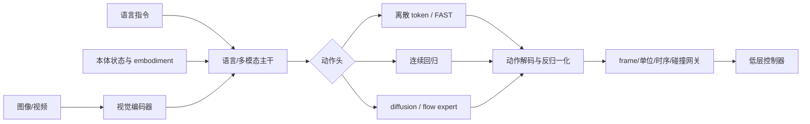

# 第15章 VLA 的架构模式

> 状态：`reviewed`
> 资料核查日期：2026-09-01
> 关联实验：`EXP-15-01`
> 关联声明：`CLAIM-15-01`～`CLAIM-15-09`
> 关联图表：`FIG-15-01` / `TAB-15-01`～`TAB-15-04`
> 资源档位：S / M / L1 / L2
> GPU 状态：待验证

## 本章契约

### 核心问题

视觉、语言和机器人状态怎样变成可执行动作？离散 action token、连续回归、FAST、diffusion/flow action expert 与双系统架构的真正差别是什么？为什么一个会看图、会解释的视觉语言模型（Vision-Language Model, VLM）仍不能直接控制机器人或车辆？

### 先修知识

- 已具备：第10章的视觉表征、第12章的可行动空间、第13章的动作 chunk、第14章的生成式动作；
- 本章补齐：VLA 数据流、动作头谱系、动作 grounding、跨本体 schema、远程推理和架构证据；
- 不要求：训练大语言模型、拥有机器人、调用商用 API、下载 checkpoint 或 GPU。

### 非目标

- 不按公司版本号写成产品排行榜；
- 不把 VLA、VLM、世界模型、规划器和安全层混为一体；
- 不声称运行 RT-2、OpenVLA、π、SmolVLA 或 GR00T；
- 不把开放代码等同开放训练数据、权重和全部许可；
- 不让语言输出或归一化向量绕过动作合同与独立安全检查。

### 学完后的可验证产出

读者应能为一个 VLA 画出输入—融合—动作头—执行链路，辨认五类动作表示，为新本体编写显式 action schema，设计与通用 VLM 的公平基线，并判断某个系统是否真的包含可验证世界模型。

## 15.1 VLA 首先是一种策略

本书把 VLA 定义为从视觉 `I`、语言目标 `l`、机器人状态 `q` 与可选历史映射到动作分布的策略族：

\[
\pi_\theta(A_{t:t+H-1}\mid I_{\le t},l,q_{\le t},c).
\]

`c` 可以是本体标签、相机有效位、任务上下文或地图。输出可能是单步动作、action chunk、轨迹、技能 token 或低频子目标。只有语言和图像输入而没有动作训练/grounding 的模型仍是 VLM；只有动作预测而不使用语言的策略也不必叫 VLA。



*FIG-15-01：VLA 的稳定架构骨架。模型主干和动作头可以变化，但动作解码、合同与安全网关不可省略。来源：本书原创，MIT，2026-08-31。*

`CLAIM-15-01`（fact）：VLA 的最低合同是条件动作策略；除非系统还提供并验证动作条件状态转移、rollout 或反事实接口，不能仅因其具备大模型或隐式知识就称为世界模型。

## 15.2 输入端：视觉和语言还不够

一个可执行 VLA 输入通常包括：

- 一到多路相机及每路有效位、分辨率、时间戳与预处理；
- 文本指令、对话历史或任务 ID；
- 关节、末端、夹爪、底盘等 proprioception；
- 本体类型、缺失模态掩码、动作 schema 与归一化统计；
- 可选的历史帧、触觉、深度、地图或安全状态。

语言“把杯子放到左边”没有定义左边相对哪个 frame，也没有给出抓取姿态。视觉 encoder 可能识别杯子，语言主干可能分解任务，动作头仍需通过本体数据学会把语义落到当前相机—机器人几何与控制接口。

训练与部署预处理必须成对：相机顺序、裁剪、颜色通道、状态维度、空相机 padding、delta/absolute action、夹爪符号和归一化统计任一错配，都可能让张量 shape 正常而动作含义错误。

## 15.3 五种动作头模式

| 模式 | 输出与训练 | 优点 | 主要风险 | 代表锚点 |
| --- | --- | --- | --- | --- |
| 逐维离散 token | 每维/每步量化后自回归 | 复用语言模型词表与损失 | 量化误差、序列长、维间独立 | RT-1/RT-2、OpenVLA |
| 序列压缩 token | 先压缩高频 action chunk 再自回归 | 减少 token 长度 | tokenizer 重建误差与跨本体适配 | FAST / π0-FAST |
| 连续回归/chunk | 直接回归连续动作 | 简单、采样快 | 多峰平均、损失尺度 | ACT、OFT 等 |
| diffusion/flow expert | 条件生成连续 action chunk | 表达多峰与时间相关性 | 多步采样、随机性、时延 | π0、SmolVLA、GR00T |
| 分层/双系统 | 慢语义模块条件化快动作模块 | 分离语义与高频控制 | 接口延迟、两层目标不一致 | GR00T 等 |

*TAB-15-01：动作头按表示与执行接口分类。一个项目可以同时提供多种头，名称不决定部署质量。*

### 逐维 token：统一词表的代价

[RT-2](https://arxiv.org/abs/2307.15818) 将机器人动作表达为文本 token，与视觉语言任务共同微调 `[A,R0]`。这种统一接口让 VLM 可以产生动作，但 token 必须解码、反归一化并映射到特定本体。每维 256 档并不等于 256 个语义动作；它只是连续值的量化。

[OpenVLA](https://github.com/openvla/openvla) 是可审计的开源路线：官方仓库提供 7B 模型、训练/LoRA/评测代码，并说明基础模型使用融合的 DINOv2/SigLIP 视觉特征、Llama 2 主干与逐维 action token `[A/O,R1]`。其当前推理代码还要求用 `unnorm_key` 选择数据集对应的 `q01/q99` 动作统计，再把 token 解码结果反归一化；多数据集 checkpoint 若没有明确 key 就不能猜。仓库代码为 MIT，但 checkpoint 继承 Llama 2 许可限制；“代码可商用”不能自动扩展到模型。

### FAST：先压缩动作序列

[FAST](https://arxiv.org/abs/2501.09747) 针对高频连续动作被逐维逐时刻 token 化后序列过长的问题，在频域压缩动作 chunk，再进行离散 token 建模 `[A,R1]`。官方论文同时发布 FAST+ tokenizer。它仍需记录采样率、动作顺序、归一化与重建误差；压缩 token 更少不自动意味着闭环更快，语言主干解码、网络和控制队列也占时延。

### 连续 action expert：语言主干不必生成动作文字

另一条路线让 VLM 提供语义/视觉上下文，由专门的连续 action expert 产生 chunk。第14章解释了 diffusion/flow 接口。这样可以避免长动作 token 序列，也引入采样 solver、专家容量、缓存和异步执行问题。

[SmolVLA](https://arxiv.org/abs/2506.01844) 的公开论文与 LeRobot 实现以较小 VLM 加 action expert、flow matching 和异步推理为主线 `[A/O,R1]`。当前 LeRobot 配置显式区分 `chunk_size`、`n_action_steps`、动作/状态归一化、空相机和 flow 采样步数；[异步推理实现](https://github.com/huggingface/lerobot/blob/main/src/lerobot/async_inference/policy_server.py)还为 chunk 中每个动作附加 observation 起点、环境 timestep 和逐步时间戳，再由客户端管理队列与重叠 chunk。本书没有执行其 checkpoint。

## 15.4 双系统与分层：快慢不是安全边界

双系统通常让较慢的视觉语言模块解释场景和任务，让较快 action expert 生成连续控制。它可以缓存语义前缀、异步刷新动作块，也可以端到端联合训练。所谓 System 2 不保证形式化推理，System 1 也不保证硬实时。

[Isaac GR00T](https://github.com/NVIDIA/Isaac-GR00T) 的当前主分支在核查日标为 N1.7，官方 README 描述 VLM 主干加 flow-matching DiT action head、相对末端动作和 LeRobot 数据接口，并公开 Apache-2.0 代码/权重说明 `[O,R1]`。当前主分支说明 action dimension 已扩至 132、模型最大 action horizon 已从 16 扩至 40，rollout 参数也从 `action-horizon` 改名为 `execution-horizon`。但官方 [`data_config.md`](https://github.com/NVIDIA/Isaac-GR00T/blob/main/getting_started/data_config.md) 的示例仍使用 16 步 `delta_indices`，并要求改变窗口后重新生成逐步统计；这不是矛盾结果，而是不同合同层。

| 层 | GR00T N1.7 当前例子 | 必须锁定的问题 |
| --- | --- | --- |
| 模型容量 | 主配置 `action_horizon=40`、最大 action dimension 132 | checkpoint 实际允许的最大 `T,D` 是多少 |
| 数据/模态窗口 | embodiment 的 `delta_indices` 可采用 16 步等配置 | 样本取哪些未来步，统计是否按同一窗口重算 |
| policy 输出 | `T` 由训练配置和 modality config 决定 | 当前 checkpoint 实际返回多少步，字段/单位是什么 |
| rollout 执行 | `execution-horizon` 选择本次消费的 prefix | 何时重规划、剩余 chunk 如何失效或融合 |

*TAB-15-04：模型最大 horizon、数据窗口、实际输出和执行窗口是四个相关但不同的量。数字来自核查日的官方 N1.7 README、模型配置与入门文档；本书未运行 checkpoint。*

`CLAIM-15-09`（recommendation）：VLA 实验卡必须分别记录模型最大 action horizon、数据 `delta_indices`、checkpoint 实际输出 horizon 与 rollout execution horizon；不得从其中一个数字推断另外三个，改变数据窗口后还要重算与其时间维一致的归一化统计。

双系统仍需要明确：慢模块多久刷新一次、快模块在指令变化时何时失效、chunk 缓存如何中断、两个模块使用哪一个时间戳，以及安全控制器是否拥有更高优先级。异步并不自动更安全：旧响应可能晚到，网络可能重复传送，同一 chunk 可能被执行两次。客户端至少要比较单调 `command_id`、共同 clock、观测/动作 timestep 和有效期；新指令、急停或 schema revision 变化应原子地使旧队列失效。

## 15.5 VLA、VLM 与世界模型的边界

| 系统 | 主要输出 | 能直接证明 | 仍不能证明 |
| --- | --- | --- | --- |
| 通用 VLM | 文本、结构化描述、低频建议 | 图文条件响应 | 动作已 grounding、闭环有效 |
| VLA | 本体动作/轨迹分布 | 指定 schema 下可产生动作 | 有世界转移、长期规划或安全 |
| 世界模型 | 动作条件状态/观测未来 | 指定 horizon 的预测接口 | 自动会选择动作 |
| planner/critic | 候选动作排序、价值或计划 | 指定模型下的选择规则 | 模型/代价真实 |
| safety layer | 约束、拒绝、降级 | 已实现的安全门禁 | 任务智能或零风险 |

*TAB-15-02：相邻系统角色。它们可以组合，但证据不能越级。*

VLA 可能在内部表示物体、因果或未来，但 probe 读得出状态不等于模型能 rollout。若要声称“VLA 内含世界模型”，至少需要固定历史改变动作的反事实预测、长期状态一致性或显式 rollout 接口，并证明策略真的使用这些预测。

通用 VLM API 可以成为零样本/少样本提示基线，但只能输出低频技能候选、目标对象或路径偏好，再交给经过验证的 grounding 和控制器。它不是预设性能下界：有些任务可能受益于互联网知识，有些任务因缺少动作训练完全失败。

## 15.6 EXP-15-01：统一动作合同与执行网关

S 档 fixture 定义移动底盘 schema：`base_link` frame、固定字段顺序、线速度 `[-0.5,0.5] m/s`、角速度 `[-1,1] rad/s`、10 Hz、预测最多 3 步但每次最多执行 1 步、命令最大年龄 100 ms，并要求单调 `command_id` 与共同的 `control_monotonic_ms` clock。

同一归一化动作 `(0.6,-0.4)` 经过：

- 连续头反归一化为 `(0.3 m/s,-0.4 rad/s)`；
- 五档教学 tokenizer 编码为 `(3,1)`，解码归一化值 `(0.5,-0.5)`；
- flow 头产生三步 chunk，网关只放行一步前缀。

```bash
make ch15-test-local
make ch15-smoke-local
make ch15-smoke
```

| 检查 | 固定结果 | 证据边界 |
| --- | ---: | --- |
| 三种可执行头通过 schema | 3/3 | 手工 packet，不是模型输出 |
| 五档 token 平均归一化误差 | 0.1 | 不是 OpenVLA/FAST tokenizer |
| malformed 拒绝率 | 10/10（100%） | 只覆盖十种程序化合同错误 |
| 高层文本可直接执行 | false | 必须先 grounding |
| flow chunk 预测/执行 | 3 / 1 步 | 验证 receding horizon 字段 |

`CLAIM-15-02`（result）：`EXP-15-01` 中，连续、离散 token 和 flow chunk 三类手工输出都通过同一带 frame、单位、时间与 horizon 的动作 schema。

`CLAIM-15-03`（result）：五档逐维 tokenizer 将 `(0.6,-0.4)` 量化为 `(0.5,-0.5)`，平均归一化绝对误差为 `0.1`。该值只属于教学词表，不能外推 FAST 或真实 VLA。

`CLAIM-15-04`（result）：高层文本、过期命令、错误 frame、错误单位与越界动作等十类 packet 全部被网关拒绝。范围检查不是碰撞检查或功能安全证明。

新增错误包括 clock/字段顺序错配、packet 擅自把执行前缀从 1 扩为 3，以及重复/乱序命令。新命令 `command_id=8` 在已接受 7 后通过；重复 7 与旧命令 6 都被拒绝。布尔值、非有限动作和伪造 prediction horizon 另由单元测试覆盖。

| 动作包字段 | 作用 | 仍未提供的保证 |
| --- | --- | --- |
| `schema_id`、`field_names`、`units`、`frame_id` | 固定维度语义和坐标合同 | 不验证真实标定或控制器 |
| `clock_id`、`timestamp_ms`、`control_hz` | 在共同单调时钟上检查新鲜度 | 不完成跨机时钟同步 |
| `command_id` | 拒绝当前会话内 replay/乱序 | 不提供认证、防篡改或跨重启持久性 |
| prediction / execution horizon | 限制 chunk 长度和执行前缀 | 不检查连续碰撞或动力学 |

*TAB-15-03：`EXP-15-01` 的最小执行身份。生产协议还需要 session/boot ID、认证、完整性保护、ACK 和安全控制器。*

`CLAIM-15-07`（result）：`EXP-15-01` 修复了 packet 可把 schema 执行时域从 1 扩到 3 的漏洞；重复 `command_id=7` 和乱序 6 在已接受 7 后被拒绝，而新命令 8 通过。

`CLAIM-15-08`（recommendation）：远程或异步 VLA chunk 必须携带版本化字段顺序、共同 clock、观测/动作 timestep、单调命令身份和明确失效规则；仅有网络时间戳不能防止 replay、乱序或旧队列继续执行。

## 15.7 新本体适配：shape 相同也可能语义相反

适配新机器人不只是把 action dimension 改成 7。至少要定义：

1. 字段顺序与含义：关节、末端、夹爪还是底盘；
2. absolute/delta、位置/速度/力矩控制；
3. frame、单位、轴向、角度表示与手系；
4. 控制频率、prediction/execution horizon、command/session identity 与保持方式；
5. 每维上下限、归一化统计和缺失维掩码；
6. 相机顺序、状态时间戳与动作生效延迟；
7. 低层 controller、碰撞检查和 emergency stop。

两个本体都有 7 维动作，不代表每一维对应相同关节。不同数据集对 gripper 的 `0/1`、`-1/1`、开度和速度可能方向相反。训练时的 normalization key 是模型的一部分，部署时猜错统计量会得到数值范围“像动作”但物理意义错误的命令。

`CLAIM-15-05`（recommendation）：比较或迁移 VLA 时，应先把所有动作头解码到同一个版本化可执行 schema，再比较开环误差、闭环 outcome、控制频率与端到端时延；张量维度一致不足以证明协议兼容。

## 15.8 自动驾驶正文：语言辅助决策，不直接接管控制

自动驾驶的 VLA 类接口可以接收多相机、车辆状态、地图/导航指令和语言事件，输出技能、路径点、未来轨迹或低层控制。机器人 VLA 的 checkpoint 不能因输入也有相机和语言就直接迁移到车辆：动作空间、时域、法规、动力学和风险等级完全不同。

稳定分层方式是：

- VLM/VLA 慢层提出“保持车道、准备右转、在安全位置停车”等低频意图；
- 驾驶策略/规划器把意图 grounding 到地图、occupancy 和候选轨迹；
- 车辆模型与独立安全层检查道路边界、碰撞、速度、舒适度和新鲜度；
- 高频控制器跟踪已通过门禁的短时轨迹。

普通 VLM API 输出的 JSON 或文本不能直接当转向/制动。即使结构字段合法，也可能使用错误 frame、过时观察或不存在的道路。提示注入、语言歧义和外部服务中断也必须落入故障合同。

`CLAIM-15-06`（recommendation）：自动驾驶中的通用 VLM/VLA 提示基线只应产生低频候选意图或轨迹约束；任何连续控制都必须通过版本化 schema、时效、动力学、碰撞与最小风险门禁。

评测要同时报告路线完成、碰撞/越界、干预、舒适度、P50/P95 延迟、超时、成本和拒绝率。语言任务成功或离线 action accuracy 不能代替闭环驾驶证据。

## 15.9 可选 VLM API 基线

闭源 API 不是必做依赖，也不要求购买额度。若用户已有权限，可在与本地策略相同的冻结观察上请求结构化高层候选，并保存：供应商、模型快照、日期、系统/用户提示、图像预处理、参数、原始响应、重试、限流、延迟、费用和安全拒绝。能力宣传标 `[V,R0]`；只有具体请求归档后，该次行为才可标 `[V,R1]`。

没有 API 时使用版本化规则基线或仓库内归档响应，不阻塞章节。不得把新请求和旧归档混进同一统计，也不能上传无授权机器人/驾驶影像。

## 15.10 资源、开源与许可路线

S 档 `EXP-15-01` 使用 Python 标准库、CPU、零下载和 MIT fixture，不运行模型；单调 command ID 只模拟单会话网关状态，不是网络安全协议。

M 档首选 SmolVLA 的小规模推理或少量数据适配，目标为 24 GB 单卡以内；官方论文声称单 GPU 训练和消费级 GPU/CPU 部署 `[A,R0/R1]`，但本书尚未验证具体 checkpoint、输入和显存。运行前锁定 LeRobot commit、模型卡、数据 revision、相机/动作配置和缓存体积。

OpenVLA 官方 README 的传统 LoRA 示例称至少约 27 GB，超出默认 24 GB，因此不列为默认 M 档；可量化推理或经实测的更小配方属于 L1，完整 7B 微调属于 L2。openpi 官方估算 LoRA 大于 22.5 GB、full fine-tune 大于 70 GB，前者贴近单卡上限、后者只可选用最多 2×80 GB。GR00T 当前 README 建议推理 16 GB 以上、微调 40 GB 以上；本书均未实测，不能把上游估算写成本书资源结果。

所有路线都不要求购置硬件。没有 GPU 时继续使用 S 档合同实验；有远程/租用资源时也必须通过 Docker/锁定环境记录数据、checkpoint、缓存、峰值显存和费用。

代码、VLM base、VLA checkpoint、训练数据、仿真资产和机器人数据分别核验许可。OpenVLA 明确提醒模型继承 Llama 2 许可；GR00T、LeRobot/openpi 也需要以具体文件和模型卡为准，不能只看仓库首页 badge。

## 15.11 失效模式与安全边界

重点失效包括：错误相机顺序、语言歧义/提示注入、状态与图像不同步、动作 token 越界、tokenizer/归一化版本错配、absolute/delta 混淆、夹爪符号反转、本体 tag 错误、chunk 无法中断、远程推理超时、API 漂移，以及语言主干生成合理解释但错误动作。

部署日志应保存模型/checkpoint、输入模态有效位、prompt、动作头类型、原始与反归一化动作、schema revision、网关拒绝原因、实际执行前缀和闭环结果。VLA 输出永远不能绕过动作范围、碰撞、速度/力、超时、watchdog 和急停。

## 15.12 结果与证据边界

| 类型 | 声明/结果 | 来源 | 状态 | 限制 |
| --- | --- | --- | --- | --- |
| 本书结果 | 三类动作头统一进入动作合同 | `EXP-15-01` | CPU smoke | 手工移动底盘 packet |
| 本书结果 | 十类错误包、执行时域越权与 replay/乱序被拒绝 | `EXP-15-01` | CPU smoke | 不是认证或功能安全验证 |
| 论文案例 | RT-1/RT-2 与 FAST action token | 论文/项目 | `[A,R0/R1]` | 本书未运行 |
| 开源案例 | OpenVLA、SmolVLA、openpi | 官方仓库/论文 | `[A/O,R1]` | checkpoint/训练未运行 |
| 最新案例 | GR00T N1.7 双系统与 flow head | 官方仓库 | `[O,R1]` | 官方声明，版本会漂移 |
| 未验证 | 24 GB 内 SmolVLA 适配 | 后续 M 档 | planned | GPU、数据和显存待测 |

## 小结

VLA 把视觉语言知识连接到动作，但真正可执行的系统还需要本体状态、动作表示、解码、归一化、frame、时间、控制器和安全层。离散 token、FAST、连续回归和 diffusion/flow expert 是动作头选择；双系统是模块组织。它们都必须落到同一动作合同与闭环协议后才能公平比较。

## 练习

1. **系统分类**：一个 VLM 输出“向左移动”但没有动作数据训练，它是 VLA 吗？缺什么 grounding？
2. **token 误差**：把 `EXP-15-01` 的 bin 从 5 改为 9，比较误差和词表长度。
3. **本体适配**：为 7-DoF 机械臂列出 absolute joint 与 delta EEF 两份互不兼容 schema。
4. **双系统时序**：慢层 2 Hz、快层 20 Hz 时，设计指令变化和急停的缓存失效协议。
5. **自动驾驶迁移**：定义 VLM 输出的低频意图 JSON，以及它进入规划器前必须通过的字段检查。

## 延伸阅读

- Brohan et al., [RT-1](https://arxiv.org/abs/2212.06817)，`[A,R0]`；
- Brohan et al., [RT-2](https://arxiv.org/abs/2307.15818)，`[A,R0]`；
- Kim et al., [OpenVLA](https://arxiv.org/abs/2406.09246) 与[官方仓库](https://github.com/openvla/openvla)，`[A/O,R1]`；
- Pertsch et al., [FAST](https://arxiv.org/abs/2501.09747)，`[A,R1]`；
- Shukor et al., [SmolVLA](https://arxiv.org/abs/2506.01844) 与 [LeRobot](https://github.com/huggingface/lerobot)，`[A/O,R1]`；
- Physical Intelligence, [openpi](https://github.com/Physical-Intelligence/openpi)，`[O,R1]`；
- NVIDIA, [Isaac GR00T](https://github.com/NVIDIA/Isaac-GR00T) 与 [N1 论文](https://arxiv.org/abs/2503.14734)，`[O/A,R1]`。

## 下一章接口

第16章已经把本章合同扩展到跨数据集/本体的动作对齐、数据混合、LoRA/OFT、蒸馏和异步执行；第17章再判断世界模型究竟怎样帮助 VLA，而不是把两者名称直接拼接。

## 验收与审查记录

```text
本地检查：make check-local
严格检查：make check
章节 smoke：make ch15-smoke
文档构建：make docs-build
```

- 内容审查：通过；
- 代码审查：通过；
- 一致性审查：通过（已与第10/12/13/14/16/17章及第20/21章合同对齐）；
- 教学审查：通过；
- 审查记录路径：`reviews/ch15-command-integrity-review-2026-09-01.md`、`reviews/fast-moving-source-audit-2026-09-01.md`；
- 已知限制：没有下载或运行任何 VLA、VLM API、机器人、仿真或 GPU；
- 下一步：可沿第17章核对世界模型与 VLA 的组合边界，再用第20、21章完成评测与部署证据检查。
