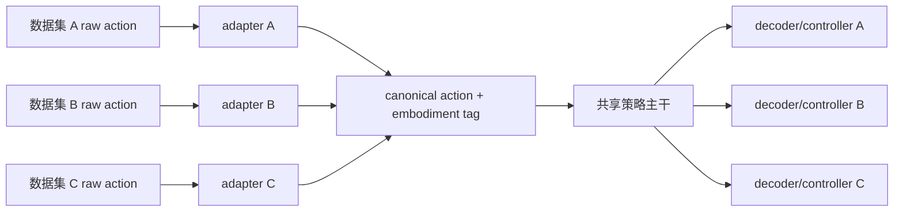

# 第16章 数据规模化、跨本体迁移与高效适配

> 状态：`reviewed`
> 资料核查日期：2026-09-02
> 关联实验：`EXP-16-01`
> 关联声明：`CLAIM-16-01`～`CLAIM-16-10`
> 关联图表：`FIG-16-01` / `TAB-16-01`～`TAB-16-06`
> 资源档位：S / M / L1 / L2
> GPU 状态：待验证

## 本章契约

### 核心问题

把更多机器人数据放进同一个目录，为什么不等于得到可训练的跨本体数据集？如何对齐不同机器人的动作、时间和归一化，判断多数据混合带来正迁移还是负迁移，并在不要求购置硬件的前提下选择 action-head、LoRA/OFT、蒸馏或异步部署？

### 先修知识

- 已具备：第4章的数据/切分协议、第13章的动作 chunk、第15章的 action schema 与 VLA 架构；
- 本章补齐：数据 mixture、canonical action、embodiment adapter、归一化、迁移矩阵和高效适配；
- 不要求：下载 Open X-Embodiment/DROID、拥有机器人、训练 VLA 或 GPU。

### 非目标

- 不把统一存储格式等同统一动作语义；
- 不把数据帧数等同有效任务多样性或质量；
- 不声称跨本体预训练必然正迁移；
- 不把 LoRA、OFT、量化或蒸馏当作无损且通用的加速按钮；
- 不在当前设备自动下载大型数据、视频或 checkpoint。

### 学完后的可验证产出

读者应能为多数据 mixture 建立来源表，把每个本体动作转换到版本化 canonical schema，计算数据权重，设计 leave-one-embodiment-out 迁移矩阵，并为 24 GB 单卡与可选 2×80 GB 路线选择诚实的适配层级。

## 16.1 数据规模不是一行“共多少帧”

机器人数据的基本单位应是 episode/trajectory，而不是打散帧。一个训练样本需要保持图像、状态、动作、语言、时间戳、终止与 episode 边界；相邻帧高度相关，不能用帧级随机切分制造虚假测试集。

规模至少有六个轴：

- episode、小时和有效动作步数；
- 任务、对象、场景和语言覆盖；
- 本体、相机、控制器与采集方式；
- 成功、失败、恢复和空闲片段比例；
- 频率、缺帧、同步、压缩与标注质量；
- 数据许可、隐私、地域与人员来源。

两个 100 万帧数据集，一个可能来自单场景 30 Hz 长视频，另一个来自多任务 5 Hz 交互。按帧等权会隐式偏向高频、长 episode 和重复采集。需要先定义 mixture 目标，再选择采样权重：

\[
\mathcal{L}(\theta)=\sum_{d=1}^{D}w_d\,
\mathbb{E}_{(o,a)\sim\mathcal{D}_d}[\ell(\pi_\theta(o),a)],
\qquad \sum_d w_d=1.
\]

`w_d` 可以按数据集、任务、本体或温度采样设定。它不是“数据越多权重越大”的同义词，必须记录在配置和实验卡中。

还必须登记 sampler 实际在哪一层抽样。dataset-uniform 先选来源、episode-uniform 从全部轨迹等概率选一条、transition-uniform 从全部有效步等概率选一个窗口；当 episode 数与长度不等时，三者实现的是三个不同目标分布。action chunk、padding、过滤、缺失相机和 `ignore_errors` 还可能让“原始 transition 数”不同于真正进入 loss 的有效 token/window 数，因此既要保存目标 `w_d`，也要按训练日志审计 realized exposure。

[Octo 数据管线快照 `241fb35`](https://github.com/octo-models/octo/blob/241fb3514b7c40957a86d869fecb7c7fc353f540/octo/data/dataset.py)的 `make_interleaved_dataset` 接受 per-dataset `sample_weights`；开启 `balance_weights` 时再乘每个数据集的 `num_transitions`，归一化后在 frame level interleave `[O,R1]`。这说明权重语义依赖实现开关和采样层，不表示 Octo 的任一方案对所有训练目标都最优，也不表示本书运行过该管线。

## 16.2 三类开放数据入口，各自解决不同问题

| 生态 | 组织重点 | 适合研究 | 不能默认推出 |
| --- | --- | --- | --- |
| Open X-Embodiment | 多机构数据转换为 RLDS episode | 跨机器人预训练、mixture | 动作/许可/质量已完全统一 |
| DROID | 同类硬件在多地点多任务采集 | 场景与操作者多样性、真实操作 | 跨任意本体迁移 |
| LeRobot Dataset v3 | Parquet/MP4、metadata、Hub/streaming | 统一加载、版本化、教学管线 | episode 切分和动作语义天然正确 |

*TAB-16-01：三类数据入口的角色。格式、采集平台与训练 mixture 是三个层次。*

[Open X-Embodiment 官方仓库快照 `9eeb68b`](https://github.com/google-deepmind/open_x_embodiment/tree/9eeb68b989efbcf474e8fb9019e01d02b962a604)将各贡献数据转换为 RLDS episode，并为每个子数据集保留 metadata 与引用 `[P/O,R1]`。其论文报告多机器人联合训练的正迁移案例，但该 README 同时说明动作七维可能分别表示绝对值、delta 或速度。统一成七维并没有消除控制语义差异；每个贡献数据的引用与许可仍需单独检查。

[DROID](https://droid-dataset.github.io/) 聚焦分布式真实机器人采集。论文报告 76k demonstration、350 小时、564 场景和 84 任务 `[P/O,R1]`；这些是上游数据说明，不是本书下载或审计结果。DROID适合研究同类平台上的场景/任务多样性，也不能单独回答不同关节、夹爪或底盘的动作对齐。

[LeRobot Dataset v3 文档快照 `128d332`](https://github.com/huggingface/lerobot/blob/128d3324e3202ce1fca1340fb8d7941edecce9d3/docs/source/lerobot-dataset-v3.mdx)把低维 Parquet、分相机 MP4 与 episode metadata 解耦，并提供 schema、fps、统计量和 streaming 接口 `[O,R1]`。第4章已经解释：一个文件可含多个 episode，实验切分必须读 metadata。streaming 减少本地磁盘，不会消除网络、revision、缓存、许可和可重复性问题。

`CLAIM-16-01`（fact）：统一 episode 存储与加载 API 只解决格式层兼容；动作 frame、单位、absolute/delta、频率、本体和许可仍需逐数据集对齐与审计。

## 16.3 canonical action：共享什么，不共享什么

跨本体训练常尝试建立规范动作空间：

- **关节空间**：能保留低层控制，但不同机构维度和关节意义不同；
- **末端位姿/增量**：较易跨机械臂，但依赖 frame、IK、夹爪和下层 controller；
- **轨迹/路径点**：适合移动机器人和驾驶，仍依赖动力学跟踪；
- **技能/语言 token**：语义可迁移，具体执行多解；
- **latent/unified action**：可从多数据学习，需要对每个本体重新 grounding。



*FIG-16-01：跨本体数据与策略接口。canonical action 是版本化中间合同，不是自动可执行的万能动作。来源：本书原创，MIT，2026-08-31。*

canonical schema 至少包含字段名称/顺序、frame、单位、时间定义、absolute/delta、控制频率、范围、夹爪语义、缺失掩码和版本。转换应通过已知样本做 raw→canonical→raw round-trip，并在真实/仿真 controller 上验证可执行性。

无法无损对齐时，不应填零冒充共享维度。可保留 embodiment-specific head、mask 或 skill-level 共享，并把低层执行交给各本体 controller。

开源系统中的“统一动作”实际包含多条不同路线：

| 路线 | 共享对象 | 本体差异放在哪里 | 尚未解决的问题 |
| --- | --- | --- | --- |
| 物理 canonical action | 末端增量、轨迹或技能合同 | raw adapter 与本体 controller | IK、动力学、接触与不可逆转换 |
| pad + mask | 固定最大维度 tensor | action mask、dataset tag、统计量 | 相同槽位仍可能语义不同 |
| embodiment-conditioned head | 共享视觉/语言主干 | tag、processor、head/decoder | 未见本体的 zero-shot grounding |
| learned tokenizer/latent | 离散 token 或连续 latent | tokenizer 条件与本体 decoder | 重建误差、codebook 覆盖和闭环可执行性 |

*TAB-16-02：四种“统一动作”路径。它们可以组合，但不能互相替代。*

[Octo 数据管线快照 `241fb35`](https://github.com/octo-models/octo/blob/241fb3514b7c40957a86d869fecb7c7fc353f540/octo/data/dataset.py)会标准化各数据集、把动作/本体状态 pad 到最大维度，并保留 normalization mask 与 dataset name；这说明固定 tensor 只是装载接口，mask 和来源身份仍是模型输入合同 `[O,R1]`。[Isaac-GR00T 统计量快照 `51d4c89`](https://github.com/NVIDIA/Isaac-GR00T/blob/51d4c89f72fda44cbf77285c6a8114b52676b8a1/gr00t/data/stats.py)对 relative-action 统计缓存把 embodiment tag、representation/type、format、action/state delta indices 和关联 state key 纳入 fingerprint，避免这些配置变化后静默复用旧缓存 `[O,R1]`；这不表示同一机制自动覆盖所有 absolute-action 统计路径。learned action tokenizer 可以进一步共享表示，但其 decoder 仍要还原到具体本体动作，token reconstruction 或 perplexity 不能替代闭环成功率。

## 16.4 归一化也属于动作协议

常见变换是按训练集统计量标准化：

\[
\tilde a_j=\frac{a_j-\mu_j}{\sigma_j+\epsilon}.
\]

`μ,σ` 在本书受控评测中必须只由训练 split 计算，并与 dataset revision、split hash、embodiment、字段顺序、absolute/delta 配置和 action horizon 一起保存。某些上游管线会发布全数据统计或随 checkpoint 附带统计量，使用时必须记录其统计范围，不能默认它等于本书的训练切分。全局统计可能让大范围本体支配小范围本体；逐本体统计提高数值可比性，却要求推理时知道正确 embodiment。min/max 对异常值敏感，quantile clipping 会改变可达范围，也必须记录。

[openpi normalization 快照 `215abfb`](https://github.com/Physical-Intelligence/openpi/blob/215abfb217dbac7d5f1273282331b9b1866c0479/docs/norm_stats.md)明确要求目标数据遵守预训练 action-space 定义，并建议在“复用已有本体统计”与“为新数据重算统计”之间做实证比较；[LeRobot processor 快照 `128d332`](https://github.com/huggingface/lerobot/blob/128d3324e3202ce1fca1340fb8d7941edecce9d3/src/lerobot/processor/normalize_processor.py)则允许 checkpoint stats、dataset stats 或显式 override `[O,R1]`。因此 normalization asset 不是可随意替换的数值文件，而是模型—数据—动作 schema 的版本化依赖。

不能把训练数据归一化后的 `[-1,1]` 当物理安全范围。反归一化后仍要通过第15章的 frame、单位、bounds 和时效网关。

## 16.5 EXP-16-01：shape 相同，语义相反

S 档 fixture 有两个二维动作 schema，任务语义相同：

- `arm_a`：`delta_x` 是 controller delta unit，乘 `0.1` 得米；夹爪 `+1` 表示打开；
- `arm_b`：`delta_x` 是厘米，乘 `0.01` 得米；夹爪 `-1` 表示打开。

两个任务的 canonical target 分别是 `(0.02 m, 1.0 open)` 与 `(-0.01 m, 0.0 open)`。直接平均两个 raw action，再错误地按 `arm_a` 解码；对照则先由各自 adapter 转到 canonical 空间再平均。

每条记录还携带由本体 ID、字段顺序、单位、缩放、夹爪极性和 canonical schema 计算的 SHA-256 fingerprint。fixture 注入缺失本体、缺失 fingerprint 和陈旧 fingerprint 三类合同错误；只要转换语义变化，fingerprint 就必须变化。它不是安全签名，也不能证明数据内容真实，只用于阻止“配置已变、旧记录仍被静默解码”。

```bash
make ch16-test-local
make ch16-smoke-local
make ch16-smoke
```

| 检查 | 固定结果 | 解释 |
| --- | ---: | --- |
| raw action shape | 两者均为 2 | shape 相同不表示协议相同 |
| naive raw pooling 规范语义 MAE | 0.28375 | 混合单位/极性改变动作意义 |
| schema-aware pooling MAE | 0.0 | 手工 adapter 对齐已知 fixture |
| 最大 adapter round-trip 误差 | 0.0 | 四条记录可逆 |
| 合同错误拒绝率 | 3/3 | 缺失本体、缺失/陈旧 fingerprint 均拒绝 |
| 语义变化是否改变 fingerprint | true | scale 或字段合同改变后不再命中旧身份 |

*TAB-16-03：`EXP-16-01` 结果。没有训练模型，因此 `0.28375` 是接口反例，不是负迁移性能。*

`CLAIM-16-02`（result）：`EXP-16-01` 中两个 raw action 都是二维，但位移单位和夹爪极性不同；相同 tensor shape 未提供语义兼容证据。

`CLAIM-16-03`（result）：直接 raw pooling 的 canonical MAE 为 `0.28375`，schema-aware pooling 为 `0`，adapter 最大 round-trip 误差为 `0`。这个确定性结果不能外推 learned adapter 或真实策略效果。

`CLAIM-16-04`（result）：fixture 对缺失/未知 `embodiment_id`、缺失 fingerprint 和陈旧 fingerprint 的 3 条错误记录全部拒绝转换，而不是套用默认本体或当前 adapter；这只验证 metadata 与版本门禁。

`CLAIM-16-07`（result）：fixture 中缩放或字段合同改变会产生不同 schema fingerprint；该结果只证明确定性身份绑定，不提供防篡改、数据真实性、跨语言序列化兼容或 controller 安全保证。

### 16.5.1 同一来源清单，三种实际暴露

`EXP-16-01` v4 固定两个来源：`short_dataset` 有1条、长度2的 episode；`long_dataset` 有3条、每条长度4的 episode。来源身份、episode 与 transition 总数分别是2、4和14，不引入真实数据。

| 均匀抽样单位 | short 暴露 | long 暴露 | long:short |
| --- | ---: | ---: | ---: |
| dataset | 50% | 50% | 1:1 |
| episode | 25% | 75% | 3:1 |
| transition | 14.2857% | 85.7143% | 6:1 |

*TAB-16-05：`EXP-16-01` v4 的采样单位负对照。比例是对固定计数的解析期望，不含有限 batch 随机波动、窗口重叠、过滤、token mask 或质量权重。*

`CLAIM-16-09`（result）：在该 fixture 中，仅把“均匀”的单位从 dataset 改为 episode 或 transition，就会把 long 来源的期望暴露从50%改为75%或约85.71%。该结果只证明采样单位会改变这两个手工来源的 mixture，不判断哪一种权重更优，也不估计真实训练 batch、梯度贡献、数据质量或迁移性能。

### 16.5.2 raw transition 占比仍不是 loss window 占比

action chunk 训练通常需要长度为 `H` 的连续窗口。如果使用 stride one 且丢弃 episode 尾部不完整窗口，一条长度为 `L` 的 episode 贡献

\[
N_{\text{window}}=\max(L-H+1,0)
\]

个候选窗口。这个变换不是按 transition 占比做等比例缩放：短于 horizon 的 episode 会整体消失，刚刚超过 horizon 的 episode 也会有较高的边界损耗。

`EXP-16-01` v4 在同一组 episode 长度上固定 `action_horizon=3`，不改变任何来源身份：

| 来源 | episode 长度 | raw transitions | 合格三步窗口 | transition-uniform 暴露 | window-uniform 暴露 |
| --- | --- | ---: | ---: | ---: | ---: |
| short | `(2,)` | 2 | 0 | 14.2857% | 0% |
| long | `(4,4,4)` | 12 | 6 | 85.7143% | 100% |

*TAB-16-06：`EXP-16-01` v4 的 raw-transition—合格 action-window 负对照。这里固定 stride one、drop-tail、无 padding；比例是解析计数，不是随机采样或梯度实测。*

`CLAIM-16-10`（result）：在该固定 fixture 中，long 来源占12/14个 raw transition，但三步 drop-tail 窗口的6个合格样本全部来自 long，short 来源从14.2857%降为0。该结果只证明 horizon 与尾部策略会改变可训练窗口分母，不估计 padding/mask、过滤、重复采样、分布式 shard、有效 token、梯度贡献、数据质量或模型迁移性能。

## 16.6 正迁移与负迁移必须用矩阵判断

要判断跨本体数据是否有用，至少比较：

1. 目标本体单独训练；
2. 目标 + 单个来源本体；
3. 完整 mixture；
4. 完整 mixture 但不提供 embodiment tag；
5. 完整 mixture + per-embodiment adapter/head；
6. leave-one-embodiment-out 预训练后适配。

每格报告目标任务闭环成功、恢复、动作约束、置信区间和训练成本；按任务/本体分别展示，不能只报宏平均。来源数据让目标分数下降才是该协议下的负迁移证据；raw schema 不兼容只是更早的工程错误，应先修复再研究迁移。

还要先声明“跨本体”是哪一种问题：训练 mixture 中见过目标本体的多任务学习、预训练后用少量目标数据适配、还是完全未见目标本体的 zero-shot。前三种实验不能共用一个“泛化”标签。对新形态机器人，除了任务与场景，还需按运动学拓扑、自由度、工作空间、末端执行器和 controller 能力描述与训练分布的距离；只留出一个数据集名称，可能仍泄漏相同硬件与控制栈。

`CLAIM-16-05`（recommendation）：跨本体训练应以“目标单独训练”为基线，用固定预算的来源×目标迁移矩阵报告正/负迁移；只有混合模型分数或总体平均无法定位贡献。

### 16.6.1 把“未见本体”变成受控隔离变量

只把某个机器人数据集从训练列表中删掉，仍可能让场景、物体、相机或任务随机器人一起变化，因而无法判断失败来自外观、本体结构、运动学还是物体交互。[XEWorld v1](https://arxiv.org/html/2608.05799v1)提供了一个更严格的协议案例：测试床包含五种双臂机器人和 25 个操作任务；主设置用三种机器人训练、两种机器人留出，另做 leave-one-embodiment-out。对于相同任务和随机种子，论文声明场景布局、物体位姿、光照与相机配置在机器人之间保持相同，再分别报告四类维度：视觉质量、机器人形态、机器人运动学和物体动力学 `[A,R0]`。

这个设计的价值不在于再增加一个总分，而在于把“换机器人”拆成可反驳的问题。论文作者在其所测世界模型上报告：跨本体表现与视觉相似度的关系强于与可达工作空间距离的关系；pixel-space action 优于数值关节位姿；未对齐的静态、多视角或 articulation cue 收益有限，而逐帧时间对齐的 render cue 收益更大；少量目标本体数据适配能改善目标表现，却会损伤已见机器人的表现。它们是 `arXiv:2608.05799v1` 的作者结果，不是本书实验，也不是“向量动作必然失败”或“所有世界模型只看外观”的普遍定理。

把该协议迁移到本书或其他项目时，最小审计应同时满足：

1. 留出的是完整目标硬件身份，而不只是数据集名称；
2. task、scene、camera、seed 和评测预算成对固定，并记录不能固定的物理差异；
3. 视觉相似度与运动学/形态距离分别报告，不用一个聚合距离掩盖归因；
4. few-shot 后同时报告目标本体收益和已见本体遗忘；
5. 标明动作是物理量、关节量、pixel-grounded cue 还是其他表示，并验证其时间对齐与可执行映射。

仿真中“同一场景参数”只加强内部归因，不自动获得真实机器人外部效度。若没有版本化代码、资产、split 与指标实现，本书可以采用上述审计结构，但不能声称复现 XEWorld 的数值结论。

`CLAIM-16-08`（fact）：XEWorld v1 在五种双臂机器人和 25 个操作任务上定义了 held-out-embodiment 协议，并把视觉质量、机器人形态、运动学与物体动力学分开报告；这一事实只描述论文协议，不证明其作者结论已由本书复现或适用于所有世界模型。

## 16.7 从 action head 到 full fine-tune：逐级扩大权限

| 适配方式 | 训练范围 | 适用情况 | 主要风险 |
| --- | --- | --- | --- |
| schema adapter / 新 action head | 输入输出层 | 动作协议变化、数据少 | 主干特征不适配 |
| LoRA/adapter | 部分线性层/模块 | 语义和视觉中等偏移 | rank/插入位置敏感 |
| OFT 配方 | 多图/proprio + 连续 chunk 头等 | OpenVLA 类控制适配 | 不是通用优化器，资源仍重 |
| 部分解冻 | 视觉/语言顶部若干层 | 感知或指令偏移较大 | 遗忘、显存增加 |
| full fine-tune | 全模型 | 大数据且域差异大 | 成本、遗忘、版本耦合 |
| 蒸馏/小策略 | teacher→student | 部署延迟/显存受限 | teacher 错误与行为覆盖丢失 |

*TAB-16-04：适配权限阶梯。先用最小可证实的修改，不代表永远不能 full fine-tune。*

[OpenVLA-OFT README 快照 `e4287e9`](https://github.com/moojink/openvla-oft/blob/e4287e94541f459edc4feabc4e181f537cd569a8/README.md)研究动作解码、连续 action chunk、proprioception 和 fine-tuning 目标的组合 `[A/O,R1]`。其上游结果说明适配配方会显著影响指定 benchmark，不证明 OFT 对所有 VLA、本体和数据都优。该快照给出约 16–18 GB 推理、27–80 GB 训练范围；这是上游配置说明，本书未实测。

LoRA 只减少可训练参数和优化器状态，不一定让 activation、输入视频或 action horizon 的显存变小到同样比例。量化可以降低权重显存，但可能改变 kernel、延迟和数值；梯度 checkpoint 降显存会增加计算。每种优化都要在目标硬件实测峰值显存、P50/P95、吞吐和闭环 outcome。

蒸馏时要决定 student 学 teacher 的单动作、分布、chunk、latent 或闭环轨迹。离线模仿 teacher 仍有第13章的分布偏移；只比较 action MSE 不足以证明部署等价。

## 16.8 异步推理：吞吐提高不等于动作更新更快

远程/异步策略常把相机采集、VLA 推理、action chunk 缓冲和 controller 分到不同进程或机器。它可以让执行不必等待每次推理，但引入：

- 观测、策略输出和执行时钟的对齐；
- 网络抖动、乱序、重试和重复执行；
- 新 chunk 与未执行旧 chunk 的拼接/替换；
- 指令变化、碰撞风险和急停时的抢占；
- server checkpoint/schema 与 robot client 版本协商。

日志必须同时记录 capture、server receive、inference start/end、client receive 和 execute 时间。模型 20 Hz 不等于有效 action age 为 50 ms；如果网络和队列积压，控制器可能一直执行旧动作。任何超时都进入确定性的保持、减速或停止策略。

## 16.9 自动驾驶正文：跨车队不是把 CAN 列拼起来

不同车辆可能记录方向盘角、前轮角、曲率或归一化 steering；油门/制动可能是踏板比例、加速度、压力或控制器目标。即使字段都叫 `steer`，转向比、符号、延迟和饱和范围也随车型变化。

跨车队 mixture 应优先转换为任务层 canonical 轨迹，例如 ego frame 下按固定时间步的 `(x,y,yaw,v)` 或带约束的曲率/加速度，再由每辆车的动力学和 controller 跟踪。转换要保存车辆参数、定位 frame、时间同步和可逆/有损说明。无法可靠转换的字段保留为 fleet-specific head。

数据权重还需按车队、路线、天气、地域、驾驶员和稀有事件审计；公里数多不等于危险事件覆盖好。按连续帧随机切分会泄漏同一路段和相邻时刻，应该按 route/log/vehicle 划分。

动作 horizon 与窗口策略还会改变驾驶场景的实际训练分布：短促急刹、接管前片段或被传感器故障截断的稀有事件，可能因不足一个完整 chunk 被 drop-tail 全部删除；若改用 padding，又必须让 loss mask、终止原因和 padding 值不可混淆。训练日志应同时报告每类场景的 raw steps、候选窗口、过滤后窗口和有效 action token，不能只用总里程或 transition 数证明稀有事件进入了 loss。

`CLAIM-16-06`（recommendation）：自动驾驶跨车队训练不得直接混合同名 raw control；应转换到版本化轨迹/动力学合同或使用 fleet-specific adapter，并以按车辆/路线拆分的闭环迁移矩阵验证。

驾驶数据还包含人脸、车牌、地理位置和行为记录，必须处理授权、脱敏、保留期限和跨地域治理。格式转换、裁剪和衍生 embedding 不会消除源数据许可与隐私责任。

## 16.10 资源、数据和许可路线

S 档 `EXP-16-01` 使用 Python 标准库、CPU、零下载和 MIT fixture，只验证 adapter 合同。

M 档在用户确认许可和体积后选择少量 LeRobot episode，训练小 action head/adapter 或 SmolVLA 小规模适配，默认不超过 24 GB 单卡、2–8 小时。先做 1–4 episode 过拟合、schema round-trip 和数据 checksum，再扩大；当前无 GPU 阶段不执行。

L1 可做 24 GB 单卡的 LoRA/蒸馏预检或 OpenVLA-OFT 量化推理；上游传统 OFT 训练下限约 27 GB，不能预先承诺符合 24 GB。L2 最多 2×80 GB，可做较大 adapter/部分解冻；若上游配方要求更多 GPU，则标记超出本书默认边界，而不是擅自缩小后声称复现。

所有环境优先 Docker，但大数据与 checkpoint 不写进镜像层。下载前输出预计字节数、缓存目录、许可和终止方式；代码、模型、每个子数据集、视频和衍生资产分别记录。Open X 软件 Apache-2.0、其余材料 CC-BY 的仓库说明不能替代每个贡献数据的原始条款。

## 16.11 失效模式与安全边界

重点失效包括：episode 泄漏、重复轨迹、失败/空闲片段未标、语言模板泄漏、相机/动作错位、global stats 污染测试集、absolute/delta 混用、夹爪极性反转、缺失 embodiment tag、mixture 被大数据集淹没、adapter 版本漂移、LoRA 合并错误、量化退化和异步旧动作。

诊断顺序是数据来源→episode/时间→schema/round-trip→mixture 权重→小样本过拟合→目标本体闭环。不要先用更大模型掩盖 schema 错误。任何跨本体输出仍需第15章的动作、安全和时效网关。

## 16.12 结果与证据边界

| 类型 | 声明/结果 | 来源 | 状态 | 限制 |
| --- | --- | --- | --- | --- |
| 本书结果 | raw/schema-aware pooling、adapter 身份与三类 mixture 暴露反例 | `EXP-16-01` | CPU smoke | 两维手工动作与解析来源计数，不训练策略 |
| 开放生态 | Open X-Embodiment RLDS mixture | 论文/官方仓库 | `[P/O,R1]` | 本书未下载或运行 |
| 开放数据 | DROID 分布式操作数据 | 论文/官方项目 | `[P/O,R1]` | 本书未下载或审计 |
| 数据格式 | LeRobot Dataset v3 | 官方文档 | `[O,R1]` | 版本会漂移 |
| 诊断基准 | XEWorld held-out-embodiment 协议 | arXiv v1 | `[A,R0]` | 协议已审计；代码、数据、模型和作者结果均未复现 |
| 适配案例 | OpenVLA-OFT | 论文/官方仓库 | `[A/O,R1]` | 上游结果，本书未运行 |
| 未验证 | 24 GB 内 adapter/SmolVLA 适配 | 后续 M/L1 | planned | 数据、GPU、迁移待测 |

## 小结

数据规模化的核心不是拼文件，而是保持 episode、来源和许可，并把动作语义转换到可审计合同。canonical action、mask/head/tokenizer、embodiment tag、schema fingerprint 和 mixture 权重分别解决不同层次的问题。LoRA/OFT、蒸馏和异步执行只是适配与部署工具，必须通过明确属于 seen、few-shot 还是 zero-shot 的目标本体闭环与资源实测验收。

## 练习

1. **schema 练习**：把 `arm_b` 的厘米改成毫米但不更新 fingerprint，解释为何必须拒绝，而不是继续计算误差。
2. **mixture 权重**：三个数据集分别有 100、1,000、10,000 episode，设计等数据集与温度采样权重。
3. **迁移矩阵**：为三个本体写出单独、两两、全量与 leave-one-out 的最小实验表。
4. **适配选择**：分别为“新夹爪”“新相机”“新语言域”选择 action head、LoRA 或部分解冻，并说明证据。
5. **自动驾驶迁移**：把方向盘角、曲率和轨迹三种日志映射到统一合同，列出不可逆信息。
6. **mixture 暴露**：给两个 episode 数与长度都不同的数据集，分别计算 dataset/episode/transition-uniform 的来源占比，并列出会让 realized exposure 再次偏离配置的过滤步骤。
7. **窗口分母**：保持来源权重不变，为 horizon `H=3` 比较 drop-tail 与 padding 两种窗口策略；说明短 episode 为什么可能从训练中消失，以及 padding 时必须记录哪些 mask。

## 自检要点

跨本体训练必须先解决记录身份与动作语义，再研究 mixture 和迁移。Shape、字段名或文件格式相同都不能替代 adapter 的可逆性与版本绑定。

<details markdown="1">
<summary>SELF-CHECK-16-01：单位改变必须更新 fingerprint</summary>

`arm_b` 原来用厘米，scale-to-meter 为0.01；改成毫米后应为0.001。同一个 raw `2.0` 会从0.02 m变成0.002 m，语义已变化十倍。旧 fingerprint 却声称记录仍按厘米 adapter 生成，继续算误差会得到数值正常但身份虚假的结果，且无法判断应重解码还是数据被污染。正确做法是生成新 adapter fingerprint/schema revision，迁移或重新导出有来源记录；不能根据数值范围猜单位。当前 fixture 正是用 stale fingerprint 拒绝阻断这种静默错配。

</details>

<details markdown="1">
<summary>SELF-CHECK-16-02：等数据集与温度权重</summary>

等数据集权重忽略 episode 数量，三者均为 `1/3`，再在各数据集内部采 episode。温度方案可预注册 `w_i∝n_i^α`；取 `α=0.5`（等价于 size temperature T=2）时，`sqrt(100):sqrt(1000):sqrt(10000)=10:31.62:100`，归一化约为 `0.0706,0.2233,0.7061`。作对照，α=1 的按规模权重约为 `0.0090,0.0901,0.9009`，α=0 回到等数据集。还应报告有效步/任务权重和重复率；episode 数不同不等于质量或多样性不同。

</details>

<details markdown="1">
<summary>SELF-CHECK-16-03：三个本体的迁移矩阵</summary>

对 A/B/C，最小表包含单独训练 `A→A,B→B,C→C`；两两 mixture `AB→A/B, AC→A/C, BC→B/C`；全量 `ABC→A/B/C`；leave-one-out `AB→C, AC→B, BC→A`。LOO 行还必须拆成 zero-shot 与固定少量目标数据的 few-shot adapter，不能混称泛化。每格冻结总 update/样本或另报 compute-matched 与 data-added 两套协议，使用相同目标 test、seed、成功/安全区间和成本，并含 full mixture without embodiment tag 负对照。

</details>

<details markdown="1">
<summary>SELF-CHECK-16-04：适配权限的选择</summary>

新夹爪但相机/任务相近时先用新 schema adapter/action head，证据是共享表征 probe 正常、旧动作头语义不兼容；新相机带来明显视觉统计/视角偏移时优先部分解冻视觉顶部层（或先做输入 adapter），用冻结主干失败且视觉适配改善 shift split 支持；新语言域、视觉与动作不变时可先在语言相关线性层用 LoRA，以 paraphrase/新术语 held-out 任务验证。三者只是起始假设：都应与更小/更大权限消融、遗忘、资源和闭环结果比较，失败时升级而非把方法名当证据。

</details>

<details markdown="1">
<summary>SELF-CHECK-16-05：驾驶日志到统一轨迹合同</summary>

可统一为 ego frame、固定未来时间戳的 `(x,y,yaw,v)` 轨迹及可选 `(curvature,acceleration)`，并保存车辆参数和原始字段。方向盘角先经符号、零偏、转向比/非线性得到前轮角，再在低侧偏 bicycle 假设下用 `κ=tan(δ)/L`；曲率配合速度和初态积分成轨迹；已有轨迹则重采样到共同时间网格。转换不可逆：方向盘力矩、间隙/顺从、轮胎侧偏、低层 controller 和执行延迟会丢失；曲率不能在未知车型/滑移下唯一恢复方向盘角；轨迹也不能唯一恢复产生它的控制、路面扰动或驾驶意图。故需保存 raw log 与有损标记，无法校准的车队使用专用 head。

</details>

<details markdown="1">
<summary>SELF-CHECK-16-06：配置权重不等于实际 loss 暴露</summary>

对短来源1条×2步、长来源3条×4步：dataset-uniform 先等概率选来源，比例为 `1/2,1/2`；episode-uniform 在4条轨迹中等概率选，比例为 `1/4,3/4`；transition-uniform 在14步中等概率选，比例为 `2/14,12/14≈0.1429,0.8571`。实现审计还要记录 action/window horizon、尾部 padding/drop、无语言/缺相机过滤、异常样本 `ignore_errors`、mask 后有效 token、重复采样和分布式 shard，因为这些步骤会让 realized batch/loss 暴露偏离配置期望。哪一种 sampler 合理取决于目标量；不能用“大数据集占比更高”或“来源等权”替代预注册目标和分层评测。

</details>

<details markdown="1">
<summary>SELF-CHECK-16-07：transition 多不代表合格 action window 多</summary>

stride one、drop-tail 时，长度 `L` 的 episode 只有 `max(L-H+1,0)` 个连续窗口。固定 `H=3` 后，短来源 `(2,)` 贡献0个窗口，长来源三条长度4的 episode 各贡献2个、共6个；所以 long 的 raw-transition 暴露是 `12/14≈85.71%`，window-uniform 暴露却是 `6/6=100%`。若 padding 保留短 episode，必须把真实动作与 padding 的 mask、终止/截断原因、有效 horizon 和 loss denominator 一起记录；否则零填充值可能被当作监督动作。实际训练还需审计过滤、窗口 stride/重叠、重复采样、分布式 shard 与每来源有效 token/梯度，不能把这个解析端点当作真实数据质量或迁移结果。

</details>

## 延伸阅读

- Open X-Embodiment Collaboration, [论文](https://arxiv.org/abs/2310.08864)与[官方仓库快照 `9eeb68b`](https://github.com/google-deepmind/open_x_embodiment/tree/9eeb68b989efbcf474e8fb9019e01d02b962a604)，`[P/O,R1]`；
- Khazatsky et al., [DROID](https://arxiv.org/abs/2403.12945) 与[项目页](https://droid-dataset.github.io/)，`[P/O,R1]`；
- Hugging Face, [LeRobot Dataset v3 文档快照 `128d332`](https://github.com/huggingface/lerobot/blob/128d3324e3202ce1fca1340fb8d7941edecce9d3/docs/source/lerobot-dataset-v3.mdx)，`[O,R1]`；
- Octo Model Team, [Octo 数据标准化与 mixture 管线快照 `241fb35`](https://github.com/octo-models/octo/blob/241fb3514b7c40957a86d869fecb7c7fc353f540/octo/data/dataset.py)，`[O,R1]`；
- NVIDIA, [Isaac-GR00T 数据配置快照 `51d4c89`](https://github.com/NVIDIA/Isaac-GR00T/blob/51d4c89f72fda44cbf77285c6a8114b52676b8a1/getting_started/data_config.md)与[统计量 fingerprint 实现](https://github.com/NVIDIA/Isaac-GR00T/blob/51d4c89f72fda44cbf77285c6a8114b52676b8a1/gr00t/data/stats.py)，`[O,R1]`；
- Physical Intelligence, [openpi normalization statistics 快照 `215abfb`](https://github.com/Physical-Intelligence/openpi/blob/215abfb217dbac7d5f1273282331b9b1866c0479/docs/norm_stats.md)，`[O,R1]`；
- Chen et al., [XEWorld v1 论文](https://arxiv.org/html/2608.05799v1)，`[A,R0]`；协议进入正文，作者模型结果未由本书复现；
- Kim et al., [OpenVLA-OFT](https://arxiv.org/abs/2502.19645) 与[官方 README 快照 `e4287e9`](https://github.com/moojink/openvla-oft/blob/e4287e94541f459edc4feabc4e181f537cd569a8/README.md)，`[A/O,R1]`；
- Hu et al., [LoRA](https://arxiv.org/abs/2106.09685)，`[P]`。

## 下一章接口

第17章把已对齐的数据与策略放入“世界模型帮助策略”的五种用途，区分表示预训练、数据生成、模拟、规划/critic 和安全预测；第18章进一步讨论后训练、coverage 与长时序。

## 验收与审查记录

```text
本地检查：make check-local
严格检查：make check
章节 smoke：make ch16-smoke
文档构建：make docs-build
```

- 内容审查：通过；
- 代码审查：通过；
- 一致性审查：通过；
- 教学审查：通过；
- 审查记录路径：`reviews/ch16-adapter-version-review-2026-09-01.md`、`reviews/ch16-mixture-exposure-review-2026-09-02.md`、`reviews/ch16-held-out-embodiment-review-2026-09-02.md`、`reviews/ch16-source-snapshot-review-2026-09-02.md`、`reviews/part-04-exercise-self-check-review-2026-09-02.md`；
- 已知限制：没有下载真实数据、训练 adapter/VLA、运行仿真或 GPU；
- 下一步：只在 XEWorld 或等价测试床公开版本化代码、资产、split 与指标实现后，先做无下载预检，再经用户确认执行迁移矩阵；当前证据保持 S 档 reviewed。
