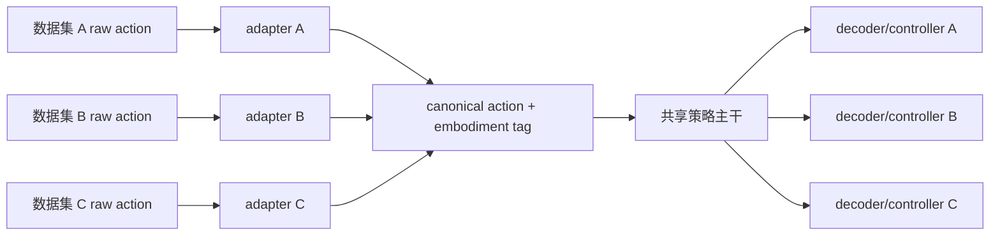

# 第16章 数据规模化、跨本体迁移与高效适配

> 状态：`drafted`
> 资料核查日期：2026-08-31
> 关联实验：`EXP-16-01`
> 关联声明：`CLAIM-16-01`～`CLAIM-16-06`
> 关联图表：`FIG-16-01` / `TAB-16-01` / `TAB-16-02` / `TAB-16-03`
> 资源档位：S / M / L1 / L2
> GPU 状态：待验证

## 本章契约

### 核心问题

把更多机器人数据放进同一个目录，为什么不等于得到可训练的跨本体数据集？如何对齐不同机器人的动作、时间和归一化，判断多数据混合带来正迁移还是负迁移，并在不要求购置硬件的前提下选择 action-head、LoRA/OFT、蒸馏或异步部署？

### 先修知识

- 已具备：第4章的数据/切分协议、第13章的动作 chunk、第15章的 action schema 与 VLA 架构；
- 本章补齐：数据 mixture、canonical action、embodiment adapter、归一化、迁移矩阵和高效适配；
- 不要求：下载 Open X-Embodiment/DROID、拥有机器人、训练 VLA 或 GPU。

### 非目标

- 不把统一存储格式等同统一动作语义；
- 不把数据帧数等同有效任务多样性或质量；
- 不声称跨本体预训练必然正迁移；
- 不把 LoRA、OFT、量化或蒸馏当作无损且通用的加速按钮；
- 不在当前设备自动下载大型数据、视频或 checkpoint。

### 学完后的可验证产出

读者应能为多数据 mixture 建立来源表，把每个本体动作转换到版本化 canonical schema，计算数据权重，设计 leave-one-embodiment-out 迁移矩阵，并为 24 GB 单卡与可选 2×80 GB 路线选择诚实的适配层级。

## 16.1 数据规模不是一行“共多少帧”

机器人数据的基本单位应是 episode/trajectory，而不是打散帧。一个训练样本需要保持图像、状态、动作、语言、时间戳、终止与 episode 边界；相邻帧高度相关，不能用帧级随机切分制造虚假测试集。

规模至少有六个轴：

- episode、小时和有效动作步数；
- 任务、对象、场景和语言覆盖；
- 本体、相机、控制器与采集方式；
- 成功、失败、恢复和空闲片段比例；
- 频率、缺帧、同步、压缩与标注质量；
- 数据许可、隐私、地域与人员来源。

两个 100 万帧数据集，一个可能来自单场景 30 Hz 长视频，另一个来自多任务 5 Hz 交互。按帧等权会隐式偏向高频、长 episode 和重复采集。需要先定义 mixture 目标，再选择采样权重：

\[
\mathcal{L}(\theta)=\sum_{d=1}^{D}w_d\,
\mathbb{E}_{(o,a)\sim\mathcal{D}_d}[\ell(\pi_\theta(o),a)],
\qquad \sum_d w_d=1.
\]

`w_d` 可以按数据集、任务、本体或温度采样设定。它不是“数据越多权重越大”的同义词，必须记录在配置和实验卡中。

## 16.2 三类开放数据入口，各自解决不同问题

| 生态 | 组织重点 | 适合研究 | 不能默认推出 |
| --- | --- | --- | --- |
| Open X-Embodiment | 多机构数据转换为 RLDS episode | 跨机器人预训练、mixture | 动作/许可/质量已完全统一 |
| DROID | 同类硬件在多地点多任务采集 | 场景与操作者多样性、真实操作 | 跨任意本体迁移 |
| LeRobot Dataset v3 | Parquet/MP4、metadata、Hub/streaming | 统一加载、版本化、教学管线 | episode 切分和动作语义天然正确 |

*TAB-16-01：三类数据入口的角色。格式、采集平台与训练 mixture 是三个层次。*

[Open X-Embodiment](https://github.com/google-deepmind/open_x_embodiment) 将各贡献数据转换为 RLDS episode，并为每个子数据集保留 metadata 与引用 `[P/O,R1]`。其论文报告多机器人联合训练的正迁移案例，但官方 README 同时说明动作七维可能分别表示绝对值、delta 或速度。统一成七维并没有消除控制语义差异；每个贡献数据的引用与许可仍需单独检查。

[DROID](https://droid-dataset.github.io/) 聚焦分布式真实机器人采集。论文报告 76k demonstration、350 小时、564 场景和 84 任务 `[P/O,R1]`；这些是上游数据说明，不是本书下载或审计结果。DROID适合研究同类平台上的场景/任务多样性，也不能单独回答不同关节、夹爪或底盘的动作对齐。

[LeRobot Dataset v3](https://github.com/huggingface/lerobot/blob/main/docs/source/lerobot-dataset-v3.mdx) 把低维 Parquet、分相机 MP4 与 episode metadata 解耦，并提供 schema、fps、统计量和 streaming 接口 `[O,R1]`。第4章已经解释：一个文件可含多个 episode，实验切分必须读 metadata。streaming 减少本地磁盘，不会消除网络、revision、缓存、许可和可重复性问题。

`CLAIM-16-01`（fact）：统一 episode 存储与加载 API 只解决格式层兼容；动作 frame、单位、absolute/delta、频率、本体和许可仍需逐数据集对齐与审计。

## 16.3 canonical action：共享什么，不共享什么

跨本体训练常尝试建立规范动作空间：

- **关节空间**：能保留低层控制，但不同机构维度和关节意义不同；
- **末端位姿/增量**：较易跨机械臂，但依赖 frame、IK、夹爪和下层 controller；
- **轨迹/路径点**：适合移动机器人和驾驶，仍依赖动力学跟踪；
- **技能/语言 token**：语义可迁移，具体执行多解；
- **latent/unified action**：可从多数据学习，需要对每个本体重新 grounding。



*FIG-16-01：跨本体数据与策略接口。canonical action 是版本化中间合同，不是自动可执行的万能动作。来源：本书原创，MIT，2026-08-31。*

canonical schema 至少包含字段名称/顺序、frame、单位、时间定义、absolute/delta、控制频率、范围、夹爪语义、缺失掩码和版本。转换应通过已知样本做 raw→canonical→raw round-trip，并在真实/仿真 controller 上验证可执行性。

无法无损对齐时，不应填零冒充共享维度。可保留 embodiment-specific head、mask 或 skill-level 共享，并把低层执行交给各本体 controller。

## 16.4 归一化也属于动作协议

常见变换是按训练集统计量标准化：

\[
\tilde a_j=\frac{a_j-\mu_j}{\sigma_j+\epsilon}.
\]

`μ,σ` 必须只由训练 split 计算，并与 dataset revision、embodiment、字段顺序一起保存。全局统计可能让大范围本体支配小范围本体；逐本体统计提高数值可比性，却要求推理时知道正确 embodiment。min/max 对异常值敏感，quantile clipping 会改变可达范围，也必须记录。

不能把训练数据归一化后的 `[-1,1]` 当物理安全范围。反归一化后仍要通过第15章的 frame、单位、bounds 和时效网关。

## 16.5 EXP-16-01：shape 相同，语义相反

S 档 fixture 有两个二维动作 schema，任务语义相同：

- `arm_a`：`delta_x` 是 controller delta unit，乘 `0.1` 得米；夹爪 `+1` 表示打开；
- `arm_b`：`delta_x` 是厘米，乘 `0.01` 得米；夹爪 `-1` 表示打开。

两个任务的 canonical target 分别是 `(0.02 m, 1.0 open)` 与 `(-0.01 m, 0.0 open)`。直接平均两个 raw action，再错误地按 `arm_a` 解码；对照则先由各自 adapter 转到 canonical 空间再平均。

```bash
make ch16-test-local
make ch16-smoke-local
make ch16-smoke
```

| 检查 | 固定结果 | 解释 |
| --- | ---: | --- |
| raw action shape | 两者均为 2 | shape 相同不表示协议相同 |
| naive raw pooling 规范语义 MAE | 0.28375 | 混合单位/极性改变动作意义 |
| schema-aware pooling MAE | 0.0 | 手工 adapter 对齐已知 fixture |
| 最大 adapter round-trip 误差 | 0.0 | 四条记录可逆 |
| 缺失 embodiment metadata | rejected | 不猜测转换规则 |

*TAB-16-02：`EXP-16-01` 结果。没有训练模型，因此 `0.28375` 是接口反例，不是负迁移性能。*

`CLAIM-16-02`（result）：`EXP-16-01` 中两个 raw action 都是二维，但位移单位和夹爪极性不同；相同 tensor shape 未提供语义兼容证据。

`CLAIM-16-03`（result）：直接 raw pooling 的 canonical MAE 为 `0.28375`，schema-aware pooling 为 `0`，adapter 最大 round-trip 误差为 `0`。这个确定性结果不能外推 learned adapter 或真实策略效果。

`CLAIM-16-04`（result）：fixture 对缺失/未知 `embodiment_id` 的记录拒绝转换，而不是套用默认本体；这只验证 metadata 门禁。

## 16.6 正迁移与负迁移必须用矩阵判断

要判断跨本体数据是否有用，至少比较：

1. 目标本体单独训练；
2. 目标 + 单个来源本体；
3. 完整 mixture；
4. 完整 mixture 但不提供 embodiment tag；
5. 完整 mixture + per-embodiment adapter/head；
6. leave-one-embodiment-out 预训练后适配。

每格报告目标任务闭环成功、恢复、动作约束、置信区间和训练成本；按任务/本体分别展示，不能只报宏平均。来源数据让目标分数下降才是该协议下的负迁移证据；raw schema 不兼容只是更早的工程错误，应先修复再研究迁移。

`CLAIM-16-05`（recommendation）：跨本体训练应以“目标单独训练”为基线，用固定预算的来源×目标迁移矩阵报告正/负迁移；只有混合模型分数或总体平均无法定位贡献。

## 16.7 从 action head 到 full fine-tune：逐级扩大权限

| 适配方式 | 训练范围 | 适用情况 | 主要风险 |
| --- | --- | --- | --- |
| schema adapter / 新 action head | 输入输出层 | 动作协议变化、数据少 | 主干特征不适配 |
| LoRA/adapter | 部分线性层/模块 | 语义和视觉中等偏移 | rank/插入位置敏感 |
| OFT 配方 | 多图/proprio + 连续 chunk 头等 | OpenVLA 类控制适配 | 不是通用优化器，资源仍重 |
| 部分解冻 | 视觉/语言顶部若干层 | 感知或指令偏移较大 | 遗忘、显存增加 |
| full fine-tune | 全模型 | 大数据且域差异大 | 成本、遗忘、版本耦合 |
| 蒸馏/小策略 | teacher→student | 部署延迟/显存受限 | teacher 错误与行为覆盖丢失 |

*TAB-16-03：适配权限阶梯。先用最小可证实的修改，不代表永远不能 full fine-tune。*

[OpenVLA-OFT](https://github.com/moojink/openvla-oft) 研究动作解码、连续 action chunk、proprioception 和 fine-tuning 目标的组合 `[A/O,R1]`。其上游结果说明适配配方会显著影响指定 benchmark，不证明 OFT 对所有 VLA、本体和数据都优。官方 README 当前给出约 16–18 GB 推理、27–80 GB 训练范围；这是上游配置说明，本书未实测。

LoRA 只减少可训练参数和优化器状态，不一定让 activation、输入视频或 action horizon 的显存变小到同样比例。量化可以降低权重显存，但可能改变 kernel、延迟和数值；梯度 checkpoint 降显存会增加计算。每种优化都要在目标硬件实测峰值显存、P50/P95、吞吐和闭环 outcome。

蒸馏时要决定 student 学 teacher 的单动作、分布、chunk、latent 或闭环轨迹。离线模仿 teacher 仍有第13章的分布偏移；只比较 action MSE 不足以证明部署等价。

## 16.8 异步推理：吞吐提高不等于动作更新更快

远程/异步策略常把相机采集、VLA 推理、action chunk 缓冲和 controller 分到不同进程或机器。它可以让执行不必等待每次推理，但引入：

- 观测、策略输出和执行时钟的对齐；
- 网络抖动、乱序、重试和重复执行；
- 新 chunk 与未执行旧 chunk 的拼接/替换；
- 指令变化、碰撞风险和急停时的抢占；
- server checkpoint/schema 与 robot client 版本协商。

日志必须同时记录 capture、server receive、inference start/end、client receive 和 execute 时间。模型 20 Hz 不等于有效 action age 为 50 ms；如果网络和队列积压，控制器可能一直执行旧动作。任何超时都进入确定性的保持、减速或停止策略。

## 16.9 自动驾驶正文：跨车队不是把 CAN 列拼起来

不同车辆可能记录方向盘角、前轮角、曲率或归一化 steering；油门/制动可能是踏板比例、加速度、压力或控制器目标。即使字段都叫 `steer`，转向比、符号、延迟和饱和范围也随车型变化。

跨车队 mixture 应优先转换为任务层 canonical 轨迹，例如 ego frame 下按固定时间步的 `(x,y,yaw,v)` 或带约束的曲率/加速度，再由每辆车的动力学和 controller 跟踪。转换要保存车辆参数、定位 frame、时间同步和可逆/有损说明。无法可靠转换的字段保留为 fleet-specific head。

数据权重还需按车队、路线、天气、地域、驾驶员和稀有事件审计；公里数多不等于危险事件覆盖好。按连续帧随机切分会泄漏同一路段和相邻时刻，应该按 route/log/vehicle 划分。

`CLAIM-16-06`（recommendation）：自动驾驶跨车队训练不得直接混合同名 raw control；应转换到版本化轨迹/动力学合同或使用 fleet-specific adapter，并以按车辆/路线拆分的闭环迁移矩阵验证。

驾驶数据还包含人脸、车牌、地理位置和行为记录，必须处理授权、脱敏、保留期限和跨地域治理。格式转换、裁剪和衍生 embedding 不会消除源数据许可与隐私责任。

## 16.10 资源、数据和许可路线

S 档 `EXP-16-01` 使用 Python 标准库、CPU、零下载和 MIT fixture，只验证 adapter 合同。

M 档在用户确认许可和体积后选择少量 LeRobot episode，训练小 action head/adapter 或 SmolVLA 小规模适配，默认不超过 24 GB 单卡、2–8 小时。先做 1–4 episode 过拟合、schema round-trip 和数据 checksum，再扩大；当前无 GPU 阶段不执行。

L1 可做 24 GB 单卡的 LoRA/蒸馏预检或 OpenVLA-OFT 量化推理；上游传统 OFT 训练下限约 27 GB，不能预先承诺符合 24 GB。L2 最多 2×80 GB，可做较大 adapter/部分解冻；若上游配方要求更多 GPU，则标记超出本书默认边界，而不是擅自缩小后声称复现。

所有环境优先 Docker，但大数据与 checkpoint 不写进镜像层。下载前输出预计字节数、缓存目录、许可和终止方式；代码、模型、每个子数据集、视频和衍生资产分别记录。Open X 软件 Apache-2.0、其余材料 CC-BY 的仓库说明不能替代每个贡献数据的原始条款。

## 16.11 失效模式与安全边界

重点失效包括：episode 泄漏、重复轨迹、失败/空闲片段未标、语言模板泄漏、相机/动作错位、global stats 污染测试集、absolute/delta 混用、夹爪极性反转、缺失 embodiment tag、mixture 被大数据集淹没、adapter 版本漂移、LoRA 合并错误、量化退化和异步旧动作。

诊断顺序是数据来源→episode/时间→schema/round-trip→mixture 权重→小样本过拟合→目标本体闭环。不要先用更大模型掩盖 schema 错误。任何跨本体输出仍需第15章的动作、安全和时效网关。

## 16.12 结果与证据边界

| 类型 | 声明/结果 | 来源 | 状态 | 限制 |
| --- | --- | --- | --- | --- |
| 本书结果 | raw pooling 与 schema-aware pooling 反例 | `EXP-16-01` | CPU smoke | 两维手工动作，不训练策略 |
| 开放生态 | Open X-Embodiment RLDS mixture | 论文/官方仓库 | `[P/O,R1]` | 本书未下载或运行 |
| 开放数据 | DROID 分布式操作数据 | 论文/官方项目 | `[P/O,R1]` | 本书未下载或审计 |
| 数据格式 | LeRobot Dataset v3 | 官方文档 | `[O,R1]` | 版本会漂移 |
| 适配案例 | OpenVLA-OFT | 论文/官方仓库 | `[A/O,R1]` | 上游结果，本书未运行 |
| 未验证 | 24 GB 内 adapter/SmolVLA 适配 | 后续 M/L1 | planned | 数据、GPU、迁移待测 |

## 小结

数据规模化的核心不是拼文件，而是保持 episode、来源和许可，并把动作语义转换到可审计合同。canonical action、embodiment tag 和 mixture 权重决定共享主干究竟学到共同能力还是接口噪声。LoRA/OFT、蒸馏和异步执行只是适配与部署工具，必须通过目标本体闭环和资源实测验收。

## 练习

1. **schema 练习**：把 `arm_b` 的厘米改成毫米但不改 metadata，计算误差。
2. **mixture 权重**：三个数据集分别有 100、1,000、10,000 episode，设计等数据集与温度采样权重。
3. **迁移矩阵**：为三个本体写出单独、两两、全量与 leave-one-out 的最小实验表。
4. **适配选择**：分别为“新夹爪”“新相机”“新语言域”选择 action head、LoRA 或部分解冻，并说明证据。
5. **自动驾驶迁移**：把方向盘角、曲率和轨迹三种日志映射到统一合同，列出不可逆信息。

## 延伸阅读

- Open X-Embodiment Collaboration, [论文](https://arxiv.org/abs/2310.08864)与[官方仓库](https://github.com/google-deepmind/open_x_embodiment)，`[P/O,R1]`；
- Khazatsky et al., [DROID](https://arxiv.org/abs/2403.12945) 与[项目页](https://droid-dataset.github.io/)，`[P/O,R1]`；
- Hugging Face, [LeRobot Dataset v3](https://github.com/huggingface/lerobot/blob/main/docs/source/lerobot-dataset-v3.mdx)，`[O,R1]`；
- Kim et al., [OpenVLA-OFT](https://arxiv.org/abs/2502.19645) 与[官方代码](https://github.com/moojink/openvla-oft)，`[A/O,R1]`；
- Hu et al., [LoRA](https://arxiv.org/abs/2106.09685)，`[P]`。

## 下一章接口

第17章会把已对齐的数据与策略放入“世界模型帮助策略”的五种用途，区分表示预训练、数据生成、模拟、规划/critic 和安全预测；第18章再讨论后训练与长时序。

## 验收与审查记录

```text
本地检查：make check-local
严格检查：make check
章节 smoke：make ch16-smoke
文档构建：make docs-build
```

- 内容审查：修改中；
- 代码审查：修改中；
- 一致性审查：修改中（已与第4/13/15章对齐，等待第17/18章）；
- 教学审查：修改中；
- 审查记录路径：待批次 B 交叉审查；
- 已知限制：没有下载真实数据、训练 adapter/VLA、运行仿真或 GPU；
- 下一步：完成第13–16章批次 B 交叉审查，并进入第17章融合框架。
