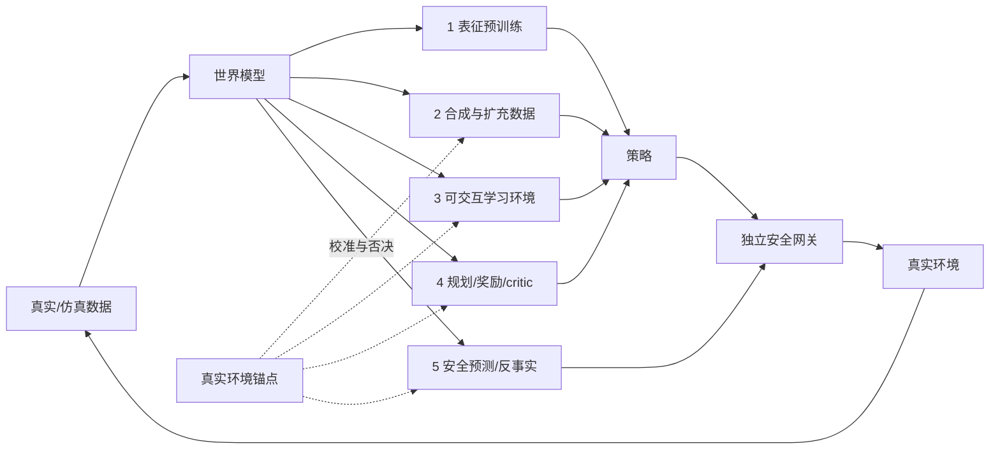

# 第17章 世界模型帮助策略的五种方式

## 本章契约

### 核心问题

一句“世界模型对策略有帮助”究竟指什么？它是在提供表征、生成数据、充当训练环境、参与规划/价值估计，还是做安全反事实检查？怎样用下游效用和真实环境锚点，防止策略利用世界模型的错误？

### 先修知识

- 已具备：第7章规划概念由本章提供最小桥接，第9章的用途驱动评测，第13章的闭环误差，第15章的 VLA 执行合同；
- 本章补齐：五类用途、用途—证据映射、simulator gap、model exploitation 和评测替身风险；
- 不要求：强化学习推导、3D 视觉、真实机器人/车辆、下载 checkpoint 或 GPU。

第7章已经给出 model predictive control（MPC）、terminal value 与重规划接口；本章在此基础上审查世界模型如何改变策略排序，并把第8章 imagined target 的误差传播连接进来。

### 非目标

- 不把生成视频的观感等同动作条件转移准确性；
- 不把世界模型、策略、planner、critic、仿真器和安全层合成一个含糊模块；
- 不声称运行 V-JEPA 2-AC、DreamerV3、TD-MPC2、Cosmos、WorldEval 或 WorldGym；
- 不用学习世界模型替代真实仿真器或最终部署评测；
- 不把上游排行榜、相关性或供应商声明写成本书实测。

### 学完后的可验证产出

读者应能从信息流与决策位置判断世界模型承担哪一种用途，解释同一预测误差为何会在不同用途下产生不同后果，并为每条用途写出相应的反事实基线、真实性锚点和停止条件。读者还应能区分模型提供的信息、下游模块如何使用信息，以及最终策略收益这三层证据。

## 17.1 先问世界模型在哪一条数据流上

世界模型的稳定接口可以写成：

\[
\hat p_\theta(z_{t+1},r_t,c_t\mid z_{\le t},a_t),
\]

其中 `z` 是状态或潜在状态，`a` 是动作，`r` 是奖励/代价，`c` 是 continuation 或终止信号。实际系统可以只预测其中一部分；用途不同，对遗漏字段的容忍度也不同。用于表征预训练时不一定需要动作，用于规划和安全反事实时则必须知道候选动作怎样改变未来。



*FIG-17-01：世界模型帮助策略的五条路径。来源：本书原创，MIT，2026-09-01。五类是数据流角色，不是互斥算法标签；一个系统可以同时跨多条路径。*

这里的“真实环境锚点”是相对于 learned world model 的独立参照：S/M 档可以用锁定规则、未参与训练的物理仿真或既有合法日志，不要求购置硬件；但这些只能支撑对应层级的声明。若声称真实机器人或道路效果，最终锚点仍必须来自相应真实系统，仿真结果不能改名为 real-world result。

`CLAIM-17-01`（fact）：五类用途共享预测模型，却不共享完成标准；表征 probe、生成质量、交互稳定性、规划 return 和安全漏检率不能互相替代。
{: .book-claim .claim-fact }

### 17.1.1 世界模型的价值是用途相对的

世界模型不需要恢复世界的一切细节，只需为指定决策保留足够信息。但“足够”由用途决定：表征预训练可能只需保留对象与运动线索，动作规划必须区分候选动作造成的未来差异，安全筛选还必须保留低概率高后果事件。一个忽略背景纹理的 latent 对控制可能更好，却可能不适合生成可审计视频；一个像素逼真的模型也可能忽略决定碰撞的几何小差异。

因此模型质量不是脱离任务的单一标量。更完整的因果链是：模型从数据学到某种预测信息，下游算法以特定规则读取该信息，规则改变候选选择或训练目标，最终才可能改变真实环境表现。任何一环没有对照，都不能把最终收益直接归因于“世界模型更懂世界”。

判断帮助是否真实，至少需要一个不使用该信息路径的反事实基线。例如表征用途比较不同初始化，合成数据比较等量真实复制，规划用途比较无模型选择器，安全用途比较独立规则门禁。仅比较“有世界模型的完整系统”和一个弱基线，往往同时改变参数量、训练数据、计算预算与决策规则。

## 17.2 用途一：表征预训练

世界模型可以先从无动作视频学习运动、对象持续性和时序表征，再让策略复用 encoder。此时世界模型帮助的是输入表征或初始化，不一定在部署时 rollout。

[V-JEPA 2](https://arxiv.org/abs/2506.09985) 先进行 action-free 视频表征预训练，再冻结 encoder、用机器人交互数据训练 action-conditioned predictor，并在 MPC 中使用 `[A/O,R1]`。官方仓库在核查日还包含 [V-JEPA 2.1](https://github.com/facebookresearch/vjepa2) 的 80M 到 2B dense-feature encoder；2.1 的 dense 表征更新不能自动当作 V-JEPA 2-AC 的新控制结果。

最低对照是随机初始化、通用视觉预训练和世界模型预训练三种 encoder，在相同策略头、数据、训练步数和增强下比较。probe 变好只证明信息更易读出；策略样本效率、闭环成功和 OOD 恢复仍需单独测。

表征迁移还要区分预测任务带来的信息与额外数据带来的信息。若世界模型预训练使用了更多视频、更多场景或更大主干，后续提升不一定来自“预测未来”这一目标。数据匹配与计算匹配的对照分别回答目标函数是否更好、整个预训练配方是否更有用，两者都值得报告但结论不同。

部署时冻结 encoder 也不意味着世界知识静止不变。策略头可能只读取其中一小部分特征，并在训练分布上形成新的捷径。评估应观察与动作相关的反事实：改变历史运动而保持单帧外观近似不变时，策略是否按任务需要改变动作；仅用线性 probe 读出速度，不证明策略实际依赖速度。

## 17.3 用途二：合成或扩充训练数据

世界模型可改变初态、背景、对象、天气、任务进度或动作条件未来，以扩充稀有场景和长尾组合。合成数据要保留生成条件、动作、时间、过滤器、随机种子和来源许可；只有视频而没有可信动作/状态标签时，不能直接加入控制监督。

[Cosmos-Predict2.5 推理指南快照 `a2c298b`](https://github.com/nvidia-cosmos/cosmos-predict2.5/blob/a2c298b0a3df3778b973fe65e9e58877b292d8a7/docs/inference_robot_action_cond.md)提供 action-conditioned 机器人视频生成与可替换 action loader 入口 `[O,R1]`；[默认 loader 实现](https://github.com/nvidia-cosmos/cosmos-predict2.5/blob/a2c298b0a3df3778b973fe65e9e58877b292d8a7/cosmos_predict2/action_conditioned.py)会从机器人 state 计算相邻帧的相对末端动作，并应用 fps 下采样和 action/gripper scale。因此 action frame、scale、gripper 语义和 fps 都是生成合同，不是附属参数。[Cosmos 3 action cookbook 快照 `9aa98e5`](https://github.com/NVIDIA/cosmos/blob/9aa98e5a0773a5558f07d2699e640858f7ca8827/cookbooks/cosmos3/generator/action/README.md)又把 action modeling 分为 policy、inverse dynamics 和 forward dynamics 三种 mode；只有 forward dynamics 接收候选 action chunk 来预测未来，不能把“模型能输出动作”自动写成“模型验证了这组动作”。

有效实验至少要有：只用真实数据、真实+同量复制、真实+合成，以及匹配算力/样本数的对照；报告覆盖率、重复率、标签一致性和闭环效用。合成数据增加不等于信息增加。

合成数据的“新颖”也有不同层级。改变纹理或光照可能扩展观测外观，却没有扩展状态—动作关系；组合新对象与旧动作可能扩展语义，但若接触动力学错误，监督标签并不可信；递归生成新轨迹则同时改变状态覆盖和模型误差。需要逐项说明新增的是视觉变化、任务组合、初态、动作分支还是转移结果。

过滤器会重新定义合成分布。用美学、成功判别器或人工规则删除样本，可能提高表面质量，也可能系统性删除困难失败和罕见模式。最终训练数据由生成器与过滤器共同决定，所以应保存生成前条件、拒绝原因和接受率，而不能只审计留下的样本。若过滤器使用与评测相同的 scorer，还可能把 scorer 偏好泄漏进训练集。

## 17.4 用途三：作为可交互学习环境

策略可在学习模型中产生动作，世界模型递归生成下一状态、奖励和终止，再用 imagined trajectories 更新策略。[DreamerV3](https://github.com/danijar/dreamerv3) 在学习的世界模型中训练 actor-critic；[TD-MPC2](https://github.com/nicklashansen/tdmpc2) 学习面向控制的潜在模型并结合规划 `[O/P,R1]`。这类系统追求任务相关预测，不要求像素逐点完美。

危险在于训练策略不是被动测试集：它会主动寻找预测模型最乐观的区域。模型最初在行为策略分布上准确，优化后的新策略可能把状态推到 OOD。缓解方式包括短 rollout、真实数据混合、ensemble/不确定性惩罚、support/coverage gate、保守目标、周期性真实性回查和发现盲区后重采样；没有任何一种能把 learned simulator 变成无条件真值。[MOPO](https://proceedings.neurips.cc/paper_files/paper/2020/hash/a322852ce0df73e204b7e67cbbef0d0a-Abstract.html) 是用模型不确定性惩罚缓解离线分布偏移的代表性一手论文 `[P,R1]`，但本书没有复现其算法或 benchmark，也不把“处于数据 support 内”写成模型一定准确。

终止语义也会改变 imagined target。[TD-MPC2](https://github.com/nicklashansen/tdmpc2) 当前官方实现虽然已经支持 episodic task，但 `episodic=true` 仍需显式开启且默认关闭以保持旧结果可复现 `[O,R1]`。因此比较 checkpoint 或复现实验时要同时登记 termination 开关、horizon 和 bootstrap 规则，不能只写算法名。

单步预测误差与递归环境误差之间还隔着状态分布反馈。模型生成的下一状态会成为自己的下一次输入，早期偏差可能进入训练数据从未覆盖的 latent 区域；策略又会针对这些生成状态优化，使偏差与策略选择相互强化。短 rollout 的作用不是让单步模型更正确，而是限制模型自生成输入占据目标的比例，并更频繁地重新锚定真实状态。

奖励和终止预测往往比观测重建更直接地影响策略。一个视觉上不明显的终止错误会决定是否 bootstrap，一个很小但方向一致的奖励偏差会被策略反复利用。验收不能只看状态预测，还要分别检查 transition、reward、continuation 及其在 imagined return 中的组合误差。

### 17.4.1 同一动力学先验仍需双重验收

[A2World](https://arxiv.org/abs/2606.29501v1)提供了一个双用途案例：先用真实动作标注预训练多视角 action-to-video diffusion world model，再从同一预训练权重分别适配为 history-aware、可自回归 rollout 的 `A2World-sim`，以及联合预测视频与动作的 `A2World-policy`。ECCV 2026 的[官方收录页](https://eccv.ecva.net/virtual/2026/poster/3656)确认该论文已接收 `[P]`；论文中的规模、性能和真实机器人结果仍是作者报告，不是本书测量。

“同一先验服务两条分支”只说明参数初始化和训练知识可能共享，不让两种完成标准合并。至少需要四组互不替代的证据：

1. **先验本身**：冻结数据与预算，对比随机初始化、普通视频预训练和 action-to-video 预训练，分别在 simulator 与 policy 分支上做消融；
2. **simulator 分支**：在未参与训练或选择的 policy/task 上报告 action-conditioned rollout、return gap、策略排序、失败事件和 scorer 误差；
3. **policy 分支**：在独立闭环环境报告成功、碰撞/约束、干预、延迟和分布外退化，不能用生成视频质量替代；
4. **共享是否真的有益**：两条分支都要用相同下游数据、更新数和模型容量对比；一条分支获益不证明另一条也获益。

[官方仓库快照 `077e10a`](https://github.com/LogosRoboticsGroup/A2World/tree/077e10ad6cee07342b5e779f11fea78247584834)明确说明当前 code release 聚焦 world-model component，包含多视角 A2World inference、history-aware A2World-sim、LIBERO 转换/全量微调和 rollout；它没有把 A2World-policy 列入当前代码发布。仓库源码是 Apache-2.0，但 A2World checkpoint 是 NVIDIA Cosmos 衍生模型，按仓库内 NVIDIA Open Model License 管理；`world_model/README.md` 的全量微调示例还使用 `GPUS=8`。本书只完成零下载源码审计，既没有得到 24 GB 单卡/2×80 GB 可行证据，也没有运行模型。

`CLAIM-17-09`（fact）：A2World 论文把同一个 action-to-video 预训练先验分别适配为 A2World-sim 与 A2World-policy，而官方仓库快照 `077e10a` 明确把当前代码发布限定在 world-model/A2World-sim 侧；这一事实只描述论文架构和已发布资产范围，不证明两种能力已由本书复现、同等开放或可用同一指标验收。
{: .book-claim .claim-fact }

## 17.5 用途四：规划、奖励或 critic

规划器可在每个时刻生成候选动作序列，通过世界模型预测代价，再只执行第一步：

\[
a_t=\operatorname{first}\!\left(\arg\max_{a_{t:t+H-1}}
\mathbb E_{\hat p_\theta}\left[\sum_{k=0}^{H-1}\gamma^k\hat r_{t+k}\right]\right).
\]

receding horizon 能用新观测纠偏，却不能消除第一步就错误的碰撞预测。V-JEPA 2-AC 用潜在目标能量和 CEM 做图像目标规划；论文也报告相机位置敏感性和不同模型的巨大规划时延差异。这些失败信息比“能生成 rollout”更接近工程决策。

世界模型还可只提供 reward/critic、终止或可达性，而不渲染未来。比较时要分开：候选生成质量、模型评估误差、search budget、墙钟时延、实际执行前缀和闭环 outcome。

规划关注的不是随机候选上的平均误差，而是排序边界附近和最终被选候选上的误差。若两个候选真实价值接近，小预测误差可能改变排序却几乎不增加 regret；若模型把灾难动作高估为最优，即使总体误差很小，后果也很大。因此应同时报告预测 gap、pairwise inversion、选择 regret 与风险事件，而不能把相关系数当成完整决策质量。

搜索预算越大，也可能越容易找到模型的极端乐观误差。这与统计中的多重比较相似：planner 检查更多候选，不只增加找到好动作的机会，也增加找到“只在模型里好”的动作的机会。扩大 CEM 样本数、树深或 best-of-N 时，应重新校准真实性锚点和不确定性门禁，不能假设更强搜索必然单调改善真实结果。

## 17.6 用途五：安全预测与反事实验证

安全反事实询问：“若执行候选动作，未来是否越界、碰撞、失稳或进入不可恢复状态？”它需要动作条件预测、足够 horizon、风险事件召回和不确定性处理。对稀有事件，平均误差很低也可能漏掉唯一危险模式。

`CLAIM-17-03`（recommendation）：用于规划或安全筛选的世界模型必须在候选策略诱导分布上报告动作条件转移、return/风险 gap、OOD 与漏检；高平均预测准确率不能单独授权执行。
{: .book-claim .claim-recommendation }

世界模型只能增加一道预测性检查。硬范围、碰撞几何、速度/力限制、watchdog、急停和最小风险动作仍由独立安全层执行。若模型间分歧大、输入过期或场景超出覆盖范围，应拒绝、减速或转入保守控制，而不是继续生成更自信的视频。

安全筛选具有不对称错误代价。漏检会放行危险候选，误报会拒绝本来安全的候选并增加 fallback；二者都不能由总体 accuracy 表达。阈值选择应结合事件严重度、独立安全层能力与回退代价，并分别报告每类风险的召回、误报和未决状态。对于不可恢复事件，模型“多数时候正确”不是足够标准。

反事实还要求比较共享前缀后的动作差异。如果不同候选 rollout 使用不一致的初态、随机环境或其他主体行为，结果差可能来自外生随机性而非 ego 动作。可控仿真中应尽量采用共同随机数或成对场景，并明确其他主体是固定反应、闭环响应还是联合生成；learned world model 无法提供这种语义时，反事实结论必须降级。

## 17.7 第六种高风险用法：把世界模型当评测替身

[WorldEval](https://arxiv.org/abs/2505.19017) 和 [WorldGym](https://arxiv.org/abs/2506.00613) 研究用视频世界模型运行或排序机器人策略；WorldGym 的官方仓库提供 OpenVLA、Octo、SpatialVLA 和 RT-1-X runner `[A/O,R1]`。这是一条重要的降本路线，但应视为代理评测，不列入前五类“帮助策略学习/执行”的主路径。

`CLAIM-17-04`（inference）：世界模型中的策略排序与真实排序相关，只支持其已验证任务、策略族和协议中的筛选用途；相关性不能校准绝对成功率，也不能替代新策略、OOD 场景和最终安全评测。
{: .book-claim .claim-inference }

代理评测至少包含三段误差：策略动作是否按正确 schema 注入、世界模型 rollout 是否保持动作条件动力学、自动/VLM outcome scorer 是否正确判定成功与失败。[WorldGym 官方 runner](https://github.com/world-model-eval/world-model-eval) 同时打包 diffusion world model、多个 policy runner 和自动 VLM scoring；最终相关性是三段误差的合成，不能只归因于“world model quality” `[O,R1]`。

### 17.7.1 把“模型错了”拆成可定位的四段账

三段描述仍容易把中间 state/pose 解码藏进 rollout。更可审计的代理评测应保存四段输入输出，而不是只留最终成功分：

| 组件 | 输入→输出 | 最小负对照 | 必须保留的证据 |
| --- | --- | --- | --- |
| action grounding | policy command→实际注入 action | frame、单位、时序或左右标签置换 | 原命令、转换后命令、执行回执 |
| transition model | 注入 action+state→预测下一状态/帧 | 固定动作干预与真实转移锚点 | rollout、首个偏离步、coverage |
| state decoder | latent/frame→pose、状态或事件 | 已知 pose/终止的盲测样本 | decoder 版本、误差、失败样本 |
| outcome scorer | 解码轨迹→成功、风险或 return | 人工/规则 oracle confusion matrix | 原始判定、阈值、盲法和分母 |

*TAB-17-03：代理世界模型评测的四段归因账。来源：本书原创接口；`EXP-17-01` v6 只验证单故障机制。*

[KineBench](https://arxiv.org/abs/2607.19876)指出依赖 IDM 从生成视频恢复动作会混淆世界模型误差与动作提取误差，并改用分割、深度估计和 6D pose tracking 组成的显式运动学管线 `[P]`。这减少了一类黑盒归因，却没有让新管线变成真值：论文也明确其可靠性仍依赖 segmentation、depth 与 pose-tracking 模块。因而“IDM-free”应读作更可分解，而不是“action grounding 无误”。[WorldArena 2.0](https://arxiv.org/abs/2605.17912)又把评测从视觉/离线/仿真扩展到视触觉、交互式策略优化和真实平台 `[P]`；平台或模态一变，四段账都应重新校准，不能沿用一个总相关系数。

`EXP-17-01` v6 给四段各注入一个确定性故障。全正确 oracle 保持 `safe_route`、Spearman 为 `1`、regret 为 `0`；action-grounding 故障把安全策略错误注入为 shortcut，代理改选 `idle`，真实 regret 为 `1.05`。更关键的是，transition 把碰撞预测成 goal、decoder 把 collision 解码成 goal、scorer 把 collision 直接打成 `1.0` 时，三者产生完全相同的最终三策略分数、都选择 `phantom_shortcut`，Spearman 都为 `-0.5`、真实 regret 都为 `1.85`。只有检查中间的 predicted terminal 与 decoded terminal 才能定位故障段。

`CLAIM-17-10`（result）：在 `EXP-17-01` v6 的单故障四段管线中，transition、state decoder 和 outcome scorer 三个不同故障产生相同最终代理分数与错误策略选择；因此端到端相关性、成功分或 regret 不能单独归因到某个组件。该结果只证明固定 corridor 中的不可辨识反例，不给出真实组件故障率、误差独立性或可加总的统计预算。
{: .book-claim .claim-result }

### 17.7.2 相关性必须面向模型冻结后的新策略

代理评测最容易产生的泄漏不是 episode 重复，而是**策略参与了代理选择**：同一批 checkpoint 被用来挑 world model、调 scorer、定阈值，再用它们报告相关性。这个数字是 retrospective fit，不能回答优化器下一次提交的新策略是否仍保持排序。

[Interactive World Simulator](https://arxiv.org/abs/2603.08546)报告将 DP、ACT、`π0`、`π0.5` 的 final/intermediate checkpoints 放入 world simulator 与真实机器人，在四项任务、每项20个来自 simulator 训练分布的初态上比较，并给出相关性和 Clopper–Pearson 区间 `[P]`。这是作者协议下的有价值配对证据；但正文同时应保留它的总体边界：这些结果不能自动覆盖未参与选择的新 policy family、训练数据来源、动作 schema 或分布外初态。本书没有运行该模型或核验其数值。

| 分区 | 可用于什么 | 不得做什么 |
| --- | --- | --- |
| calibration policies | 冻结 world model、decoder、scorer、阈值与拒绝规则 | 调完后再称为 prospective test |
| prospective policies | 模型冻结后首次进入，按独立训练 run/lineage 或新 policy family 留出 | 看真实结果后只报告“相关的子集” |
| reality anchor | 在匹配初态与协议上取得真实/物理 simulator outcome | 参与 world model、scorer 或阈值选择 |
| next round | 本轮 prospective 结果完整发布后可进入下一轮 calibration | 重复使用同一 holdout 并继续称为新策略 |

*TAB-17-04：代理策略排序的时间化三分区合同。来源：本书原创；策略身份应沿第4、22章的训练 lineage 与选择历史记录。*

`EXP-17-01` v6 先只看 `safe_route/idle` 两个 calibration policy：世界模型对它们的 return 完全正确，Spearman 为 `1.0`、最大 gap 为 `0`。模型冻结后才加入从未进入 calibration 的 `phantom_shortcut`；三策略 Spearman 立刻变为 `-0.5`，代理选中真实碰撞策略，regret 为 `1.85`。两策略上的 `ρ=1` 本身极不稳定，这正是不能把小型回顾性 panel 包装成泛化证书的原因。

`CLAIM-17-11`（result）：`EXP-17-01` v6 的两策略 calibration panel 具有 Spearman `1.0` 和零 return gap，但加入一个不相交 held-out policy 后，prospective 排序变为 `-0.5` 并选中真实碰撞策略；因此冻结 panel 上的完美回顾性相关不蕴含对新策略的排序有效性。该结果只验证三个手工策略的 split 机制，不估计 learned simulator 对真实新策略的失败概率。
{: .book-claim .claim-result }

代理评测要预注册真实性锚点：至少保留一组未用于训练世界模型或 scorer 的独立仿真/硬件 episode，报告 Pearson/Spearman、逐策略偏差、置信区间、错误排序、失败视频、scorer confusion matrix 和新增策略后的校准漂移。策略数量很少或分数并列时，Spearman 必须使用平均秩并报告区间；全体分数相同则相关系数未定义，不能记成零。若只公布相关性最高的子集，就无法判断筛选器何时失效。

## 17.8 8/9 正确仍选中碰撞策略（EXP-17-01）

S 档 corridor fixture 有三个固定策略：四步前进的 `safe_route`、一步 `phantom_shortcut` 和原地等待的 `idle`。学习世界模型在 9 个测试转移中与真实规则一致 8 个，只把起点 `shortcut` 错误预测为直接到达；真实规则中它会碰撞。训练支持集只包含各位置的 `advance/wait`，所以 `shortcut` 虽然得到高置信回报，仍是显式 support 外查询。

<details markdown="1">
<summary>可选：验证本章证据</summary>

```bash
make ch17-test-local
make ch17-smoke-local
make ch17-smoke
```

</details>

| 指标 | 固定结果 | 解释边界 |
| --- | ---: | --- |
| 单步转移一致率 | 8/9（88.89%） | 手工离散转移，不是模型准确率 |
| `safe_route` 真实/模型 return | 0.85 / 0.85 | 模型在已覆盖路径正确 |
| `phantom_shortcut` 真实/模型 return | -1.0 / 1.0 | 唯一乐观盲区 |
| 三策略 Spearman | -0.5 | 排序反转，不代表总体相关性 |
| 最大绝对 return gap | 2.0 | fixture 的无量纲回报 |
| model exploitation regret | 1.85 | 真实最优减模型所选策略真实回报 |
| 模型所选首转移是否正确 | false | 平均 8/9 掩盖选择诱导分布上的首步错误 |
| support gate 后选择/真实终点 | `safe_route` / goal | 拒绝唯一 support 外策略 |
| support gate 后 regret | 0.0 | 本 fixture 固定支持集上的结果 |
| 把错误 state-action 声明为 support 内后的拒绝数 | 0 | 同一模型错误、只改变手工 support 声明 |
| support 内负对照的选择/真实终点 | `phantom_shortcut` / collision | coverage membership 不检查预测是否正确 |
| support 内负对照的 regret | 1.85 | 与无 gate 相同 |
| 四段归因场景数 | 5 | oracle 加四个单故障，不是故障率样本 |
| action-grounding 故障选择/regret | `idle` / 1.05 | 命令被错误映射为 shortcut |
| transition/decoder/scorer 故障 | 相同代理分数，均选 `phantom_shortcut` | 中间 trace 不同，最终分数不可定位 |
| calibration panel Spearman / 最大 gap | 1.0 / 0 | 仅 `safe_route/idle` 两个已知策略 |
| 加入 held-out policy 后 Spearman | -0.5 | 模型参数与评分规则不变 |
| prospective 选择/真实终点/regret | `phantom_shortcut` / collision / 1.85 | 三个手工策略，不是总体失败率 |

*TAB-17-01：`EXP-17-01` 的模型 gap 与策略排序。固定规则用于说明接口，不是 learned simulator benchmark。*

`CLAIM-17-02`（result）：`EXP-17-01` 的学习模型单步一致率为 `8/9`，却把真实最优 `safe_route` 排在乐观捷径之后；模型所选策略在真实规则中碰撞，排序 Spearman 为 `-0.5`，exploitation regret 为 `1.85`。该结果只验证手工 corridor 中的模型利用机制，不估计学习式世界模型的真实碰撞率。
{: .book-claim .claim-result }

这个反例不是说 88.89% 必然不够，而是说明错误权重取决于策略访问频率和后果。安全关键转移应分桶、加权并做压力测试，不能被大量容易的 `wait/advance` 样本稀释。

### 17.8.1 同为 8/9，错误位置决定当前策略后果

为了避免把上述结果误读成“88.89% 这个数字本身太低”，`EXP-17-01` v6 再构造一个等准确率模型。两个模型都只在同一9格均匀 transition panel 上错1格，但把错误放在不同 query：

| 单故障模型 | 错误 query | 均匀准确率 | 当前候选 panel 访问次数 | 模型选择 | 真实终点 | regret |
| --- | --- | ---: | ---: | --- | --- | ---: |
| candidate-reachable | `(0, shortcut)` | 8/9 | 1 | `phantom_shortcut` | collision | 1.85 |
| current-panel-unvisited | `(3, wait)` | 8/9 | 0 | `safe_route` | goal | 0 |

*TAB-17-05：`EXP-17-01` v6 的等均匀准确率—异决策后果负对照。访问次数只针对三个固定候选策略从固定初态产生的 query；它不是总体 occupancy 或未来 planner 分布。*

`CLAIM-17-12`（result）：`EXP-17-01` v6 的两个单故障模型在同一9格 transition panel 上均为8/9正确，但错误落在当前候选可达 shortcut 时，模型选择碰撞策略且 regret 为1.85；错误落在当前 panel 不访问的 `(3,wait)` 时，仍选择真实最优且 regret 为0。该结果只证明均匀准确率不能识别这个固定候选集下的错误位置与决策后果；不表示 `(3,wait)` 对其他初态、策略、planner 或部署分布安全，也不估计真实 occupancy、严重度或故障率。
{: .book-claim .claim-result }

`CLAIM-17-07`（result）：在 fixture 的 support 外设置中，gate 拒绝唯一未覆盖的 `phantom_shortcut`，从剩余两个策略选中 `safe_route`，使真实 exploitation regret 从 `1.85` 降为 `0`。这是手工已知 support 的机制对照，不证明 learned OOD estimator 校准。
{: .book-claim .claim-result }

`CLAIM-17-08`（result）：保持世界模型、策略和真实规则不变，只把 `(position=0, shortcut)` 加入手工 support 后，gate 接受全部三个策略，仍选中真实会碰撞的 `phantom_shortcut`，exploitation regret 保持 `1.85`。该负对照只证明 coverage membership 不能发现 support 内模型错误，也不估计真实数据覆盖质量或 learned uncertainty 的失效率。
{: .book-claim .claim-result }

## 17.9 五类用途的验收矩阵

| 用途 | 世界模型产出 | 最低下游对照 | 主要失效指标 |
| --- | --- | --- | --- |
| 表征预训练 | encoder/latent | 同策略头的随机与通用视觉预训练 | probe 好但闭环无增益 |
| 合成数据 | 条件样本/轨迹 | 同真实样本量与复制对照 | 标签错、重复、负迁移 |
| 可交互环境 | imagined transition/reward | 真实数据混合与真实环境回查 | exploitation、长时漂移 |
| planner/critic | 候选 return/energy/value | 无模型策略与 oracle/真实 simulator | 错排、时延、首步风险 |
| 安全反事实 | 风险事件/不可恢复状态 | 独立规则/几何与故障注入 | 漏检、过度拒绝、OOD |

*TAB-17-02：用途决定证据。一个系统可跨多行，但必须分别报告。*

coverage gate 的分母也要明确：按单步 state-action、完整 action chunk、整条候选轨迹，还是本体/任务级 coverage。轨迹中任一步超出支持就应记录 first unsupported step；只对起始观测做 OOD 检查，无法约束 planner 后续把 rollout 推出覆盖范围。反过来，整条轨迹都被标为 covered 也只说明满足 coverage 定义，不证明 transition、reward、termination 或风险预测正确；仍要在第9章 E3/E4 的独立真实性锚点上回查。

## 17.10 自动驾驶正文：四个角色，四套证据

自动驾驶世界模型可承担：生成雨夜/切入场景，按候选转向与制动 rollout，给规划器估计碰撞/舒适代价，以及对稀有事件做反事实压力测试。四者不能共享一个“视频质量很好”的结论。

一个驾驶 planner 若发现世界模型中的“穿过护栏捷径”，会像 `EXP-17-01` 一样主动利用盲区。评测必须按道路使用者、碰撞严重度、车速、遮挡、地图/坐标误差和动作范围分桶；对模型所选轨迹，再由车辆动力学、道路边界、occupancy、控制限幅和最小风险层独立检查。

同样的总体 transition error 可以落在停车场低速等待，也可以落在高速切入、行人横穿或规划器反复查询的候选轨迹上。驾驶评测至少应同时报告固定基准分布、当前策略 occupancy、候选规划器 query 分布和风险严重度分层；其中任何一层的加权指标都依赖已冻结策略与 ODD，策略更新后必须重新估计，不能把一次“低访问错误”永久标成低风险。

`CLAIM-17-05`（recommendation）：自动驾驶使用世界模型时，应为场景生成、驾驶 rollout、规划代价和稀有事件验证分别登记数据、horizon、动作合同和真实性锚点；任何一类通过都不能授权另一类用途。
{: .book-claim .claim-recommendation }

`CLAIM-17-06`（recommendation）：驾驶与机器人数据扩充应优先审查当前策略可达、模型过度乐观且后果严重的状态，而不是只按平均预测误差排序；选择协议需要同时登记可达性、不确定性、风险与覆盖成本。
{: .book-claim .claim-recommendation }

## 17.11 资源、开源与许可路线

S 档 `EXP-17-01` 使用 Python 标准库、CPU、零下载和 MIT fixture，不运行学习模型。

M 档在第19章锁定的轻量仿真中采集小型状态/动作 rollout：机器人动力学优先 MuJoCo，驾驶闭环优先 MetaDrive；训练紧凑 latent dynamics，并与真实 simulator 做 held-out transition、return gap 和策略排序对照。目标为 24 GB 单卡以内，先用低维状态或低分辨率观察、小 horizon 和固定策略，不要求购买硬件。当前没有 GPU，且尚未安装仿真器，因此此路径为 `planned`。

L1 可运行 TD-MPC2 小任务；V-JEPA 2.1 80M encoder 的冻结 probe 只有在第10章 S1 loader 预检通过后才进入候选。当前锁定官方快照的默认 Hub URL 指向 localhost，因此不能把公开权重入口误报为已可冷启动运行；上游配置、数据和显存仍需单独实测。V-JEPA 2-AC 官方 action-conditioned checkpoint 基于更大的 ViT-g，不能用80M encoder规模替代其控制证据。

L2 才考虑 WorldGym/WorldEval、Cosmos 或大 checkpoint 的代理评测与生成实验，最高限制为 2×80 GB，超过上限则只保留论文/官方案例。WorldGym README 当前示例 world-model checkpoint 约 9 GB，但它还要求具体 policy runner、转换数据和 VLM scorer；磁盘文件大小不是 VRAM 或总资源需求。完整生成缓存与运行显存尚未由本书验证。

V-JEPA 2 仓库主体为 MIT、部分数据增强文件为 Apache-2.0；DreamerV3 与 TD-MPC2 仓库为 MIT。Cosmos、checkpoint、数据和下游 runner 必须分别核验代码与模型许可，不能从 GitHub badge 推导所有资产可同样使用。

## 17.12 失效模式与停止条件

重点失败包括：动作不进入模型、frame/单位错配、reward hacking、终止预测错误、长时 compounding error、随机生成不可复现、策略进入 OOD、ensemble 共同偏差、代理评分器偏好视觉合理性、规划时延超过控制周期，以及训练/评测数据泄漏。

满足以下任一条件就停止把模型用于决策：真实锚点策略排序反转；风险漏检超过预注册阈值；候选动作落在训练覆盖外且无保守回退；模型输入时间戳/动作 schema 不匹配；模型调用超过 deadline；失败 episode 无法追到初态、动作和模型版本。

## 17.13 结果与证据边界

| 类型 | 声明/结果 | 来源 | 状态 | 限制 |
| --- | --- | --- | --- | --- |
| 本书结果 | 8/9 转移一致但策略错排；gate 阻断 support 外捷径、却不能阻断同一 support 内错误 | `EXP-17-01` | CPU smoke | 手工 corridor 与两套 authored support 声明 |
| 论文/代码 | 表征预训练后训练 action-conditioned planner | V-JEPA 2/2.1 | `[A/O,R1]` | 本书未运行 |
| 论文/代码 | imagined actor-critic 与 latent MPC | DreamerV3、TD-MPC2 | `[P/O,R1]` | 本书未运行 |
| 论文/部分代码 | 同一 action-to-video 先验分化为 simulator 与 policy | A2World | `[P/O,R1]` | 当前仓库聚焦 world-model/A2World-sim；policy 与论文结果未复现 |
| 开源平台 | 生成/动作条件 world foundation model | Cosmos | `[O,R1]` | 版本和许可会漂移 |
| 论文/代码 | 世界模型代理策略评测 | WorldEval、WorldGym | `[A/O,R1]` | 相关/排序不等于真实绝对值 |
| 未验证 | 24 GB 内 learned simulator 对照 | 可选 M/L1 | planned | GPU、仿真、数据待验证 |

## 小结

世界模型不是一种单一增益模块。它可以提供表征、数据、交互环境、规划/价值和安全反事实，但每种用途要求保留的信息、读取方式和错误代价都不同。模型提供预测信息，下游算法使用信息，真实策略获得收益是三层独立证据；必须用用途对应的反事实基线才能讨论归因。

合成数据由生成器和过滤器共同定义，递归环境会让模型偏差与策略优化互相强化，规划器会选择性放大乐观误差，安全筛选则面对漏检与误报的不对称代价。平均预测分数必须与真实性锚点上的 return gap、风险漏检、coverage 和策略排序一起报告；support gate 不能验证覆盖内预测，代理评测也不能取消最终目标环境验证。

## 练习

1. **用途判断**：冻结视频 encoder 训练 ACT，部署时不 rollout，属于哪一类？还需要什么对照？
2. **风险推演**：把 `shortcut` 错误设为低概率乐观事件，从均值、尾部风险和选择规则三个角度解释为何同一预测分布可能导向不同决策。
3. **规划分析**：说明 receding horizon 为什么能缓解长时误差，却无法阻止错误第一步。
4. **评测设计**：为世界模型代理评测预注册真实锚点、策略族和拒绝条件。
5. **自动驾驶迁移**：设计“模型认为可穿过、真实存在施工锥”的故障注入与最小风险动作。
6. **等准确率反例**：构造两个单步准确率相同、但错误分别落在当前策略高访问和零访问 query 的模型；说明策略更新后为什么必须重算权重。

## 自检要点

先独立写清用途、选择准则和真实性锚点，再展开自检。这里的数值只对应 `EXP-17-01` 或题目中明确给出的反事实，不是 learned world model 的实测性能。

<details markdown="1">
<summary>SELF-CHECK-17-01：冻结 encoder 不等于在线 simulator</summary>

这是“表征预训练”用途：世界模型只提供冻结 video encoder，ACT 在真实/记录动作监督上学习，部署时既不生成未来，也不按候选动作递归 rollout。最低对照应固定 ACT、数据切分、训练步数和 action schema，只替换 encoder，至少比较随机初始化、通用视觉预训练和该视频 encoder；再报告 ID/shift 的动作误差、闭环成功与安全，而不是只报 probe。若 encoder 预训练数据与评测 route/episode 同源，还要先做泄漏审计。这个实验不能推出 encoder 具备规划、reward、termination 或反事实能力。

</details>

<details markdown="1">
<summary>SELF-CHECK-17-02：随机乐观错误要同时看均值与尾部</summary>

一种可复核改法是令 `shortcut` 的模型 return 以 0.1 概率为 20、以 0.9 概率为 -1；其模型均值为 `0.1×20+0.9×(-1)=1.1`，高于 `safe_route` 的 0.85，所以按模型均值选 shortcut。若以最差 20% 的条件均值或 20% 分位数做保守选择，shortcut 的值为 -1，因而会选 safe route；真实规则中的 shortcut 仍为碰撞、return -1。运行多 seed 时应保存每个候选的抽样数、均值、分位数和最终选择；best-of-N 还可能放大罕见乐观样本。该构造只说明选择准则会改变模型利用风险，不证明某个尾部阈值已校准。

</details>

<details markdown="1">
<summary>SELF-CHECK-17-03：receding horizon 不能撤回错误首步</summary>

滚动时域每执行一小段就用新观察重规划，因此能截断远端预测误差的累积，并在环境偏离想象后更新计划。但当前周期选出的第一步仍由当前错误模型排序；若它已越过护栏、碰撞或进入不可恢复状态，下一次重规划没有机会撤销。最低安全设计还需独立检查首步/短前缀的可达性、碰撞、动作范围、support 和 deadline，并允许拒绝或 fallback。缩短 horizon 是误差管理手段，不是模型正确性或安全证明。

</details>

<details markdown="1">
<summary>SELF-CHECK-17-04：代理评测的预注册合同</summary>

最低合同应在看最终结果前冻结：真实锚点（例如同一策略在固定版本 MetaDrive 或物理 simulator 的 route return/碰撞）、策略族及其训练来源、固定 route/seed、模型 rollout horizon/候选预算、代理与锚点的排序指标，以及有效/无效运行分母。可预注册拒绝条件为：策略排序相关低于阈值、model-vs-anchor return gap 或风险漏检超过阈值、所选轨迹越出 support、首步风险 gate 失败或 deadline miss。应保留无模型基线、已知 dynamics/oracle 和专门诱导 exploitation 的负对照。通过只授权该策略族与场景范围内的筛选，不能替代最终目标环境评测。

</details>

<details markdown="1">
<summary>SELF-CHECK-17-05：施工锥幻觉与最小风险动作</summary>

在固定 route/seed 放置有可追踪 ID 的施工锥，使 learned model 将占用区域预测为可通行；候选规划器应因此产生穿越锥桶的诱导轨迹。独立锚点用 simulator collision/occupancy 和道路边界检查同一动作前缀，并记录首次分歧时刻、TTC、速度、制动距离、模型风险、gate 原因和 intervention。合格的最小风险响应是在可用距离和后车风险允许时受控减速并停在障碍前，或切换到经独立验证的安全走廊；不得继续执行旧 chunk。一次成功停车只验证该注入与动力学条件，不证明任意施工区或真实道路安全。

</details>

<details markdown="1">
<summary>SELF-CHECK-17-06：均匀准确率不包含决策访问与后果</summary>

两个模型都在9个等权 transition 中只错1个，所以均匀准确率同为 `8/9`。但固定候选 panel 会查询 `(0,shortcut)` 一次、不会查询 `(3,wait)`：前一个错误把 shortcut 从真实碰撞错误评为成功，模型因而选择它并产生1.85 regret；后一个错误不改变当前三策略 return，仍选 safe route。这里的“零访问”只相对于固定初态与候选集；换成从 position 3 开始、允许 wait 的策略或新的 planner 后，它可能立即变成关键错误。完整审计要冻结并分别报告 benchmark 分布、真实策略 occupancy、planner proposal/query 分布与风险严重度，保留未加权分桶和样本量，并在策略或 ODD 更新后重算。

</details>

## 延伸阅读

- Hafner et al., [DreamerV3](https://www.nature.com/articles/s41586-025-08744-2) 与[官方代码](https://github.com/danijar/dreamerv3)，`[P/O,R1]`；
- Hansen et al., [TD-MPC2](https://arxiv.org/abs/2310.16828) 与[官方代码](https://github.com/nicklashansen/tdmpc2)，`[P/O,R1]`；
- Assran et al., [V-JEPA 2](https://arxiv.org/abs/2506.09985) 与[官方代码](https://github.com/facebookresearch/vjepa2)，`[A/O,R1]`；
- Li et al., [WorldEval](https://arxiv.org/abs/2505.19017)，`[A,R0]`；
- Quevedo et al., [WorldGym](https://arxiv.org/abs/2506.00613) 与[官方代码](https://github.com/world-model-eval/world-model-eval)，`[A/O,R1]`；
- NVIDIA, [Cosmos-Predict2.5 快照 `a2c298b`](https://github.com/nvidia-cosmos/cosmos-predict2.5/tree/a2c298b0a3df3778b973fe65e9e58877b292d8a7)，`[O,R1]`。
- NVIDIA, [Cosmos 3 action modes 快照 `9aa98e5`](https://github.com/NVIDIA/cosmos/blob/9aa98e5a0773a5558f07d2699e640858f7ca8827/cookbooks/cosmos3/generator/action/README.md)，`[O,R1]`。
- Huang et al., [A2World](https://arxiv.org/abs/2606.29501v1)、[ECCV 2026 官方收录页](https://eccv.ecva.net/virtual/2026/poster/3656)与[官方仓库快照 `077e10a`](https://github.com/LogosRoboticsGroup/A2World/tree/077e10ad6cee07342b5e779f11fea78247584834)，`[P/O,R1]`；
- Shang et al., [WorldArena 2.0](https://arxiv.org/abs/2605.17912)，`[P,R0]`；
- Liu et al., [KineBench](https://arxiv.org/abs/2607.19876)，`[P,R0]`；
- Wang et al., [Interactive World Simulator](https://arxiv.org/abs/2603.08546)，`[P,R0]`；
- Yu et al., [MOPO: Model-based Offline Policy Optimization](https://proceedings.neurips.cc/paper_files/paper/2020/hash/a322852ce0df73e204b7e67cbbef0d0a-Abstract.html)，`[P,R1]`。

## 下一章接口

第18章把交互环境、reward/critic 和 imagined rollout 用于 VLA 后训练与长时任务，并继续检查 world-model error 如何污染优势与奖励。第19章建立物理仿真锚点，使本章的 return gap 和 policy exploitation 可进入后续可校准环境。

## 验收与审查记录

```text
本地检查：make check-local
严格检查：make check
章节 smoke：make ch17-smoke
文档构建：make docs-build
```

- 内容审查：通过；
- 代码审查：通过；
- 一致性审查：通过；
- 教学审查：通过；
- 已知限制：两套 support、一个 held-out policy 与四段故障都是手工构造；只验证 coverage、时间化 policy split 与组件归因机制，不估计 learned simulator 的新策略泛化率、真实组件故障率、相关性或可加总预算；未运行上游 checkpoint、仿真、机器人、车辆或 GPU；
