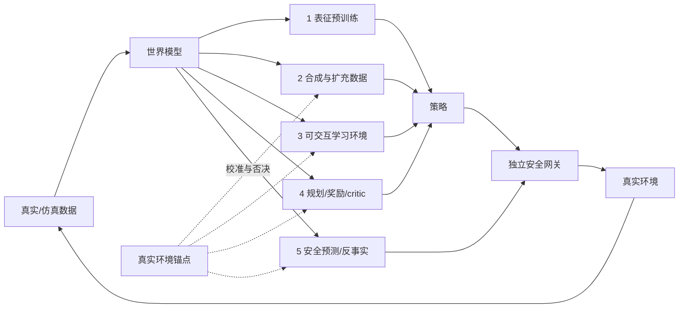

# 第17章 世界模型帮助策略的五种方式

> 状态：`drafted`
> 资料核查日期：2026-08-31
> 关联实验：`EXP-17-01`
> 关联声明：`CLAIM-17-01`～`CLAIM-17-06`
> 关联图表：`FIG-17-01` / `TAB-17-01` / `TAB-17-02`
> 资源档位：S / M / L1 / L2
> GPU 状态：待验证

## 本章契约

### 核心问题

一句“世界模型对策略有帮助”究竟指什么？它是在提供表征、生成数据、充当训练环境、参与规划/价值估计，还是做安全反事实检查？怎样用下游效用和真实环境锚点，防止策略利用世界模型的错误？

### 先修知识

- 已具备：第7章规划概念由本章提供最小桥接，第9章的用途驱动评测，第13章的闭环误差，第15章的 VLA 执行合同；
- 本章补齐：五类用途、用途—证据映射、simulator gap、model exploitation 和评测替身风险；
- 不要求：强化学习推导、3D 视觉、真实机器人/车辆、下载 checkpoint 或 GPU。

第7章尚未成稿，因此本文先给出 model predictive control（MPC）所需的最小接口；第7章完成后仍要做全书一致性复核。

### 非目标

- 不把生成视频的观感等同动作条件转移准确性；
- 不把世界模型、策略、planner、critic、仿真器和安全层合成一个含糊模块；
- 不声称运行 V-JEPA 2-AC、DreamerV3、TD-MPC2、Cosmos、WorldEval 或 WorldGym；
- 不用学习世界模型替代真实仿真器或最终部署评测；
- 不把上游排行榜、相关性或供应商声明写成本书实测。

### 学完后的可验证产出

读者应能把一个项目归入五类用途之一，写出每类用途的输入、输出和证据，计算固定策略的 return gap 与排序相关性，并为模型规划器设计真实环境回查、OOD 拒绝和独立安全门。

## 17.1 先问世界模型在哪一条数据流上

世界模型的稳定接口可以写成：

\[
\hat p_\theta(z_{t+1},r_t,c_t\mid z_{\le t},a_t),
\]

其中 `z` 是状态或潜在状态，`a` 是动作，`r` 是奖励/代价，`c` 是 continuation 或终止信号。实际系统可以只预测其中一部分；用途不同，对遗漏字段的容忍度也不同。用于表征预训练时不一定需要动作，用于规划和安全反事实时则必须知道候选动作怎样改变未来。



*FIG-17-01：世界模型帮助策略的五条路径。来源：本书原创，MIT，2026-08-31。真实环境锚点用于校准和否决，不表示必须购买硬件。*

`CLAIM-17-01`（fact）：五类用途共享预测模型，却不共享完成标准；表征 probe、生成质量、交互稳定性、规划 return 和安全漏检率不能互相替代。

## 17.2 用途一：表征预训练

世界模型可以先从无动作视频学习运动、对象持续性和时序表征，再让策略复用 encoder。此时世界模型帮助的是输入表征或初始化，不一定在部署时 rollout。

[V-JEPA 2](https://arxiv.org/abs/2506.09985) 先进行 action-free 视频表征预训练，再冻结 encoder、用机器人交互数据训练 action-conditioned predictor，并在 MPC 中使用 `[A/O,R1]`。官方仓库在核查日还包含 [V-JEPA 2.1](https://github.com/facebookresearch/vjepa2) 的 80M 到 2B dense-feature encoder；2.1 的 dense 表征更新不能自动当作 V-JEPA 2-AC 的新控制结果。

最低对照是随机初始化、通用视觉预训练和世界模型预训练三种 encoder，在相同策略头、数据、训练步数和增强下比较。probe 变好只证明信息更易读出；策略样本效率、闭环成功和 OOD 恢复仍需单独测。

## 17.3 用途二：合成或扩充训练数据

世界模型可改变初态、背景、对象、天气、任务进度或动作条件未来，以扩充稀有场景和长尾组合。合成数据要保留生成条件、动作、时间、过滤器、随机种子和来源许可；只有视频而没有可信动作/状态标签时，不能直接加入控制监督。

[Cosmos-Predict2.5](https://github.com/nvidia-cosmos/cosmos-predict2.5) 是会漂移的平台案例：官方仓库提供视频世界模型、action-conditioned 机器人路径和 post-training 说明 `[O,R1]`。它说明生成平台可以服务数据与仿真，但不证明任意生成片段物理正确或能改善指定策略。当前 Cosmos 3 又改变了模型规模、接口和许可，故正文只保留“生成—过滤—再训练—真实回查”模式。

有效实验至少要有：只用真实数据、真实+同量复制、真实+合成，以及匹配算力/样本数的对照；报告覆盖率、重复率、标签一致性和闭环效用。合成数据增加不等于信息增加。

## 17.4 用途三：作为可交互学习环境

策略可在学习模型中产生动作，世界模型递归生成下一状态、奖励和终止，再用 imagined trajectories 更新策略。[DreamerV3](https://github.com/danijar/dreamerv3) 在学习的世界模型中训练 actor-critic；[TD-MPC2](https://github.com/nicklashansen/tdmpc2) 学习面向控制的潜在模型并结合规划 `[O/P,R1]`。这类系统追求任务相关预测，不要求像素逐点完美。

危险在于训练策略不是被动测试集：它会主动寻找预测模型最乐观的区域。模型最初在行为策略分布上准确，优化后的新策略可能把状态推到 OOD。缓解方式包括短 rollout、真实数据混合、ensemble/不确定性惩罚、保守目标、周期性真实回查和发现盲区后重采样；没有任何一种能把 learned simulator 变成无条件真值。

## 17.5 用途四：规划、奖励或 critic

规划器可在每个时刻生成候选动作序列，通过世界模型预测代价，再只执行第一步：

\[
a_t=\operatorname{first}\!\left(\arg\max_{a_{t:t+H-1}}
\mathbb E_{\hat p_\theta}\left[\sum_{k=0}^{H-1}\gamma^k\hat r_{t+k}\right]\right).
\]

receding horizon 能用新观测纠偏，却不能消除第一步就错误的碰撞预测。V-JEPA 2-AC 用潜在目标能量和 CEM 做图像目标规划；论文也报告相机位置敏感性和不同模型的巨大规划时延差异。这些失败信息比“能生成 rollout”更接近工程决策。

世界模型还可只提供 reward/critic、终止或可达性，而不渲染未来。比较时要分开：候选生成质量、模型评估误差、search budget、墙钟时延、实际执行前缀和闭环 outcome。

## 17.6 用途五：安全预测与反事实验证

安全反事实询问：“若执行候选动作，未来是否越界、碰撞、失稳或进入不可恢复状态？”它需要动作条件预测、足够 horizon、风险事件召回和不确定性处理。对稀有事件，平均误差很低也可能漏掉唯一危险模式。

`CLAIM-17-03`（recommendation）：用于规划或安全筛选的世界模型必须在候选策略诱导分布上报告动作条件转移、return/风险 gap、OOD 与漏检；高平均预测准确率不能单独授权执行。

世界模型只能增加一道预测性检查。硬范围、碰撞几何、速度/力限制、watchdog、急停和最小风险动作仍由独立安全层执行。若模型间分歧大、输入过期或场景超出覆盖范围，应拒绝、减速或转入保守控制，而不是继续生成更自信的视频。

## 17.7 第六种高风险用法：把世界模型当评测替身

[WorldEval](https://arxiv.org/abs/2505.19017) 和 [WorldGym](https://arxiv.org/abs/2506.00613) 研究用视频世界模型运行或排序机器人策略；WorldGym 的官方仓库提供 OpenVLA、Octo、SpatialVLA 和 RT-1-X runner `[A/O,R1]`。这是一条重要的降本路线，但应视为代理评测，不列入前五类“帮助策略学习/执行”的主路径。

`CLAIM-17-04`（inference）：世界模型中的策略排序与真实排序相关，只支持其已验证任务、策略族和协议中的筛选用途；相关性不能校准绝对成功率，也不能替代新策略、OOD 场景和最终安全评测。

代理评测要预注册真实锚点：至少保留一组未用于训练世界模型的真实仿真/硬件 episode，报告 Pearson/Spearman、逐策略偏差、置信区间、错误排序、失败视频和新增策略后的校准漂移。若只公布相关性最高的子集，就无法判断筛选器何时失效。

## 17.8 EXP-17-01：8/9 正确仍选中碰撞策略

S 档 corridor fixture 有三个固定策略：四步前进的 `safe_route`、一步 `phantom_shortcut` 和原地等待的 `idle`。学习世界模型在 9 个测试转移中与真实规则一致 8 个，只把起点 `shortcut` 错误预测为直接到达；真实规则中它会碰撞。

```bash
make ch17-test-local
make ch17-smoke-local
make ch17-smoke
```

| 指标 | 固定结果 | 解释边界 |
| --- | ---: | --- |
| 单步转移一致率 | 8/9（88.89%） | 手工离散转移，不是模型准确率 |
| `safe_route` 真实/模型 return | 0.85 / 0.85 | 模型在已覆盖路径正确 |
| `phantom_shortcut` 真实/模型 return | -1.0 / 1.0 | 唯一乐观盲区 |
| 三策略 Spearman | -0.5 | 排序反转，不代表总体相关性 |
| 最大绝对 return gap | 2.0 | fixture 的无量纲回报 |
| model exploitation regret | 1.85 | 真实最优减模型所选策略真实回报 |

*TAB-17-01：`EXP-17-01` 的模型 gap 与策略排序。固定规则用于说明接口，不是 learned simulator benchmark。*

`CLAIM-17-02`（result）：`EXP-17-01` 的学习模型单步一致率为 `8/9`，却把真实最优 `safe_route` 排在乐观捷径之后；模型所选策略在真实规则中碰撞，排序 Spearman 为 `-0.5`，exploitation regret 为 `1.85`。

这个反例不是说 88.89% 必然不够，而是说明错误权重取决于策略访问频率和后果。安全关键转移应分桶、加权并做压力测试，不能被大量容易的 `wait/advance` 样本稀释。

## 17.9 五类用途的验收矩阵

| 用途 | 世界模型产出 | 最低下游对照 | 主要失效指标 |
| --- | --- | --- | --- |
| 表征预训练 | encoder/latent | 同策略头的随机与通用视觉预训练 | probe 好但闭环无增益 |
| 合成数据 | 条件样本/轨迹 | 同真实样本量与复制对照 | 标签错、重复、负迁移 |
| 可交互环境 | imagined transition/reward | 真实数据混合与真实环境回查 | exploitation、长时漂移 |
| planner/critic | 候选 return/energy/value | 无模型策略与 oracle/真实 simulator | 错排、时延、首步风险 |
| 安全反事实 | 风险事件/不可恢复状态 | 独立规则/几何与故障注入 | 漏检、过度拒绝、OOD |

*TAB-17-02：用途决定证据。一个系统可跨多行，但必须分别报告。*

## 17.10 自动驾驶正文：四个角色，四套证据

自动驾驶世界模型可承担：生成雨夜/切入场景，按候选转向与制动 rollout，给规划器估计碰撞/舒适代价，以及对稀有事件做反事实压力测试。四者不能共享一个“视频质量很好”的结论。

一个驾驶 planner 若发现世界模型中的“穿过护栏捷径”，会像 `EXP-17-01` 一样主动利用盲区。评测必须按道路使用者、碰撞严重度、车速、遮挡、地图/坐标误差和动作范围分桶；对模型所选轨迹，再由车辆动力学、道路边界、occupancy、控制限幅和最小风险层独立检查。

`CLAIM-17-05`（recommendation）：自动驾驶使用世界模型时，应为场景生成、驾驶 rollout、规划代价和稀有事件验证分别登记数据、horizon、动作合同和真实性锚点；任何一类通过都不能授权另一类用途。

`CLAIM-17-06`（inference）：在驾驶与机器人中，最值得采集的新数据往往不是平均误差最大的样本，而是当前策略能到达、模型又过度乐观且后果严重的状态；这需要结合可达性、不确定性和风险选择数据。

## 17.11 资源、开源与许可路线

S 档 `EXP-17-01` 使用 Python 标准库、CPU、零下载和 MIT fixture，不运行学习模型。

M 档在第19章锁定的轻量仿真中采集小型状态/动作 rollout：机器人动力学优先 MuJoCo，驾驶闭环优先 MetaDrive；训练紧凑 latent dynamics，并与真实 simulator 做 held-out transition、return gap 和策略排序对照。目标为 24 GB 单卡以内，先用低维状态或低分辨率观察、小 horizon 和固定策略，不要求购买硬件。当前没有 GPU，且尚未安装仿真器，因此此路径为 `planned`。

L1 可运行 TD-MPC2 小任务或 V-JEPA 2.1 80M encoder 的冻结 probe，但上游默认配置、数据和显存需单独实测；V-JEPA 2-AC 官方 action-conditioned checkpoint 基于更大的 ViT-g，不能用 80M encoder 规模替代其控制证据。

L2 才考虑 WorldGym/WorldEval、Cosmos 或大 checkpoint 的代理评测与生成实验，最高限制为 2×80 GB，超过上限则只保留论文/官方案例。WorldGym README 当前示例世界模型 checkpoint 约 9 GB，但完整 policy runner、生成缓存和运行显存尚未由本书验证。

V-JEPA 2 仓库主体为 MIT、部分数据增强文件为 Apache-2.0；DreamerV3 与 TD-MPC2 仓库为 MIT。Cosmos、checkpoint、数据和下游 runner 必须分别核验代码与模型许可，不能从 GitHub badge 推导所有资产可同样使用。

## 17.12 失效模式与停止条件

重点失败包括：动作不进入模型、frame/单位错配、reward hacking、终止预测错误、长时 compounding error、随机生成不可复现、策略进入 OOD、ensemble 共同偏差、代理评分器偏好视觉合理性、规划时延超过控制周期，以及训练/评测数据泄漏。

满足以下任一条件就停止把模型用于决策：真实锚点策略排序反转；风险漏检超过预注册阈值；候选动作落在训练覆盖外且无保守回退；模型输入时间戳/动作 schema 不匹配；模型调用超过 deadline；失败 episode 无法追到初态、动作和模型版本。

## 17.13 结果与证据边界

| 类型 | 声明/结果 | 来源 | 状态 | 限制 |
| --- | --- | --- | --- | --- |
| 本书结果 | 8/9 转移一致但策略错排并碰撞 | `EXP-17-01` | CPU smoke | 手工 corridor |
| 论文/代码 | 表征预训练后训练 action-conditioned planner | V-JEPA 2/2.1 | `[A/O,R1]` | 本书未运行 |
| 论文/代码 | imagined actor-critic 与 latent MPC | DreamerV3、TD-MPC2 | `[P/O,R1]` | 本书未运行 |
| 开源平台 | 生成/动作条件 world foundation model | Cosmos | `[O,R1]` | 版本和许可会漂移 |
| 论文/代码 | 世界模型代理策略评测 | WorldEval、WorldGym | `[A/O,R1]` | 相关/排序不等于真实绝对值 |
| 未验证 | 24 GB 内 learned simulator 对照 | 后续 M/L1 | planned | GPU、仿真、数据待验证 |

## 小结

世界模型不是一种单一增益模块。它可以提供表征、数据、交互环境、规划/价值和安全反事实，每条路径都要用对应下游指标验收。策略会主动寻找模型盲区，因此平均预测分数必须与真实环境 return gap、风险漏检和策略排序一起报告；代理评测只能筛选，不能取消最终真实验证。

## 练习

1. **用途判断**：冻结视频 encoder 训练 ACT，部署时不 rollout，属于哪一类？还需要什么对照？
2. **代码实验**：把 `shortcut` 错误改为低概率随机错误，比较均值、尾部风险和选择结果。
3. **规划分析**：说明 receding horizon 为什么能缓解长时误差，却无法阻止错误第一步。
4. **评测设计**：为世界模型代理评测预注册真实锚点、策略族和拒绝条件。
5. **自动驾驶迁移**：设计“模型认为可穿过、真实存在施工锥”的故障注入与最小风险动作。

## 延伸阅读

- Hafner et al., [DreamerV3](https://www.nature.com/articles/s41586-025-08744-2) 与[官方代码](https://github.com/danijar/dreamerv3)，`[P/O,R1]`；
- Hansen et al., [TD-MPC2](https://arxiv.org/abs/2310.16828) 与[官方代码](https://github.com/nicklashansen/tdmpc2)，`[P/O,R1]`；
- Assran et al., [V-JEPA 2](https://arxiv.org/abs/2506.09985) 与[官方代码](https://github.com/facebookresearch/vjepa2)，`[A/O,R1]`；
- Li et al., [WorldEval](https://arxiv.org/abs/2505.19017)，`[A,R0]`；
- Quevedo et al., [WorldGym](https://arxiv.org/abs/2506.00613) 与[官方代码](https://github.com/world-model-eval/world-model-eval)，`[A/O,R1]`；
- NVIDIA, [Cosmos-Predict2.5](https://github.com/nvidia-cosmos/cosmos-predict2.5)，`[O,R1]`。

## 下一章接口

第18章将把交互环境、reward/critic 和 imagined rollout 用于 VLA 后训练与长时任务，并继续检查 world-model error 如何污染优势与奖励。第19章再建立真实物理仿真锚点，使本章的 return gap 和 policy exploitation 从手工反例进入可校准环境。

## 验收与审查记录

```text
本地检查：make check-local
严格检查：make check
章节 smoke：make ch17-smoke
文档构建：make docs-build
```

- 内容审查：修改中；
- 代码审查：修改中；
- 一致性审查：修改中（已对齐第9/13/15/20章，等待第7/18/19章）；
- 教学审查：修改中；
- 审查记录路径：待批次 D 交叉审查；
- 已知限制：未训练 learned world model，未运行上游 checkpoint、仿真、机器人、车辆或 GPU；
- 下一步：完成 Docker smoke 与规格校验后，进入第19章仿真锚点或第18章后训练接口。
