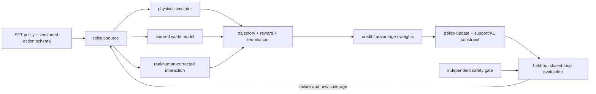

# 第18章 VLA 后训练、长时序与 World-Action Models

> 状态：`reviewed`
> 资料核查日期：2026-09-02
> 关联实验：`EXP-18-01`
> 关联声明：`CLAIM-18-01`～`CLAIM-18-09`
> 关联图表：`FIG-18-01` / `TAB-18-01` / `TAB-18-02` / `TAB-18-03` / `TAB-18-04`
> 资源档位：S / M / L1 / L2
> GPU 状态：待验证

## 本章契约

### 核心问题

监督微调（SFT）之后，怎样利用成功/失败、稀疏奖励、人类纠正、物理仿真或 learned world model 继续改进 VLA？长时任务为什么不能靠无限加长 action chunk？“World-Action Model”究竟是可交互世界模型、带未来预测辅助目标的策略，还是联合生成未来与动作的模型？

### 先修知识

- 已具备：第8章 imagined actor/critic target，第13章分布偏移与动作块，第15章 VLA/action schema，第16章跨本体适配，第17章 world-model exploitation；
- 本章补齐：SFT 后训练路线、奖励与 credit assignment、离线重加权、交互式 RL、层级/记忆/恢复，以及 World-Action Model 接口分类；
- 不要求：RL 推导、3D 视觉、LIBERO、VLA checkpoint、GPU、机器人或自动驾驶硬件。

### 非目标

- 不把 `EXP-18-01` 称为 offline RL、RIPT-VLA 或 VLA-RFT 复现；
- 不把成功轨迹权重提高等同闭环成功率提高；
- 不把 VLM reward、world-model reward 或 simulator reward 默认当真值；
- 不把长 context、长 action chunk 或长视频自动称为 long-horizon competence；
- 不把所有联合视频—动作网络强行归入一个 WAM 定义；
- 不要求购买硬件，也不声称上游多 GPU 配方已适配到本书上限。

### 学完后的可验证产出

读者应能为一个后训练系统登记 policy、interaction source、reward/verifier、advantage/weight、support constraint 和独立 evaluation；计算 reward-weighted behavior target 与 effective sample size；设计带 phase、memory、replan 和 recovery 的长时任务；按输入输出和因果接口判别 WAM。

## 18.1 SFT 之后还缺什么

SFT 最大化示范动作在观察和指令下的似然：

\[
\mathcal L_{\text{SFT}}(\theta)
=-\sum_{(o,l,a)\in D}\log \pi_\theta(a\mid o,l).
\]

它回答“数据中的操作者做了什么”，不直接回答动作导致的后果、失败能否恢复、多个可行动作哪个回报更高，或闭环偏离示范后怎样回到任务。后训练引入 outcome，但也增加了新的污染源：reward 定义、数据收集 policy、优势估计、环境真实性和更新后 distribution shift。

`CLAIM-18-01`（recommendation）：VLA 后训练的完成定义至少应包含 interaction source、reward/verifier、credit/advantage、policy support、更新算法和独立闭环评测；“用了 RL”不是足够的实验说明。



*FIG-18-01：VLA 后训练的审计闭环。来源：本书原创，MIT，2026-09-01。learned world model、reward model 与独立评测环境必须分别登记。*

## 18.2 五条后训练路线

| 路线 | 新信号 | 优势 | 主要失效 |
| --- | --- | --- | --- |
| 离线奖励重加权/过滤 | 固定轨迹 outcome | 不新增交互，易审计 | 样本集中、coverage 丢失、confounding |
| Offline RL / critic | 固定 transition + reward | 可学习多步 value | OOD action 过估计、bootstrap 偏差 |
| 物理仿真在线 RL | simulator transition/reward | 可闭环探索和重复 | sim gap、privileged reward、并行成本 |
| learned-world-model RL | predicted future/reward | 从真实视频动作数据扩展想象 | hallucination、reward hacking、策略利用模型 |
| 人类纠正/真实交互 | intervention、preference、outcome | 接近部署分布 | 昂贵、有风险、标注/操作者偏差 |

*TAB-18-01：后训练路线按数据和错误源分类。可组合路线，但每种信号要单独做 ablation。*

离线 reward-weighted behavior cloning 可写成：

\[
\mathcal L_{\text{RWBC}}
=-\frac{1}{\sum_i w_iT_i}
\sum_i w_i\sum_{t=1}^{T_i}\log\pi_\theta(a_{i,t}\mid o_{i,\le t},l_i).
\]

权重可以来自 episode success、return、advantage、preference 或人工评级。它仍是加权监督学习；没有 Bellman backup、policy interaction 或 actor objective 时，不应标成 offline RL。

上式是按 transition 归一化；若所有轨迹长度相同，才与 fixture 的“每个 phase 按 trajectory weight 求均值”一致。长度不同时，按 episode 等权、按 transition 等权和截断到固定 horizon 会得到不同 target。有效样本量（effective sample size, ESS）也必须注明是在 trajectory、transition、task group 还是 token 层计算，不能把四条轨迹的 ESS 直接解释为动作样本数。

稀疏 episode reward 会把同一权重施加给长轨迹内所有动作：成功轨迹中的偶然动作被奖励，失败轨迹中正确前缀和恢复动作被惩罚。解决 credit assignment 需要阶段状态、dense progress、value/advantage、counterfactual 或更细粒度 verifier，但每一种又可能引入 reward misspecification。

## 18.3 EXP-18-01：target 改善与 coverage 损失同时发生

S 档 fixture 有四条两阶段标量轨迹：两条成功、两条最终失败但包含 `recover` 事件。成功轨迹动作均值 `(0.25,0.75)` 被手工设为参考；这只是教学 oracle，不是真实任务最优策略。

```bash
make ch18-test-local
make ch18-smoke-local
make ch18-smoke
```

| 权重 | action target | reference MAE | ESS | recovery mass |
| --- | --- | ---: | ---: | ---: |
| 全部 1 | `(0.55,0.45)` | 0.30 | 4.0 | 0.50 |
| 成功 3、失败 1 | `(0.40,0.60)` | 0.15 | 3.2 | 0.25 |
| 只保留成功 | `(0.25,0.75)` | 0.00 | 2.0 | 0.00 |

*TAB-18-02：`EXP-18-01` 固定 reward reweighting 结果。ESS 为 \((\sum_i w_i)^2/\sum_i w_i^2\)，recovery mass 是归一化权重，不是恢复成功率。*

`CLAIM-18-02`（result）：固定成功权重从 1 增至 3 后，两阶段 target 从 `(0.55,0.45)` 移到 `(0.40,0.60)`，相对手工成功参考的 MAE 从 0.30 降到 0.15。代码没有训练或评测 policy，因此不能声称成功率改善。

`CLAIM-18-03`（result）：同一重加权把 ESS 从 4.0 降到 3.2，并把 recovery 样本权重占比从 0.50 降到 0.25；只保留成功时 ESS=2、recovery mass=0。target 更接近参考与 coverage 下降在此 fixture 中同时发生。

fixture 还比较两层 behavior-support 门禁：逐阶段 min/max 与“到最近完整轨迹的 action MAE 不超过 `0.1`”。极端 proposal `(-0.1,1.1)` 两者都拒绝；但 `(0.9,0.8)` 的每一维都落在观测范围内，会被 marginal gate 接受，而它到最近完整轨迹的 MAE 为 `0.35`，被 joint gate 拒绝。

| 诊断 | 固定结果 | 解释边界 |
| --- | ---: | --- |
| 成功参考 `(0.25,0.75)` 最近轨迹 MAE | 0.05 / accepted | 手工阈值 0.1 |
| 极端 `(-0.1,1.1)` marginal/joint | rejected / rejected | 明显逐维越界 |
| 未见组合 `(0.9,0.8)` marginal/joint | accepted / rejected | 单维范围不能证明 joint support |
| 全成功/全失败组 LOO advantage | 全 0 / 全 0 | 无组内相对学习信号 |
| 混合组 `(1,0,0)` LOO advantage | `(1,-0.5,-0.5)` | 未归一化教学公式 |

*TAB-18-03：联合支持与 leave-one-out advantage 退化。最近邻阈值和 reward group 都是手工 fixture。*

`CLAIM-18-07`（result）：`EXP-18-01` 的未见组合 `(0.9,0.8)` 通过逐阶段 min/max，却被最大 MAE `0.1` 的最近完整轨迹门禁拒绝，最近距离为 `0.35`。该结果只说明 marginal range 不能代表联合轨迹支持；最近邻同样不证明状态条件可达、安全或真实行为密度。

`CLAIM-18-08`（result）：三样本组中，全成功与全失败 reward 的未归一化 leave-one-out advantage 都为 `(0,0,0)`，混合 `(1,0,0)` 为 `(1,-0.5,-0.5)`。这验证相对信号退化，不是 RIPT-VLA 梯度、PPO clipping 或训练稳定性复现。

## 18.4 交互式后训练：稀疏成功信号也有代价

[RIPT-VLA](https://arxiv.org/abs/2505.17016)用稀疏二元 success 做 VLA interactive post-training，并采用动态 rollout sampling 与 leave-one-out advantage estimation；作者[训练入口快照 `440990e`](https://github.com/Ariostgx/ript-vla/blob/440990e8864e12e4578b490ff6359e4f2c49ae3e/train_ript.py)显式传递 `rloo_batch_size`、dynamic sampling、PPO epoch/batch 和 clipping 配置，提供 QueST + LIBERO 路线 `[A/O,R1]`。该文件本身不能证明 OpenVLA-OFT 路线已经接入；项目级支持范围应另查配置、README 和 revision。它展示的是交互环境中的 RL，不是 learned world model 路线。

二元 success 避免手工 dense reward 的部分偏置，却没有消除 credit assignment：需要同任务/初态下足够多的成功与失败 rollout 才能形成可用组内相对信号。若一组全失败或全成功，fixture 所示的 REINFORCE Leave-One-Out（RLOO）相对优势退化。dynamic sampling 丢弃并重采这类组可以恢复梯度信号，却会改变实际 task/难度分布、增加 rollout 成本，并可能长期饿死过难或过易任务；必须报告 attempted、discarded、resampled 和 used group 数。若 policy 更新太快，旧 rollout 与新 policy 不匹配；若 simulator success 使用 privileged state，真实部署未必拥有同一 verifier。

人类纠正可记录 intervention 前观察、模型原动作、纠正动作、触发原因和恢复结果。只保存纠正动作会丢失“为何接管”和 policy-induced state，无法区分动作学习与数据选择效应。高风险机器人/车辆必须先用保守 controller 和安全员协议限定探索范围。

## 18.5 在 learned world model 中后训练

这一路线继承第8章 imagined learning，却把 policy 扩展到大视觉—语言—动作模型，常用生成视频、VLM verifier 或目标参考构造 reward。

- [VLA-RFT](https://arxiv.org/abs/2510.00406)用数据驱动 world simulator 预测动作条件视觉未来，并从目标参考构造 trajectory-level 学习信号 `[A,R0]`；
- [World-Gymnast](https://arxiv.org/abs/2602.02454)让 VLA 在 action-conditioned video world model 中 rollout，再由 VLM 给任务完成 reward；其[训练脚本快照 `59c83a6`](https://github.com/world-gymnast/world-gymnast/blob/59c83a6e121fc1e099b39a4d6e01421cf1aa55c7/examples/run_openvla_oft_rl_worldgym.sh)公开 OpenVLA-OFT 入口 `[A/O,R1]`；
- [WoVR](https://arxiv.org/abs/2602.13977)不假设 world model 完美，而用可控动作条件模型、Keyframe-Initialized Rollouts 与 world-model/policy co-evolution 缩短有效误差链 `[A,R0]`。
- [WMPO README 快照 `c836d74`](https://github.com/WM-PO/WMPO/blob/c836d74ec6f4525c93fe980d54d0ca870118615a/README.md)描述 policy 与像素 world model 交替生成 imagined trajectory，再由 VideoMAE reward model 评分并更新 policy `[A/O,R1]`。该快照把 SFT policy、task-specific world model、reward model 和最终 policy 分成独立 checkpoint，正说明“on-policy in world model”仍依赖多模型版本合同。

这些 2025–2026 工作属于快速变化的方法簇，论文结果是上游证据，不是本书实测。它们即使都叫 world-model RL，也不共享 simulator、reward、policy backbone、rollout horizon 或真实回查协议，不能直接横比摘要成功率。

最低审计矩阵是：SFT baseline、reward reweight baseline、物理 simulator RL、learned simulator RL，以及相同最终 policy 在独立环境的闭环评测。还要报告 model-only return、外部 return、策略排序、hallucination、VLM/reward-model confusion matrix、OOD 和迭代后 simulator gap。World-Gymnast 的[固定 README](https://github.com/world-gymnast/world-gymnast/blob/59c83a6e121fc1e099b39a4d6e01421cf1aa55c7/README.md)还把 `partial_credit_criteria` 作为数据字段，意味着 reward rubric 本身也要锁定版本，不能只保存一个最终标量。

## 18.6 长时序不是把短时策略重复更多次

长任务同时包含三种时间尺度：高频控制、技能/子任务和全局任务进度。单纯增大 action chunk 会减少反馈频率；单纯扩展视觉 context 会增加计算并混入无关历史；单纯让 VLM 写长计划则可能在第一步失败后继续执行过期文本。

一个稳定的层级合同包含：

1. planner 低频输出版本化 subgoal 和完成条件；
2. executor 高频产生短 action chunk，并可被中断；
3. progress estimator 用当前观察判定完成、失败、卡住或不确定；
4. memory 保存已完成阶段、关键对象状态、失败与纠正，而非无界堆叠全部帧；
5. recovery/replan 在证据不匹配时重置 subgoal，不伪造任务进度。

[MindExplore](https://openaccess.thecvf.com/content/ICCV2025/html/Li_Towards_Long-Horizon_Vision-Language-Action_System_Reasoning_Acting_and_Memory_ICCV_2025_paper.html)是 ICCV 2025 的层级 reasoning—acting—memory 案例 `[P,R1]`。它支持“分层和反馈是可行架构模式”，不能证明特定沙地系统结果能外推到桌面操作、车辆或任意 VLA。

`CLAIM-18-04`（recommendation）：长时 VLA 应分别评测 subgoal selection、phase completion、memory correctness、recovery、动作闭环和全任务 outcome；增加 context/chunk 长度不能替代显式进度证据与 replanning。

## 18.7 World-Action Model：按接口分，不按名字分

截至核查日，WAM 仍是研究趋势标签而非统一标准。[World Models to World Action Models 教程快照 `8ae8d6a`](https://github.com/clearlab-sustech/WorldModelSurvey/blob/8ae8d6ad916728059559ae99417b8aacdaf22301/README.md)给出一组有用分类，本书将其改写为可审计接口：

| 路径 | 训练/推理接口 | 是否天然可 rollout | 关键检查 |
| --- | --- | --- | --- |
| imagine-then-execute | 先生成未来，再由 inverse/goal policy 产动作 | 取决于未来是否动作条件化 | future 可达性、逆动力学歧义 |
| video-feature-conditioned action | 未来模型特征条件化 action head | 不一定 | 特征是否真的携带动作后果 |
| joint video-action modeling | 同一模型联合生成未来与动作 | 不一定可交互递归 | 因果 mask、动作条件性、时间对齐 |
| auxiliary future prediction | future loss 只在训练期塑造 policy | 通常不提供 | 去掉 future head 后的因果 ablation |

*TAB-18-04：World-Action Model 的四类实现路径。联合预测不自动得到 planner、critic 或 simulator。*

[SimWAM README 快照 `68b426c`](https://github.com/H-EmbodVis/SimWAM/blob/68b426c162827cb7701396895dbb3572d29f3420/README.md)把它描述为自动驾驶中的第四类案例；其[固定源码](https://github.com/H-EmbodVis/SimWAM/blob/68b426c162827cb7701396895dbb3572d29f3420/src/simwam/models/wan22/simwam.py)构造 isolated attention mask，使 action token 可读取 action token 和当前首帧 video token、不能读取其余 future-video token。README 还说明两类 expert 不共享权重，推理时省略显式未来帧生成并走 action-only 路径 `[O,R1]`。这恰好说明 WAM 可以在部署时不生成或读取预测未来；其视频分支是训练信号，不能仅凭名称声称在线 planner 在 imagined future 上比较候选。

`CLAIM-18-09`（fact）：在 SimWAM 官方快照 `68b426c` 中，源码 attention mask 只开放 action→action 与 action→当前首帧 video token，README 把部署接口描述为不显式生成未来帧的直接轨迹预测；这只证明该版本的接口和作者说明，不证明视频辅助训练带来因果收益、上游分数已复现或该模型可作交互 simulator。

2026 年的 WAM 分类本身仍在演化：本章沿用“未来如何连接动作”的四接口轴；另一些当前 survey 使用 render-and-decode、latent-only、video-generation-free 等推理 substrate。两种分类可以交叉，不应把 taxonomy 名称当能力声明。工程卡仍应直接登记：动作是否条件化未来、未来是否递归、推理是否解码视频、action head 是否能看未来 token，以及 reward/termination 是否存在。

`CLAIM-18-05`（inference）：一个 WAM 是否能用于规划、RL simulator 或安全反事实，取决于它是否暴露经验证的动作条件未来、递归 state、reward/termination 与候选比较接口；联合视频—动作 loss 或“world”命名本身不提供这些能力。

## 18.8 自动驾驶正文：后训练必须保留独立道路真值

自动驾驶 SFT 数据常偏向正常行驶；后训练可以提高稀有 cut-in、施工改道、急刹、遮挡行人和传感器故障的覆盖。交互来源可选第19章默认 MetaDrive、需要多相机高保真时的 CARLA、冻结日志的 counterfactual，或 learned video/latent model；四者的真实性等级不能混写。

reward 应拆出路线完成、碰撞、道路边界、规则、舒适、干预和最小风险状态。碰撞/越界属于硬 gate，不应仅作为可被路线进度抵消的负 reward。episode-level “到达终点”会像 `EXP-18-01` 一样压低失败轨迹中的正确避险和恢复动作，需要 phase/progress 与事件级标注。

[WorldRFT](https://arxiv.org/abs/2512.19133)是 latent world model、分层规划和 reinforcement fine-tuning 的驾驶案例 `[A,R0]`；[SimWAM 快照 `68b426c`](https://github.com/H-EmbodVis/SimWAM/tree/68b426c162827cb7701396895dbb3572d29f3420)则代表 future-prediction auxiliary + action-only inference。两者都只能作为架构证据，不能把上游 nuScenes/NAVSIM 数字当作本书或道路部署结果。

`CLAIM-18-06`（recommendation）：驾驶 policy 的后训练更新必须在未用于 policy/world-model/reward 训练的闭环路线和 seed 上复核碰撞、路线、干预、规则、舒适与尾部风险，并通过第21章执行网关；learned simulator reward 或 open-loop score 不能授权车辆控制。

## 18.9 资源、开源与许可路线

| 档位 | 路径 | 当前状态 | 上限与停止条件 |
| --- | --- | --- | --- |
| S | 四轨迹离线重加权 fixture | 已运行 | 标准库、CPU、零下载 |
| M | 冻结 LIBERO 小子集做离线权重/critic 接口 | 可选、待运行 | Docker；先审计数据与磁盘，不训练大 VLA |
| L1 | 小 policy/adapter 的短步后训练 | 可选、待验证 | 目标 24 GB 单卡；先测峰值 VRAM、墙钟和外部 return |
| L2 | learned-world-model + VLA 对照 | 非必需、待验证 | 最多 2×80 GB；超限则只做论文/接口审计 |

当前无 GPU，M/L1/L2 均未运行。RIPT-VLA 作者仓库的 OpenVLA-OFT 示例建议至少 3 GPU，超出本书最多双卡的默认范围，因此不能直接成为核心复现；只有经实测缩小且不削弱比较合同的配方才能进入 L1/L2。World-Gymnast 的固定脚本默认 `NUM_GPUS=4`、开启在线 W&B，并主动清理当前用户 Hugging Face 模块缓存和匹配的 `/tmp` 缓存；它只能在审查后复制到一次性 Docker 环境，关闭未授权网络记录并使用显式缓存挂载，不能在宿主机原样运行。VLA-RFT、WoVR 的 world model + policy 完整栈也未证明落入 24 GB 单卡。[WMPO 固定 README](https://github.com/WM-PO/WMPO/blob/c836d74ec6f4525c93fe980d54d0ca870118615a/README.md)标注完整 checkpoint 约 `364 GiB`、数据约 `530 GiB`，因此默认禁止整包下载；即使只选单任务资产，也必须先列出文件清单、字节数、缓存路径与许可。

本章不要求购买硬件。S 档原创代码、数据和图表为 MIT；RIPT-VLA、World-Gymnast、LIBERO、OpenVLA-OFT、world model、checkpoint 和生成数据各有独立许可与来源要求，运行前必须锁定 commit 和资产条款。

## 18.10 失效模式与停止条件

重点失败包括：reward 与任务错位、VLM verifier 被视觉伪迹欺骗、terminal/timeout 混淆、成功轨迹过采样导致 ESS/coverage 塌缩、全同 reward group 零优势与反复重采样、marginal support 接受未见组合、失败中有用恢复被丢弃、critic 对 OOD action 过估计、policy 更新后离开 world-model support、长 chunk 无法中断、memory 写入错误阶段、subgoal 循环，以及模拟成功但独立环境退化。

出现以下任一情况就停止升级 policy：ESS 或分桶 coverage 低于预注册阈值；真实/独立仿真 return 与 model return 排序反转；碰撞/干预/安全尾部恶化；reward audit 发现捷径；action schema 或时间戳不匹配；结果无法追溯 policy、world model、reward 和 seed。

## 小结

VLA 后训练的价值来自 outcome 和交互，风险也来自 outcome 定义与交互环境。离线重加权能移动 target，却可能缩小有效样本和恢复覆盖；world-model rollout 能降低真实交互成本，却给 policy 新增可利用的模型漏洞。长时能力需要层级、记忆、进度与恢复，WAM 则必须回到实际接口判断。

## 练习

1. **阶段权重**：给 fixture 增加一条“最终失败但第一阶段最优”的轨迹，比较 episode 与 step-level 权重。
2. **优势退化**：为全成功/全失败 rollout group 写 leave-one-out advantage 的退化测试。
3. **长时状态机**：给一个五阶段操作任务定义 subgoal completion、stuck 和 recovery 状态机。
4. **WAM 分类**：任选 WAM 项目，判断它属于 `TAB-18-04` 哪一行，并找出因果 ablation。
5. **自动驾驶对照**：为驾驶 cut-in 后训练写出 SFT、MetaDrive RL、learned simulator RL 和 held-out CARLA 四列对照。

## 自检要点

先标出 episode、stage、rollout group 和独立评测环境四种分母。以下是满足题意的一组最小方案；开放设计可以不同，但必须保持对照变量和证据边界。

<details markdown="1">
<summary>SELF-CHECK-18-01：episode 失败会丢掉正确阶段</summary>

可增加动作 `(0.5,0.1)`、阶段结果 `[1,0]` 的轨迹，并预先定义第一阶段 oracle action 为 0.5。episode-level success-only 权重因最终失败而把两个动作都置零；step-level 权重 `[1,0]` 则保留第一阶段动作、丢弃第二阶段动作。按现有 fixture 的两个成功轨迹，episode-only 第一阶段 target 仍为 `(0.2+0.3)/2=0.25`；若阶段内等权加入新样本，则 phase-1 target 为 `(0.2+0.3+0.5)/3≈0.3333`。这只演示 credit assignment 差异；阶段标签本身若错误，也会把偏差更精细地传播。

</details>

<details markdown="1">
<summary>SELF-CHECK-18-02：全同 reward 的 LOO 优势退化</summary>

对大小为 `n>1` 的组，可写 `A_i=r_i-(Σ_{j≠i}r_j)/(n-1)`。若全成功 `r_i=1`，每个 `A_i=1-1=0`；若全失败 `r_i=0`，也全部为 0，因此这两组没有组内相对更新信号。测试应分别断言全成功、全失败为全零，并用混合组如 `[1,0,0]` 断言优势为 `[1,-0.5,-0.5]`。丢弃并重采全同组会改变任务分布，必须另报 attempted、discarded、resampled 和 used groups。

</details>

<details markdown="1">
<summary>SELF-CHECK-18-03：五阶段任务的进度与恢复状态机</summary>

例如“定位杯子→抓取→抬起→移动→放置”，每阶段都要有由当前观察判定的完成谓词，而不是只靠已发出的命令：杯子可见且定位置信足够、夹爪闭合且杯子随动、离桌高度达阈值、进入目标上方容差、释放且稳定。若连续 `K` 个检查周期进度量不改善或谓词互相矛盾，进入 `stuck`；先停止当前 chunk，再按阶段执行重观测、退回安全姿态、重抓或重新规划，并限制重试次数。恢复成功要重新满足阶段入口条件，失败/超时转受控停止。阈值、窗口、最大重试与转移日志均应冻结，不能用一次最终成功掩盖循环恢复。

</details>

<details markdown="1">
<summary>SELF-CHECK-18-04：SimWAM 是辅助未来预测案例</summary>

按本章当前公开实现说明，SimWAM 属于 `TAB-18-04` 的 auxiliary future prediction：action token 与 future-video token 隔离、两类 expert 不共享权重，部署时丢弃视频分支并走 action-only 路径。因果 ablation 应固定数据、action path、参数/训练预算和评测协议，只移除或置零 future-video loss/branch，比较 held-out 闭环 action outcome、碰撞和资源；若参数量变化，应再做容量匹配对照。仅比较视频 loss、或同时改变 action backbone，不能识别辅助未来预测的贡献。该分类不表示本书已复现其上游结果。

</details>

<details markdown="1">
<summary>SELF-CHECK-18-05：cut-in 后训练的四列对照</summary>

四列必须共享 policy 初始化/容量、动作 schema、观测、训练 cut-in 总暴露量或明确分成 data-added 与 compute-matched 两套协议：SFT 只用冻结示范；MetaDrive RL 用物理 simulator reward；learned-simulator RL 用版本锁定的 learned rollout/reward；第四列不训练，只把三个最终 checkpoint 放到未参与训练、调参或选择的 held-out CARLA route/seed。每列报告训练数据/rollout、成功、碰撞、干预、规则、舒适、尾部风险和资源；learned 列还报 model-vs-CARLA return gap 与排序。CARLA 语义若无法与训练环境对齐，应缩小可比指标而非直接排行成功率；任何碰撞 gate 恶化都不能被路线进度抵消。

</details>

## 延伸阅读

- Tan et al., [RIPT-VLA](https://arxiv.org/abs/2505.17016) 与[作者代码快照 `440990e`](https://github.com/Ariostgx/ript-vla/tree/440990e8864e12e4578b490ff6359e4f2c49ae3e)；
- Li et al., [VLA-RFT](https://arxiv.org/abs/2510.00406)；
- Sharma et al., [World-Gymnast](https://arxiv.org/abs/2602.02454) 与[作者代码快照 `59c83a6`](https://github.com/world-gymnast/world-gymnast/tree/59c83a6e121fc1e099b39a4d6e01421cf1aa55c7)；
- Zhu et al., [WMPO 官方代码、数据与 checkpoint 快照 `c836d74`](https://github.com/WM-PO/WMPO/tree/c836d74ec6f4525c93fe980d54d0ca870118615a)；
- Jiang et al., [WoVR](https://arxiv.org/abs/2602.13977)；
- Zhang et al., [From World Models to World Action Models 快照 `8ae8d6a`](https://github.com/clearlab-sustech/WorldModelSurvey/tree/8ae8d6ad916728059559ae99417b8aacdaf22301)；
- [SimWAM 作者仓库快照 `68b426c`](https://github.com/H-EmbodVis/SimWAM/tree/68b426c162827cb7701396895dbb3572d29f3420)与 [WorldRFT](https://arxiv.org/abs/2512.19133)。

## 下一章接口

第19章提供物理 simulator 与 sim-gap 锚点；第20章固定 policy 评测协议；第21章把更新后的 policy 放入时延、watchdog 和 fallback 边界。第22章将把这些合同收束成一个可审计综合项目。

## 验收与审查记录

- 内容审查：通过；
- 代码审查：通过；
- 一致性审查：通过；
- 教学审查：通过；
- 审查记录路径：`reviews/ch18-joint-support-review-2026-09-01.md`、`reviews/ch18-wam-implementation-snapshot-review-2026-09-02.md`、`reviews/fast-moving-source-audit-2026-09-01.md`、`reviews/reader-facing-source-snapshot-review-2026-09-02.md`、`reviews/part-05-part-07-exercise-self-check-review-2026-09-02.md`；
- 已知限制：只有离线标量重加权，没有 VLA/RL/world-model 训练、LIBERO、物理仿真、GPU、机器人或车辆。
