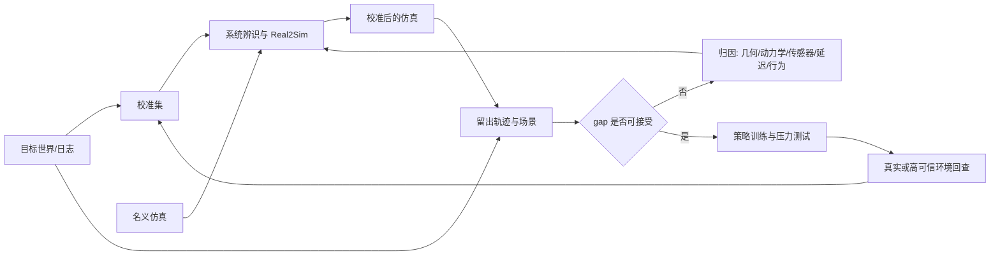

# 第19章 物理仿真、Real2Sim 与 Sim2Real

> 状态：`drafted`
> 资料核查日期：2026-08-31
> 关联实验：`EXP-19-01`
> 关联声明：`CLAIM-19-01`～`CLAIM-19-06`
> 关联图表：`FIG-19-01` / `TAB-19-01` / `TAB-19-02`
> 资源档位：S / M / L1 / L2
> GPU 状态：待验证

## 本章契约

### 核心问题

怎样把仿真器从“能渲染、能运动”的演示变成可审计的实验环境？怎样通过系统辨识、Real2Sim、域随机化和留出验证缩小 reality gap，并避免把仿真成功误写成真实部署证据？

### 先修知识

- 已具备：第3章的坐标、状态和动作，第4章的实验协议，第12章的空间表征，第17章的 simulator gap；
- 本章补齐：仿真合同、误差分解、环境选择、系统辨识、Real2Sim/Sim2Real 闭环和跨后端一致性；
- 不要求：3D 视觉经验、真实机器人或车辆、GPU、大型资产和数据下载。

读者可以先把仿真器理解为一个带内部状态的函数：输入动作和时间步，输出下一状态、观测、奖励/代价以及终止信号。几何、材质、接触和渲染会逐步加入，但不是理解本章的前提。

### 非目标

- 不把 `EXP-19-01` 称为物理仿真、域随机化性能或 Sim2Real 成果；
- 不声称本书已经安装或运行 MuJoCo、MJX、MetaDrive、CARLA、Isaac Lab、RoboCasa 或 RialTo；
- 不用视觉相似度代替动力学、传感器和闭环任务验证；
- 不要求购置硬件，也不把高保真 GPU 仿真设为完成本章的必需条件。

### 学完后的可验证产出

读者应能写出仿真合同，把 reality gap 分解到可测参数，在校准轨迹上拟合参数并在留出轨迹验证，判断随机化范围是否覆盖目标条件，并为机器人或驾驶任务选择合适的仿真层级。

## 19.1 仿真器首先是一份合同

同一个策略只有在下列字段一致时，跨环境结果才可能比较：

```text
状态：字段、单位、坐标系、可观测/隐藏部分
动作：语义、单位、范围、频率、保持方式、控制器
时间：physics step、control step、sensor latency、同步规则
动力学：质量、摩擦、接触、柔顺、执行器和约束
传感器：内外参、噪声、遮挡、曝光、缺帧和时间戳
episode：初始化、reset、终止、截断和随机种子
软件：引擎、后端、资产、场景、驱动和配置版本
```

`CLAIM-19-01`（fact）：锁定随机种子只能改善同一实现的可重复性；它不能证明引擎、参数、传感器或行为模型与目标世界一致。仿真“可复现”和“有效”是两道不同的门。

例如，策略输出 `0.2` 可能表示关节弧度、归一化位置、速度、力矩或方向盘角度。即使 shape 相同，只要控制器、频率或动作延迟不同，闭环轨迹就会改变。第15章的动作 packet 因而应延伸到仿真：坐标、单位、频率、horizon 和时间戳不能丢。

## 19.2 把 reality gap 拆成可以定位的误差



*FIG-19-01：Real2Sim2Real 的证据闭环。来源：本书原创，MIT，2026-08-31。真实回查可使用已有日志、影子模式或受控平台，不表示必须购买硬件。*

常见 gap 至少分六类：

1. **几何与资产**：尺寸、碰撞网格、关节限制、道路拓扑和对象摆放；
2. **动力学与接触**：质量、惯量、摩擦、柔顺、轮胎、碰撞和求解器；
3. **传感器与渲染**：内外参、纹理、光照、噪声、遮挡、曝光和缺帧；
4. **执行器与时序**：增益、死区、饱和、控制延迟、传感延迟和异步；
5. **环境行为**：行人、交通参与者、可动物体和对自车/机器人动作的响应；
6. **episode 逻辑**：reset 分布、终止、超时和失败后状态。

只调纹理可能让图像更像，却不修复制动距离；只调质量和摩擦也不会修复相机尺度。应同时保存真状态 gap 和观测 gap，否则误差会被错误归因到策略或感知。

## 19.3 环境选择：按问题选，不按宣传片选

| 环境 | 默认角色 | 本书档位 | 当前取舍与许可边界 |
| --- | --- | --- | --- |
| MuJoCo | 机器人动力学、接触、控制与系统辨识 | M | CPU 可起步；代码 Apache-2.0 |
| MJX | MuJoCo 模型的批量 GPU/加速后端 | L1/L2 | JAX 与 Warp 能力不同，需逐任务做一致性检查 |
| MetaDrive | 默认驾驶闭环、程序化道路和多传感器 | M | 先 CPU/headless；代码 Apache-2.0 |
| CARLA | 高保真城市、传感器和自动驾驶扩展 | L1/L2 | 不是默认必需；代码 MIT、资产 CC BY，另受 Unreal 条款约束 |
| Isaac Lab | GPU 并行机器人训练与复杂资产工作流 | L1/L2 | 框架 BSD-3-Clause；Isaac Sim 组件另有许可和版本矩阵 |
| RoboCasa | 厨房操作任务、资产和演示数据 | M/L1 | 代码 MIT；资产/数据 CC BY 4.0，完整资产约 10 GB 不是 S 档依赖 |

*TAB-19-01：本书的仿真环境角色。许可和资源来自核查日官方仓库/文档，执行前仍需按具体版本复核。*

[MuJoCo](https://github.com/google-deepmind/mujoco) 适合把控制、接触和系统辨识讲清楚；[MetaDrive](https://github.com/metadriverse/metadrive) 是本书自动驾驶 M 档默认入口，因为它提供程序化场景和状态、激光雷达、俯视图、RGB 等观测。官方给出的高帧率是特定设置下的上限，不应写成本书通用实测。

[CARLA](https://github.com/carla-simulator/carla) 和 [Isaac Lab](https://github.com/isaac-sim/IsaacLab) 保留为高保真或高并行扩展。CARLA 官方当前建议 16 GB 以上 VRAM、32 GB RAM，这已超出“24 GB 单卡轻松入门”的表述，因此正文不把它设为默认。RoboCasa 的任务/厨房规模是官方项目能力，不等于本书已下载资产或复现实验。

## 19.4 Real2Sim：先辨识，再谈随机化

设目标系统在动作序列 `a` 下产生观测 `y`，仿真参数为 `φ`，最小系统辨识可写为：

\[
\hat\phi=\arg\min_\phi \sum_{t\in\mathcal D_{cal}}
w_t\,d\!\left(y_t,\hat y_t(\phi,a_{0:t})\right).
\]

`φ` 可以包含尺寸、质量、摩擦、执行器增益、动作延迟和传感器标定。权重 `w_t` 应反映任务与安全，而不是只让大量静止帧压低平均误差。校准集用于求参数；留出动作、初态和场景用于检验是否泛化。若在同一轨迹上同时拟合和报告，零误差没有说服力。

Real2Sim 不一定从手机扫描重建完整 3D。最小路径可以从已有日志、标定板、里程计、关节状态或台架响应估计少量参数。[RialTo](https://github.com/real-to-sim-to-real/RialToPolicyLearning) 展示了 real-to-sim-to-real 机器人学习工作流，但它是研究案例，不是对任意设备的通用配方。

## 19.5 域随机化：覆盖假设，而不是“随机越多越好”

域随机化从参数分布 `p(φ)` 采样环境，目的是让策略对合理变化稳健。设计时要回答：

- 每个参数为何变化，单位和范围来自哪里？
- 目标条件是否落在 support 内？参数间是否存在物理相关性？
- 是否有 nominal、单因素、组合扰动和 OOD 留出？
- 过宽随机化是否让任务不可学，或制造目标世界不会出现的状态？

经典“纹理、光照全随机”只覆盖视觉域的一部分。对控制任务，延迟、执行器、摩擦、负载和行为参与者往往同样关键。应先由系统辨识和测量建立中心与范围，再逐项扩展；不确定的参数可以更宽，但必须记录假设。

## 19.6 EXP-19-01：校准正确，不等于仿真已经正确

S 档 fixture 用一个标量状态演示三类可分离参数：执行器增益、动作延迟和观测尺度。目标系统固定为 `gain=0.8`、`delay=1`、`scale=1.25`；12 个候选组合在校准动作上网格搜索，再在不同动作序列上验证。

```bash
make ch19-test-local
make ch19-smoke-local
make ch19-smoke
```

| 条件 | state MAE | observation MAE | terminal error |
| --- | ---: | ---: | ---: |
| 名义参数 | 0.6625 | 0.6250 | 1.0000 |
| 只校准动力学/延迟，观测尺度仍错 | 0.0000 | 0.1625 | 0.0000 |
| 三参数校准后，留出动作 | 0.0000 | 0.0000 | 0.0000 |

*TAB-19-02：`EXP-19-01` 的固定校准结果。零误差来自目标参数恰在离散搜索网格，不能外推到噪声、连续参数或真实系统。*

`CLAIM-19-02`（result）：名义参数在留出动作上的 state MAE 为 `0.6625`、observation MAE 为 `0.625`、终态误差为 `1.0`。

`CLAIM-19-03`（result）：fixture 从 12 个候选中精确恢复三个预设参数，并在留出动作上得到零 gap；这只验证实现和“校准/留出分离”的接口，不证明网格搜索能处理真实动力学。

`CLAIM-19-04`（result）：手工窄随机化范围没有覆盖目标参数，手工宽范围覆盖了目标。它说明 support 应被显式检查，不比较随机化策略性能。

结果文件为 `results/ch19/EXP-19-01-smoke.json`。测试还检查非法参数、一步延迟、校准/留出分离和观测—状态误差归因。

## 19.7 MJX 与其他后端：速度不能抹掉语义差异

[MJX 官方文档](https://mujoco.readthedocs.io/en/stable/mjx.html) 当前区分 MJX-JAX 和 MJX-Warp：两者功能覆盖、批处理方式和自动微分能力不同；Warp 更接近完整 MuJoCo 功能但不提供自动微分，JAX 仍有缺失特性。把 XML 加载成功不能当作行为等价。

`CLAIM-19-05`（recommendation）：切换 MuJoCo CPU、MJX-JAX、MJX-Warp 或其他求解后端时，应固定模型、初态和动作序列，逐步比较状态、接触、约束、奖励、终止和最终任务结果，再报告吞吐与显存。

吞吐测试还必须说明并行环境数、是否渲染、步长、模型复杂度、编译时间是否计入以及硬件。单环境延迟和大批量 steps/s 回答不同问题。

## 19.8 自动驾驶正文：MetaDrive 默认，CARLA 是扩展

本书驾驶闭环默认从 MetaDrive 的程序化道路和 headless 模式开始，先用状态或轻量激光雷达验证动作、碰撞、越界、路线完成和场景随机种子；再按需要加入俯视图/RGB。这样可在 CPU 或 modest 环境中验证闭环协议，不能证明传感器模型足够真实。

CARLA 用于高保真多相机、天气、城市资产和传感器管线扩展，属于 L1/L2 可选项。环境变量应分组测试：

1. 道路与几何；
2. 天气、光照和传感器；
3. 车辆动力学、控制频率与延迟；
4. 交通密度和参与者行为；
5. reset、路线和终止规则。

`CLAIM-19-06`（recommendation）：驾驶评测先用 MetaDrive 建立便宜、可重复的闭环与失败分类，再按研究问题升级到 CARLA；不得把两个环境的成功率直接拼表。导入真实日志还要检查数据许可，并区分固定回放交通与会响应自车的行为代理。

世界模型生成的视频可补充稀有场景，但不能替代车辆动力学、道路边界和参与者响应。第17章的 learned simulator 结果必须在本章这类独立环境或真实日志锚点上回查。

## 19.9 资源路线与停止条件

- **S**：`EXP-19-01`，Python 标准库、CPU、零下载、零 GPU；
- **M**：MuJoCo CPU 小任务或 MetaDrive headless 小场景；镜像、版本和小资产需另行锁定；
- **L1**：24 GB 单卡以内的轻量渲染、向量化或小规模策略实验，必须实测显存和时延；
- **L2**：CARLA、Isaac Lab、MJX 大批量或较大视觉管线，最高 2×80 GB，仅按需要执行。

没有 GPU 不妨碍完成 S 档正文与接口。M/L 路径在运行前应估算镜像、资产、数据、显存和磁盘；不得自动下载大型资源。若坐标/动作合同不清、reset 不稳定、目标参数不在随机化范围、留出 gap 恶化、跨后端终止不一致或许可不明，应停止性能比较并先修复证据链。

## 19.10 结果与证据边界

| 类型 | 本章可以说什么 | 不能说什么 |
| --- | --- | --- |
| 本书结果 | 标量 fixture 的固定 gap、参数恢复和覆盖检查 | 真实动力学已辨识、Sim2Real 已成功 |
| 官方事实 | 环境功能、版本路线和许可 | 本书已复现官方吞吐或任务结果 |
| 计划验证 | MuJoCo/MetaDrive 的 M 档闭环 | 在没有运行记录时写成已完成 |
| 高阶扩展 | CARLA/Isaac/MJX 的 GPU 工作流 | 把硬件与大型下载变成读者必需品 |

## 小结

有效仿真从合同和 gap 分解开始，而不是从渲染质量开始。Real2Sim 用校准数据估参数，留出数据检验泛化；域随机化声明覆盖范围，Sim2Real 仍需独立锚点。环境选择服从问题与资源：机器人动力学优先 MuJoCo，驾驶默认 MetaDrive，高保真 CARLA/Isaac 和大规模 MJX 是可选扩展。

## 练习

1. **合同审计**：为一个差速底盘或自动驾驶转向接口写出状态、动作、频率、延迟、reset 和终止合同。
2. **代码实验**：给 `EXP-19-01` 加入观测噪声，解释为什么不能再期待精确参数恢复。
3. **辨识设计**：说明恒定动作为什么可能无法同时辨识增益与延迟，并设计更有信息量的动作序列。
4. **驾驶迁移**：列出 MetaDrive 到 CARLA 迁移时必须重新验证的五类语义，不比较无法对齐的成功率。

## 延伸阅读

- [MuJoCo 官方仓库](https://github.com/google-deepmind/mujoco) 与 [MJX 文档](https://mujoco.readthedocs.io/en/stable/mjx.html)，`[O,R1]`；
- [MetaDrive 官方仓库](https://github.com/metadriverse/metadrive) 与 [官方文档](https://metadrive-simulator.readthedocs.io/en/latest/)，`[O,R1]`；
- [CARLA 官方仓库](https://github.com/carla-simulator/carla)，`[O,R1]`；
- [Isaac Lab 官方仓库](https://github.com/isaac-sim/IsaacLab)，`[O,R1]`；
- [RoboCasa 官方仓库](https://github.com/robocasa/robocasa)，`[O,R1]`；
- [RialTo 官方仓库](https://github.com/real-to-sim-to-real/RialToPolicyLearning)，`[O,R1]`；
- [Domain Randomization for Sim2Real Transfer 学术综述](https://arxiv.org/abs/2111.00956)，`[A,R1]`。

## 下一章接口

第20章将把本章的引擎/资产版本、reset、扰动、终止、gap 和场景覆盖写入 benchmark card。第21章再把 control step、传感器延迟、吞吐和降级策略转换成部署门禁。

## 验收与审查记录

```text
本地检查：make check-local
严格检查：make check
章节 smoke：make ch19-smoke
文档构建：make docs-build
```

- 内容审查：修改中；
- 代码审查：修改中；
- 一致性审查：修改中；
- 教学审查：修改中；
- 已知限制：只运行标准库标量 fixture；没有安装仿真器、下载资产、运行 GPU 或真实硬件。
