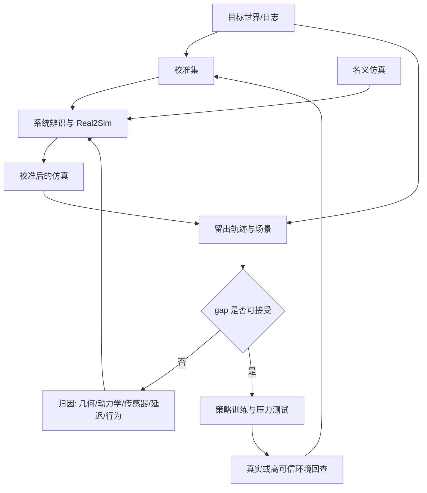

# 第19章 物理仿真、Real2Sim 与 Sim2Real

## 本章契约

### 核心问题

怎样把仿真器从“能渲染、能运动”的演示变成可审计的实验环境？怎样通过系统辨识、Real2Sim、域随机化和留出验证缩小 reality gap，并避免把仿真成功误写成真实部署证据？

### 先修知识

- 已具备：第3章的坐标、状态和动作，第4章的实验协议，第12章的空间表征，第17章的 simulator gap；
- 本章补齐：仿真合同、误差分解、环境选择、系统辨识、Real2Sim/Sim2Real 闭环和跨后端一致性；
- 不要求：3D 视觉经验、真实机器人或车辆、GPU、大型资产和数据下载。

读者可以先把仿真器理解为一个带内部状态的函数：输入动作和时间步，输出下一状态、观测、奖励/代价以及终止信号。几何、材质、接触和渲染会逐步加入，但不是理解本章的前提。

### 非目标

- 不把 `EXP-19-01` 称为物理仿真、域随机化性能或 Sim2Real 成果；
- 不声称本书已经安装或运行 MuJoCo、MJX、MetaDrive、CARLA、Isaac Lab、RoboCasa 或 RialTo；
- 不用视觉相似度代替动力学、传感器和闭环任务验证；
- 不要求购置硬件，也不把高保真 GPU 仿真设为完成本章的必需条件。

### 学完后的可验证产出

读者应能区分仿真实现验证、参数校准与用途确认，把 reality gap 分解为数值、结构、参数、观测和行为误差，并判断哪些误差可以通过系统辨识缩小。读者还应能解释域随机化如何定义训练分布，以及仿真中获得的策略能力为何仍需目标环境证据。

## 19.1 仿真器首先是一份合同

同一个策略只有在下列字段一致时，跨环境结果才可能比较：

```text
状态：字段、单位、坐标系、可观测/隐藏部分
动作：语义、单位、范围、频率、保持方式、控制器
时间：physics step、control step、sensor latency、同步规则
动力学：质量、摩擦、接触、柔顺、执行器和约束
传感器：内外参、噪声、遮挡、曝光、缺帧和时间戳
episode：初始化、reset、终止、截断和随机种子
软件：引擎、后端、资产、场景、驱动和配置版本
```

[NIST 的仿真验证、确认与不确定性指南](https://www.nist.gov/publications/summary-industrial-verification-validation-and-uncertainty-quantification-procedures)区分“实现是否正确求解所声明模型”与“模型在预期用途上多大程度代表真实世界”。`CLAIM-19-01`（fact）：锁定随机种子只能改善同一实现的可重复性；它不能证明引擎、参数、传感器或行为模型与目标世界一致。仿真“可复现”和“有效”是两道不同的门。

例如，策略输出 `0.2` 可能表示关节弧度、归一化位置、速度、力矩或方向盘角度。即使 shape 相同，只要控制器、频率或动作延迟不同，闭环轨迹就会改变。第15章的动作 packet 因而应延伸到仿真：坐标、单位、频率、horizon 和时间戳不能丢。

### 19.1.1 Verification、calibration 与 validation 各问一个问题

Verification 问软件是否正确实现了所声明的方程与算法，例如积分器、约束和单位转换有没有实现错误；calibration 问在模型结构固定时，哪些参数最符合校准数据；validation 则问校准后的模型在预期用途和未参与拟合的条件下是否足够代表目标系统。三者按逻辑相连，但任何一步通过都不能替代下一步。

一个仿真器可以准确求解错误的物理模型，因此 verification 通过但 validation 失败；也可以在一条轨迹上校准到极小 residual，却因参数不可辨识而无法泛化；还可以在低速控制用途上有效，却不足以支持高速碰撞结论。所谓“仿真有效”必须附带用途、状态范围、时间尺度和可接受误差，而不是成为永久属性。

数值收敛也属于 verification 证据。缩小 physics step 后结果稳定，只说明离散求解对当前设置趋于稳定，不证明接触模型、轮胎模型或传感器模型真实。反过来，若步长、solver tolerance 或后端改变会翻转任务结果，那么继续调物理参数会把数值误差错误吸收到现实参数中。

## 19.2 把 reality gap 拆成可以定位的误差



*FIG-19-01：Real2Sim2Real 的证据闭环。来源：本书原创，CC BY-NC 4.0，2026-09-01。真实回查可使用已有日志、影子模式或受控平台，不表示必须购买硬件。*

常见 gap 至少分六类：

1. **几何与资产**：尺寸、碰撞网格、关节限制、道路拓扑和对象摆放；
2. **动力学与接触**：质量、惯量、摩擦、柔顺、轮胎、碰撞和求解器；
3. **传感器与渲染**：内外参、纹理、光照、噪声、遮挡、曝光和缺帧；
4. **执行器与时序**：增益、死区、饱和、控制延迟、传感延迟和异步；
5. **环境行为**：行人、交通参与者、可动物体和对自车/机器人动作的响应；
6. **episode 逻辑**：reset 分布、终止、超时和失败后状态。

只调纹理可能让图像更像，却不修复制动距离；只调质量和摩擦也不会修复相机尺度。应同时保存真状态 gap 和观测 gap，否则误差会被错误归因到策略或感知。

### 19.2.1 Gap 不是一个可以任意相减的总数

观测到的 sim-real 差异通常由多层误差叠加：模型结构遗漏了某种效应，参数值不准确，数值求解产生偏差，传感器把隐藏状态映射成观测时又引入标定和噪声差异。策略闭环还会改变访问分布，使同一局部误差在不同策略下被放大或绕开。只报告最终轨迹距离，无法知道应修模型、参数、传感器还是策略。

这些误差也不一定可加。错误摩擦会改变车辆姿态，姿态又改变相机观测；执行延迟会让接触发生在不同位置，进而改变后续碰撞模式。更可用的 gap 分解依赖干预：固定真实状态比较传感器，固定动作与初态比较动力学，固定轨迹比较渲染，冻结环境比较策略。分层对照比试图拟合一个全局“现实度分数”更容易定位问题。

模型结构误差尤其不能总靠参数校准修复。如果真实系统包含速度相关摩擦，而仿真只允许常数摩擦，优化器可能在校准速度范围内找到折中值，却在低速和高速两端同时偏离。此时更宽参数搜索不会解决问题；需要扩展模型结构、缩小有效用途范围，或把剩余 discrepancy 显式纳入不确定性。

## 19.3 环境选择：按问题选，不按宣传片选

| 环境 | 默认角色 | 本书档位 | 当前取舍与许可边界 |
| --- | --- | --- | --- |
| MuJoCo | 机器人动力学、接触、控制与系统辨识 | M | CPU 可起步；代码 Apache-2.0 |
| MJX | MuJoCo 模型的批量 GPU/加速后端 | L1/L2 | JAX 与 Warp 能力不同，需逐任务做一致性检查 |
| MetaDrive | 默认驾驶闭环、程序化道路和多传感器 | M | 先 CPU/headless；代码 Apache-2.0 |
| CARLA | 高保真城市、传感器和自动驾驶扩展 | L1/L2 | 不是默认必需；代码 MIT、资产 CC BY，另受 Unreal 条款约束 |
| Isaac Lab | GPU 并行机器人训练与复杂资产工作流 | L1/L2 | 框架 BSD-3-Clause；Isaac Sim 组件另有许可和版本矩阵 |
| RoboCasa | 厨房操作任务、资产和演示数据 | M/L1 | 代码 MIT；资产/数据 CC BY 4.0，完整资产约 10 GB 不是 S 档依赖 |

*TAB-19-01：本书的仿真环境角色。许可和资源来自核查日官方仓库/文档，执行前仍需按具体版本复核。*

[MuJoCo](https://github.com/google-deepmind/mujoco) 适合把控制、接触和系统辨识讲清楚；官方 [sysid toolbox 快照 `005b351`](https://github.com/google-deepmind/mujoco/blob/005b35170d16cf20d1eb5afcecf67328e6ec0875/python/mujoco/sysid/README.md)使用带 box constraint 的 nonlinear least squares、finite-difference Jacobian 和批量 rollout 拟合物理或测量参数，并可组合多个 `ModelSequences`、自定义 residual、time delay 与 confidence interval `[O,R1]`。工具能优化不等于参数必然可辨识；residual 对两个参数只依赖其乘积时，优化器仍会面对等价解。

[MetaDrive](https://github.com/metadriverse/metadrive) 是本书自动驾驶 M 档默认入口，因为它提供程序化场景和状态、激光雷达、俯视图、RGB 等观测。官方给出的高帧率是特定设置下的上限，不应写成本书通用实测。

[CARLA](https://github.com/carla-simulator/carla) 和 [Isaac Lab](https://github.com/isaac-sim/IsaacLab) 保留为高保真或高并行扩展。CARLA 官方当前建议 16 GB 以上 VRAM、32 GB RAM，这已超出“24 GB 单卡轻松入门”的表述，因此正文不把它设为默认。RoboCasa 的任务/厨房规模是官方项目能力，不等于本书已下载资产或复现实验。

## 19.4 Real2Sim：先辨识，再谈随机化

设目标系统在动作序列 `a` 下产生观测 `y`，仿真参数为 `φ`，最小系统辨识可写为：

\[
\hat\phi=\arg\min_\phi \sum_{t\in\mathcal D_{cal}}
w_t\,d\!\left(y_t,\hat y_t(\phi,a_{0:t})\right).
\]

`φ` 可以包含尺寸、质量、摩擦、执行器增益、动作延迟和传感器标定。权重 `w_t` 应反映任务与安全，而不是只让大量静止帧压低平均误差。校准集用于求参数；留出动作、初态和场景用于检验是否泛化。若在同一轨迹上同时拟合和报告，零误差没有说服力。

还要区分两种问题：**结构可辨识性**问无限无噪数据下不同参数是否会产生相同输出；**实用可辨识性**问有限、带噪、激励不足的数据能否把它们稳定分开。换一条 held-out action 只能检验泛化，不能必然修复结构混淆。若观测始终只依赖 `scale×gain`，再丰富的动作也无法从该观测单独分离二者；需要独立 state/传感器标定、固定其中一个参数或改变测量方程。

因此校准报告至少包含最优值之外的：等价/近等价解数量、Jacobian/rank 或 profile、参数相关性/置信区间、不同初值结果、residual 分桶，以及新增传感器或激励后的变化。窄置信区间也依赖模型和噪声假设，不能自动证明真实参数唯一。

多工况也不是简单地把更多 trajectory 拼在一起。MuJoCo sysid 的 `ModelSequences` 支持把多个测量序列联合优化；[多实验参数可辨识性研究](https://arxiv.org/abs/2011.10868v2)进一步说明，某些模型的多实验可辨识函数确实多于单实验，但这不是对所有模型的保证。应登记每条序列改变了什么已知条件、哪些参数在序列间共享，以及新增 residual 对参数的敏感度是否提供独立方向。重复同一工况只会增加同一方程的权重；若不同载荷、初态或传感器仍只暴露相同参数组合，结构对称性不会消失。反过来，工况值若本身未知，把它与被辨识参数一起自由拟合，还可能引入新的混淆。

Real2Sim 不一定从手机扫描重建完整 3D。最小路径可以从已有日志、标定板、里程计、关节状态或台架响应估计少量参数。[RialTo](https://github.com/real-to-sim-to-real/RialToPolicyLearning) 展示了 real-to-sim-to-real 机器人学习工作流，但它是研究案例，不是对任意设备的通用配方。

参数可辨识与预测可用也要分开。多个参数组合即使无法唯一分离，也可能在目标动作范围内产生近似相同的任务相关预测；此时模型可用于有限用途，但不能宣称恢复了真实参数。反过来，参数估计接近标称值也不保证未观测状态预测准确，因为模型结构仍可能缺项。报告应同时给参数不确定性与用途相关的预测不确定性。

系统辨识数据需要持续激励，但激励受安全边界约束。让动作变化更剧烈可能提高某些参数的敏感度，也可能进入未建模的饱和、接触或损伤区域。实验设计的目标不是最大化动作幅度，而是在允许状态域内产生彼此独立的参数信息方向，并保留不参与拟合的工况验证。

## 19.5 域随机化：覆盖假设，而不是“随机越多越好”

域随机化从参数分布 `p(φ)` 采样环境，目的是让策略对合理变化稳健。设计时要回答：

- 每个参数为何变化，单位和范围来自哪里？
- 目标条件是否落在 support 内？参数间是否存在物理相关性？
- 是否有 nominal、单因素、组合扰动和 OOD 留出？
- 过宽随机化是否让任务不可学，或制造目标世界不会出现的状态？

经典“纹理、光照全随机”只覆盖视觉域的一部分。对控制任务，延迟、执行器、摩擦、负载和行为参与者往往同样关键。应先由系统辨识和测量建立中心与范围，再逐项扩展；不确定的参数可以更宽，但必须记录假设。fixture 的 `covers` 只检查独立区间与离散 delay：即使目标每一维都在边界内，若真实随机化使用相关分布、约束流形或零概率组合，也不能据此声称 joint support 已覆盖。

`EXP-19-01` v4 把该边界变成两套有限 support。aligned 与 crossed 都恰好包含 gain `{0.8,1.0}`、delay `{1}`、observation scale `{1.0,1.25}`；差别只在 gain—scale 如何配对。目标 `(0.8,1,1.25)` 属于 aligned，却不属于 crossed。

| 有限 support | 边际范围检查 | 目标联合点检查 | 目标参数组合 |
| --- | --- | --- | --- |
| aligned | 通过 | 通过 | `(0.8,1,1.25)` 存在 |
| crossed | 通过 | 拒绝 | 只有 `(0.8,1,1.0)` 与 `(1.0,1,1.25)` |

*TAB-19-04：`EXP-19-01` v4 的相同边际—不同联合支持负对照。support 是两个手工离散点，不是连续相关分布。*

<!-- CLAIM_META: CLAIM-19-09 result -->
两套各2点的手工 support 具有完全相同的逐参数边际值，逐维范围检查都接受目标，但 crossed support 不包含目标三元组。该结果只证明边际范围不能识别这两个有限联合 support，不估计真实概率质量、相关性、随机化覆盖率、策略鲁棒性或 Sim2Real 性能。

### 19.5.1 随机化分布定义了策略要对谁稳健

Domain randomization 不只是给参数加噪声，而是在训练目标中规定不同环境条件出现的频率。Support 回答目标条件是否可能被采到，概率质量回答它被学习器看见多少次，参数相关性回答采到的组合是否物理合理。目标位于 support 内但概率极低时，有限训练仍可能几乎从未遇到它。

过宽随机化还可能改变最优策略。若训练同时包含互相矛盾、又无法从观测区分的动力学，策略只能采取对所有环境都保守的折中动作；这可能提高 worst-case 表现，却降低目标系统的效率。若环境参数可由历史辨识，策略可以条件化适应；若参数不可观测，则不存在仅靠更大模型就能消除的冲突。

随机化范围应来自测量、不确定性或明确压力测试，而不是看到迁移失败后无限扩张。训练随机化、选择模型所用的 validation 分布和最终目标分布应分开；反复根据目标测试调范围，会把目标环境变成隐式训练集。

## 19.6 零校准误差与“更多数据”都可能不可辨识（EXP-19-01）

S 档 fixture 用一个标量状态演示执行器增益、动作延迟和观测尺度。目标系统固定为 `gain=0.8`、`delay=1`、`scale=1.25`；12 个候选组合在校准动作上网格搜索。关键是 observation 只依赖 `gain×scale`：目标的 `0.8×1.25` 与候选 `1.0×1.0` 相同，因此 observation-only 本来就无法分离二者。

<details markdown="1">
<summary>可选：验证本章证据</summary>

```bash
make ch19-test-local
make ch19-smoke-local
make ch19-smoke
```

</details>

| 条件 | state MAE | observation MAE | terminal error |
| --- | ---: | ---: | ---: |
| 名义参数 | 0.6625 | 0.6250 | 1.0000 |
| observation-only 等价解 `(1.0,1,1.0)` | 0.1625 | 0.0000 | 0.2500 |
| 只校准动力学/延迟，观测尺度仍错 | 0.0000 | 0.1625 | 0.0000 |
| 加入 state anchor 后的唯一网格解 | 0.0000 | 0.0000 | 0.0000 |

*TAB-19-02：`EXP-19-01` 的留出动作结果。observation 一致不保证隐藏 state 或参数一致。*

<!-- CLAIM_META: CLAIM-19-02 result -->
名义参数在留出动作上的 state MAE 为 `0.6625`、observation MAE 为 `0.625`、终态误差为 `1.0`；这些数值只描述固定标量动力学与留出动作，不是物理引擎或 Sim2Real 误差估计。

<!-- CLAIM_META: CLAIM-19-03 result -->
observation-only 网格搜索在 12 个候选中发现两个零误差 minimizer。非目标解 `(gain=1.0, delay=1, scale=1.0)` 在留出动作上仍有 observation MAE `0`，但 state MAE `0.1625`、终态误差 `0.25`；单靠更换动作序列没有解决乘积混淆。

<!-- CLAIM_META: CLAIM-19-07 result -->
加入校准 state anchor 后，网格中只剩目标参数一个 minimizer，并在留出动作上得到零 state/observation gap。该结果来自无噪目标参数恰在离散网格，不证明真实系统参数、连续优化或任意传感器组合可辨识。

<!-- CLAIM_META: CLAIM-19-04 result -->
手工窄随机化范围没有覆盖目标参数，手工宽范围覆盖了目标。它说明 support 应被显式检查，不比较随机化策略性能。

fixture 还加入一个与前述观测尺度反例独立的载荷工况：标量响应只由 `force_gain/(base_load+known_payload)` 决定。在 9 个候选点中，零载荷只能识别这个比值；把同一条零载荷序列重复两次不会增加参数方向。第二条序列将已知载荷改为 `1.0`，才为当前离散网格提供另一条独立约束。

| 校准数据 | 序列数 | 独立载荷数 | 零误差解数 | 结论 |
| --- | ---: | ---: | ---: | --- |
| 零载荷 | 1 | 1 | 3 | 只识别 force/load 比值 |
| 零载荷重复 | 2 | 1 | 3 | 样本数增加，参数信息方向未增加 |
| 已知载荷 `0.0` 与 `1.0` | 2 | 2 | 1 | 当前无噪离散网格中恢复目标点 |

*TAB-19-03：多工况校准反例。独立载荷数按 fixture 中不同的已知 payload 值计数，不代表统计独立性或真实实验的有效样本量。*

<!-- CLAIM_META: CLAIM-19-08 result -->
零载荷校准存在 3 个等价解，重复同一载荷后仍为 3 个；加入第二个不同的已知载荷后，当前 9 点网格只剩目标 `(force_gain=1.0, base_load=1.0)`，而单载荷替代解 `(0.5,0.5)` 在载荷 `1.0` 上的 MAE 为 `0.197916666667`。这是解析标量 fixture 的实验设计反例，不证明两个工况足以辨识一般连续、带噪、接触或时变系统。

结果文件为 `results/ch19/EXP-19-01-smoke.json`。测试还检查非法参数、一步延迟、等价 minimizer、state anchor、校准/留出分离、观测—状态误差归因，以及重复/不同载荷工况的可辨识性。

## 19.7 MJX 与其他后端：速度不能抹掉语义差异

[MJX 官方文档](https://mujoco.readthedocs.io/en/stable/mjx.html) 当前区分 MJX-JAX 和 MJX-Warp：两者功能覆盖、批处理方式和自动微分能力不同；Warp 更接近完整 MuJoCo 功能但不提供自动微分，JAX 仍有缺失特性。把 XML 加载成功不能当作行为等价。

<!-- CLAIM_META: CLAIM-19-05 recommendation -->
切换 MuJoCo CPU、MJX-JAX、MJX-Warp 或其他求解后端时，应固定模型、初态和动作序列，逐步比较状态、接触、约束、奖励、终止和最终任务结果，再报告吞吐与显存。若差异超过预注册容差或改变任务结论，就不得合并成同一性能比较，应分别报告并把后端视为实验变量。

吞吐测试还必须说明并行环境数、是否渲染、步长、模型复杂度、编译时间是否计入以及硬件。单环境延迟和大批量 steps/s 回答不同问题。

跨后端一致也不等于跨现实有效。如果两个后端共享同一简化接触模型，它们可以逐步吻合却共同偏离真实系统。后端对照主要建立实现与数值层的可信度，真实日志和物理测量才约束模型层。证据链应按“同模型跨实现”与“模型对目标世界”分别报告。

## 19.8 自动驾驶：从 MetaDrive 起步，向 CARLA 扩展

本书驾驶闭环默认从 MetaDrive 的程序化道路和 headless 模式开始，先用状态或轻量激光雷达验证动作、碰撞、越界、路线完成和场景随机种子；再按需要加入俯视图/RGB。这样可在 CPU 或 modest 环境中验证闭环协议，不能证明传感器模型足够真实。

CARLA 用于高保真多相机、天气、城市资产和传感器管线扩展，属于 L1/L2 可选项。环境变量应分组测试：

1. 道路与几何；
2. 天气、光照和传感器；
3. 车辆动力学、控制频率与延迟；
4. 交通密度和参与者行为；
5. reset、路线和终止规则。

<!-- CLAIM_META: CLAIM-19-06 recommendation -->
驾驶评测先用 MetaDrive 建立便宜、可重复的闭环与失败分类，再按研究问题升级到 CARLA；不得把两个环境的成功率直接拼表。导入真实日志还要检查数据许可，并区分固定回放交通与会响应自车的行为代理。

世界模型生成的视频可补充稀有场景，但不能替代车辆动力学、道路边界和参与者响应。第17章的 learned simulator 结果必须在本章这类独立环境或真实日志锚点上回查。

交通行为模型还是一个闭环组件，而非背景动画。固定回放可以精确复现日志中的其他车辆轨迹，却无法回答 ego 改变动作后其他主体会如何响应；响应式代理允许反事实交互，却引入新的行为模型误差。两种环境分别适合回放一致性与交互压力测试，不能把固定回放中的“未碰撞”解释为其他主体会在现实中同样让行。

Sim2Real 还可能暴露策略对仿真伪特征的依赖，例如利用固定 reset、碰撞器缝隙、交通代理礼让规则或渲染纹理。提高视觉逼真度只是减少部分捷径。更直接的检查是改变与任务无关的仿真实现细节、跨独立后端或资产复测，并观察策略是否保持依赖真实可用的状态证据。

## 19.9 资源边界与停止条件

全书资源档位见[术语表](../glossary.md)。本章的升级顺序由真实性问题决定：标量反例用于理解不可辨识性；MuJoCo或MetaDrive适合检查动力学与闭环协议；CARLA、Isaac Lab和MJX只在高保真传感器、复杂资产或大规模并行确实改变研究问题时使用。更昂贵的仿真器不自动更接近目标现实。

运行前应核验镜像、资产、数据、缓存和许可。若坐标/动作合同不清、reset不稳定、目标参数不在随机化范围、留出gap恶化、跨后端终止不一致或许可不明，应停止性能比较并先修复证据链。

## 19.10 结果与证据边界

| 类型 | 本章可以说什么 | 不能说什么 |
| --- | --- | --- |
| 本书结果 | 标量 fixture 的固定 gap、不可辨识反例、state anchor 与覆盖检查 | 真实动力学已辨识、Sim2Real 已成功 |
| 官方事实 | 环境功能、版本路线和许可 | 本书已复现官方吞吐或任务结果 |
| 计划验证 | MuJoCo/MetaDrive 的 M 档闭环 | 在没有运行记录时写成已完成 |
| 高阶扩展 | CARLA/Isaac/MJX 的 GPU 工作流 | 把硬件与大型下载变成读者必需品 |

## 小结

有效仿真从合同和用途开始，而不是从渲染质量开始。Verification 检查实现与数值求解，calibration 在固定结构内估计参数，validation 判断模型是否足以支撑指定用途；三者不能互相替代。Reality gap 包含结构、参数、数值、观测和行为误差，这些误差可能耦合，必须通过分层干预定位。

Real2Sim 的参数唯一性与预测可用性是两个问题，零 residual 也不保证隐藏动力学被恢复。域随机化定义策略面对的训练环境分布，需要同时说明联合 support、概率质量与可观测性；更宽并不必然更接近现实。跨后端一致只验证共享模型的实现，固定交通回放也不能提供闭环反事实。Sim2Real 最终仍需独立目标环境锚点。

## 练习

1. **合同审计**：为一个差速底盘或自动驾驶转向接口写出状态、动作、频率、延迟、reset 和终止合同。
2. **噪声推演**：在 `EXP-19-01` 的观测中引入有限噪声，分析为何精确参数恢复不再是合理完成标准，并区分参数区间与预测区间。
3. **辨识设计**：分别说明“激励不足导致 gain/delay 难分”与“gain×scale 结构混淆”的区别；前者设计新动作，后者设计新测量。
4. **驾驶迁移**：列出 MetaDrive 到 CARLA 迁移时必须重新验证的五类语义，不比较无法对齐的成功率。
5. **多工况设计**：解释为什么重复十次同一载荷不等于十个独立辨识条件，并为车辆质量—驱动力或机械臂负载—电机增益设计一个安全的第二工况。
6. **联合随机化支持**：构造两套逐参数范围相同但联合配对不同的有限 support，说明为什么逐维 min/max 不足以证明目标组合可采样。

## 自检要点

仿真题先写单位、frame、时间和终止语义。参数拟合误差小只表示所选数据与观测模型可拟合，不自动表示隐藏状态或真实世界已被辨识。

<details markdown="1">
<summary>SELF-CHECK-19-01：一个可执行的转向合同</summary>

示例合同可定义状态为 ego frame 的 `(x[m],y[m],yaw[rad],v[m/s],steer[rad])`，动作为目标前轮角 `δ_cmd[rad]∈[-0.5,0.5]` 与纵向加速度 `a_cmd[m/s²]∈[-4,2]`，固定 20 Hz、零阶保持，并显式加入 1 个 control step 的执行延迟。`reset(seed, route_id)` 必须同时重置车辆、控制队列、传感器时间戳和随机源；成功终止、碰撞/越界 terminal、时间上限 timeout 分开编码。还应登记坐标手性、yaw 正方向、转向速率/饱和、观测延迟和缺帧策略。这个合同只消除接口歧义，不证明 bicycle dynamics、高速轮胎或真实执行器正确。

</details>

<details markdown="1">
<summary>SELF-CHECK-19-02：观测噪声破坏精确网格恢复</summary>

可在 `EXP-19-01` 生成 observation 后加入固定 seed、零均值且幅度已登记的噪声，并保持校准/留出噪声独立。有限样本下，真实参数通常不再产生恰好零 residual，网格最优点会随 seed、噪声模型和分辨率变化；应报告多 seed 参数分布、置信/后验范围和 held-out 误差，而不是要求恢复唯一精确值。噪声减少信息，却不会解除原 fixture 的结构性 `gain×observation_scale` 等价：多个参数仍可产生同一无噪声 observation。加入更多算力或更细网格不能替代新测量。

</details>

<details markdown="1">
<summary>SELF-CHECK-19-03：激励不足与结构混淆需要不同干预</summary>

gain 与 delay 难分可能是实验动作太平缓或变化太少：在有限轨迹上两组参数近似相同，但阶跃、脉冲、PRBS 或不同频率/幅度动作可让响应起点和幅值分离，这是 practical identifiability 问题。`gain×scale` 则是观测方程只看到乘积的结构对称性；无论重复多少同类动作，都不能唯一拆开两者。前者应设计满足安全约束的新动作并留出验证，后者需增加独立 state/标尺测量或固定其中一个已校准参数。若新传感器仍只测同一乘积，结构歧义仍在。

</details>

<details markdown="1">
<summary>SELF-CHECK-19-04：MetaDrive 到 CARLA 的五类语义</summary>

至少重新验证：① observation 的相机内外参、坐标系、同步与传感器噪声；② action 的转向/油门/制动含义、单位、范围、控制器与延迟；③车辆和接触动力学，包括轴距、轮胎、碰撞体与执行饱和；④ route/map/traffic 规则、道路边界、参与者行为和随机 seed；⑤ reset、成功、碰撞、越界、timeout、干预与无效运行的 episode 语义。还应锁定步频、天气和资产版本。只有把目标总体与分母映射清楚后才可比较共同指标；否则分别报告各环境结果和 gap，不把两个“success rate”相减。

</details>

<details markdown="1">
<summary>SELF-CHECK-19-05：重复样本与独立参数方向</summary>

重复十次同一载荷可以在噪声独立且模型正确时降低该工况 residual 的方差，却仍只约束 `force_gain/base_load` 这个组合；它没有新增一条能把分子和分母分开的方程。本章 fixture 把 payload 作为已知量从 `0.0` 改为 `1.0`，于是两个响应分别约束 `g/m` 与 `g/(m+1)`，当前离散网格中才剩唯一候选。真实设计还要确认附加载荷准确、结构模型仍适用、动作足够激励且不越过安全范围，并把载荷测量误差纳入不确定性；不能先把“工况独立”等同于“样本统计独立”，也不能由两工况 fixture 推导一般系统必然可辨识。

</details>

<details markdown="1">
<summary>SELF-CHECK-19-06：相同边际不等于相同联合支持</summary>

可令两套 support 的 gain 都取 `{0.8,1.0}`、scale 都取 `{1.0,1.25}`、delay 都固定为1。aligned 配对为 `{(0.8,1,1.25),(1.0,1,1.0)}`，包含目标；crossed 配对为 `{(0.8,1,1.0),(1.0,1,1.25)}`，不包含目标。逐维 min/max 与离散 delay 检查无法区分二者。真实 domain randomization 还应登记 joint sampler、参数相关性、约束、拒绝采样和目标附近概率质量；本题两点集合只验证结构差异，不代表连续分布或策略鲁棒性。

</details>

## 延伸阅读

- [MuJoCo 官方仓库](https://github.com/google-deepmind/mujoco) 与 [MJX 文档](https://mujoco.readthedocs.io/en/stable/mjx.html)，`[O,R1]`；
- [MuJoCo 官方 System Identification Toolbox 快照 `005b351`](https://github.com/google-deepmind/mujoco/blob/005b35170d16cf20d1eb5afcecf67328e6ec0875/python/mujoco/sysid/README.md)，`[O,R1]`；
- [MetaDrive 官方仓库](https://github.com/metadriverse/metadrive) 与 [官方文档](https://metadrive-simulator.readthedocs.io/en/latest/)，`[O,R1]`；
- [CARLA 官方仓库](https://github.com/carla-simulator/carla)，`[O,R1]`；
- [Isaac Lab 官方仓库](https://github.com/isaac-sim/IsaacLab)，`[O,R1]`；
- [RoboCasa 官方仓库](https://github.com/robocasa/robocasa)，`[O,R1]`；
- [RialTo 官方仓库](https://github.com/real-to-sim-to-real/RialToPolicyLearning)，`[O,R1]`；
- [Multi-experiment parameter identifiability of ODEs and model theory](https://arxiv.org/abs/2011.10868v2)，`[A,R1]`；
- [Domain Randomization for Sim2Real Transfer 学术综述](https://arxiv.org/abs/2111.00956)，`[A,R1]`。

## 下一章接口

第20章将把本章的引擎/资产版本、reset、扰动、终止、gap 和场景覆盖写入 benchmark card。第21章再把 control step、传感器延迟、吞吐和降级策略转换成部署门禁。
