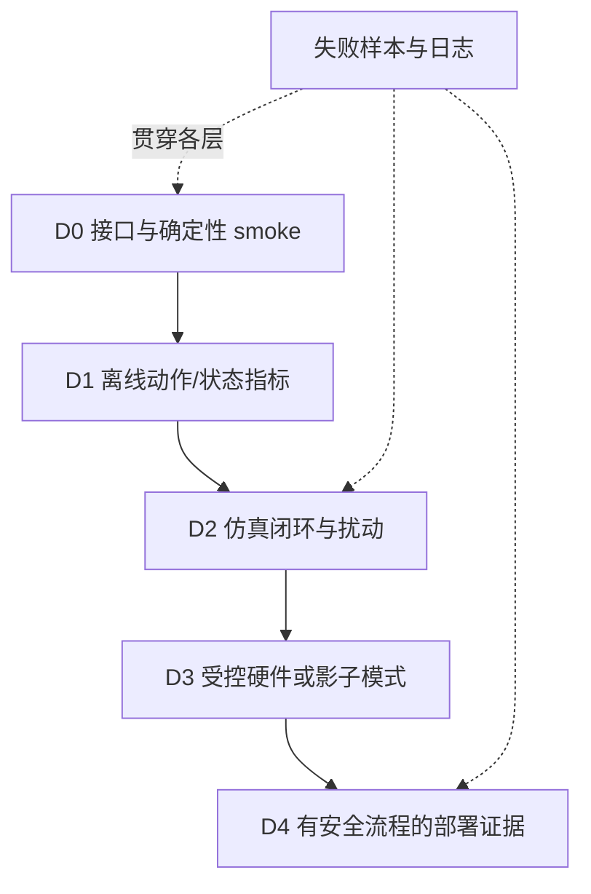

# 第20章 具身评测：从成功率到部署证据

## 本章契约

### 核心问题

当一个策略要在机器人或车辆闭环中执行时，如何把成功率、失败、安全、鲁棒性、时延和恢复组织成可比较、可审计且不越界的证据？

### 先修知识

- 已具备：第4章的数据与实验协议、第9章的用途驱动评测；
- 本章补齐：episode 分母、成功定义、分层指标、benchmark card 与部署证据阶梯；
- 不要求：3D 视觉、真实硬件、特定仿真器或 GPU。

第15章定义动作接口，第17章说明策略可能利用模型误差，第19章区分仿真可重复性与现实有效性。本章承接这三条线索，把“评测什么”落实为协议、分母、指标和证据等级；任何一层通过都不能替代真实策略、仿真器或硬件上的更高层验证。

### 非目标

- 不把不同任务集、初始化、成功判据的百分比直接排行；
- 不把固定表格 smoke 当成任何模型或 benchmark 的性能；
- 不用仿真成功替代真实部署安全证据；
- 不要求购买机器人、车辆或 GPU。

### 学完后的可验证产出

读者应能从决策问题出发定义 estimand、目标总体、独立采样单元和观测规则，判断一个指标是否真正测量了目标能力，并区分抽样不确定性、测量误差、协议偏差与外部效度。读者还应能组织不可相互抵消的效用、安全、效率和恢复证据，而不是依赖单一排行榜数字。

### 本章的两层阅读方式

第一次阅读先抓住五个判断：成功率依赖成功定义与分母；证据必须匹配部署决策；安全不能被平均效用抵消；benchmark 名称不能代替协议；看过最终集会改变它的证据角色。沿 20.1–20.4、20.6–20.9 即可形成这条主线，20.5 的四格表用于把抽象问题压到同一组结果上。

20.5.2–20.5.4 属于进阶统计审计，分别解释 cluster 权重、配对联合表以及“未显著不等于等效”。这些内容不是要求所有读者手算检验，而是防止评测报告在聚合层级、配对信息或决策阈值上偷换问题。只关心概念的读者可以先读每节首段与结论，再在需要设计正式比较时回看公式和固定反例。

## 20.1 成功率不是一个自解释数字

对 `N` 个 episode，最朴素的成功率是：

\[
\hat{p}=\frac{1}{N}\sum_{i=1}^{N}\mathbb{1}[\text{success}_i].
\]

但 `success_i` 取决于目标容差、保持时间、碰撞、人工接管、超时、重试、初始状态和任务版本。`N` 也可能是任务数、episode 数、有效运行数或过滤后的样本数。没有这些字段，两个同名成功率不具可比性。

<!-- CLAIM_META: CLAIM-20-01 recommendation -->
发布成功率时必须同时给出任务总体、初始化、成功/失败定义、超时、重试、有效分母和逐任务结果；无效运行、缺失运行和人工剔除必须单列原因。任何关键字段缺失时，只能发布不完整的描述性结果，不能给出代表完整评测的汇总标题数字。

对小样本，单点比例尤其不稳定。应报告每任务重复数和区间估计；当 episode 存在共享场景、种子或轨迹前缀时，不能假设所有样本独立。跨任务宏平均与按 episode 微平均回答不同问题，也不应只保留更好看的一个。

### 20.1.1 先定义决策，再定义 estimand

评测不是从选择指标开始，而是从要支持的决策开始。判断两个策略在固定任务套件上谁更好、估计新路线上的失败概率、决定是否允许有限部署，是三个不同问题。它们分别需要配对性能差、目标总体风险和带安全阈值的部署证据，不能由同一个总体成功率自动回答。

Estimand 应明确目标单位、总体、条件和聚合规则。例如“从预先定义的 route 分布抽取一条新路线时，策略在一次无人工接管执行中安全完成的概率”比“成功率”更完整。随后才决定如何抽样 route、每条重复多少次、成功如何观测，以及哪些运行进入分母。统计方法应服从 estimand，而不是反过来根据已有日志选择容易计算的目标量。

同一数据可以支持多个 estimand，但每个数字要单独命名。Per-attempt success、允许重试的 per-task success 和每公里事件率都可能有用，却服务不同部署政策。把它们放在一张表中不代表可以相互替换，更不能在看到结果后选最高者作为标题数字。

### 20.1.2 给二项成功率加一个可解释的区间

当每个 episode 只有成功/失败两种结果，且暂时把 episode 视为独立同分布的 Bernoulli 试验时，可以用 Wilson score interval 表达有限样本的不确定性。令成功数为 `k`、样本数为 `n`、点估计为 $\hat{p}=k/n$，区间中心与半宽为：

\[
c=\frac{\hat p+z^2/(2n)}{1+z^2/n},\qquad
m=\frac{z\sqrt{\hat p(1-\hat p)/n+z^2/(4n^2)}}{1+z^2/n}.
\]

95% 区间取 $z\approx1.96$，端点是 `c-m` 与 `c+m`。它比直接使用 $\hat{p}\pm 1.96\sqrt{\hat{p}(1-\hat{p})/n}$ 的 Wald 区间更适合小样本和接近 0/1 的比例；后者甚至会在 `4/4` 时给出零宽区间。NIST 的二项比例指南也建议小样本优先考虑 Wilson 或 Agresti–Coull，而不是标准 Wald 区间。

但区间成立有前提：如果多次运行共享同一场景、初始轨迹或随机种子，名义上的 `n` 可能高估有效样本量。此时应按场景/任务分层报告，或对独立采样单元做 cluster bootstrap。置信区间只量化固定协议下的抽样不确定性，不能修复任务总体、成功定义或分母不同造成的不可比性。

### 20.1.3 零次安全事件仍对应正的风险上界

“测试中没有碰撞”不是风险为零。若暂时把每次暴露视为独立同分布 Bernoulli 试验，真实事件概率为 `p`，那么 `n` 次均无事件的概率为 $(1-p)^n$。一侧置信水平 $1-\alpha$ 的精确二项上界由 $(1-p_U)^n=\alpha$ 给出：

\[
p_U=1-\alpha^{1/n}.
\]

95% 时 $\alpha=0.05$；常见的 “rule of three” 用 $3/n$ 近似它，因为 `-ln(0.05)≈2.996`。[Hanley 与 Lippman-Hand](https://pubmed.ncbi.nlm.nih.gov/6827763/)用零分子的解释说明了这一近似 `[P]`。本书 fixture 直接计算精确式：

| 零事件暴露数 `n` | 95% 一侧精确上界 | $3/n$ 近似 |
| ---: | ---: | ---: |
| 20 | 13.9108% | 15.0% |
| 100 | 2.9513% | 3.0% |
| 1000 | 0.2991% | 0.3% |

*表 20-1：零次观测事件的一侧二项风险上界。来源：实验 20-1 v11 解析计算；独立同分布 Bernoulli 只是一项显式教学假设。*<!-- INTERNAL_ASSET_ID: TAB-20-01 -->

<!-- CLAIM_META: CLAIM-20-09 result -->
实验 20-1 v11<!-- INTERNAL_ASSET_ID: EXP-20-01 v11 --> 在零观测事件下计算出 $n=20/100/1000$ 的 95% 一侧上界分别为 `0.139108/0.029513/0.002991`；因此即使 `0/100`，该假设下仍不能排除约 2.95% 的事件概率。该结果不估计机器人或车辆风险，也不覆盖相关 route、重复 seed、未见危险类型、scorer 漏检或 sim-to-real gap。

### 20.1.4 重复 replay 不能伪装成独立暴露

考虑 10 条独立抽取的 route，每条在相同初态族上重复 replay 10 次，100 次都没有观测到事件。若直接把 100 个 episode 当作独立 Bernoulli，前式给出 `0.029513`；若把 route 作为独立单元，并把“这条新 route 的一个或多个 replay 是否出现事件”作为 cluster-level outcome，则 10 个零事件 cluster 的上界是 `0.258866`。

| 分析单位与目标量 | 名义观测数 | 95% 零事件上界 |
| --- | ---: | ---: |
| 假设独立 episode：每个新 episode 的事件概率 | 100 | 2.9513% |
| 假设独立 route cluster：一条新 route 出现至少一个事件的概率 | 10 | 25.8866% |

*表 20-2：零事件 pseudo-replication 负对照。两行是不同 estimand，不能相减、求倍数或把第二行称为第一行的“修正值”。*<!-- INTERNAL_ASSET_ID: TAB-20-02 -->

实验 20-1 v11<!-- INTERNAL_ASSET_ID: EXP-20-01 v11 --> 还比较同样 10 条 route 各 replay 1 次与 10 次：因为独立 cluster 数仍是 10，cluster-level 公式数值都为 `0.258866`；但目标量已经从“新 route 在 1 次 replay 内至少一例”变成“新 route 在 10 次 replay 内至少一例”，不能把数值相同解释成风险不变。与此同时，建立在 episode 独立假设上的数值从 `0.258866` 收窄到 `0.029513`。重复测量可以帮助描述固定 route 内的随机性，却不会自动创造新的 route、天气、交通参与者或 ODD 支持。当前 [Waymo Safety Impact](https://waymo.com/safety/impact/) 方法也按城市与地理暴露对 benchmark 做匹配，并明确没有完美的“apples-to-apples”比较 `[O,R1]`；这支持暴露总体必须对齐，不为本书两个手工上界背书。

实际分析必须先声明目标量和独立采样单元。若目标是 per-episode event rate，需要能辩护 episode 条件独立或使用适合相关数据的层级/稳健模型；若目标是“新场景是否暴露至少一次失败”，cluster incidence 才是对应量。cluster 只有 10 个时，不能用 cluster bootstrap 或渐近标准误伪造高精度。若 route 身份、生成谱系或重复结构缺失，应停止发布总体风险上界，只报告零事件计数、已知暴露结构与该缺口。

<!-- CLAIM_META: CLAIM-20-10 result -->
实验 20-1 v11<!-- INTERNAL_ASSET_ID: EXP-20-01 v11 --> 的零事件 pseudo-replication fixture 中，10 条 route 各重复 10 次时，假设 100 个 episode 独立得到 per-episode 上界 `0.029513`，把 10 条 route 作为独立单元得到“新 route 在 10 次内至少一例”的上界 `0.258866`；把重复数从 1 增至 10 不会改变独立 route 数或该公式数值，却会改变 cluster outcome 的定义。该结果只验证分析单位与 estimand 合同，不估计有效样本量、相关系数、真实 episode/route 风险或任何策略安全性。

## 20.2 从模型分数到证据阶梯

具身系统由数据、感知、策略、执行器、仿真和安全层共同组成。一次失败可能来自坐标变换、延迟、动作限幅或重置脚本，而不是策略权重。评测应逐级增加真实性，同时保留底层诊断。



*图 20-1：部署证据阶梯。较高层不能抹去较低层的接口诊断；每层都要保留失败样本。来源：本书原创，CC BY-NC 4.0，2026-08-31。*<!-- INTERNAL_ASSET_ID: FIG-20-01 -->

- **D0**：shape、时间戳、动作单位、重置和确定性；
- **D1**：离线动作误差、状态预测、校准和 OOD 拒绝；
- **D2**：闭环成功、碰撞、扰动恢复、时延和场景覆盖；
- **D3**：受控硬件、回放/影子模式、人工接管和故障注入；
- **D4**：限定运行设计域中的长期事件率与安全流程。

这里使用 `D` 表示 deployment evidence，避免与第9章按模型用途定义的 `E0–E4` 证据层混淆。本书默认做到 D0/D1 和可用时的通用仿真 D2；D3/D4 不是完成本书的要求。

### 20.2.1 高层证据增加真实性，也增加混杂

证据阶梯不是简单地越高越好。D0 接口检查高度可控，能精确定位字段和时间错误，却不能说明任务效果；真实部署最接近目标环境，却同时受到操作者、硬件磨损、交通变化和安全流程影响，归因更困难。可靠结论需要高层外部有效性与低层可定位诊断共同支撑。

相邻层之间应建立桥接问题，而不是直接外推。例如 D1 动作误差是否能预测 D2 闭环失败，D2 的仿真策略排序是否在 D3 保持，D3 受控接管率能否覆盖 D4 的运行设计域。桥接一旦随任务、策略族或环境改变而失效，旧相关性就不能继续作为换算公式。

更高证据层也不能洗掉下层已知缺陷。若动作单位合同错误，即使少量硬件运行偶然成功，也不表示接口有效；若仿真已发现稳定碰撞模式，真实样本暂未出现不能把它删除。证据应累积并解释冲突，而不是只保留“最真实”的一行。

## 20.3 指标组合：效用、安全、效率、恢复

单一成功率会把截然不同的失败压成一个比特。最低指标矩阵应包含：

| 维度 | 机器人示例 | 自动驾驶示例 | 必须分桶 |
| --- | --- | --- | --- |
| 任务效用 | 成功率、子目标进度 | 路线完成率、任务完成 | 任务、难度、初态 |
| 安全 | 碰撞、掉落、力限 | 碰撞、越界、违规 | 对象/道路使用者、严重度 |
| 人工介入 | 接管、急停 | 接管、最小风险停车 | 原因与触发层 |
| 效率 | 步数、时间、能耗 | 行程时间、算力、能耗 | 成功与失败分别统计 |
| 平滑舒适 | 动作变化、峰值力 | jerk、急刹、横向加速度 | 场景与速度段 |
| 恢复 | 扰动后恢复率/时间 | 传感器故障与切入恢复 | 扰动类型和强度 |

失败 episode 不能从效率均值里无声删除。若只在成功样本上统计完成时间，必须同时报告失败数、超时和截断规则。安全指标要给事件计数与暴露量，例如每 100 episode、每小时或每公里，而不仅是百分比。

### 20.3.1 指标首先需要构念有效性

一个指标稳定可复现，不代表它测到了想要的能力。轨迹 ADE 可能衡量几何接近，却忽略闭环恢复；路线完成率衡量进度，却不包含碰撞；语言评分器可能偏好看似合理的动作描述，却不知道控制是否可执行。构念有效性问观测量与目标能力之间的关系，必须通过失败案例、对照和人工或规则锚点建立。

指标还可能被策略直接优化，从而失去原有解释。舒适度总分可被“几乎不移动”轻易提高，路线进度可被危险捷径提高，平均成功可通过忽略困难任务提高。评测应设计反例策略和不可抵消的硬约束，检查指标是否奖励明显不合格行为。可被优化不是缺陷，但未经对抗审计的代理指标不能视作任务本身。

### 20.3.2 多指标不必压成一个全序

效用、安全、效率与恢复常形成 Pareto 关系。单一加权总分隐含各维之间可交换，例如多少路线进度可以抵消一次碰撞；在安全关键系统中，这种交换往往不成立。更清晰的做法是先设置不可违反的安全与有效性 gate，再在通过者中比较效率，或直接发布 Pareto frontier 与逐项结果。

若确实需要总分，权重、归一化、截断和缺失值处理必须在评测前冻结，并做敏感性分析。排名在合理权重范围内频繁翻转，说明证据支持的是权衡关系，而不是稳定的“最佳模型”。总分适合摘要，不应替代原始分项和失败索引。

## 20.4 benchmark 不是一个名字

使用 LIBERO、SimplerEnv、RoboCasa、MetaDrive 或 CARLA 时，名称只是入口。可复现实验还需要锁定仓库 commit、任务 suite、资产、控制器、观测、初始化、随机种子、仿真频率、终止条件、渲染模式和依赖。

[LIBERO 官方仓库](https://github.com/Lifelong-Robot-Learning/LIBERO) 当前说明其包含四个 suite、共 130 个任务，并提供稀疏成功信号和固定初始状态文件；代码为 MIT，数据集标注为 CC BY 4.0。这些是 2026-09-01 查阅官方仓库得到的 `[O,R1]` 事实，本书尚未安装或运行。版本变化后必须重新核验，不能仅凭名称比较在线数字。

[SimplerEnv 官方仓库](https://github.com/simpler-env/SimplerEnv)把仿真定位为真机评测的补充而非替代，提供 Visual Matching 与 Variant Aggregation 两类 real-to-sim 设置，并用 MMRV 与 Pearson correlation 检查仿真排序是否对应真实表现。这里的关键不是“相关性高”这一口号，而是相关性本身也需要在具名任务、策略集合和真机参照上重新估计；换一批 policy 或任务，结论不能自动继承。

2025 年的 [RoboArena](https://arxiv.org/abs/2506.18123)选择另一条路线：跨七个机构在 DROID 平台上执行 600 余次真实机器人两两比较，评测者可选择本地任务与环境，但使用 double-blind policy pair，再聚合偏好得到排序。这表明扩大真实性并不等于强行统一全部场景；也可以冻结配对、盲法、评测者和聚合模型，把站点差异作为分层因素。截至 2026-09-02，arXiv 元数据未列出已接收场次，因此论文按 `[A,R0]`，不能因其同时有官方项目页就把论文成熟度写成 `[O]`；本书没有连接其评测网络。

本书默认通用仿真选择为：机器人动力学优先 MuJoCo 或已有官方评测接口的轻量任务环境；驾驶闭环优先 MetaDrive，CARLA 作为高保真扩展。第19章已锁定这一分工；它们均不是完成 S 档正文的前提。

## 20.5 同一结果表，四格协议（实验 20-1<!-- INTERNAL_ASSET_ID: EXP-20-01 -->）

固定 fixture 有 8 个有效 episode：4 个 easy、4 个 hard；其中包含目标未达、到达后碰撞、到达但人工介入等情况。`hard-2` 是达到时间上限的有效 `truncated` episode：它没有完成任务，仍作为失败留在完整协议分母中。假想模型和原始结果完全不变，只在两个预先定义的因素上切换评测设置：任务总体为 `easy/full`，成功定义为 `goal-only/safety-aware`。

- `easy_goal_only`：仅 easy，达到目标即成功；
- `easy_safety_aware`：仅 easy，达到目标且无碰撞、无介入；
- `full_goal_only`：完整任务，达到目标即成功；
- `full_safety_aware`：完整任务，达到目标且无碰撞、无介入。

<details markdown="1">
<summary>可选：验证本章证据</summary>

```bash
make ch20-test-local
make ch20-smoke-local
make ch20-smoke
```

</details>

| 任务总体 | 成功定义 | 成功数/episode | 成功率 | Wilson 95% 区间 | 碰撞率 | 介入率 |
| --- | --- | ---: | ---: | ---: | ---: | ---: |
| easy | goal-only | 4/4 | 100.0% | [51.0%, 100.0%] | 0.0% | 0.0% |
| easy | safety-aware | 4/4 | 100.0% | [51.0%, 100.0%] | 0.0% | 0.0% |
| full | goal-only | 7/8 | 87.5% | [52.9%, 97.8%] | 12.5% | 12.5% |
| full | safety-aware | 5/8 | 62.5% | [30.6%, 86.3%] | 12.5% | 12.5% |

*表 20-3：实验 20-1 固定 episode 表的协议敏感性。不是模型 benchmark。*<!-- INTERNAL_ASSET_ID: TAB-20-03 -->

首尾协议的审计器标记三项不可比诊断：`task_population_differs`、`success_definition_differs`、`denominator_differs`。它们不是三个统计独立或可相加的“原因”：这里分母变化由任务选择直接引起，任务总体与成功规则还会交互。

<!-- CLAIM_META: CLAIM-20-02 result -->
在 实验 20-1<!-- INTERNAL_ASSET_ID: EXP-20-01 --> 的固定结果表上，仅改变任务总体、成功定义和分母，报告成功率就从 100% 变为 62.5%。这证明脱离协议的数字比较可以失真，不估计真实 benchmark 中差异的大小。

<!-- CLAIM_META: CLAIM-20-05 result -->
同一 fixture 中，`4/4` 的 Wilson 95% 区间为 `[0.510109, 1.0]`，`5/8` 为 `[0.305742, 0.863156]`。区间揭示两组点估计都很不确定，但不能把两个不同协议变成可比较实验。

四格反事实把混杂进一步展开：在 goal-only 下从 easy 换到 full，成功率变化 `-12.5` 个百分点；在 safety-aware 下同一总体变化是 `-37.5` 个百分点。安全规则在 easy 上变化 `0`，在 full 上变化 `-25` 个百分点，difference-in-differences interaction 为 `-25` 个百分点。这些是固定表格的算术差，不是总体效应估计。

<!-- CLAIM_META: CLAIM-20-07 result -->
实验 20-1 v11<!-- INTERNAL_ASSET_ID: EXP-20-01 v11 --> 的 2×2 协议格证明，同一个 protocol warning 的数值影响依赖另一个协议因素；因此首尾成功率差不能被唯一归因给任务总体、安全定义或分母。要解释归因，必须预先设计共同总体上的反事实或配对比较。

聚合产物同时报告 `attempted_count`、`valid_episode_count`、`terminated_episode_count`、`truncated_episode_count` 与 `invalid_episode_count`。完整协议是 `8 attempted / 8 valid / 7 terminated / 1 truncated / 0 invalid`；截断没有被误当技术坏样本删除，因此成功率仍为 `5/8`。同一步若同时 natural terminal 与 timeout，会分别进入两个结束原因计数，但 attempted 分母只增加一次；value bootstrap 仍按第4、8章由 `terminated` 关闭。fixture 另有反例注入 `reset_failed`：审计器会保留无效 episode ID 和原因，并阻止生成聚合比例。

<!-- CLAIM_META: CLAIM-20-06 result -->
实验 20-1 v11<!-- INTERNAL_ASSET_ID: EXP-20-01 v11 --> 验证了两条分母规则：有效 timeout 截断仍进入预先定义的 episode 分母；技术无效运行必须具名报告并使当前聚合失败，不能在计算后静默删除。这个合同不规定所有 benchmark 必须采用同一重跑政策；它要求重跑、替换或排除政策在运行前冻结。

### 20.5.1 自适应重试：attempt 成功率不等于恢复政策成功率

实验 20-1 v11<!-- INTERNAL_ASSET_ID: EXP-20-01 v11 --> 固定 4 个 task 的 retry-on-first-failure ledger。task-a/d 首次成功后停止；task-b 首次失败、第二次成功；task-c 两次都失败。协议拒绝首次成功后继续重试、首次失败后漏记第二次，以及重复 `(task_id,attempt_id)`。

| 目标量 | 分子/分母 | 数值 | 回答的问题 |
| --- | ---: | ---: | --- |
| first-attempt success | 2/4 tasks | 0.50 | 不使用恢复政策时的首次执行结果 |
| per-attempt success | 3/6 attempts | 0.50 | 实际执行的一次 attempt 有多少成功 |
| task success with up to two attempts | 3/4 tasks | 0.75 | 允许该重试政策后有多少 task 最终成功 |
| mean attempts per task | 6/4 | 1.50 | 该政策的平均执行成本 |

*表 20-4：实验 20-1 v11 的自适应重试分母。4 个 task、6 次 attempt 和每次单位成本均为作者构造。*<!-- INTERNAL_ASSET_ID: TAB-20-04 -->

<!-- CLAIM_META: CLAIM-20-14 result -->
该固定 ledger 的 first-attempt/per-attempt 成功率均为 `0.5`，允许首次失败后重试一次的 task-level 成功率为 `0.75`，同时平均每 task 使用 `1.5` 次 attempt、仅 1 个 task 被重试恢复。该结果只证明具名重试政策会改变估计目标与成本分母，不估计独立重复成功概率、真实恢复收益、时延、干预、安全风险或部署性能。

### 20.5.2 进阶审计：配对与 cluster 先决定谁获得相同权重

第二个子 fixture 比较 candidate 与 baseline，并让两者在相同 `pair_id`、相同 route 上运行。四条 route 的重复数故意不均衡：`route-a/b` 各有 4 对，`route-c/d` 各有 1 对。

| route cluster | pair 数 | candidate 成功 | baseline 成功 | route 内配对差 `candidate-baseline` |
| --- | ---: | ---: | ---: | ---: |
| route-a | 4 | 4/4 | 4/4 | 0.0 |
| route-b | 4 | 4/4 | 0/4 | +1.0 |
| route-c | 1 | 0/1 | 1/1 | -1.0 |
| route-d | 1 | 1/1 | 1/1 | 0.0 |
| episode micro | 10 | 9/10 | 6/10 | +0.3 |
| route macro | 4 clusters | — | — | 0.0 |

*表 20-5：配对 episode 微平均与等 route 宏平均回答不同 estimand。数据为手工反例，不是策略成绩。*<!-- INTERNAL_ASSET_ID: TAB-20-05 -->

micro 差值让每个 episode 权重相同，因此重复 4 次的 `route-b` 对总体贡献更大；macro 差值先在每条 route 内求平均，再让四条 route 权重相同。如果目标总体确实按 episode 暴露频率分布，micro 可能合理；如果四条预注册 route 是同等重要的独立采样单元，macro 更贴近问题。不能看到哪个结果更有利后再选权重。

代码保留每一对的 candidate-baseline 差，再在 route 层重采样。四个 cluster 的一次 bootstrap replicate 抽取 4 条 route、有放回；小规模 fixture 枚举全部 `4^4=256` 个有序 replicate，而不是依赖随机 seed。equal-route macro 差的简单 percentile 95% 区间为 `[-0.75, 0.75]`。[Field 与 Welsh 的 clustered-data bootstrap 研究](https://rss.onlinelibrary.wiley.com/doi/abs/10.1111/j.1467-9868.2007.00593.x)强调 bootstrap 是否合适取决于 cluster 模型和重采样设计；本例只有四个手工 cluster，区间离散且不能当成具有可靠 95% population coverage 的推断。

<!-- CLAIM_META: CLAIM-20-08 result -->
实验 20-1 v11<!-- INTERNAL_ASSET_ID: EXP-20-01 v11 --> 的十对固定结果中，candidate/baseline 的 episode-micro 成功率为 `0.9/0.6`、配对差为 `+0.3`，但四条 route 等权后的 macro 配对差为 `0.0`；枚举 256 个 route-level bootstrap replicate 得到 percentile 区间 `[-0.75,0.75]`。这只证明不均衡重复、配对和 cluster 权重可以改变 estimand，并演示重采样机制；不估计任何真实策略差异，也不能由区间含 0 证明两策略等效。

### 20.5.3 进阶审计：边际成功率相同，配对证据仍可能不同

如果 candidate 与 baseline 在同一批初态上逐对运行，两个边际成功率会丢掉 joint outcome。令 `b` 为“candidate 成功、baseline 失败”的对数，`c` 为相反方向，$m=b+c$ 为 discordant pairs。exact conditional McNemar 诊断在“两个方向在 discordant pairs 中等概率”的零假设下使用：

\[
p_{\text{exact}}=\min\left(1,\;2\sum_{j=0}^{\min(b,c)} {m\choose j}2^{-m}\right).
\]

[Fay 等人](https://pmc.ncbi.nlm.nih.gov/articles/PMC9447366/)说明二元 matched pairs 的 conditional test 只对 discordant pairs 的方向做 exact binomial 计算，并讨论了与 exact test 相容的差值区间 `[P]`。本书只实现上式的 equal-tail two-sided 诊断；离散 exact test 可能保守，不能看过结果后在 exact、mid-p、渐近或单侧版本之间挑更小的值。

实验 20-1 v11<!-- INTERNAL_ASSET_ID: EXP-20-01 v11 --> 构造两张各 20 对的表。两表的 candidate 都为 `12/20`、baseline 都为 `8/20`，所以边际差都为 `+0.2`；joint table 不同：

| joint pairing | 双方成功 | 仅 candidate 成功 `b` | 仅 baseline 成功 `c` | 双方失败 | discordant `m` | exact two-sided `p` |
| --- | ---: | ---: | ---: | ---: | ---: | ---: |
| high-concordance | 8 | 4 | 0 | 8 | 4 | 0.125000 |
| more-discordant | 4 | 8 | 4 | 4 | 12 | 0.387695 |

*表 20-6：相同边际成功率、不同 joint pairing 的负对照。`p` 是固定手工表在具名零假设下的 exact conditional 诊断，不是模型成绩、效应量或安全证据。*<!-- INTERNAL_ASSET_ID: TAB-20-06 -->

第一张表的 4 个 discordant pairs 全朝 candidate 方向；第二张虽然 discordant 更多，却分成 `8:4`，相对方向不平衡更弱。因此相同的 `+0.2` 点差并不能确定配对检验结果。这里不能反过来总结“discordant 越多，证据越弱”：决定数值的是 `b:c` 与 `m` 的联合结构。实际发布还应给配对差及预先选定的区间，不用 $p>0.05$ 宣称等效，也不用 $p<0.05$ 代替实际效应、任务覆盖或风险判断。

该诊断要求 pair 之间是目标总体下可辩护的独立单元。若多对结果嵌套在同一 route、scene lineage 或 seed family 中，20.5.1 的 cluster 层仍然存在；对 episode 直接做 McNemar 不会消除伪重复。多策略、多任务、多阈值或反复查看结果还会引入 multiplicity/adaptivity，必须预注册主比较或另做相应控制。

<!-- CLAIM_META: CLAIM-20-12 result -->
实验 20-1 v11<!-- INTERNAL_ASSET_ID: EXP-20-01 v11 --> 的两张 20 对手工表都给出 candidate/baseline=`0.6/0.4` 与点差 `+0.2`，但 high-concordance 表的 $b/c=4/0$、exact conditional two-sided $p=0.125$，more-discordant 表为 `8/4`、$p=0.387695$。该结果只证明边际成功率不能恢复 paired joint table 或其具名条件诊断；不估计策略效应、显著性功效、cluster 相关、等效性、多重比较或部署安全。

### 20.5.4 进阶审计：不显著不是等效

为给前述“不能由 $p>0.05$ 宣称等效”一个可执行的最低基线，令每对差值 $D_i=\text{candidate}_i-\text{baseline}_i\in\{-1,0,1\}$，并定义这些固定设计位置的平均期望 $\mu_n=n^{-1}\sum_i E[D_i]$。若把 `n` 个 pair 视为相互独立且协议固定，[Hoeffding 的有界变量不等式](https://doi.org/10.1080/01621459.1963.10500830)给出：

\[
\Pr\!\left(\left|\bar D-\mu_n\right|\geq\epsilon\right)
\leq 2\exp\!\left(-\frac{n\epsilon^2}{2}\right),\qquad
\epsilon=\sqrt{\frac{2\ln(2/\alpha)}{n}}.
\]

这里范围宽度为 `2`。$\alpha=0.05,\,n=20$ 时半宽为 `0.607361`；围绕点差 `0.2` 并裁到可行范围 `[-1,1]`，得到保守区间 `[-0.407361,0.807361]`。两张表的区间相同，因为这个最低基线只使用 pair 数、均值和已知范围；McNemar 诊断却使用 discordant 方向，所以数值不同。

| joint pairing | paired difference | exact two-sided `p` | Hoeffding 95% 区间 | 是否完全落入预注册 `[-0.3,0.3]` |
| --- | ---: | ---: | ---: | --- |
| high-concordance | +0.2 | 0.125000 | `[-0.407361,0.807361]` | 否 |
| more-discordant | +0.2 | 0.387695 | `[-0.407361,0.807361]` | 否 |

*表 20-7：同一点差下的检验—效应区间分账。`[-0.3,0.3]` 是作者预先设置的教学实用差异带，不是机器人或驾驶任务的通用阈值。*<!-- INTERNAL_ASSET_ID: TAB-20-07 -->

这个区间有意保守，也不是 Fay 等人讨论的 exact-test-compatible matched-binary interval；后者的构造并非把 `p` 值机械换算成上下界。当前公式还要求 pair 之间独立，不能穿透 route/scene cluster。对当前均值，若只要求 Hoeffding 半宽不超过 `0.1`，公式给出的充分样本数为 `738` 个独立 pair；这不是专门 paired-binary 方法的功效计算，也不保证未来样本均值仍为 `0.2`。实用等效带必须由任务容差、后果和决策成本在看结果前设定。

<!-- CLAIM_META: CLAIM-20-13 result -->
实验 20-1 v11<!-- INTERNAL_ASSET_ID: EXP-20-01 v11 --> 对两张 20 对手工表都得到 paired difference Hoeffding 95% 区间 `[-0.407361,0.807361]`，均未完全落入预注册 `[-0.3,0.3]`，尽管两张表的 exact conditional `p` 分别为 `0.125/0.387695`。该结果只演示检验值、效应区间和实用阈值是三份不同合同；不证明差异、等效、非劣、安全或真实样本量需求。

## 20.6 benchmark card 的最小字段

每次结果发布至少保存：

```text
系统：模型/checkpoint/代码 commit/推理配置
任务：benchmark commit、suite、任务与资产版本
观测与动作：模态、坐标系、频率、控制器、限幅
协议：初态、种子、episode 数、重试、超时、终止
成功：分子条件、碰撞/介入是否判失败、有效分母
指标：实现、单位、宏/微平均、区间与逐任务表
资源：容器、CPU/GPU、时延、内存/显存、磁盘/下载
安全：独立安全层、接管、拒绝、故障注入
证据：原始 episode 表、日志、失败视频索引、缺失项
许可：代码、模型、数据、资产和录屏的各自许可
```

<!-- CLAIM_META: CLAIM-20-03 recommendation -->
若 benchmark card 的任务、成功定义或分母不同，应先标记“不可直接比较”，再决定是否能通过重算得到共同协议，而不是直接排序。

上述字段已经映射到 `specs/benchmark-card.schema.json`。`benchmarks/BENCH-20-01.json` v11 冻结本章四种具名协议、完整八行分母、十行配对 route 表、两张 20 行同边际 joint-pairing 表、四行 checkpoint score 表、结束标志、无效运行政策、成功判据、Wilson/零事件上界/exact McNemar/Hoeffding paired-difference/cluster bootstrap 假设和不可比因素；它还明确将 hard suite 的加入视为任务总体变化，而不是 OOD score 实验。严格验证可以发现缺字段、错误章节引用和产物漂移，但不能让这些手工行变成真实 benchmark 样本。

### 20.6.1 防止 checkpoint 与评测者泄漏

评测任务被反复用于选 checkpoint、调 prompt、改 action adapter 或挑视频后，它就不再是未见测试集。应至少区分开发集、模型选择集和一次性最终集，记录每个 checkpoint 接触过哪些任务与失败视频。仿真资产、初始状态和语言模板也属于可泄漏信息；仅隐藏 task name 不足以阻止对固定场景过拟合。

真机人工判定还需冻结盲法、裁决手册和争议处理。若评测者知道策略身份，或能从动作风格猜出模型，应记录这一限制；能配对时优先使用同一任务/初态上的随机顺序或 double-blind 比较。闭源 API 基线还要保存模型快照、请求参数、日期、失败重试和费用，因为同一产品名下的服务行为可能漂移。

视频最好保存索引和必要片段，而非只挑成功 demo。索引应包含 episode ID、任务、种子、结果、失败类别、日志路径和许可状态；涉及人员、家庭或道路数据时先做隐私与发布审查。

### 20.6.2 checkpoint 选择：看过 final 就改变了它的角色

训练集负责拟合参数，selection split 负责选择 checkpoint、prompt、阈值或 adapter；final split 只在选择及协议冻结后运行一次。若看完 final 分数再选择 checkpoint，即使没有反向传播，这个 final split 也已经参与选择，不能继续称为独立最终评测。[Cawley 与 Talbot](https://www.jmlr.org/papers/volume11/cawley10a/cawley10a.pdf)说明有限样本上的模型选择准则本身也会被过拟合，并由此产生乐观的性能评估偏差 `[P]`；[Dwork et al.](https://arxiv.org/abs/1506.02629)进一步研究了自适应分析反复复用 holdout 时的泛化问题 `[A]`。两项工作提供方法论依据，不为下面的手工数字背书。

实验 20-1 v11<!-- INTERNAL_ASSET_ID: EXP-20-01 v11 --> 固定四个 checkpoint 的三列分数。合法路径只看 selection 列，选中 `checkpoint-a`，随后一次性读取其 final 分数 `0.50`。负对照则错误地在 final 列上取最大值，挑中 `checkpoint-d` 并报告 `0.75`；该 checkpoint 在未被两条选择路径使用的 confirmation 列上为 `0.50`：

| checkpoint | selection score | final score | untouched confirmation score |
| --- | ---: | ---: | ---: |
| checkpoint-a | **0.80** | 0.50 | 0.51 |
| checkpoint-b | 0.70 | 0.55 | 0.49 |
| checkpoint-c | 0.60 | 0.60 | 0.50 |
| checkpoint-d | 0.50 | **0.75** | 0.50 |

*表 20-8：checkpoint final-set reuse 负对照。粗体只标出各自列上的选择；所有分数均为作者构造，不是模型结果。*<!-- INTERNAL_ASSET_ID: TAB-20-08 -->

负对照的 `0.75-0.50=0.25` 是这张表上的 **authored reuse gap**，不是期望选择偏差、置信区间、真实泛化差或“checkpoint-d 更差”的证明。confirmation 列只是教学 oracle：真实项目若已经用 final 挑过模型，应承认原 final 已降级为 selection evidence，并取得新的、谱系隔离且尚未触碰的确认数据；不能把旧 split 改名恢复独立性。候选越多、反馈轮次越多时，偏差通常更值得警惕，但本 fixture 不估计其随候选数增长的概率规律。实现还拒绝重复 checkpoint、非有限/越界分数以及 selection/final 最大值并列，防止 tie-breaking 在结果出现后被悄悄决定。

<!-- CLAIM_META: CLAIM-20-11 result -->
实验 20-1 v11<!-- INTERNAL_ASSET_ID: EXP-20-01 v11 --> 的四行手工负对照中，按 selection split 冻结选择得到 `checkpoint-a`，其一次性 final 分数为 `0.50`；错误地最大化 final 分数会选择 `checkpoint-d` 并报告 `0.75`，而该 checkpoint 的 untouched confirmation 分数为 `0.50`，形成 `0.25` authored reuse gap。它只验证 split 角色与 final-set reuse 的合同，不估计任何模型的泛化、期望选择偏差或 checkpoint 排序。

## 20.7 自动驾驶：路线完成不能吞掉安全

驾驶闭环至少同时报告路线完成、碰撞、违规、人工接管、超时、舒适性和计算时延。到达终点后发生碰撞的 episode，若协议只看 `goal_reached` 会被算作成功；实验 20-1<!-- INTERNAL_ASSET_ID: EXP-20-01 --> 刻意保留这个反例。

[CARLA Leaderboard 2.1 官方评测页](https://leaderboard.carla.org/evaluation_v2_1/)给出的 route-level driving score 是路线完成率与 infraction penalty 的乘积，但 global driving score 是各 route driving score 的算术平均，并不等于两个 global 均值之积；碰撞等全局事件另按每公里报告。更值得注意的是 2.1 的 infraction penalty 公式已不同于 2.0，因此引用“CARLA 分数”时必须锁定 leaderboard 版本、track、route set 和 scorer commit，不能只写 simulator 版本。

<!-- CLAIM_META: CLAIM-20-04 inference -->
自动驾驶的成功定义若不把碰撞和安全接管纳入，路线完成率可能高估系统可用性；但仿真碰撞率仍不能直接外推真实道路事件率。

驾驶指标必须按道路类型、天气、交通密度、弱势道路使用者和事件严重度分桶。还要记录每公里/每小时暴露量、仿真步长、交通参与者策略、传感器故障和最小风险停车。闭环模型输出不得绕过碰撞检查、道路边界、控制限幅和超时降级。

## 20.8 统计、鲁棒性与停止规则

评测前先固定最小 episode 数、种子和停止条件，避免看到好结果就停止。建议保留逐 episode 表，并通过按任务或场景的分层 bootstrap 估计区间；对稀有安全事件，零次观察不等于风险为零。

先确定独立采样单元，再选择区间。多次 retry、同一对象位姿的相邻种子、同一路线天气变体通常不是完全独立 episode；应把共享的 task、scene、route 或 evaluator 当作 cluster，在 cluster 层重采样。比较两个策略时，若它们运行在相同初态/路线，保留配对并对逐对差值做区间通常比拆成两个独立比例更有效。若某些 task 拥有更多 episode，micro average 会让其权重更大，macro average 则让每个 task 权重相同；两者都可报告，但任务为空、无效运行和权重规则必须预先冻结。

不要把置信区间误用成发布门槛的唯一证据。区间覆盖抽样不确定性，不覆盖 scorer bug、协议泄漏、sim-to-real gap、未观测危险类型或自适应停止。多 checkpoint、多任务和多指标筛选还会产生选择偏差；最终集应在选择完成后只运行一次，探索性分析与确认性结论分开标记。

鲁棒性测试一次只改变可解释因素：光照、遮挡、纹理、质量、相机位姿、动力学、控制延迟或语言改写。组合扰动用于最终压力测试，但必须保留单因素结果以定位失败。恢复指标要区分“最终成功”和“在安全时间窗内恢复”。

停止评测的工程条件包括接口错位、重置失败率过高、缺失 episode、日志与视频无法关联、协议字段不完整或安全层未启用。此时应标记无效运行，而不是计算一个表面完整的均值。

### 20.8.1 四类不确定性不能由一个区间覆盖

置信区间通常只表达给定协议与统计模型下的抽样不确定性。Scorer 标错成功属于测量误差，挑选有利 checkpoint 属于选择偏差，仿真到道路的差异属于外部效度，任务定义错误则属于构念偏差。增加 episode 数可以缩小部分抽样误差，却不会自动修复后三类问题。

报告应把这些不确定性分别处理：通过重复和分层估计抽样变化，通过盲测与 confusion matrix 校准 scorer，通过冻结选择历史控制适应性，通过跨环境和真实性锚点讨论外推。把所有问题笼统写成“误差条”会给人错误的统计保证。

### 20.8.2 缺失和无效运行往往不是随机的

仿真崩溃、传感器丢帧、人工接管后日志中止或机器人进入不可恢复状态，通常更容易发生在困难 episode。若只删除这些运行，剩余分母会系统性偏向容易条件。技术无效与任务失败可以分开编码，但必须保留 attempted ledger、触发时刻和原因，并预先定义重跑是否替换原尝试。

当缺失机制无法辩护时，单一汇总值应降级。可以给出将全部未知视为失败或成功的边界，按原因分层报告，或明确只描述“日志完整的运行”；不能通过静默重试把困难初态换成新初态。数据完整性本身也是系统可靠性指标。

## 20.9 结果、资源与边界

| 类型 | 声明/结果 | 来源 | 状态 | 限制 |
| --- | --- | --- | --- | --- |
| 本书结果 | 同一表在两协议下为 100% 与 62.5% | 实验 20-1<!-- INTERNAL_ASSET_ID: EXP-20-01 --> | CPU smoke | 手工 8 episode |
| 本书结果 | 四格协议存在 `-25` 个百分点 interaction | 实验 20-1<!-- INTERNAL_ASSET_ID: EXP-20-01 --> | CPU smoke | 协议算术反事实，不是总体因果效应 |
| 本书结果 | 小样本成功率的 Wilson 95% 区间 | 实验 20-1<!-- INTERNAL_ASSET_ID: EXP-20-01 --> | CPU smoke | 假定独立 Bernoulli，不能修复协议差异 |
| 本书结果 | 零事件 95% 一侧上界：`0/100→2.9513%` | 实验 20-1<!-- INTERNAL_ASSET_ID: EXP-20-01 --> | CPU smoke | 假定独立 Bernoulli，不是部署风险估计 |
| 本书结果 | 100 个重复 episode 与 10 个 route cluster 的零事件上界分别为 `2.9513%/25.8866%` | 实验 20-1<!-- INTERNAL_ASSET_ID: EXP-20-01 --> | CPU smoke | 两个不同 estimand，不是相关性修正或真实风险 |
| 本书结果 | episode-micro 差 `+0.3`，等 route macro 差 `0.0` | 实验 20-1<!-- INTERNAL_ASSET_ID: EXP-20-01 --> | CPU smoke | 四个手工 cluster，bootstrap 只演示机制 |
| 本书结果 | final-set reuse 报告 `0.75`，untouched confirmation 为 `0.50` | 实验 20-1<!-- INTERNAL_ASSET_ID: EXP-20-01 --> | CPU smoke | 四个手工 checkpoint；`0.25` 是 authored reuse gap，不是期望偏差 |
| 本书结果 | 两张 20 对表的 Hoeffding 95% 配对差区间均为 `[-0.407361,0.807361]` | 实验 20-1<!-- INTERNAL_ASSET_ID: EXP-20-01 --> | CPU smoke | 独立 pair、有界差且固定样本；保守基线，不是 exact-compatible matched-binary interval 或等效结论 |
| 官方事实 | LIBERO 官方仓库描述 4 suite、130 任务 | 官方仓库 | `[O,R1]` | 本书未运行 |
| 未验证 | 通用仿真上的策略成功与鲁棒性 | 可选 M 档 | planned | 环境角色已锁定，尚未安装或运行 |

全书资源档位采用[术语表](../glossary.md)中的统一定义。本章的解析表只证明分母、协议和统计解释可以改变结论，不是策略成绩；进一步进入仿真或真实系统时，应增加独立采样单元、逐 episode 原始记录、失败审查和外部效度，而不是只增加运行次数。核心评测原则不要求读者拥有硬件，未运行的路径始终保持未验证。

## 小结

具身评测从决策问题与 estimand 开始，再定义目标总体、独立采样单元、成功观测、分母和统计方法。成功率是否稳定只是抽样问题之一；指标是否测到目标能力、scorer 是否正确、选择过程是否独立以及结果能否外推，属于不同有效性层。增加 replay 或缩窄置信区间不会自动修复协议与外部效度。

效用、安全、效率和恢复通常不能任意交换，应优先使用硬 gate、分项结果与 Pareto 关系，而不是让总分吞掉严重失败。无效运行和缺失往往集中于困难条件，必须保留 attempted ledger。只有当系统、任务、总体、定义和数据角色一致时，数字才可比较；仿真闭环和代理评分也不能替代部署证据。

## 练习

1. **概念判断**：模型 A 为 90%/20 episodes，模型 B 为 80%/200 episodes，能否只按点估计选择 A？
2. **重试协议分析**：为 实验 20-1<!-- INTERNAL_ASSET_ID: EXP-20-01 --> 定义“首次失败后允许一次重试”，分别写出 per-attempt 与 best-of-two estimand，并解释其分母、成本和部署语义为何不同。
3. **卡片审计**：从一篇策略论文提取 benchmark card 字段，并列出不能确定的项目。
4. **自动驾驶迁移**：设计一套同时防止“慢而安全”和“快而危险”垄断总分的指标表。
5. **统计协议**：把四条 route 改成你自己的不平衡重复表，先声明目标是按实际暴露量还是 route 等权，再比较 micro、macro 与 cluster bootstrap。
6. **零事件分析单位**：构造 10 条 route×10 次 replay 的零事件表，分别写出 episode-level 与 route-level 目标量，解释为什么不能把两个上界当作同一风险的宽/窄版本。
7. **最终集复用**：给出 checkpoint、prompt 和安全阈值的选择日志，标记每次反馈读取了哪个 split；说明 final 被误用后如何缩小声明，并设计新的确认评测。
8. **配对边际反例**：构造两张 candidate/baseline 边际成功率相同但 discordant cells 不同的配对表，计算 exact conditional McNemar 诊断，并说明它为什么不能替代 cluster-aware 分析。
9. **等效边界**：为一个具体任务预注册可接受差异带，分别说明什么证据支持“有差异”“未检出差异”和“区间足够窄且位于实用差异带内”。

## 自检要点

统计练习先声明 estimand、独立采样单元和分母。下面的计算用于暴露不确定性与加权选择，不构成模型优越性的显著性证明。

<details markdown="1">
<summary>自检 20-1：90%/20 不能只凭点估计胜出</summary>

若 A 的 90% 指 `18/20`、B 的 80% 指 `160/200`，按本章 Wilson 95% 公式，区间约为 A `[0.6990,0.9721]`、B `[0.7391,0.8495]`；A 点估计更高但不确定性更大且区间重叠。选择还要求两者共享任务总体、route/seed、成功定义、timeout、无效运行规则和资源预算，并预先定义风险/成本效用。不能由区间重叠推出“完全相同”，也不能因 A 区间更宽就自动选 B；应扩充配对或分层样本，报告 effect 与区间，再按决策损失判断。

</details>

<details markdown="1">
<summary>自检 20-2：一次重试产生两个不同 estimand</summary>

把每个 task/seed 最多运行两次，第二次只在首次失败后发生，并保存 `task_id, attempt_id, attempted, outcome, cost`。per-attempt 成功率的分母是所有实际 attempt，回答“任一执行尝试成功的概率”；best-of-two 的分母是 task，每个 task 只要一次成功即记成功，回答“允许该恢复政策后任务成功的概率”。若独立且每次成功率恒为 `p`，理论 best-of-two 为 $1-(1-p)^2$，但自适应重试通常不满足独立同分布，实测应按 task 聚合。报告还要包含平均/尾部尝试数、时延、干预与第二次尝试的安全风险；不能把 best-of-two 与只允许一次执行的部署系统直接比较。

</details>

<details markdown="1">
<summary>自检 20-3：benchmark card 的已知与未知</summary>

最低提取字段包括论文/代码 revision、环境与资产版本、任务/route/seed、观测和 action schema、控制频率、reset/termination/timeout、成功与安全定义、episode accounting、训练/选择/评测切分、基线公平性、重复次数/区间、资源和 evaluator。论文未明确的随机 seed、失败重试、技术无效运行、checkpoint 选择、相机延迟或统计独立单元必须标为 `unknown`，不能凭常见默认值补齐。提取结果应链接一手正文、补充材料或代码行，并区分作者报告与本书运行。字段缺失意味着可比性受限，不等价于论文方法错误。

</details>

<details markdown="1">
<summary>自检 20-4：驾驶指标要保留速度与安全的 Pareto 关系</summary>

不要只给可互相抵消的总分。至少并列 route completion/progress、到达时间或有效平均速度、碰撞/越界/红灯（按事件与每公里暴露量）、intervention、舒适、MRM 触发/完成和 P95/P99 latency；碰撞、动作越界和 MRM 失败作为硬 gate。先在 safety gate 内比较效率，或报告 safety–progress Pareto frontier，并按城市/高速、天气和稀有事件分层。这样“慢而安全”会在效率上暴露，“快而危险”会被安全 gate 拒绝。权重总分可作为次级摘要，但必须发布原始分项和预注册权重。

</details>

<details markdown="1">
<summary>自检 20-5：不平衡 route 会改变目标量</summary>

构造三条 route 的配对差：A 有 8 对且每对 candidate-baseline 为 `+1`，B、C 各 1 对且差为 `-1`。若目标是按实际 episode 暴露量，micro 差为 `(8-1-1)/10=0.6`；若目标是让每条 route 等权，macro 差为 `(1-1-1)/3≈-0.3333`，结论方向反转。cluster bootstrap 应有放回重采 3 条 route，再在每条 route 保留其成组观测，而不是把 10 对当独立样本。只有 3 个手工 cluster 时区间会很离散；它展示 estimand 敏感性，不提供可靠 population coverage。

</details>

<details markdown="1">
<summary>自检 20-6：100 个 replay 不等于 100 条独立 route</summary>

先写目标量：episode 行回答“一个独立抽取 episode 的事件概率”，route 行回答“一条独立抽取的新 route 在固定 10 次 replay 中至少出现一次事件的概率”。零事件精确式在 $n=100$ 与 $n=10$ 时分别给出 `0.029513` 和 `0.258866`，但它们不是同一参数，不能用后者除以前者宣称风险高约 8.8 倍，也不能把 $n=10$ 当作未经模型证明的 per-episode 有效样本量。把固定重复数改为 1 还会改变 route-level outcome 本身，即使公式数值仍只由 10 个 cluster 决定。合格协议要保存 route/scene/seed/生成谱系、每 cluster 重复数和 cluster 内事件；缺少这些身份时停止总体上界发布。若要估计 per-episode 风险，应预先指定相关数据模型或稳健区间并验证假设；若目标是发现新场景失败，应增加独立 route 覆盖，而不是只重复已有 route。

</details>

<details markdown="1">
<summary>自检 20-7：split 的角色由使用方式决定</summary>

先按时间顺序列出候选配置、代码 revision、选择准则、每次读取的 split 与决策。只要某次 final 结果影响 checkpoint、prompt、阈值、重试政策或报告子集，它就已成为 selection evidence；改名、清缓存或换指标都不能恢复独立性。应冻结最终候选与协议，取得 lineage/route/scene/近重复簇均隔离的新 confirmation set，只运行一次并完整报告失败；若无法取得新数据，就把现有数值降级为探索性结果，删除独立泛化或公平排行声明。新确认结果也不证明没有其他污染，仍需审计生成谱系、人工反馈、benchmark API 查询和停止规则。

</details>

<details markdown="1">
<summary>自检 20-8：边际成功率不能恢复配对联合表</summary>

先固定两张 20 对表的边际数都为 candidate `12/20`、baseline `8/20`。表 A 可取 `(both success,candidate only,baseline only,both failure)=(8,4,0,8)`，表 B 取 `(4,8,4,4)`；两者点差都是 `+0.2`，但 discordant cells 分别为 `4:0` 与 `8:4`。按正文 equal-tail exact conditional 公式，双侧值分别是 `0.125` 与 `0.387695`。合格解释必须保留四格 joint counts、pair identity、方向、效应点差和预注册检验版本；不能由两个 $p>0.05$ 宣称等效，也不能把较小值解释为安全或实际收益。若 pair 嵌套于 route/scene/seed family，独立单元仍是 cluster，应使用预先规定的 cluster-aware 设计；McNemar 只保留 episode pairing，不会修复伪重复。多任务、阈值或策略比较还需另行处理 multiplicity，不能挑最有利的一张表报告。

</details>

<details markdown="1">
<summary>自检 20-9：差异、未检出与实用等效是三种结论</summary>

先定义方向和 estimand，例如同一初态上 `candidate-baseline` 的安全感知成功率差；再由任务后果预注册实用差异带，例如仅作教学用的 `[-0.3,0.3]`。检验拒绝零差异只回答具名零假设，不能说明差异足够重要；未拒绝只表示当前证据不足，不能说明落入等效带；只有预先选定且假设可辩护的效应区间完全位于差异带内，才满足该预注册的区间判据。正文 20 对 fixture 的保守区间为 `[-0.407361,0.807361]`，所以不满足。若 pair 嵌套在 route 中，必须先改成 cluster-aware 设计；不能用增加同 route replay 的方式假装增加独立 pair。Hoeffding 区间只是低假设基线，正式 paired-binary 研究应预选更合适且验证过覆盖性质的方法。

</details>

## 延伸阅读

- [LIBERO 官方仓库](https://github.com/Lifelong-Robot-Learning/LIBERO)，`[O,R1]`，终身机器人学习 benchmark；
- NIST, [Binomial Proportion](https://itl.nist.gov/div898/handbook/prc/section2/prc241.htm)，`[O]`，Wilson/Agresti–Coull 小样本区间建议；
- Hanley & Lippman-Hand, [Interpreting zero numerators](https://pubmed.ncbi.nlm.nih.gov/6827763/)，`[P]`，零事件 “rule of three” 与风险上界；
- Field & Welsh, [Bootstrapping clustered data](https://rss.onlinelibrary.wiley.com/doi/abs/10.1111/j.1467-9868.2007.00593.x)，`[P]`，cluster 模型与 bootstrap 设计边界；
- Fay et al., [Confidence Intervals for Difference in Proportions for Matched Pairs Compatible with Exact McNemar's or Sign Tests](https://pmc.ncbi.nlm.nih.gov/articles/PMC9447366/)，`[P]`，discordant-pair exact conditional test 与相容效应区间；
- Hoeffding, [Probability Inequalities for Sums of Bounded Random Variables](https://doi.org/10.1080/01621459.1963.10500830)，`[P]`，固定样本独立有界均值的保守集中界；
- Cawley & Talbot, [On Over-fitting in Model Selection and Subsequent Selection Bias in Performance Evaluation](https://www.jmlr.org/papers/volume11/cawley10a/cawley10a.pdf)，`[P]`，模型选择准则过拟合与评测偏差；
- Dwork et al., [Generalization in Adaptive Data Analysis and Holdout Reuse](https://arxiv.org/abs/1506.02629)，`[A]`，自适应 holdout 复用的泛化边界；
- [Waymo Safety Impact 方法与数据](https://waymo.com/safety/impact/)，`[O,R1]`，城市/地理暴露匹配、区间与可比性限制；本书未复算其道路结果；
- [SimplerEnv 官方项目](https://simpler-env.github.io/)，`[O,R0]`，真实到仿真的策略评测案例，尚未运行；
- Atreya et al., [RoboArena](https://arxiv.org/abs/2506.18123)，`[A,R0]`，分布式 double-blind 真机两两评测，尚未连接；
- [RoboCasa 官方项目](https://robocasa.ai/)，`[O,R0]`，日常任务仿真环境，尚未运行；
- [MetaDrive 官方文档](https://metadriverse.github.io/metadrive/)，`[O,R0]`，第19章已锁定为驾驶默认闭环环境，当前尚未运行；
- [CARLA Leaderboard 2.1 评测规则](https://leaderboard.carla.org/evaluation_v2_1/)，`[O,R0]`，路线得分、违规与按公里事件；高保真扩展，非默认必需路径。

## 下一章接口

第21章把本章的评测字段连接到实时性、故障监测和最小风险动作。时延分位数、接管、失败日志和安全定义由此成为部署门禁，也让第17章的 policy exploitation 与第19章的 simulator gap 能在同一证据链中被定位，而不是被一个总分掩盖。
