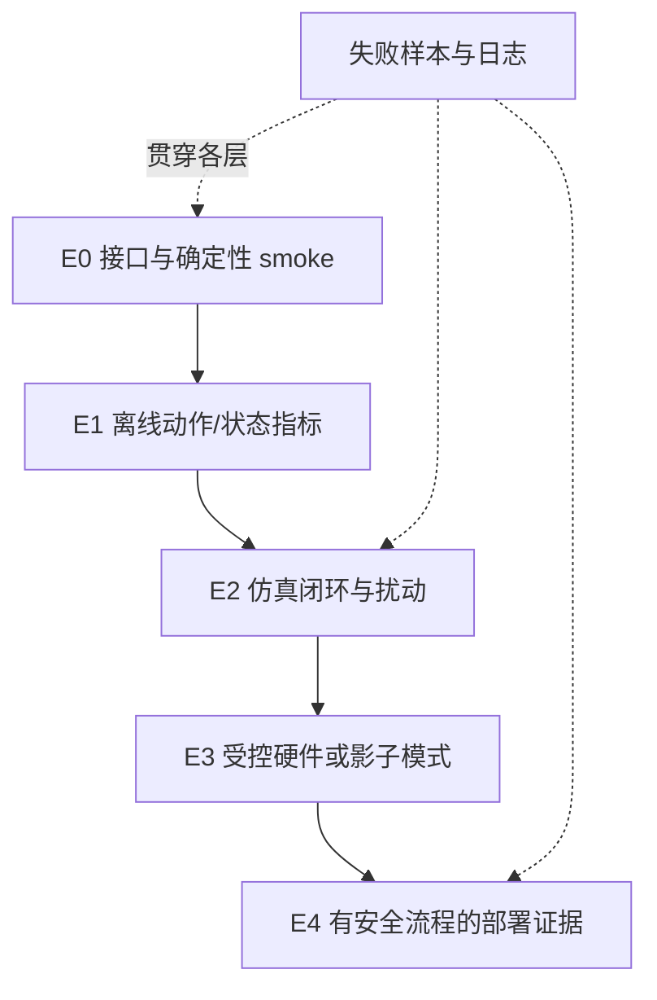

# 第20章 具身评测：从成功率到部署证据

> 状态：`reviewed`
> 资料核查日期：2026-09-01
> 关联实验：`EXP-20-01`
> 关联声明：`CLAIM-20-01`～`CLAIM-20-07`
> 关联图表：`FIG-20-01` / `TAB-20-01`
> 资源档位：S / M
> GPU 状态：不需要

## 本章契约

### 核心问题

当一个策略要在机器人或车辆闭环中执行时，如何把成功率、失败、安全、鲁棒性、时延和恢复组织成可比较、可审计且不越界的证据？

### 先修知识

- 已具备：第4章的数据与实验协议、第9章的用途驱动评测；
- 本章补齐：episode 分母、成功定义、分层指标、benchmark card 与部署证据阶梯；
- 不要求：3D 视觉、真实硬件、特定仿真器或 GPU。

第15、17、19章及本章已经完成批次交叉审查：action schema、model exploitation、仿真合同和闭环评测的边界已对齐。`reviewed` 仍只覆盖正文与 S 档 fixture，不表示真实策略、仿真器或硬件已复现。

### 非目标

- 不把不同任务集、初始化、成功判据的百分比直接排行；
- 不把固定表格 smoke 当成任何模型或 benchmark 的性能；
- 不用仿真成功替代真实部署安全证据；
- 不要求购买机器人、车辆或 GPU。

### 学完后的可验证产出

读者应能拆解一个成功率的分子和分母，建立任务/场景分桶，运行协议差异审计，并编写同时包含效用、安全、效率和失败样本索引的 benchmark card。

## 20.1 成功率不是一个自解释数字

对 `N` 个 episode，最朴素的成功率是：

\[
\hat{p}=\frac{1}{N}\sum_{i=1}^{N}\mathbb{1}[\text{success}_i].
\]

但 `success_i` 取决于目标容差、保持时间、碰撞、人工接管、超时、重试、初始状态和任务版本。`N` 也可能是任务数、episode 数、有效运行数或过滤后的样本数。没有这些字段，两个同名成功率不具可比性。

`CLAIM-20-01`（recommendation）：发布成功率时必须同时给出任务总体、初始化、成功/失败定义、超时、重试、有效分母和逐任务结果；无效运行、缺失运行和人工剔除必须单列原因。任何关键字段缺失时，只能发布不完整的描述性结果，不能给出代表完整评测的汇总标题数字。

对小样本，单点比例尤其不稳定。应报告每任务重复数和区间估计；当 episode 存在共享场景、种子或轨迹前缀时，不能假设所有样本独立。跨任务宏平均与按 episode 微平均回答不同问题，也不应只保留更好看的一个。

### 20.1.1 给二项成功率加一个可解释的区间

当每个 episode 只有成功/失败两种结果，且暂时把 episode 视为独立同分布的 Bernoulli 试验时，可以用 Wilson score interval 表达有限样本的不确定性。令成功数为 `k`、样本数为 `n`、点估计为 `p_hat=k/n`，区间中心与半宽为：

\[
c=\frac{\hat p+z^2/(2n)}{1+z^2/n},\qquad
m=\frac{z\sqrt{\hat p(1-\hat p)/n+z^2/(4n^2)}}{1+z^2/n}.
\]

95% 区间取 `z≈1.96`，端点是 `c-m` 与 `c+m`。它比直接使用 `p_hat ± 1.96 sqrt(p_hat(1-p_hat)/n)` 的 Wald 区间更适合小样本和接近 0/1 的比例；后者甚至会在 `4/4` 时给出零宽区间。NIST 的二项比例指南也建议小样本优先考虑 Wilson 或 Agresti–Coull，而不是标准 Wald 区间。

但区间成立有前提：如果多次运行共享同一场景、初始轨迹或随机种子，名义上的 `n` 可能高估有效样本量。此时应按场景/任务分层报告，或对独立采样单元做 cluster bootstrap。置信区间只量化固定协议下的抽样不确定性，不能修复任务总体、成功定义或分母不同造成的不可比性。

## 20.2 从模型分数到证据阶梯

具身系统由数据、感知、策略、执行器、仿真和安全层共同组成。一次失败可能来自坐标变换、延迟、动作限幅或重置脚本，而不是策略权重。评测应逐级增加真实性，同时保留底层诊断。



*FIG-20-01：部署证据阶梯。较高层不能抹去较低层的接口诊断；每层都要保留失败样本。来源：本书原创，MIT，2026-08-31。*

- **E0**：shape、时间戳、动作单位、重置和确定性；
- **E1**：离线动作误差、状态预测、校准和 OOD 拒绝；
- **E2**：闭环成功、碰撞、扰动恢复、时延和场景覆盖；
- **E3**：受控硬件、回放/影子模式、人工接管和故障注入；
- **E4**：限定运行设计域中的长期事件率与安全流程。

本书默认做到 E0/E1 和可用时的通用仿真 E2；E3/E4 不是完成本书的要求。

## 20.3 指标组合：效用、安全、效率、恢复

单一成功率会把截然不同的失败压成一个比特。最低指标矩阵应包含：

| 维度 | 机器人示例 | 自动驾驶示例 | 必须分桶 |
| --- | --- | --- | --- |
| 任务效用 | 成功率、子目标进度 | 路线完成率、任务完成 | 任务、难度、初态 |
| 安全 | 碰撞、掉落、力限 | 碰撞、越界、违规 | 对象/道路使用者、严重度 |
| 人工介入 | 接管、急停 | 接管、最小风险停车 | 原因与触发层 |
| 效率 | 步数、时间、能耗 | 行程时间、算力、能耗 | 成功与失败分别统计 |
| 平滑舒适 | 动作变化、峰值力 | jerk、急刹、横向加速度 | 场景与速度段 |
| 恢复 | 扰动后恢复率/时间 | 传感器故障与切入恢复 | 扰动类型和强度 |

失败 episode 不能从效率均值里无声删除。若只在成功样本上统计完成时间，必须同时报告失败数、超时和截断规则。安全指标要给事件计数与暴露量，例如每 100 episode、每小时或每公里，而不仅是百分比。

## 20.4 benchmark 不是一个名字

使用 LIBERO、SimplerEnv、RoboCasa、MetaDrive 或 CARLA 时，名称只是入口。可复现实验还需要锁定仓库 commit、任务 suite、资产、控制器、观测、初始化、随机种子、仿真频率、终止条件、渲染模式和依赖。

[LIBERO 官方仓库](https://github.com/Lifelong-Robot-Learning/LIBERO) 当前说明其包含四个 suite、共 130 个任务，并提供稀疏成功信号和固定初始状态文件；代码为 MIT，数据集标注为 CC BY 4.0。这些是 2026-09-01 查阅官方仓库得到的 `[O,R1]` 事实，本书尚未安装或运行。版本变化后必须重新核验，不能仅凭名称比较在线数字。

[SimplerEnv 官方仓库](https://github.com/simpler-env/SimplerEnv)把仿真定位为真机评测的补充而非替代，提供 Visual Matching 与 Variant Aggregation 两类 real-to-sim 设置，并用 MMRV 与 Pearson correlation 检查仿真排序是否对应真实表现。这里的关键不是“相关性高”这一口号，而是相关性本身也需要在具名任务、策略集合和真机参照上重新估计；换一批 policy 或任务，结论不能自动继承。

2025 年的 [RoboArena](https://arxiv.org/abs/2506.18123)选择另一条路线：跨七个机构在 DROID 平台上执行 600 余次真实机器人两两比较，评测者可选择本地任务与环境，但使用 double-blind policy pair，再聚合偏好得到排序。这表明扩大真实性并不等于强行统一全部场景；也可以冻结配对、盲法、评测者和聚合模型，把站点差异作为分层因素。arXiv 元数据截至核查日未列出已接收场次，因此论文按 `[A,R0]`，不能因其同时有官方项目页就把论文成熟度写成 `[O]`；本书没有连接其评测网络。

本书默认通用仿真选择为：机器人动力学优先 MuJoCo 或已有官方评测接口的轻量任务环境；驾驶闭环优先 MetaDrive，CARLA 作为高保真扩展。第19章已锁定这一分工；它们均不是完成 S 档正文的前提。

## 20.5 EXP-20-01：同一结果表，四格协议

固定 fixture 有 8 个有效 episode：4 个 easy、4 个 hard；其中包含目标未达、到达后碰撞、到达但人工介入等情况。`hard-2` 是达到时间上限的有效 `truncated` episode：它没有完成任务，仍作为失败留在完整协议分母中。假想模型和原始结果完全不变，只在两个预先定义的因素上切换评测设置：任务总体为 `easy/full`，成功定义为 `goal-only/safety-aware`。

- `easy_goal_only`：仅 easy，达到目标即成功；
- `easy_safety_aware`：仅 easy，达到目标且无碰撞、无介入；
- `full_goal_only`：完整任务，达到目标即成功；
- `full_safety_aware`：完整任务，达到目标且无碰撞、无介入。

```bash
make ch20-test-local
make ch20-smoke-local
make ch20-smoke
```

| 任务总体 | 成功定义 | 成功数/episode | 成功率 | Wilson 95% 区间 | 碰撞率 | 介入率 |
| --- | --- | ---: | ---: | ---: | ---: | ---: |
| easy | goal-only | 4/4 | 100.0% | [51.0%, 100.0%] | 0.0% | 0.0% |
| easy | safety-aware | 4/4 | 100.0% | [51.0%, 100.0%] | 0.0% | 0.0% |
| full | goal-only | 7/8 | 87.5% | [52.9%, 97.8%] | 12.5% | 12.5% |
| full | safety-aware | 5/8 | 62.5% | [30.6%, 86.3%] | 12.5% | 12.5% |

*TAB-20-01：`EXP-20-01` 固定 episode 表的协议敏感性。不是模型 benchmark。*

首尾协议的审计器标记三项不可比诊断：`task_population_differs`、`success_definition_differs`、`denominator_differs`。它们不是三个统计独立或可相加的“原因”：这里分母变化由任务选择直接引起，任务总体与成功规则还会交互。

`CLAIM-20-02`（result）：在 `EXP-20-01` 的固定结果表上，仅改变任务总体、成功定义和分母，报告成功率就从 100% 变为 62.5%。这证明脱离协议的数字比较可以失真，不估计真实 benchmark 中差异的大小。

`CLAIM-20-05`（result）：同一 fixture 中，`4/4` 的 Wilson 95% 区间为 `[0.510109, 1.0]`，`5/8` 为 `[0.305742, 0.863156]`。区间揭示两组点估计都很不确定，但不能把两个不同协议变成可比较实验。

四格反事实把混杂进一步展开：在 goal-only 下从 easy 换到 full，成功率变化 `-12.5` 个百分点；在 safety-aware 下同一总体变化是 `-37.5` 个百分点。安全规则在 easy 上变化 `0`，在 full 上变化 `-25` 个百分点，difference-in-differences interaction 为 `-25` 个百分点。这些是固定表格的算术差，不是总体效应估计。

`CLAIM-20-07`（result）：`EXP-20-01` v4 的 2×2 协议格证明，同一个 protocol warning 的数值影响依赖另一个协议因素；因此首尾成功率差不能被唯一归因给任务总体、安全定义或分母。要解释归因，必须预先设计共同总体上的反事实或配对比较。

聚合产物同时报告 `attempted_count`、`valid_episode_count`、`terminated_episode_count`、`truncated_episode_count` 与 `invalid_episode_count`。完整协议是 `8 attempted / 8 valid / 7 terminated / 1 truncated / 0 invalid`；截断没有被误当技术坏样本删除，因此成功率仍为 `5/8`。同一步若同时 natural terminal 与 timeout，会分别进入两个结束原因计数，但 attempted 分母只增加一次；value bootstrap 仍按第4、8章由 `terminated` 关闭。fixture 另有反例注入 `reset_failed`：审计器会保留无效 episode ID 和原因，并阻止生成聚合比例。

`CLAIM-20-06`（result）：`EXP-20-01` v4 验证了两条分母规则：有效 timeout 截断仍进入预先定义的 episode 分母；技术无效运行必须具名报告并使当前聚合失败，不能在计算后静默删除。这个合同不规定所有 benchmark 必须采用同一重跑政策；它要求重跑、替换或排除政策在运行前冻结。

## 20.6 benchmark card 的最小字段

每次结果发布至少保存：

```text
系统：模型/checkpoint/代码 commit/推理配置
任务：benchmark commit、suite、任务与资产版本
观测与动作：模态、坐标系、频率、控制器、限幅
协议：初态、种子、episode 数、重试、超时、终止
成功：分子条件、碰撞/介入是否判失败、有效分母
指标：实现、单位、宏/微平均、区间与逐任务表
资源：容器、CPU/GPU、时延、内存/显存、磁盘/下载
安全：独立安全层、接管、拒绝、故障注入
证据：原始 episode 表、日志、失败视频索引、缺失项
许可：代码、模型、数据、资产和录屏的各自许可
```

`CLAIM-20-03`（recommendation）：若 benchmark card 的任务、成功定义或分母不同，应先标记“不可直接比较”，再决定是否能通过重算得到共同协议，而不是直接排序。

上述字段已经映射到 `specs/benchmark-card.schema.json`。`benchmarks/BENCH-20-01.json` v4 冻结本章四种具名协议、完整八行分母、结束标志、无效运行政策、成功判据、Wilson 95% 区间假设和不可比因素；它还明确将 hard suite 的加入视为任务总体变化，而不是 OOD score 实验。严格验证可以发现缺字段、错误章节引用和产物漂移，但不能让这八个手工 episode 变成真实 benchmark 样本。

### 20.6.1 防止 checkpoint 与评测者泄漏

评测任务被反复用于选 checkpoint、调 prompt、改 action adapter 或挑视频后，它就不再是未见测试集。应至少区分开发集、模型选择集和一次性最终集，记录每个 checkpoint 接触过哪些任务与失败视频。仿真资产、初始状态和语言模板也属于可泄漏信息；仅隐藏 task name 不足以阻止对固定场景过拟合。

真机人工判定还需冻结盲法、裁决手册和争议处理。若评测者知道策略身份，或能从动作风格猜出模型，应记录这一限制；能配对时优先使用同一任务/初态上的随机顺序或 double-blind 比较。闭源 API 基线还要保存模型快照、请求参数、日期、失败重试和费用，因为同一产品名下的服务行为可能漂移。

视频最好保存索引和必要片段，而非只挑成功 demo。索引应包含 episode ID、任务、种子、结果、失败类别、日志路径和许可状态；涉及人员、家庭或道路数据时先做隐私与发布审查。

## 20.7 自动驾驶：路线完成不能吞掉安全

驾驶闭环至少同时报告路线完成、碰撞、违规、人工接管、超时、舒适性和计算时延。到达终点后发生碰撞的 episode，若协议只看 `goal_reached` 会被算作成功；`EXP-20-01` 刻意保留这个反例。

[CARLA Leaderboard 2.1 官方评测页](https://leaderboard.carla.org/evaluation_v2_1/)给出的 route-level driving score 是路线完成率与 infraction penalty 的乘积，但 global driving score 是各 route driving score 的算术平均，并不等于两个 global 均值之积；碰撞等全局事件另按每公里报告。更值得注意的是 2.1 的 infraction penalty 公式已不同于 2.0，因此引用“CARLA 分数”时必须锁定 leaderboard 版本、track、route set 和 scorer commit，不能只写 simulator 版本。

`CLAIM-20-04`（inference）：自动驾驶的成功定义若不把碰撞和安全接管纳入，路线完成率可能高估系统可用性；但仿真碰撞率仍不能直接外推真实道路事件率。

驾驶指标必须按道路类型、天气、交通密度、弱势道路使用者和事件严重度分桶。还要记录每公里/每小时暴露量、仿真步长、交通参与者策略、传感器故障和最小风险停车。闭环模型输出不得绕过碰撞检查、道路边界、控制限幅和超时降级。

## 20.8 统计、鲁棒性与停止规则

评测前先固定最小 episode 数、种子和停止条件，避免看到好结果就停止。建议保留逐 episode 表，并通过按任务或场景的分层 bootstrap 估计区间；对稀有安全事件，零次观察不等于风险为零。

先确定独立采样单元，再选择区间。多次 retry、同一对象位姿的相邻种子、同一路线天气变体通常不是完全独立 episode；应把共享的 task、scene、route 或 evaluator 当作 cluster，在 cluster 层重采样。比较两个策略时，若它们运行在相同初态/路线，保留配对并对逐对差值做区间通常比拆成两个独立比例更有效。若某些 task 拥有更多 episode，micro average 会让其权重更大，macro average 则让每个 task 权重相同；两者都可报告，但任务为空、无效运行和权重规则必须预先冻结。

不要把置信区间误用成发布门槛的唯一证据。区间覆盖抽样不确定性，不覆盖 scorer bug、协议泄漏、sim-to-real gap、未观测危险类型或自适应停止。多 checkpoint、多任务和多指标筛选还会产生选择偏差；最终集应在选择完成后只运行一次，探索性分析与确认性结论分开标记。

鲁棒性测试一次只改变可解释因素：光照、遮挡、纹理、质量、相机位姿、动力学、控制延迟或语言改写。组合扰动用于最终压力测试，但必须保留单因素结果以定位失败。恢复指标要区分“最终成功”和“在安全时间窗内恢复”。

停止评测的工程条件包括接口错位、重置失败率过高、缺失 episode、日志与视频无法关联、协议字段不完整或安全层未启用。此时应标记无效运行，而不是计算一个表面完整的均值。

## 20.9 结果、资源与边界

| 类型 | 声明/结果 | 来源 | 状态 | 限制 |
| --- | --- | --- | --- | --- |
| 本书结果 | 同一表在两协议下为 100% 与 62.5% | `EXP-20-01` | CPU smoke | 手工 8 episode |
| 本书结果 | 四格协议存在 `-25` 个百分点 interaction | `EXP-20-01` | CPU smoke | 协议算术反事实，不是总体因果效应 |
| 本书结果 | 小样本成功率的 Wilson 95% 区间 | `EXP-20-01` | CPU smoke | 假定独立 Bernoulli，不能修复协议差异 |
| 官方事实 | LIBERO 官方仓库描述 4 suite、130 任务 | 官方仓库 | `[O,R1]` | 本书未运行 |
| 未验证 | 通用仿真上的策略成功与鲁棒性 | 后续 M 档 | planned | 环境角色已锁定，尚未安装或运行 |

S 档只用 Python 标准库，下载 0、GPU 0、无外部资产，fixture 按 MIT 发布。M 档仿真执行前另行核验镜像、依赖、数据和资产许可；默认不要求真实硬件，也不因当前机器无 GPU 而伪造运行结果。

## 小结

具身评测不是计算一个成功率，而是定义任务总体、成功与失败、独立采样单元、暴露量、分层指标和证据等级。只有当系统、任务和协议足够一致时，数字才可比较；诊断 warning 不能直接当作可加的因果贡献，仿真闭环也不是部署安全的替代物。

## 练习

1. **概念判断**：模型 A 为 90%/20 episodes，模型 B 为 80%/200 episodes，能否只按点估计选择 A？
2. **代码实验**：为 `EXP-20-01` 增加“允许一次重试”协议，分别计算 per-attempt 与 best-of-two estimand，说明分母和部署语义如何变化。
3. **卡片审计**：从一篇策略论文提取 benchmark card 字段，并列出不能确定的项目。
4. **自动驾驶迁移**：设计一套同时防止“慢而安全”和“快而危险”垄断总分的指标表。

## 延伸阅读

- [LIBERO 官方仓库](https://github.com/Lifelong-Robot-Learning/LIBERO)，`[O,R1]`，终身机器人学习 benchmark；
- NIST, [Binomial Proportion](https://itl.nist.gov/div898/handbook/prc/section2/prc241.htm)，`[O]`，Wilson/Agresti–Coull 小样本区间建议；
- [SimplerEnv 官方项目](https://simpler-env.github.io/)，`[O,R0]`，真实到仿真的策略评测案例，尚未运行；
- Atreya et al., [RoboArena](https://arxiv.org/abs/2506.18123)，`[A,R0]`，分布式 double-blind 真机两两评测，尚未连接；
- [RoboCasa 官方项目](https://robocasa.ai/)，`[O,R0]`，日常任务仿真环境，尚未运行；
- [MetaDrive 官方文档](https://metadriverse.github.io/metadrive/)，`[O,R0]`，第19章已锁定为驾驶默认闭环环境，当前尚未运行；
- [CARLA Leaderboard 2.1 评测规则](https://leaderboard.carla.org/evaluation_v2_1/)，`[O,R0]`，路线得分、违规与按公里事件；高保真扩展，非默认必需路径。

## 下一章接口

第21章把评测字段连接到实时性、故障监测和最小风险动作。本章的时延分位数、接管、失败日志和安全定义成为部署门禁；批次 D 已结合第17章 policy exploitation 与第19章 simulator gap 完成一致性核对。

## 验收与审查记录

```text
本地检查：make check-local
严格检查：make check
章节 smoke：make ch20-smoke
文档构建：make docs-build
```

- 内容审查：通过；
- 代码审查：通过；
- 一致性审查：通过；
- 教学审查：通过；
- 审查记录路径：`reviews/ch20-evaluation-validity-review-2026-09-01.md`、`reviews/fast-moving-source-audit-2026-09-01.md`；
- 已知限制：未运行 LIBERO、SimplerEnv、RoboArena、MetaDrive、CARLA 或真实硬件；Wilson 区间只覆盖独立二项比例，不替代分层/相关 episode 的统计设计；2×2 格只是协议算术反事实；无效运行反例只验证拒绝路径，没有估计真实 reset/logging 故障率。
