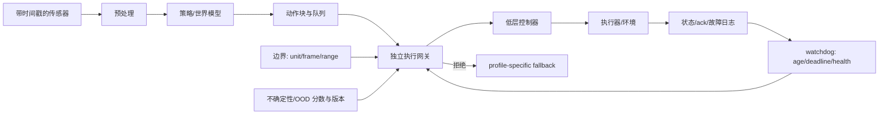

# 第21章 部署、实时性与安全边界

> 状态：`reviewed`
> 资料核查日期：2026-09-01
> 关联实验：`EXP-21-01`
> 关联声明：`CLAIM-21-01`～`CLAIM-21-10`
> 关联图表：`FIG-21-01` / `TAB-21-01` / `TAB-21-02`
> 资源档位：S / M / L1
> GPU 状态：待验证

## 本章契约

### 核心问题

一个离线或仿真中有效的模型，怎样才能在有频率、延迟、传感器陈旧、动作边界、不确定性和故障的系统里执行？平均推理速度为什么不能证明实时性？模型失败或承认不知道时，又该由谁选择降级行为？

### 先修知识

- 已具备：第15章动作 packet、第19章仿真/时序合同、第20章部署证据阶梯；
- 本章补齐：端到端 deadline、尾延迟、异步 action queue、watchdog、独立安全网关、最小风险行为和发布清单；
- 不要求：实时操作系统、ROS 2、CUDA、机器人/车辆、GPU 或安全认证经验。

### 非目标

- 不把 `EXP-21-01` 称为实时 benchmark、安全证明或认证；
- 不声称运行 ROS 2、LeRobot async/RTC、OpenVLA-OFT、Autoware 或任何硬件；
- 不把“停止”写成所有本体和场景都安全的通用 fallback；
- 不用单次平均延迟授权真实闭环执行。

### 学完后的可验证产出

读者应能分解一次控制周期，报告 mean/p95/p99/max 与 deadline miss，检查观测和 action chunk 新鲜度，解释 risk–coverage 取舍，设计有原因码的执行网关，并为具体本体写出降级与恢复合同。

## 21.1 实时不是“跑得快”，而是按时完成

设控制周期为 `T`，从曝光/采样到命令被执行的端到端年龄可分为：

\[
L_{e2e}=L_{sensor}+L_{transport}+L_{pre}+L_{infer}+L_{post}+L_{queue}+L_{actuator}.
\]

只测 `L_infer` 会漏掉图像解码、网络、排队、后处理和执行器。更重要的是，实时系统关心 deadline 是否被满足；一次 150 ms 卡顿不会因为其余五次很快而消失。

`CLAIM-21-01`（fact）：吞吐、单次推理延迟和端到端控制 deadline 是不同指标；部署记录必须包含测量边界、warm-up、并发、批量、输入尺寸、硬件、频率、尾分位和 deadline miss。

小样本的 p95/p99 很粗糙，仍应保留原始逐周期数据。正式测试要说明分位数定义，并报告 max、miss 连续长度和最坏时发生了什么。相同 miss rate 可能是一串连续超时，也可能是相隔很远的孤立超时；前者更可能耗尽 action queue 或触发 watchdog。平均 FPS 和单个 miss rate 都不能完整表达抖动、burst 与队列饥饿。

## 21.2 一次可审计的控制周期



*FIG-21-01：部署控制周期与独立网关。来源：本书原创，MIT，2026-09-01。fallback 是接口而非固定命令。*

每个动作 packet 至少携带：输入时间戳、生成时间、适用起始步、有效截止步、控制频率、单位/frame、归一化版本、动作范围、模型/checkpoint 和 trace ID。若系统依赖 uncertainty/OOD gate，还要携带分数、方向、估计器版本和校准协议版本。网关不需要理解语言，却必须拒绝旧观测、超时、NaN/Inf、越界、过期 chunk、非法不确定性字段和版本不兼容。

“不确定性分数为 0.8”不是自解释概率：不同 ensemble、energy、distance、conformal score 或 learned head 的方向与尺度可能相反。部署配置必须锁定产生分数的 artifact，并用独立校准集预注册阈值；若分数字段缺失、非有限、超范围或版本不匹配，应视为合同错误，而不是默认成高置信。

高层策略、低层控制与安全网关应分离。VLA 可以低频生成子目标或 action chunk，低层控制器高频跟踪；硬限位、碰撞检查、watchdog 和急停不应依赖同一个生成模型继续正常推理。

## 21.3 同步、异步与 RTC：延迟被搬到了哪里

同步推理在每个 tick 阻塞等待动作，语义简单但慢模型会让机器人停顿。异步 server/client 在执行当前 action chunk 时计算下一块；RTC 在后台生成并融合 chunk。它们减少等待，却新增三类状态：

1. 队列是否即将耗尽；
2. 新 chunk 使用的观测是否已经陈旧；
3. 新旧 chunk 重叠时如何对齐、融合或丢弃。

[LeRobot 官方文档](https://github.com/huggingface/lerobot/blob/main/docs/source/inference.mdx) 当前同时提供 sync 与 Real-Time Chunking，后台线程生成 chunk、主控制环轮询动作；其[异步推理指南](https://github.com/huggingface/lerobot/blob/main/docs/source/async.mdx)把 `actions_per_chunk`、queue threshold 和控制 FPS 暴露为调参项，并明确提示生产/消费速度失配会导致空队列 `[O,R1]`。这些是 2026-09-01 核验的上游接口，不是本书实测；文档中的设备内存和加速数字也不能直接移植到读者机器。

异步系统还必须冻结队列策略：FIFO 会保序但可能执行陈旧 chunk，latest-wins 会丢工作并改变动作连续性，重叠融合则要求 action index、观测版本和 prefix 对齐。队列“非空”只说明还有数值，不说明这些数值由足够新的观测生成；反过来，最新 chunk 已计算完成也不代表它在目标 start step 前到达。

`CLAIM-21-04`（recommendation）：异步推理必须同时监控 action queue 深度、观测年龄、chunk 起止步、网络/推理 latency 和连续 fallback 次数；“控制线程未阻塞”不能证明动作仍新鲜。

[OpenVLA-OFT 官方仓库](https://github.com/openvla/openvla) 报告连续动作和更快解码 `[O,R1]`，但“比基线快若干倍”不等于满足指定机器人端到端 deadline。部署前仍要用目标相机、预处理、网络、设备和控制器实测。

## 21.4 EXP-21-01：均值通过，控制周期仍超时

固定延迟为 `20, 22, 24, 26, 28, 150 ms`，deadline 为 50 ms。另用七个 packet 分别覆盖健康、旧观测、超时、非有限动作、越界、过期 chunk 和超过阈值的不确定性分数。

```bash
make ch21-test-local
make ch21-smoke-local
make ch21-smoke
```

| 延迟指标 | 固定结果 | 解释边界 |
| --- | ---: | --- |
| mean | 45 ms | 低于 50 ms deadline |
| nearest-rank p95 | 150 ms | 小样本尾部等于最大值 |
| nearest-rank p99 | 150 ms | 六个样本中仍等于最大值 |
| max | 150 ms | 有一个明确卡顿 |
| deadline miss rate | 1/6 = 16.6667% | 手工样本，不是设备事件率 |
| maximum consecutive misses | 1 | 只描述该固定顺序 |

*TAB-21-01：`EXP-21-01` 固定延迟。没有测量墙钟或调度器。*

`CLAIM-21-02`（result）：fixture 的 mean 为 45 ms，看似通过 50 ms deadline，但 p95/max 为 150 ms，六个周期中一个 miss。它只证明均值可能隐藏尾部失败。

| packet | 网关结果 | 原因 |
| --- | --- | --- |
| healthy | allow | — |
| stale | fallback | `stale_observation` |
| late | fallback | `deadline_miss` |
| non-finite | fallback | `invalid_action` |
| out-of-bounds | fallback | `action_out_of_bounds` |
| expired | fallback | `action_chunk_expired` |
| uncertain | fallback | `uncertainty_exceeds_limit` |

*TAB-21-02：七个固定 packet 的网关原因码。fallback 标签不是执行器命令。*

`CLAIM-21-03`（result）：七个 packet 中只有健康包通过，六种注入分别产生唯一原因码并进入 fallback。该结果验证网关实现，不估计真实系统故障率或安全性。

结果保存在 `results/ch21/EXP-21-01-smoke.json`；14 个单元测试还拒绝非法 config、非有限 latency、错误 percentile、非法 uncertainty score、不可能的 chunk 时间关系和含糊状态机配置。

### 21.4.1 不要只发布一个拒绝阈值

令 `u_i` 是“越大越不确定”的冻结分数，阈值 `τ` 下接受 `u_i≤τ` 的样本。选择性执行的 coverage 与接受样本风险为：

\[
C(\tau)=\frac{1}{N}\sum_i \mathbb{1}[u_i\le\tau],\qquad
R(\tau)=\frac{\sum_i \ell_i\mathbb{1}[u_i\le\tau]}{\sum_i\mathbb{1}[u_i\le\tau]}.
\]

分母为零时 `R(τ)` 未定义，不能写成“零风险”。`EXP-21-01` 用六个手工 `(score, failure)` 对展示两个工作点：

| 阈值 | coverage | 接受样本 failure rate | 拒绝捕获的 failure 比例 |
| ---: | ---: | ---: | ---: |
| 0.5 | 50.0% | 0.0% | 100.0% |
| 0.7 | 66.6667% | 25.0% | 66.6667% |

严格阈值在这个刻意排序的 fixture 中降低风险，但这不是一般保证。真实分数可能排序错误、在 OOD 下失准或共同漏掉危险样本。应在 calibration split 选阈值，在锁定的 test/shift/stress split 报告整条 risk–coverage 曲线、关键工作点、拒绝原因和 fallback 后果；不能在测试集上挑最好阈值后回报同一数字。

`CLAIM-21-07`（result）：固定选择性执行 fixture 中，把阈值从 `0.5` 放宽到 `0.7`，coverage 从 `0.5` 增至 `0.666667`，接受样本 failure rate 从 `0` 增至 `0.25`，拒绝捕获的 failure 比例从 `1.0` 降至 `0.666667`。它只验证指标语义，不是 estimator 性能。

`CLAIM-21-08`（recommendation）：任何 uncertainty/OOD 执行门都应锁定分数定义、方向、估计器与校准版本，在独立 split 上报告 risk–coverage 和 fallback 后果；单个阈值、AUROC 或“高置信”标签不能单独授权动作。

### 21.4.2 相同 miss rate，不同故障形状

fixture 另构造两组六周期序列：`20,80,80,20,20,20 ms` 与 `20,80,20,80,20,20 ms`。两者 mean 都是 `40 ms`，deadline miss 都是 `2/6`，p95/p99/max 都是 `80 ms`；唯一变化是连续 miss 最大长度分别为 `2` 和 `1`。

`CLAIM-21-09`（result）：`EXP-21-01` v3 的 burst/scattered 对照证明 mean、尾分位、max 和 miss rate 完全相同时，连续 deadline miss 长度仍可不同。该结果只验证日志字段必要性，不估计真实调度 burst。

### 21.4.3 异步队列：有 action 也可能不可执行

离散八步 schedule 使用三个 chunk，`valid_until_step` 采用 exclusive 语义，允许晚到 chunk 只覆盖剩余有效步。最大观测滞后为两步：第 4 步仍有 `chunk-b`，但它来自第 1 步观测，因 `stale_chunk` 拒绝；第 5 步 `chunk-c` 尚未到达，因 `queue_underflow` 降级。最终 6 步执行 policy action、2 步 fallback，且有一个 chunk 晚于目标 start step 到达。

这不是 LeRobot 或网络复现，而是把正文的两个失败状态变成机器合同。真实实现还要报告 queue depth trace、生产/消费速率、乱序/重复/丢包、融合规则、clock domain 与 action acknowledgement。

## 21.5 fallback 不是一个万能的零向量

机械臂“保持位置”可能在夹持重物时过热，在接触任务中继续施力；移动底盘急停可能打滑；车辆在弯道冻结转向再制动可能偏离车道。fallback 应由 hazard analysis、当前状态、可用子系统和运行设计域决定。

`CLAIM-21-05`（recommendation）：网关只选择经过系统定义的降级模式，例如 hold、controlled stop、退回安全位、请求人工或 minimum-risk maneuver；模式必须有进入条件、独立控制器、完成/失败条件和恢复规则，不能由语言模型临时生成。

至少区分：传感器旧但低层控制健康、策略超时、动作非法、定位丢失、通信中断、执行器故障和安全层自身故障。不同原因可能需要不同降级，连续失败还应升级而非无限重试。

进入 fallback 不等于安全状态已经达成。状态机要区分 `requested/operating/succeeded/failed`，并监控降级控制器自身的 heartbeat、deadline 和完成条件。恢复也不能只凭下一包健康就立刻重新授权高层策略；需要规定连续健康窗口、状态重同步、队列清空、人工确认或其他 profile-specific 条件。

`EXP-21-01` 的通用状态机先正常执行，随后三次连续拒绝：前两次选择 `controlled_stop`，第三次升级为 `request_operator`。升级后第一次健康仍保持请求人工，第二次连续健康才恢复 `policy_action`。阈值和模式只是教学配置，不是任何本体的推荐安全参数。

`CLAIM-21-10`（result）：固定六步状态序列验证了“连续三次失败升级、连续两次健康恢复”的迟滞合同，避免一次瞬时健康造成 mode flapping。它不证明 controlled stop 已完成、operator 可用或恢复动作安全。

## 21.6 ROS 2 与通信合同：QoS 不是安全证明

[ROS 2 QoS 官方概念](https://docs.ros.org/en/rolling/Concepts/Intermediate/About-Quality-of-Service-Settings.html)提供 history、depth、reliability、durability、deadline、lifespan 和 liveliness 等策略 `[O,R1]`。传感器可偏向 best effort/小队列以避免旧帧堆积，关键状态可能要求 reliability；具体取舍必须测网络和丢包。[ROS 2 实时系统设计说明](https://design.ros2.org/articles/realtime_background.html)进一步强调 page fault、运行时动态分配和无限阻塞同步原语会破坏确定性；因此“节点运行在 ROS 2”与“控制路径满足实时约束”不是同一声明。

QoS deadline 能报告数据未按期到达，但不会证明 callback、模型和执行器按时完成。实时执行还涉及内存锁定、优先级、动态分配、阻塞 I/O 和 executor 抖动。普通 Docker smoke 只能检查接口，不能验证调度确定性。

## 21.7 模型发布与数值回归

部署 artifact 不只是权重：还包括 tokenizer、预处理/后处理、归一化统计、动作 schema、runtime、算子、精度、校准集和安全配置。FP16/INT8、编译图、CUDA graph 或新后端可能改变输出与不确定性。

至少建立以下门：

- golden inputs 的输出差异和动作边界；
- closed-loop replay/仿真回归，而非只看 cosine similarity；
- cold start、warm-up、steady state 和长时内存；
- 不同 batch/分辨率/并发下的 p50/p95/p99/max；
- crash、OOM、设备重置、网络断开和模型热更新；
- 版本回滚、日志 schema、隐私和供应链清单。

优化后精度略有差异不必然失败，但阈值必须在运行前定义，并与任务和安全后果关联。

## 21.8 自动驾驶正文：最小风险动作依赖道路状态

驾驶系统要分别监控传感器 age、定位健康、规划轨迹 age、控制命令 age、车辆反馈、计算 deadline 和通信 liveliness。高层 world model/VLA 的轨迹不得绕过车辆动力学、道路边界、碰撞检查和 command gate。

[Autoware Universe](https://github.com/autowarefoundation/autoware_universe)包含 operation mode、command gate、diagnostics 和 minimum-risk maneuver 相关组件 `[O,R1]`。当前官方 operation-mode 文档明确区分 Autonomous、Local、Remote、Stop 与 `In Transition`，并在完成切换前保留原控制责任；command-mode 文档又区分 emergency stop、comfortable stop 与尚未支持的 pull over。这个结构支持本章的核心边界：模式请求、过渡责任、可用性和完成确认是不同状态，不能把一个 `fallback` 字符串当作 MRM 已成功。

`CLAIM-21-06`（recommendation）：自动驾驶降级应按故障可用性选择减速、保持车道、受控停车、靠边、远程/人工接管或其他 MRM，并在直道、弯道、低附着、密集交通和传感器组合故障中闭环验证；不得用单一零控制向量代表安全。

实际道路安全、法规和认证属于高风险专业工作。本书给的是研究与工程证据结构，不替代 ISO 26262、ISO 21448、网络安全、当地法规或组织安全流程。

## 21.9 资源路线与证据边界

- **S**：本章标准库 fixture，CPU、零下载、无模型/网络/硬件；
- **M**：Docker 中做 recorded replay、故障注入、CPU/可用设备 latency 和队列压力测试，不要求购买硬件；
- **L1**：目标为 24 GB 单卡内的实际策略 runtime、量化/编译回归和仿真闭环；显存、功耗、时延必须实测。

远程 2×80 GB 只能用于可选大模型或并行仿真，不能证明边缘端 deadline。训练硬件与部署硬件必须分别报告。当前设备无 GPU，因此 L1 及所有真实时延结论保持 `pending`。

| 证据 | 当前状态 | 不能外推 |
| --- | --- | --- |
| packet gate、固定 latency/burst 与离散异步 schedule | CPU smoke | 实时调度、网络、安全或可靠性 |
| fallback 升级/恢复状态机 | CPU 布尔序列 | 降级控制器可达性、完成性或安全性 |
| uncertainty gate 与 risk–coverage | CPU 手工分数/标签 | 校准质量、OOD 检出或安全性 |
| LeRobot/OpenVLA/ROS 2/Autoware 能力 | 官方资料 | 本书已运行或满足 deadline |
| 目标设备 latency/故障注入 | planned | 未执行前不得写数字 |

## 小结

部署把模型问题变成时序和系统问题。必须测端到端年龄、尾延迟、deadline miss 与连续 burst，异步 action chunk 还要管理队列、新鲜度和晚到语义。不确定性门需要版本化分数、独立校准和 risk–coverage 证据。独立网关拒绝旧、迟、非法、过期或超过预注册阈值的动作；降级模式由具体本体和场景定义，并具有升级、完成与迟滞恢复合同，而不是一个万能零向量。

## 练习

1. **延迟预算**：为 20 Hz 控制环给传感、预处理、推理、队列和执行器分配预算，并说明超预算策略。
2. **代码实验**：修改 `EXP-21-01` 的恢复窗口，构造一次健康脉冲导致 mode flapping 的反例。
3. **异步审计**：设计 action queue 快耗尽、网络乱序和新 chunk 晚到的三个测试。
4. **自动驾驶迁移**：比较直道与弯道定位故障时的最小风险动作，列出闭环验收指标。
5. **选择性执行**：给 fixture 增加一个低分失败样本，观察 risk–coverage 曲线为何会暴露分数排序错误。

## 延伸阅读

- [LeRobot inference 与 RTC 文档](https://github.com/huggingface/lerobot/blob/main/docs/source/inference.mdx)，`[O,R1]`；
- [LeRobot async inference 文档](https://github.com/huggingface/lerobot/blob/main/docs/source/async.mdx)，`[O,R1]`；
- [OpenVLA 官方仓库](https://github.com/openvla/openvla)，`[O,R1]`；
- [ROS 2 QoS 官方说明](https://docs.ros.org/en/rolling/Concepts/Intermediate/About-Quality-of-Service-Settings.html)，`[O,R1]`；
- [ROS 2 实时系统设计说明](https://design.ros2.org/articles/realtime_background.html)，`[O,R1]`，deadline、确定性执行和实时路径约束；
- [Autoware Universe 官方仓库](https://github.com/autowarefoundation/autoware_universe)，`[O,R1]`；
- [Autoware operation mode transition manager](https://autowarefoundation.github.io/autoware_universe/main/control/autoware_operation_mode_transition_manager/)，`[O,R1]`，模式过渡责任与完成检查；
- [Autoware command mode types](https://autowarefoundation.github.io/autoware_universe/main/system/autoware_command_mode_types/)，`[O,R1]`，operation mode 与多种 MRM source；
- Geifman & El-Yaniv, [Selective Classification for Deep Neural Networks](https://arxiv.org/abs/1705.08500)，`[P]`，risk–coverage 与拒绝选项基础；
- Traub et al., [Overcoming Common Flaws in the Evaluation of Selective Classification Systems](https://arxiv.org/abs/2407.01032)，`[P]`，多阈值评测和未检出失败风险。

## 下一章接口

第22章将把数据、模型、策略、仿真、评测和本章部署 gate 组合成一个可审计综合项目。每个项目必须展示至少一种失败注入和恢复，而不是只交成功 demo。

## 验收与审查记录

```text
本地检查：make check-local
严格检查：make check
章节 smoke：make ch21-smoke
文档构建：make docs-build
```

- 内容审查：通过；
- 代码审查：通过；
- 一致性审查：通过；
- 教学审查：通过；
- 审查记录路径：`reviews/ch21-runtime-fallback-review-2026-09-01.md`；
- 已知限制：没有测量真实墙钟、调度器、网络、模型、uncertainty estimator、ROS、机器人、车辆或 GPU；异步 schedule 与状态机均为离散合同，不验证执行器可达性、MRM 完成或安全认证。
