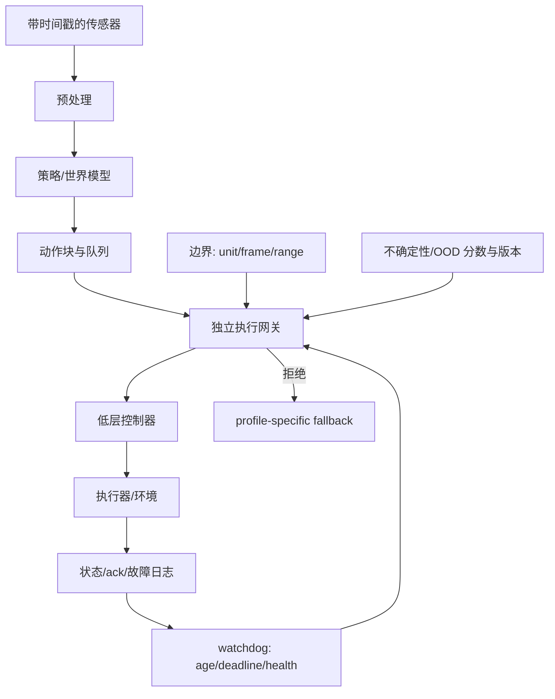
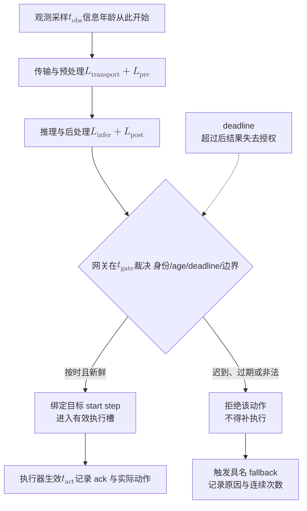

# 第21章 部署、实时性与安全边界

## 本章契约

### 核心问题

一个离线或仿真中有效的模型，怎样才能在有频率、延迟、传感器陈旧、动作边界、不确定性和故障的系统里执行？平均推理速度为什么不能证明实时性？模型失败或承认不知道时，又该由谁选择降级行为？

### 先修知识

- 已具备：第15章动作 packet、第19章仿真/时序合同、第20章部署证据阶梯；
- 本章补齐：端到端 deadline、尾延迟、异步 action queue、watchdog、独立安全网关、最小风险行为和发布清单；
- 不要求：实时操作系统、ROS 2、CUDA、机器人/车辆、GPU 或安全认证经验。

### 非目标

- 不把 实验 21-1<!-- INTERNAL_ASSET_ID: EXP-21-01 --> 称为实时 benchmark、安全证明或认证；
- 不声称运行 ROS 2、LeRobot async/RTC、OpenVLA-OFT、Autoware 或任何硬件；
- 不把“停止”写成所有本体和场景都安全的通用 fallback；
- 不用单次平均延迟授权真实闭环执行。

### 学完后的可验证产出

读者应能把实时性理解为时序正确性，区分响应时间、数据年龄、吞吐、抖动与连续超时，并分析异步队列在稳态和突发负载下何时失稳。读者还应能把故障检测、隔离、控制权转移、最小风险行为和恢复授权组织成完整生命周期，而不是把 fallback 简化为一个动作值。

### 本章的两层阅读方式

主线只回答两个问题：一条动作为什么仍被允许在此刻执行，以及高层策略失效后谁负责把系统带到可确认的安全状态。第一次阅读可依次抓住21.1–21.3的时间语义、21.5的具名 fallback、21.8的完整故障生命周期，再回看21.4中的固定反例。

21.4.1–21.4.6把端点、重试、阈值、严重度、连续超时和异步队列分别拆开；21.5.1–21.5.2进一步讨论 fallback 完成与重新激活授权。它们属于深入接口审计，不是部署教程或认证规范。读者无需记忆字段名，但应保留三条边界：生成不等于执行，发出 fallback 请求不等于进入安全状态，一次旧授权不能自动复用于下一次故障。

## 21.1 实时不是“跑得快”，而是按时完成

设控制周期为 `T`，从曝光/采样到命令被执行的端到端年龄可分为：

\[
L_{e2e}=L_{sensor}+L_{transport}+L_{pre}+L_{infer}+L_{post}+L_{queue}+L_{actuator}.
\]

只测 $L_{\text{infer}}$ 会漏掉图像解码、网络、排队、后处理和执行器。更重要的是，实时系统关心 deadline 是否被满足；一次 150 ms 卡顿不会因为其余五次很快而消失。

<!-- CLAIM_META: CLAIM-21-01 recommendation -->
吞吐、单次推理延迟和端到端控制 deadline 应作为不同指标报告；部署记录至少应包含测量边界、warm-up、并发、批量、输入尺寸、硬件、频率、尾分位和 deadline miss。

小样本的 p95/p99 很粗糙，仍应保留原始逐周期数据。正式测试要说明分位数定义，并报告 max、miss 连续长度和最坏时发生了什么。相同 miss rate 可能是一串连续超时，也可能是相隔很远的孤立超时；前者更可能耗尽 action queue 或触发 watchdog。平均 FPS 和单个 miss rate 都不能完整表达抖动、burst 与队列饥饿。

### 21.1.1 响应时间与信息年龄不是一个量

响应时间描述一次请求从进入计算到返回用了多久，信息年龄描述动作执行时所依据的观测距离当前有多久。一个请求可以很快完成，却基于排队已久的旧帧；也可以计算较慢，但使用最新观测并仍在允许时限内。控制正确性需要同时限制 response latency、observation age 和 action age。

Age 还会沿流水线累积。相机曝光结束、帧被传输、模型开始推理、动作进入队列和执行器真正生效是不同时间点。只给 packet 标注“生成时间”无法恢复数据年龄。多机系统还需要共同时间基准或可审计的时钟换算，否则两个看似精确的 timestamp 不能直接相减。

### 21.1.2 Deadline 由任务后果定义

Deadline 不是硬件跑分阈值，而是超过该时间后结果是否仍有用途的任务边界。软实时系统允许少量迟到但会降低质量，硬实时路径则要求迟到结果不得继续影响执行。具身策略通常包含多条时限：语义规划可以较慢，低层稳定控制更快，急停与安全联锁又有独立上界。

因此同一模型不能只声明一个“实时 FPS”。应为每条数据流说明周期、deadline、允许抖动、迟到处理和连续 miss 后果。优化平均推理时间若不减少尾部超时或信息年龄，对安全闭环可能没有实际价值。

## 21.2 一次可审计的控制周期



*图 21-1：部署控制周期与独立网关。来源：本书原创，CC BY-NC 4.0，2026-09-01。fallback 是接口而非固定命令。*<!-- INTERNAL_ASSET_ID: FIG-21-01 -->

组件图说明“谁检查谁”，但实时错误还需要沿时间轴理解。下面把一次周期拆成观测产生、计算、网关裁决和执行四个时刻：



*图 21-2：控制周期的时间语义。来源：本书原创，CC BY-NC 4.0，2026-09-02。deadline 约束的是动作是否仍被授权，不只是计算是否结束。*<!-- INTERNAL_ASSET_ID: FIG-21-02 -->

这张图强调一个容易遗漏的事实：计算完成不是执行授权。动作若在目标执行槽之后才到达，即使数值本身合理，也不能“补发”到下一个槽；否则一次 deadline miss 会转化为时序错位。系统应保存 $t_{\text{obs}}$、$t_{\text{gate}}$、目标 start step、实际 $t_{\text{act}}$ 和 ack，才能区分模型慢、队列旧、传输迟到与执行器未响应。

每个动作 packet 至少携带：输入时间戳、生成时间、适用起始步、有效截止步、控制频率、单位/frame、归一化版本、动作范围、模型/checkpoint 和 trace ID。若系统依赖 uncertainty/OOD gate，还要携带分数、方向、估计器版本和校准协议版本。网关不需要理解语言，却必须拒绝旧观测、超时、NaN/Inf、越界、过期 chunk、非法不确定性字段和版本不兼容。静态范围只回答“当前端点是否合法”；加速度、jerk、转向角速度或关节速度等跨步约束还依赖前一条**已确认执行**命令和控制周期。不能把“上一条生成值”冒充“上一条实际执行值”，也不能在丢 ack、重启或步号不连续时沿用旧历史。

“不确定性分数为 0.8”不是自解释概率：不同 ensemble、energy、distance、conformal score 或 learned head 的方向与尺度可能相反。部署配置必须锁定产生分数的 artifact，并用独立校准集预注册阈值；若分数字段缺失、非有限、超范围或版本不匹配，应视为合同错误，而不是默认成高置信。

高层策略、低层控制与安全网关应分离。VLA 可以低频生成子目标或 action chunk，低层控制器高频跟踪；硬限位、碰撞检查、watchdog 和急停不应依赖同一个生成模型继续正常推理。

### 21.2.1 Safety 与 availability 需要共同设计

Fail-closed 能防止未知命令继续执行，却可能让系统频繁停止、阻塞道路或在接触任务中掉落物体。高可用策略若在健康信息不足时继续运行，又会增加未受控风险。安全设计不是永远拒绝或永远执行，而是根据本体、环境和剩余能力选择经过验证的降级模式。

网关判断的是当前命令是否满足已编码条件，不等于证明系统安全。它可能不知道碰撞几何、路面附着或执行器内部故障；规则也可能配置错误。独立性应包括不同输入、不同失效模式或不同实现依据，而不只是把相同模型输出复制到另一个进程。

## 21.3 同步、异步与 Real-Time Chunking（RTC）：延迟被搬到了哪里

同步推理在每个 tick 阻塞等待动作，语义简单但慢模型会让机器人停顿。异步 server/client 在执行当前 action chunk 时计算下一块；RTC 在后台生成并融合 chunk。它们减少等待，却新增三类状态：

1. 队列是否即将耗尽；
2. 新 chunk 使用的观测是否已经陈旧；
3. 新旧 chunk 重叠时如何对齐、融合或丢弃。

[LeRobot inference 快照 `128d332`](https://github.com/huggingface/lerobot/blob/128d3324e3202ce1fca1340fb8d7941edecce9d3/docs/source/inference.mdx)同时提供 sync 与 Real-Time Chunking，后台线程生成 chunk、主控制环轮询动作；其[异步推理指南](https://github.com/huggingface/lerobot/blob/128d3324e3202ce1fca1340fb8d7941edecce9d3/docs/source/async.mdx)把 `actions_per_chunk`、queue threshold 和控制 FPS 暴露为调参项，并明确提示生产/消费速度失配会导致空队列 `[O,R1]`。这些是锁定快照中的上游接口，不是本书实测；文档中的设备内存和加速数字也不能直接移植到读者机器。

异步系统还必须冻结队列策略：FIFO 会保序但可能执行陈旧 chunk，latest-wins 会丢工作并改变动作连续性，重叠融合则要求 action index、观测版本和 prefix 对齐。队列“非空”只说明还有数值，不说明这些数值由足够新的观测生成；反过来，最新 chunk 已计算完成也不代表它在目标 start step 前到达。

<!-- CLAIM_META: CLAIM-21-04 recommendation -->
异步推理必须同时监控 action queue 深度、观测年龄、chunk 起止步、网络/推理 latency 和连续 fallback 次数；“控制线程未阻塞”不能证明动作仍新鲜。

### 21.3.1 队列稳定性与动作有效性是两道门

从排队角度看，长期平均生产率低于消费率时，action queue 终将耗尽；生产率高于消费率但不丢弃旧结果时，队列会增长并使动作越来越陈旧。平均速率接近也不够，推理 burst、网络抖动和垃圾回收会暂时破坏平衡。系统需要有限缓存、背压或丢弃策略，以及对连续缺口的余量分析。

但一个稳定的队列仍可能稳定地提供错误时刻的动作。队列深度只表示库存，不表示每个元素与当前观测、command revision 和执行槽一致。调度器应先验证身份与有效区间，再计算可用深度；把已过期 chunk 计入库存，会在数字上健康、物理上饥饿。

缓存长度还对应控制承诺。较长队列能吸收计算抖动，却扩大旧计划继续执行的窗口；较短队列保持新鲜，却更容易 underflow。合理工作点由模型尾延迟、动作 chunk、环境变化速度和 fallback 能力共同决定，不能只最大化吞吐。

[OpenVLA-OFT 官方仓库](https://github.com/openvla/openvla) 报告连续动作和更快解码 `[O,R1]`，但“比基线快若干倍”不等于满足指定机器人端到端 deadline。部署前仍要用目标相机、预处理、网络、设备和控制器实测。

## 21.4 均值通过，控制周期仍超时（实验 21-1<!-- INTERNAL_ASSET_ID: EXP-21-01 -->）

固定延迟为 `20, 22, 24, 26, 28, 150 ms`，deadline 为 50 ms。另用七个 packet 分别覆盖健康、旧观测、超时、非有限动作、越界、过期 chunk 和超过阈值的不确定性分数。

<details markdown="1">
<summary>可选：验证本章证据</summary>

```bash
make ch21-test-local
make ch21-smoke-local
make ch21-smoke
```

</details>

| 延迟指标 | 固定结果 | 解释边界 |
| --- | ---: | --- |
| mean | 45 ms | 低于 50 ms deadline |
| nearest-rank p95 | 150 ms | 小样本尾部等于最大值 |
| nearest-rank p99 | 150 ms | 六个样本中仍等于最大值 |
| max | 150 ms | 有一个明确卡顿 |
| deadline miss rate | 1/6 = 16.6667% | 手工样本，不是设备事件率 |
| maximum consecutive misses | 1 | 只描述该固定顺序 |

*表 21-1：实验 21-1 固定延迟。没有测量墙钟或调度器。*<!-- INTERNAL_ASSET_ID: TAB-21-01 -->

<!-- CLAIM_META: CLAIM-21-02 result -->
fixture 的 mean 为 45 ms，看似通过 50 ms deadline，但 p95/max 为 150 ms，六个周期中一个 miss。它只证明均值可能隐藏尾部失败。

| packet | 网关结果 | 原因 |
| --- | --- | --- |
| healthy | allow | — |
| stale | fallback | `stale_observation` |
| late | fallback | `deadline_miss` |
| non-finite | fallback | `invalid_action` |
| out-of-bounds | fallback | `action_out_of_bounds:linear_velocity` |
| expired | fallback | `action_chunk_expired` |
| uncertain | fallback | `uncertainty_exceeds_limit` |

*表 21-2：七个固定 packet 的网关原因码。fallback 标签不是执行器命令。*<!-- INTERNAL_ASSET_ID: TAB-21-02 -->

<!-- CLAIM_META: CLAIM-21-03 result -->
七个 packet 中只有健康包通过，六种注入分别产生唯一原因码并进入 fallback。该结果验证网关实现，不估计真实系统故障率或安全性。

结果保存在 `results/ch21/EXP-21-01-smoke.json`；36 个单元测试还拒绝非法 config、非有限 latency、错误 percentile、非法 uncertainty score、不可能的 chunk 时间关系、授权序列长度/类型错误、跳过 `operating` 的生命周期、含糊状态机配置、非法 receipt、重复 case ID、非有限后果权重、未知接受 ID，以及缺失/错步/错维度、schema/单位/频率/ack/session/boot 错配的前序已执行动作；命令审计另区分精确重试、同 ID 改写、倒序和显式新 epoch。第15章另以第19项测试确认两章导入同一共享 schema 对象。

### 21.4.1 合法端点不等于合法跃迁

对相同动作 schema 的相邻控制步，最小教学门可以写成：

\[
|a_{t,j}-a^{\mathrm{applied}}_{t-1,j}| \le \Delta_{max,j},\quad \forall j.
\]

这里的 $a_{\text{applied}}$ 必须来自绑定到紧邻步号的执行确认，而不是策略刚生成但可能被网关拒绝、队列丢弃或执行器未执行的向量。$\Delta_{\max,j}$ 也必须逐字段带单位，不能把 `m/s` 与 `rad/s` 取一个无量纲最大值。实验 21-1 v11<!-- INTERNAL_ASSET_ID: EXP-21-01 v11 --> 与第15章共同导入 `labs/shared/action_schema.py` 中唯一的 `mobile-base-v1`：`base_link`、10 Hz、`control_monotonic_ms`，线速度范围 `[-0.5,0.5] m/s`、角速度范围 `[-1,1] rad/s`，两个字段的教学单步变化上限分别为 `0.25 m/s/step` 与 `0.25 rad/s/step`。

固定负对照的前序手工“已执行”动作为 `(0 m/s,0 rad/s)`；当前 `(0.2,-0.1)` 的逐字段变化为 `(0.2,0.1)`，通过；当前 `(0.4,-0.1)` 的两个端点也在各自物理范围内，但线速度变化为 `0.4 m/s/step`，以 `action_delta_exceeded:linear_velocity` 拒绝。开启跃迁门却不提供前序记录时，另以 `missing_previous_applied_action` 失败关闭。

| 当前动作 `(m/s, rad/s)` | 静态端点范围 | 单步绝对变化 `(m/s, rad/s)` | 跃迁门结果 |
| --- | --- | --- | --- |
| `(0.2,-0.1)` | 两字段均通过 | `(0.2,0.1)` | allow |
| `(0.4,-0.1)` | 两字段均通过 | `(0.4,0.1)` | fallback：`action_delta_exceeded:linear_velocity` |
| `(0.4,-0.1)`，无前序执行记录 | 两字段均通过 | 不可计算 | fallback：`missing_previous_applied_action` |

*表 21-3：静态端点与相邻步跃迁负对照。单位和字段来自共享教学 schema；数值仍是作者设定的 fixture，不是机器人或车辆限值。*<!-- INTERNAL_ASSET_ID: TAB-21-03 -->

<!-- CLAIM_META: CLAIM-21-15 result -->
实验 21-1 v11<!-- INTERNAL_ASSET_ID: EXP-21-01 v11 --> 中，两个当前动作都通过同一 `mobile-base-v1` 静态范围；绑定前序 `(0,0)` 后，`(0.2,-0.1)` 的逐字段变化 `(0.2,0.1)` 均不超过 `0.25/step` 而允许，`(0.4,-0.1)` 因线速度变化 `0.4>0.25 m/s/step` 而拒绝；缺少前序记录也拒绝。该结果只验证共享 schema 下状态化门禁的原因码和 fail-closed 接线，不证明执行器 ack 可信、真实加速度/jerk 合法、动力学可行、跟踪稳定或安全。

当前 packet 与前序记录都携带 `schema_id/frame_id/field_names/units/control_hz/clock_id/command_session_id/executor_boot_id/command_id`。前序记录还携带 `acknowledged_command_id`；只有它等于该记录的 `command_id`、前序命令早于当前命令、步号紧邻且两侧身份都匹配同一共享 schema、生产者会话和执行器启动 epoch，才计算逐字段变化。六个单字段负对照保留独立原因：

| 负对照 | 唯一改动 | 原因码 |
| --- | --- | --- |
| `current_schema` | 当前 `schema_id` 改为旧版 | `schema_mismatch` |
| `previous_units` | 前序单位改成 `km/h, deg/s` | `previous_unit_mismatch` |
| `previous_control_rate` | 前序频率从 10 Hz 改为 20 Hz | `previous_control_rate_mismatch` |
| `previous_ack` | 命令7却声称 ack 命令6 | `invalid_applied_action_ack` |
| `previous_session` | 前序生产者会话从003改为002 | `previous_command_session_mismatch` |
| `previous_boot` | 前序执行器启动 epoch 从012改为011 | `previous_executor_boot_mismatch` |

*表 21-4：共享 schema 与前序执行身份的单字段负对照。字段均为手工构造，没有认证或防篡改。*<!-- INTERNAL_ASSET_ID: TAB-21-04 -->

<!-- CLAIM_META: CLAIM-21-16 result -->
实验 21-1 v11<!-- INTERNAL_ASSET_ID: EXP-21-01 v11 --> 的六个身份负对照分别以 `schema_mismatch`、`previous_unit_mismatch`、`previous_control_rate_mismatch`、`invalid_applied_action_ack`、`previous_command_session_mismatch` 和 `previous_executor_boot_mismatch` 拒绝，没有退化成同一个“动作异常”。这只验证第15/21章共享代码来源、epoch 绑定和原因码，不证明文本/数值身份真实、ack 来自执行器、跨进程状态原子持久化、通信完整性或控制安全。

[Autoware Velocity Smoother 官方文档](https://autowarefoundation.github.io/autoware_core/main/planning/autoware_velocity_smoother/)把速度、加速度、jerk、横向加速度和转向角速度列为不同约束，并在初始状态中使用当前或上一规划值 `[O,R1]`；这支持“跨点约束需要状态且必须保留量纲”的工程模式，但不为本书的 `0.25` 教学阈值背书。真实 profile 应按动作单位、控制周期、执行器动态与运行域分别标定限制，并用仿真、封闭场地和目标硬件逐级验证。

### 21.4.2 重试不应变成第二次物理动作

单调 `command_id` 只在其命名空间内有意义。生产者或执行器重启后，计数器可能从零开始；若只比较整数，旧命令8和新命令8无法区分。本书把执行身份写成三元组：

\[
K=(\text{command\_session\_id},\ \text{executor\_boot\_id},\ \text{command\_id}).
\]

`command_session_id` 标识一次明确建立的命令生产会话，`executor_boot_id` 标识执行器启动 epoch，二者都不能由接收方根据“最近看到的包”静默猜测。实验 21-1 v11<!-- INTERNAL_ASSET_ID: EXP-21-01 v11 --> 的不可变内存 ledger 在 gate 之后执行以下状态转移：首次见到有效 `K` 时生成一条回执；完全相同的 `K+payload+step` 重试只返回缓存回执，不新增执行记录；相同 `K` 携带不同 payload 以 `command_identity_conflict` 拒绝；同 epoch 中未登记却不大于最高序号的命令以 `stale_or_out_of_order_command` 拒绝。只有显式建立新的 session 与 boot epoch 后，命令号0才可重新开始。

| 输入 | 状态 | 新增执行记录 |
| --- | --- | ---: |
| session003/boot012/command8 首次到达 | `applied_once` | 1 |
| 完全相同 command8 重试 | `duplicate_returned_cached_receipt` | 0 |
| command8 改写 action 或有效期等 envelope | `command_identity_conflict` | 0 |
| 同 epoch 的未知 command6 | `stale_or_out_of_order_command` | 0 |
| 改 session 或 boot、但未重建 ledger | 对应 identity mismatch | 0 |
| 显式新建 session004/boot013 后的 command0 | `applied_once` | 1 |

*表 21-5：执行 epoch 内的命令去重与重启边界。`applied_once` 是教学状态标签，不是实体执行测量。*<!-- INTERNAL_ASSET_ID: TAB-21-05 -->

恢复 ledger 还必须先验证自身结构，不能因为“磁盘里有一条回执”就直接返回缓存成功。v11 固定构造五种损坏状态，并在任何命令状态转移前拒绝：布尔 command ID、非有限 action、负 applied step、非 64 位小写十六进制 digest，以及 digest 与缓存 action 不一致。

| 恢复状态负对照 | fail-closed 原因 |
| --- | --- |
| `command_id=true` | command ID 不是非负整数 |
| action 含 `NaN` | action 不是非空有限 tuple |
| `applied_step=-1` | applied step 不是非负整数 |
| digest 为 `not-a-digest` | 不是规范 SHA-256 hex |
| digest 沿用原 packet、缓存 action 被改写 | 缓存字段与命令 payload 不一致 |

*表 21-6：恢复出的内存 ledger 结构负对照。损坏值均由作者手工构造，没有读取磁盘、WAL 或数据库。*<!-- INTERNAL_ASSET_ID: TAB-21-06 -->

<!-- CLAIM_META: CLAIM-21-17 result -->
实验 21-1 v11<!-- INTERNAL_ASSET_ID: EXP-21-01 v11 --> 中，首次 command8 产生一条回执；完全相同的重试返回缓存回执且 ledger 仍只有一条记录；action 改写与有效期改写都成为 identity conflict，倒序、错误 session 和错误 boot 保留独立状态；显式新 session/boot 的 command0 才被接受。另有五种手工恢复状态全部在返回缓存回执前 fail closed。回执里的 SHA-256 只是确定性 envelope 比较值，不是签名、存储校验和或发送者认证。这验证单进程内存状态转移与结构校验，不证明数据库事务、WAL 恢复、存储完整性、并发线性化、崩溃恢复、回执认证或物理副作用恰好一次。

[ROS 2 Actions 设计](https://design.ros2.org/articles/actions.html)用 client 生成的 UUID 关联 goal，并明确要求 action server 处理潜在并发碰撞 `[O,R1]`；[AUTOSAR E2E Protocol R25-11](https://www.autosar.org/fileadmin/standards/R25-11/FO/AUTOSAR_FO_PRS_E2EProtocol.pdf)列出 sequence/alive counter、Data/Source ID、request/response type 与 timeout，用于发现重复、丢失、乱序、错配和超时 `[O,R1]`。两者支持“身份、序号和状态机必须共同设计”，但都不为本书 fixture 或实体设备 exactly-once 背书。

这里必须保留一个难以消除的边界：写入 durable ledger 与产生电机、制动或机械臂接触等物理副作用，通常不能共享一个数据库原子事务。WAL/outbox、持久回执和恢复协议可以缩小不一致窗口；若执行器本身不按稳定 command identity 去重，控制端仅靠重试无法同时保证“不丢执行”和“不重复执行”。因此当前代码只演示单进程不可变状态更新；生产系统还需定义崩溃点、持久化顺序、并发仲裁、执行器侧幂等能力和无法确认时的 fail-safe 行为。

### 21.4.3 不要只发布一个拒绝阈值

令 $u_i$ 是“越大越不确定”的冻结分数，阈值 $\tau$ 下接受 $u_i\le\tau$ 的样本。选择性执行的 coverage 与接受样本风险为：

\[
C(\tau)=\frac{1}{N}\sum_i \mathbb{1}[u_i\le\tau],\qquad
R(\tau)=\frac{\sum_i \ell_i\mathbb{1}[u_i\le\tau]}{\sum_i\mathbb{1}[u_i\le\tau]}.
\]

分母为零时 $R(\tau)$ 未定义，不能写成“零风险”。实验 21-1<!-- INTERNAL_ASSET_ID: EXP-21-01 --> 用六个手工 `(score, failure)` 对展示两个工作点：

| 阈值 | coverage | 接受样本 failure rate | 拒绝捕获的 failure 比例 |
| ---: | ---: | ---: | ---: |
| 0.5 | 50.0% | 0.0% | 100.0% |
| 0.7 | 66.6667% | 25.0% | 66.6667% |

严格阈值在这个刻意排序的 fixture 中降低风险，但这不是一般保证。真实分数可能排序错误、在 OOD 下失准或共同漏掉危险样本。应在 calibration split 选阈值，在锁定的 test/shift/stress split 报告整条 risk–coverage 曲线、关键工作点、拒绝原因和 fallback 后果；不能在测试集上挑最好阈值后回报同一数字。

尤其不能把 ensemble agreement 当成“安全通过”。第5章的手写负对照中，三个成员共同错 4 时 range 恰为 0；如果第21章只消费这个 score，就会把相关错误排在低不确定性端。部署日志因此还应绑定成员清单、训练/数据谱系与 estimator revision，并用独立约束、coverage/OOD 测试和实际 fallback 后果寻找 score 的共同盲区。

<!-- CLAIM_META: CLAIM-21-07 result -->
固定选择性执行 fixture 中，把阈值从 `0.5` 放宽到 `0.7`，coverage 从 `0.5` 增至 `0.666667`，接受样本 failure rate 从 `0` 增至 `0.25`，拒绝捕获的 failure 比例从 `1.0` 降至 `0.666667`。它只验证指标语义，不是 estimator 性能。

<!-- CLAIM_META: CLAIM-21-08 recommendation -->
任何 uncertainty/OOD 执行门都应锁定分数定义、方向、估计器与校准版本，在独立 split 上报告 risk–coverage 和 fallback 后果；单个阈值、AUROC 或“高置信”标签不能单独授权动作。

### 21.4.4 相同失败率，不同严重度后果

只把每个失败记为 `1`，会默认一次轻微任务失败与一次高严重度安全事件可以互换。[NHTSA 的功能安全评估示例](https://www.nhtsa.gov/sites/nhtsa.gov/files/documents/13498a_812_573_alcsystemreport.pdf)把 severity、exposure 与 controllability 分开评定 `[O,R1]`；2026 年的[自动驾驶风险估计预印本](https://arxiv.org/abs/2601.15018)也把状态不确定性与潜在碰撞严重度作为不同输入 `[A,R0]`。这些来源支持“不要只数事件”，但不替本书定义真实事故代价。

实验 21-1 v11<!-- INTERNAL_ASSET_ID: EXP-21-01 v11 --> 因而构造六个手工 case：四个成功、一个权重为 `1` 的失败、一个权重为 `10` 的失败。两个 gate 都接受四例、留下一个失败，并拒绝另一个失败；唯一变化是留下哪一个：

| gate 负对照 | coverage | 接受失败率 | 按个数拒绝召回 | 接受失败 authored weight | 按 authored weight 拒绝召回 |
| --- | ---: | ---: | ---: | ---: | ---: |
| 拒绝高权重失败 | 66.6667% | 25.0% | 50.0% | 1 | 90.9091% |
| 拒绝低权重失败 | 66.6667% | 25.0% | 50.0% | 10 | 9.0909% |

*表 21-7：固定事件计数下的严重度负对照。`1/10` 是作者指定的无外部标定的敏感性分析代理权重，不是概率、伤害等级、货币损失或经验证的现实风险。*<!-- INTERNAL_ASSET_ID: TAB-21-07 -->

若 $w_i$ 是预先登记且有来源的后果量，可以同时报告接受失败后果 $\sum_{i\in A}w_i\ell_i$ 和按后果权重的拒绝召回 $\sum_{i\notin A}w_i\ell_i/\sum_i w_i\ell_i$。但当权重只是无外部标定的任意代理量时，不能把它汇总成“预计伤亡”或跨场景比较的单一风险值；应保留原始 failure type、场景/道路使用者/速度分桶、计数与权重来源。若高严重度分桶没有足够暴露、标签不可靠，或 fallback 后果未闭环验证，应停止部署外推并回到仿真、封闭场地或人工审查，而不是用总体 failure rate 放行。

<!-- CLAIM_META: CLAIM-21-14 result -->
实验 21-1 v11<!-- INTERNAL_ASSET_ID: EXP-21-01 v11 --> 的两个严重度负对照具有相同 `0.666667` coverage、`0.25` 接受失败率和 `0.5` 按个数拒绝召回，但接受失败 authored weight 分别为 `1` 与 `10`，按权重拒绝召回分别为 `0.909091` 与 `0.090909`。它只证明聚合计数可能隐藏手工后果差异，不估计真实事故概率、伤害、成本、门禁性能或安全性。

### 21.4.5 相同 miss rate，不同故障形状

fixture 另构造两组六周期序列：`20,80,80,20,20,20 ms` 与 `20,80,20,80,20,20 ms`。两者 mean 都是 `40 ms`，deadline miss 都是 `2/6`，p95/p99/max 都是 `80 ms`；唯一变化是连续 miss 最大长度分别为 `2` 和 `1`。

<!-- CLAIM_META: CLAIM-21-09 result -->
实验 21-1 v11<!-- INTERNAL_ASSET_ID: EXP-21-01 v11 --> 的 burst/scattered 对照证明 mean、尾分位、max 和 miss rate 完全相同时，连续 deadline miss 长度仍可不同。该结果只验证日志字段必要性，不估计真实调度 burst。

### 21.4.6 异步队列：有 action 也可能不可执行

离散八步 schedule 使用三个 chunk，`valid_until_step` 采用 exclusive 语义，允许晚到 chunk 只覆盖剩余有效步。最大观测滞后为两步：第 4 步仍有 `chunk-b`，但它来自第 1 步观测，因 `stale_chunk` 拒绝；第 5 步 `chunk-c` 尚未到达，因 `queue_underflow` 降级。最终 6 步执行 policy action、2 步 fallback，且有一个 chunk 晚于目标 start step 到达。

这不是 LeRobot 或网络复现，而是把正文的两个失败状态变成机器合同。真实实现还要报告 queue depth trace、生产/消费速率、乱序/重复/丢包、融合规则、clock domain 与 action acknowledgement。

## 21.5 fallback 不是一个万能的零向量

机械臂“保持位置”可能在夹持重物时过热，在接触任务中继续施力；移动底盘急停可能打滑；车辆在弯道冻结转向再制动可能偏离车道。fallback 应由 hazard analysis、当前状态、可用子系统和运行设计域决定。

<!-- CLAIM_META: CLAIM-21-05 recommendation -->
网关只选择针对当前本体和场景预先验证的降级模式，例如 hold、controlled stop、退回安全位、请求人工或 minimum-risk maneuver；模式必须有进入条件、独立控制器、完成/失败条件和恢复规则，不能由语言模型临时生成。若当前状态没有可达且已验证的降级模式，系统应拒绝激活或退出该运行域，而不是任意选择一个名称相似的 fallback。

至少区分：传感器旧但低层控制健康、策略超时、动作非法、定位丢失、通信中断、执行器故障和安全层自身故障。不同原因可能需要不同降级，连续失败还应升级而非无限重试。

进入 fallback 不等于安全状态已经达成。状态机要区分 `requested/operating/succeeded/failed`，并监控降级控制器自身的 heartbeat、deadline 和完成条件。恢复也不能只凭下一包健康就立刻重新授权高层策略；需要规定连续健康窗口、状态重同步、队列清空、人工确认或其他 profile-specific 条件。

实验 21-1<!-- INTERNAL_ASSET_ID: EXP-21-01 --> 的七步序列先正常执行，随后三次连续拒绝：前两次选择 `controlled_stop`，第三次升级为 `request_operator`。之后三包都是健康输入，但显式 `reactivation_authorized` 仅在最后一步为真。这个布尔值只是手工构造的“已授权”输入；它没有实现 operator 协议，也不能代表 fallback 已完成。

| 审计时刻 | 仅健康迟滞对照 | 健康 + 重新激活授权 | 能够说明什么 |
| --- | --- | --- | --- |
| 第 4 步：升级后第 1 个健康包 | `request_operator` | `request_operator` | 一次健康不会造成 mode flapping |
| 第 5 步：第 2 个健康包，未授权 | `policy_action` | `request_operator`; `reactivation_not_authorized` | 健康窗口与重新激活授权是两个不同的谓词 |
| 第 6 步：第 3 个健康包，已授权 | `policy_action` | `policy_action` | 授权感知分支只在两个条件同时成立时重新激活 |

*表 21-8：同一健康序列的重新激活负对照。状态和授权信号均为手工 fixture，不是 MRM 完成证据。*<!-- INTERNAL_ASSET_ID: TAB-21-08 -->

<!-- CLAIM_META: CLAIM-21-10 result -->
仅健康迟滞分支验证了“连续三次失败升级、连续两次健康恢复”的计数合同，一次瞬时健康不会造成 mode flapping；但它会在第二个健康包后自动重新激活，因而不是充分的恢复合同。

<!-- CLAIM_META: CLAIM-21-11 result -->
在相同七步健康序列上，仅健康对照在第 5 步恢复 `policy_action`；授权感知分支同步保持 `request_operator` 并记录 `reactivation_not_authorized`，到第 6 步授权为真才恢复。该结果只验证两个信号在确定性状态机中被分离，不证明 fallback 完成、operator 可用、授权真实有效或重新激活安全。

### 21.5.1 深入接口：完成、失败和授权是三个不同事件

[Autoware 1.8.0 fail-safe API](https://autowarefoundation.github.io/autoware-documentation/1.8.0/design/autoware-architecture-v1/interfaces/ad-api/features/fail-safe/) 把最小风险机动（Minimum Risk Maneuver, MRM）的运行状态分为 `NONE / OPERATING / SUCCEEDED / FAILED`：`SUCCEEDED` 表示车辆已处于安全状态，`FAILED` 则表示仍不安全，一般需要切换到其他 MRM 行为 `[O,R1]`。其 request API 又是另一个触发接口。因此本书在该 API 之外加一个本地 `requested` 控制面状态，用来检查“发出请求”不能被当成“已经开始”。这不是对 Autoware message enum 的重命名。

实验 21-1 v11<!-- INTERNAL_ASSET_ID: EXP-21-01 v11 --> 保留三条四步生命周期。所有状态都是手工报告，`max_operating_steps=2` 也是离散教学阈值，不是真实时间或推荐参数。

| 对照路径 | 关键步 | 结果 | 重新激活语义 |
| --- | ---: | --- | --- |
| `requested → operating → succeeded → succeeded` | 2 | 已 `succeeded`，但授权为假 | 拒绝：`reactivation_not_authorized` |
| 同一成功路径 | 3 | 仍为 `succeeded`，授权为真 | 本 fixture 首次允许重新激活 |
| `requested → operating → operating → operating` | 1–2 | 未完成时即给授权 | 拒绝：`fallback_not_succeeded` |
| 同一超时路径 | 3 | 第 3 个 operating step 触发 `fallback_timeout`，有效状态锁定为 `failed` | 拒绝：`fallback_failed` |
| `requested → operating → operating → succeeded`，上限 1 | 2–3 | 第 2 步已超时，第 3 步才迟到 `succeeded` | 失败锁定不被迟到成功清除，重新激活计数为 0 |
| `requested → operating → failed → failed` | 2–3 | 执行器报告失败，即使授权为真 | 始终拒绝，重新激活计数为 0 |

*表 21-9：fallback 完成、超时/失败与重新激活授权的固定负对照。未执行 MRM 或实体安全检查。*<!-- INTERNAL_ASSET_ID: TAB-21-09 -->

<!-- CLAIM_META: CLAIM-21-12 result -->
固定生命周期 fixture 中，成功路径在第 2 步报告 `succeeded` 仍因未授权而拒绝，第 3 步才重新激活；过早授权路径在第 3 步超时锁定为 `failed`，迟到的 `succeeded` 也不能清除已锁定超时，显式失败路径的重新激活计数同样为 0。该结果只验证状态转移、超时锁定和授权合取，不验证完成检查器、物理可达性、车辆安全状态或备用 MRM 切换。

### 21.5.2 深入接口：授权不是一个长期有效的布尔值

上一节的布尔序列故意只隔离“完成”和“授权”两个谓词，不能直接作为部署接口。若一个 `true` 没有回答“谁针对哪一次 fallback、允许恢复到哪个模式、何时签发、何时失效、是否已消费”，旧授权可能被错配给新事故、其他目标模式或后续运行。

第15章动作 packet 已使用共同 clock、有效期和单调 `command_id` 拒绝会话内旧命令；重新激活 receipt 可复用这种接口形状，但必须额外绑定本次 fallback run、目标 mode、批准决定、批准者身份、签发时间、失效时间和单次消费状态。对象绑定、有效期与防重放是通用授权原则，不因采用某个安全协议或消息格式自动成立；本书 fixture 只检查字段关系，没有实现身份认证、签名、防篡改、撤销或并发原子性。

实验 21-1 v11<!-- INTERNAL_ASSET_ID: EXP-21-01 v11 --> 保留一个九例 receipt audit。有效区间采用 `[issued_step, valid_until_step)`；先验证唯一有效 receipt，随后才把其 `receipt_id` 放入已消费集合并更新最后接受序号。八个负例分别覆盖原 receipt 重放、过期、未来签发、run 错配、target 错配、声明 approver 不在 allowlist、显式 `denied` 和新 ID 携带旧序号。

| receipt 例 | 关键绑定或状态 | 结果 |
| --- | --- | --- |
| `valid` | run、target、声明 approver、时间窗、序号和决定均匹配 | 允许；9 例中唯一通过 |
| `replayed` | 同一 `receipt_id` 与序号已消费 | `receipt_already_consumed` + `replay_or_out_of_order_receipt` |
| `expired` / `future` | 当前步不在半开有效区间 | `stale_or_future_receipt_time` |
| `wrong_run` / `wrong_target` | 事故实例或恢复目标不匹配 | 独立 mismatch 原因码 |
| `unauthorized_approver` / `denied` | 声明身份不在 allowlist，或决定不是 `approved` | 拒绝 |
| `out_of_order` | 新 ID 的序号不大于上次接受序号 | `replay_or_out_of_order_receipt` |

*表 21-10：重新激活 receipt 的固定绑定、时效和单次消费负对照。字符串身份与内存集合均为手工 fixture。*<!-- INTERNAL_ASSET_ID: TAB-21-10 -->

<!-- CLAIM_META: CLAIM-21-13 result -->
实验 21-1 v11<!-- INTERNAL_ASSET_ID: EXP-21-01 v11 --> 的九个手工 receipt 中仅一个新鲜且完整绑定的 `approved` receipt 通过，其余八个因重放、时间窗、run/target、声明 approver、决定或序号错误被拒绝。该结果只验证纯函数字段合同和单进程内存状态；文本 approver ID 未经认证，receipt 没有签名、防篡改、撤销、持久化或并发原子性，也不证明 fallback 完成或重新激活安全。

生产实现还需要可信身份来源、完整性保护、持久化去重/撤销、并发消费原子性、时钟故障策略、审计日志与 least-privilege policy。即使 receipt 合法，也只能作为“授权”谓词；它不能替代 `succeeded`、车辆/机器人当前安全状态、队列与时钟重同步以及所有其他 profile-specific 恢复门。

## 21.6 ROS 2 与通信合同：QoS 不是安全证明

[ROS 2 QoS 官方概念](https://docs.ros.org/en/rolling/Concepts/Intermediate/About-Quality-of-Service-Settings.html)提供 history、depth、reliability、durability、deadline、lifespan 和 liveliness 等策略 `[O,R1]`。传感器可偏向 best effort/小队列以避免旧帧堆积，关键状态可能要求 reliability；具体取舍必须测网络和丢包。[ROS 2 实时系统设计说明](https://design.ros2.org/articles/realtime_background.html)进一步强调 page fault、运行时动态分配和无限阻塞同步原语会破坏确定性；因此“节点运行在 ROS 2”与“控制路径满足实时约束”不是同一声明。

QoS deadline 能报告数据未按期到达，但不会证明 callback、模型和执行器按时完成。实时执行还涉及内存锁定、优先级、动态分配、阻塞 I/O 和 executor 抖动。普通 Docker smoke 只能检查接口，不能验证调度确定性。

## 21.7 模型发布与数值回归

部署 artifact 不只是权重：还包括 tokenizer、预处理/后处理、归一化统计、动作 schema、runtime、算子、精度、校准集和安全配置。FP16/INT8、编译图、CUDA graph 或新后端可能改变输出与不确定性。

至少建立以下门：

- golden inputs 的输出差异和动作边界；
- closed-loop replay/仿真回归，而非只看 cosine similarity；
- cold start、warm-up、steady state 和长时内存；
- 不同 batch/分辨率/并发下的 p50/p95/p99/max；
- crash、OOM、设备重置、网络断开和模型热更新；
- 版本回滚、日志 schema、隐私和供应链清单。

优化后精度略有差异不必然失败，但阈值必须在运行前定义，并与任务和安全后果关联。

### 21.7.1 部署 artifact 改变会形成新系统

模型权重相同但预处理、编译器、量化、驱动、kernel 或安全阈值不同，实际闭环系统已经不同。发布身份应覆盖完整推理与执行依赖，而不是只记录 checkpoint hash。否则无法判断回归来自模型、数值后端还是接口配置。

离线数值接近也不保证闭环等价。微小动作差可能在稳定区域被控制器吸收，也可能在接触切换、阈值门禁或候选排序处改变离散决策。回归应按层级进行：先检查结构和 golden input，再检查动作与门禁分支，最后检查闭环失败类型。允许误差必须依据下游敏感度，而不是统一 cosine similarity。

热更新还涉及在途状态。新模型加载完成不代表旧 action queue、归一化统计、uncertainty threshold 和隐藏状态可继续使用。版本切换应定义原子边界、旧命令失效、warm-up、健康确认和回滚条件，避免一次控制 episode 同时消费两个不兼容系统版本。

**杯子任务。** 夹爪闭合命令若在杯子已经移动后才到达，即使数值有限也已失去时效；网关应按观测年龄、动作对应的状态版本、执行 deadline 和当前接触阶段决定允许、保持、撤回或受控停止。越界关节目标不能靠裁剪后默默执行，迟到的动作 chunk 也不能继续播放旧后缀。对正在承重的机械臂，“保持”可能持续施力和发热，“立即张开”又可能导致掉落，因此 fallback 必须绑定本体、负载、接触状态与可用传感器，而不是统一零向量。

## 21.8 自动驾驶：最小风险动作依赖道路状态

驾驶系统要分别监控传感器 age、定位健康、规划轨迹 age、控制命令 age、车辆反馈、计算 deadline 和通信 liveliness。高层 world model/VLA 的轨迹不得绕过车辆动力学、道路边界、碰撞检查和 command gate。

[Autoware Universe 快照 `af47e1e`](https://github.com/autowarefoundation/autoware_universe/tree/af47e1e26cfb40240439f3876fee0356bb4a1c75)包含 operation mode、command gate、diagnostics 和 minimum-risk maneuver 相关组件 `[O,R1]`。其 [operation mode transition manager 文档](https://github.com/autowarefoundation/autoware_universe/blob/af47e1e26cfb40240439f3876fee0356bb4a1c75/control/autoware_operation_mode_transition_manager/README.md)明确区分 `IN TRANSITION` 与 `COMPLETED`：切换完成前仍由原 operator 负责控制，组件还要检查 transition completion；如果在 `transition_timeout` 内未完成，则视为 transition failure `[O,R1]`。command-mode 文档又区分 emergency stop、comfortable stop 与尚未支持的 pull over。这个结构支持本章的核心边界：模式请求、过渡责任、可用性和完成确认是不同状态，不能把一个 `fallback` 字符串当作 MRM 已成功。

<!-- CLAIM_META: CLAIM-21-06 recommendation -->
自动驾驶降级应按故障可用性选择减速、保持车道、受控停车、靠边、远程/人工接管或其他 MRM，并在直道、弯道、低附着、密集交通和传感器组合故障中闭环验证；不得用单一零控制向量代表安全。

实际道路安全、法规和认证属于高风险专业工作。本书给的是研究与工程证据结构，不替代 ISO 26262、ISO 21448、网络安全、当地法规或组织安全流程。

### 21.8.1 从检测故障到恢复运行是完整状态机

故障处理至少包括 detection、isolation、decision、transition、completion 和 reactivation。检测发现症状，隔离判断哪些功能仍可信，决策选择目标降级模式，过渡阶段明确谁拥有控制权，完成检查确认系统真正进入最小风险状态，重新激活则要求故障消失、健康保持和授权。跳过任何阶段，都可能把一个诊断事件误写成安全动作已经完成。

恢复不能只看原故障位从 true 变为 false。传感器可能短暂恢复，队列中仍有旧命令，车辆位置也可能已偏离可自动接管区域。迟滞窗口、最短健康时间和重新规划可以降低 mode flapping，但最终恢复条件还必须包含当前状态可控、执行链版本一致以及安全责任明确。

人工接管也不是瞬时可靠 fallback。操作者需要收到告警、理解场景并建立态势感知，通信可能中断，远程控制还增加网络延迟。系统应测量请求、确认、实际控制权切换和未接管时的自动 MRM，而不能在日志中把“已通知人工”记成“风险已解除”。

## 21.9 资源与证据边界

全书资源档位见[术语表](../glossary.md)。本章尤其不能用训练资源替代部署证据：远程大模型或并行仿真不证明边缘端 deadline。证据应从固定 packet 和故障序列，升级到 recorded replay 与队列压力，再进入目标设备上的端到端时延、功耗、失效和闭环恢复；未经目标设备测量，不得填写真实时延数字。

| 证据 | 当前状态 | 不能外推 |
| --- | --- | --- |
| packet gate、固定 latency/burst、共享 schema、session/boot/command 身份、相邻动作跃迁、命令去重与离散异步 schedule | CPU smoke | durable ledger、并发原子性、崩溃恢复、ack 真实性、物理 exactly-once、动力学/jerk、实时调度或安全性 |
| fallback 升级、健康恢复、生命周期与重新激活授权状态机 | CPU 手工布尔/状态序列 | 降级控制器可达性/完成性、operator 可用性、真实授权、备用 MRM 切换或安全性 |
| 绑定、时效、序号与单次消费 receipt | CPU 手工字段/内存状态 | 身份认证、签名/防篡改、撤销、持久化、并发消费或安全性 |
| uncertainty gate、risk–coverage 与严重度负对照 | CPU 手工分数/标签/代理权重 | 校准质量、OOD 检出、真实后果或安全性 |
| LeRobot/OpenVLA/ROS 2/Autoware 能力 | 官方资料 | 本书已运行或满足 deadline |
| 目标设备 latency/故障注入 | planned | 未执行前不得写数字 |

## 小结

部署把模型问题变成时序正确性与系统责任问题。响应时间、信息年龄、吞吐、抖动和 deadline 分别描述不同性质；deadline 由任务后果定义。异步系统必须同时满足队列稳定与动作时效，较长缓存吸收计算抖动，却扩大旧计划的控制承诺。

独立网关只能检查已编码条件，不能独自证明安全。故障处理要经过检测、隔离、决策、控制权过渡、完成确认和重新激活；fallback 是本体与场景相关的运行模式，不是万能零向量。部署 artifact 包含完整 runtime、预处理、校准与安全配置，版本切换还必须处理在途状态。重试身份、uncertainty gate 和恢复 receipt 都是证据链的一部分，但字段齐全不等于物理动作恰好一次、人工已接管或系统已经安全。

## 练习

1. **延迟预算**：为 20 Hz 控制环给传感、预处理、推理、队列和执行器分配预算，并说明超预算策略。
2. **恢复状态机推演**：缩短健康恢复窗口，构造一次短暂健康脉冲导致 mode flapping 的时序，并分析迟滞、最短驻留和重新授权分别解决什么问题。
3. **异步审计**：设计 action queue 快耗尽、网络乱序和新 chunk 晚到的三个测试。
4. **自动驾驶迁移**：比较直道与弯道定位故障时的最小风险动作，列出闭环验收指标。
5. **选择性执行**：给 fixture 增加一个低分失败样本，观察 risk–coverage 曲线为何会暴露分数排序错误。
6. **授权 receipt**：给有效 receipt 改一个字段，分别构造跨 run 复用、过期、重放和错误目标模式，解释为何每类错误应有独立原因码。
7. **严重度审计**：保持 coverage、接受失败率和按个数拒绝召回不变，只交换被接受的低/高严重度失败；列出哪些权重来源才允许进入部署决策。
8. **动作跃迁**：让两个当前动作都通过逐字段静态范围门，但只有一个通过与前序已执行动作的带单位单步变化门；解释为何不能跨单位取统一 `max abs delta`。
9. **身份负对照**：从有效当前/前序对每次只修改 schema、frame、字段顺序、单位、control rate、clock、command/ack 或 step 中一个字段，为每类错配定义独立 fail-closed 原因码。
10. **重试与重启**：构造首次命令、完全重复、同 ID 改 payload、倒序命令、错误 session/boot 和显式新 epoch 六类输入，解释哪些场景可返回缓存回执，哪些必须停止执行。

## 自检要点

部署题的合格答案必须说明 deadline 后执行什么，而不只是如何加速平均推理。以下状态机与数值仍是离散合同测试，不代表真实执行器或道路认证。

<details markdown="1">
<summary>自检 21-1：20 Hz 预算必须留出系统余量</summary>

20 Hz 的周期是 50 ms。一组可执行预算为传感采集 8 ms、预处理 6 ms、推理 20 ms、队列/校验 4 ms、执行器接口 8 ms，共 46 ms，保留 4 ms 抖动余量；还要单独约束 observation age 和端到端 action age，不能只把各阶段平均值相加。任一阶段使预测动作在 deadline 后才到达时，丢弃该动作/过期 suffix，执行已验证的 profile-specific fallback，并记录原因、阶段耗时和 P95/P99 miss。降分辨率或切小模型只能在预注册路径中使用，不能在超时后继续执行迟到动作。

</details>

<details markdown="1">
<summary>自检 21-2：单次健康脉冲会造成 mode flapping</summary>

把 `successes_to_recover` 从 2 改为 1，并在无需新授权的简化分支输入健康序列 `F,F,F,T,F`：第三次失败进入 fallback，紧接的一次 `T` 又恢复 policy，下一次 `F` 立刻重新降级，形成 mode flapping。测试应断言 mode 序列、原因和 transition 次数，而不只看最终 mode。修复可采用连续健康窗口/迟滞、最短驻留时间和独立 reactivation authorization；若 receipt 未通过，即使健康窗口满足也不得恢复。该反例验证状态机逻辑，不估计真实故障相关性。

</details>

<details markdown="1">
<summary>自检 21-3：异步队列的三个边界测试</summary>

①队列快耗尽：执行到当前 chunk 的半开有效区间末端且下一 chunk 不存在，必须产生 `queue_underflow`，不能重复最后动作；②网络乱序：较新 `observation_step/chunk_id` 先到、旧 chunk 后到，旧包不得覆盖 freshest admissible chunk；③新 chunk 晚到：若它在控制时刻已过有效区间，直接记 stale，若区间尚有效但 observation lag 超阈值也走 `stale_chunk` fallback。每例固定 observed step、arrival step、valid interval、选择结果和原因码，并检查被拒包不残留在队列。这里只证明调度合同，不证明真实网络 QoS。

</details>

<details markdown="1">
<summary>自检 21-4：直道与弯道不能共享一个定位故障动作</summary>

直道且车道边界/前向障碍仍可靠时，可在独立纵向与横向安全约束下保持走廊并受控减速至停车；弯道定位失真会迅速放大横向路径误差，盲目保持旧方向盘角或旧轨迹更危险，应更早降速，并只在冗余 lane/occupancy 证据足够时沿保守走廊到可停车区域，否则立即受控停车。闭环验收至少包含碰撞/越界、最大横向偏差、停车距离/时间、峰值减速度与 jerk、后车冲突、MRM 触发/完成/失败、deadline miss 和定位恢复后的授权转移。两者都必须按速度、曲率、摩擦和交通分桶；一次仿真停车不证明道路安全。

</details>

<details markdown="1">
<summary>自检 21-5：低分失败暴露错误排序</summary>

在现有六例中加入 `(score=0.15, failed=true)`。阈值 0.5 时接受原来的 0.1/0.2/0.3 三个安全样本和新增失败样本，coverage 为 `4/7≈0.5714`、accepted failure rate 为 `1/4=0.25`；总计四个失败中拒绝三个，failure rejection recall 为 `3/4=0.75`。相比原 fixture 在同阈值的 risk 0，这说明低 score 并未单调对应低风险；只调高阈值反而抓不到该失败，调到低于 0.15 又会牺牲安全低分样本。risk–coverage 曲线揭示排序问题，但仍需独立校准、分桶和漂移监测。

</details>

<details markdown="1">
<summary>自检 21-6：receipt 失败原因必须保持可诊断</summary>

从有效 receipt 每次只改一个维度：把 `fallback_run_id` 改成其他 run 应得 `fallback_run_mismatch`；令 `now` 超出 `issued_at/valid_until` 应得 `stale_or_future_receipt_time`；复用已消费 receipt 或不递增 sequence 应得 `receipt_already_consumed` 或 `replay_or_out_of_order_receipt`；把 `target_mode` 改成非 `policy_action` 应得 `target_mode_mismatch`。测试还应确认失败 receipt 不消费 sequence、不改变 mode，并保留 receipt/run/decision trace。独立原因码支持响应与审计，但不能替代签名、身份认证、完整性保护和持久化防重放。

</details>

<details markdown="1">
<summary>自检 21-7：相同失败计数不能替代严重度审计</summary>

用四个成功、一个低严重度失败和一个高严重度失败构造两个 gate：都接受三个相同成功样本和一个失败，因此 coverage 都是 `4/6`、接受失败率都是 `1/4`、拒绝失败个数都是 `1/2`；一个留下低严重度失败，另一个留下高严重度失败。合格答案必须同时保留 case ID、失败类型、场景分桶、暴露分母和权重来源，并说明任意 `1/10` 敏感性分析代理权重只能做敏感性/负对照，不能解释为事故概率、伤害或货币损失。若严重度标签、暴露量或 fallback 闭环后果未经验证，停止真实部署外推；下一步应进入冻结场景的仿真/封闭场地验证，而不是用总体 failure rate 覆盖缺口。

</details>

<details markdown="1">
<summary>自检 21-8：静态合法端点仍可能形成非法跃迁</summary>

共享 `mobile-base-v1` 中，线速度范围为 `[-0.5,0.5] m/s`、角速度范围为 `[-1,1] rad/s`，两字段教学单步上限分别为 `0.25 m/s/step`、`0.25 rad/s/step`。上一条已确认执行动作是 `(0,0)` 时，`(0.2,-0.1)` 与 `(0.4,-0.1)` 都通过逐字段静态范围；前者变化 `(0.2,0.1)` 可进入下一门，后者线速度变化 `0.4` 应以 `action_delta_exceeded:linear_velocity` 拒绝。不能把不同量纲先混成一个最大值。该检查不是物理 acceleration/jerk、动力学可达性、跟踪稳定性或安全证明；真实阈值必须来自本体 profile、实际 `dt`、执行器限制和闭环验证。

</details>

<details markdown="1">
<summary>自检 21-9：数值历史必须与执行身份共同绑定</summary>

合格实现先要求当前 packet 与前序 AppliedAction 都匹配同一 `schema_id/frame_id/field_names/units/control_hz/clock_id`，再验证前序 `acknowledged_command_id == command_id`、前序 command 早于当前 command、`applied_step+1 == current_step`，最后才逐字段计算变化。每次只改一个字段的负对照应保留不同原因码，且失败记录不得推进 last-applied state。手工 ack 数字仍可被伪造；生产系统还需可信执行器反馈、认证和完整性、原子持久化、session/boot identity 与重启策略，不能因字段“看起来匹配”就声称已执行或安全。

</details>

<details markdown="1">
<summary>自检 21-10：幂等回执不等于物理 exactly-once</summary>

合格答案把命令键写为 `(command_session_id, executor_boot_id, command_id)`。首次有效命令可执行并记录回执；同键且 payload/step 完全相同的重试只返回缓存回执；同键改 payload 是 identity conflict；同 epoch 的未知低序号是 stale/out-of-order；计数器只有在显式建立新 producer session 和 executor boot epoch 后才能归零。测试还要断言重复输入不增加 receipt/执行计数。若进程在物理动作之后、durable 回执之前崩溃，内存 ledger 无法判断重试是否会重复副作用；除非执行器也按稳定身份去重并有经过验证的恢复协议，否则不得声称 exactly-once，应进入本体特定 fail-safe 或人工确认路径。

</details>

## 延伸阅读

- [LeRobot inference 与 RTC 文档快照 `128d332`](https://github.com/huggingface/lerobot/blob/128d3324e3202ce1fca1340fb8d7941edecce9d3/docs/source/inference.mdx)，`[O,R1]`；
- [LeRobot async inference 文档快照 `128d332`](https://github.com/huggingface/lerobot/blob/128d3324e3202ce1fca1340fb8d7941edecce9d3/docs/source/async.mdx)，`[O,R1]`；
- [OpenVLA 官方仓库](https://github.com/openvla/openvla)，`[O,R1]`；
- [ROS 2 QoS 官方说明](https://docs.ros.org/en/rolling/Concepts/Intermediate/About-Quality-of-Service-Settings.html)，`[O,R1]`；
- [ROS 2 实时系统设计说明](https://design.ros2.org/articles/realtime_background.html)，`[O,R1]`，deadline、确定性执行和实时路径约束；
- [ROS 2 Actions 设计](https://design.ros2.org/articles/actions.html)，`[O,R1]`，goal UUID、client/server 关联与碰撞处理边界；
- [AUTOSAR E2E Protocol R25-11](https://www.autosar.org/fileadmin/standards/R25-11/FO/AUTOSAR_FO_PRS_E2EProtocol.pdf)，`[O,R1]`，sequence/alive counter、Data/Source ID 与 timeout；
- [Autoware Universe 官方仓库](https://github.com/autowarefoundation/autoware_universe)，`[O,R1]`；
- [Autoware 1.8.0 fail-safe API](https://autowarefoundation.github.io/autoware-documentation/1.8.0/design/autoware-architecture-v1/interfaces/ad-api/features/fail-safe/)，`[O,R1]`，MRM 请求、运行、成功与失败语义；
- [Autoware operation mode transition manager](https://autowarefoundation.github.io/autoware_universe/main/control/autoware_operation_mode_transition_manager/)，`[O,R1]`，模式过渡责任与完成检查；
- [Autoware command mode types](https://autowarefoundation.github.io/autoware_universe/main/system/autoware_command_mode_types/)，`[O,R1]`，operation mode 与多种 MRM source；
- [Autoware Velocity Smoother](https://autowarefoundation.github.io/autoware_core/main/planning/autoware_velocity_smoother/)，`[O,R1]`，速度、加速度、jerk、横向加速度、转向角速度与初始状态约束；
- [RFC 9396: Rich Authorization Requests](https://www.rfc-editor.org/rfc/rfc9396.html)，`[O,R1]`，只用于授权对象绑定的协议设计参考；
- [RFC 9449: Demonstrating Proof of Possession](https://www.rfc-editor.org/rfc/rfc9449.html)，`[O,R1]`，只用于唯一标识、时间窗与 replay 检测的设计参考；
- [RFC 9700: OAuth 2.0 Security Best Current Practice](https://www.rfc-editor.org/rfc/rfc9700.html)，`[O,R1]`，只用于 audience restriction 与 replay 防护的设计参考；
- Geifman & El-Yaniv, [Selective Classification for Deep Neural Networks](https://arxiv.org/abs/1705.08500)，`[P]`，risk–coverage 与拒绝选项基础；
- Traub et al., [Overcoming Common Flaws in the Evaluation of Selective Classification Systems](https://arxiv.org/abs/2407.01032)，`[P]`，多阈值评测和未检出失败风险。
- NHTSA, [Functional Safety Assessment of an Automated Lane Centering System](https://www.nhtsa.gov/sites/nhtsa.gov/files/documents/13498a_812_573_alcsystemreport.pdf)，`[O,R1]`，只用于 severity、exposure、controllability 分账的安全评估接口；
- Tolksdorf et al., [Risk Estimation for Automated Driving](https://arxiv.org/abs/2601.15018)，`[A,R0]`，只用于不确定性与碰撞严重度应分开建模的最新研究方向，本书未复现其方法或代码。

## 下一章接口

第22章将把数据、模型、策略、仿真、评测和本章部署 gate 组合成一份可审计的研究论证。论证必须明确至少一种可信失败模式及其恢复或降级边界；只有在选择实验作为证据时，才需要实际执行相应的失败注入。
