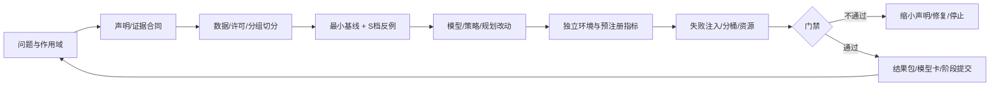

# 第22章 端到端综合项目：一个可审计的具身研究闭环

> 状态：`reviewed`
> 资料核查日期：2026-08-31
> 关联实验：`EXP-22-01`
> 关联声明：`CLAIM-22-01`～`CLAIM-22-07`
> 关联图表：`FIG-22-01` / `TAB-22-01` / `TAB-22-02` / `TAB-22-03` / `TAB-22-04`
> 资源档位：S / M / L1 / L2
> GPU 状态：不需要（S 档）/ 待验证（M/L1/L2）

## 本章契约

### 核心问题

怎样把前 21 章的观测、状态、模型、策略、仿真、评测和部署合同组合成一个可复核项目？什么才算阶段完成？当前没有 GPU、不下载大型数据、也不购买硬件时，怎样仍然交付有科学价值的结果？

### 先修知识

- 已具备：第4章实验协议、第9章用途驱动评测、第17章 model exploitation、第19章 simulator gap、第20章证据阶梯和第21章部署 gate；
- 本章补齐：选题裁剪、最小基线、项目包、阶段提交、失败证据、研究雷达和最终验收；
- 不要求：完成所有 M/L1/L2 实验、GPU、真实机器人或车辆。

### 非目标

- 不以一个成功视频代替实验；
- 不要求把 world model、VLA、3D、RL 和部署全部塞进同一项目；
- 不把 metadata 审计通过称为科学结论正确；
- 不把未运行的配置补写成假想指标；
- 不要求购置硬件、API 额度或受限数据。

### 学完后的可验证产出

读者应能选择一个边界清楚的课题，写出问题—假设—对照—指标—停止条件，建立可冷启动的 S 档入口，提交实验卡/结果/失败记录/模型卡/复现命令，并用独立真实性锚点限制结论。

## 22.1 项目不是模型名，而是一条可证伪问题

不合格的题目是“复现 Dreamer”“做一个 VLA”或“训练自动驾驶世界模型”。它们没有指定任务、干预、对照、指标和证据边界。可执行问题应写成：

> 在冻结的数据、动作 schema、资源和评测协议下，改变因素 X 是否相对基线 B 改善指标 Y，同时不恶化安全/资源指标 Z？

例如：“在固定扰动 corridor 中，replanning 是否比执行旧 action suffix 降低真实 simulator return gap，且不超过 50 ms deadline？”这句话允许失败，也能决定需要哪些资产。

`CLAIM-22-01`（recommendation）：综合项目必须先冻结研究问题、唯一主变量、最低基线、独立评测和停止条件，再选择模型；模型名不能替代可证伪假设。



*FIG-22-01：综合项目的可审计闭环。来源：本书原创，MIT，2026-08-31。门禁失败可以产生有效负结果，不要求继续扩大实验。*

## 22.2 五个选题轨道

| 轨道 | 核心变量 | 最小对照 | 独立真实性锚点 | 典型失败 |
| --- | --- | --- | --- | --- |
| 世界模型 + MPC | horizon、terminal value、planner | 随机/无模型/已知 dynamics | 物理 simulator rollout | model return 错排、超时 |
| BC/ACT/Diffusion/VLA 统一评测 | action head/chunk | 同数据与 schema 的简单 BC | 冻结 task/seed 闭环 | 多峰均值、chunk 陈旧 |
| learned simulator 后训练 | reward/rollout/update | SFT、物理 simulator RL | 未参与训练的 simulator/真实小样本 | hallucination、reward hacking |
| occupancy/affordance 用于动作 | representation/state | 2D/无 unknown 简单基线 | 几何/碰撞/任务 outcome | unknown 假安全、frame 错 |
| 驾驶世界模型 | 反事实/规划/代理评测 | 规则模型或无 world model | MetaDrive 默认、CARLA 可选 | 碰撞漏检、路线/时延错配 |

*TAB-22-01：综合项目轨道。每个项目只需选择一行；自动驾驶是正文轨道，不是附录。*

无 GPU 时先用本书 fixture 或自建微型程序验证问题能否被指标区分。例如 world-model 项目先复用 `EXP-07-01/17-01`，策略项目复用 `EXP-13-01/15-01`，空间项目复用 `EXP-12-01`，驾驶项目复用 `EXP-19-01/20-01/21-01`。S 档结果不是目标方法成绩，而是防止在昂贵实验后才发现协议不可判别。

## 22.3 从最小基线到因果对照

每次实验只改变一个主变量。若同时换 backbone、数据、action schema、训练步数和 evaluator，即使数字提高也无法归因。建议按顺序建立：

1. **零/规则基线**：常数、随机、状态机或已知 dynamics；
2. **最小学习基线**：小网络/BC/线性 probe，固定数据和预算；
3. **目标方法**：只加入本研究主变量；
4. **oracle 上界**：只用于定位瓶颈，不能当可部署方法；
5. **负对照/ablation**：去掉动作条件、打乱时间、换错 frame 或禁用 recovery；
6. **真实锚点**：相同 policy 在独立 simulator/环境的 outcome。

基线失败也要保存。若简单规则已经达到任务上限，应增加有意义难度或缩小研究主张，而不是隐藏基线。若目标方法只提高 model-only metric、外部 outcome 不变，结论应写“改善代理指标”，不能写“改善控制”。

`CLAIM-22-03`（recommendation）：项目结果表必须把训练数据/步数、动作 schema、候选预算、评测 seed 和资源对齐；任何未对齐差异都进入 confounder 列，而不是靠模型名称解释。

## 22.4 必交项目包

| 资产 | 最低内容 | 阻塞条件 |
| --- | --- | --- |
| 研究问题/相关工作矩阵 | 假设、主变量、基线、来源与差异 | 题目只有模型名或宣传语 |
| 数据卡与切分 | 来源、许可、校验、scene/task/route 分组 | train/eval 泄漏、私有数据未授权 |
| experiment card | 命令、资源、指标、seed、限制 | 指标无来源、GPU 状态伪报 |
| 环境/代码锁 | Docker、依赖、上游 commit/config | 无法冷启动或结果不可追溯 |
| 结构化结果 | JSON/CSV、配置、日志索引 | 只给截图或手填表格 |
| 失败记录 | 至少一个失败注入与原始 trace | 只保留成功 demo |
| 复现命令 | prepare/smoke/train/evaluate/report | 命令依赖隐式本机状态 |
| model/system card | 输入输出、训练范围、用途和非用途 | 把 checkpoint 当完整系统 |
| 局限与许可 | 未验证项、第三方资产、隐私 | 必做资产不可合法再分发 |

*TAB-22-02：综合项目必交物。项目规模可以小，追溯字段不能省。*

`CLAIM-22-04`（fact）：一个结果只有在代码/配置、数据版本与切分、环境、结构化输出和声明作用域共同可追溯时，才进入本书证据链；存在 checkpoint 或视频不满足这个条件。

## 22.5 EXP-22-01：先审项目包，再审模型

S 档审计器检查两个手工 driving project metadata 包。完整包包含问题、claim、许可、互斥 route split、五类 artifact、失败注入、局限、S 档资源、独立评测、驾驶指标、safety gateway，以及五段跨章证据 trace；故意不完整包违反这些合同。

```bash
make ch22-test-local
make ch22-smoke-local
make ch22-smoke
```

| 包 | issue 数 | 是否接受 | 关键结果 |
| --- | ---: | --- | --- |
| 完整固定包 | 0 | 是 | 字段合同通过 |
| 故意无效包 | 16 | 否 | 问题/claim/许可/隔离/artifact/失败/资源/trace/评测/驾驶安全均有具名 issue |

*TAB-22-03：`EXP-22-01` 固定审计结果。存在性检查不读取 artifact 内容，也不证明研究正确或安全。*

`CLAIM-22-02`（result）：完整手工包得到 0 issue；无效包得到 16 个具名 issue，包括 route split 重叠、结果/失败/复现命令/trace 缺失、3×80 GB 超限、GPU 结果未验证、评测不独立、驾驶指标与 safety gateway 缺失。该结果只验证 metadata audit 路径。

审计器把单卡大于 24 GB 和超过 2×80 GB 标为超出本书资源政策。这不是说方法在其他环境不可运行，只表示它不能被包装成本书默认/最高可选路径。

## 22.6 自动驾驶综合项目合同

驾驶选题可选择三个稳定用途之一：

1. **反事实场景生成**：固定历史，只改变候选 action/事件，评估动作敏感性、物理一致性和长尾覆盖；
2. **规划/代价估计**：在模型中比较轨迹，再在 MetaDrive/CARLA 回查 return、碰撞与错排；
3. **代理闭环评测**：检查 learned simulator 的策略排序是否与物理 simulator 对齐，并预留新增 policy 校准集。

三者不能用同一个“视频看起来真实”验收。最低驾驶指标为 route completion、collision rate、intervention rate；再按用途加入规则、舒适、稀有事件召回、model-vs-simulator return gap、P95 latency 和 deadline miss。

### 22.6.1 从一条 route 问题走完五段证据

继续使用“replanning 是否降低固定扰动下的 route failure”这一问题。它不是把五章结果相加，也不是声称已有一辆车完成端到端运行，而是明确每段到底消费什么合同、产生什么证据、何时必须停止：

| 证据阶段 | 本书入口 | 本例要回答的决策 | 机器证据 | 失败时怎样处理 |
| --- | --- | --- | --- | --- |
| input contract | 第4章 `EXP-04-01` | route 分组、时间戳、mask 与 episode end 是否可用于 target/评测 | 数据审计结果与失败代码 | 泄漏、缺帧或结束语义不清时不训练 |
| method contract | 第8章 `EXP-08-01` | timeout 是否保留 bootstrap，terminal 是否阻止 reward 泄漏 | λ-return、continuation 与截断反例 | target 不可构造时修数据，不把缺失猜成 terminal |
| independent evaluation | 第20章 `BENCH-20-01` | 固定 route/seed、成功定义、timeout 与有效分母后，replanning 是否改善 outcome | route/collision/intervention、Wilson 区间与 episode accounting | protocol 不同或技术无效运行时不排行 |
| deployment/safety gate | 第21章 `EXP-21-01` | action 是否新鲜、按时、有限、在界内且 uncertainty 可接受 | allow/fallback、原因计数、P95/deadline miss | 触发 profile-specific fallback，不执行旧 action suffix |
| evidence package | 本章 `EXP-22-01` | 上述问题、artifact、依赖、失败和限制能否由第三方追踪 | 五段 trace、0/16 issue 对照 | 缺一段即缩小声明或停止交付 |

*TAB-22-04：自动驾驶 capstone 的五段证据 trace。表中入口均是本书 S 档接口 fixture；它证明依赖可追踪，不证明模型、仿真或车辆已经端到端运行。*

`CLAIM-22-07`（result）：`EXP-22-01` v2 的完整包包含五个具名 trace stage 并通过 0 issue 审计；删除独立评测阶段会触发 `traceability_incomplete`，把 method stage 错连到第20章或删除其上游依赖会触发 `invalid_trace_stage:method_contract`。这是证据图合同测试，不是闭环性能结果。

训练、world-model validation 和最终闭环 evaluation 必须按 route/scene 分组隔离；相邻帧随机切分无效。碰撞、道路边界、动作范围、时效和最小风险停车由独立 gate 检查，不能被路线 reward 抵消。

`CLAIM-22-05`（recommendation）：驾驶综合项目只有在独立闭环 route/seed、碰撞/干预/路线指标、失败注入、尾延迟和最小风险 gate 同时登记后，才能声称完成研究闭环；仍不能据此声称道路部署安全。

## 22.7 阶段、提交与停止规则

按以下可独立验收阶段工作，并在每个阶段门禁通过后提交：

1. **问题合同**：选题、相关工作、数据/许可、基线、指标、资源与停止条件；
2. **S 档骨架**：fixture、单元测试、Docker smoke、结构化结果；
3. **正文/报告**：方法、结果、反例、图表、自动驾驶或机器人正文；
4. **M/L1/L2 可选实验**：只在资源和数据已授权时运行，失败也归档；
5. **四类审查**：内容、代码、一致性、教学；
6. **发布候选**：全链路严格构建、链接/许可/敏感资产/版本说明。

阶段提交不是按天存档。一个 commit 应对应一个可复核增量，消息说明产出而非“update”。若门禁失败，先修复或记录阻塞；不要提交会让正文结果与代码不同步的半成品。

停止是正常结论：数据无权使用、资源超限、真实锚点排序反转、安全事件恶化、指标无法区分基线、模型超时或结果不可追溯时，缩小主张或结束实验，不通过增加算力掩盖问题。

## 22.8 资源路线与当前设备

- **S**：标准库/CPU/零下载，完成问题、fixture、schema、报告与失败注入；这是必做路径。
- **M**：Docker 中的小数据/小环境验证，先显示下载量、磁盘和许可；不要求 GPU。
- **L1**：目标 24 GB 单卡，实测 peak VRAM、墙钟、seed、checkpoint 和冷启动。
- **L2**：最多 2×80 GB，只有主问题确实需要且 L1 无法回答时使用；不是毕业门槛。

当前无 GPU，因此可以完整交付 S 档 capstone，并把 M/L1/L2 写成可执行但 `pending` 的实验合同。禁止编造训练日志、性能数字和 GPU 资源；没有运行比伪造结果更有价值。

项目原创代码、文本、图表和 fixture 使用 MIT。第三方代码、权重、数据、地图、仿真资产、录屏和 API 响应分别核验；仓库不提交大型/受限资产、密钥或未脱敏机器人/车辆日志。

## 22.9 研究雷达：书写完以后怎样保持更新

新工作先进入“问题—假设—证据—资产开放度—复现成本”雷达，而不是立即改正文：

```text
候选工作 | 解决的问题 | 主假设 | 一手来源 | P/A/O/V/T
代码/权重/数据开放度 | R0-R4 | 资源 | 与现有章节差异 | 失效条件
```

只有改变稳定定义、方法族或证据边界的工作才修改正文；版本号、产品能力和排行榜进入案例卡。关键性能回到原论文/结果文件，综述只用于发现材料。核查日期、删除/替换理由和受影响 claim 一并记录。

`CLAIM-22-06`（recommendation）：维护在线书时，应让稳定章节结构慢更新、案例卡和研究雷达快更新；新论文不能因“更新”二字跳过证据、资源、许可与复现审计。

## 22.10 最终评分与交接

项目不按“模型越大分越高”评分。建议六轴各自判断：问题可证伪性、基线公平性、证据追溯、失败分析、复现与资源、安全/伦理边界。任何一轴缺失都不能由漂亮 demo 抵消。

最终交接应让另一位读者在无私有上下文下完成：阅读问题、运行 S smoke、找到结果和失败、理解未验证项，并知道需要何种授权才能继续 M/L1/L2。若必须口头解释路径、手工找 checkpoint 或猜动作单位，项目仍未完成。

## 小结与练习

端到端不等于模型端到端，而是证据链端到端：问题、数据、代码、结果、失败、资源、许可、评测和安全相互追溯。无 GPU 也能完成高质量项目，因为最先需要验证的是问题和协议是否成立。

1. 从 `TAB-22-01` 选一轨，写一个只含一个主变量的研究问题。
2. 给有效项目包删除一个字段，预测并验证 audit issue。
3. 为目标方法设计 oracle、负对照和独立真实性锚点。
4. 写一个“应停止而不是继续加算力”的失败场景。
5. 为驾驶项目划分互斥 route，并定义碰撞、干预和最小风险 gate。

## 延伸阅读与仓库入口

- 仓库文件 `specs/PRD/书籍编写与审查执行流程.md`；
- 仓库文件 `specs/book-quality-gates.md`；
- 仓库文件 `specs/evidence-policy.md`；
- 仓库文件 `specs/license-and-data-policy.md`；
- 仓库文件 `specs/experiment-card.schema.json`。

## 全书出口与审查记录

本章没有“自动部署”出口。项目通过后进入人工发布审查；任何真实机器人或车辆实验仍需单独授权、风险评估、硬件流程和现场安全协议。

- 内容审查：通过；
- 代码审查：通过；
- 一致性审查：通过；
- 教学审查：通过；
- 审查记录路径：`reviews/final-book-review.md`；
- 已知限制：metadata audit 只检查手工字段，不读取 artifact 内容；没有模型、数据、仿真、GPU、机器人、车辆或部署。
