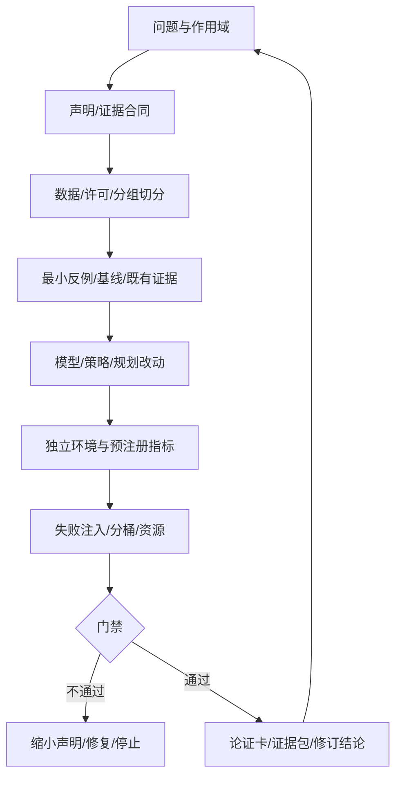

# 第22章 综合论证：一个可审计的具身研究闭环

## 本章契约

### 核心问题

怎样把前21章的观测、状态、模型、策略、仿真、评测和部署知识组合成一个可复核论证？什么才算结论成立？不运行新实验时，怎样仍然交付有知识价值、可被反驳和继续扩展的研究成品？

### 先修知识

- 已具备：第4章实验协议、第9章用途驱动评测、第17章 model exploitation、第19章 simulator gap、第20章证据阶梯和第21章部署 gate；
- 本章补齐：选题裁剪、研究论证卡、最低充分证据、失败解释、证据图、研究雷达和最终交接；
- 不要求：完成所有 M/L1/L2 实验、GPU、真实机器人或车辆。

### 非目标

- 不以一个成功视频代替实验；
- 不要求把 world model、VLA、3D、RL 和部署全部塞进同一项目；
- 不把 metadata 审计通过称为科学结论正确；
- 不把未运行的配置补写成假想指标；
- 不要求购置硬件、API 额度或受限数据。
- 不把代码仓库、运行日志或新实验设为完成本章的必要条件。

### 学完后的可验证产出

读者应能把一个宽泛方向收缩为可证伪问题，区分现象、测量、机制和部署四类主张，并为每类主张匹配最低充分证据。最终成品可以是一份研究论证，而不是程序：它应让另一位读者看懂问题、证据、反例、推断边界和下一步，并能指出哪条前提一旦不成立就必须修改结论。

## 22.1 项目不是模型名，而是一条可证伪问题

不合格的题目是“复现 Dreamer”“做一个 VLA”或“训练自动驾驶世界模型”。它们没有指定任务、干预、对照、指标和证据边界。可执行问题应写成：

> 在冻结的数据、动作 schema、资源和评测协议下，改变因素 X 是否相对基线 B 改善指标 Y，同时不恶化安全/资源指标 Z？

例如：“在固定扰动 corridor 中，replanning 是否比执行旧 action suffix 降低真实 simulator return gap，且不超过 50 ms deadline？”这句话允许失败，也能决定需要哪些资产。

<!-- CLAIM_META: CLAIM-22-01 recommendation -->
综合项目必须先冻结研究问题、唯一主变量、最低基线、独立评测和停止条件，再选择模型；模型名不能替代可证伪假设。

### 22.1.1 四种主张需要四种证据

研究中常把不同强度的句子混在一起。现象主张描述“在给定样本中观察到什么”；测量主张说明“某个指标如何变化”；机制主张进一步解释“为何变化”；部署主张则回答“系统能否在目标环境可靠使用”。从前一层到后一层，需要额外假设和证据，不能只靠更肯定的措辞升级。

例如动作误差下降是测量结果，不自动证明策略学会更好的反馈机制；仿真成功提高是指定环境中的闭环现象，不自动证明 Sim2Real；世界模型预测更逼真也不自动证明规划更优。机制主张需要隔离变量的对照，部署主张还需要目标环境、时序、安全和长期暴露证据。

一份诚实结论应同时写出对象、条件、比较和边界：“在冻结的任务、数据和评测协议下，方法 X 相对 B 改善 Y；尚未验证 Z。”限制不是附注，而是主张语义的一部分。删除限制后，原句往往已经变成另一个更强、但未被证据支持的命题。

### 22.1.2 端到端指证据闭环，不指单一神经网络

一个系统可以由学习模型、规则规划器、传统控制器和独立安全层组成，仍然具有端到端可追溯的证据链；一个从像素直接输出动作的网络，若数据、评测和执行语义不可追踪，反而不是可审计的端到端研究。模块是否联合训练与证据是否闭环是两条不同轴。

全书反复出现的核心问题可以统一为：系统看见了什么，内部保留了什么，对什么动作作出预测或选择，环境如何反馈，指标观察了什么，失败由谁处理。只要其中一条接口含糊，模型规模就无法补回缺失的语义。



*FIG-22-01：综合项目的可审计闭环。来源：本书原创，CC BY-NC 4.0，2026-08-31。门禁失败可以产生有效负结果，不要求继续扩大实验。*

## 22.2 五个综合论证轨道

| 轨道 | 核心变量 | 最小对照 | 独立真实性锚点 | 典型失败 |
| --- | --- | --- | --- | --- |
| 世界模型 + MPC | horizon、terminal value、planner | 随机/无模型/已知 dynamics | 物理 simulator rollout | model return 错排、超时 |
| BC/ACT/Diffusion/VLA 统一评测 | action head/chunk | 同数据与 schema 的简单 BC | 冻结 task/seed 闭环 | 多峰均值、chunk 陈旧 |
| learned simulator 后训练 | reward/rollout/update | SFT、物理 simulator RL | 未参与训练的 simulator/真实小样本 | hallucination、reward hacking |
| occupancy/affordance 用于动作 | representation/state | 2D/无 unknown 简单基线 | 几何/碰撞/任务 outcome | unknown 假安全、frame 错 |
| 驾驶世界模型 | 反事实/规划/代理评测 | 规则模型或无 world model | MetaDrive 默认、CARLA 可选 | 碰撞漏检、路线/时延错配 |

*TAB-22-01：综合项目轨道。每个项目只需选择一行；自动驾驶是正文轨道，不是附录。*

五条轨道首先是组织知识的方式，不是五种必须运行的实验。读者可以使用本书已有反例、论文中的作者结果、官方接口和明确标注的假设完成论证，但必须区分这些证据分别支持什么。只有当现有证据无法判别核心问题时，才需要设计新的数据或实验。

### 22.2.1 默认成品：一页研究论证卡

| 字段 | 必须回答的问题 | 常见不合格写法 |
| --- | --- | --- |
| 问题 | 哪个对象、条件和决策存在不确定性？ | “研究世界模型” |
| 主张 | 希望成立的最小可证伪句子是什么？ | “方法更智能” |
| 证据 | 哪些事实、结果或反例直接支持它？ | 只列论文和模型名 |
| 推理桥 | 证据到主张还依赖哪些前提？ | 把相关性写成因果 |
| 反例 | 什么观察会推翻或缩小主张？ | 只列实现报错 |
| 边界 | 哪些任务、人群、本体或环境未覆盖？ | “未来进一步研究” |
| 修订结论 | 证据不足时应改成哪一句更弱的话？ | 保留原结论只加免责声明 |
| 下一证据 | 哪个最低成本的新观察最能减少不确定性？ | 默认训练更大模型 |

*TAB-22-07：研究论证卡。来源：本书原创，CC BY-NC 4.0，2026-09-03。它既可作为课程作业，也可作为论文阅读、项目立项或失败复盘的最终成品。*

一份合格论证卡通常只需2–4页：先给出主张和证据图，再选一个最强反例检验推理桥，最后写出原结论、受反例影响后的修订结论，以及仍需外部验证的部分。它不要求产生新性能数字，但要求每个引用可追溯、每个推断有边界、每个“不知道”都指向具体缺失证据。

### 22.2.2 选择最小充分系统

综合不等于把所有方法族同时使用。研究问题若只关心动作块的反馈时域，就不需要先训练大型世界模型；若只检验表征是否保留速度，闭环 VLA 也不是最低证据。组件越多，可调参数、故障源和归因路径越多，系统看似完整，结论反而可能更弱。

最小充分系统是能够使目标假设可被反驳、同时不引入无关复杂度的最小组合。它不一定计算最小，也不一定性能最低；关键是每个组件都对问题有明确职责。新增组件前应问：它消除了哪个已知限制，会引入什么新的 confounder，失败时能否定位。如果没有明确答案，就应留在后续扩展而非主实验。

研究路线也不必单向追求更大系统。小反例可以证明指标不可辨识，规则基线可以揭示任务上限，失败注入可以否定安全主张。这些结论可能比一个昂贵但不可归因的正结果更有知识价值。

## 22.3 从最小基线到因果对照

每次实验只改变一个主变量。若同时换 backbone、数据、action schema、训练步数和 evaluator，即使数字提高也无法归因。建议按顺序建立：

1. **零/规则基线**：常数、随机、状态机或已知 dynamics；
2. **最小学习基线**：小网络/BC/线性 probe，固定数据和预算；
3. **目标方法**：只加入本研究主变量；
4. **oracle 上界**：只用于定位瓶颈，不能当可部署方法；
5. **负对照/ablation**：去掉动作条件、打乱时间、换错 frame 或禁用 recovery；
6. **真实锚点**：相同 policy 在独立 simulator/环境的 outcome。

基线失败也要保存。若简单规则已经达到任务上限，应增加有意义难度或缩小研究主张，而不是隐藏基线。若目标方法只提高 model-only metric、外部 outcome 不变，结论应写“改善代理指标”，不能写“改善控制”。

<!-- CLAIM_META: CLAIM-22-03 recommendation -->
项目结果表必须把训练数据/步数、动作 schema、候选预算、评测 seed 和资源对齐；任何未对齐差异都进入 confounder 列，而不是靠模型名称解释。

### 22.3.1 对照的目的不是让表格更完整

基线、ablation、oracle 与真实性锚点各自回答不同问题。基线估计在不使用主机制时能做到什么，ablation 检查完整系统是否依赖该机制，oracle 判断瓶颈是否位于被替换组件，真实性锚点则检查代理环境中的结论能否保持。四者都可能失败，也都不能互相替代。

一个有效对照要切断具体因果路径。例如要判断 world model 是否因动作条件性帮助规划，可以打乱动作—未来对应关系，同时保持数据量与模型容量；仅删除整个 world model 会同时改变表示、参数和计算。要判断长 context 是否提供历史信息，可以构造当前帧相同、历史不同的配对输入；总体分数变化无法证明模型真正读取了历史。

公平也不总意味着所有资源完全相同。Compute-matched 比较固定成本下谁更有效，data-matched 比较相同信息下方法差异，capacity-matched 尝试隔离架构，system-matched 则比较完整可部署方案。它们回答不同决策。项目应预先选择主要口径，并把其他口径作为敏感性分析，而不是在结果出现后寻找有利定义。

## 22.4 必交项目包

| 资产 | 最低内容 | 阻塞条件 |
| --- | --- | --- |
| 研究问题/相关工作矩阵 | 假设、主变量、基线、来源与差异 | 题目只有模型名或宣传语 |
| 数据卡与切分 | 来源、许可、校验，以及 train/selection/eval 的 group/source/content/near-duplicate 身份集 | test 被用于调参、私有数据未授权或任一身份跨 split 重叠 |
| experiment card | 命令、资源、指标、seed、限制、评测冻结点 | 评测后改协议、GPU 状态伪报 |
| 环境/代码锁 | Docker、依赖、上游 commit/config 与 revision | 无法冷启动或结果不可追溯 |
| 结构化结果 | JSON/CSV、配置、日志索引、内容摘要 | 只给截图、手填表格或漂移文件 |
| 失败记录 | 注入条件、预期问题、实际问题与原始 trace | 只登记“做过失败测试”或只保留成功 demo |
| 复现命令 | prepare/smoke/train/evaluate/report | 命令依赖隐式本机状态 |
| model/system card | 输入输出、训练范围、用途和非用途 | 把 checkpoint 当完整系统 |
| 局限与许可 | 未验证项、第三方资产、隐私 | 必做资产不可合法再分发 |

*TAB-22-02：综合项目必交物。项目规模可以小，追溯字段不能省。*

<!-- CLAIM_META: CLAIM-22-04 fact -->
一个结果只有在代码/配置、数据版本与切分、环境、结构化输出和声明作用域共同可追溯时，才进入本书证据链；存在 checkpoint 或视频不满足这个条件。

### 22.4.1 Provenance 保证身份链，不保证真理

摘要、版本和生成记录可以回答“这个结果来自哪组输入和过程”，却不能回答输入是否真实、实现是否正确、指标是否有效或结论是否因果。一个完整可追溯的错误实验仍然是错误的，只是更容易被发现和修正。Provenance 提高可审计性，不是科学正确性的数字签名。

证据链至少有三种完整性：结构完整性要求字段和依赖齐全，执行完整性要求声明的过程确实运行并产生对应输出，认识完整性要求输出足以支持所写主张。自动审计最擅长前两种的部分检查，第三种仍依赖问题设计、对照、统计解释与领域判断。

同样，复现与重复也不同。复现通常在相同资产和流程上得到一致结果，主要检验可执行性与报告一致；独立重复采用新的实现、数据或团队检验结论是否超越原流水线。一次命令成功退出只位于这条阶梯的底部，不应被命名为整个科学结论已确认。

### 22.4.2 “存在”“可用”和“结果复现”不是同一等级

[ACM Artifact Review and Badging](https://www.acm.org/publications/policies/artifact-review-and-badging-current)把 `Artifacts Available`、`Artifacts Evaluated—Functional/Reusable` 和 `Results Validated—Reproduced/Replicated` 分成不同徽章：公开地址只说明资产可取，不等于资产能运行，更不等于论文结果已被独立复现。项目包应分别登记“是否可定位、内容身份是否匹配、是否执行、由谁在什么环境执行、是否复现结论”，不能压成一个 `artifact_exists=true`。

本书采用一个轻量 manifest：每项资产至少有 `uri`、内容 `sha256`、`producer_stage`、`claim_ids`，trace stage 再记录 `artifact`、`chapter`、`revision`、`decision` 和冻结依赖。这借鉴 [SLSA provenance](https://slsa.dev/spec/v1.2/provenance)用 digest 绑定产物身份、记录产物怎样生成的原则，也与 [RO-Crate](https://www.researchobject.org/ro-crate/specification/1.2/introduction.html)把数据、代码、工作流和 provenance 聚合为 research object 的方向一致。SHA-256 能发现本次包内内容漂移，但不能证明内容真实、许可有效、程序无恶意或实验结论正确；这些仍需执行、复核和独立评测。

## 22.5 先审项目包，再审模型（EXP-22-01）

S 档审计器检查两个手工 driving project package fixture。完整包包含问题、claim、许可、三分区 × 四身份维度的数据隔离、五类带摘要的 artifact binding、绑定 command/result digest 的执行回执、可对照预期与实际问题的失败注入、局限、S 档资源、冻结且独立的评测、驾驶指标、可追溯 safety gateway，以及五段跨章证据 trace；故意不完整包违反这些合同。v5 还实际启动三个不经过 shell 的固定 `python3` 子进程，分离成功且输出摘要匹配、输出漂移和非零退出。

<details markdown="1">
<summary>可选：验证本章证据</summary>

```bash
make ch22-test-local
make ch22-smoke-local
make ch22-smoke
```

</details>

| 包 | issue 数 | 是否接受 | 关键结果 |
| --- | ---: | --- | --- |
| 完整固定包 | 0 | 是 | 12 个 split identity set、5 个 artifact digest binding、2 个失败注入和 5 段 trace 通过 |
| 故意无效包 | 24 | 否 | 问题/claim/许可、4 类 train–eval 重叠、artifact/回执/失败/资源/trace/评测冻结/驾驶安全均有具名 issue |

*TAB-22-03：`EXP-22-01` v5 固定审计结果。fixture 在内存中重算文本 payload 的 SHA-256，并运行受限标准库子进程；没有遍历真实项目目录、重建环境或运行模型，也不证明研究正确、许可有效或系统安全。*

<!-- CLAIM_META: CLAIM-22-02 result -->
完整固定包得到 0 issue；无效包得到 24 个具名 issue，包括四种 train–eval 身份重叠、artifact 缺失或 claim binding 非法、执行回执缺失、3×80 GB 与 L2 不匹配、GPU 结果未验证、trace 缺失、评测不独立且未冻结、驾驶指标与 safety gateway 缺失。该结果只验证标准库 fixture 的项目包审计路径。

<!-- CLAIM_META: CLAIM-22-08 result -->
`EXP-22-01` v5 的完整包校验 5 个 `uri + sha256 + producer_stage + claim_ids` binding；篡改 `results.json` 的 payload 会触发 `artifact_digest_mismatch:result`，错误 producer 或非规范 claim 会触发 `invalid_artifact_binding`。这只证明固定 payload 与登记摘要一致，不是科学复现徽章。

| probe | exit code | stdout digest | 状态 |
| --- | ---: | --- | --- |
| 固定命令与登记结果一致 | 0 | 匹配 `results.json` | `reproduced` |
| 命令相同、预期 digest 改为全零 | 0 | 不匹配 | `stdout_digest_mismatch` |
| 固定命令显式退出 3 | 3 | 空输出摘要 | `nonzero_exit` |

*TAB-22-04：本地 reproduction probe 的三条执行路径。只允许 JSON argv 形式的 `python3`，不经过 shell；stdout 是固定字符串，不是模型结果。*

<!-- CLAIM_META: CLAIM-22-11 result -->
`EXP-22-01` v5 实际启动三个固定本地子进程；只有 exit 0 且 stdout SHA-256 与结果 artifact 一致的路径记为 `reproduced`，同一输出面对错误预期摘要得到 `stdout_digest_mismatch`，显式 exit 3 得到 `nonzero_exit`。项目包另要求手工 receipt 同时绑定 command/result URI、两端 digest、exit code 与 stderr 字节数。这只验证受限 CPU fixture 的执行和字段一致性，不证明命令安全、环境可重建、依赖完整、receipt 可信、模型运行、科学结论复现或独立 replication。

| 分区 | 只允许承担的角色 | 必填且与另外两区互斥的集合 |
| --- | --- | --- |
| train | 拟合模型、表征、统计量 | `group_ids`、`source_asset_ids`、`content_fingerprints`、`similarity_cluster_ids` |
| selection | 选择 checkpoint、阈值、prompt 或配置 | 同上四项；不能因“不反向传播”而与 eval 共用 |
| eval | 一次冻结的最终报告 | 同上四项；查看结果后不得回流前两区 |

*TAB-22-05：项目包的三分区 × 四身份维度合同。集合互斥只证明已登记身份没有交集，不证明上游相似度方法完备、数据统计独立或场景真正分布外。来源：本书原创，CC BY-NC 4.0，2026-09-02。*

<!-- CLAIM_META: CLAIM-22-10 result -->
`EXP-22-01` v5 要求 train/selection/eval 各登记四类非空且内部无重复的身份集合；三个保持 group 不同的回归反例分别以 source asset、精确内容和近重复簇重叠触发拒绝，selection 与另外两区的来源重叠也会被拒绝。该结果只验证项目包内已登记集合与失败代码，不读取媒体、不发现未知近重复，也不证明统计独立。

资源检查按档位而不是全局阈值解释：S/M 不声明 GPU，L1 最多 1×24 GB，L2 最多 2×80 GB；因此 1×80 GB 或 2×80 GB 可属于 L2，而 1×25 GB 不能冒充 L1，3×80 GB 也不能冒充 L2。这不是说方法在其他环境不可运行，只表示它不能被包装成本书对应档位。

**杯子任务的全书收束。** 一个可审计项目可以把问题限定为：“在冻结对象组、相机与控制频率下，加入动作条件世界模型排序是否降低遮挡抓取的掉落率，且不增加碰撞、超时和安全干预？”数据阶段隔离对象与派生视图，方法阶段只改变候选排序机制，评测阶段在未参与选择的对象和初态上报告成功、掉落与干预，部署阶段记录动作时效和 fallback，证据包再把失败样本、版本与停止规则串起来。这样，杯子任务从第5章的多未来表示走到第21章的执行边界，并在本章形成与驾驶 route 对称的完整 trace；它仍是研究合同，不是已经完成真实机器人实验的声明。

## 22.6 自动驾驶综合项目合同

驾驶选题可选择三个稳定用途之一：

1. **反事实场景生成**：固定历史，只改变候选 action/事件，评估动作敏感性、物理一致性和长尾覆盖；
2. **规划/代价估计**：在模型中比较轨迹，再在 MetaDrive/CARLA 回查 return、碰撞与错排；
3. **代理闭环评测**：检查 learned simulator 的策略排序是否与物理 simulator 对齐；先用 calibration policies 冻结模型与阈值，再以训练 lineage 不相交的 prospective policies 做一次性回查，同时保存第17章的 action grounding、transition、state decoder 与 outcome scorer 四段 trace，避免把最终错排全部归因给世界模型。

三者不能用同一个“视频看起来真实”验收。最低驾驶指标为 route completion、collision rate、intervention rate；再按用途加入规则、舒适、稀有事件召回、model-vs-simulator return gap、P95 latency 和 deadline miss。

### 22.6.1 从一条 route 问题走完五段证据

继续使用“replanning 是否降低固定扰动下的 route failure”这一问题。它不是把五章结果相加，也不是声称已有一辆车完成端到端运行，而是明确每段到底消费什么合同、产生什么证据、何时必须停止：

| 证据阶段 | 本书入口 | 本例要回答的决策 | 机器证据 | 失败时怎样处理 |
| --- | --- | --- | --- | --- |
| input contract | 第4章 `EXP-04-01` | group/source/content/near-duplicate 身份、时间戳、mask 与 episode end 是否可用于 target/评测 | 数据审计结果与失败代码 | 泄漏、缺帧或结束语义不清时不训练 |
| method contract | 第8章 `EXP-08-01` | timeout 是否保留 bootstrap，terminal 是否阻止 reward 泄漏 | λ-return、continuation 与截断反例 | target 不可构造时修数据，不把缺失猜成 terminal |
| independent evaluation | 第20章 `BENCH-20-01` | 先按 selection split 冻结 checkpoint，再固定 route/seed、成功定义、timeout 与有效分母，replanning 是否改善 outcome | split-role audit、route/collision/intervention、Wilson 区间、零事件上界与 episode accounting | final 参与选择、protocol 不同或技术无效运行时不排行；零事件不写成零风险 |
| deployment/safety gate | 第21章 `EXP-21-01` | action 是否新鲜、按时、有限、在界内且 uncertainty 可接受 | allow/fallback、原因计数、P95/deadline miss | 触发 profile-specific fallback，不执行旧 action suffix |
| evidence package | 本章 `EXP-22-01` | 上述问题、artifact、依赖、失败和限制能否由第三方追踪 | 五段 trace、digest binding、0/24 issue 对照 | 缺一段即缩小声明或停止交付 |

*TAB-22-06：自动驾驶 capstone 的五段证据 trace。表中入口均是本书 S 档接口 fixture；它证明依赖可追踪，不证明模型、仿真或车辆已经端到端运行。*

<!-- CLAIM_META: CLAIM-22-07 result -->
`EXP-22-01` v5 的完整包包含五个具名 trace stage 并通过 0 issue 审计；删除独立评测阶段会触发 `traceability_incomplete`，章节号与 `EXP/BENCH` ID 不一致、revision 为空、method stage 错连到第20章或依赖错误都会触发对应 `invalid_trace_stage`。这是证据图合同测试，不是闭环性能结果。

训练、model selection 和最终闭环 evaluation 必须按 route/scene 分组隔离，并继续检查 raw source、精确内容和已知近重复簇；相邻帧随机切分无效，重命名的同源 test log 也不能用于选 checkpoint、阈值或 prompt。[NeurIPS reproducibility checklist](https://blog.neurips.cc/2021/03/26/introducing-the-neurips-2021-paper-checklist/)强调提交训练与评测细节、代码/数据/指令和限制；在本书项目合同中，评测协议还必须在看最终结果前冻结，并绑定独立 evaluator artifact。碰撞、道路边界、动作范围、时效和最小风险停车由带 trace、失败记录和 fallback modes 的独立 gate 检查，不能被路线 reward 抵消。

<!-- CLAIM_META: CLAIM-22-09 recommendation -->
最终评测必须与训练和选择数据隔离，在查看最终结果前冻结协议，并绑定独立 evaluator artifact；安全门必须绑定部署 trace、失败记录与具体 fallback mode。一个 `independent=true` 或 `safety_gateway=true` 布尔值不足以形成审计证据。

<!-- CLAIM_META: CLAIM-22-05 recommendation -->
驾驶综合项目只有在独立闭环 route/seed、碰撞/干预/路线指标、失败注入、尾延迟和最小风险 gate 同时登记后，才能声称完成研究闭环；仍不能据此声称道路部署安全。

## 22.7 阶段、提交与停止规则

按以下顺序形成成品；只有进入实现型扩展时才需要代码提交与运行门禁：

1. **问题合同**：冻结对象、条件、主张、反例和停止条件；
2. **证据地图**：标出哪些来自数学、论文、官方资料、本书反例或目标环境；
3. **论证卡**：写清推理桥、替代解释、不可外推边界和修订结论；
4. **同行质询**：让另一位读者尝试用反例推翻主张，并记录仍有歧义的术语；
5. **可选实验**：只有缺失证据会改变核心判断且资源已经授权时才运行；
6. **最终交接**：保留引用、失败、未决问题和最小下一证据。

实现型项目的阶段提交不是按天存档；纯论证型成品则以主张、证据图和修订记录是否可追踪为完成标准。门禁失败时先修复或缩小主张，不用补写假想结果保持表面完整。

停止是正常结论：数据无权使用、资源超限、真实锚点排序反转、安全事件恶化、指标无法区分基线、模型超时或结果不可追溯时，缩小主张或结束实验，不通过增加算力掩盖问题。

### 22.7.1 负结果需要说明否定了什么

“没有提升”可能表示机制无效，也可能表示统计功效不足、实现失败、任务没有区分度或基线已经饱和。负结果只有在协议、实现和测量达到最低可信度后，才能约束机制假设。否则更准确的结论是“当前实验无法判定”，而不是“方法无效”。

有价值的失败记录应包含预期机制、首次偏离位置、受影响条件、排除过的替代解释和仍未排除的解释。这样失败可以缩小假设空间，也能告诉后续研究不应重复哪种模糊设计。只保存报错日志或一句“效果不好”，不能形成可迁移知识。

停止规则保护的不是算力预算本身，而是结论质量。真实性锚点反转、协议泄漏或安全 gate 恶化时继续扩大同类训练，可能让代理指标更漂亮，却进一步远离研究问题。缩小用途、回到更低证据层或承认不可判定，都是完整研究闭环的一部分。

## 22.8 资源与证据边界

默认论证型成品不占用 `S/M/L1/L2` 实验档位；它按主张清晰度、证据相关性、反例强度和边界诚实度评价。确需新增实验时，再采用[术语表](../glossary.md)的统一档位，并说明为什么更低成本的观察不足以回答问题。不得编造训练日志、性能数字或资源，明确“未运行”是可靠边界而非缺陷。

项目原创代码和 fixture 使用 MIT，原创文本与图表使用 CC BY-NC 4.0。第三方代码、权重、数据、地图、仿真资产、录屏和 API 响应分别核验；仓库不提交大型/受限资产、密钥或未脱敏机器人/车辆日志。

## 22.9 研究雷达：书写完以后怎样保持更新

新工作先进入“问题—假设—证据—资产开放度—复现成本”雷达，而不是立即改正文：

```text
候选工作 | 解决的问题 | 主假设 | 一手来源 | P/A/O/V/T
代码/权重/数据开放度 | R0-R4 | 资源 | 与现有章节差异 | 失效条件
```

只有改变稳定定义、方法族或证据边界的工作才修改正文；版本号、产品能力和排行榜进入案例卡。关键性能回到原论文/结果文件，综述只用于发现材料。核查日期、删除/替换理由和受影响 claim 一并记录。

本书的当前活页入口是[研究雷达](../research-radar.md)，机器源为仓库根目录下的 `specs/research-radar.json`。前者面向读者解释近期趋势和证据缺口，后者约束一手来源、revision、章节归属、资产开放度、复现状态、资源路径、不可外推边界与复核触发器。两者都不能把作者报告的性能升级为本书 `result`。

<!-- CLAIM_META: CLAIM-22-06 recommendation -->
维护在线书时，应让稳定章节结构慢更新、案例卡和研究雷达快更新；新论文不能因“更新”二字跳过证据、资源、许可与复现审计。

知识更新要区分新名称、新实现和新原理。一个新模型可能只替换 backbone 或扩大数据，并未改变稳定概念；一个小型工作也可能通过新反例改变我们对指标有效性的认识。正文应围绕经得住版本变化的问题结构，案例则说明这些结构在当前系统中如何实现。

过时信息也不应只按日期删除。先判断它是被更强证据推翻、被新版本替代、适用范围被缩小，还是仅仅不再流行。保留变更理由和受影响主张，才能让读者理解知识为何改变，而不是看到一串无上下文的新引用。

## 22.10 最终评分与交接

项目不按“模型越大分越高”评分。建议六轴各自判断：问题可证伪性、基线公平性、证据追溯、失败分析、复现与资源、安全/伦理边界。任何一轴缺失都不能由漂亮 demo 抵消。

最终交接应让另一位读者在无私有上下文下完成：读懂问题与主张，找到每条证据和反例，复述结论边界，并知道哪项新证据最可能改变判断。实现型扩展还应说明怎样运行、结果在哪里以及需要何种授权；若必须依赖作者口头补充，论证仍未完成。

### 22.10.1 全书最终推理顺序

面对一个新的具身智能系统，可以按同一顺序提问：

1. 任务与运行设计域是什么，成功、失败和不可接受后果如何定义？
2. 观测、隐藏状态、动作、坐标和时间合同是什么，哪些信息原则上不可辨识？
3. 模型承担表征、预测、生成、规划、策略还是安全角色，输入输出是否足以支持该角色？
4. 数据由谁产生，覆盖什么分布，切分、归一化和本体语义是否一致？
5. 对照隔离了哪个机制，指标测量的是代理还是目标结果，独立采样单元与 estimand 是什么？
6. 闭环会怎样改变输入分布，策略是否会利用模型、仿真、reward 或 evaluator 的漏洞？
7. 部署时信息是否新鲜、动作是否可执行，故障后谁接管、如何确认完成与恢复？
8. 当前证据最多支持哪一句话，还缺哪一级真实性锚点？

这八问不是流程模板，而是一条认识论链。前面的语义不清，后面的数值越精确越可能制造虚假确定性；后面的真实性不足，前面的理论越漂亮也不能升级为部署结论。

## 小结

端到端不等于模型从像素直接输出动作，而是证据链从问题一直闭合到边界：任务、观测、数据、模型角色、对照、结果、失败、资源、许可、评测和安全相互追溯。现象、测量、机制和部署是逐级增强的主张，任何一级都不能靠模型名称、参数规模或更强语气越过。

高质量研究首先选择最小充分系统，用对照切断具体因果路径，再让 provenance 保证身份可追踪、让真实性锚点限制外推。负结果、缩小主张和按停止规则结束，都可以产生可靠知识。全书最终留下的不是一组固定模型配方，而是一种判断方式：先澄清语义，再检查信息与干预，随后验证闭环和证据，最后才讨论部署。

## 练习

1. **研究问题**：从 `TAB-22-01` 选一轨，写一个只含一个主变量的研究问题。
2. **审计推演**：从有效项目包中删除一个关键字段，预测它会破坏结构完整性、执行完整性还是认识完整性，并说明自动审计能否发现。
3. **三类对照**：为目标方法设计 oracle、负对照和独立真实性锚点。
4. **停止规则**：写一个“应停止而不是继续加算力”的失败场景。
5. **驾驶终测**：为驾驶项目划分互斥 route，并定义碰撞、干预和最小风险 gate。
6. **复现层级**：比较命令存在、成功退出、输出一致、结果复现和独立重复五种证据，解释 stdout digest 与 exit code 失败为何属于不同层级。

## 自检要点

综合项目允许多种选题，但必须让第三方从问题一路追到失败与停止条件。先写自己的项目卡，再用以下示例检查是否误把代理分数、字段布尔值或更多算力当作证据。

<details markdown="1">
<summary>SELF-CHECK-22-01：一个主变量的驾驶研究问题</summary>

选择 `TAB-22-01` 的“驾驶世界模型”轨道，可写：在固定 policy、MetaDrive 版本、route/seed、候选数、动作 schema 和 50 ms deadline 下，仅把 MPC horizon 从 5 步改为 10 步，是否降低独立 simulator 的 route failure，且不增加碰撞、干预和 deadline miss？主变量只有 horizon；terminal value、模型、数据和 planner budget 不能同时改变。主要 estimand、置信区间、安全 gate 与停止条件须在看结果前冻结。该问题若只改善 model return、没有改善独立闭环 outcome，结论只能是代理指标改善。

</details>

<details markdown="1">
<summary>SELF-CHECK-22-02：删除一个字段并预测唯一 issue</summary>

深拷贝 `EXP-22-01` 的有效 package，只删除 `evaluation.protocol_frozen_before_evaluation`，其余字段与 digest 不变；预期 audit 包含 `evaluation_protocol_not_frozen`。运行 `make ch22-smoke` 或对应单测，断言该 issue 出现且有效包仍为 0 issue；若测试要求精确集合，则断言没有额外 issue。也可删除某个 split 的 `similarity_cluster_ids`，但应预期相应 `missing_split_identity`。这个测试证明 schema/auditor 捕捉缺字段，不证明填写为 `true` 的协议确实在现实中提前冻结。

</details>

<details markdown="1">
<summary>SELF-CHECK-22-03：oracle、负对照与真实性锚点职责不同</summary>

以 world-model MPC 为例：oracle 用目标 simulator 的真实 transition/termination 在相同候选预算内规划，用于估计模型误差上界；负对照可打乱 action 条件或使用 action-blind dynamics，检查 planner 是否其实未消费动作后果；独立真实性锚点是在未参与 world model、planner、阈值或 checkpoint 选择的固定物理 simulator route/seed 上执行最终 policy。三者共享观察、动作、候选和评测协议，差异进入 confounder 表。oracle 不可部署、负对照失败不等于目标方法正确、一个 simulator 锚点也不能代表真实世界。

</details>

<details markdown="1">
<summary>SELF-CHECK-22-04：安全或证据 gate 失败时停止</summary>

例如扩大 world model 与训练时长后，model-only return 持续上升，但独立 MetaDrive 中所选 policy 的碰撞率升高、策略排序反转，且失败集中在模型乐观预测的施工区。此时更多同类算力可能强化 exploitation；应冻结资产、保存失败轨迹，停止该决策用途，检查数据/support/reward，或把主张缩小到表征/候选筛选。类似地，数据许可不明、最终 split 泄漏、evaluator digest 无法追溯或资源超过 2×80 GB 上限也应停止。停止是符合预注册合同的结果，不是缺少实验勇气。

</details>

<details markdown="1">
<summary>SELF-CHECK-22-05：驾驶 route 隔离与三类 gate</summary>

按 route group 划分 train/selection/final evaluation，三者在 `group_id、source_asset_id、content_fingerprint、similarity_cluster_id` 四层互斥；同一路段相邻帧、重命名 log 或近重复场景不得跨 split。最终 route/seed 在评测前冻结，报告 route completion、碰撞和 intervention 的逐 route 值、分母与区间。碰撞 gate 可规定任何责任碰撞或碰撞率上界超阈值即拒绝；干预 gate 规定每公里/每任务干预率不得劣于基线阈值；MRM gate 要求触发时动作新鲜、受控停车完成且无碰撞/越界，任何失败单列。三类 gate 都不能被总 route reward 抵消，通过也只支持该 simulator、ODD 和协议内结论。

</details>

<details markdown="1">
<summary>SELF-CHECK-22-06：命令存在、执行成功与结果一致是三层证据</summary>

`reproduction_command` 的 URI 和 digest 只证明命令文本已绑定；exit code 0 只证明该进程按操作系统约定成功退出；只有 stdout digest 再与登记结果 artifact 一致，才能说这个固定输出被重现。若命令 exit 0 但摘要漂移，应报告 `stdout_digest_mismatch`，不能用“命令跑通”覆盖结果差异；若 exit 非零，应报告 `nonzero_exit`，也不能比较一个不完整输出后声称复现。当前 probe 只执行作者允许的 `python3` argv 和固定字符串，receipt 也是作者填写的字段，因此不支持真实环境重建、模型复现或独立 replication。

</details>

## 延伸阅读

- 仓库文件 `specs/PRD/书籍编写与审查执行流程.md`；
- 仓库文件 `specs/book-quality-gates.md`；
- 仓库文件 `specs/evidence-policy.md`；
- 仓库文件 `specs/license-and-data-policy.md`；
- 仓库文件 `specs/experiment-card.schema.json`。
- [ACM Artifact Review and Badging](https://www.acm.org/publications/policies/artifact-review-and-badging-current)，artifact 可用、功能/复用评审与结果复现/重复的分级；
- [SLSA Provenance v1.2](https://slsa.dev/spec/v1.2/provenance)，产物 digest 与生成 provenance；
- [RO-Crate 1.2](https://www.researchobject.org/ro-crate/specification/1.2/introduction.html)，研究对象、工作流与 provenance 的聚合描述；
- [NeurIPS Paper Checklist](https://blog.neurips.cc/2021/03/26/introducing-the-neurips-2021-paper-checklist/)，复现信息、限制和透明度清单。

## 全书出口

本章没有“自动部署”出口。项目通过后进入人工发布审查；任何真实机器人或车辆实验仍需单独授权、风险评估、硬件流程和现场安全协议。
